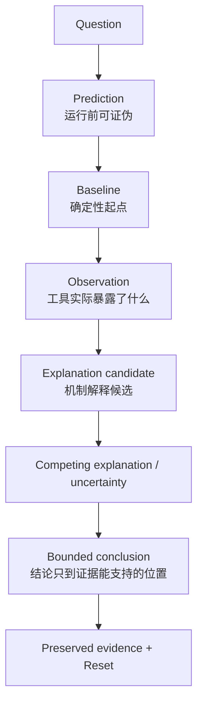
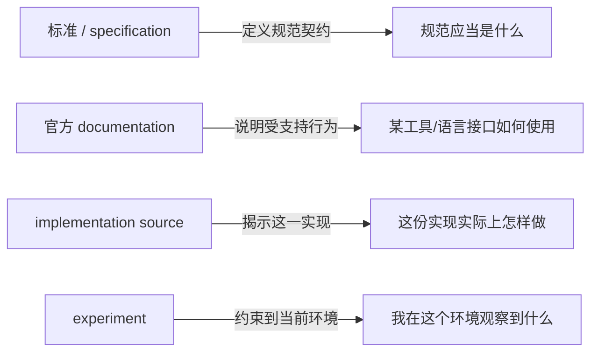

# L00-02｜调查不是“跑一个命令”

## 学习者问题

面对一段不熟悉的代码或行为，你怎样在**不知道答案**的情况下，得到一份别人能复查、自己也能推翻的技术判断？

本课是 Core 中第一次正式练习技术调查（technical investigation）与证据纪律。Shell 和 Git 只是工具；目标是形成一条可重复使用的调查循环。

## 为什么重要

真实系统经常给你不完整证据。一个输出可以证明“我看见了什么”，却未必证明“为什么发生”。如果没有预测、基线、受控变更、diff、重置和不确定性记录，流畅解释很容易变成事后故事。

## 学习目标

你将完成一次完整、受限、可复现的调查：

1. 运行前做预测；
2. 建立确定性 baseline；
3. 检查一个 boundary；
4. **只做一个**可逆 controlled change；
5. 保存 change/diff；
6. 重跑；
7. 把 Observation 与 Explanation 分开；
8. 写一个 competing explanation 或 unresolved uncertainty；
9. reset；
10. 为一个 claim 选择正确 evidence/source layer。

## 前置知识

- L00-01；
- 能按给出的命令运行 Python。

不要求 Git 熟练。你只需要把 `git diff` 当作精确变更记录。

---

## Mental Model｜证据阶梯



**图的教学目的：**把 Observation 和 causal explanation 视觉上分开，防止“一条输出 = 一个原因”的跳跃。

## Mechanism｜最小调查循环

本课使用：

`reproduce → inspect one boundary → change one variable → rerun → preserve → reset`

其中最重要的限制是 **one variable**。如果你同时改 `id`、`delta` 和 `text`，随后看到字节改变，就很难说哪个变化导致了哪一部分差异。

Git 在这里不是课程主题。它只回答一个具体问题：**我到底改了什么？**

## Preflight｜记录环境，不把环境当背景噪声

在 evidence template 的 A 部分记录：

```bash
python3 --version
git --version
```

若环境与课程目标版本不同，就记录实际情况。不要把“应该是 Python 3.12”写成“我已经在 Python 3.12 验证”。

## Predict｜改之前先写预测

先恢复 baseline：

```bash
cd labs/foundations/m00-m01
python3 reset.py
```

**现在不要运行 `change.py`。** 先写：

- 如果只把 `text: "A中"` 改成 `text: "A文"`，你预测 `id` 和 `delta` 的输出会不会变？
- payload 总 byte count 会不会变？
- 哪些 exact bytes 可能改变？如果暂时不知道，写“未知”，不要猜成事实。

## Observe 1｜确定性 baseline

```bash
python3 activity.py run
python3 activity.py inspect
```

在证据模板中抄录必要的输出行，保持原样。不要把整屏日志都粘进去。

你现在有 baseline，但还没有因果结论。

## Inspect One Boundary｜只看表示边界

本次只检查 `serialize_record` 对外暴露的 payload bytes。不要打开 `opaque_store.py` 去研究它如何保存。

问题是：

> “当 tracked input 的一个字段改变时，这个表示边界暴露的 bytes 如何变化？”

这让证据范围保持小而明确。

## Debugger-light Observe｜只停在一个真实函数边界

Canonical M00 还要求你做一次 **debugger-light investigation**。这里不学调试器命令集，只用 Python 标准库自带的 `pdb` 在 `accept_record` 的函数入口停一次，确认“传进接口的真实对象”是什么。

运行：

```bash
python3 -c 'import pdb, activity; pdb.runcall(activity.accept_record, activity.load_input())'
```

进入 `(Pdb)` 后只做两件事：

```text
p raw
c
```

你应观察到 `raw` 包含 baseline 的三个字段：`id=513`、`delta=-2`、`text='A中'`。把“调试器停在 `accept_record`，并看见传入的 baseline record”记到证据模板；**不要**把 `pdb` 语法本身当成学习目标。

这个观察回答的是一个很窄的问题：在这个真实执行点，接口收到的对象是什么。它仍然不自动解释后续 bytes 为什么这样排列，也不证明 save/load 的内部机制。

## Build / Controlled Change｜只改一个变量

运行：

```bash
python3 change.py
git diff -- input.json
```

你应能从 diff 中确认：**只有 `text` 从 `A中` 变成 `A文`。**

如果 diff 里还有别的变化，停止并 reset；不要继续把混合变化当作受控实验。

保存这段 diff。

## Observe 2｜重跑

```bash
python3 activity.py run
python3 activity.py inspect
```

对比 baseline 与 changed condition：

- `INPUT` 哪一项变了？
- `STATE` 哪一项变了？
- payload 的总 byte count 是否变了？
- 哪些 bytes 变了？

## Explain｜Observation ≠ Explanation

请分别写：

**Observation**

> 在 baseline 中我看到……；在只改 `text` 后我看到……；`git diff` 显示唯一 tracked input change 是……。

**Explanation candidate**

> 我认为这些 byte differences 与 text 的 UTF-8 representation 有关，因为……。

**Competing explanation / uncertainty**

> 另一种尚未排除的解释/未知是……；我还需要……证据才能更确定。

如果你还没学 UTF-8，完全可以写：“我现在能确定 bytes 跟着 text 变了，但还不能解释具体 byte pattern。”这比编一个机制更好。

## Reset｜证明你能回到起点

```bash
python3 reset.py
git diff -- input.json
python3 activity.py run
```

如果活动开始前仓库是干净的，`input.json` 的 diff 现在应为空，输出应恢复 baseline。

把 reset 结果记录到 evidence template。

---

## Judge｜一个 claim 应该找哪一层证据？

技术来源不是“越官方越万能”。先问 claim 属于哪一层。



**练习：**为下面 claim 选择最合适的首要 evidence layer，并解释为什么其他层不足。

1. “UTF-8 的编码规则是什么？”
2. “这个 Python 版本的 `int.to_bytes` 接受哪些参数？”
3. “Essential CS 这个 fixture 的 `serialize_record` 如何排列字段？”
4. “我这次运行得到的 baseline bytes 是什么？”

答案不需要只有一个来源，但必须说明**每层能证明什么、不能证明什么**。

## Optional AI Boundary｜AI 只能当未受信假设

如果你使用 AI，可以让它提出一个解释候选，例如“为什么最后几个 bytes 改了”。但把它写在：

> **Untrusted hypothesis — needs verification**

随后用 specification、official docs、implementation source 或 experiment 中合适的一层验证。

AI 输出本身不是 evidence。本课不教授提示工程、模型内部或 AI 工作流。

## Break｜安全地破坏调查质量

想象你一次同时改三个字段，然后只保存最终输出，不保留 diff。问自己：

- 哪个变化导致哪个 observation？
- 另一个人能否重建你的条件？
- 你能否证明“只改了一个变量”？

这就是为什么受控变更与 evidence preservation 是机制的一部分，而不是行政流程。

## Common Misconceptions

### “命令成功运行，所以我的解释正确”

命令成功只说明命令运行了。它不自动支持 causal explanation。

### “Observation 就是 root cause”

Observation 是可观察事实；root cause 是更强的机制 claim，需要额外证据排除竞争解释。

### “官方文档一定比实验更高级”

它们回答不同问题。规范/文档可以定义契约；当前环境的实际行为仍可能需要 experiment。

### “Git 是因为程序员都应该会”

本课只用它保存精确 change record。branch/rebase/复杂历史都不是目标。

### “AI 说得很像，所以可以引用”

不可以。AI 输出只能作为待验证 hypothesis。

## What You Can Ignore—for Now

- Git branching、merge、rebase、hooks；
- Shell 命令大全；
- 调试器高级功能；
- 正式统计推断；
- OS / network / database mechanisms；
- AI 模型与 prompting。

## Progressive Stuck Support

先独立回答 Question。只有卡住时，才按顺序展开后面的提示；不要一次打开全部答案。

### Question

你能证明 baseline 与 changed condition 之间只改变了一个 learner-controlled variable 吗？

<details>
<summary><strong>Hint 1</strong></summary>

运行 `git diff -- input.json`，不要靠记忆描述改动。

</details>
<details>
<summary><strong>Hint 2</strong></summary>

如果 diff 不只一行语义变化，先 `python3 reset.py`，再重新执行 `change.py`。

</details>
<details>
<summary><strong>Expected Observation</strong></summary>

变更前 baseline payload 是 14 bytes；变更后仍是 14 bytes；tracked input 只有 `text` 从 `A中` 变为 `A文`；reset 后 diff 回到空。

</details>
<details>
<summary><strong>Full Explanation</strong></summary>

这个 investigation 的力量来自条件控制：先写 prediction，保存 baseline，再用 diff 证明唯一变量是 `text`，随后比较同一 boundary 的输出。这样你可以可靠地说“在这个 fixture 和环境中，改变这个 text 与这些 output-byte changes 一起出现”。若进一步声称“具体 bytes 为什么这样变化”，还需要 M01 的 UTF-8 representation rule。最后 reset 证明活动能回到同一教学起点。

看过 Full Explanation 后，请换一个新 claim（例如“`id=513` 的 little-endian bytes 是什么”）做短 Transfer，再把它当独立 evidence。

</details>
## Exit Criteria

你能够独立完成并保存：

- prediction；
- deterministic baseline；
- 一个 boundary inspection；
- exactly one controlled/reversible change；
- diff；
- rerun；
- Observation 与 Explanation 分栏；
- 一个 competing explanation / unresolved uncertainty；
- reset；
- 一个 claim 的 evidence/source-layer 选择。

## Competency Mapping

- **Observe：**真实工具输出、边界检查，以及一次只停在函数入口的 debugger-light 观察。
- **Learn-New-Tech：**按 claim 选择 specification/docs/source/experiment。
- **Explain：**把 observation 连接到机制，但不越过证据。
- **Diagnose：**形成并保留可验证 hypothesis；不把它当已证事实。
- **Trace：**复用 L00-01 的 path/boundary map。
- **Judge：**判断一个 claim 应由哪一层 evidence/source 支撑。

## Provenance / Sources

- Investigation loop and evidence packet: Lead-accepted Research Dossier §3, Design §3 and §8.
- Source-layer discipline: `meta/RESEARCH_AND_SOURCE_POLICY.md`.
- Git diff is used only as an implementation/evidence tool; official reference route: https://git-scm.com/docs/git-diff .
- Python 3.12 `pdb` is used only for the bounded debugger-light observation; official reference route: https://docs.python.org/3.12/library/pdb.html .
- AI boundary preserves OQ-BP-001 safe interim state; this Lesson does not close that Open Question.
- All Mermaid visuals are original Essential CS diagrams for Issue #29.
