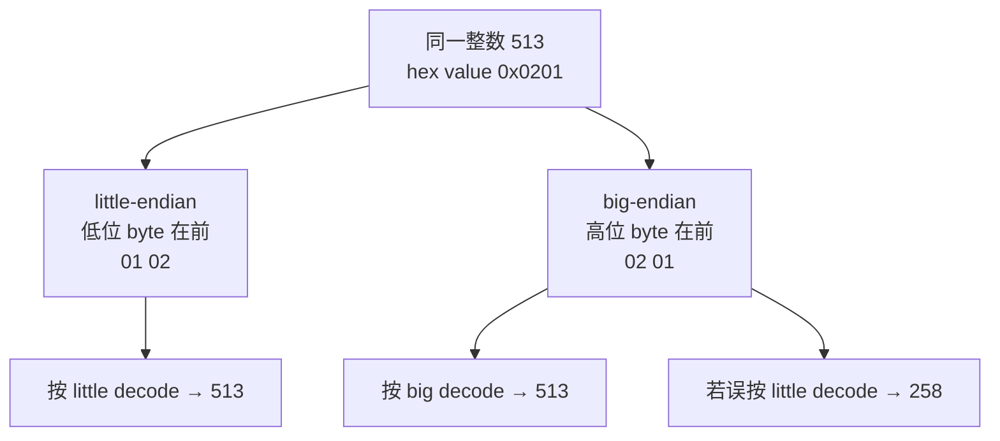

# L01-03｜文本、UTF-8 与 byte order：别把层次揉在一起

## 学习者问题

为什么 `A中` 看起来像两个字符，却占 4 bytes？为什么多字节整数会谈 endianness，而 UTF-8 又不能简单套上“主机是 little-endian”这个说法？

## 为什么重要

文本跨过文件、接口或协议边界时，真正被处理的是某种 encoded representation。若把“可见字符数”“Unicode code point”“UTF-8 bytes”和“multi-byte integer 的 byte order”揉成一层，你会得到看似合理、实际错误的长度估计与解码结论。

这也是后续文件格式、网络消息和数据库字段推理的基础，但本课只处理 representation，不提前教授那些系统机制。

## 学习目标

你将能够区分：

- information / text；
- Unicode code point（在本课需要时）；
- UTF-8 encoded bytes；
- byte count；
- human-visible character；
- multi-byte integer 的 byte order（endianness）。

你还会安全触发一个 truncated UTF-8 failure 和一个 wrong-endian decode。

## 前置知识

- L01-01；
- L01-02 对 fixed-width integer 的基本理解有帮助，但不是理解 UTF-8 的必要前提。

---

## Mental Model 1｜文本到 UTF-8 bytes 的缩放

```mermaid
flowchart TB
    T[文本 information\nA中] --> CP[Code points\nU+0041 · U+4E2D]
    CP --> U8[UTF-8 encoding]
    U8 --> B[encoded bytes\n41 | e4 b8 ad]
    B --> BC[byte count：4]
    V[本例可见字符：2] -. 不等于 .-> BC
```

**图的教学目的：**把“文本意义 / code point / encoded bytes / byte count”分层，而不是把它们叫成同一个“字符”。

在 baseline `A中` 中：

- Python 这个受限例子里有两个 code points：`U+0041`、`U+4E2D`；
- UTF-8 bytes 是 `41 e4 b8 ad`；
- byte count 是 4；
- 在这个简单例子里人看到两个字符。

最后一条**不是普遍字符计数规则**。一个人眼里的单个 grapheme（字素簇）可能由多个 code points 组成。本课把 grapheme segmentation 与 normalization 明确留到停止点，不展开算法。

## Mechanism 1｜UTF-8 是 byte-oriented encoding

Unicode 定义 code points；UTF-8 编码 Unicode scalar values（也就是排除 surrogate code points 后可用于编码的 code points）为 1–4 个 bytes。

最重要的课程结论不是背前缀 bit pattern，而是：

> **UTF-8 encoded text 是一串有明确规则的 bytes；同一个 text/code-point sequence 在 UTF-8 下可被确定地编码并解码回来。**

ASCII 范围中的 `A` → `41`；`中` → `e4 b8 ad`。所以 `A中` 一共 4 bytes。

## Predict Checkpoint｜不要用“字符个数”猜 bytes

在运行前写：

- 你预测 `len("A中")` 在 Python 本例里是多少？
- 你预测 `len("A中".encode("utf-8"))` 是多少？
- 两者为什么可能不同？

## Observe｜exact-byte zoom

```bash
cd labs/foundations/m00-m01
python3 reset.py
python3 activity.py inspect
```

关注：

```text
utf8.text=A中
utf8.code_points=U+0041 U+4E2D
utf8.bytes=41 e4 b8 ad
utf8.byte_count=4
python.len_text=2
```

把 Observation 写成事实，不先写“中文固定 3 bytes”之类泛化。UTF-8 的编码长度取决于 code point；本例 `中` 恰好是 3 bytes。

## Break 1｜截断 UTF-8

运行：

```bash
python3 activity.py break-utf8
```

活动把 `A中` 的最后一个 byte 去掉，形成：

```text
41 e4 b8
```

然后尝试 UTF-8 decode。预期：

```text
break.utf8.error=UnicodeDecodeError
```

解释重点：不是“中文坏了”，而是**这个 byte sequence 不再满足本次 UTF-8 decode 所需的完整编码规则**。

---

## Mental Model 2｜Endianness 是多字节值的排列约定



**图的教学目的：**显示 value 不变，byte-order representation 改变；错误解释规则会产生另一个 value。

## Mechanism 2｜显式 byte order，而不是猜 host order

运行：

```bash
python3 activity.py endian
```

预期：

```text
endian.value=513
endian.little=01 02 decoded=513
endian.big=02 01 decoded=513
```

这里 encode 与 decode 都**显式**指定 byte order。这样 representation contract 不依赖“我这台机器碰巧是什么 endian”。

## Break 2｜bytes 没坏，解释规则错了

```bash
python3 activity.py break-endian
```

预期：

```text
break.endian.bytes=02 01
break.endian.expected=513 decoded_with_wrong_order=258
```

注意这个 failure 和 truncated UTF-8 不同：

- wrong-endian 的两 bytes 本身仍是合法 bytes；
- 但你用了不匹配的 interpretation，所以得到另一个整数。

## UTF-8 与 Endianness 不要混淆

Unicode 官方说明把 UTF-8 定义为 byte-oriented encoding。UTF-8 的 byte stream 不需要像 UTF-16/UTF-32 code units 那样根据主机 endianness 翻转。

因此不要说：

> “我的 CPU 是 little-endian，所以 UTF-8 的 `中` 应该反过来存成 `ad b8 e4`。”

这是错误地把**multi-byte integer byte order**套在**UTF-8 byte sequence**上。

## Explain｜三层描述同一个 baseline

请分别填写：

- Text / information：__________
- Code points（本例需要）：__________
- UTF-8 bytes：__________
- Byte count：__________

再对 `id=513` 填：

- Logical integer：__________
- little-endian bytes：__________
- big-endian bytes：__________

## Build｜只改文本，观察 representation 怎样变

先恢复 baseline，然后做课程规定的单一可逆改动：

```bash
python3 reset.py
python3 change.py
python3 activity.py inspect
```

`change.py` 只把 `A中` 改为 `A文`。运行前先预测：

- 哪个 Unicode code point 会改变？
- UTF-8 exact bytes 会怎样改变？
- byte count 会不会改变？
- integer fields / byte-order rules 会不会改变？

观察后把结果写进 evidence template C3。这里的目标是看到：**information 改变时，representation 内容可以改变，而 representation rule 本身不必改变。**

完成后：

```bash
python3 reset.py
```

## Judge｜错误发生在哪一层？

分类：

1. `41 e4 b8` 用 UTF-8 decode 失败；
2. `02 01` 按 little-endian 得到 258；
3. 人看到一个 emoji，但程序报告多个 code points。

本课可以完整解释 1、2；对 3 只需指出“visible character / grapheme segmentation 更复杂，超出本课范围”，不要提前展开 Unicode segmentation curriculum。

---

## Common Misconceptions

### “一个字符就是一个 byte”

UTF-8 是可变长度编码；本例两个可见字符占 4 bytes。

### “一个 code point 永远等于一个人眼字符”

不是。grapheme segmentation 是更高一层的问题，本课只做停止点提醒。

### “UTF-8 跟着 CPU endianness 变”

错误。UTF-8 是 byte-oriented sequence；不要把整数 byte-order rule 套上去。

### “只要 decode 成功，就证明原文本语义正确”

decode 只回答 encoding validity/interpretation 层的问题，不证明文本在业务语义上正确。

### “Unicode 就是 UTF-8”

Unicode 是字符编码标准体系；UTF-8 是其中一种 encoding form。

## What You Can Ignore—for Now

- grapheme-cluster segmentation algorithm；
- Unicode normalization（NFC/NFD 等）；
- collation / locale；
- 字体 shaping/rendering；
- UTF-16/UTF-32 细节；
- BOM edge cases beyond knowing UTF-8 byte order itself is not host-endian dependent。

## Progressive Stuck Support

先独立回答 Question。只有卡住时，才按顺序展开后面的提示；不要一次打开全部答案。

### Question

为什么 `A中` 的 `python.len_text=2` 与 `utf8.byte_count=4` 不矛盾？

<details>
<summary><strong>Hint 1</strong></summary>

一个计数发生在 Python string/code-point-like sequence 层，一个发生在 encoded bytes 层。

</details>
<details>
<summary><strong>Hint 2</strong></summary>

查看 `U+0041 → 41` 与 `U+4E2D → e4 b8 ad`。

</details>
<details>
<summary><strong>Expected Observation</strong></summary>

`A中` → code points `U+0041 U+4E2D` → UTF-8 bytes `41 e4 b8 ad`; byte count 4。错误 endian decode 把 `02 01` 解释成 258；截断 UTF-8 产生 `UnicodeDecodeError`。

</details>
<details>
<summary><strong>Full Explanation</strong></summary>

同一文本可以先用 Unicode code points 描述，再按 UTF-8 编成 bytes；不同层的“长度”不是同一个量。整数 513 则是另一种信息：当它需要 2-byte representation 时，byte order 决定高低位 byte 排列。UTF-8 自身已经定义 byte sequence，不根据 CPU endianness 反转。两类问题都属于 representation，但解释规则不同。

看过 Full Explanation 后，用 `A文` 的 changed input 重新预测并检查 UTF-8 bytes。

</details>
## Exit Criteria

你能够：

- 区分 text / code point / UTF-8 bytes / byte count / visible character；
- 写出 baseline `A中` 的 exact UTF-8 bytes；
- 解释 513 的 little/big endian bytes；
- 诊断 wrong-endian 与 truncated-UTF-8 两种不同 failure；
- 明确说出 grapheme/normalization 是本课停止点。

## Competency Mapping

- **Explain：**UTF-8 与 endianness representation rules。
- **Trace：**text/value → encoded bytes → decode。
- **Diagnose：**mismatched byte order / truncated UTF-8。

## Provenance / Sources

- Unicode Standard 17.0, §3.9 Unicode Encoding Forms (SPECIFICATION): https://www.unicode.org/versions/Unicode17.0.0/ .
- Unicode UTF-8/UTF-16/UTF-32 & BOM FAQ (official explanatory source; UTF-8 is byte-oriented and has no host-endian reversal): https://www.unicode.org/faq/utf_bom.html .
- Python 3.12 integer byte-order API (IMPLEMENTATION): https://docs.python.org/3.12/library/stdtypes.html .
- Scope/stopping points: accepted Research Dossier §4.4–4.6 and Design §4.
- Both Mermaid visuals are original Essential CS material.
