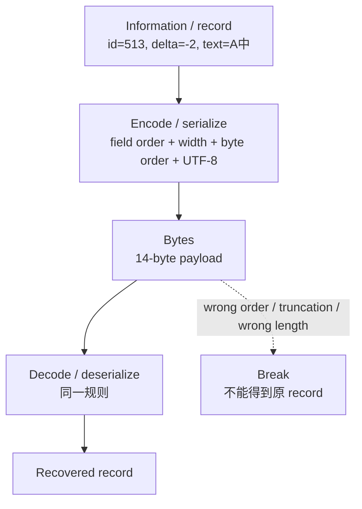

# L01-04｜序列化：能还原，才知道规则够不够

## 学习者问题

把多个字段连成一串 bytes 后，解码器怎么知道哪里是 `id`、哪里是文本？我们怎样估计大小，并发现“看起来像 bytes”却无法可靠还原的格式？

## 为什么重要

单个 integer/text 的 representation 只是起点。真实系统需要把多个字段放进一个可交换、可保存或可传递的 representation。这个过程叫 **serialization（序列化）**。

本课只做一个 bounded record。我们使用“这个性质应该保持”之类普通语言描述 round trip；**Specification / Invariant / Correctness 的 canonical definitions 仍然留在 M02 L02-03。**

## 学习目标

你将能够：

- 解释 serialization 为什么需要明确 field boundaries；
- 在运行前做 byte-size estimate；
- 对一个 compact record 执行 `encode → bytes → decode` round trip；
- 说明 round trip 能证明什么、不能证明什么；
- 触发一个 bounded break case；
- 把 P0 连接限制在 process-local data / representation / opaque save-load boundary。

## 前置知识

- L01-01；
- L01-02、L01-03 的整数、UTF-8、endianness 会在本课整合。

---

## Mental Model｜Serialization 是有边界的 pipeline



**图的教学目的：**明确 round-trip 的两个方向依赖同一组 representation rules；在 mismatch/truncation 处标出失败点。

## Mechanism｜本活动的 compact record

这是 Essential CS 为本课原创的教学格式：

```text
magic(4) | id:u16(2) | delta:i16(2) | text_len:u16(2) | text:utf8(variable)
```

canonical byte order：前三个 16-bit numeric fields 都使用 **little-endian**。

baseline：

```text
id    = 513
delta = -2
text  = "A中"
```

## Predict Checkpoint 1｜先估大小

在运行 `inspect` 前计算：

```text
fixed bytes = 4 + 2 + 2 + 2 = ?
text UTF-8 bytes = ?
total = ?
```

你已经从 L01-03 知道 `A中` 的 UTF-8 byte count；把假设明确写出。

## Observe｜用 exact bytes 对账

```bash
cd labs/foundations/m00-m01
python3 reset.py
python3 activity.py inspect
```

baseline 应显示：

```text
record.hex=45 43 53 31 01 02 fe ff 04 00 41 e4 b8 ad
```

以及 `text` field size 4。检查你的 estimate 是否等于 14 bytes。

若不一致，不要只改答案；找出是哪一个 assumption 错了。

## Mechanism｜field boundary 为什么不能靠猜

如果格式只是：

```text
[id bytes][text bytes]
```

而 id/text 都是可变长度，decoder 怎样知道边界？你至少需要某种规则：固定宽度、长度前缀、delimiter、schema/context 等。

本活动采用：

- fixed-width `id` / `delta`；
- fixed-width `text_len`；
- `text_len` 告诉 decoder 后面读取多少 UTF-8 bytes。

这不是“唯一正确 serialization design”，只是一个足够小、边界清楚的教学选择。

## Round Trip｜这个性质应该保持

运行：

```bash
python3 activity.py run
```

你会看到：

```text
ROUNDTRIP ok=True
```

这里检查的是 bounded property：

```text
decode(encode(valid_record)) == valid_record
```

对**本活动允许的 record domain 和这组 encode/decode rules**，这个性质应该保持。

它不等于：

- “这个格式已经适合所有未来数据”；
- “所有坏输入都处理正确”；
- “save/load 一定 durable”；
- “整个程序已经正确”；
- “一个成功样例证明了所有情况”。

## Build｜把 controlled change 带进 size/round-trip reasoning

从 baseline 开始：

```bash
python3 reset.py
python3 change.py
python3 activity.py inspect
python3 activity.py run
```

唯一 tracked input change 是 `A中 → A文`。

预测并检查：

- text UTF-8 bytes 是否改变？
- text byte count 是否改变？
- total record size 是否改变？
- round trip 是否仍成立？

这个例子刻意选择了两个都占 3 UTF-8 bytes 的汉字，所以**representation 内容变化而 size 不一定变化**。这能阻止“内容不同 = size 一定不同”的错误直觉。

完成后：

```bash
python3 reset.py
```

## Break｜声明长度与实际 payload 不一致

运行：

```bash
python3 activity.py break-record
```

活动先生成合法的 14-byte record，再删除最后一个 byte，但**保留原来的 `text_len=4` 声明**。预期：

```text
break.record.original_bytes=14
break.record.truncated_bytes=13
break.record.error=ValueError: record length does not match text_len
```

这里的重点不是记错误文字，而是看 decoder 如何利用 field boundary / length rule 拒绝一个不完整 representation。

这说明 round trip 依赖 encoder/decoder 对 representation contract 的一致理解，也依赖 payload 满足该 contract。

作为迁移复习，你仍可运行：

```bash
python3 activity.py break-endian
python3 activity.py break-utf8
```

分别观察“解释规则不一致”和“UTF-8 byte sequence 被截断”这两类不同 failure。

## Size Estimation｜先算数量级，再观察

对 `N` 条、每条 text UTF-8 长度为 `T_i` bytes 的同格式 record，仅计算**application payload**，粗略总量是：

```text
sum(10 + T_i) bytes
```

若所有 text 平均约 `T` bytes：

```text
N × (10 + T) bytes
```

这是 representation-level estimate，不包含容器、Python object overhead、opaque persistence implementation、filesystem metadata 或其他后续机制。

明确 assumption 比给出更多小数位更重要。

---

## P0 Connection｜集成面，不是前置课程

本活动可以当作最早的 P0 integration surface：

学习者现在可以拥有：

- process-local record shape；
- process-local state transition；
- representation / serialization；
- bounded round-trip check；
- byte-size estimate。

课程提供并保持 opaque 的是 save/load boundary。你可以运行：

```bash
python3 activity.py run
python3 activity.py load
```

如果后一次调用取回记录，你可以准确写：

> “在这次 fixture / environment / 操作下，later invocation 通过课程提供的 load boundary 返回了先前记录。”

不要升级成：

> “这证明了 durability。”

持久性（Durability）的 canonical first home 是 M09 L09-01；当前课程明确不提前教授其 failure bound 或底层机制。

## Explain｜把 property 的边界写完整

完成：

> 对本活动允许的 record，当 encoder 与 decoder 使用相同的 field order、width、little-endian rules 和 UTF-8 rule 时，`decode(encode(record))` 应返回 ________。这项 observation 不能证明 ________。

## Judge｜两个 serialization 方案

在这个受限问题下比较：

- 方案 A：本活动的 fixed-width + length-prefix format；
- 方案 B：把三个字段直接拼成一段无 delimiter、无长度、可变长度文本。

约束：decoder 必须无歧义恢复字段。

指出哪个方案缺少什么边界信息。不要扩展到 JSON/Protobuf/数据库选型课。

---

## Common Misconceptions

### “Serialization 就是转成 string”

不是。serialization 是把结构化信息变成某种可传递 representation；bytes/string 只是可能的表面形式。

### “有 length field 就什么都安全了”

length 只是一个规则；仍需范围、有效 encoding、完整 payload 等条件。

### “一次 round trip 成功 = 格式正确”

一次样例只提供一份证据。还要看 boundary cases、invalid inputs 和 contract assumptions。

### “文件大小就是我算出的 payload size”

本课 estimate 只针对 application payload。其他层的 overhead 明确不在模型里。

### “另一次调用还能 load = durable”

错误。restart-visible observation 不等于在命名 failure model 下的 durability guarantee。

## What You Can Ignore—for Now

- SQL / database engine；
- transactions / WAL / journaling；
- filesystem writeback / fsync；
- crash/power-loss recovery；
- schema migration frameworks；
- compression；
- network protocol framing；
- formal definitions of Specification / Invariant / Correctness（M02 L02-03）。

## Progressive Stuck Support

先独立回答 Question。只有卡住时，才按顺序展开后面的提示；不要一次打开全部答案。

### Question

为什么 baseline total size 是 14，而不是“2 个字符所以 text=2 bytes，总共 12”？

<details>
<summary><strong>Hint 1</strong></summary>

先把 fixed fields 加起来：4 + 2 + 2 + 2。

</details>
<details>
<summary><strong>Hint 2</strong></summary>

`A中` 的 UTF-8 bytes 是 `41 e4 b8 ad`。

</details>
<details>
<summary><strong>Expected Observation</strong></summary>

fixed fields = 10 bytes；text = 4 bytes；total = 14 bytes。baseline round trip 为 True；`A文` change 后 total 仍是 14 bytes，但 text bytes 改为 `41 e6 96 87`。

</details>
<details>
<summary><strong>Full Explanation</strong></summary>

serialization 需要让 decoder 知道每个 field 的位置、宽度和解释规则。本格式用固定 numeric widths + text length prefix + UTF-8 形成无歧义的 bounded record。size estimate 由各 field byte count 相加得到。round trip 检查 encoder/decoder 在有效 domain 上是否能把同一 record 还原；wrong byte order、truncation 或错误 length 都可能破坏这条性质。它仍然不证明持久性、系统整体正确性或所有输入覆盖。

看过 Full Explanation 后，自己构造一个短 ASCII text（不改 repository baseline）手算 size，再用函数在 REPL 验证。

</details>
## Exit Criteria

你能够：

- 解释 serialization 与 field boundary；
- 在运行前估 baseline payload size；
- 对 exact bytes 与 estimate 对账；
- 描述 bounded round-trip property 及其限制；
- 解释至少一个 break case；
- 保持 P0 persistence opaque，并拒绝把 later-load observation 称作 durability proof。

## Competency Mapping

- **Estimate：**application-payload byte size with assumptions。
- **Explain：**serialization / field-boundary / round-trip mechanism。
- **Correctness：**仅练习 bounded representation property；canonical definitions 留在 M02。
- **Diagnose：**定位 wrong order / truncation / boundary mismatch。
- **Trace：**record → bytes → record；P0 只到 opaque boundary。
- **Judge：**在“decoder 必须无歧义恢复字段”的约束下比较 bounded serialization choices。

## Provenance / Sources

- Accepted Research Dossier §§4.5–4.8, 11–12; accepted Design §§4, 8–9.
- Python byte-order behavior used by this fixture: https://docs.python.org/3.12/library/stdtypes.html .
- Unicode UTF-8 encoding source route: https://www.unicode.org/versions/Unicode17.0.0/ and https://www.unicode.org/faq/utf_bom.html .
- Compact record format, code, tests, examples, and Mermaid visual are original Essential CS Issue #29 material.
- No third-party data format or figure is copied/adapted.
