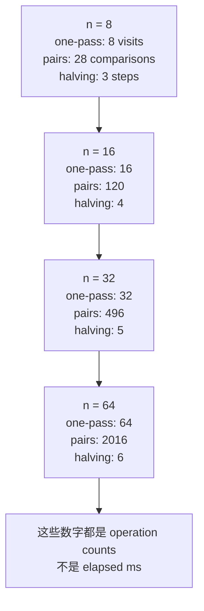

# L02-01｜在跑 benchmark 之前，我们怎么知道工作量会怎样增长？

## 学习者问题

当输入从 8 条 records 变成 80、8,000、800,000 条时，我们怎样在**还没有计时**之前，先判断一段过程的工作量会怎样增长？

这一课从 concrete operation counts 开始，最后才给它们贴上渐近复杂度（asymptotic complexity）的符号。

## 为什么重要

后面的系统课程会反复遇到“规模扩大后会不会出问题”。如果你只看一次毫秒数，就很容易把当前机器、当前解释器、当前输入的 timing 当成算法本身的性质。

M02 先训练另一种能力：明确 `n`、明确你在数什么、比较输入规模变化时**count 怎样增长**，再做数量级估算。benchmark 是后面的测量证据；Big-O 不是 stopwatch 的别名。

## 学习目标

你将能够：

- 定义输入规模 `n`；
- 指定一个有意义的 dominant counted operation；
- 为 one pass、nested pair work、repeated halving 建立 concrete count table；
- 从 counts 归纳 bounded asymptotic classification；
- 用 powers of two / repeated halving 理解 `log n`；
- 做一次带单位与 assumptions 的 order-of-magnitude estimate；
- 明确区分 operation-count growth 与 elapsed milliseconds；
- 解释为什么 `O(n)` 不保证对每个具体输入都比 `O(n²)` 快。

## 前置知识

- M00：prediction → observation → bounded conclusion；
- 基本 Python loops / functions；
- M01 已完成会更顺，但本课的 hard prerequisite 只有 M00。

---

## Mental Model｜先固定“规模”和“工作单位”

把复杂度问题拆成三件事：

```text
input size n
    +
counted operation
    ↓
count as n changes
    ↓
growth classification + rough estimate
```

例如 exact-key list lookup：

- `n` = list 中 records 数量；
- counted operation = 一次 `record.key == target` comparison；
- 问题 = target 在不同位置、不同 `n` 下要做多少次 comparison？

如果你连“数什么”都没定义，`O(...)` 就很容易变成没有模型边界的标签。

## Mechanism 1｜One pass：每条只看一次

最透明的例子：

```python
for record in records:
    inspect(record)
```

若 `inspect(record)` 每次算一个 record visit，那么：

| `n` | record visits |
|---:|---:|
| 8 | 8 |
| 16 | 16 |
| 32 | 32 |
| 64 | 64 |

`n` 翻倍，count 也翻倍。

我们随后把这种增长写成：

```text
O(n)
```

这里的重点不是字母 `O`，而是你已经先看见了**线性增长**。

> **Accuracy note：**严格地说，Big-O 是 asymptotic upper bound，不是 exact equation，也不自动表示 tight bound。本课对这些透明 examples 使用最有信息量的常见 `O(...)` label 来做 bounded classification；重点仍是先从 count table 看增长。

## Mechanism 2｜Nested pair work：两两比较

假设要把每对不同 records 比一次：

```text
record 0 compares with 1..n-1
record 1 compares with 2..n-1
...
```

总 count：

```text
(n - 1) + (n - 2) + ... + 1
= n(n - 1) / 2
```

活动 fixture 的 exact counts：

| `n` | pair comparisons |
|---:|---:|
| 8 | 28 |
| 16 | 120 |
| 32 | 496 |
| 64 | 2,016 |

`n` 大约翻倍时，count 大约变成四倍。我们把 dominant growth 记作：

```text
O(n²)
```

常数 `1/2` 和较小的 `-n/2` 项对大规模 growth 的分类不改变主导形状；但它们仍可能影响具体规模下的工作量。

## Mechanism 3｜Repeated halving：每一步砍掉一半

现在换一个完全不同的过程：每一步把剩余候选规模减半。

```text
64 → 32 → 16 → 8 → 4 → 2 → 1
```

这需要 6 次 halving。

| `n` | halving steps |
|---:|---:|
| 8 | 3 |
| 16 | 4 |
| 32 | 5 |
| 64 | 6 |

当 `n` 从 8 翻到 16，只多 1 步；从 16 翻到 32，也只多 1 步。

这就是 `log₂ n` 的直觉：

> **“把 `n` 连续除以 2，多少次能到 1？”**

对 powers of two：

```text
2^k = n  ⇔  k = log₂ n
```

所以这类增长记作：

```text
O(log n)
```

本课不做 formal logarithm proof。你只需要能把 log 读成“repeated halving 的步数”。

## Growth-by-count Visual｜图里是 counts，不是时间



**图的教学目的：**让你在同一列规模上看到不同 growth shape，同时明确阻止“Big-O = 毫秒”的误读。

---

## Learner Aid｜powers、halving 与数量级

记几个粗略锚点即可：

| power | approximate decimal size | intuition |
|---:|---:|---|
| `2^10` | `≈ 10^3` | 千 |
| `2^20` | `≈ 10^6` | 百万 |
| `2^30` | `≈ 10^9` | 十亿 |
| `2^40` | `≈ 10^12` | 万亿 |

所以：

- `n ≈ 10^6` 时，repeated halving 大约 20 步；
- `n ≈ 10^9` 时，大约 30 步；
- `n` 增大 1,000 倍，`log₂ n` 只增加大约 10。

数量级估算（order-of-magnitude estimate）不是追求最后一位精度，而是先判断 `10^3 / 10^6 / 10^9 / 10^12` 这种尺度。

## Predict｜先算，再运行

进入 M02 activity：

```bash
cd labs/foundations/m02
python3 activity.py reset
```

**现在不要运行 `counts`。** 先在 evidence template 写出：

1. `n=64` 的 one-pass count；
2. `n=64` 的 pairwise count；
3. `n=64` 需要多少次 halving 到 1；
4. 三者的单位分别是什么；
5. 哪一个问题可以仅凭这些 counts 回答，哪一个问题仍需要 timing measurement。

然后运行：

```bash
python3 activity.py counts
```

## Observe｜对账 exact counts

你应看到：

```text
COUNTS 8 8 28 3
COUNTS 16 16 120 4
COUNTS 32 32 496 5
COUNTS 64 64 2016 6
COUNTS labels one_pass=O(n) nested_pairs=O(n^2) halving=O(log n)
```

这里活动明确写了：

```text
model=explicit teaching operations; not elapsed milliseconds
```

如果你的预测错了，先定位是哪一步 count reasoning 错，不要直接把 label 背下来。

## Explain｜从 counts 到 asymptotic label

对本课三个 transparent mechanisms：

- one pass：count 随 `n` 成比例增长 → `O(n)`；
- all unordered pairs：主导项约 `n²/2` → `O(n²)`；
- repeated halving：每翻倍只多一步 → `O(log n)`。

Big-O 在这里描述的是**输入变大时 work 的上界增长形状**。它不是：

- 某次运行的 exact operation count；
- 某台机器的 milliseconds；
- 一个算法的全部性能故事；
- “凡是同一 Big-O 就一样快”。

## Order-of-magnitude Estimate｜一百万条 records

假设 `n = 1,000,000`，仍用本课的透明 count model：

### One pass

```text
≈ 10^6 record visits
```

### All pairs

```text
n(n-1)/2 ≈ 5 × 10^11 pair comparisons
```

### Repeated halving

```text
≈ 20 halving steps
```

这三个 estimate 的**单位不同**。你不能把 `5×10^11 pair comparisons` 自动换成“多少秒”，除非你另有测量模型与环境证据。

但它已经足以做一个很强的前置判断：在同样规模下，all-pairs work 的增长压力与 repeated halving 完全不是一个级别。

---

## Judge｜`O(n)` 一定比 `O(n²)` 快吗？

不一定，尤其对具体的小 `n`。

设两个透明 work model：

```text
A(n) = 1000n
B(n) = n²
```

当 `n=10`：

```text
A = 10,000 work units
B = 100 work units
```

此时 quadratic model 的 count 反而更小。

当 `n=2,000`：

```text
A = 2,000,000
B = 4,000,000
```

这时 linear model 才占优。

所以 asymptotic notation 告诉你**增长趋势**，不是每个具体规模下的赢家。常数、输入范围、workload 和 implementation effects 都会影响具体工程选择；实际 elapsed time 还需要后续的 measurement discipline。

## Break｜故意把 stopwatch 当 Big-O，会错在哪里？

假设你跑一次程序：

```text
n=10,000 → 3.2 ms
```

仅凭这一行，你无法判断它是：

- `O(n)`；
- `O(n log n)`；
- `O(n²)` 但当前 `n` 还小；
- 甚至 dominated by fixed startup cost。

要推断 growth，至少要有明确 operation model 或多个规模下受控 evidence。单点 elapsed time 没有告诉你输入扩大时 count 如何变化。

---

## Common Misconceptions

### “Big-O 就是 milliseconds”

不是。Big-O 描述随输入规模变化的 growth bound；milliseconds 是某个 implementation 在某个环境、某个 workload 下的 elapsed-time observation。

### “`O(n)` 永远比 `O(n²)` 快”

不是。前面的 `1000n` vs `n²` 反例说明具体 `n` 与 constants 可能让较差 asymptotic class 在小范围内 count 更少。

### “`O(1)` 就是只做一条 CPU 指令”

不是。`O(1)` 只表示这个模型中的 work 不随 `n` 增长；constant work 本身可以包含多步实现细节。

### “Exponential 就等于 impossible”

不是。`2^10 = 1024` 完全可能可处理；`2^50 ≈ 1.1×10^15` 则可能对某 workload 极其昂贵。exponential 描述 growth 很快，不是逻辑上的“不可能”。

### “算 operation counts 就不需要 benchmark”

也不是。counts 先回答 growth/model 问题；具体 elapsed time、variation、runtime effects 属于 measurement 问题，M04 会正式处理。

## What You Can Ignore—for Now

- Master theorem；
- recurrence catalogs；
- formal asymptotic proofs；
- amortized-analysis 深入证明；
- CPU/cache/locality mechanisms；
- benchmark statistics；
- competitive-programming algorithm repertoire。

## Progressive Stuck Support

先独立回答 Question。只有卡住时，按顺序展开；不要一次打开全部。

### Question

如果一个过程每次把候选规模减半，`n=1,048,576 = 2^20` 时要多少次 halving 到 1？这说明什么 growth？它说明多少 milliseconds 吗？

<details>
<summary><strong>Hint 1</strong></summary>

把 `2^20` 连续除以 2；每除一次，指数减 1。

</details>

<details>
<summary><strong>Hint 2</strong></summary>

`2^20 → 2^19 → ... → 2^0`。数的是 halving steps，不是 wall-clock time。

</details>

<details>
<summary><strong>Expected Observation</strong></summary>

需要 20 次 halving。powers of two 每翻倍一次，只让 step count 加 1；这对应 `O(log n)` 的增长直觉。

</details>

<details>
<summary><strong>Full Explanation</strong></summary>

`log₂ n` 可以读成“把 `n` 连续减半到 1 需要多少步”。当 `n=2^20`，答案是 20。这个 count model 支持我们把 repeated-halving work 分类为 `O(log n)`。它仍然没有给出 milliseconds，因为每一步在真实 implementation 中耗时多少、运行环境是什么、是否有其他固定成本，都没有由这个 count 证明。

看过 Full Explanation 后，换成 `2^30` 独立完成一次 Transfer，并写清单位。

</details>

## Exit Criteria

你能够独立：

- 写出 `n` 与 counted operation；
- 建立至少三种 concrete count table；
- 从 counts 解释 `O(n)` / `O(n²)` / `O(log n)`；
- 用 powers-of-two 做 repeated-halving reasoning；
- 完成一次带单位与 assumptions 的数量级 estimate；
- 拒绝把单次 elapsed milliseconds 当 Big-O 证明；
- 给出一个“较好 asymptotic class 不保证每个具体 `n` 都更快”的反例。

## Competency Mapping

- **Estimate：**operation-count table 与 order-of-magnitude work estimate。
- **Explain：**从 transparent mechanism 解释 growth，而不是背符号。
- **Judge：**判断一个 timing claim 是否超出 operation-count evidence。
- **Trace：**沿 loop / comparison / halving 路径追踪 count 如何累积。

## Provenance / Sources

- Main curriculum source map: accepted Foundations/System Mechanics Research Dossier §5 and Design §5/§8.
- Open Data Structures: asymptotic notation and selected data-structure analysis as a classic/open teaching anchor: https://opendatastructures.org/ .
- MIT Mathematics for Computer Science: bounded designer reference for asymptotic/invariant reasoning; the proof-heavy discrete-math sequence is not imported into learner prerequisites: https://ocw.mit.edu/courses/6-1200j-mathematics-for-computer-science-spring-2024/ .
- Cornell CS2110 notes: classic teaching reference for searching/asymptotic complexity; used as a source anchor, not copied prose: https://www.cs.cornell.edu/courses/cs2110/2014sp/lecturenotes.html .
- Counts, examples, code, and Mermaid visual in this Lesson are original Essential CS Issue #38 material.
