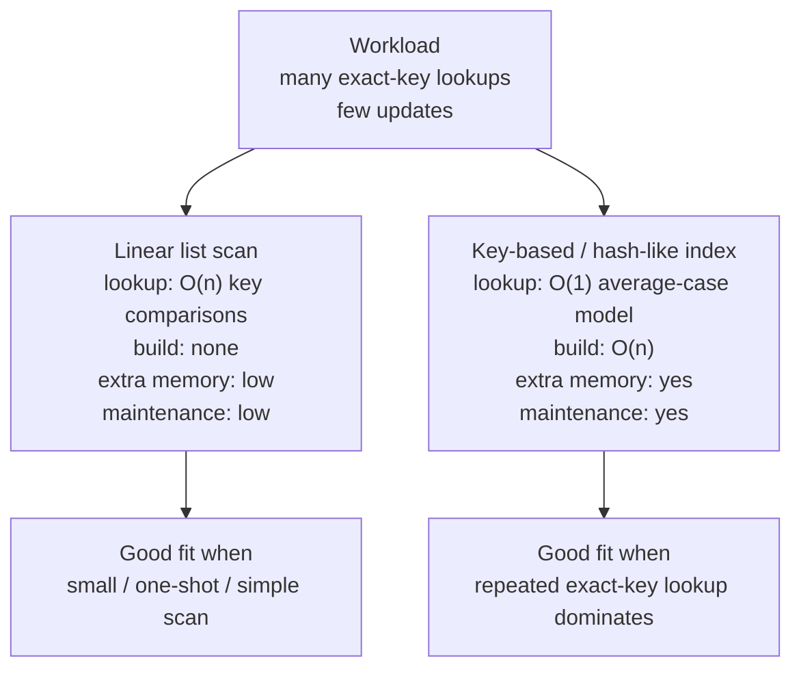

# L02-02｜为什么 lookup 会慢？什么时候应该换一种结构？

## 学习者问题

同样是“按 key 找一条 record”，为什么有时我们沿 list 一条条扫描，有时要维护额外的 key-based index？哪一种才是“更好”的选择？

答案不能只写一个 Big-O。你必须先说清 workload、约束、要优化的 operation，以及为了 gain 把 cost 移到了哪里。

## 为什么重要

真实工程很少有“永远最快”的结构。一个选择可能降低 lookup growth，却增加 build、memory、maintenance 或 状态维护责任。只背“hash 是 `O(1)`”会把真正的工程判断隐藏掉。

这一课第一次正式引入：

> **权衡（Trade-off，EC-CON-006）**：在一个明确约束下，获得某种性质会改变成本、风险、复杂度或另一种性质。Trade-off 不是无约束的“优缺点列表”，也不是个人偏好。

## 学习目标

你将能够：

- 对同一个 logical operation 比较 linear list scan 与 key-based/hash-like lookup；
- 写明 workload、`n`、counted operation 与 growth assumption；
- 区分 lookup gain 与 build/maintenance/memory cost；
- 解释为什么 hash-like lookup 不是“免费”；
- 写出一个完整 Trade-off：gain + cost + constraint + **When NOT to use**；
- 在一个 transfer workload 中说明 asymptotic notation 为什么不能单独决定 measured engineering performance。

## 前置知识

- L02-01：operation counts、growth、order-of-magnitude；
- M00 的 Interface / Abstraction / State 概念可在本课复用；
- 不需要知道 hash-table implementation internals。

---

## Mental Model｜先问 workload，再问结构

选择结构时使用这条顺序：

```text
workload
  ↓
important operation
  ↓
input size n + growth
  ↓
alternative interfaces
  ↓
gain / cost / constraint
  ↓
Trade-off judgment
```

**不要**反过来从“我知道 dict 很快”开始。

本课统一使用一个 bounded workload：

> 一个进程内 record collection，records 有唯一 string key。collection 建好后会进行许多 exact-key lookup，偶尔更新既有 key；不教授 persistence。

## Mechanism 1｜Linear list scan

逻辑接口：

```text
lookup(key) → record or missing
```

list implementation 从第一条开始比较：

```python
for record in records:
    if record.key == key:
        return record
```

本课 counted operation：一次 `record.key == key` 算一个 **key comparison**。

若 target 在最后：

| `n` | key comparisons |
|---:|---:|
| 8 | 8 |
| 64 | 64 |
| 1,024 | 1,024 |

增长：`O(n)`。

好处也很真实：

- data structure 简单；
- 没有额外 index build；
- 没有 index 与 records 同步的额外同步约束；
- 对 tiny / one-shot workload，简单可能就是正确约束下的选择。

## Mechanism 2｜Key-based / hash-like index

现在额外维护：

```text
key → record position
```

activity 用 Python `dict` 实现这个 bounded interface，但我们只数一次：

```text
index.get(key) = 1 logical key probe
```

这只是**教学 operation model**。它绝不表示：

- hashing 是一条 CPU instruction；
- equality check 不存在；
- memory access 免费；
- collision 不存在；
- Python `dict` 的所有情况都由一个 `1` 解释。

在常见平均情况模型下，hash-like exact-key lookup 的 growth 可以近似写作 `O(1)`；但建立 index 仍要扫描 `n` 条 records，约 `O(n)` build work，并占用额外 memory，还要在 mutation 后维护一致性。

---

## Interface / Workload Matrix｜同一 logical operation，不同 cost destination



更精确地看：

| workload question | linear list scan | key-based/hash-like index |
|---|---|---|
| Exact-key lookup growth | `O(n)` comparisons | `O(1)` average-case lookup model |
| Initial build | none beyond list | `O(n)` index insertions |
| Extra memory | little beyond records | extra key→position structure |
| Mutation maintenance | list only | records + index must agree |
| State-maintenance obligation | unique-key rule still matters | unique-key + index synchronization rule |
| Tiny one-shot workload | often reasonable | may be needless complexity |
| Many repeated exact lookups | growth becomes costly | often strong fit |
| When NOT to use | when repeated scan dominates at scale | when tiny/short-lived, memory constrained, rebuild-heavy, or lookup not dominant |

**图/表的教学目的：**同一个 `lookup(key)` Interface 可以由不同 Representation/State 组织实现；更低的 lookup growth 不是凭空出现，它把成本移到 build、memory、maintenance 与 状态维护责任。

## Predict｜同一 target，先写 count

进入 activity：

```bash
cd labs/foundations/m02
python3 activity.py reset
```

先预测 target 位于 list 最后一条时：

- `n=8`：linear key comparisons = ?
- `n=64`：linear key comparisons = ?
- `n=1024`：linear key comparisons = ?
- index build insertions = ?
- key-based path 的 logical probe model = ?

再运行：

```bash
python3 activity.py compare
```

## Observe｜exact deterministic evidence

关键输出：

```text
LOOKUP 8 r0007 8 1 8
LOOKUP 64 r0063 64 1 64
LOOKUP 1024 r1023 1024 1 1024
LOOKUP note=indexed_count is a logical interface probe, not free machine work
```

这些列**不能直接当同一种机器 operation 相加**。linear 列数的是 key comparisons；index build 数 logical insertions；indexed lookup 数 interface-level logical probes。

它们的价值是让增长与一次性/持续性成本都变得显式。

---

## Trade-off｜把约束写进句子

考虑 workload：

```text
n = 1,024 records
collection 建好后执行 100 次 exact-key lookup
update 很少
memory 不是当前首要约束
```

若 target 经常在 list 后部，linear scan 的 lookup work 可能接近：

```text
100 × 1,024 ≈ 10^5 key comparisons
```

而 key-based path 需要：

```text
一次 O(n) index build
之后每次 lookup 按 O(1) average-case logical probe model
```

一个合格 Trade-off statement 应类似：

> 在“collection 建好后会执行许多 exact-key lookup、memory 可接受、mutation 很少”的约束下，维护 key-based index 可以把 lookup growth 从 linear scan 的 `O(n)` 降到 average-case `O(1)` model；代价是一次 `O(n)` build、额外 memory、mutation maintenance，以及必须保持 index/records 一致的新 状态维护责任。

注意：这不是“hash 有优点也有缺点”的空泛列表；它明确了**什么 workload 使 gain 值得 cost**。

## When NOT to use｜把拒绝条件也写出来

如果 workload 变成：

```text
n = 8
只 lookup 1 次
随后 collection 丢弃
```

你不能只因为 `O(1) < O(n)` 就断言“必须建 index”。

list worst-case 只有 8 次 key comparisons；建 index 本身要处理 8 条 records，还引入额外 structure/state。具体 measured time 甚至可能因为 constants、layout、runtime effects 等 implementation factors 而与符号直觉不同。

本课**不**提前教授 M04 的 cache/locality mechanism。你只需要学会这个边界：

> asymptotic notation 对 growth 很重要，但它不足以单独决定每一个 concrete workload 的 elapsed-time winner。

这就是一个 transfer case：原 workload 的选择不能无条件复制到新 workload。

## Judge｜一个 constrained decision

请在 evidence template 中为下面条件做选择：

```text
collection size: 100,000 records
每次 build 后：50,000 次 exact-key lookup
update：少量 existing-key update
memory：允许增加 bounded index
主要目标：降低 repeated lookup work
```

只能在两者中选：

- linear list scan；
- key-based/hash-like index。

你的答案必须包含：

1. selected interface；
2. alternative；
3. expected gain；
4. growth assumption；
5. build / memory / maintenance cost；
6. 状态维护责任；
7. constraint；
8. **When NOT to use**。

如果只写“dict 是 `O(1)`，所以选 dict”，证据不完整。

---

## Break｜“hash lookup 是免费的”会漏掉什么？

先看 activity 的 key-based path：

```text
lookup count = 1 logical probe
```

然后问：这个 `1` 是否包含：

- index 从哪里来？
- index 占多少额外 state？
- update 后谁负责维护它？
- duplicate key 会怎样？
- missing key 的行为是什么？
- Python runtime 内部具体执行多少步骤？

答案都是：**没有被这个数字完整表达。**

所以 `O(1)` 是一个关于 `n` 的 growth model，不是“free”。

## Explain｜Abstraction / Interface 在这里做了什么？

我们复用 M00 的概念：

- **Interface**：调用者看见 `lookup(key)`；
- **Abstraction**：调用者不必知道每次 lookup 是 scan 还是 index；
- **Representation / State**：list 与 index 是内部组织数据的不同方式。

抽象让我们能在不改变调用目标的情况下替换 implementation，但它不会消除 implementation 的成本。选择哪一种内部结构，仍然要根据 workload 做 Trade-off。

---

## Common Misconceptions

### “Hash lookup 因为 `O(1)` 所以免费”

不是。`O(1)` 只说 average-case growth 不随 `n` 增长；build、hash/equality、memory、collision handling、runtime execution 和 maintenance 都有成本。

### “`O(n)` 永远比 `O(n²)` 快，所以 Big-O 足够做所有 performance decision”

不是。L02-01 已给出 constants/规模反例；本课 tiny one-shot workload 再次说明 concrete engineering performance 还受 workload 与 implementation effects 影响。

### “多建一个 index 只影响性能，不影响正确性”

错误。多一份 derived state 就多一项 synchronization obligation。L02-03 会用 duplicate counterexample 让这件事可观察。

### “Trade-off 就是列 pros / cons”

不是。没有 constraint，就无法判断 gain 是否值得 cost。Trade-off 必须回答“在什么约束下，我为什么接受这项成本”。

### “最先进的结构总是更好”

不是。复杂度必须证明它买到了什么。tiny/one-shot workload 可能让最简单的 list 成为更合适的选择。

## What You Can Ignore—for Now

- hash function design；
- collision-resolution implementation details；
- balanced tree rotations；
- cache/locality；
- Python object layout；
- database B-tree/index；
- benchmark statistics；
- concurrency-safe mutation。

## Progressive Stuck Support

先独立回答 Question。卡住时才依序展开。

### Question

`n=8`、只 lookup 一次、随后丢弃 collection。是否因为 key-based path 是 `O(1)`，就一定应该先建 index？

<details>
<summary><strong>Hint 1</strong></summary>

把 workload 写完整：有几次 lookup？index build 是否也要处理 `n` 条 records？

</details>

<details>
<summary><strong>Hint 2</strong></summary>

linear worst case 是 8 次 key comparisons；index 需要额外 structure、build 和 maintenance obligation。Big-O 比较的是 growth，不是这个具体 workload 的完整成本。

</details>

<details>
<summary><strong>Expected Observation</strong></summary>

对 tiny one-shot workload，linear list 是合理候选；不能仅凭 `O(1)` label 宣布 index 一定更快或更值得。真正结论需要 workload、constants/costs，若讨论 elapsed time 还需要 measurement evidence。

</details>

<details>
<summary><strong>Full Explanation</strong></summary>

Trade-off 要把 gain 和 cost 放在同一个约束下。key-based index 在 repeated exact-key lookup 上有更好的 growth，但它不是 free：要先构建、占额外 memory、维护 derived state，并承担新的 状态维护责任。对 `n=8` 且只 lookup 一次的短生命周期 workload，这些成本可能没有回报。asymptotic notation 仍然正确地描述增长，但不足以单独决定每一个 concrete measured-time choice。

看过 Full Explanation 后，把 workload 改成 `n=100,000`、50,000 次 lookup，再独立写一次 Trade-off。

</details>

## Exit Criteria

你能够：

- 对同一个 `lookup(key)` 接口比较 list scan 与 key-based index；
- 写明 counted operation 与 growth assumption；
- 把 lookup gain 与 build/memory/maintenance/correctness cost 同时写出；
- 给出 canonical **Trade-off / 权衡** definition 的应用；
- 写出明确的 constraint 与 **When NOT to use**；
- 拒绝“hash lookup 是 free”；
- 在 transfer workload 中说明为什么 Big-O 不能替代所有 elapsed-time measurement。

## Competency Mapping

- **Judge：**在 stated workload/constraint 下做 data-structure/interface choice。
- **Estimate：**估 repeated lookup work 与 build scale。
- **Explain：**解释 Interface 相同但内部 Representation/State 与 cost 不同。
- **Correctness：**识别额外 index 会引入 synchronization obligation；正式 Specification / Invariant / Correctness 概念在 L02-03 首次定义。

## Provenance / Sources

- Main source map: accepted Research Dossier §5 and Design §5/§8.
- Open Data Structures: classic/open anchor for list/hash/tree data-structure interfaces and asymptotic costs: https://opendatastructures.org/ .
- Cornell CS2110 lecture notes: classic searching/asymptotic teaching anchor: https://www.cs.cornell.edu/courses/cs2110/2014sp/lecturenotes.html .
- MIT Mathematics for Computer Science: bounded designer reference for asymptotic reasoning, not a learner proof prerequisite: https://ocw.mit.edu/courses/6-1200j-mathematics-for-computer-science-spring-2024/ .
- Workload, activity code, matrix/diagram, and Trade-off examples are original Essential CS Issue #38 material.
