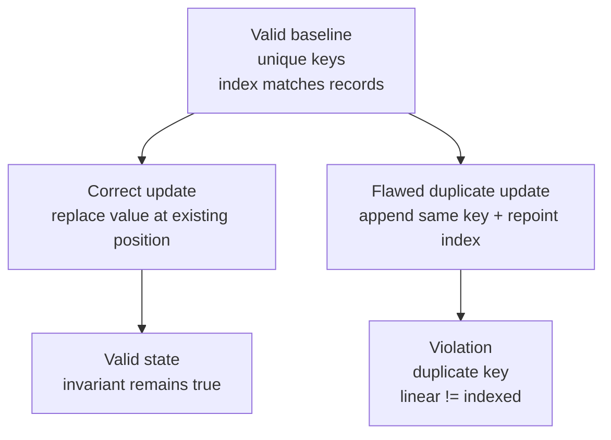
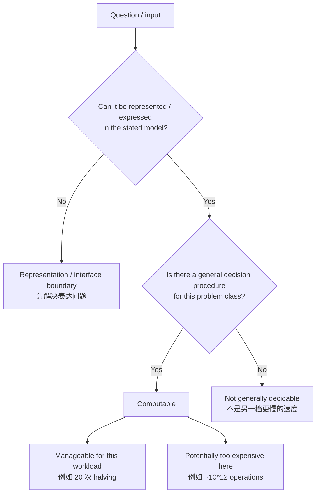

# L02-03｜程序通过测试就算正确吗？接口到底保证了什么？

## 学习者问题

一个 lookup/update 程序跑过几个例子、测试都绿了，我们能不能直接说“它正确”？如果不能，接口到底要保证什么，哪些性质必须在每次允许的状态变化后继续成立？

这一课第一次正式引入三个 canonical concepts：

- **规格（Specification，EC-CON-007）**；
- **不变量（Invariant，EC-CON-008）**；
- **正确性（Correctness，EC-CON-009）**。

## 为什么重要

复杂系统的 bug 往往不是“程序完全跑不起来”，而是某个边界条件、重复输入、缺失输入或状态转换破坏了本来应该保持的保证。

测试能提供具体 evidence，但“我试了几个例子没坏”与“implementation 在 stated assumptions 下满足 required behavior”不是同一个 claim。

## 学习目标

你将能够：

- 写一个 bounded、可检查的 Specification；
- 找出 permitted state transitions 后必须继续为真的 Invariant；
- 用 intentionally flawed update 触发 duplicate-key counterexample；
- 观察 linear/indexed lookup disagreement；
- 解释为什么 passing examples 是 evidence，但不等于完整 correctness argument；
- 说明 corrected transition 为什么恢复/保持 invariant；
- 区分 representable/expressible、computable-but-expensive 与 not-generally-decidable；
- 拒绝把“too slow here”与“no general decision procedure”混成一个类别。

## 前置知识

- L02-01：operation count / growth；
- L02-02：同一 lookup Interface 的 list 与 key-based index Trade-off；
- M00/M01 的 State、Abstraction、Interface、Representation 可复用。

---

## Mental Model｜正确性需要一个“对照标准”

如果没有 Specification，“correct”就没有明确参照物。

本课的关系：

```text
Specification + stated assumptions
  ↓ 规定外部可观察行为与保证
Implementation + permitted operations
  ↓ 在 specification 暴露的状态边界检查
Required Invariant
  ↓
Bounded Correctness claim
```

### Specification / 规格

**Specification** 是：

> 在 stated assumptions 下，对允许行为、必须行为或保证所做的**可检查陈述**。

它不是 implementation code，不是单个 example，也不是“最好永远不出错”这种无边界愿望。

### Invariant / 不变量

**Invariant** 是：

> 在指定 model 下，跨所有 permitted state transitions 都保持为真的 property。若 Specification 不暴露某个 internal intermediate state，Invariant 可以在一次内部 operation 中暂时不成立，但必须在对外可观察的规定边界恢复。

它不是“通常是真的”。本课把每个 activity command 完成后的 state 当作可观察边界；如果一个 permitted operation 完成后让所需 property 变成 false，那么 Invariant 已经被破坏。

### Correctness / 正确性

**Correctness** 是：

> implementation 的 observable behavior 在 stated input、concurrency、failure 与 trust assumptions 下符合 relevant Specification。对本课这个 bounded、单进程 stateful model，保持所需 Invariant 是该 Correctness claim 的组成部分。

Correctness 不是 speed、安全性或“某个 sample 跑成功”的同义词；本课没有引入 concurrency/failure/trust 机制，只把这些 assumptions 明确限定在当前 model 之外。

---

## Mechanism｜一个小 lookup/update interface

activity baseline 有 8 条 records：

```text
r0000:0
r0001:10
r0002:20
...
r0007:70
```

内部同时维护：

- `records`: list；
- `index`: `key → list position`。

调用者只关心 logical Interface：

```text
lookup(key)
update(key, new_value)
```

### Bounded Specification

本课假设每次 operation 开始时 collection 已满足下面的 Invariant；在这个 stated model 下，我们采用：

**`lookup(k)`**

1. 若 key 存在，返回该 key 的唯一 record；
2. 若 key 缺失，返回 `None`；
3. lookup 不改变 collection state。

**`update(k, v)`**

1. 若 key 存在，只修改该 record 的 value；
2. key 本身与 record count 不改变；
3. 若 key 缺失，返回失败并保持 state 不变。

这是一个 deliberately small Specification，不宣称适合所有未来 API。

### Application Invariant

在每个 permitted transition 后：

1. records 中每个 key **恰好一次**；
2. `set(index.keys()) == set(record keys)`；
3. 每个 `index[k]` 都指向 records 中 key 正好为 `k` 的位置。

为什么需要它？因为 list scan 与 indexed lookup 应该只是同一个 logical behavior 的两条 implementation path，而不应该得到两个互相矛盾的“真相”。

## Invariant Transition Visual｜允许的 transition 与 violation



**图的教学目的：**Invariant 不是“多数时候 true”；正确 transition 必须把 valid state 带到 valid state，而 supplied flawed transition 给出一条明确的 violating edge。

---

## Predict｜先判断 duplicate 会破坏什么

进入 activity：

```bash
cd labs/foundations/m02
python3 activity.py reset
python3 activity.py baseline
```

先写预测：

> 如果错误的 `update("r0002", 999)` 不是替换旧 record，而是 append 一个新的 `r0002:999`，同时让 index 指向这个新位置，哪一条 Invariant 会先失败？linear lookup 与 indexed lookup 各会返回什么？

不要先运行 `break`。

## Observe / Break｜最小有用 counterexample

现在运行：

```bash
python3 activity.py break
```

关键输出：

```text
BREAK before.invariant=True
BREAK counterexample=duplicate-update key=r0002 new_value=999
BREAK after.invariant=False
BREAK linear=r0002:20 comparisons=3
BREAK indexed=r0002:999 logical_probes=1
BREAK paths_agree=False
```

这份 evidence 同时暴露两个问题：

1. unique-key Invariant 被破坏；
2. 同一个 `lookup("r0002")` 因 implementation path 不同返回不同 observable result。

这就是 counterexample：它不是证明所有代码都错，而是用一个允许/边界输入**推翻“这个 flawed update 满足我们的 Specification/Invariant”**。

## Why passing tests are not enough｜成功例子能证明到哪里？

假设你之前只测试：

```text
lookup("r0007") → r0007:70
lookup("missing") → None
```

它们都可能通过，因为 duplicate bug 还没有被触发。

这说明 passing examples 很有价值：它们证明这些具体 cases 在当前 environment/implementation 下表现符合预期。

但除非输入/状态空间被完整穷举，或你有更强的 reasoning/proof，它们通常不能自动升级为：

> “所有 permitted inputs/transitions 都满足 Specification。”

因此：

> **tests passed = correctness evidence**，不是 **correctness definition**。

## Build / Correction｜让 transition 保持 Invariant

运行：

```bash
python3 activity.py correct
```

关键输出：

```text
CORRECT updated=True key=r0002
CORRECT invariant=True
CORRECT linear=r0002:999 indexed=r0002:999
CORRECT paths_agree=True
CORRECT missing.updated=False unchanged=True
```

修正逻辑：

- existing key：在 index 指向的**既有位置**替换 record；
- 不 append duplicate；
- missing key：返回 `False`，state unchanged。

于是：

- record count 不变；
- unique keys 保持；
- index key set 不变；
- index position 仍指向正确 key；
- 两条 lookup path 再次 agree。

这不是形式化证明全部未来版本都正确，但它给出了一个清楚的 local correctness argument：corrected transition 与 Specification 对齐，并通过 machine-checkable Invariant/边界 evidence。

---

## Explain｜Specification、Invariant、Correctness 不要混用

用同一个例子检查区别：

### Specification = “外部要求什么”

> Missing update 不创建新 record；existing update 只改变 value。

### Invariant = “每个允许 transition 后什么必须还 true”

> key 唯一；index 与 records 同步。

### Correctness = “implementation 是否满足前两者”

> 在 stated input/model assumptions 下，`correct_update` 的 observable behavior 满足 update Specification，并保持 collection Invariant；现有 tests/counterexample 是 supporting evidence，但不自动证明所有未覆盖情形。

如果你只说“invariant 是通常成立的规则”，定义就错了：**一条 permitted transition 让它 false，就已经是 violation。**

---

## Limits｜“太贵”与“没有一般判定算法”不是同一类问题

M02 只建立边界直觉，不做 computability-theory 证明。

先问：问题能否被我们使用的 Representation/Interface 明确表达？如果能，再问是否存在 general procedure，以及它的成本。



**图的教学目的：**`computable but expensive` 与 `not generally decidable` 分叉成不同类别，而不是同一条 speed scale 的两个位置。

### 1. Representable / expressible

本活动可以明确表示：

```text
lookup("r0002")
update("r0002", 999)
```

key、record、operation 都有具体 Representation 与 Interface。

“能表达”只是第一步。一个问题能写下来，不代表一定存在对所有输入都能给答案的 general algorithm。

### 2. Computable but potentially too expensive

例如 all-pairs comparison 有一个完全明确的 procedure：把每对 records 比一次。

对 `n=1,000,000`：

```text
≈ 5 × 10^11 pair comparisons
```

你可能判断“对这个 workload 太贵”。这是一条**tractability / resource** 判断：procedure 存在，只是成本可能不可接受。

exponential 也一样：`2^10=1024` 可能很轻；`2^50≈1.1×10^15` 可能很重。**Exponential 不等于 logically impossible。**

### 3. Not generally decidable

存在另一类问题：不是“procedure 太慢”，而是**不存在一个能对该问题的所有任意输入都总能正确给 yes/no 答案的一般判定 procedure**。

经典边界例子是：

> 给定任意程序和任意输入，是否存在一个 general algorithm 能永远正确判断该程序最终会不会停止？

答案是否定的；这属于 undecidability（不可判定性）边界。

本课到此停止：不做 Turing-machine construction、reduction 或 formal proof。

重要的是不要误解：

- undecidable **不**表示每个具体程序都无法分析；
- 不表示 tests、invariants、static analysis、formal proof 对受限问题没用；
- 不表示“只要等更久就会变 decidable”；
- 更不表示 computable-but-expensive 的问题自动变成 undecidable。

“too slow for this workload” 与 “no general decision procedure” 是不同 claim。

---

## Judge｜三种 claim 属于哪一类？

把下面三句话分类并解释：

1. “这个 API 没有办法表达‘missing update must not create a record’。”
2. “all-pairs check 有 algorithm，但在 `n=10^7` 时预计工作量太大。”
3. “我想要一个对任意程序/输入都能总是正确判断是否停机的通用 checker。”

期望你区分：

- representation/interface expressibility；
- computable but potentially expensive；
- not generally decidable。

不要把 2 和 3 都写成“性能差”。

---

## Common Misconceptions

### “Correct 就是 tests passed”

错误。tests 是具体 evidence。Correctness 的参照是 Specification；在 stateful system 中还需要相关 Invariant 在 permitted transitions 下保持。

### “Invariant 就是 usually true”

错误。Invariant 必须在 specified model 的每个 permitted transition 后为 true；一个允许 transition 把它变 false 就是 violation。

### “Specification 就是函数签名”

不够。签名可能只说明输入输出形状；Specification 还要说明 behavior、guarantees、missing/boundary semantics 与 assumptions。

### “有一个 counterexample 只说明 test 写得不好”

不一定。counterexample 可以直接推翻一个过强 correctness claim，并帮助你定位哪个 Specification/Invariant 条款被破坏。

### “Exponential 意味着 impossible”

不是。它描述非常快的 growth；小 `n` 仍可能可计算。是否可接受取决于 workload/resource bound。

### “Undecidable 就是超级慢”

错误。undecidable 不是速度等级；它说的是不存在覆盖所有任意输入的一般 decision procedure。

### “Undecidable 意味着分析没意义”

错误。大量 restricted instances 与 restricted languages 仍然可测试、可证明、可静态分析；不可判定边界只是阻止你声称一个 universal checker 能解决所有情况。

## What You Can Ignore—for Now

- Hoare logic；
- proof assistants；
- loop-invariant formal calculus；
- Turing-machine construction；
- reductions；
- NP-completeness；
- decidability proof techniques；
- formal verification workflow；
- concurrency/failure-model correctness（后续模块再扩展）。

## Progressive Stuck Support

先独立回答 Question。卡住时才依序展开。

### Question

为什么 `flawed_update_duplicate(records, index, "r0002", 999)` 是一个有力 counterexample，而“之前 lookup test 都通过”不能替它辩护？

<details>
<summary><strong>Hint 1</strong></summary>

先写 Invariant：每个 key 恰好一次；index 指向那个 key 的正确位置。

</details>

<details>
<summary><strong>Hint 2</strong></summary>

flawed update append 了第二个 `r0002`，linear scan 从前往后，index 则被 repoint 到新位置。比较两条 path 的 observable result。

</details>

<details>
<summary><strong>Expected Observation</strong></summary>

break 后 `invariant=False`；linear lookup 得到 `r0002:20`，indexed lookup 得到 `r0002:999`，`paths_agree=False`。之前未触发 duplicate transition 的 passing tests 没有覆盖这条状态路径。

</details>

<details>
<summary><strong>Full Explanation</strong></summary>

Specification 要求 existing-key update 只更新该 record 的 value；Invariant 要求 key 唯一且 index 与 records 同步。flawed update 通过 append duplicate 直接违反这两层约束，并造成相同 logical lookup 的两个 implementation path 返回不同结果。一个 counterexample 足以推翻“这个 flawed implementation 对所有 permitted transitions 都满足我们的 claim”。之前 passing tests 仍然是有效 evidence，但只支持它们实际覆盖的 cases，不能把未覆盖 duplicate transition 自动证明为 correct。

看过 Full Explanation 后，把 key 改成 missing case，独立说明正确 Specification 要求 state 为什么保持不变。

</details>

## Exit Criteria

你能够独立：

- 写出 bounded **Specification / 规格**；
- 写出在 permitted transitions 后必须保持的 **Invariant / 不变量**；
- 用 duplicate/missing/boundary counterexample 检查 claim；
- 解释 supplied flawed update 的具体 violation；
- 说明 corrected update 为什么保持 Invariant；
- 把 passing tests 正确描述为 evidence，而不是 Correctness definition；
- 用 stated assumptions 写一条 bounded **Correctness / 正确性** claim；
- 区分 expressibility、computable-but-expensive 与 not-generally-decidable；
- 明确“too expensive here ≠ undecidable”。

## Competency Mapping

- **Correctness：**canonical first assessed Specification/Invariant/Correctness；counterexample + correction reasoning。
- **Judge：**判断一个 passing-test claim 是否足够，以及 limits claim 属于哪一类。
- **Explain：**解释 Specification → transition → Invariant → Correctness 的关系与边界。
- **Diagnose：**用最小 duplicate counterexample 定位 state violation。
- **Trace：**追踪 list/index 两条 lookup path 与 state transition。
- **Estimate：**复用 L02-01 的 expensive-but-computable order-of-magnitude reasoning。

## Provenance / Sources

- Main source map: accepted Foundations/System Mechanics Research Dossier §5, §§8–9/12 and Design §5/§8.
- MIT Mathematics for Computer Science: designer anchor for invariant/asymptotic reasoning; proof-heavy machinery is outside learner scope: https://ocw.mit.edu/courses/6-1200j-mathematics-for-computer-science-spring-2024/ .
- Cornell CS2110 lecture notes: classic pairing of searching/asymptotic reasoning and loop-invariant teaching; used as a bounded source anchor, not copied prose: https://www.cs.cornell.edu/courses/cs2110/2014sp/lecturenotes.html .
- Software Foundations — Logical Foundations: designer background for formal correctness and limits-of-computation intuition; proof-assistant machinery is explicitly not taught here: https://softwarefoundations.cis.upenn.edu/lf-current/Preface.html .
- Open Data Structures remains the data-structure/asymptotic source anchor: https://opendatastructures.org/ .
- Specification, Invariant, Correctness definitions follow the repository Concept Registry canonical meanings. Activity code, counterexample, diagrams, and learner prose are original Essential CS Issue #38 material.
