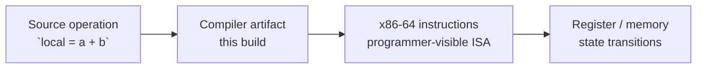
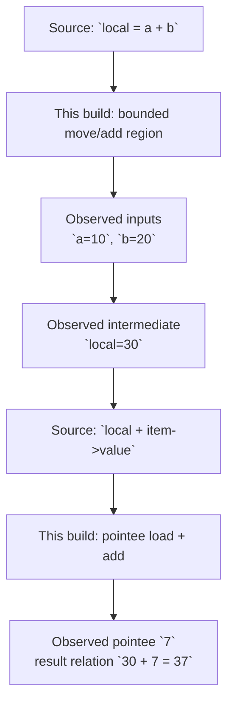
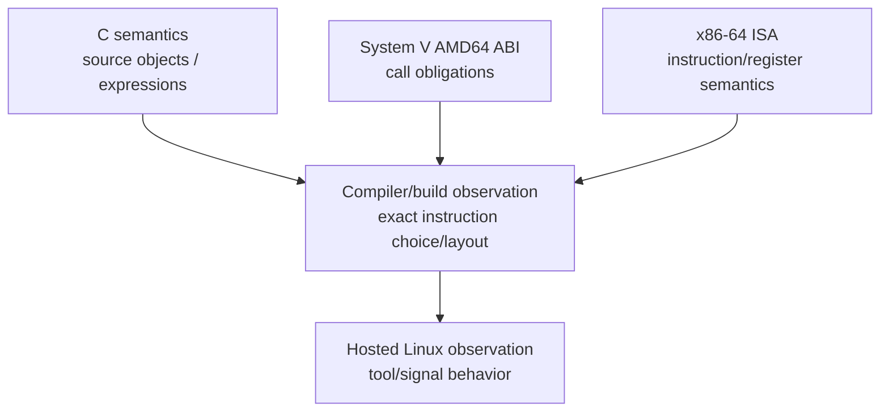

# L03-01｜这段 C 代码在机器上到底执行了什么？

## 学习者问题

同一段 C 源码，在编辑器里只是几行表达式；编译后，机器真正“看见”的是什么？当 `helper(10, 20, &item)` 被执行时，我们怎样从源码走到指令，再走到寄存器与内存状态，而不把一次 compiler output 误当成语言或 ISA 的永恒规则？

## 为什么重要

从这一课开始，你第一次建立 programmer-visible machine model。后续 OS、runtime、性能和故障诊断都会反复依赖这个模型。但本课的目标不是背 assembly，而是学会把**一个源码 operation 与一小段 machine-visible state transition 对上证据**。

中心纪律：**不要让一次 observation 静默升级成 guarantee。** 每个重要 claim 都要能回答：它属于 C language semantics、x86-64 ISA、System V AMD64 ABI、compiler/build observation，还是 hosted Linux observation？

## 学习目标

完成本课后，你应能：

- 用 `preflight.sh` 确认当前 activity 是否满足 native x86-64 前提；
- 预测 fixture 的 source-level arguments/result；
- 编译并确认 named `helper` symbol；
- 使用 source-aware disassembly 找到 bounded helper region；
- 识别少量与当前 source operation 相关的 x86-64 registers/instructions；
- 把 source operation → instruction range → register/memory state change 连成一条证据链；
- 区分 ISA rule 与当前 compiler/build choice；
- 明确写出当前 evidence **没有**建立什么。

## 前置知识

- M01：Representation；
- M02：Interface、Specification、Correctness 与 Trade-off；
- 你不需要会 C 或 assembly。这里的 C 只是 microscope。

---

## Mental Model｜四层，不要混成一层



**ISA（Instruction Set Architecture，指令集体系结构）**在这里是 software-visible machine interface：它定义程序可见的 instructions、registers、addressing 等语义。一个具体 compiler 则选择怎样用这些 ISA primitives 实现这段 C。这里刻意不教 pipeline、cache、branch prediction 或 CPU 内部实现。

因此：

- “x86-64 的某条 `add` instruction 按 ISA 定义修改 destination”——ISA claim；
- “本次 `-O0` build 用 `%rax` 暂存了 `a+b`”——compiler/build observation。

C 语言**不**要求变量 `local` 永远在 `%rax`、`%rbp-8` 或任何固定位置。

## Mechanism｜先看最小 fixture

活动文件：`labs/foundations/m03/fixture.c`。核心 helper：

```c
struct Item { long value; };

__attribute__((noinline))
long helper(long a, long b, struct Item *item) {
    long local = a + b;
    return local + item->value;
}
```

`main` 创建 `item.value = 7`，再调用 `helper(10, 20, &item)`。你现在只需要懂：`&item` 取得对象地址，`item->value` 通过 pointer 访问 field；`__attribute__((noinline))` 是实现扩展，用来让 helper boundary 易观察，不是 C language guarantee。

## Predict before reveal

先不要看 disassembly。写下：`a`、`b`、`item->value`、`local`、helper result 各是多少；你预计机器至少需要出现 register 还是 memory state？

然后运行：

```bash
cd labs/foundations/m03
./preflight.sh
./reset.sh
./build.sh
./fixture
```

baseline 应看到 `result=37`。这证明的是“当前 build/run 得到 37”，不是“所有 compiler/build 都必须生成同一 instruction sequence”。

## Observe｜从 symbol 到 bounded disassembly

运行：

```bash
./inspect.sh
```

你应先看到 `main` 与 `helper` named symbols，再看到 `helper` 的小段 machine code，以及 `main` 中 call helper 的附近区域。完整 source-aware output 在 `disassembly.txt`。

本任务作者实际测试的 Debian 13 / GCC 14.2 build 中，`helper` 观察到 argument spills、`add`、pointer load、第二次 `add` 与 `ret`；具体地址/offset/order 都属于该 build。**不要复制作者地址当答案。**

### Source ↔ instruction ↔ state trace



**边界：**这是一个 fixture 的 evidence path，不是 universal C-to-x86 template。

## Build｜把 claim 拆成 layer

| Claim | Layer | Why |
|---|---|---|
| `helper` source semantics 先求 `a+b` 再加 `item->value` | C/source semantics | source expression + language semantics |
| 当前 disassembly 出现 `add` | compiler/build observation | compiler 对本 build 的选择 |
| `add` instruction 的 programmer-visible effect | x86-64 ISA | AMD64 manual 是 authority |
| 当前 build 把 value spill 到某 stack offset | compiler/build observation | build 改变时可变化 |

### Claim-layer visual



箭头不是“上层保证下层实现长这样”，而是提醒你当前 observation 同时受 contract 与 implementation choice 影响。

## Break｜如果换 build，会发生什么？

如果另一组 compiler flags 让 `local` 不再出现在同一个 stack offset，是否说明 C semantics 或 x86-64 ISA 变了？**不一定。** exact allocation 属于 compiler/build evidence；只要 observable C behavior 与目标 ISA/ABI obligations 仍满足，layout 可以变化。

## Explain｜ISA 是 interface，不是 compiler output

M00 的 Interface 概念在这里回来了：x86-64 ISA 是 programmer-visible machine interface；compiler output 是一个 implementation artifact；disassembly 是“这个 artifact 包含什么 instructions”的 evidence；ISA manual 才是 instruction meaning 的 authority。

正确推理方向是：**disassembly shows this build emitted an instruction; architecture documentation tells us what that instruction means.**

## Judge｜你知道什么，猜什么？

把“C variable `a` is in `%rdi`”改成：“在当前 System V AMD64 call observation point，第一 integer argument 的 ABI role 与 `%rdi` 一致；当前 GDB/objdump evidence 显示 `a=10` 与该 register value 对应。”

把“`local` lives at `rbp-8`”改成：“在这个 debug-friendly build 的 observed frame 中，compiler 把 `local` 放在一个具体 frame-relative location；这不是 C 或 universal ABI frame guarantee。”

<details>
<summary>Question → Hint 1</summary>
先只圈出 helper call boundary、`a=10`、`b=20`、`item.value=7`、result=37。不要解释完整 stack。
</details>

<details>
<summary>Hint 2</summary>
把“instruction 的含义”与“compiler 选择了哪条 instruction”分两列。前者找 ISA authority，后者看当前 disassembly。
</details>

<details>
<summary>Expected Observation</summary>
你应能找到 named `helper`，在 caller 附近看到一次 call，在 helper 内看到与 arithmetic、pointer load、return 对应的 bounded region。具体地址与 offset 由你的 build 决定。
</details>

<details>
<summary>Full Explanation</summary>
源码规定 source-level computation；compiler 生成 machine artifact；x86-64 ISA 规定其中 instructions/register effects；objdump 暴露当前 artifact。exact registers、spills、frame offsets 与 ordering 是 compiler/build evidence，不能反向写成 C guarantee。
</details>

## Common Misconceptions

- **“C defines which register holds a variable.”** 错。C 规定 source semantics，不规定 `%rax/%rdi` allocation。
- **“Compiler output is the ISA specification.”** 错。output 是 ISA 的一个使用实例；architecture spec 才是 authority。
- **“Learning x86-64 means memorizing instructions.”** 错。只需读懂支撑当前 trace 的少量 instructions，并知道去哪里查。
- **“看到地址就理解 memory system。”** 错。地址在此只是 observation token；virtual memory later。

## What You Can Ignore—for Now

instruction encoding、pipeline、speculation、branch prediction、microarchitecture、ELF/linker/loader 深入、assembly programming repertoire、virtual memory。

## Exit Criteria

完成一条 source ↔ instruction ↔ state trace、named helper bounded disassembly、至少一个 ISA claim 与一个 compiler/build observation 的区分，并写一句 “what this evidence does not establish”。

## Competency mapping

- **Trace（primary）**：source → instructions → state；
- **Observe**：objdump/nm evidence；
- **Explain**：ISA vs compiler/build boundary。

## Provenance

AMD64 ISA authority：AMD *AMD64 Architecture Programmer’s Manual* Publication 40332；GNU objdump behavior：GNU binutils official docs；C semantics：WG14 materials。Activity output 只作 current build observation。
