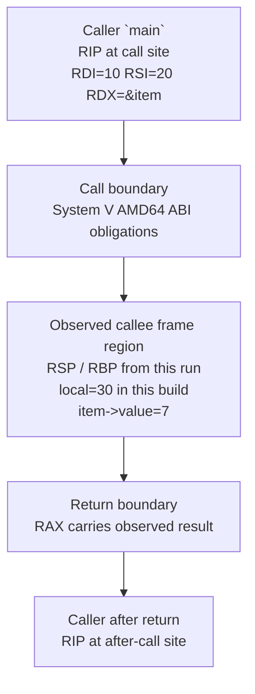

# L03-02｜函数调用时，参数、返回值和 stack 到底发生了什么？

## 学习者问题

`main` 调用 `helper(10, 20, &item)` 时，参数怎样跨过 caller/callee boundary？instruction pointer 怎样移动？stack pointer、frame pointer、return value 又能让我们观察到什么？

## 为什么重要

源码里的函数调用要落到机器层，就需要 caller 与 callee 对调用约定达成一致。本课只学习 fixture 真正需要的 **System V AMD64 ABI** bounded roles，并用 GDB 观察三个 transition points；不把 ABI 变成 register catalog。

## 学习目标

你将能够记录 caller before call、callee after entry、caller after return 三点的 `$rip/$rsp/$rbp`、relevant argument/result registers、一个 pointee memory value、`local`，并区分 ABI obligation 与 current frame/compiler observation。

## 前置知识

L03-01 的 source → instruction → state model；只需知道 register 是 programmer-visible machine state；不要求手写 assembly。

---

## Mental Model｜call 是一次受约定约束的 state transition

```text
caller prepares argument state
        ↓ call
callee executes with ABI-visible inputs
        ↓ return
caller observes result state
```

在 canonical x86-64 Linux path 上，本课采用 System V AMD64 ABI。对这次调用，前三个 integer/pointer class arguments 由 `%rdi`、`%rsi`、`%rdx` 承担，integer return value 用 `%rax`。这是 ABI 层；**exact local stack slot 不是 ABI 固定答案。**

## Predict before reveal

运行 GDB 之前先填：before call 的三个 argument values；pointer 指向的 tiny record value；callee 中 `local`；after return 的 result；你预计 `$rsp` 进入 callee 后与 caller 完全相同吗？

## Observe｜三点采集

```bash
cd labs/foundations/m03
./preflight.sh
./build.sh
./capture-gdb.sh
```

脚本先从**当前 binary 的 disassembly**找到 `call <helper>` 与 after-call instruction，再让 GDB 设置实际 breakpoints。输出在 `gdb-trace.txt`，应包含：

```text
TRACE point=before-call
TRACE point=callee
TRACE point=after-return
```

把 actual addresses/values 填入 evidence template，不要使用作者机器地址。

### Point 1 — caller before call

记录 `$rip` at current call instruction、`%rdi/%rsi/%rdx`、`%rdx` 指向的 8-byte value、`$rsp/$rbp`。psABI 给出 register roles；GDB 给出当前调用点 actual values。不要写“C 要求第一参数在 `%rdi`”。

### Point 2 — callee after entry

记录 `$rip/$rsp/$rbp`、`a=10`、`b=20`、`item` address、`item->value=7`，并在执行 `local = a+b` 后记录 `local=30`。如果 exact frame offsets 与别人不同，不代表 ABI 被违反；compiler 可以选择不同 frame shape。

### Point 3 — caller after return

停在 call 后第一条 instruction，记录 `$rip` 回到 caller region、`%rax` 与 helper result 的关系，以及 `$rsp/$rbp`。

## Call-frame snapshot｜只画你真的观察到的 build



> **This is the observed frame for this build, not the one universal stack layout.**

这里的 frame region 只是 debugger 观察到、对当前 build 有用的一段 stack-associated state。现在不扩展成 virtual memory、guard pages 或 OS protection model。

## Mechanism｜`call` / `ret` 与 instruction pointer

x86-64 ISA 定义 `call`/`ret` 的 machine-visible control-transfer semantics；本活动用 `$rip` 观察 instruction pointer 位置变化。ABI 规定 caller/callee 如何就 argument/result 等互操作；compiler 决定具体 prologue、spills、offsets。

## Build｜从实际值画自己的 frame sketch

在 evidence template D 中画 before-call 与 callee 的 `$rsp/$rbp`，`item` pointer/pointee，`local` 的 actual observed location/value（若 evidence 支撑），after-return `%rax`，并写：`observed build-specific layout, not universal ABI frame shape`。

## Break｜改掉一个错误心智模型

错误：“函数有 local variable，所以它一定有一个固定 stack slot。” optimization 可以让 local 在 register、被重算或消除。即使当前 `-O0 -fno-omit-frame-pointer` build 中看到清楚 slot，也只能说：**In this build, at this observation point, the compiler represented/accessed `local` through this observed location.**

## Explain｜ABI 是 Interface 的一次 revisit

caller 与 callee 要独立编译后仍互操作，就需要 platform ABI 的 externally visible obligations。你只学习当前 fixture 需要的部分。

| Claim | Layer | Evidence |
|---|---|---|
| source argument values | C/source semantics | source |
| `%rdi/%rsi/%rdx` 承担这三个 roles | System V AMD64 ABI | psABI |
| 当前 call point 实际 values | compiler/build + debugger observation | GDB |
| `call`/`ret` control effect | x86-64 ISA | AMD64 manual |
| exact `$rbp`、offset、frame size | compiler/build observation | disassembly/GDB |
| `%rax` return role | ABI + current observation | psABI + GDB |

## Judge｜如果 frame 不一样，什么仍可成立？

若另一 build 不使用 `%rbp` frame pointer、`local` 留在 register、addresses 全变：C source semantics 可不变；ISA instruction semantics 仍由 ISA 定义；ABI obligations 仍需满足；exact frame snapshot **必须重新观察**。

<details>
<summary>Question → Hint 1</summary>
先只盯三个点：call 前、helper 内、return 后。每点只记 RIP、RSP、RBP 和最相关 values。
</details>

<details>
<summary>Hint 2</summary>
把 `%rdi/%rsi/%rdx/%rax` 的“角色”放进 ABI 列；把具体地址与 stack offset 放进 compiler/build observation 列。
</details>

<details>
<summary>Expected Observation</summary>
关系应是：before-call arguments 对应 10、20、`&item`；callee 可观察 `item->value=7` 与 `local=30`；after-return result register 与 37 的结果关系一致。具体 addresses、RSP/RBP、frame offsets 由你的 run 决定。
</details>

<details>
<summary>Full Explanation</summary>
System V AMD64 ABI 让 caller/callee 对 bounded register roles 达成约定；x86-64 `call`/`ret` 完成 control transfer；compiler 决定具体 frame；GDB 只是暴露当前 execution state。因此 frame snapshot 是 evidence，不是 universal stack diagram。
</details>

## Common Misconceptions

- **“The stack frame has one universal shape.”** 错，exact shape build-sensitive。
- **“Every local variable must be on the stack.”** 错，compiler 可用 register 或消除 storage。
- **“C defines `%rdi/%rax`.”** 错，这是 platform ABI。
- **“GDB printed an address, so I understand virtual memory.”** 错，translation/protection later。

## What You Can Ignore—for Now

完整 ABI register catalog、callee/caller-saved 全表、red zone 深入、unwind metadata、virtual memory、stack-overflow mechanism、Process/Isolation。

## Exit Criteria

用 actual values 完成 before-call / callee / after-return 三点表与 build-specific frame sketch，并且每条解释都不会把 compiler observation 写成 universal ABI/C guarantee。

## Competency mapping

- **Trace（primary）**：caller → callee → caller；
- **Observe**：GDB registers/memory/frame evidence；
- **Explain**：ISA vs ABI vs compiler/build。

## Provenance

x86-64 System V psABI project 是 calling-convention authority；AMD64 Architecture Programmer’s Manual 是 instruction/register authority；GDB official docs 是 tool behavior authority；actual trace 只作 implementation observation。
