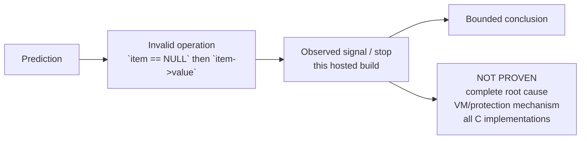
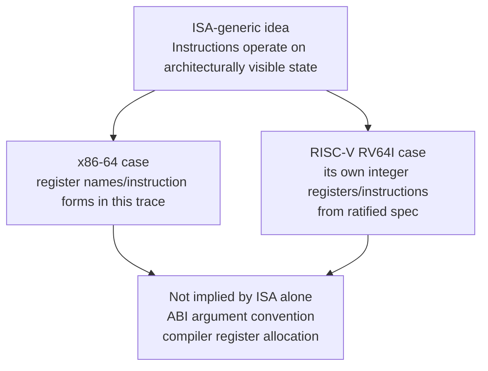

# L03-03｜程序崩了，我们究竟知道了什么？

## 学习者问题

debugger 停在一次 invalid memory access 附近，并显示 `SIGSEGV`。我们到底能从这份 evidence 得出什么？又有哪些“听起来合理”的 root-cause 故事其实还没有被证明？

## 为什么重要

系统失败时，过度解释会把 diagnosis 带偏。M03 在这里第一次正式引入 canonical concept：

## Failure / 故障 — EC-CON-010

**Failure（故障）**：相对于某个 specified capability 或 assumption 的丧失、偏离或不确定性——例如 crash、wrong result、unavailability、partial completion。**并不是每个 exception 或 unexpected event 都自动构成 system failure。**

本课的 bounded capability 是：给 `helper` 一个满足 source assumptions 的有效 `Item *`，使它完成计算并返回结果。controlled variant 故意破坏这个 assumption，观察当前 hosted execution 的 failure evidence。

## 学习目标

你将能够：在 trigger 前写 prediction；标注 invalid C access 的 language semantics status；用 GDB 记录 actual signal/stop、instruction pointer 与短 backtrace；把 observation fact 与 root-cause explanation 分开；写 bounded conclusion；列出至少三项 **NOT PROVEN**；不把 SIGSEGV、virtual memory、Process、Isolation 混成一个概念。

## 前置知识

L03-01 的 source/instruction/state evidence；L03-02 的 call boundary 与 GDB observation；M02 的 Specification/Correctness 可用于说明“违反哪个 stated assumption”。

---

## Mental Model｜Failure evidence path



**signal 是 evidence，不是自动完成的 explanation。**

## Mechanism｜controlled failure variant

`failure.c` 保留同一个 helper，但 caller 传入 `item=NULL`，随后 helper 仍执行 `item->value`。

### 先定 language-layer boundary

正确 claim shape 是：

> 这个 source operation 执行了无效 pointer dereference，进入 **C undefined behavior（未定义行为）**。因此 C 标准不保证它必须产生 SIGSEGV；在本次 tested hosted Linux/build 中，我们再观察实际发生了什么。

undefined behavior 不是“标准保证随机崩溃”，而是语言规范不再给出普通 defined execution 的那种结果保证。

## Predict before reveal

先写：你预计 GDB 会不会 stop？如果 stop，猜什么 signal class？即使看到 SIGSEGV，它最多支持哪一层 claim？哪些 VM/protection 机制你现在没有 evidence，不能解释？

然后运行：

```bash
cd labs/foundations/m03
./build.sh
./observe-failure.sh
```

若 GDB 不存在或被 hosted policy 阻止，记录 BLOCKED；不要把 shell direct crash 自动当成完成 canonical debugger evidence。

## Observe｜只记录 fact

合格 raw observation：exact command、actual preflight、GDB signal/stop、RIP、current instruction、短 backtrace。本任务作者在 x86-64 Debian 13 / GCC 14.2 build 中**直接运行** failure variant 时实际观察到 exit 139 / shell “Segmentation fault” 类终止；但作者环境缺少 GDB，所以这不是 canonical GDB PASS，只是 hosted observation。你的 evidence 必须以自己的 preflight 为准。

## Build｜Fact vs explanation

**Fact from evidence：**“在这次 hosted Linux/build 的 GDB run 中，程序收到/停在 SIGSEGV；debugger 显示 current instruction 位于 helper 的 pointer-based load 附近。”

**Current hypothesis：**“`item` 为 NULL，而 helper 试图通过它读取 `value`；这与 source variant 和 stopped instruction 一致。”

这是 bounded diagnosis，但仍不能说“已经证明 Linux virtual memory 某个 page-protection rule 是完整 root cause”。你还没有相应 authority/evidence。

## Break｜故意检查过度结论

以下都**不能**由 signal evidence 自动推出：

- “C guarantees SIGSEGV for invalid access.”
- “The exact same source line will fault in every compiler build.”
- “I now understand virtual address translation.”
- “The root cause is fully proven.”
- “This demonstrates Process isolation.”

`SIGSEGV` 是 hosted implementation observation；要证明更深的 VM/protection/process mechanism，需要后续模块的新 authority 与新 evidence。

## Explain｜Failure、invalid operation、signal 不要混为一词

- source 中 `item=NULL` 后仍 dereference，是故意制造的 invalid operation；
- C semantics 使该 execution 进入 undefined behavior；
- hosted Linux/GDB 观察到 SIGSEGV（若实际发生），是 failure evidence；
- signal 名称本身不是完整 root-cause proof；
- Failure 是相对 specified capability/assumption 的偏离，不等于“所有 unexpected events”。

这里**不**给 Process、Isolation、virtual memory 做 canonical definition。

## Judge｜Claim-layer table

| Claim | Layer | Evidence / authority |
|---|---|---|
| `item->value` 的 ordinary defined behavior 需要有效 object access | C language semantics | WG14 C material |
| 此 invalid dereference 进入 undefined behavior | C language semantics | WG14 C material |
| stopped instruction 的 machine-visible operand effect | x86-64 ISA + current disassembly | AMD64 manual + objdump/GDB |
| exact instruction/address selected here | compiler/build observation | current build |
| 当前 run 收到 SIGSEGV | hosted Linux observation | actual GDB/run |
| SIGSEGV proves exact VM protection mechanism | **unsupported** | needs later evidence |

## RISC-V transfer card｜只转移“ISA 是什么”，不搭第二套环境



用 RISC-V ratified unprivileged spec 只回答：什么是 ISA-generic；什么是 x86-64-specific；什么属于 ABI/compiler choice。不要安装 RISC-V compiler、QEMU、xv6，也不要假定 RISC-V ABI 与 x86-64 System V ABI 相同。

<details>
<summary>Question → Hint 1</summary>
先写 raw facts：invalid source operation、C semantics status、actual signal/stop、RIP/backtrace。暂时不要解释 VM。
</details>

<details>
<summary>Hint 2</summary>
问自己：这个 claim 的 authority 应该是 C spec、ISA manual、ABI、compiler output，还是 hosted run？找不到对应层，就先标成 hypothesis。
</details>

<details>
<summary>Expected Observation</summary>
在 smoke-tested 类型的 x86-64 hosted Linux build 中，failure variant 常可被 GDB 观察为 SIGSEGV stop，并落在 helper 的 invalid pointer-based access 附近；但 C 不保证这个 signal，actual result 必须由你的 environment 记录。
</details>

<details>
<summary>Full Explanation</summary>
source variant 破坏有效 pointer access 前提，因此语言层进入 undefined behavior。若当前 hosted Linux/GDB 显示 SIGSEGV，这只证明“这里实际观察到该 signal/stop”。结合 source 与 stopped instruction 可形成 bounded hypothesis；virtual-memory translation、protection rule、Process/Isolation 与所有 build 行为仍未被证明。
</details>

## Common Misconceptions

- **“A segmentation fault proves the exact root cause.”** 错，它只是 evidence。
- **“Invalid C memory access is guaranteed to segfault.”** 错，UB 没有这种 universal signal guarantee。
- **“GDB printed an address, so I understand virtual memory.”** 错，address observation 不等于 translation/protection model。
- **“Signal = Failure definition.”** 错，Failure 相对 specified capability/assumption；signal 是 evidence。
- **“We should set up RISC-V now because xv6 uses it later.”** 不需要，这里只做 specification transfer。

## What You Can Ignore—for Now

virtual memory、page tables、memory protection model、Process、Isolation、exploit development、buffer overflow exploitation、core-dump internals、signal handling programming。

## Exit Criteria

提交 prediction；invalid operation + C semantics status；actual signal/stop evidence 或明确 BLOCKED；fact vs hypothesis；bounded conclusion；至少三项 NOT PROVEN；RISC-V transfer 的 ISA-generic / x86-64-specific / ABI/compiler-specific 三分答案。

## Competency mapping

- **Trace（primary）**：failure point 回到 source/instruction；
- **Observe**：GDB/signal evidence；
- **Diagnose**：fact → bounded hypothesis，不越过 evidence；
- **Correctness（revisit）**：相对 stated assumptions 判断行为边界。

## Provenance

EC-CON-010 definition：repository Concept Registry；C UB boundary：WG14 materials；x86-64 semantics：AMD64 manual；GDB behavior：GNU GDB official docs；RISC-V transfer：RISC-V International ratified unprivileged ISA spec；actual signal/tool output 只作 hosted implementation observation。
