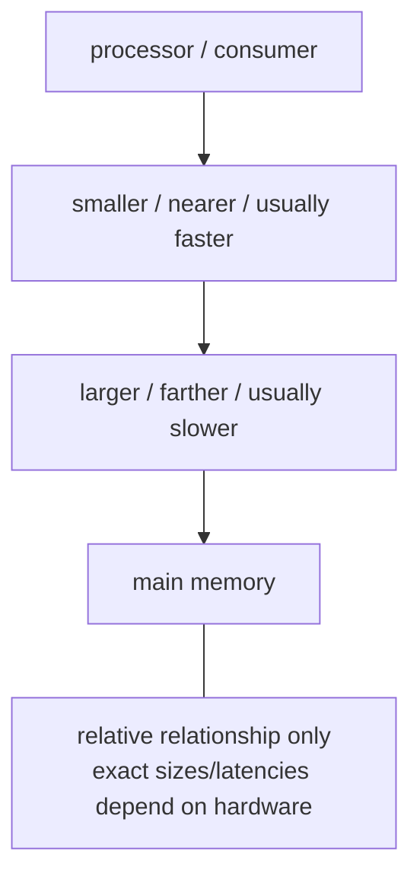
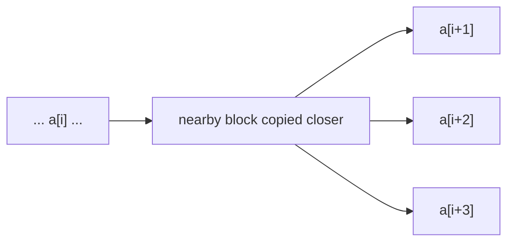
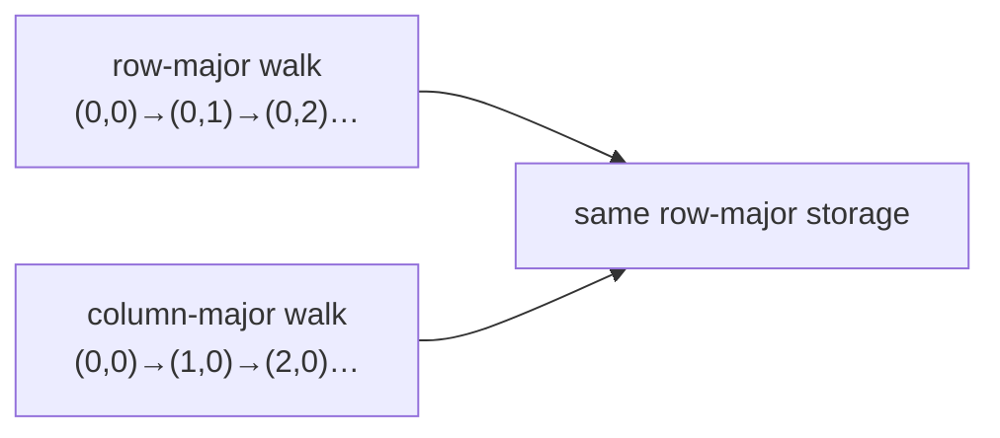

# L04-01｜为什么逻辑上做同样工作的两个 loop，实际耗时可能不同？

## 学习者问题

两个 loop 都把同一个二维数组的每个元素加进 checksum。逻辑工作相同，为什么实际耗时仍可能明显不同？

## Caching / 缓存 — EC-CON-011

**Caching（缓存）**：在某种有效性/新鲜度（validity/freshness）策略下，保留先前结果或数据副本以便后续复用。缓存并不自动是持久、权威或私密的；当底层数据发生变化时，它也不自动保持正确。在本课的硬件场景中，缓存常把近期或附近的数据保留在离处理器更近、访问代价通常较低的层级，从而创造复用机会；这会带来 capacity、placement/reuse opportunity、complexity 与 cost 的 Trade-off。

## Mental Model｜memory 不是一个统一延迟盒子

这张图只表达相对关系，不要求背固定 latency 常数。处理器执行计算需要数据；数据移动与访问本身可能有不同成本。因此“内存访问都一样贵”不是一个有用的现代机器模型。

## Mechanism｜一小段相邻数据带来的复用机会

这里先建立直觉：一次访问可能让一小段附近数据也更容易被随后使用。我们暂时不在本课正式定义 Locality；它的 canonical first home 在 L04-02。

## Bridge｜二维数组的两种访问顺序

同一个连续 row-major storage 上，两个 loop 都访问每个元素，但地址推进方式不同。下一课将把这种“访问顺序与附近/复用机会”的关系正式命名，并用公平重复实验测量。

## Common Misconceptions

- **“Memory has one latency.”** 不成立；层级与实现会让访问成本不同。
- **“Cache 就是 durable storage。”** 错；这里的 cache 是性能副本机制，不能自动当权威持久数据。
- **“缓存越大越好，没有代价。”** 错；capacity、cost、placement、policy 与 complexity 都是 trade-off。
- **“看到更快就已经证明是某一级 cache。”** 错；计时结果需要更严格的 evidence 与 inference boundary。

Question → Hint 1

两个 loop 先比较“访问了什么”，再比较“按什么地址顺序访问”。

Hint 2

如果一次数据搬运会让一小段附近数据更容易被再次访问，那么连续地址推进与大步长推进可能获得不同机会。

Expected Observation

在本模块 smoke-tested 的 x86-64 Linux / GCC build 上，row-major traversal 的计时分布明显低于 column-major traversal；这是当前环境的定性观察，不是 universal speedup ratio。

Full Explanation

逻辑上“都访问全部元素”并不意味着机器层的数据访问路径相同。层级和 caching 让相邻或重复访问可能获得更低代价的机会；不同地址顺序因此可能形成不同 timing distribution。但单次更快不能识别精确 cache level，也不能证明所有机器都会同样。

## What You Can Ignore—for Now

set associativity 数学、coherence protocol、branch prediction、SIMD、完整 CPU microarchitecture、精确 latency 常数、storage/filesystem hierarchy。

## Exit Criteria

能解释 EC-CON-011 Caching；能说明它不是 durability；能画出 bounded memory hierarchy；能指出 row/column traversal 的地址顺序差异，并把正式 Locality 定义留到 L04-02。

## Competency mapping

- **Observe（primary）**：把 timing 当作待解释 evidence；
- **Explain**：层级、caching 与数据访问成本；
- **Estimate / Judge**：拒绝把硬件相关常数和单次结果当 universal fact。
