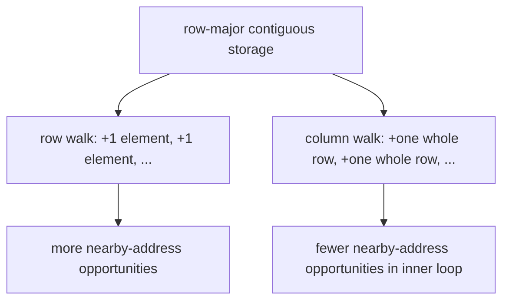
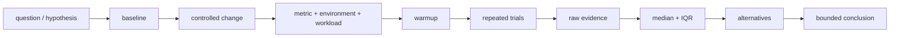
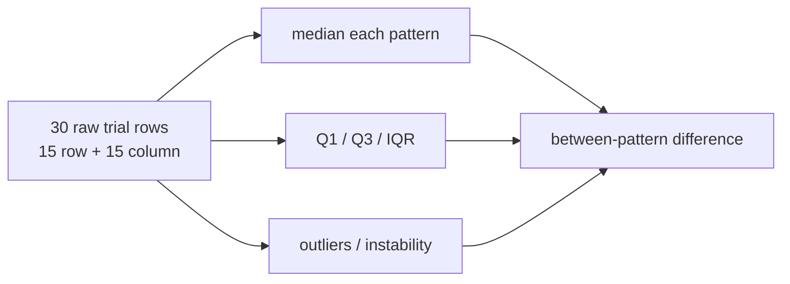
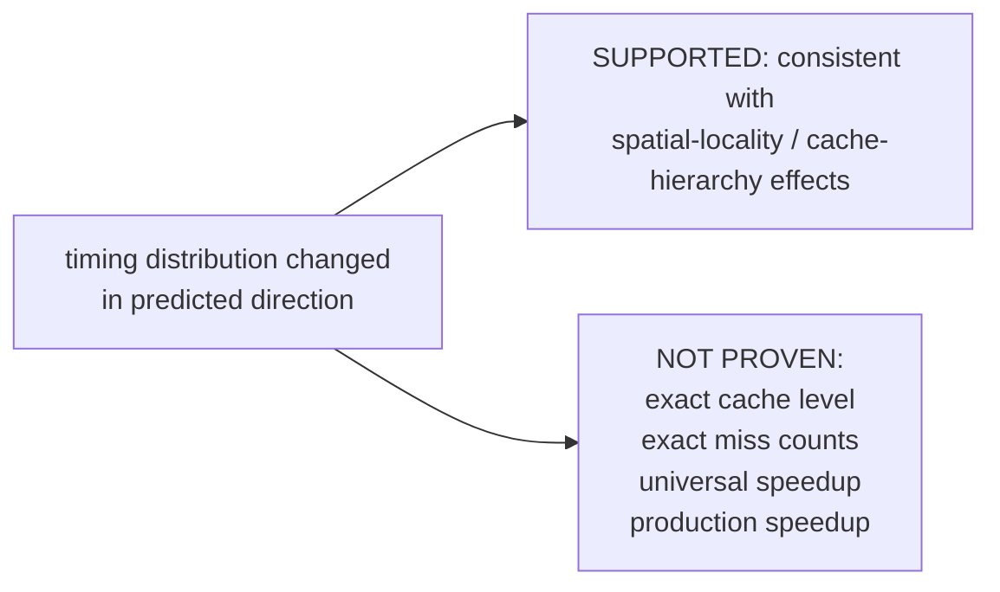

# L04-02｜访问顺序为什么会影响时间？一次更快能证明原因吗？

## Locality / 局部性 — EC-CON-012

**Locality（局部性）**：程序的访问在一段时间内倾向于集中在相近位置（spatial locality）或重复使用近期访问过的数据（temporal locality）的性质。Locality 描述访问模式；Caching 是利用某些访问模式机会的机制。两者不是同一个概念。

## Address walk｜同一数据，不同顺序



在本实验的 4096×4096 `uint32_t` 连续数组中，row-major inner loop 按相邻元素推进；column-major inner loop 每次跨一整行。这个 source-level 变化会改变 spatial-locality opportunity，但实际机器效果仍取决于编译器和硬件。

## Fair measurement pattern



M04 第一次 assessed 使用这个 applied measurement-uncertainty pattern。它不是正式统计学课程；目标是让 claim 与 evidence 尺度匹配。

## Core experiment

运行：

```bash
cd labs/foundations/m04
./reset.sh
./run.py
```

Baseline 是 row-major traversal；controlled change 是 column-major traversal。固定 dataset、dimensions、element type、allocation/layout、总元素数、source-level addition、process、build flags 与 checksum requirement。Core 使用至少 2 次/模式的 untimed warmup，以及 15 次/模式的 recorded trials。trial order 使用 counterbalanced AB/BA pairs，并把 execution order 写进 raw CSV。

Warmup 只减少明显 first-run/setup effects；它**不**意味着 cache 已知为 warm，也不制造“已知 cold cache baseline”。

## Raw values → summary，不丢掉分布



`median` 给中心位置，IQR 给中间 50% 的 spread。它们都不能替代 raw values。不要因为某个点“不方便”就删除 outlier；记录并讨论它。最少 15 次样本不要求 p95/p99。

## Compiler transformation check

活动以 `-O2 -fno-tree-vectorize -fno-unroll-loops` 构建，降低 row path 被自动 SIMD/vectorization 而 column path 没有的明显混杂。仍要用 `objdump` 等检查 generated build：确认两个 traversal 都保留真实 load/add loop，并把无法排除的 transformation 标成 checked/plausible/unresolved，而不是宣称完美隔离。

## Inference boundary



至少列出两个 competing explanations，例如 scheduler/virtualization noise、CPU frequency/thermal change、hardware prefetch、TLB/page effects、execution-order/cache-state effects、compiler differences。给每项标 `controlled`、`checked`、`plausible` 或 `unresolved`。

`perf` 若可用，只能作为 optional corroboration；不可用或受限时不扣分，也不允许降低 host/container security。counter change 也不自动完成 causal proof。

## Break / repair｜识别不公平实验

下面结果不能作为 assessed evidence：只跑一次；只 warmup A；同时改 dataset size 和 traversal；A/B 使用不同 arithmetic；明显 all-A-then-all-B 且环境存在时间趋势。指出哪个变量没控制，然后修复设计再测。

## Author smoke observation

在本次作者环境 `Linux 6.18.35 x86_64 / GCC 14.2.0 / Python 3.13.5` 上，64 MiB dataset、2 warmups/模式、15 trials/模式的实际 run 得到 row median `5,859,074 ns`、IQR `373,701 ns`；column median `112,954,504 ns`、IQR `3,011,595.5 ns`；column/row median ratio 约 `19.28×`。row 最大值 `6,906,849 ns` 与 column 最大值 `135,827,436 ns` 显示仍有 run-to-run variation/outlier。`perf` 未安装。

这只支持：**在记录的环境/build/workload 下，改变 traversal order 后 timing distribution 按预测方向变化，且差异大于本次观察到的 within-pattern IQR；结果与 spatial-locality/cache-hierarchy effects 一致。它不识别唯一 cache level，也不证明 machine-independent ratio。**

<details>
<summary>Question → Hint 1</summary>
先写 hypothesis，再把唯一 source-level change 圈出来：traversal order。
</details>

<details>
<summary>Hint 2</summary>
不要只问“哪个 median 小”；同时看 IQR、raw outliers、execution order 与 compiler/build。
</details>

<details>
<summary>Expected Observation</summary>
作者 smoke fixture 中 row-major distribution 明显低于 column-major，并存在可见 run-to-run variation；你的机器可能得到不同幅度，甚至更噪，必须保留自己的 raw evidence。
</details>

<details>
<summary>Full Explanation</summary>
row-major inner loop 连续推进地址，column-major inner loop 大步长推进；前者通常提供更强 spatial-locality opportunity。公平实验固定其他 source-level 条件，做 warmup、counterbalanced repeated trials、保留 raw values，并用 median/IQR 判断 effect direction 相对 spread。结论应停在“consistent with”；若要证明精确 cache miss/level，需要更强 mechanism evidence。
</details>

## Common Misconceptions

- **“Locality = caching。”** 错；前者是 access pattern property，后者是 mechanism。
- **“一次更快已经证明原因。”** 错；一次 run 不能满足 M04 evidence。
- **“median 有了就不用看 variation。”** 错；IQR/raw outlier 同样重要。
- **“p95 总比 median 好。”** 错；15-trial Core 不制造 percentile precision。
- **“warmup 后 cache state 已知。”** 错。
- **“perf 是性能分析必需品。”** 错；Core completion 不依赖 privileged counters。
- **“microbenchmark 直接预测 production speedup。”** 错。

## Exit Criteria

提交 pre-data hypothesis、baseline/change、固定项、preflight、30 条 raw trial、checksum equivalence、median/Q1/Q3/IQR/ratio、variation/outlier note、至少两个 competing explanations、bounded conclusion 与 inference limits。

## Competency mapping

- **Observe（primary）**：保留 raw timing 与环境证据；
- **Diagnose**：区分 observation 与 competing explanation；
- **Estimate**：比较 between-pattern effect 与 within-pattern spread；
- **Explain**：EC-CON-012 spatial/temporal locality；
- **Judge**：限制 causal 与 universal claims。
