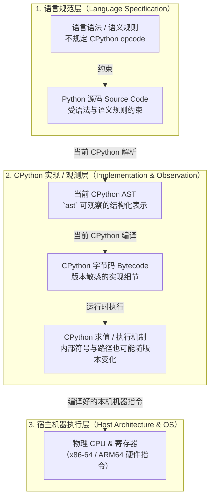

# L05-01｜我的 Python 是怎样变成一条指令的？

## 学习者问题

在编辑器里写下的 `return a + b` 是一段人类可读的纯文本。计算机 CPU 只能执行机器指令。那么，这段 Python 源码是如何一步步跨越抽象层，最终驱动 CPU 进行运算的？Python 真的像某些人说的那样“逐行直接解释执行源码”吗？CPython 字节码是不是机器码？

## 为什么重要

建立精准的**计算系统世界模型**，核心在于看清不同系统层级之间的边界与职责：
- Python 语言参考定义语法与语义契约（Specification）；
- CPython、PyPy、MicroPython 等实现用各自的数据结构与执行机制去实现相应语言行为；
- 本课实际观察的是 **CPython**：它会产生自己的 AST/Code Object/字节码等实现表示；
- 宿主 CPU 最终执行的是 Python 实现本身以及它调用的本机代码所对应的机器指令。

混淆了语言规范与实现细节，就会误把“CPython 当前版本的字节码操作”当成“Python 语言的永恒法则”，或者误以为虚拟机字节码能直接烧录在硅片上跑。

## 学习目标

完成本课后，你应能：
- 画出从 Python 源码文本到 AST、字节码、虚拟机执行循环再到 CPU 的完整翻译路径；
- 严格区分 **Python 语言规范**、**CPython 虚拟机实现** 与 **宿主机器执行层**；
- 使用标准库 `dis` 模块观测函数的字节码，并按语义类别（加载、运算、返回）解读指令序列；
- 解释为什么观察到的具体操作码（如 Python 3.13 中的 `LOAD_FAST_LOAD_FAST` 或 `BINARY_OP`）是版本敏感的实现细节，而不是语言规范保证。

## 前置知识

- M01：Representation（信息的二进制表示与编码）；
- M03：Machine & ISA Execution（CPU 执行指令、寄存器、程序计数器）；
- 基本的 Python 函数定义与调用经验。

---

## Mental Model｜源码到机器的分层穿越

源码不会被 CPU 硬件直接“感知”，它必须经过一系列结构转换与表示变换（Representation Transformation）：



### 三个绝对不能混淆的边界

1. **源码 $\neq$ 当前 CPython AST**：源码是文本表示；`ast` 展示的是当前 Python/CPython 工具链可观察的抽象语法结构，抽象语法本身也可能随 Python 版本变化。
2. **字节码 $\neq$ 机器码**：`dis` 分析的是 CPython 字节码；Python 官方明确把它标为 CPython 实现细节，不保证跨 Python VM 或版本稳定。
3. **语言规范 $\neq$ CPython 实现**：语言参考规定语法/表达式等行为，但不要求生成某个 CPython opcode、偏移或内部函数调用路径。

---

## Mechanism｜从源码到操作码的真实观测

我们以 `labs/foundations/m05/fixtures.py` 中的最小算术函数为例：

```python
def add(a, b):
    return a + b
```

### Predict before reveal

在运行观察工具前，请在你的记录单上写下预测：
1. `return a + b` 这一行，在 CPython 中会被直接翻译成 CPU 的 `ADD` 硬件指令吗？
2. 虚拟机在执行加法前，需要先对参数 `a` 和 `b` 做什么准备工作？

### Observe｜查看实际字节码

在实验目录中运行检查工具：

```bash
cd labs/foundations/m05
python inspect_runtime.py
```

在 CPython 3.13 环境下，你将观察到类似如下的输出：

```text
=== 2. CPython Bytecode Inspection (L05-01) ===
Observed opcodes (CPython 3.13.1):
  RESUME                 arg=0
  LOAD_FAST_LOAD_FAST    arg=('a', 'b')
  BINARY_OP              arg=0
  RETURN_VALUE           arg=None
```

> **版本敏感性警示（Version-Sensitive Detail）：**
> - 如果你在 **Python 3.11 或 3.12** 下运行，你看到的可能是两条独立的 `LOAD_FAST a` 和 `LOAD_FAST b`，紧跟着 `BINARY_OP 0 (+)`。
> - 如果你在 **Python 3.10 或更早版本** 下运行，你看到的可能是 `BINARY_ADD`。
> - 在作者实测的 **CPython 3.13.1** 与 Lead 复核的 **CPython 3.13.5** 中，该 fixture 会出现 `LOAD_FAST_LOAD_FAST`；其他 Python/CPython 版本可能拆分、重命名或进一步专门化这些内部操作。
>
> **语言层的加法语义不能从某一版 opcode 布局反推。** 这里的 opcode 只作为当前 CPython 构建的观察证据。

---

## Build｜理清各个操作的语义角色

不要死记指令名字，要按**语义类别**理解栈机工作机制：

| 语义角色 | 在本次构建中观察到的指令 | 职责说明 |
|---|---|---|
| **调用准备** | `RESUME` | 内部状态检查、支持追踪与生成器/协程恢复（Python 3.11+ 引入） |
| **数据加载** | `LOAD_FAST_LOAD_FAST` 或 `LOAD_FAST` | 从当前函数调用帧的局部变量数组中，把变量引用压入虚拟求值栈 |
| **二元求值** | 当前 CPython 构建中观察到 `BINARY_OP`（`dis` 显示 `+`） | 表示当前实现中的二元加法求值步骤；不要把数值参数或具体 opcode 名称当作跨版本契约 |
| **退出返回** | `RETURN_VALUE` | 弹出栈顶结果，作为当前函数的返回值交付给调用者调用栈 |

---

## Break｜为什么不能把字节码当成机器码？

这是一个**概念性反例，不是让你真的跳转执行任意字节**。CPython 字节码遵循 CPython 自己的编码与解释规则，而 CPU 只按宿主 ISA 解码机器指令。两套编码没有“可直接执行”的契约。

如果任意把一串 CPython 字节交给 CPU 当机器码，实际后果取决于宿主 ISA、字节内容、内存映射与安全机制：可能很快触发异常，也可能被解码成完全无关的机器指令后产生不可预测行为。**因此不能声称它必然立即得到某一种异常，更不应把这种危险执行当作实验步骤。**

本课需要证明的只有一件事：`dis` 展示的 CPython bytecode 必须由对应 Python 实现的运行时机制解释/执行；它本身不是 x86-64、ARM64 或 RISC-V 的机器码。

---

## Explain｜从抽象层看“Python 运行速度”

很多初学者问：“为什么 Python 比 C 语言慢？”
通过本课的机制链条，你现在可以给出**机制层面的精确解释**：

1. **实现路径更长**：对同一个高层表达式，不同语言实现可能采用 AOT 编译、解释器、JIT 或混合执行。当前 CPython 的通用对象运算通常包含 opcode 分发、对象/类型相关处理与运行时调用，而优化后的本机代码可能走更短的机器指令路径。
2. **动态对象语义有成本**：在 CPython 中，Python 值由带类型信息的对象表示；通用加法需要按照运行时对象类型选择对应语义。具体机器指令数量与延迟取决于 Python 版本、编译器、CPU、操作数类型和是否发生专门化，**本课不提供固定倍率或“单指令/单周期”结论**。

这是 **Abstraction（抽象）与 Trade-off（权衡）** 的一个例子，但性能结论必须来自针对具体实现与 workload 的测量，而不能只凭“静态/动态”标签推断。

---

## Judge｜你知道什么，猜什么？

在填写证据记录时，请严格约束语言：

- **错误断言**：“Python 是直接逐行读取文本执行的。”（错，文本在执行前已被一次性编译为内存中的字节码对象代码段）。
- **错误断言**：“`LOAD_FAST_LOAD_FAST` 是 Python 加法的标准指令。”（错，这只是 CPython 3.13 具体的栈优化指令，MicroPython 或 PyPy 并不存在这条指令）。
- **精准表述**：“在当前 CPython 3.13.1 运行环境中，测试函数的加法表达式被当前编译器编译为包含了参数加载、二元运算符分发与函数返回的字节码序列，该序列由 CPython 软件评估循环在宿主机器上解释执行。”

---

## Checkpoint Investigation

### Question
当你在 Python 中执行 `a = 1; b = 2; c = a + b` 时，硬件 CPU 的算术逻辑单元（ALU）究竟在什么时候、由谁触发去计算 `1 + 2` 的？

<details>
<summary>Hint 1</summary>
思考谁真正拥有与 CPU 沟通的物理机器码。是 Python 源码文本，还是已经编译好的 CPython 可执行文件？
</details>

<details>
<summary>Hint 2</summary>
在当前 CPython 实现中，当加法相关字节码被执行、且操作数是整数对象时，运行时必须怎样找到并执行对应的整数加法语义？不要依赖某个内部函数名。
</details>

<details>
<summary>Expected Observation</summary>
CPU 不会直接解释 Python 源码或 CPython bytecode。它执行的是 CPython 运行时及其所调用本机代码的机器指令；整数加法的具体内部函数名、专门化路径与最终机器指令序列都属于当前构建的实现细节。
</details>

<details>
<summary>Full Explanation</summary>
整个链条是：Python 编译器将 `a + b` 转化为字节码 `BINARY_OP`。宿主操作系统调度 CPU 执行 `python` 进程的机器码。当该进程的求值循环读取到这条字节码并验证两端是整数对象后，执行 CPython 源码中对应的 C 加法实现。最终由编译器为 CPython 生成的原生机器指令驱动 CPU ALU 完成数值计算。
</details>

---

## Common Misconceptions

- **“CPython 只是把源文件字符串逐行直接交给 CPU。”** 错。对本课观察的 CPython 代码单元，源码会先经过解析/编译形成可执行的内部表示（如 Code Object/bytecode），再由运行时执行；交互式、`eval`/`exec` 等入口的代码单元边界不同，不应概括成“整个 Python 世界都一次性编译”。
- **“字节码也是机器码的一种。”** 错。机器码是硬件 ISA（如 x86/ARM/RISC-V）规定的二进制机器字；字节码是软件虚拟机（CPython VM）自定义的数据格式。
- **“CPython 字节码就是 Python 语言的规范。”** 错。Python 语言规范由 Python Software Foundation 维护的 Language Reference 定义，完全不限定任何特定的字节码形式。

## What You Can Ignore—for Now

PEP 659 专门化自适应解释器（Specializing Adaptive Interpreter）的内部热点反馈计数器、JIT 编译器内部 IR、CPython 的 C 语言垃圾回收宏、多线程 GIL 实现细节。

## Exit Criteria

能够独立完成 `fixtures.py` 的字节码反汇编，画出源码到 CPU 的四层转换图，并在证据单中清晰区分哪些属于“语言语义规范”，哪些属于“CPython 3.13 当前构建的具体观测”。

## Competency Mapping

- **Explain（Primary）**：清晰阐述源码 $\rightarrow$ AST $\rightarrow$ 字节码 $\rightarrow$ VM 循环 $\rightarrow$ CPU 的机制分层；
- **Trace**：追踪一段代码由高级语法向下映射到虚拟机指令序列的过程；
- **Observe**：使用 `dis` 模块捕获并辨识实际运行环境的操作码信息。

## Provenance

- Python 官方标准库文档：*dis — Disassembler for Python bytecode*；
- Python 官方语言参考手册：*The Python Language Reference §3 (Data model)*；
- CPython 源码实现参考：`Python/ceval.c`（虚拟机核心求值循环）。
