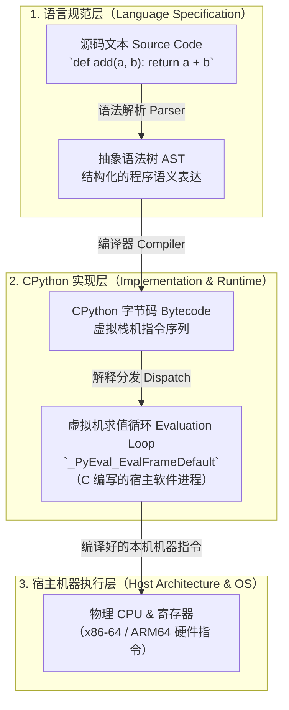

# L05-01｜我的 Python 是怎样变成一条指令的？

## 学习者问题

在编辑器里写下的 `return a + b` 是一段人类可读的纯文本。计算机 CPU 只能执行机器指令。那么，这段 Python 源码是如何一步步跨越抽象层，最终驱动 CPU 进行运算的？Python 真的像某些人说的那样“逐行直接解释执行源码”吗？CPython 字节码是不是机器码？

## 为什么重要

建立精准的**计算系统世界模型**，核心在于看清不同系统层级之间的边界与职责：
- 编程语言是一套**接口契约与语义规范（Specification）**；
- 语言实现（如 CPython、PyPy、MicroPython）是满足该规范的具体软件工程实现；
- 虚拟机（VM）是在操作系统进程内用软件模拟出的指令执行引擎；
- 物理硬件（CPU/内存）才是执行真实硬件指令的最终底座。

混淆了语言规范与实现细节，就会误把“CPython 当前版本的字节码操作”当成“Python 语言的永恒法则”，或者误以为虚拟机字节码能直接烧录在硅片上跑。

## 学习目标

完成本课后，你应能：
- 画出从 Python 源码文本到 AST、字节码、虚拟机执行循环再到 CPU 的完整翻译路径；
- 严格区分 **Python 语言规范**、**CPython 虚拟机实现** 与 **宿主机器执行层**；
- 使用标准库 `dis` 模块观测函数的字节码，并按语义类别（加载、运算、返回）解读指令序列；
- 解释为什么观察到的具体操作码（如 Python 3.13 中的 `LOAD_FAST_LOAD_FAST` 或 `BINARY_OP`）是版本敏感的实现细节，而不是语言规范保证。

## 前置知识

- M01：Representation（信息的二进制表示与编码）；
- M03：Machine & ISA Execution（CPU 执行指令、寄存器、程序计数器）；
- 基本的 Python 函数定义与调用经验。

---

## Mental Model｜源码到机器的分层穿越

源码不会被 CPU 硬件直接“感知”，它必须经过一系列结构转换与表示变换（Representation Transformation）：



### 三个绝对不能混淆的边界

1. **源码 $\neq$ AST**：源码是字符流（文本表示）；AST 是语言语法规则组织起来的高层语法树。
2. **字节码 $\neq$ 机器码**：字节码是供虚拟栈机（Virtual Stack Machine）解释的一组数字编号与参数；它不是 x86 或 ARM 的电气控制信号。
3. **语言规范 $\neq$ CPython 实现**：Python 语言参考手册（Python Language Reference）规定了 `+` 运算符在两个数字相加时的语义，但绝未规定必须生成哪个名字的操作码或哪个内存偏移。

---

## Mechanism｜从源码到操作码的真实观测

我们以 `labs/foundations/m05/fixtures.py` 中的最小算术函数为例：

```python
def add(a, b):
    return a + b
```

### Predict before reveal

在运行观察工具前，请在你的记录单上写下预测：
1. `return a + b` 这一行，在 CPython 中会被直接翻译成 CPU 的 `ADD` 硬件指令吗？
2. 虚拟机在执行加法前，需要先对参数 `a` 和 `b` 做什么准备工作？

### Observe｜查看实际字节码

在实验目录中运行检查工具：

```bash
cd labs/foundations/m05
python inspect_runtime.py
```

在 CPython 3.13 环境下，你将观察到类似如下的输出：

```text
=== 2. CPython Bytecode Inspection (L05-01) ===
Observed opcodes (CPython 3.13.1):
  RESUME                 arg=0
  LOAD_FAST_LOAD_FAST    arg=('a', 'b')
  BINARY_OP              arg=0
  RETURN_VALUE           arg=None
```

> **版本敏感性警示（Version-Sensitive Detail）：**
> - 如果你在 **Python 3.11 或 3.12** 下运行，你看到的可能是两条独立的 `LOAD_FAST a` 和 `LOAD_FAST b`，紧跟着 `BINARY_OP 0 (+)`。
> - 如果你在 **Python 3.10 或更早版本** 下运行，你看到的可能是 `BINARY_ADD`。
> - 在 **Python 3.13** 中，CPython 引入了超级指令（Superinstruction）优化，将两个相邻的局部变量加载合并为单个 `LOAD_FAST_LOAD_FAST`！
>
> **这绝不意味着 Python 语言的加法规则在 3.10、3.12 与 3.13 之间改变了！** 改变的只是 CPython 解释器实现为了提升栈操作吞吐而调整的内部字节码布局。

---

## Build｜理清各个操作的语义角色

不要死记指令名字，要按**语义类别**理解栈机工作机制：

| 语义角色 | 在本次构建中观察到的指令 | 职责说明 |
|---|---|---|
| **调用准备** | `RESUME` | 内部状态检查、支持追踪与生成器/协程恢复（Python 3.11+ 引入） |
| **数据加载** | `LOAD_FAST_LOAD_FAST` 或 `LOAD_FAST` | 从当前函数调用帧的局部变量数组中，把变量引用压入虚拟求值栈 |
| **二元求值** | `BINARY_OP`（参数 0 代表 `+`） | 从栈顶弹出两个操作数，调用对应的底层类型相加函数，并将计算结果压回栈顶 |
| **退出返回** | `RETURN_VALUE` | 弹出栈顶结果，作为当前函数的返回值交付给调用者调用栈 |

---

## Break｜如果直接给 CPU 执行字节码会怎样？

如果把 CPython 的字节码二进制文件（`.pyc` 中的字节序列）当作机器码加载到内存并让 CPU 指针（PC）直接指向它，会发生什么？
**硬件会立即触发非法指令异常（Illegal Instruction）或内存段错误（SIGSEGV）！**

因为字节码中的 `0x7A` 或 `0x19` 只是 CPython C 代码中 `enum _PyOpcode` 的代号，CPU 的硬件解码译码器根本不认识这套私有协议。必须有一个已经编译好的本机程序——即 `python.exe` 或 Linux 上的 `/usr/bin/python3`——在物理 CPU 上执行一个巨大的循环（通常是 C 语言写的 `switch-case` 或计算跳转标签），不断读取字节码并驱动 CPU 执行对应的 C 函数。

---

## Explain｜从抽象层看“Python 运行速度”

很多初学者问：“为什么 Python 比 C 语言慢？”
通过本课的机制链条，你现在可以给出**机制层面的精确解释**：

1. **中间求值循环开销**：C 语言编译后，`a + b` 直接成为一条硬件指令 `add %rax, %rbx`，耗时不到 1 个 CPU 时钟周期；而 CPython 必须经过软件循环的分发、虚拟栈压栈/出栈、类型检查与引用计数维护，耗费数十乃至上百条物理指令。
2. **动态对象拆包**：Python 中的整数是一块包含类型指针、引用计数的堆内存对象（`PyObject`），做加法时必须解包出内部的数值才能送到 CPU 的 ALU 算术逻辑单元。

这是 **Abstraction（抽象性）与 Trade-off（权衡）** 的典型体现：Python 牺牲了执行周期的极限利用率，换取了跨平台的统一语义、内存安全与无拘无束的开发灵活性。

---

## Judge｜你知道什么，猜什么？

在填写证据记录时，请严格约束语言：

- **错误断言**：“Python 是直接逐行读取文本执行的。”（错，文本在执行前已被一次性编译为内存中的字节码对象代码段）。
- **错误断言**：“`LOAD_FAST_LOAD_FAST` 是 Python 加法的标准指令。”（错，这只是 CPython 3.13 具体的栈优化指令，MicroPython 或 PyPy 并不存在这条指令）。
- **精准表述**：“在当前 CPython 3.13.1 运行环境中，测试函数的加法表达式被当前编译器编译为包含了参数加载、二元运算符分发与函数返回的字节码序列，该序列由 CPython 软件评估循环在宿主机器上解释执行。”

---

## Checkpoint Investigation

### Question
当你在 Python 中执行 `a = 1; b = 2; c = a + b` 时，硬件 CPU 的算术逻辑单元（ALU）究竟在什么时候、由谁触发去计算 `1 + 2` 的？

<details>
<summary>Hint 1</summary>
思考谁真正拥有与 CPU 沟通的物理机器码。是 Python 源码文本，还是已经编译好的 CPython 可执行文件？
</details>

<details>
<summary>Hint 2</summary>
CPython 内部是用 C 语言编写的。当虚拟机求值循环读取到 `BINARY_OP` 且操作数均为整数时，它会调用哪里的底层代码？
</details>

<details>
<summary>Expected Observation</summary>
CPU 的 ALU 并不是直接听命于 Python 源码。而是在运行中的 CPython 进程执行到其内部加法实现函数（如 `long_add`）中的机器指令时，ALU 才真正执行电平翻转完成二进制加法。
</details>

<details>
<summary>Full Explanation</summary>
整个链条是：Python 编译器将 `a + b` 转化为字节码 `BINARY_OP`。宿主操作系统调度 CPU 执行 `python` 进程的机器码。当该进程的求值循环读取到这条字节码并验证两端是整数对象后，执行 CPython 源码中对应的 C 加法实现。最终由编译器为 CPython 生成的原生机器指令驱动 CPU ALU 完成数值计算。
</details>

---

## Common Misconceptions

- **“Python 运行时直接读源文件字符串并一行行跑。”** 错。所有执行前都必须经过完整的词法分析、语法分析并编译为 Code Object 字节码对象。交互式命令行也是每输完一个逻辑代码块就立即编译执行该块字节码。
- **“字节码也是机器码的一种。”** 错。机器码是硬件 ISA（如 x86/ARM/RISC-V）规定的二进制机器字；字节码是软件虚拟机（CPython VM）自定义的数据格式。
- **“CPython 字节码就是 Python 语言的规范。”** 错。Python 语言规范由 Python Software Foundation 维护的 Language Reference 定义，完全不限定任何特定的字节码形式。

## What You Can Ignore—for Now

PEP 659 专门化自适应解释器（Specializing Adaptive Interpreter）的内部热点反馈计数器、JIT 编译器内部 IR、CPython 的 C 语言垃圾回收宏、多线程 GIL 实现细节。

## Exit Criteria

能够独立完成 `fixtures.py` 的字节码反汇编，画出源码到 CPU 的四层转换图，并在证据单中清晰区分哪些属于“语言语义规范”，哪些属于“CPython 3.13 当前构建的具体观测”。

## Competency Mapping

- **Explain（Primary）**：清晰阐述源码 $\rightarrow$ AST $\rightarrow$ 字节码 $\rightarrow$ VM 循环 $\rightarrow$ CPU 的机制分层；
- **Trace**：追踪一段代码由高级语法向下映射到虚拟机指令序列的过程；
- **Observe**：使用 `dis` 模块捕获并辨识实际运行环境的操作码信息。

## Provenance

- Python 官方标准库文档：*dis — Disassembler for Python bytecode*；
- Python 官方语言参考手册：*The Python Language Reference §3 (Data model)*；
- CPython 源码实现参考：`Python/ceval.c`（虚拟机核心求值循环）。
