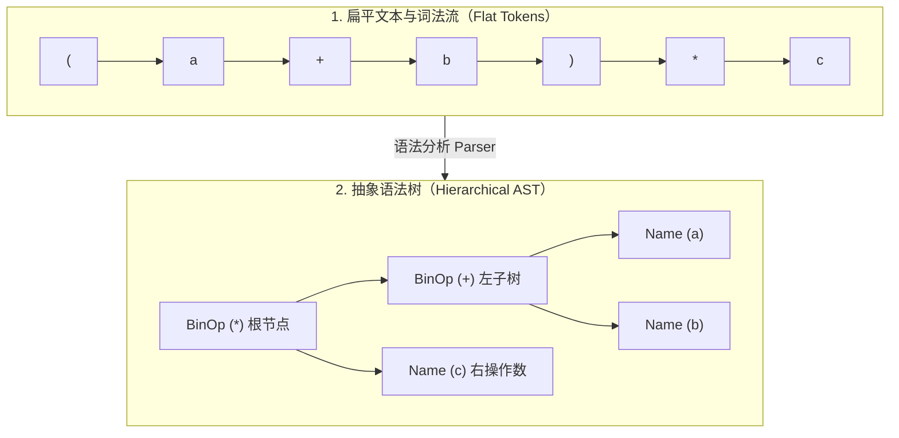

# L05-02｜编程语言到底是什么？

## 学习者问题

我们每天都在写代码，但“一门编程语言”到底指的是什么？是语法规则？是写出的文本文件？是编译器这个软件？为什么写错括号会报错，而即使语法完全正确的代码跑起来也可能发生崩溃？语法解析（Syntax Parsing）和实际运行（Execution）的根本分界线在哪里？

## 为什么重要

在计算机科学中，混乱往往源于对**接口与实现**的含糊其辞：
- 很多开发者误以为“Python 就是 CPython 这个软件本身”；
- 有人以为缩进是程序在运行时“一边数空格一边判断”的；
- 还有人把语法解析阶段的语法错误（SyntaxError）与运行阶段的逻辑/类型错误（TypeError/ValueError）混为一谈。

看清了“语言是规范、语法树是结构化表示、运行时是执行引擎”的三重解耦，你就具备了快速学习任何一门新语言的坚实基石，而不会被纷繁复杂的语法糖迷花了眼。

## 学习目标

完成本课后，你应能：
- 解释源码字符流、语法规则（Grammar）、抽象语法树（AST）与运行时引擎之间的职责区别；
- 使用 Python 标准库 `ast` 模块观测表达式解析出的树状结构，并指出运算符优先级（如 `(a + b) * c`）在树深层级中的确切映射；
- 动手理解树状求值器（AST Evaluator）如何对结构化表示进行求值；
- 制造一个可复现的语法错误，证明解析阶段的失败发生在任何指令执行之前；
- 用精确术语解释为什么“一门语言规范可以存在多种不同的编译器与运行时实现”。

## 前置知识

- L05-01：Python 源码到字节码的分层穿越；
- M01：Representation（表示形式）；
- M02：Specification（规范）与 Interface（接口）。

---

## Mental Model｜从扁平字符串到多维语法树

人类在键盘上敲入的是一行行**一维线性的字符序列（Flat Stream of Characters）**。但人类大脑思考的计算逻辑是**嵌套与分层的（Hierarchical）**。编译器/解释器前端的第一道核心任务，就是根据形式文法（Grammar）把线性文本升级为树状结构（AST）：



### 关键心智跃迁

1. **AST 不是漂亮的文本**：`ast` 返回的是结构化节点对象。相关表达式/语句节点可带源码位置等元数据，但并非“每个节点都必有相同字段”，具体抽象语法也可能随 Python 版本变化。
2. **优先级会反映到当前 AST 的嵌套关系**：对 `(a + b) * c`，外层是乘法，左子树是加法；我们的自底向上求值器因此先求子树，再求父节点。不要把这一棵 CPython/Python `ast` 树误当成所有语言实现都必须暴露的内部结构。
3. **AST 是一种有损的结构化表示**：它保留本次语义分析需要的结构关系，但会省略或规范化不少原始文本细节。

---

## Mechanism｜用 microscope 观察 AST

在 `labs/foundations/m05/fixtures.py` 中，我们准备了一个典型的带括号复合表达式：

```python
EXPRESSION_PRECEDENCE = "(a + b) * c"
```

### Predict before reveal

如果让你用树表示 `(a + b) * c`：
- 这棵树的根节点是乘法运算还是加法运算？
- 如果去掉括号写成 `a + b * c`，根节点会变成什么？

### Observe｜查看真实解析结果

运行观察脚本：

```bash
cd labs/foundations/m05
python inspect_runtime.py
```

终端将打印出通过 `ast.dump()` 格式化后的树状结构：

```text
=== 1. AST Inspection (L05-01 & L05-02) ===
AST for '(a + b) * c' (Precedence structure):
Expression(
  body=BinOp(
    left=BinOp(
      left=Name(id='a', ctx=Load()),
      op=Add(),
      right=Name(id='b', ctx=Load())),
    op=Mult(),
    right=Name(id='c', ctx=Load())))
```

看到了吗？
- 顶层 `body` 是一个 `BinOp`（二元运算），它的操作符 `op` 是 `Mult()`（乘法）；
- 它的 `left` 左侧操作数不是简单的名字，而是另一个完整的 `BinOp`，其操作符是 `Add()`（加法）；
- 括号在字符流中用来提示解析器“提升优先级”，但在解析生成的 AST 里，括号已经消失了，变成了子树的深度嵌套！

---

## Build｜极简树状求值器（Tree Evaluator）

为了真正理解“程序执行到底是在干什么”，我们在 `fixtures.py` 中编写了一个不到 25 行的极小求值器：

```python
def evaluate_simple_ast(node, env):
    if isinstance(node, ast.Expression):
        return evaluate_simple_ast(node.body, env)
    if isinstance(node, ast.Constant):
        return node.value
    if isinstance(node, ast.Name):
        return env[node.id]
    if isinstance(node, ast.BinOp):
        left_val = evaluate_simple_ast(node.left, env)
        right_val = evaluate_simple_ast(node.right, env)
        if isinstance(node.op, ast.Add):
            return left_val + right_val
        if isinstance(node.op, ast.Mult):
            return left_val * right_val
```

在 `inspect_runtime.py` 底部，我们传入变量环境字典 `{"a": 2, "b": 3, "c": 4}`：
- 求值器递归访问根节点 `Mult`；
- 先递归求其左子树 `Add`：查环境得 `a=2, b=3`，计算 $2 + 3 = 5$；
- 再递归求其右子树 `c`：查环境得 `c=4`；
- 最终在根节点完成乘法：$5 \times 4 = 20$。

这个 25 行 fixture 展示的是一种**最小树解释器**：按树结构递归求值，并从显式环境中取变量。真实语言实现可以采用字节码 VM、JIT、AOT 编译或混合方案；不要把这个教学求值器当成“解释执行唯一或最本真的实现”。

---

## Break｜让解析在第一步就轰然倒塌

如果源码不符合语法规范，会发生什么？
在 `fixtures.py` 中有一段破损的代码：

```python
BROKEN_SYNTAX_SOURCE = "def broken(\n"
```

当解析器尝试对其执行 `ast.parse()` 时，控制台立即抛出：

```text
SyntaxError: '(' was never closed (<unknown>, line 1)
```

### 关键思考

针对这段**待解析的 broken snippet**，是否会生成一个可供它自身执行的正常 Code Object，并进入该 snippet 的运行时求值？不会。解析在产生可执行代码对象之前以 `SyntaxError` 失败。

注意：调用 `ast.parse()` 的检查器程序本身当然正在 CPU/CPython 上执行。这里的“执行前失败”只指**目标 snippet 没有进入其运行阶段**。

---

## Explain｜语言规范 vs 实现的多样性

现在我们可以回答本课的核心问题：**什么是 Python？**

1. **Python 是一份规范（Specification）**：
   由 Python Software Foundation 维护，规定了关键字有哪些、括号怎么闭合、作用域怎么查找、面向对象怎么分发。
2. **CPython 是 Python 最主要、最广泛使用的实现之一（Implementation）**：
   本课用它观察 `ast`、Code Object 与 bytecode。具体 AST/bytecode/求值内部结构属于实现与版本层，不是语言规范强制的内部格式。
3. **完全可以有其他实现**：
   - **PyPy**：用 RPython 编写，带有 JIT（即时编译）编译器，能将热点代码直接编译成 x86/ARM 本机机器码；
   - **MicroPython**：用 C 编写，专为单片机和嵌入式设备深度精简内存占用；
   - **RustPython**：用 Rust 语言编写的独立 Python 解释器。

这些实现可以拥有不同代码库、内部表示、JIT/解释策略与内存管理机制。判断“语言行为”时应回到它们所声明支持的 Python 版本/规范与实现文档；实现还可能有扩展、缺失特性或实现定义差异，不能只用“某个例子结果相同”作为兼容性的充分条件。

---

## Checkpoint Investigation

### Question
如果你的 Python 代码里有一行 `1 / 0`（除以零），这会在语法解析阶段被当作 `SyntaxError` 拦下来，还是在运行时才会报错？为什么？

<details>
<summary>Hint 1</summary>
语法分析器关心的只是“文本符不符合语言结构规则”，比如“数字除以数字”在语法上是否成立。
</details>

<details>
<summary>Hint 2</summary>
除数是不是 0，是一个具体的“值（Value）”，还是一个“语法结构（Grammar Structure）”？
</details>

<details>
<summary>Expected Observation</summary>
代码能够顺利通过语法解析，并在执行时抛出 `ZeroDivisionError` 运行时异常，而不是 `SyntaxError`。
</details>

<details>
<summary>Full Explanation</summary>
在语法层面，`1 / 0` 是一个完全合法的 `BinOp(Constant(1), Div(), Constant(0))`。语法解析器只验证“表达式由操作数与运算符正确构成”，并不关心操作数的具体数学含义。只有当程序编译成字节码、并在运行时真正尝试执行除法指令时，除法实现检测到除数为零，才会由运行时向外抛出 `ZeroDivisionError`。这清晰地划开了语法检查与运行时求值的边界。
</details>

---

## Common Misconceptions

- **“AST 只是给源代码加了语法高亮。”** 错。`ast` 给出结构化节点关系，而不是文本着色；它会省略/规范化部分文本细节，并且抽象语法本身可能随 Python 版本变化。
- **“语法错误和运行时异常只是报错名字不同。”** 错。语法错误发生在代码执行前的解析阶段，整个文件寸步难行；运行时异常发生在机器/虚拟机执行某条具体指令的时刻。
- **“学习一门语言就是安装它的可执行文件。”** 错。可执行文件只是该语言的一个具体实现环境；理解语言的本质是理解其文法体系与语义模型。

## What You Can Ignore—for Now

LL(k) / LR(k) / PEG（Parsing Expression Grammar）文法分析算法、词法扫描器的 DFA 状态机转移图、AST 到 SSA 形式的优化遍历。

## Exit Criteria

能使用 `ast` 模块打印任意复合表达式的 AST，能清晰指出操作符深度与运算优先级的对应关系，并能准确阐述为什么语法错误发生在运行时求值之前。

## Competency Mapping

- **Explain（Primary）**：阐述语言规范、语法解析树与运行引擎的本质区别；
- **Learn-New-Tech**：通过官方语言参考手册理解新语言的形式文法与抽象语法树表示。

## Provenance

- Python 官方文档：*ast — Abstract Syntax Trees*；
- Python 语言规范：*The Python Language Reference §2 (Lexical analysis) & §9 (Full Grammar specification)*。
