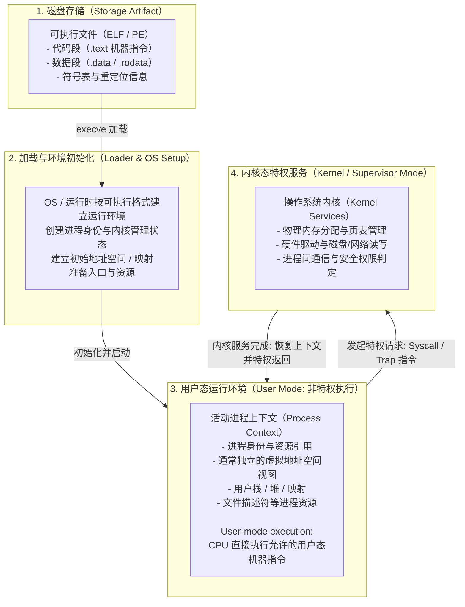

# L06-01｜操作系统运行程序时到底发生了什么？

## 学习者问题

我们在终端敲下 `./app` 或在图形界面双击一个图标，屏幕上就弹出了窗口并开始响应操作。硬盘里的那个可执行文件（ELF / EXE），和正在运行的这个“程序”到底是什么关系？操作系统在这个过程中扮演了什么角色？计算机是如何区分“我的代码”和“操作系统的内核代码”的？

## 为什么重要

在日常编码中，很多初学者把硬盘上的代码文件、进程、线程甚至容器和虚拟机混为一谈：
- 有人以为“程序就是进程”；
- 有人以为进程运行中执行的每一条 CPU 指令都要经过操作系统内核批准；
- 还有人误以为系统调用（System Call）就像调用普通函数库一样廉价。

建立精确的计算系统世界模型，必须看清**程序制品（Program Artifact）与运行中进程上下文（Process Execution Context）的本质边界**，以及 CPU 硬件在**用户态（User Mode）与内核态（Kernel Mode）之间设立的刚性特权屏障**。

## 学习目标

完成本课后，你应能：
- 准确给出 **Process（进程，EC-CON-018）** 的规范定义，并指出它与源码、可执行文件、线程、容器的本质区别；
- 画出程序制品从磁盘静态文件被加载为活动进程上下文、并在用户态执行指令与通过系统调用跨越内核特权态的完整全景图；
- 解释为什么用户空间代码的大多数运算直接由 CPU 本地指令完成，而特权资源必须通过系统调用接口（Syscall Interface）委托内核执行；
- 在 Linux 系统上使用 `/proc/self/status` 提取真实的进程标识（PID）及内存指标，并验证其与语言运行时 `os.getpid()` 的一致性；
- 解释为什么不能用 `time()` 作为系统调用的典型观测代表（vDSO 快速通道优化），而应通过 `write` 或 `getpid` 观测真实的特权态跨越。

## 前置知识

- M03：CPU 执行指令、寄存器、程序计数器（PC）与特权级（Privilege）；
- M05：源码文本到编译器字节码与宿主进程执行的层级跨越。

---

## Mental Model｜核心概念：什么是进程（Process）？

> ### 核心概念定义（First Home: EC-CON-018）
> **Process（进程）**：一个由操作系统管理的**执行上下文（Managed Execution Context）**，具有身份（Identity）、资源（Resources），并且通常具有地址空间边界（Address-Space Boundary）；程序通过这个上下文运行。它不是源码、线程、容器镜像或虚拟机。
>
> **边界警示（What it is NOT）**：
> - 进程 **不是** 磁盘上的源码或可执行文件（那是静态制品）；
> - 进程 **不是** 线程（线程是进程内部被调度的执行流，同一进程的多个线程共享该进程的地址空间与资源）；
> - 进程 **不是** 容器镜像（容器镜像是打包的文件系统，容器本身仍是由宿主内核管理的一组受限制的进程集合）；
> - 进程 **不是** 虚拟机（虚拟机模拟了一整套虚拟硬件系统）。

### 程序制品 vs 进程上下文 vs 特权分级



### 关键认知厘清

1. **用户代码大部分时间是在物理 CPU 上直接跑指令**：
   千万不要以为“Python 或 C 程序的每一次 `x = a + b` 都要经过操作系统审核”。只要在分配好的用户虚拟内存范围内，CPU 以最高速度本地执行指令。
2. **硬件模式（CPU Mode）是特权检查的铁律**：
   - 在 **用户态（User Mode）** 下，架构会限制特权寄存器、地址转换控制、设备/中断等敏感操作。具体被限制的寄存器和 I/O 机制依 ISA 而异。
   - 现代体系结构为此提供了明确的硬件分级支持：例如 x86 的 Ring 3（用户态）与 Ring 0（内核态），RISC-V 的 U-mode（用户态）与 S-mode（监管者模式）。
3. **系统调用（Syscall）是向内核请求特权服务的官方受控受检通道**：
   当用户程序请求内核管理的资源或服务时，需要通过 OS 定义的系统调用接口。不同 ISA/OS 的进入机制不同，例如 x86-64 Linux 常用 `syscall`，RISC-V xv6 使用 `ecall`；这不是一条跨平台固定指令。

---

## Mechanism｜观测真实的进程标识与内核属性

我们使用 `labs/foundations/m06/process_observer.py` 在宿主环境上实测进程属性。

### 1. 进程身份标识（PID）

进程由操作系统分配进程标识。Linux 中常见的 **PID（Process Identifier）** 是整数标识，在同一 PID namespace 的同时存活进程中用于区分进程，但 PID 会被复用，并不代表永久身份。在 Linux 上，`/proc` 暴露了大量进程相关的内核视图。

运行观测脚本：

```bash
cd labs/foundations/m06
python3 process_observer.py
```

在真实 Linux 环境下将输出类似如下信息：

```text
=== M06 Process Observer ===
Current Process ID (os.getpid()): 15131
Parent Process ID (os.getppid()): 15130
Platform: Linux

=== Procfs Inspection (/proc/self) ===
Status PID: 15131 (Matches getpid(): True)
Process Name: python3
State: R (running)
Parent PID: 15130
Virtual Memory Size (VmSize): 18628 kB
FD Table Size (FDSize): 64
Stat Raw Excerpt: 15131 (python3) R 15130 15130 15130 34818 15130
```

#### 机制印证
- `/proc/self` 是一个由 Linux 内核动态维护的特殊符号链接，任何进程访问它都会被内核重定向到该进程自身的条目 `/proc/<current_pid>`；
- 从 `/proc/self/status` 的文本字段中提取出的 `Pid:`，与 Python 运行时通过底层 C 库 `getpid()` 取得的整数完全一致，证实了操作系统进程身份与应用运行时的映射事实；
- `VmSize` 揭示了内核为该进程映射的虚拟内存总空间大小。

---

## Break｜为什么 time() 不是观察系统调用的好例子？

把 `time()` / `clock_gettime()` 一律当作“必然陷入内核”的示例会误导学习者：在 Linux 的一些架构/内核/libc 组合上，时间查询可以通过 vDSO 在用户态完成，因此 `strace` 不一定看到对应的传统 syscall 进入。

### vDSO（虚拟动态共享对象）快速通道
Linux 可以把 **vDSO（virtual Dynamic Shared Object）** 映射进进程地址空间，并为某些架构提供 `__vdso_clock_gettime`、`__vdso_gettimeofday`、`__vdso_time` 等入口。C 库可以在运行时选择这些用户态 helper，从而避免一次传统 syscall trap；如果某个 vDSO 能力不可用，也可能回退到真正的系统调用。

因此，时间函数适合用来讨论“接口 ≠ 必然 syscall”，却不适合作为本课唯一的 syscall 观测靶标。

### 更稳妥的系统调用观测靶标
本活动使用 `os.write()` 对应的 Linux `write(2)` 作为 live trace 靶标。`getpid()` 可以作为补充观察，但只有在当前环境实际追踪到时才计入证据：

```bash
strace -e trace=write python3 -c "import os; os.write(1, b'SYSCALL_PROBE_OK\n')"
```

如果 `strace` 在你的环境可用，你应记录**自己的真实输出**，并确认其中出现 `write(...)`。作者本次 WSL 环境没有安装 `strace`，因此仓库不会伪造一条 PID/trace 当作作者观测。

这一 live trace 能证明当前 Linux 进程发生了 `write(2)` 系统调用；它不能单独证明所有 libc 调用都必须陷入内核，也不能代表 xv6/RISC-V 的具体 trap 指令。

---

## Explain｜进程上下文包含什么？

现在我们能够完整回答：当可执行文件被载入为活动进程时，内核到底创建并维护了哪些数据结构？

| 组成要素 | 作用说明 | 存储位置 |
|---|---|---|
| **虚拟内存空间** | 代码段（只读指令）、数据段（全局变量）、堆（动态分配）、用户栈（函数调用局部变量） | MMU 页表映射（物理内存/交换区） |
| **处理器状态** | 通用寄存器、程序计数器、栈指针等执行状态 | 需要切出 CPU 时由内核/架构相关机制保存足够的上下文；具体结构并不统一叫“PCB trapframe” |
| **内核进程管理状态** | 记录身份、父子关系、调度/资源/凭证等管理信息 | 具体数据结构随 OS 而异；Linux 有 `task_struct` 等结构，不能把“PCB”当作统一源码类型名 |
| **资源表项** | 文件描述符表（FD Table，包含标准输入 0、标准输出 1、标准错误 2）、信号处理表 | 内核专用内存区域 |

> **边界特别提示（提前预告与严谨隔离）：**
> 虽然独立的进程通常拥有独立的虚拟内存地址空间，但 **Process（进程，EC-CON-018）** 的核心是“纳管执行上下文”。不要在这里武断地认定“有了进程就有了绝对的安全隔离”。系统级别的隔离机制（Isolation，EC-CON-013）涉及更广泛的权限、命名空间与沙箱边界，我们将在 M07 L07-01 正式建立其第一归宿。

---

## Checkpoint Investigation

### Question
一个编译好的 C 语言可执行文件在磁盘上占用 50 KB。当它被双击运行并在死循环中反复执行 `1 + 1` 时，它会不断消耗磁盘空间吗？为什么在 `top` 或资源管理器中看到的内存占用通常达到几兆字节（MB）？

<details>
<summary>Hint 1</summary>
思考静态文件存储在磁盘上的内容（机器指令机器字）与操作系统在内存中建立进程时需要初始化的数据结构（堆栈、C 运行库、页表）。
</details>

<details>
<summary>Hint 2</summary>
反复执行 `1 + 1` 是在向磁盘写入数据，还是仅由 CPU 的寄存器与 ALU 在物理硅片上计算？
</details>

<details>
<summary>Expected Observation</summary>
反复执行局部算术**不会因为算术本身而把可执行文件越写越大**。进程仍会占用 CPU 与内存映射；在某些系统上还可能发生换页、日志或其他 OS 管理的 I/O，所以不能从这个实验推出“磁盘 I/O 永远为零”。内存占用来自实际映射、栈/堆、运行库与按需驻留页面等，数值由环境决定。
</details>

<details>
<summary>Full Explanation</summary>
磁盘上的可执行文件是静态程序制品；运行后，OS/运行时建立地址空间、栈/堆/共享库等映射并让用户态机器指令执行。这个循环本身没有显式文件写入，因此不会让程序制品随着 `1 + 1` 的次数增长。至于系统是否发生换页、审计/日志或其他后台 I/O，则必须由具体环境证据判断。
</details>

---

## Common Misconceptions

- **“可执行文件就是进程。”** 错。可执行文件是存放在磁盘非易失介质上的静态数据制品；进程是在内存中被操作系统动态纳管的活动执行上下文。同一可执行文件可以被启动为成百上千个互相独立的进程。
- **“进程就是线程。”** 错。进程拥有独立的地址空间和资源表；线程是进程内部的一个执行流分支，同一进程内的线程共享同一个地址空间与文件描述符表。
- **“所有用户指令都必须通过系统调用来执行。”** 错。加减乘除、局部变量读写等非特权 CPU 指令直接由 CPU 硬件本地高速执行；只有访问内核管理资源（I/O、网络、硬件时钟、进程控制）时才跨越系统调用边界。
- **“x86 Ring 3/Ring 0 是唯一的操作系统特权模型。”** 错。不同 CPU 架构有各自的特权分级设计（如 ARM 的 EL0/EL1/EL2/EL3，RISC-V 的 U/S/M 模式）。操作系统将通用的用户态/内核态抽象映射到具体的硬件特权级上。

## What You Can Ignore—for Now

ELF 动态重定位重定向表（GOT/PLT）的解析算法、Linux 内核 `task_struct` 内部复杂的链表拓扑、x86 硬件任务切换 TSS（Task State Segment）细节。

## Exit Criteria

能够准确表达 **Process（EC-CON-018）** 的规范边界，列举进程上下文中的身份/资源/执行状态，用实际 Linux 证据核对 PID，并能区分用户态执行、系统调用接口与具体 ISA trap 机制。

## Competency Mapping

- **Trace（Primary）**：追踪程序从磁盘二进制文件到加载为进程上下文并向内核发起系统调用的全链路；
- **Observe**：使用 `/proc/self` 和 `strace` 观察并记录真实的操作系统属性与系统调用事件；
- **Explain**：阐述用户态与内核态特权分界的软硬件机制。

## Provenance

- Linux 手册页：*proc(5) — process information pseudo-filesystem*；
- Linux 手册页：*syscalls(2) — Linux system calls*；
- POSIX.1-2024 / The Open Group Base Specifications Issue 8：Process 定义与相关进程接口；
- Andrew S. Tanenbaum: *Modern Operating Systems (Processes & System Calls)*。
