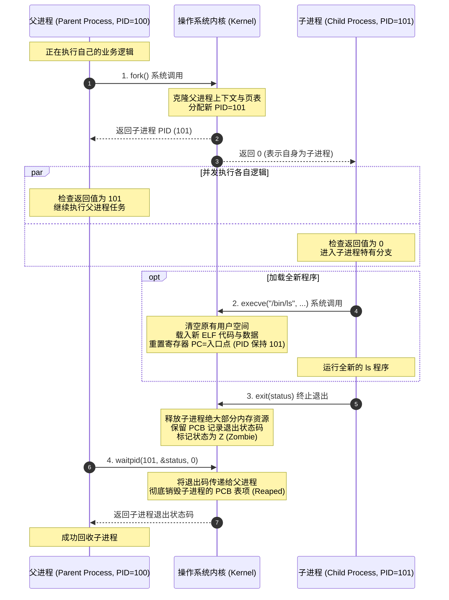

# L06-02｜一个程序是如何启动另一个程序的？

## 学习者问题

当你在终端里输入 `python script.py` 或在微信里点击一个链接打开浏览器时，新的程序究竟是如何被召唤并运行起来的？操作系统的进程树是如何生长的？为什么一个已经运行完的代码还会变成所谓的“僵尸（Zombie）”？

## 为什么重要

在经典的系统调用与进程模型中，进程的诞生与新程序的执行并不是一个单一的魔法操作，而是被解耦为两个极其优雅而深刻的阶段：
1. **`fork()`**：复制克隆当前进程上下文；
2. **`exec()`**：将新程序的代码与数据装载进当前进程空间，彻底替换原有的内存映像。

如果把这两个步骤混淆为“执行 fork 就是运行新程序”，或者误把“僵尸进程”当成“疯狂吃 CPU 的病毒软件”，你就无法理解现代操作系统（包括 Web 服务器、容器引擎、Shell 脚本）最核心的进程生命周期与资源回收机制。

## 学习目标

完成本课后，你应能：
- 画出 `fork → exec → exit → wait` 经典 POSIX 进程生命周期的全链路时序图；
- 解释 `fork()` 调用的“一次调用、两次返回”语义，以及父子进程各自获得的返回值含义；
- 证明父进程与子进程在 `fork()` 之后拥有逻辑上互不干扰的独立内存空间；
- 准确解释**写时复制（Copy-on-Write, COW）**是现代 Linux 虚拟内存的实现层性能优化，而非 POSIX 抽象规范所必须保证的语言行为；
- 说明 `execve` 为什么**没有创建新的 PID**，而是对现有进程地址空间进行就地替换（In-place Replacement）；
- 用实验事实阐明**僵尸进程（Zombie Process）**的真正机制：它已经死亡且不再消耗 CPU 时钟，其存留只是为了等待父进程读取其退出码（Exit Status）。

## 前置知识

- L06-01：进程定义（EC-CON-018）、进程上下文与用户态/内核态分界；
- M03：CPU 寄存器与程序计数器（PC）。

---

## Mental Model｜经典进程生命周期四部曲

POSIX 操作系统（包括 Linux、macOS 以及各类 Unix）采用了一套非常独特的双阶段进程派生设计：



---

## Mechanism｜从实验中验证生命周期

我们使用 `labs/foundations/m06/fork_exec_fixture.py` 观察这个生命周期的实际运行。

### 1. 一次调用，两次返回

在 POSIX 环境下运行：

```bash
cd labs/foundations/m06
python3 fork_exec_fixture.py
```

终端打印输出：

```text
=== M06 Fork & Process Lifecycle Fixture ===
Parent PID: 15136
Fork returned child PID: 15137
Child reported PID: 15137
Memory unshared: Parent var=100, Child mutated var=999 (Isolated: True)
Child reaped exit code: 42 (Matches 42: True)
```

#### 机制剖析
- 源码中只写了一处 `pid = os.fork()`，但该语句之后父子两条执行路径同时向前推进；
- **在父进程中**：`pid` 变量接收到的是刚刚被创建出来的子进程的实际编号（`15137`）；
- **在子进程中**：`pid` 变量接收到的是 `0`（方便子进程明确知道“我是刚刚出生的那个”）；
- 两个进程可以通过调用 `os.getpid()` 和 `os.getppid()` 验证彼此的亲子血缘关系。

### 2. 内存不共享：独立的地址空间

在 `fork_exec_fixture.py` 中，我们在派生前定义了变量 `test_var = 100`：
- 子进程诞生后，立即执行 `test_var = 999`；
- 父进程随后读取自己的 `test_var`，其值**依然坚如磐石地保持为 100**！
- 这直接证明：`fork()` 虽然在概念上“复制”了父进程的内存镜像，但父子进程拥有完全独立的虚拟地址空间。子进程对内存的任何局部修改，绝不会污染父进程。

> **规范与实现的严谨分界（POSIX Specification vs Linux COW）：**
> - **POSIX 语义规范**：要求父子进程在逻辑上拥有互不相干的地址空间。
> - **Linux 内核实现（Copy-on-Write, 写时复制）**：在物理层面上，为了避免无脑复制几百 MB 的内存，内核最初只复制了虚拟内存页表，并将所有物理内存页标记为“只读共享”。直到其中一方试图修改某页内容时，硬件 MMU 触发页面错误异常，内核才真正为被修改的单页分配物理内存。
>
> **请务必牢记**：写时复制（COW）是底层工程的偷懒省流优化，而不是 POSIX 语言规范在抽象层给你的语义定义！

---

## Break｜僵尸进程到底是什么？

初学者常常被“僵尸（Zombie）”这个名字吓到，甚至以为僵尸进程是系统故障或者木马病毒。

### 制造一个受控僵尸进程

在 `fork_exec_fixture.py` 中，我们故意制造了短暂的僵尸状态：
1. 子进程启动后直接执行 `os._exit(0)` 退出；
2. 父进程故意睡 `0.1` 秒，暂时**不**调用 `wait()`；
3. 父进程立即读取 `/proc/<child_pid>/stat` 观察子进程的实时状态。

实测输出：

```text
=== Controlled Zombie Observation ===
Child PID: 15138
Observed state in /proc prior to wait(): Z (Zombie 'Z': True)
Reaped in finally block: True
```

### 为什么操作系统需要设计“僵尸状态”？
思考一下：如果子进程一执行 `exit()`，内核就把子进程的一切（包括它的 PID、退出状态码、运行统计信息）瞬间抹去得干干净净，那么稍后醒来的父进程该如何获知“我的子任务是成功跑完了，还是中途崩溃了”？

因此，内核必须建立一个中间停顿态——**Zombie（在 Linux 中用字符 `Z` 标识）**：
- 子进程的虚拟内存空间、用户栈、堆和打开的文件描述符已经被**全部释放并还给系统**；
- 子进程**已经停止占用任何 CPU 时钟周期**（它根本不在就绪队列里，永远不会被 CPU 调度执行）；
- 内核唯一保留的，是进程控制块（PCB）里记录退出码的一小块元数据，静静等待父进程调用 `wait()` 或 `waitpid()` 前来认领；
- 一旦父进程调用 `wait()` 读取了退出码，这个 PCB 项才被彻底擦除（Reaped/收尸）。

---

## Explain｜execve 为什么不生成新 PID？

许多人误以为：“我要启动 `ls`，所以操作系统必须创建一个新 PID 给 `ls`。”
**错！在 Unix 哲学中，创建执行上下文与替换执行代码是两件完全独立的事：**

- `fork()` 负责申请新的 PCB、分配新 PID，并建立管理上下文；
- `execve(path, argv, envp)` 负责“脱胎换骨”：
  1. 它保留当前的 PID 与资源表项（如默认继承的标准输入输出流重定向）；
  2. 把当前进程空间里的旧程序彻底洗掉；
  3. 读取磁盘上指定的全新 ELF 文件，把新代码段和数据段重新铺设进去；
  4. 将 CPU 寄存器 PC 重置为新程序的入口地址（如 `_start`），从而开始执行全新的程序。

正是因为 `exec` 沿用了当前的进程外壳，Shell 才能在 `fork` 之后、`exec` 之前轻松完成**文件重定向（如 `> output.txt`）和管道拼接（`|`）**！

---

## Checkpoint Investigation

### Question
如果一个父进程由于逻辑 Bug 陷入了无限死循环，永远没有调用 `wait()`，而它派生出的 1000 个子进程都已经执行完毕退出了。此时系统里会发生什么？会把 CPU 跑满吗？最先枯竭的系统资源是什么？

<details>
<summary>Hint 1</summary>
回顾僵尸进程的资源占用：它还占有内存和 CPU 吗？
</details>

<details>
<summary>Hint 2</summary>
操作系统给每个系统预留的 PID 编号总量是无限的吗？
</details>

<details>
<summary>Expected Observation</summary>
CPU 利用率不会因为这 1000 个已退出的子进程而升高；系统最先耗尽的资源是操作系统的进程号（PID）资源池，导致后续所有创建新进程的操作报错 `Resource temporarily unavailable`。
</details>

<details>
<summary>Full Explanation</summary>
僵尸进程已经死亡，不再占用可供调度的 CPU 时间，其用户空间内存也已被内核回收。但是，每个僵尸进程都在内核中牢牢霸占着一个 PCB 槽位和一个 PID 数字编号。Linux 系统对同时存在的最大进程数有严格上限（如 `/proc/sys/kernel/pid_max`，默认通常为 32768 或 4194304）。如果父进程永远不收尸，海量僵尸进程将霸占所有的 PID 编号。最终导致整个系统无法启动任何新进程（`fork: Cannot allocate memory / Resource temporarily unavailable`），造成系统拒绝服务。
</details>

---

## Common Misconceptions

- **“fork() 就是启动一个新可执行文件。”** 错。`fork()` 只是克隆当前进程本身，克隆后跑的还是同一份代码；执行新文件必须配合后续的 `execve()`。
- **“fork 之后，父子进程共享变量。”** 错。父子进程有各自独立的虚拟地址空间。修改变量只在自己进程内生效，绝不会影响对方。
- **“僵尸进程是正在疯狂跑死循环消耗 CPU 的进程。”** 错。僵尸进程已经彻底停止执行，CPU 消耗为绝对的 0%；它仅仅是一条等待父进程取走退出码的死亡元数据记录。
- **“exec() 会创建一个新的 PID。”** 错。`exec()` 在原有进程的 PID 外壳中就地替换代码与数据，PID 维持不变。

## What You Can Ignore—for Now

Linux 进程间 `clone()` 系统调用的底层位标志（`CLONE_VM`、`CLONE_FS` 等命名空间控制）、POSIX 异步信号处理函数中安全调用 `waitpid()` 的可重入性准则、`vfork()` 的历史遗产与内存借用陷阱。

## Exit Criteria

能够准确画出 `fork → exec → exit → wait` 的协作时序，解释 `fork()` 返回值的父子区别，并在证据记录单中准确辨析 POSIX 规范与 Linux COW 实现、以及阐明僵尸进程为何不占用 CPU。

## Competency Mapping

- **Trace（Primary）**：追踪进程从父进程派生、代码替换、退出到被父进程回收的整个生命周期；
- **Diagnose**：识别僵尸进程并分析其未被父进程回收的根本成因；
- **Observe**：使用测试桩观测子进程的真实退出状态码与 `/proc` 状态标识。

## Provenance

- POSIX.1-2017: *fork(2), exec(3), waitpid(2), exit(3)*；
- Linux 手册页：*wait(2) — wait for process to change state*；
- W. Richard Stevens: *Advanced Programming in the UNIX Environment (Process Control)*。
