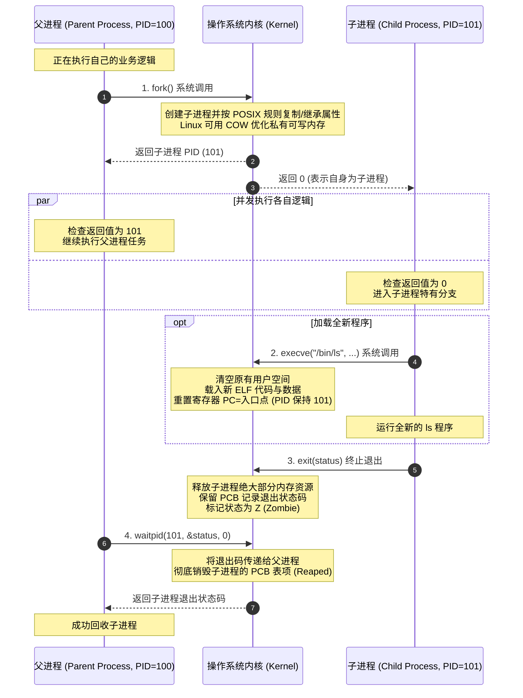

# L06-02｜一个程序是如何启动另一个程序的？

## 学习者问题

当你在终端里输入 `python script.py` 或在微信里点击一个链接打开浏览器时，新的程序究竟是如何被召唤并运行起来的？操作系统的进程树是如何生长的？为什么一个已经运行完的代码还会变成所谓的“僵尸（Zombie）”？

## 为什么重要

在经典 POSIX/Unix 教学路径中，可以把“创建一个新的执行上下文”和“让它运行另一个程序映像”拆成两个阶段：
1. **`fork()`**：复制克隆当前进程上下文；
2. **`exec()`**：将新程序的代码与数据装载进当前进程空间，彻底替换原有的内存映像。

如果把这两个步骤混淆为“执行 fork 就是运行新程序”，或者误把“僵尸进程”当成“疯狂吃 CPU 的病毒软件”，你就无法理解现代操作系统（包括 Web 服务器、容器引擎、Shell 脚本）最核心的进程生命周期与资源回收机制。

## 学习目标

完成本课后，你应能：
- 画出 `fork → exec → exit → wait` 经典 POSIX 进程生命周期的全链路时序图；
- 解释 `fork()` 调用的“一次调用、两次返回”语义，以及父子进程各自获得的返回值含义；
- 用一个普通局部变量实验说明 `fork()` 后父子进程的私有内存视图彼此分离，同时明确显式共享映射/IPC 是另一回事；
- 准确解释**写时复制（Copy-on-Write, COW）**是现代 Linux 虚拟内存的实现层性能优化，而非 POSIX 抽象规范所必须保证的语言行为；
- 说明 `execve` 为什么**没有创建新的 PID**，而是对现有进程地址空间进行就地替换（In-place Replacement）；
- 用实验事实阐明**僵尸进程（Zombie Process）**的真正机制：它已经死亡且不再消耗 CPU 时钟，其存留只是为了等待父进程读取其退出码（Exit Status）。

## 前置知识

- L06-01：进程定义（EC-CON-018）、进程上下文与用户态/内核态分界；
- M03：CPU 寄存器与程序计数器（PC）。

---

## Mental Model｜经典进程生命周期四部曲

POSIX 操作系统（包括 Linux、macOS 以及各类 Unix）采用了一套非常独特的双阶段进程派生设计：



---

## Mechanism｜从实验中验证生命周期

我们使用 `labs/foundations/m06/fork_exec_fixture.py` 观察这个生命周期的实际运行。

### 1. 一次调用，两次返回

在 POSIX 环境下运行：

```bash
cd labs/foundations/m06
python3 fork_exec_fixture.py
```

终端打印输出：

```text
=== M06 Fork & Process Lifecycle Fixture ===
Parent PID: 15136
Fork returned child PID: 15137
Child reported PID: 15137
Ordinary variable copy separate: parent=100, child=999 (True)
Child reaped exit code: 42 (Matches 42: True)
```

#### 机制剖析
- 源码中只写了一处 `pid = os.fork()`，但该语句之后父子两条执行路径同时向前推进；
- **在父进程中**：`pid` 变量接收到的是刚刚被创建出来的子进程的实际编号（`15137`）；
- **在子进程中**：`pid` 变量接收到的是 `0`（方便子进程明确知道“我是刚刚出生的那个”）；
- 两个进程可以通过调用 `os.getpid()` 和 `os.getppid()` 验证彼此的亲子血缘关系。

### 2. 普通私有变量：父子进程各有自己的可见值

在 `fork_exec_fixture.py` 中，我们在派生前定义了变量 `test_var = 100`：
- 子进程诞生后，立即执行 `test_var = 999`；
- 父进程随后读取自己的 `test_var`，其值**依然坚如磐石地保持为 100**！
- 这个 fixture 只证明：对这段普通 Python 变量/私有映射而言，子进程的赋值没有改变父进程看到的值。它**不能**证明父子进程永远无法共享内存；显式共享映射、共享内存和 IPC 都可以让两个进程交换或共享状态。

> **规范与实现的严谨分界（POSIX Specification vs Linux COW）：**
> - **POSIX.1-2024 接口语义**：`fork()` 创建一个新的 child process，并规定哪些进程属性被复制、继承或改变；parent/child 在返回后可以独立执行。
> - **Linux COW 实现**：对于普通私有可写内存，内核常用写时复制来避免立刻复制全部物理页面；真正发生写入时再为相关页面建立分离副本。共享映射等区域有不同语义。
>
> **边界**：COW 是实现策略，不是 `fork()` 的抽象定义；也不要把“私有变量分离”提前升级成 M07 的 canonical Isolation 定义。

### 3. Exec：替换程序映像，但 PID 保持

当前 fixture 还会让 child 执行 `os.execv()`，启动一个新的 Python image。新 image 会打印自己的 PID 并以状态码 `7` 退出；parent 随后 `waitpid()`。

```text
=== Exec Image Replacement Observation ===
Fork child PID: 15137
PID reported after exec: 15137
PID preserved across exec: True
Exec'd image exit code: 7 (Matches 7: True)
```

这个实验验证的是：**成功 exec 会替换当前 process image，但不会因此创建一个新的 PID**。它没有证明“所有资源原样保留”；POSIX 明确规定 exec 前后有一批属性被继承，也有一批属性会被重置/改变，带 `FD_CLOEXEC` 的文件描述符还会在 exec 时关闭。

---

## Break｜僵尸进程到底是什么？

初学者常常被“僵尸（Zombie）”这个名字吓到，甚至以为僵尸进程是系统故障或者木马病毒。

### 制造一个受控僵尸进程

在 `fork_exec_fixture.py` 中，我们故意制造了短暂的僵尸状态：
1. 子进程启动后直接执行 `os._exit(0)` 退出；
2. 父进程故意睡 `0.1` 秒，暂时**不**调用 `wait()`；
3. 父进程立即读取 `/proc/<child_pid>/stat` 观察子进程的实时状态。

实测输出：

```text
=== Controlled Zombie Observation ===
Child PID: 15138
Observed state in /proc prior to wait(): Z (Zombie 'Z': True)
Reaped in finally block: True
```

### 为什么操作系统需要设计“僵尸状态”？
思考一下：如果子进程一执行 `exit()`，内核就把子进程的一切（包括它的 PID、退出状态码、运行统计信息）瞬间抹去得干干净净，那么稍后醒来的父进程该如何获知“我的子任务是成功跑完了，还是中途崩溃了”？

因此，内核必须建立一个中间停顿态——**Zombie（在 Linux 中用字符 `Z` 标识）**：
- 子进程已经不再作为 runnable task 执行用户代码；它不会像运行中进程那样继续消耗调度到的 CPU 时间；
- 大部分用户态资源已经被释放/关闭，但内核仍保留退出状态、标识与必要的会计/父子关系等信息，等待 parent 通过 `wait()` / `waitpid()` 收集；
- 具体保留哪些内核字段是实现细节，不要把“只剩一个 PCB 小块”当作跨 OS 固定结构；
- 一旦父进程调用 `wait()` 读取了退出码，这个 PCB 项才被彻底擦除（Reaped/收尸）。

---

## Explain｜execve 为什么不生成新 PID？

许多人误以为：“我要启动 `ls`，所以操作系统必须创建一个新 PID 给 `ls`。”
**错！在 Unix 哲学中，创建执行上下文与替换执行代码是两件完全独立的事：**

- `fork()` 负责申请新的 PCB、分配新 PID，并建立管理上下文；
- `execve(path, argv, envp)` 负责“脱胎换骨”：
  1. 成功 exec 不会为这个进程分配一个新 PID；
  2. 当前 process image 被新的可执行 image 替换；
  3. 许多进程属性按 POSIX 规则继承，但也有属性被重置/改变；带 `FD_CLOEXEC` 的描述符会关闭；
  4. 成功 exec 不会返回到旧 image 的下一条用户指令，而是从新 image 的入口开始执行。

正是因为 `exec` 沿用了当前的进程外壳，Shell 才能在 `fork` 之后、`exec` 之前轻松完成**文件重定向（如 `> output.txt`）和管道拼接（`|`）**！

---

## Checkpoint Investigation

### Question
如果一个 parent 长时间不 `wait()`，而许多 child 已经退出并成为 zombie，系统会承受什么资源压力？为什么不能断言“最先一定耗尽的是某一个固定资源”？

<details>
<summary>Hint 1</summary>
回顾僵尸进程的资源占用：它还占有内存和 CPU 吗？
</details>

<details>
<summary>Hint 2</summary>
操作系统给每个系统预留的 PID 编号总量是无限的吗？
</details>

<details>
<summary>Expected Observation</summary>
这些已退出 child 不会继续作为 runnable workload 消耗用户态 CPU，但它们仍占用内核进程/退出状态相关资源与 PID namespace 中的标识。最终哪个限制先成为瓶颈取决于系统配置，例如 per-user/process limits、内核 task/process table 资源、PID namespace 上限或内存压力。
</details>

<details>
<summary>Full Explanation</summary>
zombie 已经退出，不再执行用户代码，但内核仍需保留足够的信息让 parent 收集退出状态。大量 zombie 会增加进程/任务相关内核资源压力，并可能让后续 `fork()` 因资源或系统限制失败（POSIX 可报告 `EAGAIN`，也可能有其他实现相关失败）。本课不把某个 `pid_max` 数字或“PID 一定最先耗尽”当作课程常量。
</details>

---

## Common Misconceptions

- **“fork() 就是启动一个新可执行文件。”** 错。`fork()` 只是克隆当前进程本身，克隆后跑的还是同一份代码；执行新文件必须配合后续的 `execve()`。
- **“fork 后普通变量赋值会自动改到另一个进程。”** 错。本活动中的普通私有变量在 parent/child 中各自变化；显式共享内存则是另一种机制。
- **“僵尸进程仍在疯狂执行用户代码。”** 错。zombie 已退出、不可继续作为普通 runnable task 执行，但内核仍保留等待回收的退出状态/管理信息。
- **“exec() 会创建一个新的 PID。”** 错。`exec()` 在原有进程的 PID 外壳中就地替换代码与数据，PID 维持不变。

## What You Can Ignore—for Now

Linux 进程间 `clone()` 系统调用的底层位标志（`CLONE_VM`、`CLONE_FS` 等命名空间控制）、POSIX 异步信号处理函数中安全调用 `waitpid()` 的可重入性准则、`vfork()` 的历史遗产与内存借用陷阱。

## Exit Criteria

能够准确画出 `fork → exec → exit → wait` 的协作时序，解释 `fork()` 返回值的父子区别，并在证据记录单中准确辨析 POSIX 规范与 Linux COW 实现、以及阐明僵尸进程为何不占用 CPU。

## Competency Mapping

- **Trace（Primary）**：追踪进程从父进程派生、代码替换、退出到被父进程回收的整个生命周期；
- **Diagnose**：识别僵尸进程并分析其未被父进程回收的根本成因；
- **Observe**：使用测试桩观测子进程的真实退出状态码与 `/proc` 状态标识。

## Provenance

- POSIX.1-2024 / The Open Group Base Specifications Issue 8：`fork()`、exec family、wait/exit 语义；
- Linux 手册页：*wait(2) — wait for process to change state*；
- W. Richard Stevens: *Advanced Programming in the UNIX Environment (Process Control)*。
