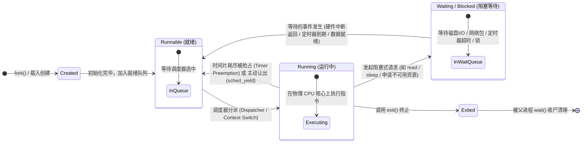

# L06-03｜多个程序是如何共享一颗 CPU 的？

## 学习者问题

我们的电脑上可能同时开着代码编辑器、浏览器、音乐播放器和数十个后台服务，但物理 CPU 的核心数通常只有 4 核或 8 核。数十甚至上千个进程，是如何在屈指可数的几个硬件计算核心上同时推进并保持流畅响应的？CPU 到底是如何在不同程序之间瞬时切换的？

## 为什么重要

如果不理解操作系统的进程调度与状态模型，开发者就会在系统行为上产生大量幻觉：
- 以为进程被调用了 `sleep(1)` 之后还在死循环猛烈霸占 CPU 时钟；
- 以为所有的上下文切换（Context Switch）都是因为定时器时钟中断强制打断的；
- 以为一个进程要么正在飞速计算，要么就已经死掉了，不知道中间还存在庞大的“等待（Waiting）”状态大军。

掌握**运行（Running）、就绪（Runnable）与阻塞等待（Waiting）**的经典三态流转，是看清多任务并发、异步 I/O、高并发服务器性能调优与资源竞争本质的关键心智钥匙。

## 学习目标

完成本课后，你应能：
- 画出进程在**创建（Created）、就绪（Runnable）、运行（Running）、阻塞等待（Waiting）与终止（Exited）**之间的经典状态流转图；
- 解释**抢占（Preemption）**与**协作式让出（Yielding/Blocking）**的区别，说明为什么不是每一次上下文切换都由时钟中断引发；
- 对比 CPU 密集型任务（CPU-bound）与 I/O 阻塞任务（I/O-bound / Timer-bound）在资源利用与调度状态上的根本差异；
- 在 Linux 系统上实测并捕获 CPU 密集任务的就绪/运行状态（`R`）与休眠任务的等待状态（`S`）；
- 用严谨的工程思维解释：Linux procfs 中的单字母状态代码是 Linux 内核的具体实现表现，而非所有操作系统唯一的通用状态机规范。

## 前置知识

- L06-01：进程上下文结构（虚拟内存、寄存器、PCB）；
- L06-02：进程生命周期与 `fork/exec/wait` 机制；
- M03：硬件中断、程序计数器（PC）与栈指针（SP）。

---

## Mental Model｜经典进程状态流转模型

在操作系统的管理体系中，一个进程在某一瞬间处于什么状态，完全取决于**它是否已经准备好使用 CPU，以及当前物理 CPU 是否空闲**：



### 三种核心状态的本质区别

1. **Running（运行中）**：
   该进程的上下文（PC、栈指针、通用寄存器）正实实在在地加载在某个物理 CPU 核心的硬件电路上。CPU 正在执行属于该进程的代码段指令。
2. **Runnable（就绪）**：
   该进程**万事俱备，只欠 CPU**！它的代码逻辑没有任何阻塞，随时可以被执行，只是由于当前物理 CPU 核心都被其他进程占据，它只能在内核的就绪队列（Ready Queue）中排队等候临幸。
3. **Waiting / Blocked（阻塞等待）**：
   该进程**即使现在给它一颗免费的 CPU，它也跑不下去**！因为它正在等待某个外部事件（比如等待网络网卡收到一个数据包、等待硬盘磁头读取扇区、或者主动调用了 `time.sleep()` 等待时钟脉冲）。此时内核将它从就绪队列移出，挂到特定的等待队列中，绝不浪费任何 CPU 周期。

---

## Mechanism｜观测真实的进程调度状态

我们在 `labs/foundations/m06/scheduler_fixture.py` 中并发启动了两个子进程：
- **子进程 1（CPU 密集型）**：执行一个紧凑的死循环，拼命消耗 CPU 算力；
- **子进程 2（休眠等待型）**：调用 `time.sleep(5)`，陷入内核等待定时器到期。

### 运行观测脚本

```bash
cd labs/foundations/m06
python3 scheduler_fixture.py
```

终端在真实 Linux 内核下的实测输出：

```text
=== M06 Scheduler & Process State Observation ===
CPU-active worker (PID 15139) observed states: ['R']
Sleeping worker (PID 15140) observed states: ['S']
CPU worker showed 'R' (Running/Runnable): True
Sleeping worker showed 'S' (Interruptible Sleep): True
```

#### 机制剖析
- Linux 内核通过 `/proc/<pid>/stat` 的第三个字段展示进程状态：
  - `R` 代表 **Running or Runnable**（在 Linux 中，正在 CPU 上跑的和在队列里等 CPU 的统一标记为 `R`）；
  - `S` 代表 **Interruptible Sleep**（可中断的睡眠阻塞态，等待事件或信号）；
- 正在 `time.sleep()` 的子进程完全不会进行无谓的“轮询看表”。它在执行了相关系统调用后，内核直接将它的状态设为 `S`，并从调度队列中摘下。直到内核硬件时钟中断检测到底层时钟走到了指定时刻，内核才负责将该进程唤醒并重新塞回就绪队列（标记为 `R`）。

---

## Break｜上下文切换并不全是时钟中断惹的祸

很多学生常有一个刻板印象：“CPU 是因为硬件定时器‘滴答’一响，才强行打断当前进程、换下一个进程的。”

### 上下文切换的两大驱动源泉

| 驱动源泉 | 触发场景 | 进程的主观意愿 |
|---|---|---|
| **协作式让出 / 阻塞（Voluntary / Cooperative）** | 进程调用 `read()` 读取尚未到来的网络包、调用 `nanosleep()`、调用 `mutex_lock()` 遇到争用、或者显式调用 `sched_yield()` 让出 CPU | **主动发起**：进程自己知道干等没有意义，主动通知内核将其挂起并调度其他就绪进程 |
| **抢占式打断（Involuntary / Preemptive）** | 进程分配的时间片（Time Slice）耗尽，硬件时钟中断到来；或者一个优先级更高的进程被外部硬件中断唤醒 | **被动打断**：进程还想继续霸占 CPU 算力，但内核根据调度策略强行剥夺其运行权，保护系统的整体公平与交互响应 |

因此，一个经常进行磁盘和网络 I/O 的程序，其绝大多数上下文切换都是**主动阻塞导致的主动让出**，而绝非被时钟中断无情打断！

---

## Explain｜上下文切换（Context Switch）到底在换什么？

当调度器决定让进程 A 下台、换进程 B 上台时，内核执行了哪些精密的机械动作？

1. **保存进程 A 的硬件上下文**：
   将当前 CPU 物理寄存器（通用寄存器、程序计数器 PC、栈指针 SP、状态标志寄存器）的内容，全部复制保存到进程 A 的内核控制块（PCB / 陷阱帧）中；
2. **切换地址空间（MMU 页表切换）**：
   将硬件内存管理单元（MMU）的页表基址寄存器（x86 的 CR3，RISC-V 的 `satp`）加载为进程 B 的页表物理地址，从此 CPU 的虚拟地址翻译彻底倒向进程 B 的私有内存空间；
3. **恢复进程 B 的硬件上下文**：
   从进程 B 的 PCB 中，将其以前保存的通用寄存器、栈指针 SP 和 PC 重新写回物理 CPU 寄存器；
4. **跳转继续执行**：
   CPU 硬件根据新加载的 PC 指针开始抓取下一条指令，进程 B 就在它上次被打断的完全相同的位置，天衣无缝地复活并继续狂奔！

---

## Checkpoint Investigation

### Question
如果你在一个只有 1 个物理 CPU 核心的系统上，同时运行 10 个纯 CPU 密集的死循环计算程序，每个程序都被设计为单线程。
在宏观上看（比如 1 秒钟内），这 10 个程序是否都在往前推进？
在微观上看（比如任意 1 纳秒瞬间），有几个程序在真正执行运算？为什么用户会觉得它们在“同时跑”？

<details>
<summary>Hint 1</summary>
区分微观上的“物理并行（Parallelism）”与宏观上的“逻辑并发（Concurrency）”。
</details>

<details>
<summary>Hint 2</summary>
人类感官对时间延迟的感知下限通常在几十毫秒左右。
</details>

<details>
<summary>Expected Observation</summary>
在微观的任意 1 纳秒时刻，物理 CPU 只有一个核心，因此**只有 1 个进程**在物理电路中执行指令；其他 9 个进程都在就绪队列中沉睡。
</details>

<details>
<summary>Full Explanation</summary>
在单核 CPU 上，真正的物理并行（Parallelism）永远是 1。操作系统调度器通过高频的时间片轮转（Time-slicing，例如每个进程分配 5 到 10 毫秒的执行窗口），配合纳秒级的上下文切换，在 1 秒钟内于 10 个进程之间极速走马灯式交替执行。由于人类大脑对视觉和交互的停顿感知阈值在 50~100 毫秒以上，这种超高频的快速分时复用（Time-division Multiplexing）给用户制造了“所有 10 个程序都在同时流畅运行”的宏观并发错觉。
</details>

---

## Common Misconceptions

- **“调用了 sleep() 的进程在后台还在忙碌空转检查时钟。”** 错。调用 `sleep()` 会将进程置入阻塞等待态（`S`），内核将其移出调度队列，CPU 占用率绝对为 0%。
- **“所有上下文切换都是由于时钟中断强行抢占发生的。”** 错。很多进程在时间片还没用完前，就因为等待 I/O 或系统资源而主动挂起并触发上下文切换。
- **“Linux 的 R/S/Z 状态字母是全宇宙所有操作系统的统一标准。”** 错。状态字符是 Linux procfs 的特定呈现约定。虽然 Runnable/Running/Waiting 的抽象逻辑是通用的，但不同操作系统（如 Windows、macOS、微内核系统）有着完全不同的内部状态定义与命名。

## What You Can Ignore—for Now

CFS（完全公平调度器）红黑树的 $vruntime$ 虚拟运行时间精确数学微分方程、实时调度类（SCHED_FIFO / SCHED_RR）的抢占掩码算法、多核 NUMA 架构下的缓存亲和性负载均衡（Load Balancing）策略。

## Exit Criteria

能够准确画出进程经典状态转移图，清晰解释 Running、Runnable 与 Waiting 的判定标准，用实际测试数据展示 `R` 与 `S` 的状态分离，并能阐明分时复用与上下文切换的工作机制。

## Competency Mapping

- **Trace（Primary）**：追踪进程在就绪、运行、阻塞等待和唤醒全流程中的状态迁移路径；
- **Observe**：使用系统工具捕获并辨识 CPU 密集与阻塞等待进程在内核中的不同状态表现；
- **Explain**：阐述分时调度、抢占机制与上下文切换在软硬件协作下的工作原理。

## Provenance

- Linux 手册页：*sched(7) — overview of CPU scheduling*；
- Linux 手册页：*proc(5) — process status values (R, S, D, Z, T)*；
- Silberschatz, Galvin, Gagne: *Operating System Concepts (Process Scheduling)*。
