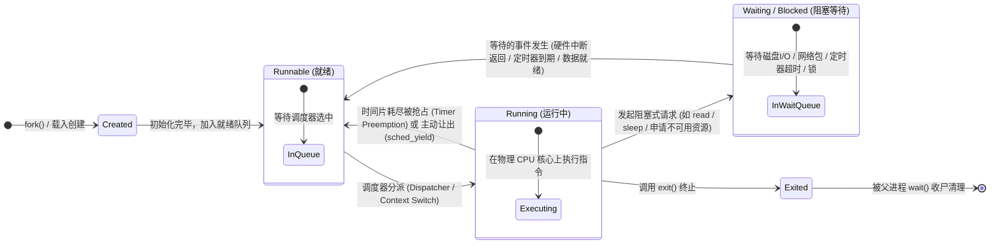

# L06-03｜多个程序是如何共享一颗 CPU 的？

## 学习者问题

我们的电脑上可能同时开着代码编辑器、浏览器、音乐播放器和数十个后台服务，但物理 CPU 的核心数通常只有 4 核或 8 核。数十甚至上千个进程，是如何在屈指可数的几个硬件计算核心上同时推进并保持流畅响应的？CPU 到底是如何在不同程序之间瞬时切换的？

## 为什么重要

如果不理解操作系统的进程调度与状态模型，开发者就会在系统行为上产生大量幻觉：
- 以为进程被调用了 `sleep(1)` 之后还在死循环猛烈霸占 CPU 时钟；
- 以为所有的上下文切换（Context Switch）都是因为定时器时钟中断强制打断的；
- 以为一个进程要么正在飞速计算，要么就已经死掉了，不知道中间还存在庞大的“等待（Waiting）”状态大军。

掌握**运行（Running）、就绪（Runnable）与阻塞等待（Waiting）**的经典三态流转，是看清多任务并发、异步 I/O、高并发服务器性能调优与资源竞争本质的关键心智钥匙。

## 学习目标

完成本课后，你应能：
- 画出进程在**创建（Created）、就绪（Runnable）、运行（Running）、阻塞等待（Waiting）与终止（Exited）**之间的经典状态流转图；
- 解释**抢占（Preemption）**与**协作式让出（Yielding/Blocking）**的区别，说明为什么不是每一次上下文切换都由时钟中断引发；
- 对比 CPU 密集型任务（CPU-bound）与 I/O 阻塞任务（I/O-bound / Timer-bound）在资源利用与调度状态上的根本差异；
- 在 Linux 系统上实测并捕获 CPU 密集任务的就绪/运行状态（`R`）与休眠任务的等待状态（`S`）；
- 用严谨的工程思维解释：Linux procfs 中的单字母状态代码是 Linux 内核的具体实现表现，而非所有操作系统唯一的通用状态机规范。

## 前置知识

- L06-01：进程上下文结构（虚拟内存、寄存器、PCB）；
- L06-02：进程生命周期与 `fork/exec/wait` 机制；
- M03：硬件中断、程序计数器（PC）与栈指针（SP）。

---

## Mental Model｜经典进程状态流转模型

为了建立调度直觉，可以把进程抽象成 **Runnable / Running / Waiting** 等状态：它是否具备继续执行的条件、是否当前被调度到 CPU、是否正在等待事件。具体内核会有更多状态与策略，本图不是跨 OS 的唯一状态机。



### 三种核心状态的本质区别

1. **Running（运行中）**：
   该进程的上下文（PC、栈指针、通用寄存器）正实实在在地加载在某个物理 CPU 核心的硬件电路上。CPU 正在执行属于该进程的代码段指令。
2. **Runnable（就绪）**：
   该进程具备继续执行的条件，但当前没有在 CPU 上运行。原因可能是其他任务正在运行、调度策略/优先级、CPU affinity 等；“Runnable”并不等价于“所有 CPU 核心一定都已被占满”。
3. **Waiting / Blocked（阻塞等待）**：
   该进程正在等待某个条件或事件（例如 I/O、定时器、锁/同步条件），所以当前不是 runnable。实现通常会把它从可运行集合中移出，等条件满足后再重新变为 runnable。不要把“等待”解释成跨所有 OS 都存在同名固定队列。

---

## Mechanism｜观测真实的进程调度状态

我们在 `labs/foundations/m06/scheduler_fixture.py` 中并发启动了两个子进程：
- **子进程 1（CPU 密集型）**：执行一个紧凑的死循环，拼命消耗 CPU 算力；
- **子进程 2（休眠等待型）**：调用 `time.sleep(5)`，陷入内核等待定时器到期。

### 运行观测脚本

```bash
cd labs/foundations/m06
python3 scheduler_fixture.py
```

终端在真实 Linux 内核下的实测输出：

```text
=== M06 Scheduler & Process State Observation ===
CPU-active worker (PID 15139) observed states: ['R']
Sleeping worker (PID 15140) observed states: ['S']
Observed Linux 'R' for CPU worker: True
Observed Linux 'S' for sleeping worker: True
```

#### 机制剖析
- Linux 内核通过 `/proc/<pid>/stat` 的第三个字段展示进程状态：
  - `R` 代表 **Running or Runnable**（在 Linux 中，正在 CPU 上跑的和在队列里等 CPU 的统一标记为 `R`）；
  - `S` 代表 **Interruptible Sleep**（可中断的睡眠阻塞态，等待事件或信号）；
- 在作者/Lead 的 Linux fixture 中，`time.sleep()` child 被观察为 `S`。这表示当前 Linux 进程在等待可中断事件；具体计时器由内核 timer subsystem 与架构时钟/中断机制共同实现。不能从一次 `S` 观测推出“每次唤醒都由某一个固定硬件时钟中断直接完成”。

---

## Break｜上下文切换并不全是时钟中断惹的祸

很多学生常有一个刻板印象：“CPU 是因为硬件定时器‘滴答’一响，才强行打断当前进程、换下一个进程的。”

### 上下文切换的两大驱动源泉

| 驱动源泉 | 触发场景 | 进程的主观意愿 |
|---|---|---|
| **协作式让出 / 阻塞（Voluntary / Cooperative）** | 进程调用 `read()` 读取尚未到来的网络包、调用 `nanosleep()`、调用 `mutex_lock()` 遇到争用、或者显式调用 `sched_yield()` 让出 CPU | **主动发起**：进程自己知道干等没有意义，主动通知内核将其挂起并调度其他就绪进程 |
| **抢占式切换（Involuntary / Preemptive）** | 调度器在合适的内核调度点决定让另一个 runnable task 运行，例如时间片/调度策略条件满足，或更高优先级任务变为 runnable | **被动失去 CPU**：当前任务没有主动阻塞，但调度器选择了另一个任务 |

因此，**“上下文切换 = 定时器中断”是错误等式**。切换可以由阻塞、显式让出、退出或抢占等路径促成；哪一种在某 workload 中占多数必须靠实际测量，不能凭类别预设。

---

## Explain｜上下文切换（Context Switch）到底在换什么？

当调度器决定让进程 A 下台、换进程 B 上台时，内核执行了哪些精密的机械动作？

概念上，内核必须：
1. **保存足够的 A 执行状态**，使 A 以后能继续；
2. **选择 B**，并在需要时切换与 B 对应的地址空间/架构上下文；
3. **恢复足够的 B 执行状态**，让 CPU 从 B 的保存位置继续。

具体保存哪些寄存器、是否真的重写页表基址、是否利用 PCID/ASID 等缓存机制、状态放在哪个内核结构中，都是架构与 OS 实现细节。本课不把 `CR3` / `satp` 或“PCB trapframe”画成 universal context-switch contract。

---

## Checkpoint Investigation

### Question
如果你在一个只有 1 个可执行硬件线程的系统上，同时运行多个单线程、CPU 密集的进程：在一个足够长的观察区间里，它们为什么都可能取得进展？而在任一单个执行瞬间，最多有几个这样的进程真正占用这个硬件执行资源？

<details>
<summary>Hint 1</summary>
区分微观上的“物理并行（Parallelism）”与宏观上的“逻辑并发（Concurrency）”。
</details>

<details>
<summary>Hint 2</summary>
不要依赖固定的人类感知阈值或时间片常数；只需要区分“单个瞬间的物理执行资源”与“一个时间区间内的交错进展”。
</details>

<details>
<summary>Expected Observation</summary>
在这个简化模型里，一个硬件执行资源在单个瞬间最多执行一个进程的指令；其他 runnable 进程等待调度。它们不是“沉睡（Sleeping）”，因为 runnable 与 waiting/sleeping 是不同状态。
</details>

<details>
<summary>Full Explanation</summary>
单个硬件执行资源不能在同一瞬间真正执行多个普通指令流，但调度器可以在一个时间区间内让多个 runnable 进程交错取得 CPU 时间，于是它们都能推进。实际时间片、切换成本和响应体验依调度策略、硬件与 workload 而变，本课不提供固定毫秒/纳秒常数。
</details>

---

## Common Misconceptions

- **“调用了 sleep() 的进程一定在后台忙等检查时钟。”** 错。对本课 Linux fixture，sleeping child 被观察为 `S`，不会继续执行那个 Python busy loop；监控工具仍可能显示采样/会计噪声，因此不要把“CPU 绝对 0.000%”当作契约。
- **“所有上下文切换都是由于时钟中断强行抢占发生的。”** 错。很多进程在时间片还没用完前，就因为等待 I/O 或系统资源而主动挂起并触发上下文切换。
- **“Linux 的 R/S/Z 状态字母是全宇宙所有操作系统的统一标准。”** 错。状态字符是 Linux procfs 的特定呈现约定。虽然 Runnable/Running/Waiting 的抽象逻辑是通用的，但不同操作系统（如 Windows、macOS、微内核系统）有着完全不同的内部状态定义与命名。

## What You Can Ignore—for Now

CFS（完全公平调度器）红黑树的 $vruntime$ 虚拟运行时间精确数学微分方程、实时调度类（SCHED_FIFO / SCHED_RR）的抢占掩码算法、多核 NUMA 架构下的缓存亲和性负载均衡（Load Balancing）策略。

## Exit Criteria

能够准确画出进程经典状态转移图，清晰解释 Running、Runnable 与 Waiting 的判定标准，用实际测试数据展示 `R` 与 `S` 的状态分离，并能阐明分时复用与上下文切换的工作机制。

## Competency Mapping

- **Trace（Primary）**：追踪进程在就绪、运行、阻塞等待和唤醒全流程中的状态迁移路径；
- **Observe**：使用系统工具捕获并辨识 CPU 密集与阻塞等待进程在内核中的不同状态表现；
- **Explain**：阐述分时调度、抢占机制与上下文切换在软硬件协作下的工作原理。

## Provenance

- Linux 手册页：*sched(7) — overview of CPU scheduling*；
- Linux 手册页：*proc(5) — process status values (R, S, D, Z, T)*；
- Silberschatz, Galvin, Gagne: *Operating System Concepts (Process Scheduling)*。
