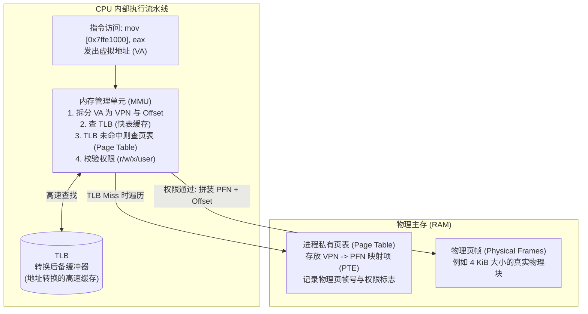
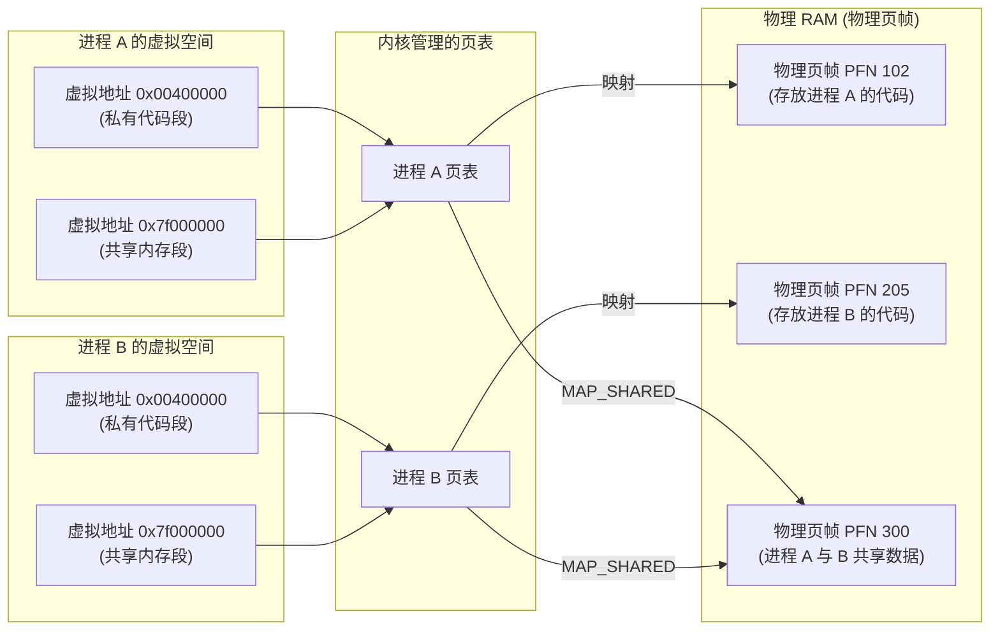

# L07-01｜两个程序如何同时使用内存而不需要直接共享一切？

## 学习者问题

在上一模块（M06）中，我们看到操作系统可以同时启动并调度成百上千个进程。但是，计算机的主板上通常只有一条或几条物理内存条（RAM）。

如果两个进程都在运行，它们如何使用内存？为什么进程 A 声明的变量不会意外覆盖进程 B 的数据？为什么两个完全独立的进程，打印出某个指针的十六进制数值可能完全相同，却互不干扰？操作系统与 CPU 究竟通过什么机制，让每个程序都感觉自己“独占了整台机器的内存”？

## 为什么重要

在日常编程中，许多学习者对内存存在几个顽固的直觉误区：
- 误以为代码里的指针地址（如 `0x7ffee4b2a100`）就是主板物理内存芯片上的引脚或物理插槽地址；
- 误以为只要两个进程打印出的地址数值一样，它们就必然指向同一块物理内存；或者地址数值不同，物理内存就必然完全隔离；
- 误以为“进程”本身就是“隔离”的同义词，甚至把“内存隔离”与“安全信任边界”划等号。

要建立现代计算系统世界模型，必须跨越从“物理扁平内存”到**“虚拟地址转换（Virtual Address Translation）”**的关键认知跃迁。更重要的是，本课将正式确立两个贯穿整个计算机科学的基石概念：**Isolation（隔离，EC-CON-013）** 与 **Trust Boundary（信任边界，EC-CON-017）**，并理清它们的严格区别。

## 学习目标

完成本课后，你应能：
- 准确给出 **Isolation（隔离，EC-CON-013）** 与 **Trust Boundary（信任边界，EC-CON-017）** 的规范定义，并举出至少两个实例说明它们为何不能相互推出；
- 阐明虚拟内存地址转换机制（虚拟地址分解为虚拟页号 VPN 与页内偏移 Offset，经页表与硬件 MMU 查询转换为物理页帧 PFN），并指出 TLB 作为转换缓存的直觉定位；
- 解释为什么相同的虚拟地址在不同进程中通常映射到不同的物理页帧，而在显式共享内存（如 `MAP_SHARED`）下又可以有意映射到相同物理页帧；
- 理解 ASLR（地址空间布局随机化）为何通常让现代进程的映射地址不同，消除“两个进程必须有完全相同基址”的机械预期；
- 使用 `labs/foundations/m07/maps_observer.py` 读取 Linux `/proc/self/maps`，解析虚拟内存区间及其权限位（`r-xp`、`rw-p`），并准确指出该文件**只能证明虚拟映射与访问权限，不能证明物理帧的存在或分配**。

## 前置知识

- M06 `L06-01`：进程作为操作系统管理的执行上下文（EC-CON-018）；
- M04 `L04-01` / `L04-02`：硬件缓存层次结构、局部性原理与缓存作为加速副本的直觉；
- M03 `L03-01`：CPU 寄存器与指令执行基础。

---

## Mental Model｜核心概念定义：隔离与信任边界

> ### 核心概念定义（First Home: EC-CON-013）
> **Isolation（隔离）**：限制不同执行流、身份、资源或故障域之间的**干扰（Interference）或可见性（Visibility）**。隔离可以为安全或正确性提供支撑，但其自身并不单独等同于安全或正确性。
>
> **边界警示（What it is NOT）**：
> - 隔离 **不等于** 加密（加密是机密性保护变换，隔离是边界屏障）；
> - 隔离 **不等于** 进程（进程是利用虚拟内存实现内存隔离的纳管执行载体，隔离还可以存在于硬件虚拟机、浏览器沙箱、事务或容器中）；
> - 隔离 **不等于** 绝对安全（两个完全内存隔离的进程，若通过明文网络通信或未校验的 IPC 传递恶意指令，系统依然可能被攻破）。

> ### 核心概念定义（First Home: EC-CON-017）
> **Trust Boundary（信任边界）**：**权力（Authority）、信任假设（Trust Assumptions）或强制执行职责（Enforcement Responsibility）发生变化的界限**；任何跨越此界限的输入都需要显式验证/授权，任何向外跨越的输出都需要有界的暴露控制。
>
> **边界警示（What it is NOT）**：
> - 信任边界 **不等于** 网络边界（在同一台机器内，用户态与内核态之间就存在极严格的信任边界）；
> - 信任边界 **不等于** 身份认证本身（认证确认“你是谁”，信任边界界定“在这个边界内我信任什么，跨过边界我必须防范什么”）；
> - 信任边界 **不等于** 隔离边界（两者经常重合，但概念内核不同）。

### 为什么隔离（Isolation）与信任边界（Trust Boundary）不是一回事？

这是很多工程师常年混淆的重点。请牢记核心判定原则：
- **隔离关注的是“机制层面的屏障”**：能否阻止未授权的互相读写、能否限制单点故障蔓延、能否隐藏内部细节？
- **信任边界关注的是“策略与职责层面的假设”**：谁信任谁？谁对安全和正确性负责？跨过这条线时是否必须把对方当成不可信的潜在破坏者？

#### 对比实例 1：双向内存隔离的普通进程 vs 应用信任策略
在 Linux 系统中，两个以相同普通用户 UID 运行的独立进程 A 和 B（例如你同时打开的计算器和文本编辑器），在通常的 Linux 进程模型下拥有彼此独立管理的虚拟地址空间，形成重要的**内存隔离（Memory Isolation）**：普通指针解引用不能直接越过地址空间去读写另一进程的私有映射；显式共享、调试接口或其他受控机制属于另外的路径。
然而在应用安全层面上，它们未必处于同一信任边界：如果进程 A 是一个未经验证的第三方插件，它即使无法直接改写进程 B 的内存，也可以通过公共临时文件、未加密 IPC 甚至共享套接字向进程 B 注入伪造数据。反过来，如果操作系统未启用特殊的 ptrace 限制策略，相同 UID 下的进程甚至可能具备调试彼此的权限。**有地址空间隔离机制，不代表双方可以无条件互相信任。**

#### 对比实例 2：显式共享内存（Shared Memory）与跨边界数据校验
两个协作进程通过 `shmget` 或 `mmap(MAP_SHARED)` 映射了同一块物理内存。在这一区域内，操作系统有意**解除了内存隔离**，使双方能够零拷贝高速交换数据。
但是，**信任边界依然存在**！如果进程 A 是高权限服务端，进程 B 是低权限客户端，服务端在从共享内存中读取客户端写入的数据长度、指针偏移或命令结构时，必须进行严苛的边界检查与防御性校验。不能因为“我们共享了一块内存”就默认对方写入的数据是合法的。解除内存隔离并不意味着解除信任边界。

#### 对比实例 3：内核态内部模块
在宏内核（如 Linux）中，网卡驱动、文件系统驱动和调度器都运行在 CPU 的最高特权级（Ring 0 / Supervisor Mode）下，它们通常共享同一份内核虚拟地址空间，缺乏驱动之间的硬件内存隔离（一个驱动的野指针可能踩穿整个内核）。
但在系统设计上，外来网络数据包的处理模块与文件系统元数据管理属于不同的故障域与信任假设层次。缺乏硬件隔离反而让架构师必须借助极其复杂的软件断言与静态检查来守护边界。


---

## Mechanism｜虚拟地址转换全景

现代操作系统为了实现进程间的内存隔离，摒弃了“程序直接操作物理 RAM”的原始模式，引入了由**操作系统内核**与**CPU 硬件内存管理单元（MMU）**共同构筑的**虚拟内存系统（Virtual Memory System）**。

### 1. 核心机制链路

在程序运行期间，CPU 执行的任何加载（Load）、存储（Store）或取指（Fetch）操作，使用的都是**虚拟地址（Virtual Address, VA）**。物理硬件只认**物理地址（Physical Address, PA）**。将虚拟地址翻译为物理地址的桥梁，就是分页机制（Paging）。



### 2. 虚拟地址的数学拆分

在典型的 4 KiB（$4096 = 2^{12}$ 字节）分页系统中，一个虚拟地址在逻辑上被划分为两部分：
$$\text{Virtual Address} = (\text{Virtual Page Number (VPN)}, \text{Page Offset})$$

- **虚拟页号（VPN, Virtual Page Number）**：指示当前地址落在进程虚拟地址空间的第几页。页是虚拟内存分配与保护的最小基本单位；
- **页内偏移（Offset）**：低 12 位（$2^{12} = 4096$）。在物理页面内的偏移量与虚拟页面完全一致，转换时保持不变；
- **转换过程**：MMU 提取 VPN，以此在进程当前绑定的**页表（Page Table）**中索引对应的**页表项（PTE, Page Table Entry）**。PTE 中包含了该页对应的**物理页帧号（PFN, Physical Frame Number）**以及**保护标志位（如只读、可读写、可执行、用户态/内核态）**。
- 最终物理地址合成：
$$\text{Physical Address} = (\text{PFN} \ll 12) \mid \text{Offset}$$

### 3. TLB 的定位：地址转换的硬件缓存

如果 CPU 每执行一条内存访问指令，都要先去物理内存中把多级页表查询一遍，内存访问延迟将成倍暴增。
正如我们在 M04 学到的**缓存与局部性原理（EC-CON-011 / EC-CON-012）**，CPU 硬件在芯片内部设置了一个极小但极快的高速硬件缓存——**TLB（Translation Lookaside Buffer，转换后备缓冲器）**。
- TLB 缓存了最近使用过的 `VPN -> PFN + 权限` 映射项；
- 当 MMU 翻译地址时，首先并行比对 TLB；如果命中（TLB Hit），通常可以显著减少地址转换开销；具体延迟依赖微架构，不能把“单周期”当作通用常数；
- TLB 缺失（TLB Miss）后，需要执行页表遍历来获得转换信息；具体由硬件页表遍历器还是软件/异常处理协助完成取决于 ISA 与实现。

### 4. 两个进程的内存映射：独立 vs 共享

由于每个进程拥有由操作系统独立建立和维护的私有页表（在 x86 上由 `CR3` 寄存器指向，在 RISC-V 上由 `satp` 寄存器指向），**同一个虚拟地址数值完全可以映射到不同的物理页帧**：



- **隔离性**：进程 A 读写 `0x00400000`，MMU 查进程 A 的页表访问 `PFN 102`；进程 B 读写 `0x00400000`，MMU 查进程 B 的页表访问 `PFN 205`。在这个示意例中，两份私有映射指向不同页帧；相同虚拟地址数值本身既不能证明共享，也不能证明物理帧不同。进程私有映射通常限制普通指针直接跨地址空间访问；
- **共享性**：当进程 A 和 B 显式请求共享内存时，操作系统的页表管理器让两个不同进程的 PTE 指向同一个物理页帧 `PFN 300`。这说明：**虚拟地址空间分离是默认规则，但显式共享是经过授权的合法设计**。

> **关于现代系统 ASLR（地址空间布局随机化）的特别说明：**
> 在早期的 32 位操作系统或无 ASLR 的教学系统（如 xv6）中，所有编译链接相同的进程通常拥有完全固定的基地址。
> 但是在现代 64 位 Linux 系统上，默认开启了 **ASLR（Address Space Layout Randomization）**：为了防御内存破坏攻击，内核在每次加载进程时，都会在栈、堆、动态链接库乃至可执行文件本身（PIE, Position Independent Executable）的基地址上加入随机偏移。因此，**不要机械地假设两个进程打印出的变量地址一定相同**；相反，它们的地址通常是不同的。

---

## Observe｜在真实 Linux 上观测虚拟内存区间与权限

我们使用 `labs/foundations/m07/maps_observer.py` 观察当前进程在 Linux 操作系统中真实的虚拟内存布局。

### 运行观测

```bash
cd labs/foundations/m07
python3 maps_observer.py
```

在真实 Ubuntu / Linux 环境下，脚本将解析 `/proc/self/maps` 并输出类似如下结果：

```text
=== M07 Virtual Memory Mapping Observer ===
Process PID: 20131
Platform: linux

Total mappings parsed: 45
Total virtual address space spanned: 18612.0 KiB
Distinct permissions observed: r--p, r--s, r-xp, rw-p

--- Sample Executable Mappings (e.g. code segments) ---
  0x000000420000-0x000000704000 r-xp   2960.0 KiB  /usr/bin/python3.12
  0x78de57028000-0x78de571b0000 r-xp   1568.0 KiB  /usr/lib/x86_64-linux-gnu/libc.so.6
  0x78de5738a000-0x78de573a7000 r-xp    116.0 KiB  /usr/lib/x86_64-linux-gnu/libexpat.so.1.9.1

--- Sample Writable Mappings (e.g. heap / data / stack) ---
  0x000000a2a000-0x000000ba8000 rw-p   1528.0 KiB  /usr/bin/python3.12
  0x000000ba8000-0x000000bac000 rw-p     16.0 KiB  [anonymous data]
  0x00002a80f000-0x00002aa20000 rw-p   2116.0 KiB  [heap]

--- Evidence Boundary Checklist ---
[*] Virtual addresses shown above are process-local virtual intervals.
[*] Permissions (r/w/x/p/s) are enforced by CPU MMU during address translation.
[*] IMPORTANT: /proc/self/maps does NOT prove physical RAM frame occupancy.
[*] IMPORTANT: Another process may have identical numbers mapping to DIFFERENT physical RAM.
```

### 证据深度解析

1. **每一行的组成要素**：
   - `0x000000420000-0x000000704000`：虚拟地址区间的起始与结束边界。这是给当前进程的虚拟视图，跨度为 2960 KiB；
   - `r-xp`：四位权限与属性标志：
     - `r`：可读（Readable）；
     - `-`（或 `w`）：不可写 / 可写（Writable）；
     - `x`：可执行（Executable，CPU 可以从中取指令执行，体现代码段保护）；
     - `p`（或 `s`）：私有写时复制（Private Copy-On-Write）或共享映射（Shared）；
   - `/usr/bin/python3.12` 或 `[heap]`：映射背后的目标对象。既有映射自磁盘二进制文件的文件映射（File-backed），也有由运行时动态申请的匿名映射（Anonymous Mapping，如堆和栈）。
2. **硬件强制保护**：
   当 CPU 试图往标记为 `r-xp`（代码段）的内存地址写入数据时，MMU 在解析页表项时发现写保护位被置位，会立刻阻断写入并向 CPU 核心发出硬件异常（Page Fault），操作系统随后便介入处理。
3. **关键证据边界（What `/proc/self/maps` does NOT prove）**：
   - `/proc/self/maps` 显示的是**虚拟内存地址区间与内核记录的权限规格**；
   - **它绝对不能证明物理 RAM 已经分配了对应的物理页帧**！一个跨度为 1 GiB 的虚拟映射区，完全可能没有任何真实的物理 RAM 与之绑定（关于“预留与驻留”的实测，见下一课 L07-02）；
   - **它绝对不暴露物理页帧号（PFN）**。普通非特权用户程序在 Linux 上无法直接查看自己虚拟页对应的物理 RAM 引脚或插槽地址。

---

## Explain｜隔离 vs 信任边界深度矩阵

为了让“隔离（EC-CON-013）”与“信任边界（EC-CON-017）”的界限更加清晰，我们整理了系统工程中的常见场景矩阵：

| 场景 | 隔离机制（Isolation） | 信任边界（Trust Boundary） | 关键启示 |
|---|---|---|---|
| **同一主机的两个独立普通进程** | 强内存隔离：MMU 私有页表阻断直接读写 | 存在策略边界：通过 IPC 传输的数据仍须校验与鉴权 | 物理上互相看不见，并不代表业务逻辑上可以互相信任。 |
| **共享内存（`MAP_SHARED`）协作** | 该共享映射范围内允许双方看见共同的底层对象；进程其余私有映射仍可保持隔离 | 若双方权力/信任假设不同，跨此边界的数据仍需防御性校验 | 显式共享是隔离的局部例外，不等于取消信任边界。 |
| **用户程序通过系统调用访问内核** | 强特权隔离：Ring 3 vs Ring 0，用户态无法读写内核内存 | 强信任边界：内核对用户态传入的每一个指针、结构体大小进行严格验证 | 系统调用接口是操作系统最重要的硬信任边界。 |
| **同一进程内的多线程（Threads）** | 无内存隔离：共享同一虚拟地址空间与堆栈引用 | 无内部特权边界：任何一个线程的野指针都可以摧毁所有线程数据 | 线程间缺乏内存隔离，因此一旦发生内存破坏即全进程崩溃。 |

---

## Checkpoint Investigation

### Question
两个独立运行的 C 语言程序 A 和 B，都声明了一个全局变量并打印其地址。运行结果显示，程序 A 打印出 `&var = 0x55a100`，程序 B 也打印出 `&var = 0x55a100`。
学习者小李得出结论：“这说明程序 A 和程序 B 在物理内存条的同一个位置读写数据，只要程序 A 修改了这个变量，程序 B 就能立刻读到新值。”
请指出小李结论中的严重错误，并结合虚拟内存机制与实验证据说明事实真相。

<details>
<summary>Hint 1</summary>
思考 C 语言程序打印出的十六进制指针是物理内存地址，还是虚拟内存地址？每个进程各自拥有什么硬件与操作系统结构？
</details>

<details>
<summary>Hint 2</summary>
如果这两个进程没有调用任何共享内存 API（如 `shmget` 或 `mmap` 的 `MAP_SHARED`），它们的虚拟地址 `0x55a100` 分别由谁翻译？
</details>

<details>
<summary>Expected Observation</summary>
小李的推论是错误的。指针打印出的是**虚拟地址**而非物理地址。在默认情况下，操作系统为每个进程维护独立的页表。即使虚拟地址数值恰好完全一致（如未开启 ASLR 的同构程序），MMU 在不同进程上下文中查询的是不同的页表，它们会被翻译到完全不同的物理页帧。修改程序 A 的变量绝不会影响程序 B。
</details>

<details>
<summary>Full Explanation</summary>
在具备虚拟内存支持的现代操作系统上，用户代码能够感知的所有指针地址都是虚拟地址（Virtual Address）。
当程序 A 访问 `0x55a100` 时，CPU 处于程序 A 的上下文中，MMU 加载程序 A 的页表基址寄存器，将该虚拟页号（VPN）翻译为物理页帧 A（例如 PFN 1024）；
当程序 B 访问 `0x55a100` 时，CPU 处于程序 B 的上下文中，MMU 加载程序 B 的页表基址寄存器，将该虚拟页号翻译为物理页帧 B（例如 PFN 2048）。
两个进程在物理 RAM 上占据完全独立的页帧，互不影响。只有显式通过共享内存机制将两者的虚拟地址映射到同一物理页帧时，跨进程直接共享才会发生。此外，`/proc/self/maps` 展示的仅是这种虚拟区间的存在与权限，并不能证明两者物理帧的同一性。
</details>

---

## Common Misconceptions

- **“程序打印出的指针是物理主板上的内存地址。”** 错。所有由普通用户态程序操作和打印的内存地址，都是经过操作系统抽象和 MMU 翻译的**虚拟地址**。硬件物理地址对用户程序是透明且不可见的。
- **“两个进程的虚拟地址相同，就必然指向同一块物理内存。”** 错。默认情况下每个进程有自己独立的页表，相同的虚拟地址对应完全不同的物理页帧。
- **“两个进程的虚拟地址不同，就必然指向不同的物理内存。”** 错。通过显式共享内存（如 `mmap` 配合 `MAP_SHARED`），两个进程可以使用完全不同的虚拟地址（例如进程 A 用 `0x7f000000`，进程 B 用 `0x10000000`）映射到同一个物理内存页帧。
- **“进程就是隔离的规范定义。”** 错。进程（EC-CON-018）是操作系统纳管的执行上下文。隔离（EC-CON-013）是一个更通用的核心概念，既包括内存隔离，也包括网络隔离、故障隔离、事务隔离等。进程是内存隔离的一种典型承载者，但不是隔离的规范定义。
- **“隔离和信任边界是一回事。”** 错。隔离解决的是“能否物理限制干扰与可见性”；信任边界解决的是“在何处发生权力与信任假设的转变，何处必须进行防御性检查”。两者经常配合使用，但不能混为一谈。
- **“/proc/self/maps 揭示了物理内存分配情况。”** 错。maps 文件仅仅显示操作系统为该进程建立的虚拟地址区间规划及其访问权限；物理内存页帧（PFN）通常在第一次写入时才按需分配（Demand Paging），且 maps 文件不会暴露物理页帧编号。

## What You Can Ignore—for Now

四级与五级页表（PML4 / PML5）的具体树状遍历算法与位运算偏移掩码、TLB 射落（TLB Shootdown）核间中断广播机制、大页（Huge Pages, 2 MiB / 1 GiB）的透明折叠。

## Exit Criteria

能够准确默写 **Isolation（EC-CON-013）** 与 **Trust Boundary（EC-CON-017）** 的规范定义；给出两者非等价关系的两个具体场景；在白板上画出“虚拟地址 $\rightarrow$ MMU/TLB/页表 $\rightarrow$ 物理页帧”的机制流；解释为什么相同的虚拟地址不代表相同的物理内存；使用 `maps_observer.py` 读取真实 maps 并指出其证据边界。

## Competency Mapping

- **Explain（Primary）**：阐述虚拟地址到物理地址的映射机制，阐释 Isolation 与 Trust Boundary 的规范区别；
- **Trace**：追踪虚拟地址分解为 VPN + Offset 并通过页表定位物理页帧的完整路径；
- **Observe**：运行 `maps_observer.py` 解析并验证 Linux 真实虚拟内存区间与访问权限位。

## Provenance

- Linux 内核文档与手册页：*proc(5) — /proc/[pid]/maps layout & semantics*；
- POSIX.1-2024 / IEEE Std 1003.1-2024: General Concepts (Memory Management & Protection)；
- Remzi H. Arpaci-Dusseau and Andrea C. Arpaci-Dusseau: *Operating Systems: Three Easy Pieces (OSTEP)*, Chapters 13–15 (Address Spaces, Paging)；
- Intel 64 and IA-32 Architectures Software Developer's Manual, Volume 3A: System Programming Guide, Chapter 4 (Paging)；
- RISC-V Privileged Architecture Version 20211203: Chapter 4 (Supervisor-Level ISA, Paging Schemes).
