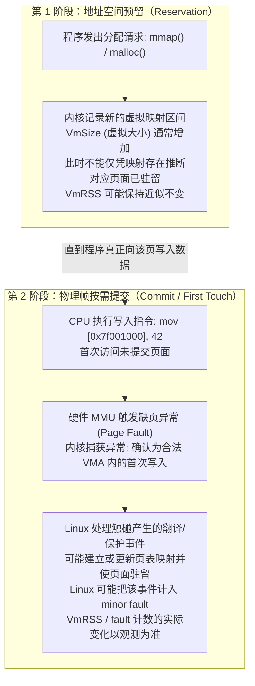
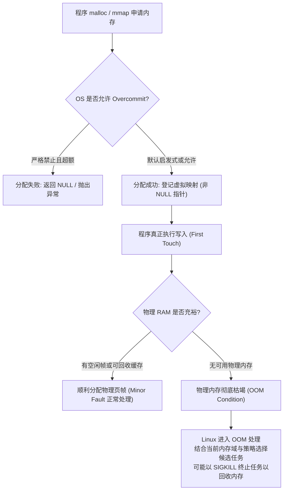

# L07-02｜为什么程序可以预留大量虚拟内存却不立刻消耗同等物理内存？

## 学习者问题

在很多服务器或大型应用中，我们经常会在监控指标（如 `top` 或 `htop`）中看到令人吃惊的现象：一个刚刚启动的 Java、Go 或 Python 服务，其虚拟内存占用（`VIRT` 或 `VmSize`）动辄显示为几十吉字节（GiB），然而机器总共可能只有 16 GiB 物理内存，且系统的物理内存空闲量几乎没有减少。

程序是如何向操作系统“预留”远远超出物理硬件上限的内存的？为什么申请了 16 MiB 甚至 1 GiB 的内存，物理内存条却像什么都没发生一样？如果真到了物理内存耗尽的那一刻，操作系统又会做出什么反应？

## 为什么重要

许多初学者常常把编程语言层面的“内存申请”与主板物理内存的“实际占用”混为一谈：
- 误以为代码执行了一次 `malloc(1024 * 1024 * 100)`，物理 RAM 就立刻被扣减了 100 MiB；
- 误以为操作系统在内存不足时，必定会通过返回 `NULL` 或抛出 `MemoryError` 优雅地拒绝申请；
- 误以为所有的操作系统都遵从完全一样的内存过载处理逻辑。

理解**虚拟地址空间预留（Reservation）**与**物理内存驻留（Residency）**的解耦，是掌握现代操作系统性能优化、容量规划以及内存故障诊断的核心钥匙。本课将带你观测真实的 Linux 需求分页（Demand Paging）现象，并理清内存超售（Overcommit）与 OOM（Out of Memory）机制的精确边界。

## 学习目标

完成本课后，你应能：
- 准确区分虚拟地址空间大小（`VmSize` / `VIRT`）与常驻物理内存大小（`VmRSS` / `RES`）的本质概念；
- 阐述按需调页（Demand Paging）机制：操作系统为何在地址空间预留（Reservation）阶段仅建立虚拟映射描述符，在本课的显式匿名映射实验中，触碰尚未驻留的页面时可能触发 Linux 记录的缺页，并使部分页面变为驻留；具体分配、zero-page、COW 与 fault 计数依赖映射类型和内核实现；
- 避免把内存分配机械化为单一的 `malloc -> brk -> VMA -> first write -> minor fault -> RSS` 固定公式，认识到不同分配器（glibc malloc、jemalloc、Python pymalloc 等）与操作系统策略的多样性；
- 使用 `labs/foundations/m07/residency_fixture.py` 观察 16 MiB 匿名内存从预留、分步写入到释放的全过程，从真实数据中验证 `VmSize`、`VmRSS` 与 `ru_minflt` 的方向性关联；
- 阐释 Linux 内存过量分配（Overcommit）与内存耗尽杀手（OOM Killer）的设计权衡，明确指出 OOM 机制与具体内核策略紧密相关，而非所有操作系统通用的黄金法则。

## 前置知识

- M07 `L07-01`：虚拟地址到物理页帧的 MMU 转换与页表机制；
- M06 `L06-01`：进程上下文与 `/proc/self/status` 观测；
- M02 `L02-03`：状态（EC-CON-001）与权衡（EC-CON-006）。

---

## Mental Model｜预留 vs 驻留：内存分配的两阶段模型

为什么现代操作系统不让程序一次性把物理内存“霸占”完？
答案在于**资源利用率与延迟的深刻权衡（EC-CON-006 Trade-off）**。

如果每次程序申请 100 MiB 内存，操作系统都必须立刻在物理 RAM 中找到 25,600 个空闲的 4 KiB 物理页帧，逐一将其清零（避免读取前一个进程残留的敏感数据），并把这 25,600 个条目填进页表，那么每次内存申请都将带来巨大的计算和 I/O 延迟。更重要的是，经验表明大量程序在启动时预留了巨大的空间用于预估峰值，但实际运行中往往只使用了其中极小一部分。

因此，现代操作系统（如 Linux）采用了一种优雅的“拖延战术”——**按需调页（Demand Paging / Lazy Allocation）**。内存分配被拆分为两个截然不同的阶段：



### 概念辨析：VmSize vs VmRSS

| 观测指标 | 全称 | 含义说明 | 计入时机 |
|---|---|---|---|
| **`VmSize` (VIRT)** | Virtual Memory Size | 操作系统为该进程规划的**虚拟地址空间总大小** | 只要 `mmap`、`brk` 成功登记了映射区间即增加，代价极低 |
| **`VmRSS` (RES)** | Resident Set Size | 当前进程实际占用并常驻在**物理内存（RAM）中的总大小** | 代码对对应虚拟页发生首次写/读操作，内核真正分配物理页帧后才增加 |

> **教学边界特别说明：**
> 很多教科书喜欢将内存分配简化为一条绝对公式：`malloc -> brk -> VMA -> first write -> minor fault -> RSS`。
> 我们必须在这里纠正这种教条化认知：
> 1. **分配器具有多样性**：运行时并非所有分配都走 `brk`。glibc 的 `malloc` 可能根据实现版本、阈值与运行状态选择 `mmap` 等路径；现代分配器（如 jemalloc、mimalloc）大量使用匿名内存映射与多线程局部缓存池；
> 2. **语言运行时具有内部缓冲**：Python（pymalloc）和 Go 等高级语言自身有一整套对象分配体系，申请小对象时往往从已经预留好的内存池中切片，并不一定会立刻触发系统调用；
> 3. **内核优化可能合并操作**：在特定的透明大页（THP）或全零页优化下，缺页行为与物理页挂载的比例会有所浮动。
>
> 因此，本课我们通过一个直接使用系统级匿名内存映射的受控测试装置（`residency_fixture.py`），直观观察“预留”与“物理按需驻留”的物理方向性规律。

---

## Mechanism｜实测 16 MiB 内存的分步预留与驻留

我们使用 `labs/foundations/m07/residency_fixture.py` 在受控的 Linux 环境下运行 16 MiB（4096 个 4 KiB 页面）的安全实验。

该装置不进行戏剧性的超大分配（绝不搞动辄数吉字节甚至撑爆系统的危险操作），而是精准执行 5 个测量阶段：
0. **基线状态（Baseline）**：测量脚本启动初始的 `VmSize`、`VmRSS` 与系统记录的次要缺页数（`ru_minflt`）；
1. **预留状态（Reserved）**：使用 `mmap` 申请 16 MiB 匿名私有映射（`MAP_PRIVATE | MAP_ANONYMOUS`），但**一个字节也不写入**；
2. **半数写入（Half Touched）**：逐页循环，跨越步长为 4096 字节，仅向**前 2048 个页面**的第 1 个字节写入数据；
3. **完全写入（Full Touched）**：继续向**后 2048 个页面**写入数据；
4. **清理释放（Cleaned Up）**：调用 `close()` 解除映射并关闭。

### 运行观测

```bash
cd labs/foundations/m07
python3 residency_fixture.py
```

在作者的真实 Ubuntu 24.04 (WSL2 / Linux 6.18) 环境下，输出了如下完全自洽的实测数据：

```text
=== M07 Virtual Reservation vs Physical Residency Fixture ===
Process PID: 20144
Page Size: 4096 bytes
Allocation Target: 16 MiB (4096 pages)

--- Experimental Stages & Observations ---
Stage              | VmSize         | VmRSS          | Minor Faults
---------------------------------------------------------------------
0. Baseline        | 18,640 KiB     | 13,292 KiB     | 2,175 faults
1. Reserved        | 35,024 KiB     | 13,292 KiB     | 2,175 faults
2. Half Touched    | 35,024 KiB     | 21,484 KiB     | 4,223 faults
3. Full Touched    | 35,024 KiB     | 29,676 KiB     | 6,271 faults
4. Cleaned Up      | 18,640 KiB     | 13,292 KiB     | 6,271 faults

--- Mechanism Verifications ---
[*] Reservation VmSize Delta: +16384 KiB (Virtual address space successfully reserved)
[*] Reservation VmRSS Delta: +0 KiB (Physical RAM remains largely uncommitted before touch)
[*] Touching Pages VmRSS Delta: +16384 KiB (Physical frames allocated upon first write)
[*] Touching Pages Minor Fault Delta: +4096 faults (Demand paging traps resolved by OS)

--- Inference Limitations ---
[*] Demand-paging behavior observed here is specific to Linux/POSIX virtual memory policy.
[*] Exact RSS increase and fault counts vary by OS page size, zero-page optimizations, and runtime state.
[*] Never assume a universal fixed ratio between malloc bytes and resident physical RAM.
```

### 关键数据推导与机制印证

让我们仔细对比各阶段的指标跃迁：
1. **阶段 0 $\rightarrow$ 阶段 1（仅预留）**：
   - 在这次宿主运行中，`VmSize` 从 $18,640\text{ KiB}$ 增加到 $35,024\text{ KiB}$，观测到 $16\text{ MiB}$ 的增量；这与本次 16 MiB 映射请求一致，但不是跨环境固定结果；
   - `VmRSS` 保持 $13,292\text{ KiB}$ 毫发无损（增量为 $+0\text{ KiB}$）；
   - `Minor Faults` 停留在 $2,175$ 次（增量为 $+0$ 次）。
   - **结论**：预留 16 MiB 虚拟内存，几乎不耗费物理内存条的存储空间！
2. **阶段 1 $\rightarrow$ 阶段 2（写入前 2048 个页面）**：
   - 我们的代码仅对每个 4 KiB 边界写入了 1 个字节；
   - `VmSize` 保持 $35,024\text{ KiB}$ 不变；
   - 在这次宿主运行中，`VmRSS` 增加了约 $8\text{ MiB}$，与触碰半数页面的规模一致；这是一条环境观测，不能据此把 RSS 增量与物理页帧数写成通用的一一对应定律；
   - 在这次宿主运行中，`ru_minflt` 增加了 2048。这个计数与本次逐页触碰高度吻合，但它是 Linux/Unix 资源会计证据；不能把“每次首次写入 = 一个 minor fault = 分配一个新物理页帧”写成跨系统或跨映射类型的恒等式。
3. **阶段 2 $\rightarrow$ 阶段 3（写入剩余 2048 个页面）**：
   - `VmRSS` 进一步增长到 $29,676\text{ KiB}$（累计物理增长 $16,384\text{ KiB}$）；
   - `Minor Faults` 增加到 $6,271$ 次（总共新增 4096 次缺页异常）。
4. **阶段 3 $\rightarrow$ 阶段 4（清理释放）**：
   - 映射解除，`VmSize` 立即回退至 $18,640\text{ KiB}$；物理页帧归还操作系统，`VmRSS` 立即释放。

这个实验在当前宿主上支持一个更有边界的结论：**建立虚拟映射与页面实际驻留不是同一件事；触碰页面后，驻留量与 fault 计数可能按可观测关系变化。** 精确增量属于宿主结果，不是课程常数。

---

## Break｜当支票无法兑现时：Overcommit 与 OOM 的边界

既然操作系统允许程序随意预留未使用的虚拟内存，那么必然会引出一个尖锐的问题：
**如果所有程序都开出了 100 MiB 的虚拟内存支票，并且在某一刻同时开始向所有页面疯狂写入数据，物理内存不够用了，会发生什么？**

### 1. 内存过量分配（Overcommit）策略

在 Linux 系统中，内核默认允许一定程度的**过量分配（Overcommit）**。
通过查看 `/proc/sys/vm/overcommit_memory`，可以看到系统的策略配置：
- `0`（默认启发式）：内核基于启发式算法允许合理超额申请，拒绝明显过于荒唐的超大申请；
- `1`（总是允许）：总是允许预留虚拟内存，无论物理内存是否充裕；
- `2`（严格记账）：按 Linux 的 commit accounting 规则限制可提交内存；具体 CommitLimit 计算还受 `overcommit_ratio`、`overcommit_kbytes`、swap 等配置影响，不能简化成一条永远固定的公式。

### 2. 传统认知的破灭：OOM 不一定返回 NULL

很多 C 语言教科书告诫学习者：“每次调用 `malloc` 都要检查指针是否为 `NULL`，如果为 `NULL` 说明内存不足。”
然而在启用了 Overcommit 的 Linux 生产环境上：
1. `malloc` 往往**成功返回了一个非 NULL 的指针**，因为在预留阶段内核爽快地批准了虚拟映射；
2. 随后的执行中，程序真正向这个指针写入数据，触发了按需调页的缺页异常；
3. 此时操作系统在内核态陷入了绝境：物理内存已彻底见底，交换区（Swap）已满，页面回收器（Reclaim）竭尽全力也无法腾出物理页帧；
4. **此时没有办法在一条普通的写指令中间向程序返回 `NULL`**！

### 3. Linux OOM Killer（内存耗尽杀手）

为了防止整台计算机因为物理内存耗尽而彻底死锁瘫痪，Linux 内核设计了 **OOM Killer（Out of Memory Killer）** 保护机制：
- 内核调用 `out_of_memory()` 应急处理程序；
- 当系统或受限内存域无法满足分配且回收等路径不足时，Linux 可能进入 OOM 处理；候选选择受 `oom_score_adj`、内存域/cgroup、可回收性等因素影响；
- OOM 处理可能选择任务并以 `SIGKILL` 终止它，但并不存在适用于所有 Linux 场景的“最高 oom_score 必然被杀”固定规则。



> **安全红线与实操边界（严禁在生产或宿主上恶意触发 OOM）：**
> 任何专业的系统教学都**严禁为了“看个热闹”而编写死循环吃满物理 RAM 去触发真实的系统级 OOM**。
> 触发主机 OOM 极易导致开发工具崩溃、未保存的数据丢失、甚至损坏容器或文件系统状态。
> 理解 OOM 机制的正确路径是建立准确的状态机模型，并理解 Linux 资源限制（如 `ulimit`、cgroups `memory.max`），而非鲁莽摧毁开发环境。

---

## Checkpoint Investigation

### Question
某监控系统发出报警：“后台服务 A 当前占用了 8 GiB 内存，而机器总共只有 4 GiB 物理内存，系统已经严重过载甚至随时崩溃！”
运维工程师小张登录机器后，查看了该进程的 `/proc/<pid>/status`：
- `VmSize: 8388608 kB` (8 GiB)
- `VmRSS: 204800 kB` (200 MiB)
请问小张应该认同监控系统的报警判断吗？为什么？如果该服务突然开始对这 8 GiB 内存进行快速写入，系统会发生什么？

<details>
<summary>Hint 1</summary>
对比 `VmSize` 与 `VmRSS` 的定义差异，哪一个指标代表了物理硬件上真正的内存消耗？
</details>

<details>
<summary>Hint 2</summary>
这 8 GiB 虚拟空间是在预留阶段，还是在驻留阶段？当 200 MiB 的实际驻留向 8 GiB 迅速膨胀时，4 GiB 的物理内存能否承载？
</details>

<details>
<summary>Expected Observation</summary>
监控系统仅凭 `VmSize` 判定“系统已严重过载”是误报。该服务当前仅实际驻留了 200 MiB 物理内存，对 4 GiB 的机器毫无压力。
但小张必须高度警惕潜在风险：如果该服务在后续业务中突然开始全量写入这 8 GiB 空间，需求分页将逼迫内核分配物理帧；随着实际触碰规模增长，系统可能回收缓存、换页、受 cgroup/commit 限制影响，严重时也可能进入 OOM 处理；仅凭“写入量超过 4 GiB”无法预测唯一结果。
</details>

<details>
<summary>Full Explanation</summary>
`VmSize` 反映进程虚拟地址空间中的映射规模，而 `VmRSS` 反映当前驻留集。当前样例里 `VmRSS` 为 200 MiB，因此不能仅凭 8 GiB `VmSize` 就断言进程已占用 8 GiB 物理 RAM；但也不能由这两个数字单独断言机器整体“健康安全”，还需结合系统与 cgroup 的实际压力指标。
`VmSize` 也不能直接当作该进程未来必然达到的“峰值物理需求”。如果程序随后大量触碰这些映射，Linux 可能产生更多 fault 与驻留页面，并尝试回收、换页或受资源/commit 限制影响；在持续内存压力下才可能进入 OOM 处理。
</details>

---

## Common Misconceptions

- **“只要代码里调用了 malloc(1GB)，机器的物理内存就立刻少了 1GB。”** 错。在 Linux 等支持按需调页的现代系统上，对本课使用的显式匿名映射而言，创建映射与页面实际驻留可以分离；触碰页面通常会让更多页面变为驻留。`malloc`/其他运行时分配器并不保证都遵循同一固定路径。
- **“虚拟内存大小（VmSize / VIRT）就是程序当前的内存泄漏量。”** 错。很多现代运行时（如 Go、Java、多线程分配器）为了避免频繁系统调用，在初始化时会预先保留极大范围的虚拟地址跨度。诊断内存泄漏不能只看 `VmSize`，也不能只看 `VmRSS`；通常需要结合对象/分配器统计、映射变化、驻留趋势与工作负载来判断。
- **“内存不足时 malloc 一定会返回 NULL 告诉我。”** 错。在 Linux 开启 Overcommit 的情况下，`malloc` 往往顺利返回有效地址；真正的内存不足往往发生在写入触发的缺页处理阶段，严重时会导致 OOM Killer 直接终结进程。
- **“Linux 的 Overcommit 和 OOM 是所有操作系统通用的标准。”** 错。有些实时操作系统（RTOS）或嵌入式系统完全禁止过量分配，分配即提交；Windows 拥有严格的 Commit Charge 机制，在提交限额不足时即拒绝分配。Linux 的行为属于特定的操作系统工程策略。

## What You Can Ignore—for Now

Linux 内核伙伴算法（Buddy System）的阶数切分、SLAB / SLUB 内核对象分配器、cgroup v2 复杂的内存回收压力阶梯计算。

## Exit Criteria

能够清晰解释 `VmSize` 与 `VmRSS` 的区别；用白板画出“分配预留 $\rightarrow$ 首次写入 $\rightarrow$ 缺页异常 $\rightarrow$ 物理帧绑定”的需求分页生命周期；结合 `residency_fixture.py` 的实验数据说明本次宿主上预留、触碰与 RSS/fault 计数之间观测到的方向性关系，并明确这些数值关系不是跨环境常数；准确表述 Overcommit 与 OOM Killer 的成因与限制。

## Competency Mapping

- **Explain（Primary）**：深入解释需求分页、虚拟预留与物理驻留的解耦机制；
- **Diagnose**：辨析系统监控中虚拟内存膨胀与真实物理内存不足的诊断边界；
- **Estimate**：根据页面大小（如 4 KiB）与访问模式，估算真实物理驻留量的增长趋势。

## Provenance

- Linux 内核源码与文档：*Documentation/admin-guide/mm/concepts.rst* 及 *vm/overcommit-accounting.rst*；
- Linux 手册页：*mmap(2)*、*brk(2)*、*getrusage(2)*、*proc(5)*；
- OSTEP Chapter 18: *Paging: Introduction*；
- Ulrich Drepper: *What Every Programmer Should Know About Memory* (Section 3: Virtual Memory).
