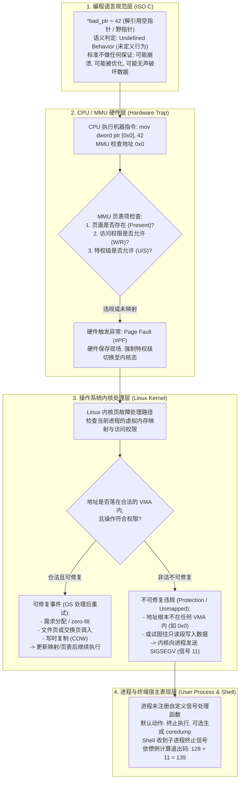

# L07-03｜当代码访问了不允许使用的内存时，究竟会发生什么？

## 学习者问题

在编写 C、C++ 甚至调试底层 Python C 扩展时，几乎每位开发者都曾遭遇过令人头疼的崩溃提示：
```text
Segmentation fault (core dumped)
```
终端有时还会打印出神秘的退出状态码 `139`。

这个所谓的“段错误（Segmentation Fault）”到底是谁发现的？是编译器在代码里偷偷插入了检查逻辑，还是主板物理内存条发生了物理故障？为什么解引用一个空指针（Null Pointer）或越界读写数组，会导致整个程序瞬间暴毙？硬件、操作系统与编程语言在这个过程中各自扮演了什么角色？

## 为什么重要

在计算机软硬件的交互史上，“内存访问违规”是连接**语言语义、硬件架构与操作系统内核**的最经典交汇点。然而，大量初学者的理解往往被模糊的日常黑话所笼罩：
- 误以为 C 语言标准规定了“非法解引用必须立刻抛出 SIGSEGV 崩溃”；
- 误以为“每一次缺页异常（Page Fault）都是一次程序崩溃”；
- 误以为“次要缺页（Minor）、主要缺页（Major）、非法缺页（Invalid）”是全球所有 CPU 芯片通用的物理硬件分类；
- 误以为终端退出码 `139` 是操作系统内核直接规定的全局通用错误号。

建立严谨的世界模型，必须清晰划分**语言规范层、CPU/MMU 硬件层、操作系统内核策略层与宿主环境表现层**的四层严格界限。

## 学习目标

完成本课后，你应能：
- 清晰辨析语言层语义与系统层表现：明确在 ISO C 规范中非法指针访问属于**未定义行为（Undefined Behavior, UB）**，C 标准本身不保证任何信号或崩溃；
- 掌握 CPU 硬件 MMU 抛出缺页异常（Page Fault Exception）到操作系统内核处理程序的完整执行路径；
- 纠正错误的分类法：分清“CPU 硬件翻译/保护事件”、“操作系统内核修复与调度”，以及“Linux 统计学上基于是否需要磁盘 I/O 的 Minor / Major 缺页分类”；
- 画出内存访问从“指令发起 $\rightarrow$ MMU 鉴权 $\rightarrow$ 缺页陷入 $\rightarrow$ 内核决断（透明修复重试 vs 派发信号终止）”的完整分支决策图；
- 使用 `labs/foundations/m07/fault_runner.py` 安全地在受控子进程中编译运行 `bad_address.c`，通过 Python `subprocess` 的原生负数返回值语义（`-signal.SIGSEGV`）准确捕获信号，并解释 Shell 退出码 `139` 的由来。

## 前置知识

- M07 `L07-01`：虚拟地址到物理页帧的 MMU 映射与权限位（`r-xp`、`rw-p`）；
- M07 `L07-02`：需求分页（Demand Paging）与次要缺页异常的良性处理；
- M06 `L06-01`：用户态与内核态特权分界、信号（Signal）基础；
- M03 `L03-03`：故障与异常（EC-CON-010）。

---

## Mental Model｜分层解耦：从语言未定义行为到硬件陷阱

面对一段非法的内存访问代码，计算机系统内部的反应是自顶向下逐层展开的：



### 1. 语言规范层：为什么不是 C 语言“抛出了”段错误？

在很多初学者心目中，空指针解引用就该等于“报段错误”。但翻开 ISO/IEC 9899（C 语言标准），你会发现其中**完全没有提到任何关于 MMU、中断向量、SIGSEGV 或段错误的字眼**。
在 C 语言规范中，非法指针解引用的定义只有简短的四个字：**未定义行为（Undefined Behavior, UB）**。
- “未定义”意味着编译器假设开发者绝不会写出这种代码；
- 如果开启了高强度优化（如 `-O2` 或 `-O3`），现代编译器（如 GCC 或 Clang）完全可能将包含空指针解引用的整段代码直接当成“死代码（Dead Code）”删除，或者认定该分支不可能发生而做出极其反直觉的激进重排；
- 只有在生成的机器指令确实被送入物理 CPU 执行、且该虚拟地址在运行时被硬件 MMU 拦截时，硬件层面的事件才会真正发生。

### 2. 硬件层与内核层的分工纠偏：缺页异常的真实分类法

很多教科书使用粗暴的三分法：“Minor = 分配物理页；Major = 从磁盘读；Invalid = SIGSEGV”，甚至把这三者说成是“CPU 硬件产生的三种缺页”。**这是完全错误的混淆**！

我们必须彻底理清三个不同层次的分类：

1. **CPU 硬件层（Hardware Event）**：
   硬件 MMU 只懂硬件规则。在 x86 上，当发生地址转换失败时，CPU 统一触发 **Page Fault 异常（中断向量号 14，#PF）**，并在错误码寄存器中记录失败原因（例如：页不存在 P=0、写保护违规 W/R=1、用户态越权 U/S=1）。硬件并不负责区分这是否是“崩溃”。
2. **操作系统决断层（OS Resolution）**：
   操作系统内核接管异常后，查阅该进程内核数据结构（VMA，虚拟内存区域）。
   - **可修复（Resolved）**：如果访问落在合法映射内但当前翻译/权限状态需要内核处理（例如需求分配、COW、文件页或交换页调入），内核可以更新映射状态并让执行从故障点继续。对普通用户代码来说，这类处理通常是透明的。
   - **不可修复（Unresolved / Invalid）**：如果访问没有对应的允许映射，或违反该映射的保护权限，Linux 可能无法把这次访问按正常内存管理路径修复，并向用户进程报告故障（本课宿主观测为 `SIGSEGV`）。
3. **Linux 统计学会计分类（Linux Accounting: Minor vs Major）**：
   在 Linux 性能统计中，针对**成功修复的良性缺页**，内核根据是否发生实际磁盘 I/O 划分为：
   - **Minor Fault（次要缺页）**：Linux 资源会计通常把无需等待页面从存储设备读入即可处理的 fault 计为 minor；zero-fill、COW 等可能落入这一类，但具体路径属于实现细节；
   - **Major Fault（主要缺页）**：Linux 资源会计通常把需要等待页面 I/O 的 fault 计为 major；这不是 CPU 的硬件 fault 类型，也不能简化成“所有文件映射或 swap 都必然 major”。

**你看清楚了吗？** 绝不能把“不可修复违规（SIGSEGV）”与 Linux 衡量 I/O 成本的“Minor / Major 缺页”平级并列为同一种硬件机制！

---

## Mechanism｜安全观测受控子进程的内存崩溃

我们绝对不能在当前主控进程中直接解引用非法指针，因为那会导致当前测试或开发环境一同崩溃。
系统工程的标准做法是：**将危险操作封装在微型子进程（Child Process）中，由宿主监视程序通过操作系统进程管理接口，在有界超时（Bounded Timeout）内收集证据**。

### 1. 目标 C 代码（`bad_address.c`）

```c
/* bad_address.c - 极简内存违规探针 */
#include <stdio.h>
#include <stdlib.h>

int main(void) {
    /* 使用 volatile 防止 GCC 编译器在优化阶段将无效写入直接消除 */
    volatile int *bad_ptr = (volatile int *)0x0;
    *bad_ptr = 42;
    return 0;
}
```

### 2. 观测运行（`fault_runner.py`）

我们运行测试装置：

```bash
cd labs/foundations/m07
python3 fault_runner.py
```

在真实 Linux / GCC 环境下输出如下：

```text
=== M07 Safe Memory Fault Observation Runner ===
Platform: linux
Parent Process PID: 20156
Compiler: /usr/bin/gcc
Compiler Version: gcc (Ubuntu 13.3.0-6ubuntu2~24.04.1) 13.3.0
Compiling fixture: bad_address.c -> bad_address
Compilation succeeded (-O0 -Wall -Wextra).

Executing child process under bounded timeout (5.0s)...

--- Hosted Observation Results ---
Raw Subprocess Returncode: -11
Terminated by Signal: True
Observed Signal Number: 11
Observed Signal Name: SIGSEGV
Timed Out: False

--- Architectural Layer Separation ---
1. C Language Specification Layer (ISO/IEC 9899):
   Dereferencing a null/bad pointer is UNDEFINED BEHAVIOR (UB).
   The C language standard guarantees NOTHING (no signal, no exit status).
2. CPU / MMU Hardware Layer:
   Attempted access to unmapped address 0x0 triggers a Page Fault exception.
3. Operating System Kernel Layer (Linux):
   Page fault handler detects invalid access and sends SIGSEGV to the process.
4. Shell / Environment Representation:
   Shells (like bash) often report 128 + Signal = 139, but this is a shell convention,
   not a universal operating system exit status.
```

### 关键证据解析

1. **Python Subprocess 负数状态码（`-11`）**：
   在 POSIX 兼容的操作系统上，Python 的 `subprocess` 模块封装了底层的 `waitpid()` 系统调用。如果子进程正常退出（`exit(0)`），返回码为正数或 0；**如果子进程是被某个未捕获的信号强制终结的，Python 将其编码为 `-N`（其中 N 为信号编号）**。
   在这次 POSIX/Linux 宿主运行里，Python `subprocess` 的 `-11` 表示子进程由信号 11 终止；结合信号名称解析，本次观测为 **`SIGSEGV`**。这证明的是该宿主上的终止类别，不是 C 语言保证。
2. **退出码 139 的由来（Shell Convention）**：
   为什么在终端直接运行 `./bad_address` 时，`echo $?` 会显示 `139`？
   因为类 Unix 终端 Shell（如 Bash、Zsh）为了在单字节（0~255）退出码内区分“自主退出”与“被信号杀死”，约定了一个经验公式：
   $$\text{Exit Code} = 128 + \text{Signal Number}$$
   对于 `SIGSEGV`（信号 11），即：
   $$128 + 11 = 139$$
   **这是 Shell 表现层的编码惯例，绝不是操作系统内核的硬性规范，更不是 C 语言的标准规定**！

---

## Explain｜为什么不是所有野指针都会触发段错误？

在实际软件开发中，很多开发者经历过这样的诡异现象：“我的数组明明越界了 5 个元素，为什么程序没有崩溃，反而继续跑下去了？”

结合我们这三课建立的世界模型，答案已经呼之欲出：
1. **硬件保护的粒度是“页（Page）”，不是“字节（Byte）”**：
   MMU 的硬件权限检查是以 4 KiB 为最小单位进行的。
   如果你的数组分配在堆中（例如通过 `malloc`），或者分配在栈上，而你越界访问的偏移量仅仅超出了几个字节，**这个错误的地址极大概率依然落在一个已经被合法映射、且具备读写权限的物理页内部**！
2. **无声的数据污染（Silent Data Corruption）**：
   因为该页面在页表中被标记为 `rw-`，MMU 检查时判定为合法访问，根本不会触发硬件缺页异常，操作系统内核完全蒙在鼓里。
   结果就是：程序没有崩溃，而是静默覆盖了相邻的另一个变量、破坏了堆管理器的元数据、或者改写了函数的返回地址。
3. **结论**：
   **“非法指针访问必定导致 SIGSEGV”是一个极其危险的错觉**。段错误只是操作系统在越过未映射边界时提供的“善意底线”，绝不能作为验证指针正确性的安全网。

---

## Checkpoint Investigation

### Question
程序员小赵在排查一段崩溃代码。他在 C 代码中写下了：
```c
int *p = NULL;
*p = 100;
```
在 Linux x86-64 机器上运行，程序被 SIGSEGV 杀死。小赵在技术分享会上宣称：“根据 C 语言标准，给 NULL 指针赋值一定会让 CPU 向进程发送 11 号段错误信号。”
请从语言规范、CPU 架构、操作系统三个层面，指正小赵宣称中的严密性漏洞。

<details>
<summary>Hint 1</summary>
查阅 ISO C 语言标准对于空指针解引用的规定，标准是否包含“SIGSEGV”或“CPU 信号”的定义？
</details>

<details>
<summary>Hint 2</summary>
如果在没有 MMU 的裸机嵌入式系统（如单片机 Cortex-M0）上运行这段代码，地址 0x0 可能存放的是什么？会发生段错误吗？
</details>

<details>
<summary>Expected Observation</summary>
小赵的宣称严重混淆了抽象层级。
1. 在 C 语言规范层：解引用 NULL 是未定义行为（Undefined Behavior），C 标准不承诺任何具体表现；
2. 在硬件层：某些无 MMU 的嵌入式微控制器将地址 0x0 映射为合法的中断向量表或 Flash，给 0x0 赋值可能静默改写中断向量或引发硬件 HardFault，绝不会有 SIGSEGV 信号；
3. 在操作系统层：SIGSEGV 是 POSIX/Linux 操作系统内核缺页处理程序在判定该地址未映射后派发给进程的软件信号，而非 CPU 芯片直接发送给进程。
</details>

<details>
<summary>Full Explanation</summary>
1. **语言层**：ISO/IEC 9899 明确规定解引用空指针属于 Undefined Behavior。编译器甚至有权通过死代码消除直接忽略该语句；
2. **硬件层**：CPU MMU 在翻译虚拟地址 0x0 时发现页表项未设置 Present 位，触发的是 CPU 内部的硬件 Page Fault 异常（在 x86 上是 #PF），这个硬件异常陷入的是操作系统内核，CPU 不懂什么是“进程的信号”；
3. **系统层**：在本课测试的 Linux/x86-64 宿主上，内核处理该访问引发的页故障后判定访问不能按允许的用户映射解决，并最终使进程收到 `SIGSEGV`。具体内核数据结构与函数名会随版本演进；这里保留的是稳定的“硬件事件 → OS 处理 → 可修复或用户可见失败”分层。
</details>

---

## Common Misconceptions

- **“每一次缺页异常（Page Fault）都会导致程序崩溃。”** 严重错误！绝大多数缺页异常（如需求分页分配、写时复制 COW、交换区换入）都是操作系统极其正常的日常调度行为，由内核默默修复后恢复执行，程序毫无察觉。只有无法修复的非法缺页才引发信号。
- **“Minor / Major / Invalid 是 CPU 硬件的三种缺页。”** 错。CPU 硬件 MMU 只发出统一的异常信号（如 x86 的 #PF），根本不包含 Minor 或 Major 的概念。Minor 与 Major 是 Linux 内核为了统计内存与 I/O 开销而设定的软件会计分类；Invalid 则是内核对非法地址的逻辑判定。
- **“野指针访问一定会立刻报段错误。”** 错。如果野指针碰巧指向了另一个已映射且具备读写权限的合法页面，硬件 MMU 不会拦截，程序将静默执行并篡改数据。
- **“C 语言标准保证了非法解引用会收到信号。”** 错。C 标准将其定义为未定义行为（UB），编译器优化可能改变代码结构，无 MMU 环境也完全不会产生类似信号。
- **“Shell 退出码 139 是内核的标准错误码。”** 错。139 是类 Unix Shell 按照 `128 + 信号编号(11)` 自主折算出的终端退出状态，并非内核直接赋予的统一错误标识。
- **“段错误说明物理内存芯片损坏了。”** 错。段错误（Segmentation Fault）是虚拟地址转换与内存保护机制生效的正常软件信号，代表软件违规被系统成功拦截，硬件内存芯片完好无损。

## What You Can Ignore—for Now

Linux 内核中的 `sigaction` 信号掩码与替代信号栈（`sigaltstack`）、`siglongjmp` 从非法访问中冒险恢复的高级黑魔法、硬件 ECC 校验导致的真正物理内存故障（MCE, Machine Check Exception）。

## Exit Criteria

能够说出 C 语言层未定义行为（UB）、硬件 MMU 缺页陷阱、内核信号派发这三层的严格边界；画出内存访问决策分支图（区分良性可修复缺页与不可修复非法访问）；解释为什么绝大多数缺页不是崩溃；使用 `fault_runner.py` 观察子进程崩溃的负数状态码并解释退出码 139 的构成。

## Competency Mapping

- **Explain（Primary）**：阐释内存访问保护机制、缺页决策分支与分层抽象关系；
- **Diagnose**：在故障排查中精准区分静默数据破坏与段错误崩溃的成因；
- **Trace**：追踪非法内存操作从汇编指令触发到 MMU 异常再到操作系统派发信号的全链路。

## Provenance

- ISO/IEC 9899:2018 (C17 Standard): Section 6.5.3.2 (Address and indirection operators — Undefined Behavior)；
- POSIX.1-2024 / IEEE Std 1003.1-2024: System Interfaces (Signal Concepts, `SIGSEGV`)；
- Intel 64 and IA-32 Architectures Software Developer's Manual, Volume 3A: Chapter 6 (Interrupt and Exception Handling — Fault #PF)；
- Linux Kernel Source: `arch/x86/mm/fault.c` (`do_user_addr_fault`)；
- Remzi H. Arpaci-Dusseau and Andrea C. Arpaci-Dusseau: *Operating Systems: Three Easy Pieces (OSTEP)*, Chapter 19 (Paging: Faster Translations).
