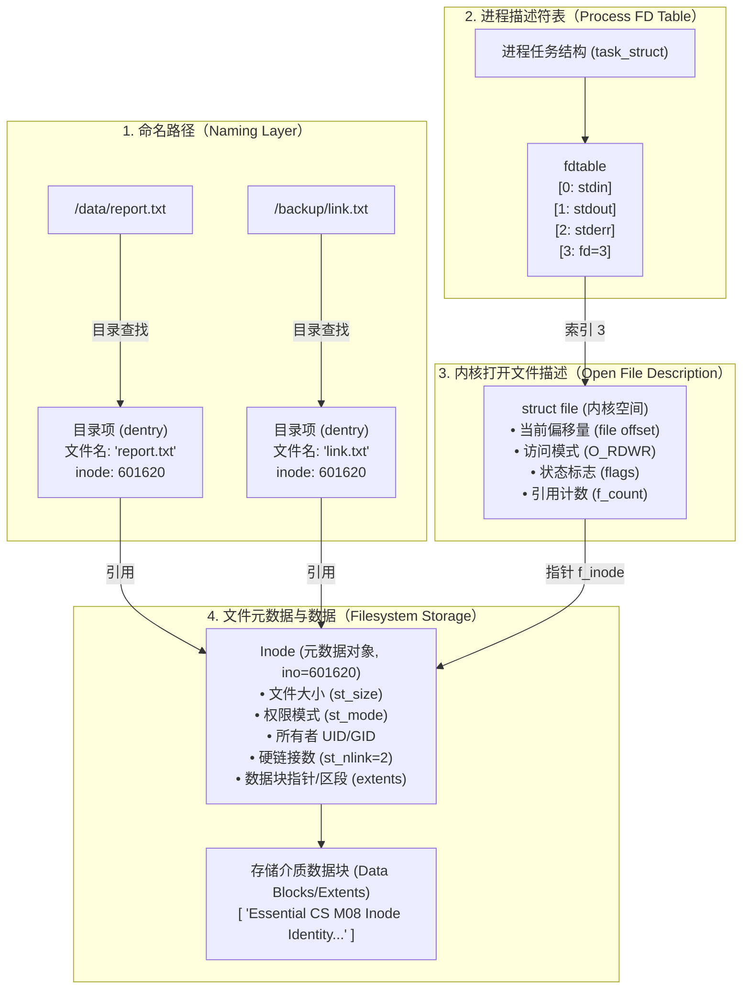
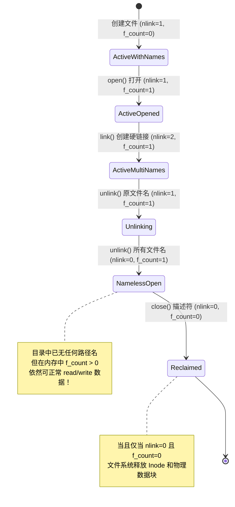

# L08-01｜什么是文件：从路径名到存储块的四层解耦

## 学习者问题

在日常使用计算机时，我们双击一个名为 `report.txt` 的图标，或者在终端输入 `cat /home/user/code.py`，屏幕上就会展示出文件内容。

在操作系统底层，**“文件”究竟是什么？** 文件名是直接贴在数据开头的标签吗？当我们在代码中打开一个文件并拿到整数 `3`（文件描述符 FD）时，操作系统是如何顺藤摸瓜，在成百上千吉字节的存储介质上精确定位到那几百个字节的数据块的？为什么两个路径名可以指向同一份数据？为什么删除了一个正在运行的程序正在写入的日志文件，磁盘空间却一点没有释放？

## 为什么重要

许多学习者在刚接触系统编程时，往往抱有若干直觉误区：
- **名称与数据绑定误区**：误以为“文件名”就像快递包裹上的收件人名字一样，直接保存在文件的内部或第一个字节块中；
- **文件描述符全局化误区**：误以为进程中的文件描述符（如 `fd=3`）是全系统通用的全局文件编号；
- **立即销毁误区**：误以为执行 `rm` 或代码中调用 `unlink()` 会立刻把磁道或闪存介质上的数据块擦除；
- **全盘 Inode 化误区**：误以为世界上所有的文件系统（包括 FAT32、NTFS、网络对象存储）底层都长着完全相同的 Unix Inode 结构。

要建立现代计算系统的底层世界模型，就必须理解操作系统如何通过**分层解耦与间接引用（Indirection, EC-CON-004）**，将人类可读的层次树状路径，一步步转换为进程局部句柄、内核动态打开状态、文件元数据对象以及实际物理存储块。

## 学习目标

完成本课后，你应能：
- **Trace**：清晰追踪并画出从人类可读路径名到物理存储数据块的完整路径，严格区分**路径名/目录项（Directory Entry）**、**进程文件描述符（FD）**、**内核打开文件描述（Open File Description）**与**文件元数据对象（Inode）**；
- **Explain**：准确阐述硬链接（Hard Link）的引用机制，说明为什么硬链接共享相同 Inode 与设备号，并指出硬链接无法跨越独立文件系统边界的原因；
- **Observe**：使用 `labs/foundations/m08/file_identity.py`，在真实 Linux 环境下观测硬链接元数据、通过 `/proc/self/fd` 检视进程句柄，并实测 `open()` $\rightarrow$ `unlink()` 的延迟销毁行为；
- **Explain**：从引用计数与生命周期模型出发，解释为什么删除目录项（`unlink`）后，已打开的文件描述符依然能够正常读写数据，直到最后一个文件描述符关闭时块空间才真正被回收；
- **Trace / Contrast**：通过检视 xv6 教学操作系统源码（`kernel/sysfile.c`、`kernel/file.c`、`kernel/bio.c`），对比极简操作系统与工业级 Linux VFS/页缓存的设计差异。

## 前置知识

- M06 `L06-01`：系统调用与进程资源管理（文件描述符作为进程资源表的索引）；
- M07 `L07-01`：虚拟内存与进程地址空间隔离；
- 核心概念复访：**Interface（接口，EC-CON-005）**、**Indirection（间接引用，EC-CON-004）**、**State（状态，EC-CON-001）**。

---

## Mental Model｜文件系统的四层解耦模型

在以 Linux/Unix 为代表的现代操作系统中，“文件”并不是一个扁平的单体概念，而是由四个高度解耦的核心实体协同构成的：



### 1. 路径名与目录项（Pathname / Directory Entry）
- **职责**：面向人类用户的命名层。
- **机制真相**：**文件名绝对不保存在文件自身的内容或元数据 Inode 内部！** 目录在文件系统底层本身也是一个特殊文件，它的数据内容就是一张“文件名字符串 $\rightarrow$ Inode 编号”的映射表。每一条映射记录就是一个**目录项（Directory Entry，在 Linux 内核缓存中称为 dentry）**。
- **解耦优势**：因为名字与文件元数据解耦，所以可以有多个不同目录中的不同名字，指向同一个底层的 Inode 编号（这就是硬链接）。

### 2. 进程文件描述符（Process File Descriptor, FD）
- **职责**：面向进程代码的局部轻量级句柄。
- **机制真相**：系统调用 `open()` 返回的小整数（如 0, 1, 2, 3）仅仅是当前进程内部描述符数组（Linux 的 `task_struct->files->fdt`）的下标。**文件描述符是进程局部的，绝不是全局唯一标识符**。进程 A 里的 `fd=3` 与进程 B 里的 `fd=3` 毫无瓜葛，分别指向各自打开的资源。

### 3. 内核打开文件描述（Open File Description）
- **职责**：内核维护的动态打开上下文实例（Linux 中的 `struct file`）。
- **机制真相**：每执行一次 `open()` 系统调用，内核就会在内核堆中分配一个新的 `struct file` 结构。它记录着：
  - **当前读写偏移量（Current File Offset）**：下一次 `read()` 或 `write()` 从哪个字节位置开始；
  - **文件状态标志（Status Flags）**：打开模式（`O_RDONLY`、`O_WRONLY`、`O_APPEND`、`O_NONBLOCK`）；
  - **引用计数（`f_count`）**：当前有多少个文件描述符指向这个打开文件描述（例如通过 `dup(fd)` 或进程 `fork()` 产生的子进程会共享同一个 `struct file`，从而共享相同的文件偏移量）。
- **解耦优势**：两个不同的进程（甚至同一个进程打开同一个文件两次）会拥有两个独立的打开文件描述，各自拥有独立的文件偏移量，互不干扰地读写同一个底层文件。

### 4. 文件元数据对象（Inode）与数据块
- **职责**：文件系统底层的持久化实体。
- **机制真相**：Inode（Index Node）记录文件的本质属性：文件大小、拥有者、权限位（mode）、时间戳、以及最关键的——**硬链接计数（`st_nlink`）**和**物理数据块寻址指针（Block Pointers / Extents）**。
- **边界警示**：Inode 概念源于 Unix/POSIX 规范标准。虽然 Linux 的 ext4、xfs 以及 BSD 的 UFS 都采用 Inode 架构，但其它文件系统（如 Windows 的 NTFS 使用 MFT 主文件表记录项，FAT32 使用目录项簇链）有不同的物理布局。但无论具体布局如何，**“将命名索引与存储元数据解耦”**是所有现代文件系统的共同基石。

---

## Mechanism｜命名、链接与生命周期验证

我们使用实验套件中的 `labs/foundations/m08/file_identity.py`，在真实宿主机上验证上述解耦机制。

### 1. 硬链接机制验证（Hard Link Identity）

当执行 `os.link(src, link_path)` 时，操作系统在目录中新增了一个目录项指向现有的 Inode，并将 Inode 中的 `st_nlink` 增加 1：

```bash
cd labs/foundations/m08
python3 file_identity.py
```

在真实 Linux 环境下的实测输出：
```text
=== Essential CS M08 — File Identity & Reference Lifetime Observer ===
[1] Original file created: inode=601620, dev=2096, nlink=1
[2] Hard link created:     inode=601620, dev=2096, nlink=2
    -> Identity verified: same_inode=True, same_device=True
```

#### 关键证据推导：
1. **完全等价的对等引用**：`original.txt` 与 `hardlink.txt` 具有完全相同的 `inode=601620` 与设备号 `dev=2096`。硬链接没有“源文件”与“快捷方式/替身”的主从之分，它们是地位完全平等的两个目录名，共同引用同一个 Inode；
2. **为什么硬链接不能跨文件系统？** Inode 编号仅在单个文件系统（由 `st_dev` 标识的分区或卷）内部具有唯一性。不同的文件系统有各自独立的 Inode 编号空间，跨文件系统的 Inode 引用毫无意义，因此 POSIX 规定跨设备硬链接会立即报错 `EXDEV`（Invalid cross-device link）。

---

### 2. `open()` $\rightarrow$ `unlink()` 的延迟销毁模型

许多人以为，只要删除了文件，磁盘上的数据就立刻消失。我们通过一段精密的生命周期实验来打破这一错觉：
1. 进程先打开文件，拿到文件描述符 `fd=3`；
2. 此时调用 `os.unlink("original.txt")` 与 `os.unlink("hardlink.txt")`，从文件系统中删除全部目录项；
3. 观察此时的系统状态与后续 I/O：

```text
[3] Open file descriptor:  fd=3
    -> /proc/self/fd/3 points to: /tmp/_run_m08_id_ogaes8w0/original.txt
[4] Both directory entries unlinked from disk.
    -> Directory existence: orig=False, link=False
    -> /proc/self/fd/3 after unlink: /tmp/_run_m08_id_ogaes8w0/original.txt (deleted)
[5] Continued I/O on unlinked open descriptor:
    -> Read initial content match: True
    -> Wrote 51 bytes into unlinked inode
    -> Total readable bytes: 118
[6] Overall verification: PASS
```



#### 关键机制解析：
- **双重引用生命周期**：一个文件对象被两种不同的引用力量守护着：
  1. **目录树硬链接计数（`st_nlink`）**：保存在磁盘 Inode 元数据中；
  2. **内核打开引用计数（`f_count`）**：保存在操作系统内核的动态内存对象中。
- **物理块释放的充分必要条件**：
  $$\text{Reclaim Storage Blocks} \iff (\text{st\_nlink} == 0) \land (\text{f\_count} == 0)$$
- 当 `unlink()` 执行后，虽然目录中找不到名字了（`os.path.exists()` 为 False），但因为进程的 `fd` 依然开启，内核 `struct file` 依然持有对 Inode 的有效指针。进程可以继续无障碍地读出旧数据、写入新数据；Linux 的 `/proc/self/fd/3` 会清晰标明软链接目标为 `(deleted)`。
- 只有当进程显式调用 `close(fd)`，或者持有该描述符的进程彻底退出时，内核将 `f_count` 递减到 0。此时检测到 `st_nlink == 0`，文件系统才将 Inode 及对应的数据块标记回“空闲块位图（Block Bitmap）”，存储空间才算真正释放！

---

## Inspection Contrast｜源码阅读：xv6 的文件表示极简主义

为了看清工业级操作系统底层设计的核心骨架，我们对 MIT 教学操作系统 `xv6-riscv`（已固定于 commit `35b0884`）进行代码检视对比。**这仅仅是一次纯粹的源码检视，不需要编译运行，亦不需要启动 QEMU**。

### 1. 进程如何持有着文件句柄？
检视 `kernel/sysfile.c` 中的 `sys_read`：
```c
// kernel/sysfile.c (xv6-riscv)
uint64
sys_read(void)
{
  struct file *f;
  int n;
  uint64 p;

  argaddr(1, &p);
  argint(2, &n);
  if(argfd(0, 0, &f) < 0)
    return -1;
  return fileread(f, p, n);
}
```
辅助函数 `argfd` 的实现表明：xv6 的进程控制块 `struct proc` 中有一个简单的静态数组：`struct file *ofile[NOFILE]`。传入的整数 `fd` 直接作为数组下标索引，获取内核中的 `struct file*`。

### 2. xv6 的打开文件与 Inode
检视 `kernel/file.c` 中的 `struct file` 定义：
```c
// kernel/file.h (xv6-riscv)
struct file {
  enum { FD_NONE, FD_PIPE, FD_INODE, FD_DEVICE } type;
  int ref; // 引用计数 (f_count)
  char readable;
  char writable;
  struct pipe *pipe; // FD_PIPE
  struct inode *ip;  // FD_INODE: 直接指向内存中的 Inode
  uint off;          // 当前文件偏移量 (file offset)
};
```
在 xv6 中，`struct file` 包含引用计数 `ref`、读写标志和当前偏移量 `off`，当类型为普通文件时直接包含 `struct inode *ip` 指针。当两个进程共享同一个 `struct file` 时，它们共享同一个偏移量 `off`。

### 3. 极简设计与 Linux VFS 的对比
检视 `kernel/bio.c`，你会发现 xv6 的磁盘缓存（Buffer Cache）极其精简：全局仅维护 `NBUF=30` 个物理扇区缓冲区链表。
- **xv6 的极简性**：没有复杂的通用虚拟文件系统（VFS）抽象，没有针对不同文件系统类型的驱动接口转换，没有统一虚拟内存页缓存（Page Cache）。文件描述符几乎是直线映射到单一格式的磁盘 Inode。
- **Linux 的现实复杂度**：Linux 必须在同一套 POSIX 接口下同时支撑 ext4、XFS、Btrfs、NFS 以及网络套接字与管道，因此引入了庞大的 VFS 抽象层（`dentry` 目录项缓存、`inode` 内存对象、`file` 打开描述、`address_space` 页缓存映射）。但**两者的核心解耦哲学完全相通**：进程持有局部的描述符，内核维护带偏移的打开上下文，底层通过元数据节点索引物理块。

---

## Checkpoint Investigation

### Question
在生产环境中，某服务因磁盘容量告警（空间使用率 100%），运维工程师小王登录服务器执行 `rm /var/log/app.log` 删除了一个高达 20 GB 的巨大日志文件。然而，删除后立即执行 `df -h` 检查，却发现磁盘可用空间丝毫没有增加，系统依然持续处于 100% 满盘报警状态。

请结合本课学习的文件引用生命周期模型，回答：
1. 为什么 `rm` 之后磁盘空间没有被释放？
2. 怎样定位是哪个进程导致空间未释放？在不暴力重启整台服务器的前提下，应如何正确释放该空间？

<details>
<summary>Hint 1</summary>
思考 <code>rm</code> 命令底层调用的是什么系统调用？删除目录项（<code>unlink</code>）是否等同于将物理磁盘块标记为空闲？
</details>

<details>
<summary>Hint 2</summary>
产生日志的应用程序进程是否仍在运行？它的文件描述符是否一直处于打开状态？
</details>

<details>
<summary>Expected Observation</summary>
<code>rm</code> 命令调用的是 <code>unlink()</code> 系统调用，这仅仅移除了目录项并将 Inode 的 <code>st_nlink</code> 降为了 0。但是如果后台应用程序一直在运行且没有关闭对该文件的文件描述符（<code>f_count &gt; 0</code>），操作系统就不会释放底层的 Inode 和数据块。因此 <code>df</code>（统计文件系统空闲块）依然显示磁盘被占满。
可以通过 <code>lsof | grep deleted</code> 或检查 <code>/proc/*/fd/</code> 找到持有该被删文件的进程 PID。
</details>

<details>
<summary>Full Explanation</summary>
在 POSIX/Linux 文件系统模型中，物理磁盘块被回收必须满足双重条件：<code>st_nlink == 0</code> 且 <code>f_count == 0</code>。
小王执行 <code>rm</code>，仅仅从目录中移除了名为 <code>app.log</code> 的目录项，使得 <code>st_nlink</code> 降至 0。但是由于日志服务进程仍在持续运行，内核中该文件的打开文件描述引用计数 <code>f_count</code> 依然至少为 1。内核必须保证正在运行的进程能够继续写入和读取该文件，因此底层存储块依然被完全保留，<code>df -h</code> 报告的已用块数不会发生任何改变。

<strong>排障与处置方法：</strong>
1. <strong>精准定位</strong>：执行命令 <code>lsof | grep deleted</code>，或使用 Linux procfs 查找：
   <code>ls -l /proc/*/fd/* 2&gt;/dev/null | grep '(deleted)'</code>，即可精准找出持有该文件的进程 PID 及对应的文件描述符编号（例如 <code>PID=1234, fd=5</code>）；
2. <strong>安全释放空间</strong>：
   - <strong>优雅方案</strong>：通知进程重载配置或重新打开日志（如发送 <code>kill -HUP &lt;pid&gt;</code>），或重启该服务进程。进程退出或关闭 FD 时，<code>f_count</code> 降为 0，20 GB 空间瞬间被内核回收；
   - <strong>不重启在线清空</strong>：若进程绝对不能停止，可以利用其在 procfs 中的句柄将其截断：<code>: &gt; /proc/1234/fd/5</code>。这会直接调用 <code>ftruncate</code> 将文件大小重置为 0 字节，立刻向内核释放已被分配的数据块。
</details>

---

## Common Misconceptions

- **“文件名保存在文件数据内部或 Inode 内部。”** 错。文件名仅仅是目录文件中的一条映射记录（dentry）。Inode 内部只记录文件元数据和物理块指针，根本不知道自己被叫作什么名字。
- **“文件描述符（FD）是一个系统全局通用的唯一编号。”** 错。FD 只是进程内部描述符表的数组下标。进程 A 的 `fd=3` 和进程 B 的 `fd=3` 完全独立，可能指向截然不同的资源。
- **“执行 `rm` 或 `unlink()` 会立刻粉碎并擦除物理磁盘块。”** 错。`unlink()` 只是移除了目录项并递减 `nlink`。只有当该 Inode 的 `nlink == 0` 且所有打开该文件的进程都关闭了对应的 FD 时，存储块才会被标记回收。
- **“硬链接有一个‘原始文件’，把原文件删了硬链接就会失效。”** 错。这是软链接（符号链接，Symlink）的特性。硬链接在 Inode 级别上完全对称、人人平等，没有任何主次之分。只要还有一个硬链接名字存在，文件就依然完好无损。
- **“世界上所有文件系统都采用 Unix Inode 这种磁盘数据结构。”** 错。Inode 是 Unix/POSIX 文件系统的设计典范。Windows NTFS、FAT32 以及各大云厂商的对象存储在磁盘物理组织和元数据管理上结构各异，但它们在逻辑抽象上都必须实现“路径命名”与“数据寻址”的解耦。

## What You Can Ignore—for Now

- Linux ext4 Extent 树的具体 B-tree 物理编码算法与块寻址位图计算；
- VFS 路径查找（Path Walk）中复杂的 RCU 锁无等待并发控制；
- Inode 扩展属性（xattrs）与访问控制列表（ACL）的内部节点存储。

## Exit Criteria

- 能够不看任何参考资料，准确默写并画出 Pathname $\rightarrow$ Directory Entry $\rightarrow$ File Descriptor $\rightarrow$ Open File Description $\rightarrow$ Inode 的解耦调用图；
- 能够清晰解释硬链接共享 Inode 的现象，并准确说出硬链接不可跨文件系统的根本原因；
- 能够用双重引用条件（`nlink == 0 && f_count == 0`）解释“删除了日志文件但磁盘空间不释放”的生产疑难，并给出基于 `/proc` 的排查命令。

## Competency Mapping

- **Primary**: **Trace** (追踪从路径字符串、目录项、进程描述符表、内核打开文件描述到 Inode 的完整解析链路)
- **Growth**: **Explain** (阐明硬链接与延迟销毁生命周期), **Observe** (使用 `file_identity.py` 与 `/proc/self/fd` 检视真实句柄)

## Provenance

- **POSIX.1-2024 (IEEE Std 1003.1-2024)**: Base Definitions §3.164 (File), §3.195 (Inode), §3.125 (Directory), and System Interfaces: `open(2)`, `unlink(2)`, `stat(2)`, `dup(2)`.
- **Linux Kernel Documentation**: *Virtual Filesystem (VFS)* (`Documentation/filesystems/vfs.rst`), `inode(7)`, `proc(5)`.
- **xv6-riscv Source (MIT 6.1810, rev 35b0884)**: `kernel/sysfile.c`, `kernel/file.h`, `kernel/file.c`, `kernel/bio.c`.
- **OSTEP (Operating Systems: Three Easy Pieces)**: Remzi & Andrea Arpaci-Dusseau, Chapters 39 & 40.
