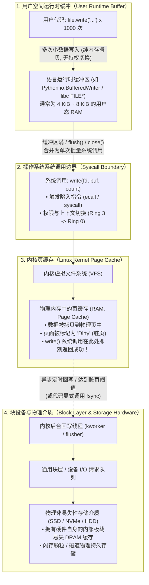
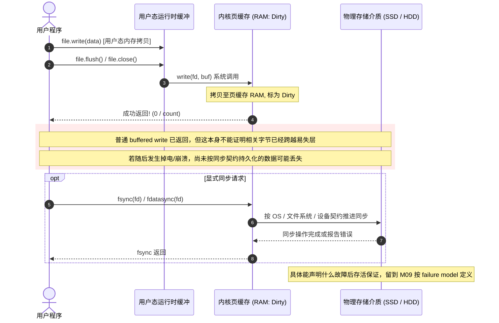

# L08-02｜数据究竟写到了哪里：缓冲 I/O、页缓存与持久性边界

## 学习者问题

在编写代码时，我们经常调用 `file.write("hello world")`。代码一瞬间就执行完毕并返回了。在现代操作系统上，写入一个包含数兆字节的文件，耗时往往只有几毫秒。

**这几十万个字节究竟去了哪里？** 它们真的已经刻录到了固态硬盘的闪存颗粒或机械硬盘的磁道上了吗？为什么向存储介质写入数据的速度，竟然可以比存储硬件本身的物理写入极限还要快上几个数量级？更致命的问题是：**代码里的 `write()` 成功返回，甚至调用了 `close()`，是否意味着数据已经绝对安全，就算下一毫秒机房停电也不会丢失？**

## 为什么重要

在日常工程与分布式系统研发中，对“写操作”的朴素误解引发了无数灾难性的数据丢失事件：
- **直通磁盘错觉**：误以为每一次语言层面的 `write()` 都会触发一次真实的硬盘物理磁头寻道或闪存写入；
- **关闭即落盘错觉**：误以为只要执行了 `f.close()`，操作系统就必然将数据刷到了非易失性物理介质上；
- **缓存当持久错觉**：误以为操作系统内核里的“页缓存（Page Cache）”具有掉电持久性；
- **伪造跟踪误区**：在缺乏动态跟踪工具（如 `strace`）的环境下，部分初学者甚至倾向于凭空脑补或捏造一份底层系统调用跟踪记录。

要理解真实计算机的 I/O 性能与可靠性权衡，就必须建立**四层写入流水线模型**，看清从用户态运行时缓冲到内核页缓存的批量合并过程，并正式确立**普通缓冲写入成功与真实物理持久性之间的严格边界**。

## 学习目标

完成本课后，你应能：
- **Trace**：清晰追踪并画出写操作跨越的四个核心层级：**用户运行时缓冲区（Runtime Buffer）** $\rightarrow$ **系统调用边界（`write(2)`）** $\rightarrow$ **操作系统内核页缓存（Linux Page Cache / Dirty RAM）** $\rightarrow$ **块设备层与物理介质**；
- **Explain**：阐述用户态缓冲（如 Python `BufferedWriter`）与内核态页缓存（Page Cache）各自的存在目的与协同机制，解释为什么系统调用批处理能够消除高频上下文切换开销；
- **Observe**：使用 `labs/foundations/m08/buffered_io_observer.py` 对比用户态 buffered I/O 与低层 `os.write()`；只有在 live `strace` 能力可用时才观测实际 syscall 关系，否则明确记录 `NO LIVE SYSCALL TRACE`；在 Linux 宿主机上可观察 `/proc/meminfo` 的 `Dirty` 指标，但只作系统级噪声较大的环境证据；
- **Diagnose / Judge**：理解 `strace` 动态跟踪能力在不同环境中的可用性边界；在缺失或受限环境中，坚持诚实输出 `NO LIVE SYSCALL TRACE`，绝不伪造跟踪事实；
- **Explain / Preview**：严格论证为什么普通的缓冲 `write()` 与 `close()` 成功**并不证明**数据已具备掉电持久性；为 M09 模块正式确立 **Durability（持久性，EC-CON-016）** 建立清晰的前置认知防线（本课只做边界辨析，绝不在本模块抢先定义其 First Home）。

## 前置知识

- M04 `L04-01`：硬件缓存与局部性原理（EC-CON-011 Caching, EC-CON-012 Locality）；
- M06 `L06-01`：用户空间与内核空间的特权级切换开销；
- M08 `L08-01`：文件描述符与内核打开文件结构。

---

## Mental Model｜写入路径的四层缓冲模型

当你的代码执行一次写入操作时，数据并不是像子弹一样直接射向磁盘，而是如同接力跑一样，穿过了多层内存缓冲区：



### 层级 1：语言与用户空间运行时缓冲区
- **为什么要这一层？** 从用户态陷入内核态（执行系统调用）具有固定的 CPU 开销：保存寄存器、切换页表或内核栈、执行安全检查、再恢复用户态。如果程序在循环中每次只写 16 字节，每次都发起一次系统调用，绝大多数 CPU 时间都将被浪费在上下文切换的空转上。
- **工作机制**：高级语言运行时（如 Python 的 `BufferedWriter`，或 C 标准库 `stdio` 的 `FILE*`）可以在用户空间缓冲数据，从而减少底层 I/O 调用。缓冲大小、何时直接绕过缓冲发送大块数据、以及一次应用写对应多少次底层调用，都由运行时与具体调用模式决定；本课不把某个固定字节数或 syscall 比例写成契约。
- **边界警示**：不同语言、不同操作系统平台、不同 Python 版本的默认缓冲区大小并不相同（例如常见有 4096 字节、8192 字节等），**切勿将某个具体的缓冲区数字背诵为不可变更的普遍物理常数**。

### 层级 2：系统调用边界（Syscall Boundary）
- **`write(2)` 的真实契约**：`write(fd, buf, count)` 最多写入 `count` 字节，并返回实际写入的字节数；成功也可能是**部分写入**。更关键的是，成功返回**不保证数据已经提交到磁盘/永久存储**，某些错误还可能延迟到后续 `write()`、`fsync()` 或 `close()` 才报告。

### 层级 3：操作系统内核页缓存（Page Cache & Dirty Pages）
- **Linux buffered regular-file 路径**：对普通 buffered 文件 I/O，Linux 通常会让写入与 page cache / filesystem buffered state 交互，并把需要后续写回的页面标记为 dirty。这个路径能把应用的完成时点与设备最终写回时点解耦。
- **边界**：不能把它写成“所有 `write()` 都只是拷贝到 page cache 然后立刻返回”。`write()` 可能部分完成、阻塞、遇到同步挂载/`O_SYNC`，也存在 direct I/O 等不同路径。M08 只要求学习者理解**普通 buffered write 成功不等于永久介质已同步**。

### 层级 4：后台异步回写与物理介质
- **异步写回（Writeback）**：Linux 有内核写回机制把 dirty 文件数据推进到文件系统与设备层；触发条件、执行上下文、队列和具体线程名会随内核/文件系统实现演进。本课不把 `kworker`、某个 sysctl 或某个周期画成固定机制常数。
- **非确定性警示**：Linux 脏页在内存中驻留的时间、后台回写被触发的时机，由内核调度器、当前系统内存压力、系统参数（如 `dirty_expire_centisecs`）共同决定。**没有任何固定的回写延迟时间可以作为普遍定律**。

---

## Boundary & Preview｜为什么 write() 成功不等于持久性？

这是本课最重要的概念边界。



### 关键认知纠偏：
1. **`write()` 成功 $\neq$ 掉电持久性证明**：成功返回表示本次接口写入取得了返回计数，但并不保证这些字节已经提交到永久存储；在 Linux 普通 buffered regular-file 路径上，它们可能仍处于内核缓存/文件系统的易失状态。
2. **`close()` 成功 $\neq$ `fsync()` 等价保证**：以 Python buffered file 为例，`f.close()` 会先处理运行时缓冲并关闭描述符；但 POSIX/Linux 的 `close(2)` 成功并不保证数据已经保存到磁盘，也不能被当作 `fsync()` 的替代。不要给后台写回附加固定“几秒/几十秒”时延。
3. **故障窗口**：如果相关修改尚未按所需同步契约到达故障模型要求的持久层，那么掉电或崩溃后**这些尚未持久化的修改可能丢失**。不能从 `write()`/`close()` 的返回值反推出“全部 dirty pages 当前在哪一层”或“必然全部丢失”。
4. **概念主场审计（Durability First Home）**：
   - `EC-CON-016 Durability` 的**规范定义、故障模型与同步契约主场全部保留给 M09 `L09-01`**；
   - M08 只做一个负面边界判断：**普通 buffered `write()` / runtime `flush()` / `close()` 成功，本身不足以证明 M09 将要定义的持久性要求已经成立**；
   - 因此本课不在这里给出 Durability 的 canonical definition，也不宣称某一次 `fsync()` 就自动建立任意应用场景下的完整持久性。

---

## Hands-on Observation｜实测缓冲与页缓存

我们运行 `labs/foundations/m08/buffered_io_observer.py` 来实测这一分层流水线。

```bash
cd labs/foundations/m08
python3 buffered_io_observer.py
```

实测输出记录：
```text
=== Essential CS M08 — Buffered I/O & Page Cache Observer ===
[1] User-Space Buffering Demonstration:
    -> Application write calls: 1024 x 16 bytes
    -> Python stream type: BufferedWriter
    -> Default buffer size: 8192 bytes
    -> Buffered file size: 16384 bytes
    -> Unbuffered file size: 16384 bytes
[2] Live Syscall Trace Check:
    -> Result: NO LIVE SYSCALL TRACE (strace binary not found in PATH)
[3] Linux Page Cache (Dirty Pages) Observation:
    -> Bounded payload: 8 MiB
    -> Dirty before: 184 kB
    -> Dirty after:  8248 kB
    -> Delta:        8064 kB (system-global, noisy)
[4] Durability Boundary Audit:
    -> Ordinary write success proves durability: False
    -> Audit status: PASS
    -> Note: Canonical Durability first home is M09 (L09-01).
```

### 1. 批量合并实测分析
- 程序发起了 1024 次单独的、每次仅 16 字节的微小写入请求；
- `BufferedWriter`（默认 8192 字节）在用户内存中将这些零碎操作暂存聚合；
- 最终写入磁盘的实际文件大小精确匹配（16384 字节）。用户空间缓冲在完全不惊动内核的前提下，大幅减少了特权级切换开销。

### 2. 真实性铁律：动态跟踪（`strace`）能力与事实原则
- 很多自动化文档在没有安装跟踪工具时，习惯伪造一份假的 `write(3, "...", 8192) = 8192` 的输出。
- **Essential CS 严禁伪造事实**：在本宿主机环境中未安装 `strace` 工具，测试脚本必须如实探测并输出：
  `Result: NO LIVE SYSCALL TRACE (strace binary not found in PATH)`。
- 只有当环境确实具备 live `strace` 能力时，才记录**实际观测到的**底层 `write()` 次数，并只检查“是否出现批处理关系”等已复现模式；不预设 `1000 → 2` 之类固定计数。

### 3. Linux 页缓存脏页观测与噪声解释
- 脚本写入了一个有界的 8 MiB 临时文件（**注意：教学实验只需小尺度有界数据，严禁无意义的数百兆磁盘轰炸**）；
- 在写入前后读取 `/proc/meminfo`：
  - 写入前：`Dirty: 184 kB`；
  - 写入后（未调用 `fsync`）：`Dirty: 8248 kB`；
  - 脏页净增长：`8064 kB`（约 7.875 MiB，紧密对应写入的数据量）。
- **局限性与噪声提示**：`/proc/meminfo` 是全系统共享的度量指标。同一时刻宿主机上的网络服务、系统日志、后台进程也在进行 I/O。因此 Dirty 指标是**方向性的宏观观测**，切不可要求其具有固定不变的绝对差值。

---

## Inspection Contrast｜xv6 的 Buffer Cache

我们再次检视 `xv6-riscv`（`kernel/bio.c`）：
- **xv6 没有工业级 Linux 那样的统一虚拟内存页缓存（Page Cache）**。
- 检视 `kernel/bio.c` 的 `bwrite(struct buf *b)`：
  ```c
  // kernel/bio.c (xv6-riscv)
  void
  bwrite(struct buf *b)
  {
    if(!holdingsleep(&b->lock))
      panic("bwrite");
    virtio_disk_rw(b, 1);
  }
  ```
  在 xv6 中，当文件系统调用 `bwrite` 时，它直接调用 VirtIO 磁盘驱动 `virtio_disk_rw(b, 1)` 发送物理扇区读写请求，等待磁盘控制器完成。
- **对比反思**：
  - xv6 结构极其清爽透明，但每次块写入都与底层设备驱动紧密绑定，没有复杂的后台异步回写调度器；
  - 现代 Linux 系统为了支撑现代互联网应用每秒数十万次的吞吐，在内存中构筑了巨大的页缓存网络，以极度激进的异步批处理换取吞吐量。但也正因如此，现代工程师必须时刻警惕页缓存带来的持久性断层。

---

## Checkpoint Investigation

### Question
一个金融记账后台服务接收到客户端转账指令后，在代码中执行：
```python
with open("/var/data/ledger.txt", "a") as f:
    f.write(f"TXN:{uuid}:{account}:{amount}\n")
# with 代码块结束，f.close() 已成功执行
return {"status": "SUCCESS", "message": "Transaction committed"}
```
客户端收到 200 SUCCESS 响应 50 毫秒后，机房配电柜发生断路器跳闸，服务器突然瞬间断电。
重新供电开机后，审计人员检查 `/var/data/ledger.txt`，发现刚刚那一笔转账记录**完全不存在**。

开发团队的小李非常愤怒：“我的代码明明执行了 `write()`，并且 `with` 语句也确保执行了 `close()`，甚至给客户端返回了成功！这一定是固态硬盘硬件质量问题或者操作系统内核有 Bug！”

请根据本课所学的四层 I/O 写入流水线，指出小李认知中的致命错误，并给出保证数据在意外断电后不丢失的标准系统调用解决方案。

<details>
<summary>Hint 1</summary>
回顾 <code>f.close()</code> 的作用边界：它清空了用户态运行时的缓冲区，并将数据通过 <code>write()</code> 发送给了内核。此时数据存放在什么硬件介质上？
</details>

<details>
<summary>Hint 2</summary>
如果内核页缓存中的“脏页”还没有被后台线程异步回写到 SSD 上，此时物理掉电会发生什么？要强制操作系统立刻将数据落入物理非易失介质，需要调用什么系统调用？
</details>

<details>
<summary>Expected Observation</summary>
小李不能从 <code>write()</code> / Python <code>close()</code> 成功推出掉电后的数据存活。对本课讨论的普通 Linux buffered file 路径，相关修改可能仍处于易失的内核/文件系统缓存状态；发生故障时，尚未按同步契约完成的修改可能丢失。
<code>fsync()</code> / <code>fdatasync()</code> 是需要认识的同步接口，但“何时可以向业务声明 committed、文件数据与目录项分别需要哪些同步、具体故障模型覆盖到哪里”全部留到 M09 判断。
</details>

<details>
<summary>Full Explanation</summary>
这是由于混淆了“操作系统写入确认”与“物理存储介质持久化”所导致的经典架构灾难。

<strong>分层回溯：</strong>
1. <code>f.write()</code> 先经过 Python buffered I/O 语义；具体何时触发底层调用由运行时决定；
2. <code>with</code> 退出会关闭 Python 文件对象并处理其用户态缓冲；
3. 底层 <code>write(2)</code> 的成功返回不提供“已提交到永久存储”的保证；在普通 Linux buffered regular-file 路径上，修改可能处于 page cache / filesystem buffered state；
4. 之后的写回与同步路径由 Linux、文件系统和设备栈共同决定。因此在 50 ms 后掉电的场景里，课程能确定的是：<strong>仅凭先前的 write/close 成功无法证明这条记录应在重启后存在</strong>，而不是声称已经知道每个字节当时必然停在哪一层。

<strong>M08 只引出同步接口，不提前完成 M09 判断：</strong>
<pre><code class="language-python">with open("/var/data/ledger.txt", "a") as f:
    f.write(record)
    f.flush()                    # 让 Python 运行时缓冲推进到底层接口
    os.fsync(f.fileno())        # 请求按文件系统/设备契约同步该已打开文件
</code></pre>
Linux <code>fsync(2)</code> 为文件数据/相关元数据提供同步接口，但创建/重命名等场景还可能涉及目录项同步；更重要的是，应用何时能够声称“事务已持久”、覆盖哪种 crash/power-loss failure model，不在 M08 下结论。<strong>EC-CON-016 的 canonical definition 与判断框架保留给 M09。</strong>
</details>

---

## Common Misconceptions

- **“只要代码调用了 `write()`，数据就已经在硬盘上了。”** 错。成功 `write()` 不保证数据已提交到永久存储；普通 Linux buffered file 常经过 page cache，但并非所有 `write()` 都必须走同一路径。
- **“`f.close()` 就等价于 `fsync()`。”** 错。Python 文件对象关闭会处理其运行时缓冲，但成功 `close(2)` 本身不保证数据已经保存到磁盘。
- **“Linux page cache 本身就是永久存储。”** 错。page cache 是易失内存状态；若相关修改尚未按所需同步契约到达持久层，故障后可能丢失。
- **“Python 文件的缓冲区大小在所有机器和系统上都是固定的 8192 字节。”** 错。缓冲区大小受语言运行时、C 标准库版本以及底层系统参数影响，不可将其作为通用物理常数。
- **“没有安装 `strace` 时，可以直接捏造一份假的跟踪输出充当教学证据。”** 错。计算系统的学习建立在真实测量之上。在工具不可用时，必须诚实报告 `NO LIVE SYSCALL TRACE`。
- **“Linux 的脏页回写有一个固定在几秒内的普遍时间延迟。”** 错。回写受系统内存压力、后台进程活动以及内核调优参数动态影响，不存在放之四海而皆准的固定时间。

## What You Can Ignore—for Now

- Linux 内核脏页回写参数（`dirty_ratio`、`dirty_background_bytes`）的具体调优数学模型；
- 绕过内核页缓存的直接 I/O（`O_DIRECT`）对齐约束与异步 I/O（`io_uring`）底层环形缓冲区实现；
- 存储控制器内部易失缓存（Disk Write Cache）的 FUA（Force Unit Access）微码指令控制。

## Exit Criteria

- 能够清晰画出写操作的四层路径图，并说出每一层存在的理由和消除的开销；
- 能够用清晰的技术语言向他人解释：为什么普通的缓冲 `write()` 与 `close()` 成功无法抵御意外掉电；
- 能在实验中运行 `buffered_io_observer.py` 观测用户写操作聚合与脏页指标方向性变化，并在缺失跟踪工具时给出合规的真实性记录。

## Competency Mapping

- **Primary**: **Trace** (追踪写入字节跨越用户空间缓冲、系统调用接口、内核页缓存及异步刷盘链路)
- **Growth**: **Explain** (解释缓冲批处理与持久性断层机制), **Observe** (观测 `/proc/meminfo` 脏页度量)

## Provenance

- **POSIX.1-2024 (IEEE Std 1003.1-2024)**: `write(2)`, `close(2)`, `fsync(2)`, `fdatasync(2)`.
- **Linux Kernel Documentation**: *Memory Management — Page Cache & Writeback* (`Documentation/admin-guide/mm/concepts.rst`).
- **xv6-riscv Source (MIT 6.1810, rev 35b0884)**: `kernel/bio.c`.
- **OSTEP (Operating Systems: Three Easy Pieces)**: Chapters 39 & 40 (Crash Consistency & File System Implementation).
