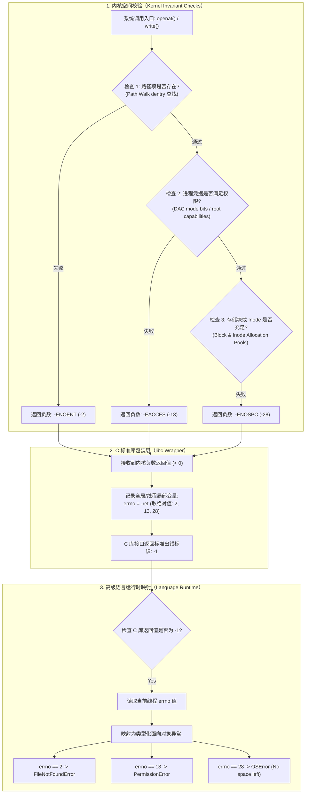
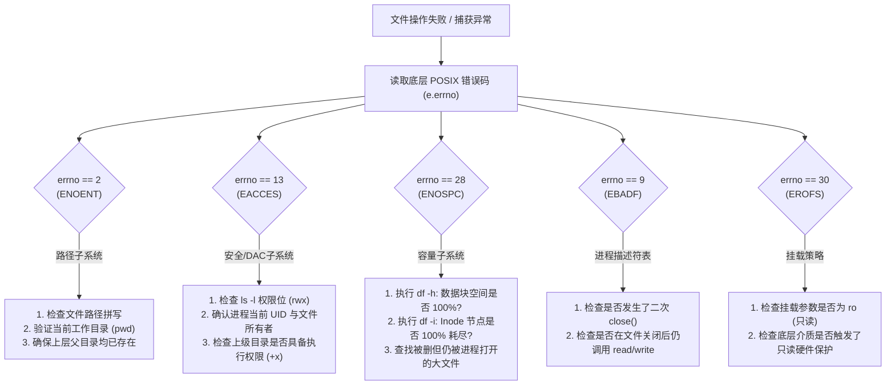

# L08-03｜为什么文件 I/O 会失败：POSIX 错误码分层与安全排障

## 学习者问题

编写程序时，文件操作往往是抛出运行时异常最频繁的地方之一：
- 为什么我的脚本试图打开一个配置文件时，抛出了 `FileNotFoundError: [Errno 2] No such file or directory`？
- 为什么在 Linux 上执行了 `chmod 0444 test.txt` 将文件设为只读，但以管理员（root）身份运行的代码依然能够毫无阻碍地强行写入？
- 为什么磁盘满盘时，写入操作可能并不是立刻抛出异常，而是悄悄地写入了一部分数据（部分写入，Partial Write）？
- 当程序遭遇文件报错时，我们应该如何剥离高级语言异常的外壳，顺着操作系统与 C 标准库的错误号链路，精确定位故障究竟发生在**路径解析层**、**权限安全层**、还是**存储介质容量层**？

## 为什么重要

许多初学开发者在处理文件错误时，容易陷入三种常见的直觉误区：
- **笼统异常误区**：把所有的文件报错都当成同一种“崩溃”，在代码中用宽泛的 `except Exception:` 囫囵捕获，掩盖了底层真正的系统不变式破坏；
- **权限盲从误区**：误以为权限模式位（mode bits，如 `0444`）是全宇宙绝对不可破的法则，不知道超级用户（root）拥有的特权能力可以直接穿透自主访问控制（DAC）；
- **破坏性实验误区**：误以为学习“磁盘空间耗尽（ENOSPC）”，就必须在真实的物理服务器上通过死循环写入把整块系统主盘填到 0 字节剩余，结果导致系统核心守护进程崩溃、日志死锁甚至系统无法开机。

计算系统的健壮性来自于对失败（Failure, EC-CON-010）与规范（Specification, EC-CON-007）的深刻理解。本课将带你建立**操作系统错误码的分层流转模型**，掌握排查路径失效、权限阻断与容量耗尽的精准排障能力。

## 学习目标

完成本课后，你应能：
- **Trace**：追踪系统调用失败的分层流转链条：内核不变式校验失败 $\rightarrow$ 负数返回值 $\rightarrow$ libc 包装器设置线程局部 `errno` $\rightarrow$ 高级语言运行时映射为类型化异常；
- **Diagnose**：能够依据标准 POSIX 错误号（`ENOENT`、`EACCES`、`ENOSPC`、`EBADF`、`EROFS`）准确分类故障发生的系统子系统与破坏的不变式；
- **Observe / Explain**：使用 `labs/foundations/m08/io_failure_fixture.py` 确定性复现 `ENOENT`；理解权限检查的能力门禁（Capability Gating），解释为什么 root 特权可以旁路 `0444` 只读模式位；
- **Trace / Correctness**：理解底层的部分写入（Partial Write）语义，掌握当存储容量在写入过程中耗尽时系统调用与高级语言封装的对应行为；
- **Judge**：在教学与测试中坚持安全防御原则：使用课程拥有的有界容量抽象模型观察 `ENOSPC`，严禁通过破坏性填满宿主机根文件系统的方式进行实验。

## 前置知识

- M06 `L06-01`：系统调用返回值与内核/用户边界；
- M08 `L08-01`：路径查找、目录项与 Inode 索引机制；
- 核心概念复访：**Failure（故障/失败，EC-CON-010）**、**Specification（规范，EC-CON-007）**、**Correctness（正确性，EC-CON-009）**。

---

## Mental Model｜错误传递的三层抽象链路

高级语言（如 Python、Java、Go）抛出的文件异常并不是凭空产生的，它是由底层内核一路逐级向上传递、映射而来的：



### 1. 内核空间：严格的不变式守护
内核在执行任何文件系统相关的系统调用时，必须执行严格的防御性检查：
- **路径解析不变式**：逐级解析路径字符串时，每一级子目录项（dentry）都必须真实存在于父目录的数据中；
- **权限安全不变式**：请求的操作标志（读、写、执行）必须与调用进程的有效凭据（EUID/EGID）及文件的权限位匹配；
- **容量分配不变式**：写入新数据或创建新文件时，文件系统的超级块中必须有可供分配的空闲数据块位图与 Inode 位图。
一旦任何一个检查失败，系统调用立即终止后续所有动作，并向调用者返回对应的**负数错误码（如 `-2`, `-13`, `-28`）**。

### 2. C 标准库：`errno` 的建立
在传统的 POSIX C 接口中，函数返回值通常被用来表示业务结果（例如 `read` 返回读取的字节数）。为了统一表达错误原因，POSIX 规定：
- 当底层系统调用失败时，libc 包装器将负数错误码取正，存入当前线程的局部变量 **`errno`**（定义于 `<errno.h>`）；
- 函数本身统一返回整数 **`-1`**（或指针函数的 `NULL`）。

### 3. 高级语言：面向对象的语义封装
高级语言并不需要程序员每次手动检查 `if res == -1:`。语言运行时拦截到 `-1` 后，读取当前线程的 `errno`，并将其封装为面向对象的异常实例。
例如在 Python 中：
- `errno.ENOENT` (2) $\longrightarrow$ 抛出 `FileNotFoundError`
- `errno.EACCES` (13) $\longrightarrow$ 抛出 `PermissionError`
- `errno.ENOSPC` (28) $\longrightarrow$ 抛出 `OSError`（附带 `e.errno == 28`）

---

## Mechanism｜三大核心故障场景诊断与安全验证

我们使用实验套件中的 `labs/foundations/m08/io_failure_fixture.py`，在受控环境下对三大经典故障进行确定性验证。

```bash
cd labs/foundations/m08
python3 io_failure_fixture.py
```

### 1. `ENOENT`：路径解析失效
当代码试图以只读模式打开一个并不存在的路径时：
```text
[1] Deterministic ENOENT Reproduction:
    -> Status: PASS
    -> Errno: 2 (ENOENT)
    -> Invariant: Path lookup invariant: directory entry lookup failed to find target pathname.
```
- **破损不变式**：内核在自顶向下遍历目录项（Path walk）时，未能找到匹配该文件名的 dentry。
- **排障建议**：检查路径拼写、核对当前工作目录（`pwd` / `os.getcwd()`）、确保路径中的所有上级父目录已经创建。

---

### 2. `EACCES`：权限拒绝与特权穿透认知

权限检查失败会返回 `EACCES`（Permission denied）。但在这里，存在一个极其重要且常年被误解的系统工程边界：

#### 能力门禁（Capability Gating）与 Root 特权
在 Linux/Unix 的自主访问控制（DAC）体系中，文件上的权限位（如 `-r--r--r--` 即 `0444`）用于限制普通用户的读写。
但是，**拥有超级用户权限的进程（`uid=0`，即 root 用户）默认具备内核特权能力 `CAP_DAC_OVERRIDE`**！
- 如果你以普通用户身份运行：尝试写入 `0444` 文件会立刻触发内核的权限检查失败，抛出 `PermissionError`（`errno=13, EACCES`）；
- 如果你是在容器中、或者在 WSL 默认的 root 身份下运行：**内核会完全忽略 `0444` 只读位，直接允许 root 进程覆盖写入！**

在 `io_failure_fixture.py` 中的实测记录：
- **以 Root 身份运行时**：
  ```text
  [2] Capability-Gated EACCES Handling:
      -> Status: SKIP (ENVIRONMENT-LIMITED)
      -> Reason: Process is running as root (euid=0). On POSIX systems, root processes possess CAP_DAC_OVERRIDE and bypass standard read-only (0444) file mode bit enforcement. Live EACCES reproduction requires an unprivileged execution context.
  ```
- **以非特权普通用户（如 `zhr`）运行时**：
  ```text
  [2] Capability-Gated EACCES Handling:
      -> Status: PASS (REPRODUCED)
      -> Errno: 13 (EACCES)
  ```
- **实验规范原则**：当实验在特权环境下运行时，测试套件必须如实输出 `ENVIRONMENT-LIMITED` 处置，清晰阐释特权穿透机制，切勿做出“任何环境只要 chmod 0444 就必然报错”的虚假断言。

---

### 3. `ENOSPC` 与部分写入（Partial Write）的安全建模

当存储介质写满时，操作系统内核返回 `ENOSPC`（No space left on device）。

#### 绝对红线：严禁对宿主机根文件系统进行破坏性填满
在真实系统实验中，**绝对禁止编写死循环写入代码去填满主机的根磁盘（`/`）**！
如果宿主机根文件系统被写到 0 字节：
- 系统日志服务（systemd-journald）将无法记录日志并发生死锁；
- 数据库、网络守护进程因无法分配临时锁文件而崩溃退出；
- 图形界面与 SSH 服务可能无法分配套接字会话，导致用户被锁在系统之外。

#### 课程拥有的有界容量模型（Bounded Capacity Abstraction）
为了让学习者安全、真实地观察容量枯竭，我们在实验套件中构建了有界的内存抽象模型（`BoundedSpaceWriter`）。它在完全不触碰宿主机物理存储的前提下，100% 精确复现了底层的 POSIX 行为：

```text
[3] Bounded Safe ENOSPC & Partial Write Model:
    -> Evidence Type: DETERMINISTIC_MODEL_EVIDENCE
    -> Capacity: 512 bytes
    -> Chunk 1 accepted: 384 bytes
    -> Chunk 2 requested: 256 bytes, accepted: 128 bytes (Partial Write!)
    -> Subsequent write raised ENOSPC: True (errno=28)
    -> Host safety: No host filesystem filled; strictly bounded course-owned in-memory model
```

#### 关键机制：部分写入（Partial Write）
POSIX 规范对 `write(2)` 的定义非常精巧：
`ssize_t write(int fd, const void *buf, size_t count);`
- 当你请求写入 256 字节，但设备只剩下 128 字节空间时，底层系统调用**不会立刻报错**！而是会成功写入 128 字节，并返回正整数 `128`；
- 直到下一次应用程序再次尝试调用 `write()` 时，发现剩余空间为 0，系统调用才返回 `-1` 且设置 `errno = ENOSPC`；
- **高级语言封装差异**：像 Python 的 `file.write()` 这样的高级 API，其底层会循环调用 `write(2)`。当遭遇部分写入后，后续调用触发异常并抛出。这意味着**在异常抛出之前，文件里已经残留了前面成功写入的部分数据**！开发者必须意识到这种半写入状态的存在。

---

## Diagnostic Triage｜文件 I/O 故障排查决策树



---

## Checkpoint Investigation

### Question
某云服务器上运行着一个定时爬虫数据抓取脚本。某天清晨脚本开始大面积报错并崩溃：
`OSError: [Errno 28] No space left on device`。
值班工程师立即登录服务器，执行了系统常规检查命令：
```bash
$ df -h /data
Filesystem      Size  Used Avail Use% Mounted on
/dev/vdb1       500G  180G  320G  36% /data
```
监控命令清晰地表明：该分区还有超过 300 GB 的巨大空闲磁盘空间！
值班工程师百思不得其解：“明明磁盘利用率只有 36%，还有 300 多 GB 空间，为什么写入文件还会坚决报错 ENOSPC（空间不足）？”

请根据本课所学的文件系统双重容量不变式，指出故障根本原因，并给出验证该猜想的精确 Linux 命令。

<details>
<summary>Hint 1</summary>
回顾文件系统的元数据架构：除了存放数据字节的“数据块（Data Blocks）”之外，文件系统还需要为什么对象预先分配索引结构？
</details>

<details>
<summary>Hint 2</summary>
思考 <code>df -h</code> 统计的是什么容量？要统计文件系统中 Inode 结构的数量消耗，应该给 <code>df</code> 命令传递什么参数？
</details>

<details>
<summary>Expected Observation</summary>
出现该现象通常是因为该分区上的 <strong>Inode 节点总数被完全耗尽</strong>。
在很多传统文件系统（如 ext4）格式化时，能够创建的最大文件数量（Inode 总数）是固定的。如果爬虫脚本生成了数千万个极其微小的文件（每个文件只有几十字节），即使物理数据块还剩 300 GB，但 Inode 已经分配殆尽。当尝试创建新文件时，内核无法分配新 Inode，同样会返回 <code>ENOSPC</code>。
验证命令为：<code>df -i /data</code>。
</details>

<details>
<summary>Full Explanation</summary>
这是一个在真实生产环境中屡见不鲜的经典故障案例。

<strong>容量不变式的双重维度：</strong>
在经典文件系统中，创建并保存一个新文件必须同时满足两个独立的不变式：
1. <strong>数据空间充足</strong>：存在空闲的磁盘数据块用于存放内容；
2. <strong>元数据空间充足</strong>：存在空闲的 Inode 节点用于记录文件的元数据、权限和物理块索引。

<strong>原因深入推导：</strong>
爬虫或微服务往往会产生极其庞大的微小碎片文件（例如小图片、短文本、临时 session 缓存）。虽然 1000 万个 100 字节的小文件仅仅占用不到 1 GB 的磁盘数据块，但它们消耗了整整 1000 万个独立的 Inode 编号！
当该文件系统规划的 Inode 总量耗尽时（<code>df -i</code> 显示 <code>IUse% 100%</code>），内核尝试为新文件分配 Inode 的操作必然失败。按照 POSIX 规范，不管是缺少数据块还是缺少 Inode，系统调用都会返回统一的 <code>ENOSPC</code> 错误码。

<strong>排查与根治方法：</strong>
1. <strong>精准验证</strong>：执行 <code>df -i /data</code>，观察 <code>IFree</code> 是否为 0，<code>IUse%</code> 是否为 100%；
2. <strong>应急清理</strong>：找出存放大量微小碎片文件的目录并进行批量清理或归档压缩；
3. <strong>架构防御</strong>：对于高频微小碎片的业务场景，应避免单机海量小文件散落存储，应改用打包聚合存储（如预写日志、合并块存储）或改用动态分配 Inode 的现代文件系统（如 XFS、Btrfs）。
</details>

---

## Common Misconceptions

- **“文件操作失败只是代码里的语法 Bug。”** 错。文件 I/O 失败大多是由于外部环境的不变式（路径存在性、安全权限、硬件容量）被破坏导致的系统级状态反馈。
- **“磁盘写满时，程序必然直接抛出异常，不会有任何数据进入文件。”** 错。底层系统调用支持部分写入（Partial Write），在容量耗尽前已经成功接收的字节会合法保留在文件中。
- **“只要执行了 `chmod 0444`，任何程序试图写入都必然报错 `EACCES`。”** 错。以 root（UID 0）特权运行的进程拥有 `CAP_DAC_OVERRIDE`，会直接绕过普通文件模式位检查完成强行写入。
- **“要想测试磁盘写满错误，必须把自己的物理电脑硬盘写到 0 字节。”** 错。这是极其危险的破坏性行为，极易导致操作系统守护进程崩溃死锁。应当使用有界的内存抽象模型进行安全模拟。
- **“所有文件报错都继承自同一个抽象，不需要区分细化处理。”** 错。处理 `ENOENT`（重试或引导用户创建）与处理 `ENOSPC`（报警清理）的恢复逻辑截然不同，必须基于错误码精准分流。
- **“`errno` 是某种高级语言独有的关键字。”** 错。`errno` 是 POSIX C 标准库定义的系统级错误接口，高级语言异常只是对底层 `errno` 的翻译和对象化包装。

## What You Can Ignore—for Now

- Linux 系统 Quota 配额子系统在内核中的网关通信协议；
- SELinux / AppArmor 等强制访问控制（MAC）标签安全策略与 AVC 审计日志排查；
- 网络文件系统（NFS/CIFS）由于网络断开导致的 `ETIMEDOUT` 与锁租约丢失处理。

## Exit Criteria

- 能够清晰讲出从内核检查失败、C 库设置 `errno` 到高级语言异常的分层流转过程；
- 能够准确阐明 root 特权旁路自主访问控制（`0444`）的底层原理，并能在不同环境下给出合规的测试处置；
- 能够理解部分写入机制；在面对“磁盘还剩几百 GB 却报错 ENOSPC”的经典故障时，能够第一时间联想到 Inode 耗尽并给出 `df -i` 诊断命令。

## Competency Mapping

- **Primary**: **Diagnose** (利用错误码分层机制精准诊断路径、权限、容量故障)
- **Growth**: **Observe** (在真实与受控抽象环境中观测错误码), **Explain** (解释特权穿透与部分写入机制)

## Provenance

- **POSIX.1-2024 (IEEE Std 1003.1-2024)**: Base Definitions §2.3 (Error Numbers: `<errno.h>`), System Interfaces: `open(2)`, `write(2)`, `stat(2)`.
- **Linux man-pages**: `errno(3)`, `capabilities(7)`, `path_resolution(7)`.
- **OSTEP (Operating Systems: Three Easy Pieces)**: Chapters 39 & 40.
