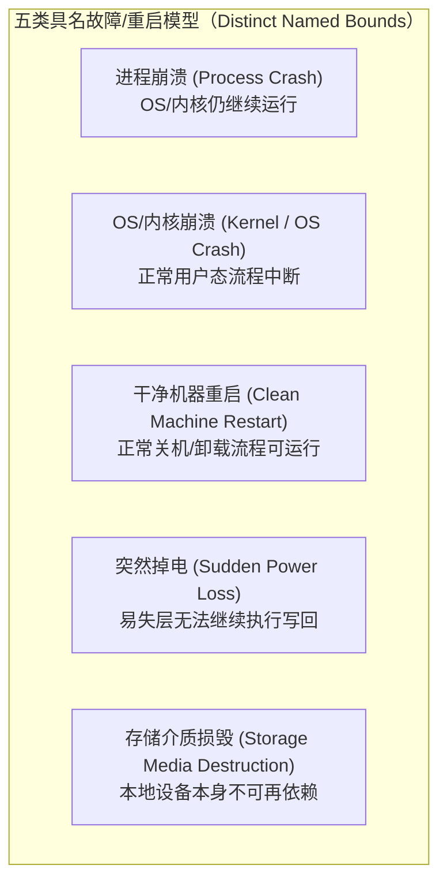
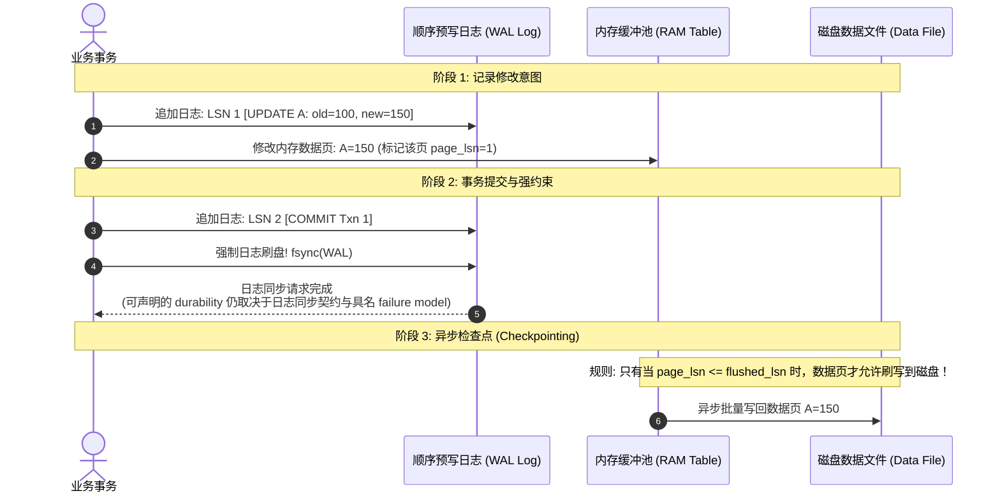

# L09-01｜持久性究竟意味着什么：故障模型、同步边界与预写日志

## 学习者问题

在日常软件开发中，我们几乎每天都在处理数据的“保存”：
用户在界面点击“保存”，后端代码调用 `db.commit()` 或 `file.write()`；在终端输入 `ls`，文件赫然在列。

**在什么时刻，我们才能问心无愧地向用户宣称“你的数据绝对安全了”？** 如果此时机房的变压器爆炸瞬间断电，刚刚写入的数据究竟还在不在？操作系统里的 `fsync()` 究竟跨越了哪几道防线？为什么数据库系统必须先写一份看似重复冗余的“日志”（WAL）才敢修改真正的数据表？

## 为什么重要

在系统工程与存储领域，“数据持久”往往是误解最多、事故最惨烈的重灾区：
- **存盘即安全误区**：误以为只要代码执行了 `write()` 或看到文件存在于目录树中，数据就具备了免疫一切故障的能力；
- **同步万能误区**：误以为调用一次 `fsync()` 就是对事务完整性的终极保证，甚至将 `fsync` 当作备份或容灾的替代品；
- **名称混淆误区**：把“持久性（Durability）”与“可用性（Availability）”、“备份（Backup）”或“多副本复制（Replication）”混为一谈；
- **日志迷信误区**：误以为系统只要包含了“预写日志（WAL）”，就能天然获得持久性，忽视了日志本身的物理落盘时机与崩溃恢复契约。

要建立现代分布式存储与数据库系统的严谨世界模型，必须跨过从“将数据写进文件”到**在具名故障模型下推演持久性边界**的核心认知跃迁。本课将正式确立存储领域的基石概念：**Durability（持久性，EC-CON-016）**。

## 学习目标

完成本课后，你应能：
- **Explain**：准确给出 **Durability（持久性，EC-CON-016）** 的规范定义，并能够为任何存储方案**显式命名其容忍的故障界限（Named Failure Bound）**；
- **Trace**：清晰追踪数据从应用程序缓冲区到物理介质跨越的 5 个潜在检查点，并指出 `write()`、`flush()`、`fsync()`、`fdatasync()` 各自的作用边界；
- **Diagnose**：解释为什么创建或重命名文件时，仅对文件描述符执行 `fsync` 无法保证新目录项的掉电安全，指出必须对父目录描述符同步的底层机制；
- **Judge**：从延迟开销与数据丢失窗口（Data Loss Window）的权衡出发，使用 `labs/foundations/m09/durability_observer.py` 的实测原始时延样本，评估高频即时同步与周期性批量同步的适用场景；
- **Trace / Explain**：基于 `labs/foundations/m09/wal_model.py`，阐述预写日志（WAL）作为“定序与恢复机制”的核心原理，严格推演日志先行不变式（`page_lsn <= flushed_lsn`）以及基于分析（Analysis）、重做（Redo）、撤销（Undo）的崩溃恢复全过程。

## 前置知识

- M08 `L08-01`：文件描述符、目录项与 Inode 的生命周期；
- M08 `L08-02`：用户态缓冲与操作系统内核页缓存（Page Cache）的分层模型；
- 核心概念复访：**Trade-off（权衡，EC-CON-006）**、**Failure（故障，EC-CON-010）**、**Interface（接口，EC-CON-005）**。

---

## Mental Model｜核心概念定义：持久性与具名故障模型

> ### 核心概念定义（First Home: EC-CON-016）
> **Durability（持久性）**：已提交的状态能够在**具名的重启或故障界限（Named Restart or Failure Bound）**内留存。
>
> **边界警示（What it is NOT）**：
> - 持久性 **不等于** “写入了一个文件”（M08 已建立边界：普通 buffered `write()`/runtime `flush()`/`close()` 成功，本身不足以证明数据已满足某个掉电持久性要求）；
> - 持久性 **不等于** 备份（备份解决人为误删、介质物理腐蚀或灾难恢复，持久性解决提交状态在特定故障下的存活）；
> - 持久性 **不等于** 高可用（可用性关注系统是否随时可响应，持久性关注数据是否在故障后不被抹去）；
> - 持久性 **不等于** 多副本复制（如果向 3 个节点发送写入但全都没有落盘，瞬间全机房停电依然会导致数据彻底蒸发）。

### 核心铁律：脱离“具名故障界限”，谈论持久性毫无意义

工程师在宣称“系统已具备持久性”时，必须立即指明：**它承诺在哪一种失败/重启模型下存活？**

下面五类是课程要求学习者区分的**不同 failure bounds**，不是严格的强弱全序。尤其“干净重启”依赖正常关机流程，而“内核崩溃”和“突然掉电”属于不同执行路径，不能简单画成一级一级递增的同一标尺。



- **场景 A**：若应用已把数据推进到仍存活的 OS/文件系统缓冲状态，随后只有该进程崩溃，则这些内核态状态**可能继续存在并被后续写回**。这支持“进程崩溃”这一较窄 failure bound；它不是对后续 OS 崩溃或掉电的承诺。
- **场景 B**：若相关修改尚未按所需同步契约跨越易失层，突然掉电后这些修改**可能丢失**。不能由此前的 `write()`/`flush()` 返回值推断唯一掉电结果。
- **场景 C**：即使某次 `fsync()` 在特定 OS/文件系统/设备栈上成功完成，也只能结合**该栈的同步契约与具名 failure model**判断可声明的持久性；它不保护“本地介质完全损毁”这类 failure bound。

**结论**：任何严谨的持久性声明，必须同时包含两部分：**状态承诺** 与 **具名界限**。

---

## Mechanism｜写入与同步的检查点链路

数据从应用状态走向某个具名 failure model 下可接受的持久层，会经过一系列可能存在的缓冲区与检查点：


> **注意图中的问号（?）**：确切的检查点、板载缓存策略与同步语义取决于具体的操作系统、文件系统配置和硬盘控制器硬件。`flush()` 与 `fsync()` 是特定抽象层的接口契约，**绝非能够瞬间无条件穿透所有物理硬件的魔法箭头**。

### 1. `fsync(fd)` 与 `fdatasync(fd)` 的契约边界
- **`fsync(int fd)`**：POSIX 要求它请求把该 open file descriptor 对应文件的数据推进到 synchronized I/O completion state；Linux 还会同步与该文件关联的元数据，并等待设备报告该同步动作完成。这里的“存储设备/完成”语义依实现与存储栈契约而定，不能简化成“某字节已经物理写进 NAND 颗粒”。
- **`fdatasync(int fd)`**：与 `fsync` 类似，但可省略那些**不影响后续数据读取正确性**的元数据；例如 `st_atime`/`st_mtime` 通常不必因此同步，而文件大小 `st_size` 这类影响后续读取的数据相关元数据则需要同步。

### 2. 文件数据与目录项持久性的不同同步对象
许多开发者在代码中这样做：
```python
# 致命错误范例
with open("/var/data/new_order.json", "w") as f:
    f.write(data)
    f.flush()
    os.fsync(f.fileno())  # 以为高枕无忧了！
```
**Linux 接口边界**：对文件 fd 调用 `fsync()` **并不必然保证包含该文件的目录项也已到达持久存储**。文件名与文件身份的关联属于父目录的目录项语义；Linux VFS 的 `dentry` 是内存中的路径查找/缓存对象，不能直接与某个文件系统的磁盘目录项编码画等号。

因此，如果应用的具名 failure model 要求“新名字/重命名结果在崩溃或掉电后仍可通过路径解析”，就需要把**相关目录本身**纳入同步协议。具体失败后会呈现“名字缺失、旧名字仍在、目标替换未持久”等哪一种结果，取决于文件系统与操作顺序，不能把它固定描述成必然产生某种 orphan inode。

**Linux 上的常见严格做法**：对于新建/删除/重命名等会修改目录项的操作，如果你的 failure model 要求目录项本身也具备崩溃/掉电后的可恢复承诺，就显式同步**发生目录项变化的目录 fd**。新建文件通常涉及文件本身 + 父目录；同目录 rename 需要同步该目录；**跨目录 rename 则要分别考虑源父目录与目标父目录**。目录 `fsync()` 支持与语义仍属于 OS/文件系统接口能力，错误必须如实处理。
```python
# 工业级标准落盘流程
fd = os.open("/var/data/new_order.json", os.O_WRONLY | os.O_CREAT | os.O_TRUNC, 0o644)
os.write(fd, data)
os.fsync(fd)
os.close(fd)

# Linux 示例：同步发生目录项变化的父目录
flags = os.O_RDONLY | getattr(os, "O_DIRECTORY", 0)
dir_fd = os.open("/var/data", flags)
os.fsync(dir_fd)
os.close(dir_fd)
```

---

## Observation｜测量同步开销与时延分布

我们使用实验套件中的 `labs/foundations/m09/durability_observer.py`，在宿主机上测量普通缓冲写与调用 `os.fsync` 的原始耗时。

```bash
cd labs/foundations/m09
python3 durability_observer.py
```

宿主机实测记录：
```text
=== Essential CS M09 — Durability Observer (L09-01) ===
[1] Canonical Concept: EC-CON-016 Durability (持久性)
    First Home: M09 / L09-01
    Definition: "A committed state survives a named restart or failure bound."
    Named Bounds: process_crash, kernel_panic_os_crash, clean_machine_restart, sudden_power_loss, storage_media_destruction

[2] Bounded Raw Latency Measurement (50 records x 64 B, 5 trials):
    -> Logical Payload: 3200 bytes per trial
    -> Buffered Mean:   0.3165 ms
    -> Synced Mean:     240.5093 ms
    -> Sync Calls Made: 250 (expected 250)
    -> Note: Observed raw timing reflects this specific host, kernel, filesystem, and device load. Essential CS strictly forbids asserting a universal latency ratio or claiming fsync must always be slower by a fixed constant factor.

[3] File vs Directory Metadata Synchronization:
    -> File data synced: True
    -> Parent dir synced: True
```

### 关键数据与推导边界：
1. **开销溯源**：在当前测试环境下，纯缓冲写入 50 条小记录均值约 0.32 毫秒，而每写一条记录就调用一次 `fsync` 均值耗时达 240 毫秒。这是因为每次 `fsync` 都迫使 CPU 暂停执行，等待操作系统完成排队并将落盘信号发送给驱动控制器；
2. **严禁将比例当定律**：在带有非易失缓存（如板载带电容持久化写缓存的 RAID 控制器）或高性能企业级 NVMe 上，`fsync` 开销可能只有数十微秒；在普通机械硬盘上可能需要十几毫秒。**实测数据是宿主机环境的经验事实，绝非全宇宙统一的固定比例常数**。

---

## Mechanism｜预写日志（WAL）的核心原理

如果每次修改主数据文件（如 B+ 树或海量表文件）都要调用 `fsync`，不仅会引发全盘随机写碎片，还会导致系统吞吐断崖式下跌。此外，若在一个涉及修改多个数据块的复杂事务执行到一半时发生断电，磁盘上就会残留**半写、撕裂的毁损状态**。

为了允许数据页采用 no-force/steal 等策略，同时仍能在崩溃后恢复出满足事务语义的状态，数据库广泛采用 **Write-Ahead Logging（WAL，预写日志）**。WAL 的核心首先是**顺序约束 + 恢复信息**；追加式日志在很多介质/工作负载上也具有性能优势，但“WAL = 把所有随机 I/O 都变成顺序 I/O”不是它的通用定义。



### 1. 日志先行不变式（Write-Ahead Invariant）
$$\text{page\_lsn} \le \text{flushed\_lsn}$$
在这里把 `flushed_lsn` 定义为“**已经按本模型的日志同步契约进入稳定日志存储的最大 LSN**”。在数据页写入其持久副本之前，必须满足 `page_lsn <= flushed_lsn`：也就是**描述该页最新修改所需的 WAL 至少已经先进入稳定日志存储**。这正是 Write-Ahead 约束。

若违反该约束，数据页可能先暴露出一个没有对应稳定恢复信息的修改，恢复算法的前提就被破坏。课程不把后果固定写成“数据库必然彻底破损”；真正可见结果取决于引擎、页写原子性和恢复设计。

### 2. ARIES 风格崩溃恢复（Crash Recovery）
当机器在任何随机时刻意外掉电重启后，存储引擎读取持久化的 WAL 日志，启动三阶段恢复过程：
1. **分析阶段（Analysis）**：从最近一次检查点（Checkpoint）正向扫描日志，识别出在断电瞬间：
   - 哪些事务已经写入了 `COMMIT`（已提交事务）；
   - 哪些事务只有 `BEGIN` / `UPDATE` 但未见 `COMMIT`（活跃未提交事务，在断电瞬间被强行打断）。
2. **重做阶段（Redo）**：真正的 ARIES 采用 **repeat history** 思路：从 redo 起点重演需要重做的历史更新，**其中可以包括崩溃时尚未提交事务的更新**，并利用 pageLSN 等信息避免重复应用已经在页上的更新；
3. **撤销阶段（Undo）**：随后对 loser transactions 执行逻辑撤销，并记录补偿日志（CLR）。本课有界模型只演示“已提交更新重建 + 未提交更新撤销”的核心直觉，**不是完整 ARIES 实现**。

### 3. 边界纠偏：不要神化 WAL
- **WAL 本身并不产生持久性**。仅把日志字节交给普通 buffered I/O，而没有满足该系统对“日志稳定存储”的同步协议，就不能据此声明突然掉电后的日志仍存在。
- WAL 的核心贡献是**把恢复所需的信息与写入顺序约束显式化**，使数据页不必在每次提交时都强制写回。日志通常采用追加式布局，因此在很多设备上更容易被批处理/顺序化，但实际性能收益取决于介质、控制器、文件系统、并发与 group commit 等因素。

---

## Checkpoint Investigation

### Question
某核心支付交易系统设计了一项持久化策略：
“每当处理一笔充值交易时，由于底层数据库采用了 WAL 机制，系统在将日志记录 `append` 到本地日志文件后，为了追求每秒 10 万次的高并发，**不调用 `fsync`**。架构师声称：‘因为我们使用了 WAL 预写日志技术，即使断电，WAL 的重做日志也能保证 100% 不丢数据。’”

请结合本课所学的具名故障模型与 WAL 机制，严厉指出该架构师声明中的逻辑谬误，并给出兼顾安全与性能的“组提交（Group Commit）”演进方向。

<details>
<summary>Hint 1</summary>
思考 <code>append</code> 写入文件后，数据首先落在了计算机的哪个硬件层级？如果不调用同步命令，它能否抵御“意外掉电（Sudden Power Loss）”故障？
</details>

<details>
<summary>Hint 2</summary>
WAL 是如何获得持久性承诺的？如果很多并发事务都在排队落盘，是否可以通过将多个事务的日志合并为一次 <code>fsync</code> 来平衡吞吐？
</details>

<details>
<summary>Expected Observation</summary>
该架构师的言论是完全荒谬的。仅仅调用 <code>append</code> 而不执行 <code>fsync</code>，WAL 日志记录仍然驻留在易失性的操作系统内核页缓存中。当发生意外掉电时，未落盘的日志记录全部蒸发。没有持久的日志记录，重启恢复算法根本无从重放，已向用户承诺成功的交易数据必然灭失。
WAL 无法凭空创造持久性。要兼顾高并发，正统解决方案是<strong>组提交（Group Commit）</strong>：多个并发事务的日志在用户缓冲区合并，由一个代表线程统一执行一次 <code>fsync</code>。
</details>

<details>
<summary>Full Explanation</summary>
这是典型的“迷信技术名词而忽视物理契约”的架构惨案。

<strong>1. 致命谬误分析：</strong>
WAL（预写日志）是一套<strong>定序与崩溃恢复算法</strong>，它不是超越物理硬件的黑魔法。
当代码调用 <code>f.write(wal_record)</code> 时，字节只是拷贝到了内存中的操作系统页缓存。在具名的“意外掉电（Sudden Power Loss）”故障模型下，易失性 RAM 的电容放电，内存数据彻底灭失。
当服务器重启时，恢复引擎在物理磁盘上根本找不到这笔交易的日志记录，因此该交易就像从未发生过一样被凭空抹去。宣称“不执行 fsync 的 WAL 也能保证掉电不丢数据”完全背离了计算机科学的物理常识。

<strong>2. 工业级兼顾方案：组提交（Group Commit）</strong>
如果每个事务单独调用 <code>fsync</code>，单机 TPS 会被磁盘寻道与刷新延迟卡在每秒几百到几千次。现代高性能存储引擎（如 MySQL InnoDB、PostgreSQL）采用组提交机制：
1. 允许并发事务将各自的日志条目先追加到共享的日志缓冲区中；
2. 当第一个事务准备执行 <code>fsync</code> 时，后续到达的若干并发事务并不各自发起独立的系统调用，而是挂起等待；
3. 第一个事务发起一次 <code>fsync</code>，<strong>一次性将缓冲区中累积的十几个或上百个事务的日志同时同步到物理介质上</strong>；
4. <code>fsync</code> 完成后，批量唤醒所有参与组提交的事务，并向所有客户端返回成功。
通过批量合并同步（Batching + Amortized Sync），既守住了意外掉电模型下的绝对持久性底线，又大幅降低了系统调用与硬件刷盘开销。
</details>

---

## Common Misconceptions

- **“只要代码调用了 `write()` 且返回了 0，数据就是掉电持久的。”** 错。普通写入只进入易失性内核页缓存，断电立刻丢失。
- **“`close()` 可以替代 `fsync()` 提供持久性。”** 错。`close()` 只是释放文件描述符并冲刷语言内部缓冲区，绝不会发出物理硬件落盘指令。
- **“只要调用了 `fsync(file_fd)`，新创建的文件就 100% 安全了。”** 错。新文件的文件名与 Inode 的映射记录在父目录中，必须同时对父目录描述符调用 `fsync`，否则断电可能丢失目录项。
- **“`fsync` 是备份的替代品。”** 错。`fsync` 只能抵御本机断电或崩溃；如果硬盘发生物理磨损坏道、火灾烧毁或人为误删，必须依靠异地冷热备份。
- **“采用了多副本复制（Replication）就完全不需要本地 `fsync` 了。”** 错。如果一个机房同时断电或雷击，内存中未落盘的数据在所有副本节点上会同时蒸发。
- **“数据写进了 WAL 文件就天然持久了。”** 错。WAL 必须在事务确认前完成日志文件的同步（`fsync` 或 O_SYNC），否则未落盘的日志在断电时同样荡然无存。

## What You Can Ignore—for Now

- 带有超级电容保护的硬件 RAID 控制器（BBU / Flash-Backed Write Cache）的硬件微码配置；
- ARIES 算法中复杂的补偿日志记录（CLR, Compensation Log Record）嵌套级联撤销回滚；
- 复杂的数据库混合页面缓存置换算法（如 2Q、CLOCK-Pro）。

## Exit Criteria

- 能够默写并说出 **EC-CON-016 Durability** 的标准定义：“已提交的状态能够在具名的重启或故障界限内留存”；
- 能列举至少 4 种不同的具名故障界限（进程崩溃、内核崩溃、机器重启、意外掉电、介质损毁），并能准确指出针对每种故障界限所需要的系统机制；
- 能够清晰画出从用户缓冲区到物理介质的 5 步流水线，指出新文件同步父目录的必要性；
- 能够解释 WAL 的日志先行不变式（`page_lsn <= flushed_lsn`），阐明为什么不落盘的 WAL 无法提供掉电持久性保证。

## Competency Mapping

- **Primary**: **Judge** (在具名故障模型下权衡持久性保证与 I/O 延迟开销，评估同步策略)
- **Growth**: **Explain** (解释 WAL 机制与故障层级), **Diagnose** (诊断未同步父目录或伪持久化导致的断电破损)

## Provenance

- **POSIX.1-2024 (IEEE Std 1003.1-2024)**: `fsync(2)`, `fdatasync(2)`, `open(2)`, `write(2)`.
- **C. Mohan et al. (IBM Research)**: *ARIES: A Transaction Recovery Method Supporting Fine-Granularity Locking and Partial Rollbacks Using Write-Ahead Logging* (ACM TODS, 1992).
- **Thanumalayan Sankaranarayana Pillai et al. (UW-Madison)**: *All File Systems Are Not Created Equal: On the Complexity of Crafting Crash-Consistent Applications* (OSDI '14).
- **OSTEP (Operating Systems: Three Easy Pieces)**: Chapters 42 & 43 (Crash Consistency: FSCK and Journaling).
