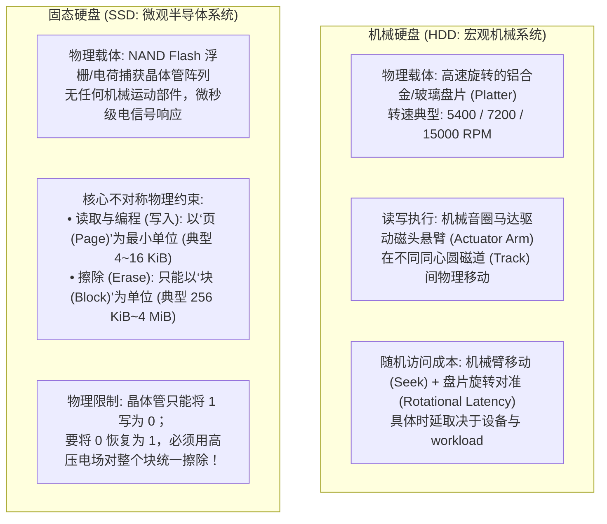
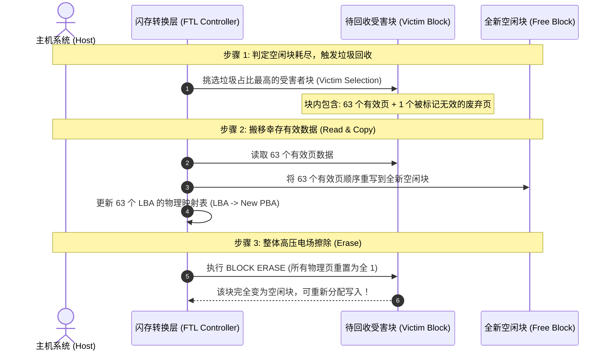

# L09-02｜机械硬盘与固态硬盘的物理分野：寻道、擦除块与写入放大

## 学习者问题

在购买云服务器或组装开发机时，我们常常看到不同类型的磁盘选项：机械硬盘（HDD）、SATA SSD、NVMe SSD。
在直觉中，许多初学者往往把固态硬盘（SSD）简单理解为“速度飞快、没有机械马达的超大内存”。

**为什么机械硬盘（HDD）与固态硬盘（SSD）会因为不同物理机制而表现出不同的读写与耐久特征？** 为什么 workload 的顺序性/随机性会改变性能与内部写入压力？什么是“写入放大”（Write Amplification）？一块标称 600 TBW 的 SSD，真的会在累计写入第 600 TB 的那一秒准时失效吗？

## 为什么重要

如果不理解存储介质底层的物理约束，软件工程师极易写出灾难性的存储逻辑：
- **随机更新导致固态硬盘早夭**：由于误认为 SSD 像 RAM 一样可以“就地覆盖（In-place Overwrite）”，频繁执行海量微小随机写入，导致 SSD 控制器陷入高强度的垃圾回收与写入放大，提前耗尽闪存颗粒擦写寿命；
- **机械寻道成本误判**：随机访问会引入 seek/rotation 机械定位成本；实际延迟与吞吐取决于具体 HDD、队列、缓存、请求大小与 workload，不能把某个毫秒/IOPS 数值当作所有机械盘的常数；
- **寿命指标绝对化误区**：将厂商公布的 TBW（Terabytes Written）当作精确的死亡倒计时，忽视了访问模式、温度、静态磨损均衡与保留空间（Over-provisioning）对物理介质寿命的决定性影响。

要做出具备独立技术判断力的存储引擎设计与硬件选型，必须从物理机制层面穿透两类介质的核心工作原理。

## 学习目标

完成本课后，你应能：
- **Explain**：从物理结构层面对比机械硬盘（主轴、磁头悬臂、盘片磁道）与固态硬盘（半导体 NAND Flash 颗粒、浮栅/电荷捕获晶体管）的本质区别；
- **Trace**：准确复述 NAND 闪存“**按页读取/编程，按块整体擦除**”的物理不对称性，推导**异地更新（Out-of-place Update）**与**闪存转换层（FTL）**的地址重映射机制；
- **Explain / Trace**：基于 `labs/foundations/m09/media_model.py`，完整追踪 SSD 块内页面失效（Invalidation）、垃圾回收（Garbage Collection）与整块擦除重写的全流程；
- **Estimate / Judge**：严谨定义并计算**写入放大系数（$\text{WAF} = \frac{\text{写入闪存的字节数}}{\text{主机写入的字节数}}$）**，在具名模型下评估数据局部性（Locality）对系统性能与介质寿命的深远影响；
- **Judge**：辨析 JEDEC JESD218/JESD219 下的 SSD endurance rating / workload verification 与厂商 TBW 标称、保修政策和真实物理寿命之间的推论界限。

## 前置知识

- M04 `L04-02`：空间局部性与时间局部性（Locality）；
- M08 `L08-01`：块层设备抽象与系统 I/O；
- 核心概念复访：**Locality（局部性，EC-CON-012）**、**Trade-off（权衡，EC-CON-006）**、**Representation（表示，EC-CON-003）**。

---

## Mechanism Contrast｜两类物理介质的微观世界

操作系统通过统一的块设备接口（LBA，Logical Block Addressing，逻辑块寻址）将磁盘抽象为一个扁平的“线性扇区数组”。然而，在这层优雅的统一抽象之下，机械硬盘与固态硬盘遵循着完全不同的物理定律：



### 1. 机械硬盘的物理现实：寻道是吞吐量的死敌
在机械硬盘中，读取一个 4 KB 扇区的时间由三部分组成：
$$T_{\text{总延迟}} = T_{\text{寻道（Seek）}} + T_{\text{旋转（Rotational）}} + T_{\text{传输（Transfer）}}$$
- **寻道时间（Seek Time）**：音圈马达推动悬臂寻找到目标磁道，通常耗时 3 ~ 9 ms；
- **旋转延迟（Rotational Latency）**：等待盘片旋转将目标扇区转到磁头下方。对于 7200 RPM 硬盘，旋转半周平均耗时 $\frac{60}{7200 \times 2} \approx 4.17\text{ ms}$；
- **传输时间（Transfer Time）**：在本课 `media_model.py` 的**示例参数**（180 MB/s、4 KiB）下，纯传输项约为 0.02 ms；这只是模型输入推导，不是 HDD 通用常数。

**本课模型结论**：给定模型参数（7200 RPM、平均 seek 8.5 ms、传输率 180 MB/s），随机小 I/O 的估算延迟主要由 seek + rotation 构成，模型得到约 78.8 IOPS；顺序访问则可减少这些机械定位开销。**这些数字只是 `ILLUSTRATIVE MODEL EVIDENCE`，不是对所有 HDD 的固定延迟、IOPS 或吞吐常数。**

---

## Mechanism｜SSD 闪存转换层（FTL）与异地更新

SSD 内部由主控芯片、DRAM 缓存和多个 NAND Flash 颗粒构成。NAND 颗粒的物理特性带来了一个残酷的硬件约束：**无法像 RAM 或磁道那样就地覆盖写入（Cannot overwrite in place）**。

### 1. 异地更新（Out-of-place Update）
如果主机想要修改某个 LBA 的数据，闪存晶体管无法直接覆盖旧数据。固态硬盘必须：
1. 在某个具有空闲页的擦除块中，分配一个新的物理页（Physical Page）；
2. 将新数据写入新物理页；
3. **将旧物理页标记为“无效（Invalid）”**；
4. 更新主控内部的映射表（LBA $\rightarrow$ 新 PBA）。

### 2. 垃圾回收（Garbage Collection, GC）与块擦除
随着大量随机写入的进行，闪存中会积攒大量标记为“无效”的废弃页面。然而，这些无效页无法直接被再次写入，直到整个块被**擦除（Erase）**。
当空闲块不足时，SSD 主控启动垃圾回收（GC）：



---

## Calculation & Observation｜写入放大系数（WAF）模型

我们使用实验套件中的 `labs/foundations/m09/media_model.py`，运行有界模型计算：

```bash
cd labs/foundations/m09
python3 media_model.py
```

终端输出记录（标注为 **ILLUSTRATIVE MODEL EVIDENCE**）：
```text
=== Essential CS M09 — Storage Media Model (L09-02) ===

[1] HDD Mechanical Latency Model (7200 RPM, 4 KiB):
    -> Random I/O:     Seek=8.5 ms, Rot=4.17 ms => Total=12.6884 ms (~78.8 IOPS)
    -> Sequential I/O: Seek=0.0 ms, Rot=0.00 ms => Total=0.0217 ms

[2] SSD Flash Translation & Write Amplification Scenarios (64-page block):
    -> Worst-case victim (63 valid / 1 invalid): WAF = 64.0 (Flash writes: 262144 B for 4096 B host)
    -> Balanced victim (32 valid / 32 invalid): WAF = 2.0 (Flash writes: 262144 B for 131072 B host)

[3] SSD Endurance Estimation (1000 GB, 3000 P/E, WAF=2.5):
    -> Estimated Host TBW: 1200.0 TBW
    -> Boundary: TBW is an illustrative qualification model based on JEDEC JESD218/219 standards. Real-world SSD lifespan is probabilistic and influenced by temperature, retention, idle garbage collection, wear-leveling efficiency, and workload locality.
```

### 1. 写入放大系数公式（Write Amplification Factor）
$$\text{WAF} = \frac{\text{写入闪存颗粒的物理字节数}}{\text{主机请求写入的逻辑字节数}}$$

- **有界说明**：下面三个结果全部属于 **`ILLUSTRATIVE MODEL EVIDENCE`**。它们是对一个人为给定 GC 受害块状态的算术演示，不声称真实 SSD 会对一次 4 KiB host write 立即执行同样的 copy/erase 序列。
- **极度恶劣的碎片场景（Scenario 1）**：
  假设一个擦除块包含 64 个页（每页 4 KB，整块 256 KB）。主机更新了 1 个页（4 KB）。垃圾回收选择该块时，发现该块有 63 个有效页和 1 个无效页。
  为了回收这 1 个无效页的容量，FTL 必须将 63 个有效页拷贝到新块，再加上主机写入的 1 个页，**闪存颗粒实际被写入了 $64 \times 4\text{ KB} = 256\text{ KB}$**！
  $$\text{WAF} = \frac{256\text{ KB}}{4\text{ KB}} = 64.0$$
  主机只写了 4 KB，闪存却遭受了 256 KB 的物理写入磨损！
- **均衡状态（Scenario 2）**：
  受害块包含 32 个有效页与 32 个无效页。FTL 复制 32 个有效页，回收后写入 32 个主机新页。物理写 64 页，主机写 32 页：
  $$\text{WAF} = \frac{64 \times 4\text{ KB}}{32 \times 4\text{ KB}} = 2.0$$
- **理想化顺序场景（Scenario 3）**：
  在本模型中假设 host 写入与擦除块生命周期完美对齐、GC 不需搬移有效页，则：
  $\text{WAF} = 1.0$
  这只是模型下界示例；真实 SSD 还可能有元数据、映射、GC、磨损均衡等额外内部写入。

---

## Mechanism｜磨损均衡与 TBW 的推论界限

每个 NAND 闪存单元在经历一定次数的编程与高压擦除（P/E 周期，Program/Erase Cycles）后，氧化绝缘层会发生电子捕获击穿，导致晶体管漏电无法保持电荷状态。

### 1. 磨损均衡（Wear Leveling）
为了防止某些存放频繁更新数据的物理块迅速报废，FTL 实现了复杂的磨损均衡算法：
- **动态磨损均衡（Dynamic Wear Leveling）**：新写入的数据优先分配给擦写次数较少的空闲物理块；
- **静态磨损均衡（Static Wear Leveling）**：主动将长期不被修改的“冷数据”（如操作系统系统文件）从擦写次数少的块搬迁到擦写次数高的块中，将擦写次数少的健康块腾出来承受高频“热数据”更新。

### 2. 寿命计算模型与推论界限
为了练习参数敏感性，本课提供一个**非标准化的简化教学模型**来估算 host-side 写入预算：
$$\text{Host TBW} = \frac{\text{磁盘物理容量 (GB)} \times \text{NAND P/E 周期}}{\text{WAF} \times 1000}$$

> ### 严谨推论界限声明（JEDEC JESD218 / JESD219）
> JESD218 定义 SSD endurance rating / verification 的要求与测试方法，JESD219 定义配套的 endurance workloads。**标准化 endurance rating、厂商产品 TBW 标称和具体保修条款是三个相关但不能画等号的概念。**
> 1. `TBW` 不是“到点即坏”的物理死亡日期；设备可能因其它故障更早失效，也可能在达到某个标称写入量后继续工作；
> 2. JEDEC endurance 评价还涉及 application class、使用/保持条件等要求，因此不能由 `capacity × P/E ÷ WAF` 这条教学公式推导出正式 JESD218 rating；
> 3. 实际 WAF 与 endurance 受 controller、over-provisioning、TRIM/UNMAP、workload、温度、数据保持要求等因素影响。厂商是否把某 TBW 值写入保修条款，应以该产品的实际 warranty/specification 为准。

---

## Checkpoint Investigation

### Question
某团队设计了一套日志收集服务，该服务运行在配有普通消费级 NVMe SSD 的服务器上。
代码逻辑是：每当有一条 200 字节的访问日志产生，程序就直接以 `r+` 模式打开一个名为 `access.log` 的单体文件，`seek` 到文件中间更新计数器，然后关闭文件。
运行 3 个月后，运维发现这块 1 TB 的 SSD 报告健康度暴跌，SMART 指标显示主机写入量仅为 5 TB，但闪存写入量高达 75 TB。

请结合本课机制：
1. 解释为什么主机写入仅 5 TB，闪存物理写入却高达 75 TB（计算此时的 WAF）；
2. 解释为什么改用“顺序追加日志（Append-only WAL）+ 内存聚合定时刷盘”能同时拯救性能与介质寿命。

<details>
<summary>Hint 1</summary>
计算实际的 WAF：$\text{WAF} = \frac{\text{闪存写入}}{\text{主机写入}}$。
思考 200 字节的微小修改在进入操作系统文件系统与 SSD 物理介质时，是按照多大粒度进行页面搬移和垃圾回收的？
</details>

<details>
<summary>Hint 2</summary>
如果改用顺序追加写入，同一个块内的数据生命周期是否趋向于一致？当旧日志文件被整体滚动轮替（Log Rotation）并删除时，FTL 在执行垃圾回收时还需要搬移有效页吗？
</details>

<details>
<summary>Expected Observation</summary>
1. 此时的实际写入放大系数为：
   $$\text{WAF} = \frac{75\text{ TB}}{5\text{ TB}} = 15.0$$
   已知设备遥测给出 Host Writes=5 TB、Flash Writes=75 TB，因此**观测比值**为 WAF=15。随机/小粒度覆写可能增加内部搬移与 GC 压力，是一种合理机制解释；但不能仅从应用的“200 字节 seek/write”推断每次都恰好产生 4 KiB NAND page program，也不能反推出某个唯一 FTL 行为。
2. 改用追加/批处理可以改善 host-side locality，并**可能**降低某些设备/工作负载下的 GC 与写放大压力；是否接近 1.0 必须由实际设备遥测或明确模型假设支持，不能作为通用结果。
</details>

<details>
<summary>Full Explanation</summary>
该现象是典型的<strong>随机覆写引发的 SSD 写入放大灾难</strong>。

<strong>1. WAF 与物理磨损推导：</strong>
- 写入放大系数：$\text{WAF} = \frac{75\text{ TB}}{5\text{ TB}} = 15.0$；
- 已知遥测已经直接给出 15 倍 host-to-flash 写入比；本课可以用“随机/小粒度更新 → 可能增加 out-of-place updates 与 GC 搬移”解释方向，但**不能从文件系统 4 KiB page、应用 write 大小或逻辑文件布局直接推出 NAND program granularity、受害块选择或 15 倍 WAF 的唯一因果链**。这些内部机制由具体 SSD/FTL 与 workload 决定。

<strong>2. 顺序追加（Append-Only）如何扭转乾坤：</strong>
- <strong>最大化空间局部性（Locality）</strong>：日志只在文件尾部按顺序追加，多个 200 字节日志先在内存缓冲区聚合为 4 KB 或更高倍数的大块，一次性顺序刷入闪存连续物理页；
- <strong>生命周期一致性（Lifetime Alignment）</strong>：同一批连续追加的日志具有相近的时间属性。当按天执行日志轮替（Log Rotation）并删除旧日志文件时，整个擦除块内的所有物理页会几乎同时被文件系统释放为无效；
- <strong>降低搬迁压力的可能性</strong>：若追加/删除模式让数据生命周期更一致，GC 可能需要搬移更少的有效页；但真实 WAF、延迟和 endurance 改善幅度必须由设备/工作负载证据确认。
</details>

---

## Common Misconceptions

- **“固态硬盘可以像内存一样对任何字节进行原位覆盖。”** 错。NAND 闪存只能执行以块为单位的擦除，写入前必须通过异地更新将数据写入新页，旧页标记为无效。
- **“固态硬盘没有机械零件，所以寿命是无限的。”** 错。NAND 介质具有有限的 program/erase endurance，但可承受循环次数取决于 NAND 技术、控制器管理、纠错、温度和评价条件；不能给所有物理单元指定一个统一的“严格 P/E 上限常数”。
- **“不同品牌和型号的 SSD，其内部页大小、块大小和 FTL 算法完全标准化一致。”** 错。闪存几何参数（如 4 KB vs 16 KB 页、256 KB vs 4 MB 块）以及主控 FTL 算法是厂商高度机密的专有工程实现，各不相同。
- **“顺序读写只对机械硬盘有意义，固态硬盘随机读写和顺序读写完全一样。”** 错。某些随机/小粒度写 workload 会增加 SSD 的映射、GC、通道竞争与写放大压力；实际 WAF、吞吐与 endurance 影响幅度必须由具体设备和 workload 证据支持。
- **“TBW 能够精确预言固态硬盘在某一天一定会报废。”** 错。JEDEC 提供 endurance rating/test method 与标准 workload；厂商 TBW 标称和 warranty 要结合具体产品文档理解，均不能推出精确物理死亡日期。

## What You Can Ignore—for Now

- 3D NAND 闪存堆叠物理层结构（如 128 层 / 232 层 BiCS / CuA 架构物理刻蚀工艺）；
- SLC、MLC、TLC、QLC 电荷浮栅中阈值电压探测的微观模拟电路信号图；
- 专有企业级 NVMe 固件中的动态日志结构合并树（LSM-tree FTL）内部指针锁机制。

## Exit Criteria

- 能够解释机械硬盘的寻道、旋转与传输延迟构成，推导出随机 I/O 导致 IOPS 严重受限的物理原因；
- 能够清晰画出 NAND 闪存“按页读取/写入，按块擦除”的不对称结构，并演示一次完整的异地更新与垃圾回收（GC）流程；
- 能够默写写入放大系数公式（$\text{WAF} = \frac{\text{写入闪存字节数}}{\text{主机写入字节数}}$），并解释为什么随机写入会导致 WAF 飙升；
- 能够准确指出 JEDEC TBW 指标的推论局限性，反驳“SSD 具有无限寿命”或“TBW 是精确报废日期”的错误言论。

## Competency Mapping

- **Primary**: **Judge** (根据物理介质约束权衡存储数据结构选型：追加日志 vs 原位更新)
- **Growth**: **Explain** (解释 FTL 映射与垃圾回收原理), **Estimate** (估算寻道时间与写入放大系数)

## Provenance

- **SNIA (Storage Networking Industry Association)**: *Solid State Storage Technical Working Group Architecture Model*.
- **JEDEC Solid State Technology Association**: *JESD218 & JESD219 Solid-State Drive (SSD) Requirements and Endurance Test Method*.
- **OSTEP (Operating Systems: Three Easy Pieces)**: Chapter 36 (I/O Devices), Chapter 37 (Hard Disk Drives), Chapter 44 (Flash-based SSDs).
- **Agrawal et al.**: *Design Tradeoffs for SSD Performance* (USENIX ATC '08).
