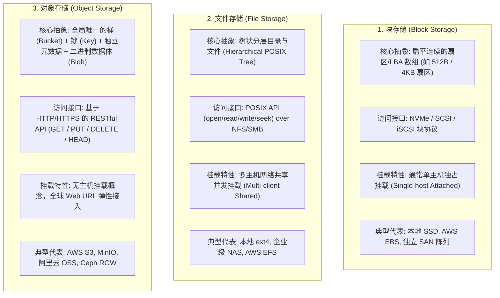

# L09-03｜数据应当存放在哪里：块存储、文件存储与对象存储的选型与度量

## 学习者问题

在规划一个真实系统的存储架构时，技术方案讨论区往往充斥着各种产品名词：
“把用户头像存进本地 ext4 目录”，“挂载一个 NFS 网络共享卷”，“开一个 AWS EBS 卷”，“全部扔进 S3 桶”。

**究竟在什么场景下，数据应当存放在块存储（Block）、文件存储（File）或对象存储（Object）中？** 为什么对象存储绝不是“运行在 HTTP 协议上的普通 POSIX 文件系统”？当一个系统从千级用户增长到亿级用户时，我们该如何用量化模型估算存储容量、请求费用与出网带宽？在什么情况下，选择对象存储反而是个灾难？

## 为什么重要

如果不建立清晰的存储架构抽象与经济学度量模型，系统架构师将面临严重的设计翻车与账单海啸：
- **概念混淆导致接口错配**：试图用对象存储替代数据库数据目录，却因其缺乏低延迟原位修改（In-place Overwrite）与毫秒级寻址，导致查询延迟从 0.5 毫秒飙升至 80 毫秒，TPS 暴跌；
- **目录元数据爆炸**：在本地单机 POSIX 文件系统的单个目录下存放上千万张用户小图片，导致目录项线性扫描或 B 树查找极度臃肿，系统因 Inode 耗尽或元数据锁争用而瘫痪；
- **账单海啸与隐性成本盲区**：只关注每 GB 存储单价，忽视了海量微小文件的 API 请求调用费（PUT/GET 次数）以及公网流量出网费（Egress Bandwidth），导致月末收到天价账单；
- **云厂商绑定与常数误区**：将某家云厂商当下的定价或网络时延当作不可改变的物理定律，丧失了在不同基础设施之间迁移的技术自主权。

要做出经得起时间考验的技术决策，必须掌握统一的**技术评估框架（Technology Evaluation Framework）**，建立严谨的存储架构推演与经济学度量能力。

## 学习目标

完成本课后，你应能：
- **Explain**：在机制与接口契约层面，对比**块存储（Block Storage）**、**文件存储（File Storage）**与**对象存储（Object Storage）**的抽象范式；
- **Diagnose**：彻底破除“对象存储就是网页版文件系统”的错误心智模型，指出对象存储的不可变性（Immutability）、扁平命名空间与缺乏 POSIX 文件锁的核心约束；
- **Estimate**：使用 `labs/foundations/m09/storage_economics.py` 与基准假设参数表（`reference_assumptions.json`），对存储容量费、API 请求费、出网流量费进行参数化量化估算，并明确列出模型省略的隐性成本项；
- **Judge**：熟练运用**技术评估框架（Technology Evaluation Framework）**的 7 个核心维度（问题、约束、机制、收益、代价、失效模式、禁用场景），严密捍卫一个存储选型方案，并明确阐述其**绝对不能使用的边界（When-NOT-to-use）**；
- **Observe**：在网络具备时通过真实的 HTTP 请求头观测对象存储接口特性（ETag、Content-Length 等），在网络受限时坚持实事求是原则（SKIP / NO LIVE NETWORK OBSERVATION）。

## 前置知识

- M08 `L08-01`：文件系统路径名、目录树与元数据；
- M09 `L09-01`：具名故障模型下的持久性边界；
- M09 `L09-02`：物理介质的局部性与读写约束；
- 核心概念复访：**Trade-off（权衡，EC-CON-006）**、**Abstraction（抽象，EC-CON-002）**、**Interface（接口，EC-CON-005）**。

---

## Architecture Comparison｜三类存储范式的机制剖析

在存储架构的演进史中，工程师们在“访问延迟”、“共享能力”、“命名空间灵活性”与“单位扩展成本”之间进行了多次权衡取舍，沉淀出三大主流范式：



### 1. 核心架构矩阵对比

| 维度 | 块存储（Block Storage） | 文件存储（File Storage） | 对象存储（Object Storage） |
| :--- | :--- | :--- | :--- |
| **基本存储单元** | 固定大小的逻辑块（Sector/LBA） | 包含元数据的可变长文件（File） | 带有元数据的完整对象（Object/Blob） |
| **寻址范式** | 逻辑块地址（如 LBA 0x4A20） | 分层路径名（如 `/home/user/doc.pdf`） | 扁平键名（如 `bucket/photos/2026/img.jpg`） |
| **访问接口** | 原始操作系统驱动调用（`read_block`） | 标准 POSIX 文件系统调用（`open/read`） | 应用层 HTTP REST API（`GET/PUT/DELETE`） |
| **可变性契约** | **极度灵活**：支持微秒级任意字节就地覆盖 | **灵活**：支持任意位置 `seek` 与追加写入 | **不可变（Immutable）**：通常只支持全量替换 |
| **典型访问延迟** | 亚毫秒级（$< 1\text{ ms}$） | 毫秒级（$1 \sim 5\text{ ms}$） | 互联网级（$20 \sim 100\text{ ms}$） |
| **扩展规模上限** | 受限于单卷容量与单实例挂载（TB 级） | 受限于分布式文件系统元数据锁（PB 级） | **近乎无限**：横向扩展分布式哈希（EB 级） |
| **基准存储单价** | 高（参考价 $\sim \$0.08 / \text{GB-月}$） | 极高（参考价 $\sim \$0.30 / \text{GB-月}$） | **极低**（参考价 $\sim \$0.023 / \text{GB-月}$） |

---

## Mental Model｜破除对对象存储的致命误解

### 致命误解 1：“对象存储就是挂在 Web 上的普通文件系统”
许多新手试图通过 `s3fs` 等 FUSE 工具，将对象存储直接挂载为本地目录，然后把 MySQL 数据目录或编译缓存放在里面，结果遭遇惨败：
1. **不支持字节级原位修改（No Byte-level Mutation）**：
   在对象存储中，如果你想修改一个 2 GB 视频文件的最后 1 个字节，你**无法**像在块存储或文件存储中那样执行 `fseek(2GB-1); fwrite(1)`。
   对象存储的物理语义是整体不可变的：你必须在客户端将整个 2 GB 重新上传一遍（`PUT`），覆盖旧对象；
2. **缺乏 POSIX 原子锁与状态感知**：
   对象存储没有操作系统级的 `flock`，无法感知并发进程对同一个文件的临界区加锁。多客户端并发覆写同一个 Key，结果取决于不可控的最后到达时间；
3. **“目录”只是键名中的虚拟视觉幻觉**：
   在对象存储中，`photos/2026/summer.jpg` 只是一个长度为 23 个字符的**平铺字符串键（Flat String Key）**。底层根本不存在一个叫做 `photos` 或 `2026` 的真实物理 Inode 目录！所谓的“目录展开”实际上是主控对键名执行前缀过滤（Prefix Query）。

---

## Economics｜存储经济学模型与量化估算

在现代云原生架构中，存储开销不仅取决于存放了多少数据，还受到访问模式的剧烈影响。

### 1. 参数化成本度量公式
$$\text{月度总成本} = (\text{容量 GB} \times \text{单价}_{\text{容量}}) + \left(\frac{\text{写请求数}}{1000} \times \text{单价}_{\text{写请求}}\right) + \left(\frac{\text{读请求数}}{1000} \times \text{单价}_{\text{读请求}}\right) + (\text{出网流量 GB} \times \text{单价}_{\text{出网}})$$

> ### 当前实践基准数据声明（Current Practice Reference）
> 以下单价数据来自权威公有云文档（以 AWS us-east-1 区域为例，核实日期：2026-09-02），记录于 `labs/foundations/m09/reference_assumptions.json`：
> - **块存储（EBS gp3）**：基准容量 \$0.08 / GB-月（含 3000 IOPS / 125 MB/s 基线性能）；
> - **文件存储（EFS Standard）**：基准容量 \$0.30 / GB-月；
> - **对象存储（S3 Standard）**：基准容量 \$0.023 / GB-月；写请求（PUT）\$0.005 / 千次；读请求（GET）\$0.0004 / 千次；互联网出网流量 \$0.09 / GB。
>
> **重要认知铁律**：云厂商的价格、汇率与计费细则是**动态的当前工程实践**，绝非永恒不变的计算常数。代码中的所有计算必须保持参数化！

### 2. 实测模型演算（`labs/foundations/m09/storage_economics.py`）

我们运行实验脚本评估一个具体场景：
**业务模型**：某系统需持久化 10 TB（10,000 GB）静态媒体资源，每月新增上传（写）50,000 次，用户下载访问（读）1,000,000 次，产生 200 GB 的互联网出网流量。

```bash
cd labs/foundations/m09
python3 storage_economics.py
```

终端输出记录：
```text
=== Essential CS M09 — Storage Economics & Evaluation (L09-03) ===

[1] Monthly Cost Estimation (10 TB storage, 1M reads, 50K writes, 200 GB egress):
    -> Block Storage (Cloud EBS gp3 General Purpose SSD):   $800.00
    -> File Storage  (Cloud Managed EFS Standard File System):    $3000.00
    -> Object Store  (Cloud S3 Standard Object Store):   $248.65 (Storage=$230.0, Requests=$0.65, Egress=$18.0)
    -> Explicit Omissions: provisioned_iops_and_burst_credits, volume_snapshot_storage, multi_region_replication_charges, minimum_object_storage_duration_or_size_padding, cross_availability_zone_interconnect_network_fees
```

### 3. 模型显式省略的现实成本（Explicit Omissions）
任何负责任的架构师在做成本估算时，必须向业务方明示模型**没有计算**的现实项目：
1. **预配置 IOPS 与吞吐爆发费用**（若块存储需要突破 3000 IOPS）；
2. **快照存储费（Snapshots）**（定期对块存储做全量/增量备份产生的沉没容量费）；
3. **跨可用区/跨区域传输费（Cross-AZ/Cross-Region Egress）**；
4. **小对象容量补齐与冷存储锁定期（Minimum Duration/Size Padding）**：某些低频存储分层（如 S3 Glacier）规定单对象不足 128 KB 按 128 KB 计费，未满 90 天删除强制补收存储费。

---

## Judgment｜技术评估框架（Technology Evaluation Framework）

做出成熟技术选型的标志，不是看你能说出这项技术多少优点，而是看你**能否清晰界定它在什么情况下绝对不能使用（When-NOT-to-use）**。


### 框架实例：对象存储（Object Storage）的严谨评估

1. **Problem（解决的核心问题）**：
   低成本、高可靠地存放海量、非结构化、近乎无限增长的静态二进制大对象（Blobs）。
2. **Constraints（受限的前提约束）**：
   业务调用能够容忍 20 ~ 100 ms 的 HTTP 网络延迟；通过平铺 Key 寻址，不依赖 POSIX 目录树深度检索。
3. **Mechanism（底层核心机制）**：
   分布式无状态网关 + 一致性哈希分片 + 多副本/纠删码（Erasure Coding）非易失存储；对外暴露 RESTful HTTP 接口。
4. **Gains（核心收益）**：
   - 单位容量成本最低（约为块存储的 1/4，文件存储的 1/12）；
   - 容量无限横向弹性，免除扩容停机运维负担；
   - 天然支持多数据中心冗余与公网 Web URL 直接分发。
5. **Costs（技术与财务代价）**：
   - 每次读写均有 API 调用计费；
   - 大规模公网下载产生高昂的出网流量费（Egress Shock）；
   - 无法进行微小的原位更新，必须全量重传。
6. **Failure Modes（典型失效模式）**：
   - **海量微小文件请求计费爆炸**：存放数亿个小于 1 KB 的传感器日志文件，API 请求费反超存储容量费数倍；
   - **弱一致性竞态（在部分传统对象存储中）**：覆写同一对象后短暂读取到陈旧版本。
7. **When-NOT-to-use（绝对禁止使用的场景）**：
   - **绝不能作为数据库数据目录**（如 PostgreSQL 数据文件）：无法承受几十毫秒的 HTTP 延迟，且不支持页内原位覆写；
   - **绝不能作为高并发代码编译工作区**：编译工具链（如 GCC、Make、Webpack）高频执行 `stat`、`open`、创建深层临时目录与文件锁，用对象存储虚拟挂载会导致编译耗时膨胀百倍甚至直接报错死锁；
   - **绝不能用于需要毫秒级低延迟的交易流水实时计算**。

---

## Checkpoint Investigation

### Question
某初创团队开发了一款短视频内容分享 App。
随着用户激增，系统每天产生 50 万个新视频（每个平均 20 MB），同时有大量的用户评论数据（每天产生 200 万条，高频更新点赞数）。
技术主管提议：“为了统一部署架构，我们将视频文件和 PostgreSQL 数据库数据文件，全部放在挂载了 AWS EFS（托管文件存储）的共享目录中，这样所有后台容器都能直接通过 `/mnt/efs` 访问所有数据，架构最简单。”

请你运用**技术评估框架**与**存储经济学模型**：
1. 严厉指出将 PostgreSQL 数据库直接运行在 EFS 共享文件系统上的致命缺陷；
2. 严厉指出将 50 万个 20 MB 的静态视频存放在 EFS 中的经济学灾难；
3. 给出基于块存储与对象存储的最佳组合重构方案。

<details>
<summary>Hint 1</summary>
回顾块存储、文件存储与对象存储的延迟差异。PostgreSQL 的 WAL 写入和数据页刷新需要亚毫秒级的低延迟，在 NFS/EFS 的网络文件系统上会发生什么？
</details>

<details>
<summary>Hint 2</summary>
计算 50 万个 20 MB 视频（约 10 TB 数据）在 EFS（\$0.30/GB）与 S3（\$0.023/GB）上的单月存储费用差异。
</details>

<details>
<summary>Expected Observation</summary>
1. 致命架构缺陷：PostgreSQL 对磁盘 I/O 延迟极其敏感。EFS 基于网络 NFS 协议，每次 <code>fsync</code> 同步或页面读写都有 1 ~ 5 ms 的网络往返延迟，会导致数据库事务吞吐量断崖式暴跌，且多节点挂载极易引发分布式锁死锁与元数据损坏。
2. 致命经济学缺陷：10 TB 视频存放在 EFS 单月仅容量费就需 \$3,000；而存放在 S3 标准对象存储仅需 \$230，费用相差 13 倍！
3. 正确重构方案：
   - 数据库数据目录：独占挂载低延迟、高性能的<strong>块存储</strong>（如 EBS gp3）；
   - 静态视频流媒体：存入无限弹性、低成本的<strong>对象存储</strong>（如 S3），并通过 CDN 缓存分发。
</details>

<details>
<summary>Full Explanation</summary>
这是典型的<strong>用“接口直觉”掩盖“物理与经济学规律”</strong>的架构惨案。

<strong>1. 数据库置于 EFS 的灾难（违反 Block 适用契约）：</strong>
- <strong>时延暴增</strong>：关系型数据库的核心引擎（如 PostgreSQL、InnoDB）设计前提是底层存储具备<strong>亚毫秒级（$< 1\text{ ms}$）</strong>的随机写入响应。EFS 是跨网络的分布式 NFS，每一次事务日志刷盘（<code>fsync</code>）都需要经历网络协议栈封包、网络往返、服务端确认，单次写入延迟高达 1 ~ 5 ms。这直接将单线程事务 TPS 从每秒数千次强行打压到每秒几百次；
- <strong>分布式锁隐患</strong>：多容器并发尝试打开同一个数据目录，会触发极度复杂的 NFS 锁机制与 Inode 缓存失效，极易导致数据库启动冲突或静默数据损坏。
- <strong>正解</strong>：数据库必须独占挂载专属的<strong>块存储（Block Storage）</strong>。

<strong>2. 视频存放在 EFS 的经济学海啸（违反 Object 适用契约）：</strong>
- <strong>存储单价差 13 倍</strong>：静态视频属于典型的“一次写入、多次读取、永不原位修改”的不可变大对象（Immutable Blobs）。
  50 万个 20 MB 视频总容量为 $500,000 \times 20\text{ MB} \approx 10,000\text{ GB} = 10\text{ TB}$。
  - 在 EFS（\$0.30/GB-月）上，单月容量费高达 <strong>\$3,000.00</strong>；
  - 在 S3 对象存储（\$0.023/GB-月）上，单月容量费仅为 <strong>\$230.00</strong>；
- <strong>网络出口带宽与并发瓶颈</strong>：将海量视频通过挂载目录由业务服务器转发，白白耗费后端 Web 实例的 CPU 与网卡带宽，极易引发连接池耗尽。

<strong>3. 成熟工业界正统架构：</strong>
- <strong>计算与数据解耦</strong>：所有视频直接通过客户端（App）向后端申请预签名 URL（Presigned URL），直传到<strong>对象存储（如 S3）</strong>；
- <strong>内容分发加速</strong>：对象存储前端挂载 CDN（内容分发网络），利用边缘节点缓存热门视频，不仅降低对象存储读取 API 费用，还大幅削减回源流量；
- <strong>事务数据归位</strong>：PostgreSQL 运行在挂载了 <strong>EBS 高性能 SSD 块卷</strong>的独立计算实例上，仅负责存储元数据、评论与用户状态，确保交易与高频更新在亚毫秒级完成。
</details>

---

## Common Misconceptions

- **“对象存储只是运行在 Web 上的一个普通文件系统。”** 错。对象存储没有树状物理目录，不支持字节级就地覆盖，缺乏 POSIX 文件锁，其语义是基于平铺 Key 的不可变二进制大对象。
- **“块存储只能挂载在一台机器上，绝对无法实现任何形式的共享。”** 错。块存储本身可以存在高级存储局域网（SAN）或多挂载卷（Multi-Attach Block Volumes），但需要专门的集群文件系统（如 GFS2、OCFS2）提供协调，普通非集群文件系统（如 ext4）并发挂载会导致数据彻底损坏。
- **“云存储的价格是固定不变的计算常数。”** 错。云厂商的存储、请求与流量价格是动态的商业实践，随区域、年份、分层与竞争环境不断变动。
- **“学习存储架构必须先注册一个真实的云厂商付费账号并绑定信用卡。”** 错。通过本地有界参数化计算模型、开源对象存储模拟器（如 MinIO、LocalStack）或 HTTP 接口探针，完全可以零成本掌握存储架构与经济学的核心规律。

## What You Can Ignore—for Now

- 跨多区域对象存储复制（Cross-Region Replication）的最终一致性与向量时钟数学收敛推导；
- AWS IAM 复杂策略 JSON 语法与 STS 临时凭证鉴权握手细节；
- 分布式块存储系统内部（如 Ceph CRUSH 算法）的伪随机分片权重计算。

## Exit Criteria

- 能够以表格形式清晰对比块存储、文件存储与对象存储在接口、基本单元、可变性、延迟与成本上的本质区别；
- 能够清晰指出对象存储的 3 大核心物理约束（平铺命名空间、不可变性/全量重传、无 POSIX 锁），并解释为什么不能将其作为数据库数据目录；
- 能够独立运用成本公式，准确计算包含容量费、API 请求费与出网流量费的月度存储总开销；
- 能够熟练使用“技术评估框架”的 7 个维度捍卫一次存储架构选型，并明确阐述其绝对禁止使用的场景（When-NOT-to-use）。

## Competency Mapping

- **Primary**: **Judge** (在复杂业务场景下运用技术评估框架进行存储架构选型)
- **Growth**: **Estimate** (量化计算存储容量、API 与出网流量开销), **Diagnose** (诊断存储架构错配与隐性成本漏洞)

## Provenance

- **SNIA (Storage Networking Industry Association)**: *Storage Architecture Models: Block, File, and Object Interfaces*.
- **Amazon Web Services (AWS) Documentation**: *Amazon EBS, Amazon EFS, and Amazon S3 Architecture & Pricing Guides (us-east-1, checked 2026-09-02)*.
- **Martin Kleppmann**: *Designing Data-Intensive Applications (DDIA)*, Chapter 3 (Storage and Retrieval).
- **OSTEP (Operating Systems: Three Easy Pieces)**: Chapter 48 (Distributed Systems) & Chapter 49 (Sun's Network File System).
