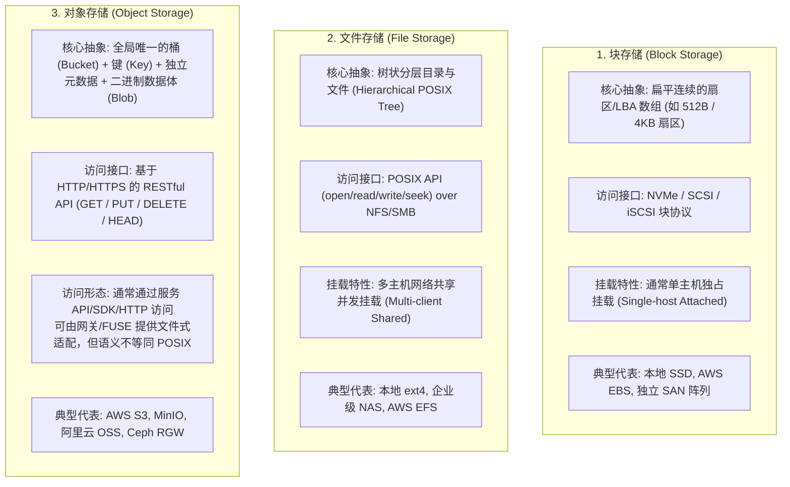
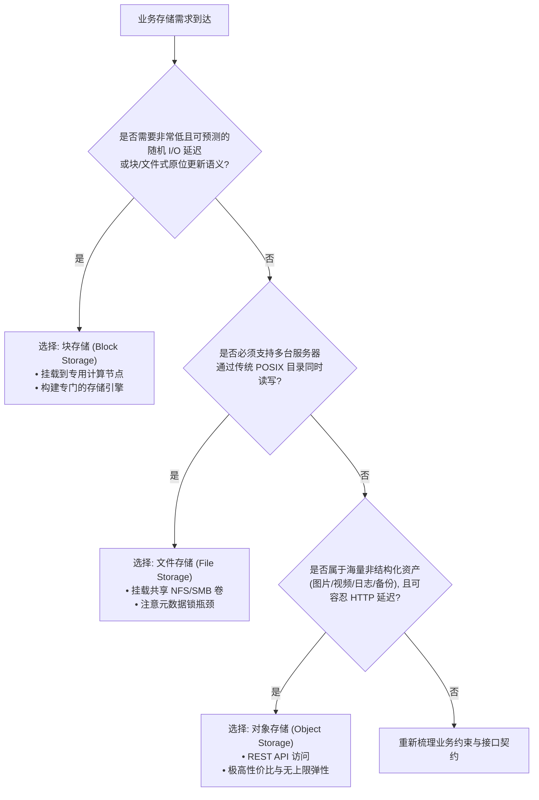

# L09-03｜数据应当存放在哪里：块存储、文件存储与对象存储的选型与度量

## 学习者问题

在规划一个真实系统的存储架构时，技术方案讨论区往往充斥着各种产品名词：
“把用户头像存进本地 ext4 目录”，“挂载一个 NFS 网络共享卷”，“开一个 AWS EBS 卷”，“全部扔进 S3 桶”。

**究竟在什么场景下，数据应当存放在块存储（Block）、文件存储（File）或对象存储（Object）中？** 为什么对象存储绝不是“运行在 HTTP 协议上的普通 POSIX 文件系统”？当一个系统从千级用户增长到亿级用户时，我们该如何用量化模型估算存储容量、请求费用与出网带宽？在什么情况下，选择对象存储反而是个灾难？

## 为什么重要

如果不建立清晰的存储架构抽象与经济学度量模型，系统架构师将面临严重的设计翻车与账单海啸：
- **概念混淆导致接口错配**：把普通对象 API 当成数据库数据目录的 POSIX/块设备接口，可能产生更新语义、锁、同步和延迟模型错配；实际性能影响必须由所选服务与 workload 实测。
- **目录元数据爆炸**：在本地单机 POSIX 文件系统的单个目录下存放上千万张用户小图片，导致目录项线性扫描或 B 树查找极度臃肿，系统因 Inode 耗尽或元数据锁争用而瘫痪；
- **账单海啸与隐性成本盲区**：只关注每 GB 存储单价，忽视了海量微小文件的 API 请求调用费（PUT/GET 次数）以及公网流量出网费（Egress Bandwidth），导致月末收到天价账单；
- **云厂商绑定与常数误区**：将某家云厂商当下的定价或网络时延当作不可改变的物理定律，丧失了在不同基础设施之间迁移的技术自主权。

要做出经得起时间考验的技术决策，必须掌握统一的**技术评估框架（Technology Evaluation Framework）**，建立严谨的存储架构推演与经济学度量能力。

## 学习目标

完成本课后，你应能：
- **Explain**：在机制与接口契约层面，对比**块存储（Block Storage）**、**文件存储（File Storage）**与**对象存储（Object Storage）**的抽象范式；
- **Diagnose**：彻底破除“对象存储就是网页版文件系统”的错误心智模型，指出对象/key API、通常缺乏 POSIX byte-range mutation/locking 语义，以及 whole-object replace/versioning 等行为与普通文件接口的差异；
- **Estimate**：使用 `labs/foundations/m09/storage_economics.py` 与基准假设参数表（`reference_assumptions.json`），对存储容量费、API 请求费、出网流量费进行参数化量化估算，并明确列出模型省略的隐性成本项；
- **Judge**：熟练运用**技术评估框架（Technology Evaluation Framework）**的 7 个核心维度（Problem、Constraints、Mechanism、Gains、Costs、Failure Modes、When-not-to-use），捍卫一个存储选型方案，并明确阐述**在哪些需求/约束下它不应被选用**；
- **Observe**：在网络具备时通过真实的 HTTP 请求头观测对象存储接口特性（ETag、Content-Length 等），在网络受限时坚持实事求是原则（SKIP / NO LIVE NETWORK OBSERVATION）。

## 前置知识

- M08 `L08-01`：文件系统路径名、目录树与元数据；
- M09 `L09-01`：具名故障模型下的持久性边界；
- M09 `L09-02`：物理介质的局部性与读写约束；
- 核心概念复访：**Trade-off（权衡，EC-CON-006）**、**Abstraction（抽象，EC-CON-002）**、**Interface（接口，EC-CON-005）**。

---

## Architecture Comparison｜三类存储范式的机制剖析

在存储架构的演进史中，工程师们在“访问延迟”、“共享能力”、“命名空间灵活性”与“单位扩展成本”之间进行了多次权衡取舍，沉淀出三大主流范式：



### 1. 核心架构矩阵对比

| 维度 | 块存储（Block Storage） | 文件存储（File Storage） | 对象存储（Object Storage） |
| :--- | :--- | :--- | :--- |
| **基本存储单元** | 固定大小的逻辑块（Sector/LBA） | 包含元数据的可变长文件（File） | 带有元数据的完整对象（Object/Blob） |
| **寻址范式** | 逻辑块地址（如 LBA 0x4A20） | 分层路径名（如 `/home/user/doc.pdf`） | 扁平键名（如 `bucket/photos/2026/img.jpg`） |
| **访问接口** | 原始操作系统驱动调用（`read_block`） | 标准 POSIX 文件系统调用（`open/read`） | 应用层 HTTP REST API（`GET/PUT/DELETE`） |
| **更新语义** | 暴露块级读写；上层文件系统/数据库决定字节级更新语义 | 通常支持 `seek`/追加/覆盖等文件语义 | 通常按对象/key 执行 PUT/GET/DELETE；许多服务对更新采用 whole-object replace/versioning，而非 POSIX 式原位字节修改 |
| **访问延迟** | 取决于本地/网络块设备、卷类型与负载 | 取决于本地/网络文件系统、缓存与负载 | 取决于网络、区域、服务端与对象大小；通常不应按本地 POSIX 随机 I/O 延迟模型假设 |
| **扩展方式** | 按卷/设备与服务配额扩展；部分产品支持 multi-attach | 本地或分布式文件服务，扩展行为依产品/协议 | 服务端可横向扩展到很大规模，但仍受 provider quota、object/key/request limits 与架构约束 |
| **成本模型** | 容量 + 可能的 IOPS/throughput/snapshot 等 | 容量 + throughput/access/tiering 等可能费用 | 容量 + requests + egress + tiering/retention 等；具体当前价格由参数表决定 |

---

## Mental Model｜破除对对象存储的致命误解

### 致命误解 1：“对象存储就是挂在 Web 上的普通文件系统”
许多新手试图通过 `s3fs` 等 FUSE 工具，将对象存储直接挂载为本地目录，然后把 MySQL 数据目录或编译缓存放在里面，结果遭遇惨败：
1. **不支持字节级原位修改（No Byte-level Mutation）**：
   在对象存储中，如果你想修改一个 2 GB 视频文件的最后 1 个字节，你**无法**像在块存储或文件存储中那样执行 `fseek(2GB-1); fwrite(1)`。
   普通对象 API 通常没有 POSIX 式字节范围原位覆写语义；更新往往以创建/替换一个对象版本或完整对象值为单位。multipart、server-side copy 等机制可能改变传输/实现细节，因此不能写成“任何对象更新都必须由客户端重新上传整个 2 GB”。
2. **缺乏 POSIX 原子锁与状态感知**：
   对象存储没有操作系统级的 `flock`，无法感知并发进程对同一个文件的临界区加锁。多客户端并发覆写同一个 Key，结果取决于不可控的最后到达时间；
3. **“目录”只是键名中的虚拟视觉幻觉**：
   在对象存储中，`photos/2026/summer.jpg` 只是一个长度为 23 个字符的**平铺字符串键（Flat String Key）**。底层根本不存在一个叫做 `photos` 或 `2026` 的真实物理 Inode 目录！所谓的“目录展开”实际上是主控对键名执行前缀过滤（Prefix Query）。

---

## Economics｜存储经济学模型与量化估算

在现代云原生架构中，存储开销不仅取决于存放了多少数据，还受到访问模式的剧烈影响。

### 1. 参数化成本度量公式
$$\text{月度总成本} = (\text{容量 GB} \times \text{单价}_{\text{容量}}) + \left(\frac{\text{写请求数}}{1000} \times \text{单价}_{\text{写请求}}\right) + \left(\frac{\text{读请求数}}{1000} \times \text{单价}_{\text{读请求}}\right) + (\text{出网流量 GB} \times \text{单价}_{\text{出网}})$$

> ### 当前实践基准数据声明（Current Practice Reference）
> 以下单价数据来自权威公有云文档（以 AWS us-east-1 区域为例，核实日期：2026-09-02），记录于 `labs/foundations/m09/reference_assumptions.json`：
> - **块存储（EBS gp3）**：基准容量 \$0.08 / GB-月（该快照同时记录 3000 IOPS / 125 MB/s 基线性能；超额性能另计）；
> - **文件存储（EFS Standard）**：本教学快照使用容量 \$0.30 / GB-月；**当前 EFS 还可能按 throughput/access/tiering 等维度计费，本模型明确省略这些项**；
> - **对象存储（S3 Standard）**：容量 \$0.023 / GB-月；PUT \$0.005 / 千次；GET \$0.0004 / 千次；本快照把首档互联网出网边际价设为 \$0.09 / GB，并显式建模“每账号跨合格 AWS 服务/区域聚合的 100 GB/月免费出网额度”这一账户级假设。
>
> **重要认知铁律**：云厂商的价格、汇率与计费细则是**动态的当前工程实践**，绝非永恒不变的计算常数。代码中的所有计算必须保持参数化！

### 2. 实测模型演算（`labs/foundations/m09/storage_economics.py`）

我们运行实验脚本评估一个具体场景：
**业务模型**：某系统需持久化 10 TB（10,000 GB）静态媒体资源，每月新增上传（写）50,000 次，用户下载访问（读）1,000,000 次，产生 200 GB 的互联网出网流量。

```bash
cd labs/foundations/m09
python3 storage_economics.py
```

终端输出记录：
```text
=== Essential CS M09 — Storage Economics & Evaluation (L09-03) ===

[1] Monthly Cost Estimation (10 TB storage, 1M reads, 50K writes, 200 GB egress):
    -> Block Storage (Cloud EBS gp3 General Purpose SSD):   $800.00
    -> File Storage  (Cloud Managed EFS Standard File System):    $3000.00
    -> Object Store  (Cloud S3 Standard Object Store):   $239.65 (Storage=$230.0, Requests=$0.65, Egress=$9.0)
    -> Explicit Omissions: provisioned_iops_and_burst_credits, volume_snapshot_storage, multi_region_replication_charges, minimum_object_storage_duration_or_size_padding, cross_availability_zone_interconnect_network_fees, account_wide_free_egress_consumed_by_other_services, tiered_egress_rates_above_the_first_pricing_band, efs_throughput_or_access_charges
```

### 3. 模型显式省略的现实成本（Explicit Omissions）
任何负责任的架构师在做成本估算时，必须向业务方明示模型**没有计算**的现实项目：
1. **预配置 IOPS 与吞吐费用**（若块存储需要突破参考基线）；
2. **快照存储费（Snapshots）**（定期对块存储做全量/增量备份产生的沉没容量费）；
3. **跨可用区/跨区域传输费，以及账户级免费出网额度是否已被其它服务消费**；
4. **小对象容量补齐、冷存储 minimum duration、分层出网价格与文件存储 throughput/access 费用**；具体规则必须按所选产品/region 的当期文档重新核对。

---

## Judgment｜技术评估框架（Technology Evaluation Framework）

做出成熟技术选型的标志，不是看你能说出这项技术多少优点，而是看你**能否清晰界定 When-not-to-use：哪些具体需求/约束与它的接口或机制不匹配**。这不是宇宙级“绝对禁令”，而是可审计的反选条件。



### 框架实例：对象存储（Object Storage）的严谨评估

1. **Problem（解决的核心问题）**：
   以服务化对象/key API 存放和分发大规模非结构化对象，并把容量、请求、网络与运维扩展交给对象存储系统管理。
2. **Constraints（受限的前提约束）**：
   业务调用能够容忍 20 ~ 100 ms 的 HTTP 网络延迟；通过平铺 Key 寻址，不依赖 POSIX 目录树深度检索。
3. **Mechanism（底层核心机制）**：
   分布式无状态网关 + 一致性哈希分片 + 多副本/纠删码（Erasure Coding）非易失存储；对外暴露 RESTful HTTP 接口。
4. **Gains（核心收益）**：
   - 在当前参考假设下，容量成本可能低于所比较的块/文件产品；实际差异必须由同区域、同层级、同计费项参数重新计算；
   - 服务端通常支持大规模横向扩展，应用无需像本地卷那样手工扩容；仍受 provider quotas 与服务约束；
   - 某些托管对象存储提供多 AZ/多故障域冗余与 HTTP endpoint，但具体 durability/availability/URL 暴露方式是产品契约，不是对象存储抽象的必然属性。
5. **Costs（技术与财务代价）**：
   - 每次读写均有 API 调用计费；
   - 大规模公网下载产生高昂的出网流量费（Egress Shock）；
   - 通常缺乏 POSIX 式微小原位更新；whole-object replace/versioning、multipart 或服务端复制的实际代价取决于具体 API。
6. **Failure Modes（典型失效模式）**：
   - **海量微小文件请求计费爆炸**：存放数亿个小于 1 KB 的传感器日志文件，API 请求费反超存储容量费数倍；
   - **弱一致性竞态（在部分传统对象存储中）**：覆写同一对象后短暂读取到陈旧版本。
7. **When-not-to-use（反选条件）**：
   - 需要数据库引擎直接依赖 POSIX/块设备语义、细粒度随机更新与低延迟同步时，不应把普通对象 API 当作数据目录底层接口；
   - 构建工具链依赖高频 `stat/open/rename/lock`、临时目录和 POSIX 一致语义时，不应默认对象存储 FUSE 适配层等价于本地文件系统；
   - 工作负载要求非常低且可预测的随机 I/O 延迟、原位修改或文件锁语义时，应优先评估更匹配的块/文件/数据库接口。

---

## Checkpoint Investigation

### Question
某初创团队开发了一款短视频内容分享 App。
随着用户激增，系统每天产生 50 万个新视频（每个平均 20 MB），同时有大量的用户评论数据（每天产生 200 万条，高频更新点赞数）。
技术主管提议：“为了统一部署架构，我们将视频文件和 PostgreSQL 数据库数据文件，全部放在挂载了 AWS EFS（托管文件存储）的共享目录中，这样所有后台容器都能直接通过 `/mnt/efs` 访问所有数据，架构最简单。”

请你运用**技术评估框架**与**存储经济学模型**：
1. 分析“多个容器共享同一 PostgreSQL data directory”在数据库协调、同步语义与性能上的风险；
2. 用当前参考假设比较 50 万个 20 MB 静态视频放在 EFS 与 S3 的容量成本，并明确这个比较遗漏了哪些计费项；
3. 给出一个更匹配题设约束的块/托管数据库 + 对象存储候选方案，并说明它的 When-not-to-use。

<details>
<summary>Hint 1</summary>
回顾 PostgreSQL 对同步、文件系统语义和 I/O 延迟的敏感性：如果底层换成托管 NFS 文件服务，哪些 correctness/performance 假设需要查文档并用 workload 实测，而不能直接套固定毫秒常数？
</details>

<details>
<summary>Hint 2</summary>
计算 50 万个 20 MB 视频（约 10 TB 数据）在 EFS（\$0.30/GB）与 S3（\$0.023/GB）上的单月存储费用差异。
</details>

<details>
<summary>Expected Observation</summary>
1. 架构风险：PostgreSQL 的数据目录依赖文件系统的同步、锁与一致性语义，并对 I/O 延迟敏感。EFS 是托管 NFS 文件服务；实际延迟/吞吐取决于 EFS storage/performance/throughput mode 与 workload。不能从“网络文件系统”直接推出固定 1–5 ms 或固定 TPS，但应先核对 PostgreSQL 对共享/网络文件系统的支持边界与压测证据，而不是把“所有容器共享一个数据目录”当作天然安全。
2. 在**本次已提交的 current-practice 容量费参数**下，10 TB 的容量项分别约为 EFS \$3,000 与 S3 \$230，约 13 倍；这是参数快照下的比较，不包含 EFS throughput/access、S3 request/egress/tiering 等全部账单项。
3. 一个更匹配题设的候选方案：
   - 数据库：使用符合 PostgreSQL 文件系统/同步要求并经 workload 验证的块卷或托管数据库存储；
   - 静态视频：使用对象存储（如 S3）并按访问模式评估 CDN；对象服务仍有 quota、request、egress、lifecycle 等约束。
</details>

<details>
<summary>Full Explanation</summary>
这是典型的<strong>用“接口直觉”掩盖“物理与经济学规律”</strong>的架构惨案。

<strong>1. 数据库置于 EFS 的灾难（违反 Block 适用契约）：</strong>
- <strong>接口与性能必须实测</strong>：数据库会频繁执行日志同步、数据页与元数据 I/O；网络文件服务增加了不同的故障/延迟/缓存/锁路径。是否满足 PostgreSQL 的正确性与性能要求必须依据数据库文档、文件服务契约和实际 workload 压测判断，不能写成“数据库天然要求 <1 ms”或“EFS 每次 fsync 必然 1–5 ms”。
- <strong>多实例并发不是共享目录即可解决</strong>：同一 PostgreSQL data directory 不能因为底层文件系统支持多客户端挂载，就让多个独立数据库实例任意并发管理；数据库自身的单实例/集群协调规则仍然成立。
- <strong>候选方向</strong>：优先评估符合数据库同步/文件系统契约的块卷或托管数据库存储，而不是因为“共享目录方便”就让多个数据库实例直接共享同一 data directory。

<strong>2. 视频存放在 EFS 的经济学海啸（违反 Object 适用契约）：</strong>
- <strong>容量费参数差异</strong>：题设静态视频属于典型的“大对象、很少需要 POSIX 原位修改”的 workload，因此对象 API 是值得比较的候选。
  50 万个 20 MB 视频总容量为 $500,000 \times 20\text{ MB} \approx 10,000\text{ GB} = 10\text{ TB}$。
  - 在 EFS（\$0.30/GB-月）上，单月容量费高达 <strong>\$3,000.00</strong>；
  - 在 S3 对象存储（\$0.023/GB-月）上，单月容量费仅为 <strong>\$230.00</strong>；
- <strong>网络出口带宽与并发瓶颈</strong>：将海量视频通过挂载目录由业务服务器转发，白白耗费后端 Web 实例的 CPU 与网卡带宽，极易引发连接池耗尽。

<strong>3. 一个与题设约束更匹配的候选架构：</strong>
- <strong>计算与数据解耦</strong>：所有视频直接通过客户端（App）向后端申请预签名 URL（Presigned URL），直传到<strong>对象存储（如 S3）</strong>；
- <strong>内容分发加速</strong>：对象存储前端挂载 CDN（内容分发网络），利用边缘节点缓存热门视频，不仅降低对象存储读取 API 费用，还大幅削减回源流量；
- <strong>事务数据归位</strong>：可把 PostgreSQL 放在符合其文件系统/同步契约并经 workload 验证的持久块卷或托管数据库存储上；是否达到亚毫秒延迟属于具体产品/实例/负载观测，不在课程中承诺。
</details>

---

## Common Misconceptions

- **“对象存储只是运行在 Web 上的一个普通文件系统。”** 错。对象存储通常暴露 object/key + metadata API，而不是完整 POSIX path/in-place update/locking 契约；具体是否支持版本、条件写、层次化 key 展示等由服务定义。
- **“块存储只能挂载在一台机器上，绝对无法实现任何形式的共享。”** 错。SAN 或某些 multi-attach 产品可以让多个主机访问块设备，但必须使用与该共享模式兼容的协调/集群文件系统或存储引擎；把普通非集群文件系统无协调地并发挂载可能造成严重一致性问题甚至数据损坏。
- **“云存储的价格是固定不变的计算常数。”** 错。云厂商的存储、请求与流量价格是动态的商业实践，随区域、年份、分层与竞争环境不断变动。
- **“学习存储架构必须先注册一个真实的云厂商付费账号并绑定信用卡。”** 错。通过本地有界参数化计算模型、开源对象存储模拟器（如 MinIO、LocalStack）或 HTTP 接口探针，完全可以零成本掌握存储架构与经济学的核心规律。

## What You Can Ignore—for Now

- 跨多区域对象存储复制（Cross-Region Replication）的最终一致性与向量时钟数学收敛推导；
- AWS IAM 复杂策略 JSON 语法与 STS 临时凭证鉴权握手细节；
- 分布式块存储系统内部（如 Ceph CRUSH 算法）的伪随机分片权重计算。

## Exit Criteria

- 能够以表格形式清晰对比块存储、文件存储与对象存储在接口、基本单元、可变性、延迟与成本上的本质区别；
- 能够清晰指出普通对象 API 与 POSIX 文件接口在命名、更新粒度、锁/同步语义上的差异，并解释为什么接口错配时不应把对象存储直接当作数据库数据目录；
- 能够独立运用成本公式，准确计算包含容量费、API 请求费与出网流量费的月度存储总开销；
- 能够熟练使用“技术评估框架”的 7 个维度捍卫一次存储架构选型，并明确阐述可审计的 When-not-to-use 反选条件。

## Competency Mapping

- **Primary**: **Judge** (在复杂业务场景下运用技术评估框架进行存储架构选型)
- **Growth**: **Estimate** (量化计算存储容量、API 与出网流量开销), **Diagnose** (诊断存储架构错配与隐性成本漏洞)

## Provenance

- **SNIA (Storage Networking Industry Association)**: *Storage Architecture Models: Block, File, and Object Interfaces*.
- **Amazon Web Services (AWS) Documentation**: *Amazon EBS, Amazon EFS, and Amazon S3 Architecture & Pricing Guides (us-east-1, checked 2026-09-02)*.
- **Martin Kleppmann**: *Designing Data-Intensive Applications (DDIA)*, Chapter 3 (Storage and Retrieval).
- **OSTEP (Operating Systems: Three Easy Pieces)**: Chapter 48 (Distributed Systems) & Chapter 49 (Sun's Network File System).
