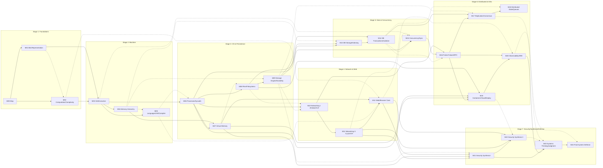

# Core Dependency Graph v0.1

Status: **RECONCILED — Blueprint v0.1, Issue #9 integration applied (not VERIFIED; Lead review pending)**
Author: Local Agent (Curriculum Architecture Research & Design); Issue #9 integration applied by Curriculum Architecture Integrator
Date: 2026-08-30
Scope: Explicit prerequisite relationships between Stages, Modules, and important Lessons. Companion to `core-stage-module-lesson-map-v0.1.md`. Original Issue #1 proposal with the Lead-corrected semantics retained; Issue #9 reconciliation outcomes (hidden-prerequisite resolutions, U-table updates, explicit narrative-vs-H separation) applied. For dependency reasoning — not a final lesson list.

---

## 1. Dependency Model & Legend

Four edge types are used. Only **hard prerequisite** edges constrain ordering; the rest are advisory.

| Type | Symbol | Meaning | Constrains ordering? |
|---|---|---|---|
| **Hard prerequisite** | `H` | Learner cannot accurately proceed without it. The downstream concept simply doesn't land without the upstream mechanism. | **YES — mandatory** |
| **Soft/preferred prerequisite** | `S` | Improves learning materially but is not logically mandatory; a short recap bridge can substitute. | No (advisory) |
| **Revisit / application relationship** | `R` | Not a new dependency. The downstream uses an already-taught concept in a new context. | No |
| **Project integration relationship** | `P` | Belongs to Issue #3 (Mini Cloud App) reconciliation, not a curriculum prerequisite. | No (for curriculum) |

**Graph basis:** Stage → Module → Lesson. Edges at Module level are authoritative; Lesson-level edges below only where a Lesson has a hard prerequisite *outside its own Module* (cross-Module edges matter; intra-Module edges are implied by Module order).

**Key interpretation rule:** An edge `X → Y` reads "X is a hard prerequisite of Y" (i.e., X must be learned before Y).

---

## 2. Structured Prerequisite Edges (Module Level)

### Stage dependency summary

The **default learner-visible narrative order** remains:

```
S1 → S2 → S3 → S4 → S5 → S6 → S7
```

That line is a recommended traversal, **not a claim that every adjacent Stage pair is a hard prerequisite**. The authoritative hard constraints come from the Module-level DAG below.

At Stage granularity, the important hard structure is:

```
S1 → S2 → S3
           ├─→ S4 ─┐
           └─→ S5 ─┴─→ S6 → S7
```

`S4` (Network & Web) and `S5` (Data & Concurrency) are partially independent after `S3`: database storage/transactions and core concurrency do not logically require the browser/Web Stage, while distributed systems in `S6` requires inputs from **both** the networking path (`M10`) and the data/concurrency path (`M14`, `M15`). The default course may still teach S4 before S5 for the request-centric narrative, but that ordering must not be mislabeled as `H`.

**Issue #9 narrative decision (OQ-BP-004 resolved):** the request-centric default (`S4` before `S5`) is **pedagogical preference only**; a state-centric path (`M13`–`M15` after `S3`, then `M10`–`M12`) is equally supported by the DAG. No Stage-narrative change is encoded as an edge. Recommended first-time learner path and hard structure are stated separately in `core-stage-module-lesson-map-v0.1.md` §3 and `meta/CURRICULUM_MAP.md`.

A complete shared Core traversal still includes both S4 and S5 before the distributed/synthesis end of the course; this distinction separates **curriculum completeness** from **hard prerequisite semantics**.

### Module-level edges

| From | To | Type | Rationale |
|---|---|---|---|
| M00 | M01 | H | Representation needs the system-map framing ("what is a byte in a file I'm reading") |
| M00 | M02 | H | Computing on representations |
| M01 | M02 | S | Algorithm complexity doesn't *require* UTF-8, but representation awareness avoids confusions |
| M02 | M03 | H | Need basic complexity + abstraction to read assembly sensibly |
| M01 | M03 | H | Registers/memory are bytes — representation is prerequisite |
| M03 | M04 | H | Memory hierarchy is a *machine* property; need the machine model |
| M04 | M05 | S | Compiler/runtime explanation references memory layout and cache behavior |
| M03 | M05 | H | "Source → machine" needs the target machine model |
| M03 | M06 | H | Process = a running program at machine level |
| M05 | M06 | S | Language/runtime knowledge helps name the program's runtime shape before OS |
| M06 | M07 | H | Virtual memory is a property of processes |
| M04 | M07 | H | Memory hierarchy + machine addressing is needed for address-space/table concepts |
| M06 | M08 | H | System I/O is via syscalls (process-level) |
| M07 | M08 | S | Memory-mapped files & address space perspective help file semantics |
| M08 | M09 | H | Storage engine is a *file* storage mechanism; durability needs the I/O model |
| M04 | M09 | S | Latency ladder from M04 reused in storage (preferred, not mandatory) |
| M09 | M10 | S | Storage latency/cost model helps network latency estimation (soft) |
| M06 | M10 | H | Networking needs process/socket understanding |
| M08 | M10 | S | File I/O model reused for socket I/O (soft) |
| M10 | M11 | H | TLS/HTTP are built on transport |
| M11 | M12 | H | Browser's networking layer is HTTP/TLS; page load is HTTP |
| M05 | M12 | S | JS runtime/event loop understanding enriches browser case (soft) |
| M07 | M12 | H | Browser process isolation is a process/isolation concept |
| M02 | M12 | S | DOM tree walks need tree/stack concepts (soft) |
| M08 | M13 | H | DB storage reads/writes pages via the file/storage model |
| M09 | M13 | H | Durability of DB pages; storage engine concepts |
| M04 | M13 | S | Buffer pool = memory hierarchy in DB (soft) |
| M13 | M14 | H | Transactions operate on stored data & indexes |
| M09 | M14 | H | WAL/durability is a *storage* concept before it's a transaction concept |
| M14 | M15 | S | DB isolation motivates thread-safety; but M15 is self-contained enough to follow M06 directly (soft) |
| M06 | M15 | H | Threads are execution contexts; processes/threads distinction needs process model |
| M03 | M15 | S | Machine-level memory (shared state) helps race intuition (soft) |
| M12 | M15 | S | Event loop from browser is reused in async (soft) |
| M14 | M16 | S | Single-node transaction/isolation semantics help contextualize distributed consistency, but partial failure and RPC can be learned accurately from networking + concurrency alone |
| M15 | M16 | H | RPC & partial failure are threaded/concurrent programs over the network |
| M10 | M16 | H | RPC sits on the network |
| M16 | M17 | H | Replication/consensus need partial-failure framing first |
| M09 | M17 | S | Durability model reused for replication (soft) |
| M14 | M17 | H | Consistency models are a generalization of DB isolation |
| M17 | M18 | H | Queues/coordination sit on consensus/consistency knowledge |
| M14 | M18 | S | Transactions contextualize saga/2PC (soft) |
| M16 | M19 | H | Deployment failure model needs partial failure |
| M06 | M19 | H | Containers = OS process/memory virtualization |
| M07 | M19 | H | Containers = memory isolation (cgroups/namespaces) |
| M08 | M19 | H | Containers = file/image layer |
| M19 | M20 | H | Observability instruments infrastructure |
| M16 | M20 | H | Tracing/correlation need the distributed failure model |
| M11 | M20 | S | Navigation timing/HTTP metrics enrich observability (soft) |
| M11 | M21 | H | M21 is the **security synthesis**: TLS/certificates from M11 provide a concrete crypto/trust case before threat-model and crypto-use consolidation; the trust-boundary concept itself does not depend on transport security |
| M07 | M21 | H | Memory isolation is the security boundary origin |
| M12 | M21 | H | Browser origin/same-origin is the most familiar trust boundary |
| M09 | M21 | S | Data-at-rest durability ties to confidentiality (soft) |
| M21 | M22 | H | Authn/authz uses crypto primitives/trust concepts |
| M11 | M22 | H | HTTP headers/cookies for session mechanisms |
| M12 | M22 | H | Browser attacks (XSS/CORS/CSRF) are web platform mechanisms |
| M19 | M22 | S | Supply-chain/CI-CD context for dependency risk (soft) |
| M20 | M23 | H | Judgment needs measurement discipline from observability |
| M21 | M23 | H | Security framing is part of judgment synthesis |
| M22 | M23 | S | Composition failure analysis enriches judgment (soft) |
| M17 | M23 | S | Consistency trade-off judgment enriches synthesis (soft) |
| M23 | M24 | H | Defense requires the judgement toolkit |
| M20 | M24 | S | Evidence/observability underpins a good defense (soft) |

**Total edges above (Module level):** 62 edges: 40 `H`, 22 `S`, and additional `R`/`P` relationships shown in the narrative below. The Mermaid diagram (§3) includes all 62 H/S edges.

### Revisit (`R`) and Project (`P`) relationships (non-ordering)

| From | To | Type | Note |
|---|---|---|---|
| M03/M04 | M02 | R | Assembly & cache *revisit* complexity/locality concepts |
| M07 | M04 | R | VM page tables revisit hierarchy |
| M08 | M04 | R | Page cache revisits caching |
| M11 | M10 | R | HTTP revisits transport mechanisms |
| M12 | M07/M06 | R | Browser revisits process/isolation |
| M13 | M11 | R | DB API revisits interface design |
| M14 | M09 | R | WAL revisits durability |
| M15 | M12 | R | Event loop revisits concurrency preview |
| M17 | M14 | R | Distributed consistency revisits DB isolation |
| M19 | M06/M07 | R | Containers *revisit* process/memory abstraction |
| M22 | M12 | R | Web attacks revisit browser security model |
| M23 | all | R | Synthesis revisits everything |
| M24 | all | R | Defense is the final revisit |
| (all) | Mini Cloud App | P | Issue #3 owns the feature sequence; curriculum only supplies where the app can surface |

---

## 3. Stage/Module Dependency Graph (Mermaid)



---

## 4. Important Lesson-Level Cross-Module Edges

Only cross-Module hard prerequisites are listed (intra-Module is implied by Module order). These matter when a Lesson is written before its Module siblings.

| Lesson | Module | Cross-Module hard prerequisite | Reason |
|---|---|---|---|
| L12-03 (browser security) | M12 | L11-02 (HTTP), L07-01 (VM/isolation) | Origin/same-origin requires HTTP semantics + address-space isolation (R8) |
| L12-04 (event loop) | M12 | L12-02 (rendering) | Event loop is the browser's main-thread behavior; needs render pipeline context |
| L13-01 (indexing) | M13 | L08-02 (page cache), L09-02 (storage latency), L04-01 (hierarchy) | B-tree/IO cost model needs storage & memory hierarchy |
| L14-02 (isolation) | M14 | L13-01 (index/storage), plus M15-preview | Anomalies are *data* anomalies; need storage engine + isolation preview |
| L15-01 (races) | M15 | L06-01 (process), L14-02 (DB anomaly) | Races need process model + the DB motivation |
| L16-01 (partial failure) | M16 | L15-01/L15-02 (threads/locks) | Partial failure is a *concurrent* program crossing machines |
| L17-02 (consensus) | M17 | L14-02 (isolations) + L16-01 | Needs both single-node consistency and failure framing |
| L18-01 (queues) | M18 | L17-03 (consistency models) | Queue semantics are consistency/failure decisions |
| L19-01 (containers) | M19 | L06-01, L07-01, L08-01 | Namespaces/cgroups/files are process/mem/file abstractions |
| L20-01 (observability) | M20 | L16-01 (failure), L19-02 | Metrics/tracing instrument distributed failure |
| L21-01 (trust-boundary synthesis) | M21 | L07-01 (first trust/protection boundary), L11-01 (TLS), L12-03 (origin) | M21 consolidates already-taught boundary cases into threat modeling; it is not the first definition of trust boundary |
| L22-02 (web app vulns) | M22 | L12-03 (same-origin/CORS) | XSS/CSRF/CORS are browser-origin mechanisms |
| L23-01 (measurement) | M23 | L20-01 (observability), L04-02 (perf) | Measurement methodology builds on both |
| L23-02 (tech evaluation) | M23 | L16-02 (RPC) or S6 complete | Evaluating a tech needs distributed-feature understanding |

---

## 5. Cycle Check

### Method
The Module-level graph was serialized as a DAG and checked for cycles manually by topological ordering. A cycle would appear as: an edge `A → B ... → A`. The Module-level `H` edges were checked against a topological ordering. Modules within a Stage never create a backward hard edge, and every cross-Stage hard edge goes from an earlier prerequisite region to a later dependent region. The Stage labels remain a default narrative order, while the Module DAG is authoritative for actual prerequisite semantics.

### Result: **No cycles found.**

### Manual verification detail
1. **Within-Stage ordering:** All intra-Stage `H` edges are `< earlier Module` → `< later Module>` (M00→M01→M02; M03→M04→M05; M06→M07→M08→M09; M10→M11→M12; M13→M14(+M15); M16→M17→M18 and M16→M19→M20; M21→M22→M23→M24). No backward `H` edge exists inside any Stage. Soft edges never create cycles because they too point forward (M01→M02, M04→M05, M04→M09, etc.).
2. **Cross-Stage:** All cross-Stage `H` edges go from an earlier-numbered Stage to a later-numbered Stage, but there is intentionally **no hard S4→S5 Stage edge**. S4 and S5 are parallel prerequisite branches after S3 and both feed S6 through specific Module edges. No `H` edge points backward across Stages.
3. **Soft edges checked:** The single potentially-backward soft edge is `M03 → M15` (soft) and `M12 → M15` (soft) — both forward. `M09 → M10` (soft) forward. `M04 → M09` (soft) forward. All other soft edges are forward. No backward soft edges.
4. **Revisit edges:** `R` edges are explicitly *not* dependencies (they are non-ordering), so they cannot form cycles. They are conceptually "the same concept reappears" — inherently acyclic.

### What this guarantees
- No Module appears twice in any chain.
- Every downstream Module can trace its hard prerequisites to S1.
- There is no "topic introduced before its required abstraction" within the Module ordering (e.g., TLS is not taught before transport; consensus is not taught before DB isolation).

---

## 6. Hidden-Prerequisite Analysis

A "hidden prerequisite" is a concept the learner will need but that has no explicit teaching home. This analysis searched the graph for such gaps.

| Candidate hidden prereq | Found? | Resolution in graph |
|---|---|---|
| **Shell / command-line / git** (any system lab needs it) | YES — risk | M00 (L00-02) is the FIRST-INTRO home; it is not listed as a "hard prerequisite" anywhere because it's tooling, not concept. **Flag for Lead:** elevate L00-02 to explicitly hard-prerequisite for all Labs. |
| **Ability to read/write a tiny bit of C or Python at machine level** (M03) | YES — accepted | M03 teaches it in-module (self-teaching, D-008 minimal C). No external prerequisite assumed. Dual path: a learner who only knows Python/JS uses the Python-`dis` path; C is a small in-module addition. |
| **How to compile & run code in a dev container / Linux env** | Risk | Canonical env (D-008): first appears in M00 tooling; should be explicitly repeated at M03/M06 (the first place it's needed for C/crash work). Flag as soft prerequisite repeated at Stage boundaries. |
| **Binary arithmetic / base-2 familiarity from everyday math (D-002)** | Soft | M01 teaches from scratch; assumed only high-school math. Not hidden. |
| **Basic statistics for measurement** (M23) | Risk — flagged | M23 measurement methodology may want variance/percentile basics (latency distributions). **Proposed:** a one-lesson statistical-literacy bridge in L23-01 (or M04/L04-02 as first used). Mark for #2 audit recheck. |
| **Timezones / wall-clock vs monotonic clock** (needed for measurement, M20, M23) | Risk | Not currently in any module explicitly. **Proposed:** fold into L20-01 (observability) or L23-01 (measurement); only a light treatment. |
| **HTTP status codes / headers literacy** (needed for network+web before M12) | Soft | Covered in M11 (L11-02); explicit enough. |
| **Basic probability of failure / reliability math** (needed M17 availability, M16 estimation) | Soft | M16/M17 introduce availability math inline; no dedicated module. Acceptable for Core; flag for #2 if audit wants probability-first. |
| **JSON / data-format literacy** (needed M11, M13, M16 serialization) | Soft | M01 (serialization) + M05 covers; not hidden. |
| **Knowledge of what a "server" is before M10** | Risk | Everyday literacy assumed (D-002 adult learner); M00/L00-01 builds the map. Acceptable. |
| **Endpoint/API concept before RPC (M16)** | Covered | M11 HTTP-as-API (L11-02) is the first interface home; M16 revisits. Not hidden. |
| **Bash/Unix process model before containers (M19)** | Covered | M06/M08 are hard prerequisites directly to M19 (namespaces/cgroups/files per R8). Not hidden. |
| **HTTP cache semantics before DB cache** | Not required | Clean separation: M11 HTTP cache vs M13 DB buffer pool. No hidden relation. |
| **What "consistency" means before databases** | Nuance | M00 introduces "state"; the *canonical* consistency concept first lands in M14 (DB isolation), then M17 (distributed). M00/M02 only preview. This is intentional (teach once at M14). |
| **Git / version control** (needed for any lab, CI/CD M19) | MINOR | M00-L00-02 first intro; M19/L19-03 revisits for CI/CD. Not missing, but should be hard-prereq for M19 via L00-02. |

**Conclusion — all 4 flagged items resolved in Issue #9 integration (not closed by assumption, closed by decision):**

1. **Shell/git tooling strength** → explicit learner outcomes at `L00-02` (R2: shell/task execution, code/file reading, debugger-light investigation, Git evidence, reproducibility/version/environment record, baseline + evidence preservation), plus a **REQUIRED-lab entry gate** (repository + preflight + baseline + evidence record). The gate is course discipline — deliberately **not** a Module `H` edge.
2. **Statistics for measurement** → canonical first home now `M04 L04-02` (R1: repeated measurements, distributions, median/percentiles when useful, uncertainty/variation, inference limits, order-of-magnitude reasoning), revisits M13/M16/M17/M20/M23; reliability/failure probability returns just-in-time inside M16/M17. No standalone mathematics Module, no math gate, no formal prerequisite.
3. **Clock semantics (wall vs monotonic)** → resolved at `M20 L20-01` (observability) with consolidation at `M23 L23-01`; one light bridge, no statistics prerequisite.
4. **Linux/dev-container environment repetition** → environment preflight documented in the lab-entry gate and repeated at Stage boundaries M03/M06/M13; canonical Linux remains the environment (D-008).

---

## 7. Known Uncertainties — resolution status after Issue #9

| # | Uncertainty | Rationale | Resolution (Issue #9) |
|---|---|---|---|
| U1 | Stage count (7) and exact S4/S5 boundary | Design judgment; audit relevance | **Resolved:** 7 Stages retained; S4/S5 partial independence confirmed (no H edge either way); audit preferred no reorder. Default narrative decided separately (see §2 note). |
| U2 | Concurrency as own Stage vs inside S5 | M14/M15 both feed distribution | **Resolved:** stays inside S5; M14→M15 and M15→M14 orderings are both soft — no H edge between them; LAB-REQ-03 (threads) and LAB-REQ-05 (transactions) are parallel companions in S5. |
| U3 | S6 as one Stage or two | Tight coupling M16–M20 | **Resolved:** one Stage S6, five Modules. |
| U4 | Exact lesson count / granularity | Not learner-validated | **Resolved at Blueprint:** 70 preliminary entries for dependency reasoning; final merge/split deferred to module dossiers. |
| U5 | Mini Cloud checkpoint cadence drives Stage naming | #3 ownership | **Resolved:** no — P0–P9 anchor to Module IDs/macro areas (#14); Stage names unchanged. |
| U6 | Latency-constant set (R11) | Hardware-dependent | **Resolved at architecture level:** exact values are implementation-time baselines under OQ-BP-006 + module dossiers/Living Curriculum review; no separate curriculum dependency or Open Question. |
| U7 | M00 "question set": concept, tool, or thread | Registry decision | **Resolved:** tool/thread (Technology Evaluation question set), not a concept ID. |
| U8 | M05 before or after M06 | Both orders exist | **Resolved:** spine order kept (M05 in S2 before M06 in S3, per D-007); M03→M05 H and M05→M06 S as originally proposed. Runtime half stays in M05; no move required. |
| U9 | M09 inside S3 or S4 | Adjacent-persistence grouping | **Resolved:** stays in S3 beside M08 (files); DB (M13) revisits from it. |
| U10 | Nand2Tetris Deep-Dive boundary | Full construction vs mechanism | **Resolved:** Deep Dive/optional excursion; rejected from Required Labs by #16; no digital-logic track in Core. |

---

## 8. Reconciliation Points — RESOLVED (Issue #9)

- **#2 audit:** recommendations R1–R15 disposed in `audit-to-architecture-disposition-v0.1.md`; the effects on this graph were: hidden-prerequisite flags resolved (§6), U-table updated (§7), **no edge changed**. Reliability/failure-probability math stays inside M16/M17; no math gate.
- **#3 Mini Cloud App:** the graph's `P` relationships remain integration-only (no curriculum dependency, only surface locations). #14 anchored P0–P9 to macro area IDs/Module IDs; canonical mapping in `final-reconciliation-v0.1.md` §6. Project order is explicitly not a curriculum DAG.
- **#4 labs:** mechanism *classes* became the accepted selection map (`lab-source-selection-map-v0.1.md`): LAB-REQ-01 `M11`, LAB-REQ-02 `M06`, LAB-REQ-03 `M15`, LAB-REQ-04 `M13`, LAB-REQ-05 `M14`; optional/expeditions as mapped in `meta/CURRICULUM_MAP.md`. No Lab code implemented. The M17 hands-on boundary is EXP-05 Source Expedition + LAB-REQ-05 local analogue, not a 3-node implementation.

---

## 9. Verification Record (for this deliverable)

**Checks (original + Issue #9 re-run, 2026-08-30):**
- Dependency graph serialized; **no cycles** confirmed (both by construction and by an automated topological check, §5). Re-verified after Issue #9 integration: no edges were added, removed, or retyped; first-introduction changes (M04 `L04-02`, M13 `L13-03`, M00 `L00-02`) are intra-Module and cannot affect the Module-level DAG.
- Mermaid edge set verified to exactly match the structured table edge set (62/62, verified programmatically).
- Every macro area `00–15` is present in the Module map (§2 of Deliverable A) and appears in the graph.
- Every Stage has an explicit capability gain (§3 of Deliverable A).
- Only Module-level `H` edges are mandatory; `S`/`R`/`P` distinguished.
- No hidden prerequisite search gaps beyond the 4 flagged (shell/git, statistics, clock semantics, environment repetition) — all escalated, not silently assumed.
- No unrelated discipline is over-weighted: Architecture, OS, Network, DB, Distributed each receive 2–3 Core Modules.
- Graph renders as valid Mermaid (flowchart LR with subgraphs, arrows, dashed soft edges, legend comment).

**Not verified:**
- No real learner run (impossible at this phase).
- No visual rendering check of the Mermaid (a Web Lead visual check is needed; the source is editable; no local Mermaid renderer was installed for this task per the "do not invent heavy tooling" rule).
- No external audit reconciliation (#2), no Mini Cloud App reconciliation (#3), no lab selection (#4) — by design, per Task Contract.
- No cycle check of *every possible* Lesson-level edge (only cross-module hard ones were enumerated; intra-module cycles cannot exist because Module order is linear).
