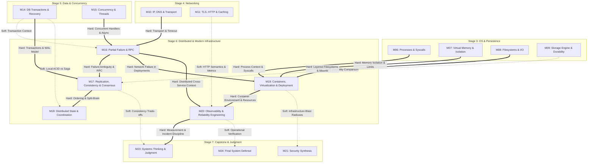

# S6 M16–M20 Distributed Systems & Modern Infrastructure Design Dossier v0.1

Status: **DESIGN PHASE — v0.1 DRAFT FOR LEAD REVIEW**
Canonical Base: `95735d960ca352a5484c5786200e412f4719993f`
Research Authority: `research/distributed-modern-infra-m16-m20-v0.1.md @ 5cc18a3dd19e18b6b99609aba6f206035dc8410e`
Tracking Issue: GitHub Issue #99
Design Date: **2026-09-05**
Role: Local Executor — Curriculum Architecture, Learner Contract, Activity Contract, and Evidence Architecture Designer for Stage 6
Scope Gate: **Design phase only**; strictly zero learner-facing Lesson markdown files, runnable learner fixtures/code implementations, Concept Registry modifications, Blueprint DAG redesigns, or self-promotions to `VERIFIED`/`RELEASED`.

---

## 1. Executive Design Decision & Readiness

### Recommendation: **READY FOR LESSON / ACTIVITY IMPLEMENTATION**

This Design Dossier establishes the complete architectural, pedagogical, technical, environmental, experimental, visual, and verification contract for **Stage 6 (S6) Distributed Systems & Modern Infrastructure**, spanning five canonical modules:

$$\begin{aligned}
\text{M16 (Partial Failure \& RPC)} &\longrightarrow \text{M17 (Replication, Consistency \& Consensus)} \longrightarrow \text{M18 (Distributed State \& Coordination)} \\
&\searrow \\
&\quad \text{M19 (Containers, Virtualization \& Deployment)} \longrightarrow \text{M20 (Observability \& Reliability Engineering)}
\end{aligned}$$

### Core Architectural Commitments

1. **Strict DAG & Module Independence Preserved:**
   - **M16** hard prerequisites: `M10` (IP, DNS & Transport) and `M15` (Concurrency: Threads, Races & Synchronization); soft prerequisite: `M14` (Databases: Transactions).
   - **M17** hard prerequisites: `M16` (Partial Failure & RPC) and `M14` (Transactions, Recovery & Isolation); soft prerequisite: `M09` (Storage Engine & Durable Storage).
   - **M18** hard prerequisite: `M17` (Replication, Consistency & Consensus); soft prerequisite: `M14` (Transactions).
   - **M19** hard prerequisites: `M16` (Partial Failure & RPC), `M06` (Processes & Syscalls), `M07` (Virtual Memory & Isolation), and `M08` (Files, Filesystems & System I/O); soft prerequisites: none.
   - **M20** hard prerequisites: `M19` (Containers & Deployment) and `M16` (Partial Failure & RPC); soft prerequisite: `M11` (TLS, HTTP & Caching).
   - **Intrastage Modularity:** `M19` does **not** depend on `M17` or `M18`. Distributed state consensus (`M17`) and message queues (`M18`) are decoupled from single-host container mechanisms and virtualization (`M19`). The stage narrative does not introduce artificial hard DAG edges.
2. **Concept Registry Discipline (Zero New IDs):**
   - Exactly **18 canonical Concept IDs** in `meta/CONCEPT_REGISTRY.md` are preserved. Zero new concept IDs are created.
   - **EC-CON-014 Consistency (一致性):** Preserved in its canonical first home at `M14/L14-02`. Revisited in `M17` (linearizability vs. eventual consistency across replicas) and `M18` (ordering and delivery guarantees). Must always be qualified by the named guarantee.
   - **EC-CON-015 Concurrency (并发):** Preserved in its canonical first home at `M15/L15-01`. Revisited in `M16`–`M18` and `M20` as overlapping progress across physical network boundaries with non-zero delay.
   - **Consensus Concept:** Remains Core at `M17/L17-02` per Blueprint disposition R10. Assigning a stable Registry ID remains deliberately deferred.
   - **EC-CON-018 Process (进程):** Preserved in its canonical first home at `M06/L06-01`. Revisited in `M16` (remote process boundary) and `M19` (container as host process under namespace/cgroup constraints).
   - **Mechanism Terminology:** *RPC, Replication, Quorum, Raft, Queue, Broker, Outbox, Saga, 2PC, Container, Namespace, Cgroup, OCI, OverlayFS, Metrics, Logs, Traces, SLO* are designated as concrete mechanisms, architectural patterns, or replaceable Current Cases; none are promoted to Concept IDs.
3. **Core Restraint & Heavy Dependency Elimination:**
   - **M17 Core Boundary:** Strictly **no required runnable 3-node distributed service** and **no required Raft/Paxos implementation**. Core evidence is established via bounded state/message/failure worked traces, failure scenario evaluation, and Source Expedition `EXP-05` (MIT 6.033).
   - **M18 Broker-Neutrality:** No Kafka, RabbitMQ, Redis, or cloud queue becomes a Core requirement. A course-owned SQLite transactional outbox and worker deduplication fixture cleanly proves delivery semantics, duplicate effects, and idempotency invariants.
   - **M19 Capability-Gated Linux Baseline:** Required baseline uses safe, read-only Linux inspection (`/proc/self/ns`, cgroup hierarchy/controllers, mounts). Privileged operations (`unshare(1)`, writable `/sys/fs/cgroup`, OverlayFS mounts, OOM injection) are strictly capability-gated: if unavailable, the outcome is truthfully recorded as `ENVIRONMENT-BLOCKED / NOT RUN`. Docker/Podman is strictly Optional.
   - **M20 Zero-SaaS Baseline:** Core telemetry requires zero cloud accounts, SaaS backends, or daemon clusters. Standard structured JSON logs, monotonic timers (`time.monotonic()`), and course-owned correlation IDs form the Core contract. OpenTelemetry (`LAB-OPT-04` and `EXP-04`) is strictly Optional.
4. **Authoritative Sources, Rights & Provenance:**
   - `LAB-OPT-02` (Stanford CS144 TCP Receiver): Rights remain unestablished; strictly Optional and link-only with zero vendored code.
   - `EXP-05` (MIT 6.033 Spring 2018): CC BY-NC-SA 4.0; strictly link-and-paraphrase with zero copied figures or text.
   - `EXP-04` & `LAB-OPT-04` (OpenTelemetry Python): Apache-2.0 / CC BY 4.0; pinned and rechecked at release `v1.44.0`.
   - `OQ-BP-006` (Environment Tooling Floors): Explicitly remains **OPEN**.

---

## 2. Canonical Constraints & DAG Architecture

### 2.1 Stage 6 Structural DAG



### 2.2 Reconciled Lesson Inventory (12 Lessons)

The canonical lesson set established in `meta/blueprint/core-stage-module-lesson-map-v0.1.md` §8 is preserved without additions, splits, or renumbering:

| Module | Lesson ID | Canonical Title | Primary Competencies | Canonical Concepts Handled |
|---|---|---|---|---|
| **M16** | `L16-01` | "What is different about many machines?" | Trace, Explain, Judge | `EC-CON-010 Failure`, `EC-CON-002 Abstraction`, `EC-CON-018 Process` |
| **M16** | `L16-02` | "How do I call a remote function safely?" | Trace, Judge, Explain | `EC-CON-005 Interface`, `EC-CON-008 Invariant`, `EC-CON-003 Representation`, `EC-CON-007 Specification` |
| **M17** | `L17-01` | "How do I keep data safe across machines?" | Judge, Explain | `EC-CON-016 Durability`, `EC-CON-006 Trade-off`, `EC-CON-011 Caching` |
| **M17** | `L17-02` | "How do machines agree?" | Explain, Trace, Judge | Consensus concept (ID deferred), `EC-CON-008 Invariant`, `EC-CON-009 Correctness` |
| **M17** | `L17-03` | "How consistent is 'strong enough'?" | Judge, Explain | `EC-CON-014 Consistency`, `EC-CON-006 Trade-off`, `EC-CON-013 Isolation` |
| **M18** | `L18-01` | "How do services delegate work?" | Judge, Explain, Trace | `EC-CON-010 Failure`, `EC-CON-008 Invariant`, `EC-CON-014 Consistency` |
| **M18** | `L18-02` | "Do I need a distributor?" | Judge, Explain | `EC-CON-006 Trade-off`, `EC-CON-015 Concurrency`, `EC-CON-009 Correctness` |
| **M19** | `L19-01` | "What is a container?" | Trace, Explain, Judge | `EC-CON-013 Isolation`, `EC-CON-018 Process`, `EC-CON-002 Abstraction` |
| **M19** | `L19-02` | "What does 'the cloud' actually mean?" | Explain, Judge, Estimate | `EC-CON-006 Trade-off`, `EC-CON-010 Failure`, `EC-CON-017 Trust Boundary` |
| **M19** | `L19-03` | "How does code get to production?" | Explain, Judge, Diagnose | `EC-CON-010 Failure`, `EC-CON-007 Specification`, `EC-CON-017 Trust Boundary` |
| **M20** | `L20-01` | "How do I know the system is OK?" | Observe, Diagnose, Judge | `EC-CON-009 Correctness`, `EC-CON-006 Trade-off`, `EC-CON-010 Failure` |
| **M20** | `L20-02` | "How do I debug a production incident?" | Diagnose, Observe, Explain | `EC-CON-010 Failure`, `EC-CON-009 Correctness`, `EC-CON-015 Concurrency` |

---

## 3. Research Findings Adopted, Rejected & Bounded

### 3.1 Adopted Research Findings
1. **Deterministic Local Fault Injection:** M16 hands-on utilizes an in-process / localhost application-level delay and suppression shim. This cleanly creates caller-alive remote ambiguity without requiring raw packet sniffing or elevated network privileges.
2. **Quorum Overlap Mathematics ($W + R > N$):** Taught strictly as a set-intersection principle via the Pigeonhole Principle. Overlap guarantees that at least one replica in the read quorum witnessed the write quorum; it **does not alone prove linearizability or latest-value read**.
3. **Broker-Neutral Durable Handoff:** M18 utilizes the Transactional Outbox pattern implemented with a local SQLite table (`BEGIN IMMEDIATE`) and a worker deduplication table (`UNIQUE` constraint on `msg_id`). Proves delivery guarantees and duplicate mitigation without external message daemon overhead.
4. **Safe Linux Mechanism Baseline:** M19 establishes `/proc/self/ns/*` reading and `/sys/fs/cgroup` controller detection as the mandatory Core baseline. Privileged actions are capability-gated.
5. **Clock Semantics Distinction:** Resolves the DAG hidden-prerequisite flag in M20. Wall clock (`CLOCK_REALTIME`) is used for calendar timestamps; monotonic clock (`CLOCK_MONOTONIC` / `perf_counter()`) is mandatory for elapsed durations and timer calculations.
6. **W3C Trace Context Level 1:** Formally adopted as the stable distributed context propagation specification (`traceparent`, `tracestate`). Level 2 draft status is explicitly noted.

### 3.2 Rejected Claims & Universal Truth Traps
1. **Rejected: Fixed Timeout Constants.** No rule states "web requests must time out at 5 seconds." Timeouts are local stopping decisions based on workload deadlines and upstream SLAs.
2. **Rejected: Timeless Retry Formula.** Retrying 3 times with exponential backoff is not an industry constant. Unconditional retries cause retry storms and cascading service collapse.
3. **Rejected: Transport Success = Business Durability.** Receiving a TCP ACK or HTTP `200 OK` does not prove durable disk commitment or application success.
4. **Rejected: Overlap = Linearizability.** Quorum intersection ($W + R > N$) alone does not prevent stale reads during concurrent, failed, or partial writes.
5. **Rejected: CAP as "Pick Two".** Network partitions are a physical reality, not a configuration option. The true trade-off is Consistency vs. Availability *given* a partition.
6. **Rejected: Raft Timeout "Beats" FLP.** Randomized election timeouts reduce election collisions in practical networks; they do not mathematically disprove FLP impossibility under asynchronous assumptions.
7. **Rejected: Unbounded "Exactly-Once" Delivery.** An exactly-once claim is meaningful only inside a named transactional/idempotency/deduplication scope. Transport or broker delivery labels alone cannot guarantee arbitrary external business side effects.
8. **Rejected: Containers are VMs.** Containers share the host kernel. Namespaces partition resource views; cgroups enforce resource limits; neither constitutes a hardware security boundary.
9. **Rejected: Fixed Cloud / Telemetry Costs.** Cardinality overhead, container startup times, cloud latency, and storage pricing are dynamic and environment-specific.

---

## 4. Recommended S6 Implementation Batches

To manage implementation complexity, isolate environment risk, and ensure rapid, high-confidence review cycles, Stage 6 is divided into **five sequential, bounded implementation batches**:

```
+-----------------------------------------------------------------------------------+
| Batch S6-B1: M16 Distributed Foundations (RPC, Partial Failure & Idempotency)     |
| - Lessons: L16-01, L16-02                                                         |
| - Fixture: Localhost RPC client/server with application-level delay shim          |
| - Optional Lab: LAB-OPT-02 (Stanford CS144 Checkpoint 2) link-only disposition    |
+-----------------------------------------------------------------------------------+
                                          |
                                          v
+-----------------------------------------------------------------------------------+
| Batch S6-B2: M17 Replicated State, Quorums & Consensus                            |
| - Lessons: L17-01, L17-02, L17-03                                                 |
| - Fixture: Bounded state/message/failure worked traces (NO runnable 3-node svc)   |
| - Source Expedition: EXP-05 (MIT 6.033 Replication & Logging Case) reading card   |
+-----------------------------------------------------------------------------------+
                                          |
                                          v
+-----------------------------------------------------------------------------------+
| Batch S6-B3: M18 Distributed State, Delivery Semantics & Coordination             |
| - Lessons: L18-01, L18-02                                                         |
| - Fixture: Broker-neutral SQLite Transactional Outbox & Worker Deduplication      |
| - Scenarios: Saga compensating transaction vs. 2PC blocking uncertainty trace     |
+-----------------------------------------------------------------------------------+
                                          |
                                          v
+-----------------------------------------------------------------------------------+
| Batch S6-B4: M19 Containers, Virtualization & Deployment                          |
| - Lessons: L19-01, L19-02, L19-03                                                 |
| - Fixture: Read-only Linux namespace/cgroup inspector + capability-gated mutation |
| - Scenarios: Rolling deployment version-skew simulation & rollback evaluation     |
+-----------------------------------------------------------------------------------+
                                          |
                                          v
+-----------------------------------------------------------------------------------+
| Batch S6-B5: M20 Observability, Clock Semantics & Incident Engineering            |
| - Lessons: L20-01, L20-02                                                         |
| - Fixture: Structured logs, monotonic timers & course correlation ID engine       |
| - Controlled Incident: Downstream delay injection, SLO burn, and postmortem       |
| - Optional Lab / EXP: LAB-OPT-04 & EXP-04 (OpenTelemetry Python v1.44.0 route)    |
+-----------------------------------------------------------------------------------+
```

### Rationale for Five Batches
1. **Coupling & Dependencies:** M16 must precede M17 and M19. M17 directly feeds M18. M19 directly feeds M20.
2. **Environment Risk Isolation:** M16, M17, M18, and M20 require only a standard Python runtime and local SQLite. M19 is the only batch dependent on Linux host capabilities (`/proc`, cgroups). Isolating M19 into its own batch prevents OS-specific blockers from contaminating distributed systems logic.
3. **Review Load:** Each batch contains 2 to 3 lessons, one dedicated fixture/worksheet, and clear verification exit criteria, ensuring reviewability without cognitive overload.

---

## 5. Module M16 Architecture — Distributed Systems Foundations: Partial Failure & RPC

### 5.1 Module Purpose & Capability Transition
- **Purpose:** Shift the learner's mental model from the deterministic single-machine execution world (where function calls return or crash the calling process) to the distributed world characterized by **independent failure**, **unbounded network latency**, and **caller-alive remote ambiguity**.
- **Capability Gain:** Learners transition from naive network callers to engineers capable of designing resilient remote interfaces using timeouts, bounded retries with jitter, and idempotent operation contracts with deduplication boundaries.

### 5.2 Module Constraints & Invariants
- **Fault Injection Boundary:** The fault injection shim operates strictly at the **application layer** (simulated delays, dropping responses in memory). It must never be mislabeled as literal packet loss or physical network cable disconnection.
- **No Timeless Constants:** Forbid fixed timeout, retry, backoff, or latency numbers. All parameters must be passed as explicit configurations.
- **Transport vs. Application Result:** A transport acknowledgment indicates byte receipt by the operating system stack; it is not proof of application processing or durable storage.

---

## 6. Lesson L16-01 Design — “What is different about many machines?”

### 1. Purpose / Target Mental Model
Transition from synchronous, local in-process calls to distributed interactions where caller and callee have independent life cycles. Master the **Fundamental No-Response Ambiguity**: when silence occurs, the caller cannot deduce whether the request was lost, the server crashed before running, the server completed execution but the reply was lost, or the server is simply still executing.

### 2. Prerequisites
- Module entry: **Hard** `M10`, `M15`; **Soft** `M14`.
- Canonical lesson predecessors: `L10-02`, `L15-01`.

### 3. Primary Competencies
- `Trace`: Follow a remote call across client socket, outbound flight, server execution, and inbound return.
- `Explain`: Explain why a client cannot distinguish network loss from remote server slowness or crash from silence alone.
- `Judge`: Evaluate failure possibilities when a local process remains alive after a remote deadline expires.

### 4. Canonical Concept First-Home vs. Revisit
- Canonical Revisits:
  - `EC-CON-010 Failure (故障)`: Distributed partial failure where caller stays healthy while callee state is unknown.
  - `EC-CON-002 Abstraction (抽象)`: The leaky abstraction of attempting to make remote calls look like local function calls.
  - `EC-CON-018 Process (进程)`: Independent address spaces across physically separated hosts.
  - `EC-CON-015 Concurrency (并发)`: Concurrency coupled with independent physical clocks and non-zero transit time.

### 5. Learning Outcomes
- Contrast local function failure (process crash, exception propagation) with distributed partial failure.
- Enumerate the 4 mutually indistinguishable states when a client observes a timeout.
- Calculate back-of-the-envelope availability for a serial chain of independent services:
  $$A_{\text{total}} = \prod_{i=1}^{k} A_i$$
- Conclude that network delay is fundamentally unbounded in asynchronous networks.

### 6. Stable Principle
In an asynchronous network, silence across a network boundary does not reveal the state of the remote machine. A local timeout is an erasure of client waiting, not an erasure of remote execution.

### 7. Specification vs. Implementation vs. Current-Practice Boundaries
- *PRINCIPLE:* The Two Generals problem; asynchronous network timing model (unbounded latency); independent failure domains.
- *SPECIFICATION / PROTOCOL:* Socket receive-timeout interfaces and TCP retransmission behavior are separate mechanisms; RFC 6298 TCP retransmission timing must not be presented as the application RPC deadline.
- *IMPLEMENTATION:* Python `socket.settimeout()` / timeout exception behavior is runtime- and platform-observed evidence; exact errno/exception details are recorded rather than assumed.
- *CURRENT PRACTICE:* HTTP/RPC client deadlines are workload- and service-contract choices; no default duration is a course constant.

### 8. Required Distinctions / Misconceptions
- *Misconception:* "A timeout means the request failed on the server." (False: the server may have completed the operation and committed state changes).
- *Misconception:* "Local function calls and remote RPCs can have identical semantics." (False: network latency, partial failure, memory boundaries, and pointer invalidity inherently leak).
- *Distinction:* Network partition vs. node crash vs. garbage collection pause.

### 9. Worked Example
A client initiates a fund transfer under a scenario-chosen deadline. The server receives the request, commits the transfer, but the reply is not observed by the client before that deadline. The client records a local timeout outcome. From silence alone, the client cannot distinguish this from a request that never reached execution; the example does not prescribe a universal timeout value or a unique network root cause.

### 10. Bounded Hands-On / Observation
Run a two-process Python test over localhost. A course-owned **application-layer** shim uses a scripted case where the configured response delay is greater than the configured client deadline. The learner records the actual configuration and observes a local timeout-class outcome while the server records completion of the same request ID. The fixture must not call this literal packet loss or require fixed millisecond constants.

### 11. Evidence to Record
- Timestamp of client request dispatch.
- Client deadline configuration plus the observed timeout/exception class or client outcome.
- Timestamp of server execution completion.
- Comparison showing server completed the work *after* the client abandoned the call.

### 12. PASS / BLOCKED / NOT RUN Conditions
- **PASS:** The client records a timeout-class outcome for the scripted case and the server evidence independently confirms completion of the same request ID after the client stopped waiting.
- **BLOCKED:** Localhost port cannot be bound, or Python socket creation fails due to local OS firewall.
- **NOT RUN:** Python runtime unavailable.

### 13. Progressive Support
- *Question:* If you retry immediately after a timeout, what happens on the server?
- *Hint 1:* Look at the server terminal. Did the server stop running when your client timed out?
- *Hint 2:* A client timeout is purely local; the remote server has no idea the client gave up unless cancellation is explicitly transmitted.
- *Expected Observation:* The original request may still complete after the client stops waiting. Whether a retry is safe, and whether it creates a duplicate effect, is deferred to `L16-02` rather than assumed here.

### 14. Required Visuals
- Visual ID: `FIG-M16-01`
- Title: "The Four States of Remote Silence"
- Layout: Swimlane diagram showing Client, Network Inbound, Server, Network Outbound, illustrating: (1) lost in transit, (2) server crash before execution, (3) response lost after execution, (4) delayed in queue.

### 15. Stopping Point
Stop when the learner clearly states why remote silence cannot be resolved without an agreed application-level protocol.

### 16. Cleanup / Reset
Terminate server child process; release bound TCP port; delete temporary log files.

### 17. Volatile Claims That Must Remain Environment-Specific
Exact loopback latency (microseconds), exact OS error codes, and thread scheduling variations.

### 18. Source / Currentness Rechecks Required at Implementation
Recheck the selected Python runtime socket-timeout documentation plus any POSIX/Linux socket interface material used; preserve the distinction between application deadlines and TCP retransmission behavior.

---

## 7. Lesson L16-02 Design — “How do I call a remote function safely?”

### 1. Purpose / Target Mental Model
Master the construction of resilient remote interfaces. Every RPC must define what happens after ambiguity: the policy may be **no retry**, a bounded retry, or a caller escalation. Where retries are justified, backoff/jitter is a policy choice; duplicate-effect safety may come from natural idempotency, an idempotency key/dedup record, or another explicitly named contract.

### 2. Prerequisites
- Module entry: **Hard** `M10`, `M15`; **Soft** `M14`.
- Canonical lesson predecessor: `L16-01`.

### 3. Primary Competencies
- `Trace`: Trace a retried request carrying an idempotency key through server deduplication cache.
- `Judge`: Determine whether an operation is naturally idempotent or requires synthetic idempotency keys and retention windows.
- `Explain`: Explain why an ambiguous mutation retry needs an explicit retry-safety contract and how the chosen mechanism bounds duplicate effects.

### 4. Canonical Concept First-Home vs. Revisit
- Canonical Revisits:
  - `EC-CON-005 Interface (接口)`: RPC interface contracts, parameter marshaling, and error boundaries.
  - `EC-CON-008 Invariant (不变量)`: Apply the mathematical idempotence analogy carefully, then state the actual systems invariant under a named API contract: duplicate attempts must not create additional **intended** side effects solely because the request was retried.
  - `EC-CON-003 Representation (表示)`: On-wire serialization formats (JSON, Protobuf) across machine architectures.
  - `EC-CON-007 Specification (规格)`: Operation guarantees under retry and duplicate delivery conditions.

### 5. Learning Outcomes
- Formulate the mathematical and systems definitions of idempotency.
- Explain why an **ambiguous mutation** cannot be retried safely without a named retry-safety contract; distinguish this from a read or a failure known to occur before dispatch.
- Evaluate exponential backoff with full jitter as one current-practice option and, if implemented, parameterize its cap/base/seed rather than teaching one formula as universally optimal.
- Explain how retry budgets, deadlines, and cancellation propagation can limit amplification in deep call graphs; do not claim every architecture requires the same mechanism.
- Design an idempotency-key deduplication store with an explicit retention/eviction boundary.

### 6. Stable Principle
Retrying an ambiguous mutation can duplicate intended side effects unless the operation has an explicit retry-safety contract. When an idempotency-key table is the chosen mechanism, the key/dedup state and protected business mutation must be coupled atomically within the stated storage boundary.

### 7. Specification vs. Implementation vs. Current-Practice Boundaries
- *PRINCIPLE:* Birrell & Nelson (1984) RPC semantics; Saltzer et al. (1984) end-to-end arguments.
- *SPECIFICATION:* RFC 9110 defines safe methods as idempotent and also specifies `PUT` and `DELETE` as idempotent methods. `POST` is **not specified as idempotent by the method semantics**, but an application can still design a POST operation to be retry-safe with an explicit contract.
- *IMPLEMENTATION:* Application-level deduplication table (`idempotency_keys` table with primary key).
- *CURRENT PRACTICE:* IETF `draft-ietf-httpapi-idempotency-key-header-07` (expired draft; useful reference pattern, not an RFC); Stripe/AWS API idempotency headers.

### 8. Required Distinctions / Misconceptions
- *Misconception:* "Idempotency means the server returns the exact same HTTP response byte-for-byte." (False: idempotency guarantees that repeated execution produces no additional intended side effects; headers or timestamps may differ).
- *Misconception:* "An idempotency key protects state forever." (False: the API must define a retention/eviction boundary; many systems use finite retention, and once dedup state is unavailable a sufficiently late duplicate can execute again).
- *Distinction:* Natural idempotency (setting an absolute value: `status = 'ACTIVE'`) vs. Synthetic idempotency (idempotency key for relative updates: `balance = balance - 10`).

### 9. Worked Example
A banking client calls `POST /transfers` with `{"from": "Alice", "to": "Bob", "amount": 50}`. The server applies the debit and credit, but the network drops the confirmation. The client retries 3 times. Without an idempotency key, Bob receives \$200 instead of \$50. With `Idempotency-Key: req-uuid-12345`, the server checks its atomic table, identifies the key as already executed, skips the transfer logic, and returns the cached confirmation of the initial \$50 transfer.

### 10. Bounded Hands-On / Observation
A Python script implements a counter service with a scripted response-suppression/delay schedule. The learner configures a bounded total-attempt count and records the actual number of server-side business executions.
- *Step 1 (Unsafe):* Run without duplicate protection. Verify that the final counter equals the number of business executions actually performed and is greater than one in the duplicate scenario.
- *Step 2 (Safe):* Attach an `idempotency_key` and use a single SQLite transaction that claims the key and applies the protected increment. Verify that multiple attempts create only one intended increment within this course-owned SQLite scope.

### 11. Evidence to Record
- Table of attempts: attempt number, calculated backoff delay (ms), injected delay (ms), client outcome, server counter value.
- Proof of one intended counter increment under the explicitly scoped SQLite deduplication transaction; do not generalize this to arbitrary exactly-once external effects.

### 12. PASS / BLOCKED / NOT RUN Conditions
- **PASS:** Unsafe run shows counter $>1$; safe run shows counter $=1$ across multiple retried attempts.
- **BLOCKED:** SQLite locking error or permission failure writing temporary database file.
- **NOT RUN:** Python interpreter unavailable.

### 13. Progressive Support
- *Question:* If two identical retries arrive at the server simultaneously, how do you prevent both from executing?
- *Hint 1:* Look at how database constraints work.
- *Hint 2:* Use a course-owned transaction in which claiming the unique idempotency key and applying the business mutation are one atomic unit; each worker uses its own SQLite connection/transaction.
- *Expected Observation:* Only one transaction can establish the key and protected effect. Concurrent duplicates either observe the committed key or take the fixture's defined conflict/retry path; do not rely on a fixed SQLite error string or on the claim that a unique-constraint failure itself “waits.”

### 14. Required Visuals
- Visual ID: `FIG-M16-02`
- Title: "Retry Amplification vs. Jittered Backoff & Idempotency"
- Layout: Top panel: Call tree $A \to B \to C \to D$ showing multiplicative retry explosion. Bottom panel: Timeline showing client retry with exponential jittered sleep and server deduplication lookup.

### 15. Stopping Point
Stop when the learner can successfully design an idempotent API endpoint and explain the retention window trade-off.

### 16. Cleanup / Reset
Remove temporary SQLite database file `m16_idempotency.db`; reset client retry counters.

### 17. Volatile Claims That Must Remain Environment-Specific
Specific backoff base/max milliseconds, system jitter random seeds, and exact HTTP header names.

### 18. Source / Currentness Rechecks Required at Implementation
Recheck status of IETF Idempotency-Key draft and AWS Architecture Blog backoff/jitter recommendations.

---

## 8. M16 Hands-On Fixture Contract — Localhost RPC, Partial-Failure Shim & Idempotency

### 8.1 Fixture Specifications
- **Name:** `s6_m16_rpc_fixture.py`
- **Location:** `stage6/m16_rpc/`
- **Dependencies:** Python 3 standard library only (`socket`, `threading`, `sqlite3`, `time`, `json`, `uuid`, `random`).
- **Architecture:**
  - `RPCServer`: Binds to `127.0.0.1` on an ephemeral OS-assigned port (`port=0`). Runs a bounded worker set with explicit shutdown/join ownership.
  - `FaultShim`: Intercepts inbound calls and outbound responses. Supports scriptable fault behaviors:
    - `DELAY_RESPONSE(ms)`: Delays response delivery after execution.
    - `DROP_RESPONSE`: Silently suppresses response after execution.
    - `DELAY_REQUEST(ms)`: Delays request before server execution.
    - `DROP_REQUEST`: Drops request before server receives it.
  - `RPCClient`: Dispatches requests with configurable deadline/total-attempt budget and a named retry policy (`NO_RETRY`, deterministic scripted retry, or an optional jittered-backoff comparison).
  - `IdempotencyStore`: Uses one SQLite connection per worker transaction; key claim and protected business mutation commit or roll back together.

### 8.2 Execution Safety & Clean Reset
- The server binds only to localhost (`127.0.0.1`).
- Server threads are explicitly shut down and joined; daemon-thread interpreter exit is **not** accepted as cleanup evidence.
- The whole fixture runs under a configurable, course-owned subprocess watchdog that may terminate/reap only the fixture process tree if the normal shutdown bound is exceeded. The watchdog value is a safety parameter, not a networking lesson constant.
- The fixture cleans up all created SQLite files upon completion.

---

## 9. Optional Lab Disposition: LAB-OPT-02 — Stanford CS144 Checkpoint 2 (TCP Receiver)

### 9.1 Status & Provenance Gate
- **Status:** Strictly **OPTIONAL / RIGHTS-GATED / LINK-ONLY**.
- **Source:** Stanford CS144 (Introduction to Computer Networking), Fall 2025 Checkpoint 2 (`check2.pdf`).
- **Copyright & Licensing:** Course materials authored by Philip Levis and Keith Winstein. Redistribution rights for starter code and test harness remain **unestablished**.
- **Repository Policy:** Essential CS vendors **zero** CS144 source code, headers, build scripts, or assignment text.

### 9.2 Pedagogical Role & Stopping Point
- **Placement:** Bridges transport stream assembly (`M10`) with distributed byte stream expectations (`M16`).
- **Core Concept Illustrated:** Byte-stream reassembly, sequence space wrapping ($2^{32}$ unsigned 32-bit integer arithmetic), and 64-bit absolute sequence index unwrapping.
- **Stopping Point:** **Only if** the learner independently obtains an authorized Stanford starter/test route under the still-unresolved rights gate, stop at the selected Checkpoint 2 receiver slice and its local tests. Until that route is confirmed at implementation time, Essential CS provides only the external link plus original conceptual/prediction prompts—no copied assignment instructions, starter, or tests.

---

## 10. Module M17 Architecture — Replication, Consistency & Consensus

### 10.1 Module Purpose & Capability Transition
- **Purpose:** Explore how to maintain correct, available, and durable state across multiple independent physical machines. Address the fundamental conflict between network partitions, replica divergence, and consistency guarantees.
- **Capability Gain:** Learners transition from single-node persistence reasoning (`M09`, `M14`) to distributed state reasoning. They master quorum arithmetic ($W + R > N$), evaluate CAP trade-offs truthfully without "pick-two" fallacies, and understand consensus safety invariants without getting trapped in complex multi-node daemon operations.

### 10.2 Mandatory Core Boundaries
- **NO RUNNABLE 3-NODE SERVICE REQUIRED:** Essential CS does not require learners to deploy or debug live ZooKeeper, etcd, or Consul clusters.
- **NO RAFT/PAXOS IMPLEMENTATION REQUIRED:** Core exit criteria rely on structured state/message worked traces and scenario-based invariant verification. Implementation is strictly reserved for Deep Dive.

---

## 11. Lesson L17-01 Design — “How do I keep data safe across machines?”

### 1. Purpose / Target Mental Model
Understand why data is replicated across machines (availability, latency, durability) and the price paid in replication lag and coordination overhead. Master leader-follower topologies, synchronous vs. asynchronous replication trade-offs, and quorum overlap mathematics ($W + R > N$).

### 2. Prerequisites
- Module entry: **Hard** `M16`, `M14`; **Soft** `M09`.
- Canonical lesson predecessor refinement: `L16-01`, `L09-01`.

### 3. Primary Competencies
- `Judge`: Evaluate synchronous vs. asynchronous replication policies against latency and durability requirements.
- `Explain`: Explain why quorum intersection guarantees overlap but does not alone guarantee linearizability.


### 4. Canonical Concept First-Home vs. Revisit
- Canonical Revisits:
  - `EC-CON-016 Durability (持久性)`: Durability defined across machine loss boundaries, contrasting local disk sync with multi-node replication.
  - `EC-CON-006 Trade-off (权衡)`: Latency vs. durability in replication acknowledgment policies.
  - `EC-CON-011 Caching (缓存)`: Stale replica reads functioning as uncoordinated read caches.

### 5. Learning Outcomes
- Contrast Single-Leader, Multi-Leader, and Leaderless replication topologies.
- Diagram the replication lag window in asynchronous replication and define the failover data-loss window.
- Apply the Pigeonhole Principle to prove that $W + R > N$ guarantees read-write quorum intersection:
  $$(W + R) - N \ge 1$$
- Explain why quorum overlap alone is insufficient to guarantee reading the latest value without explicit versioning and conflict resolution.

### 6. Stable Principle
Replication is not automatic durability. Acknowledgment policy moves latency, availability, and acknowledged-write durability under a named failure model; “synchronous” and “asynchronous” do not imply one universal trade-off magnitude. Quorum overlap proves set intersection, not data freshness.

### 7. Specification vs. Implementation vs. Current-Practice Boundaries
- *PRINCIPLE:* Quorum systems (Gifford 1979); Pigeonhole Principle set intersection; synchronous vs. asynchronous coordination bounds.
- *SPECIFICATION:* No cross-product replication specification is assumed. Any named product guarantee must be read from that product's current contract/documentation.
- *IMPLEMENTATION:* PostgreSQL streaming-replication / `synchronous_commit`, MySQL semi-sync/binlog behavior, and Dynamo-style read repair are separate implementation/current-case examples.
- *CURRENT PRACTICE:* Managed replication offerings are optional cases whose acknowledgment, failover, and billing guarantees must be rechecked rather than generalized.

### 8. Required Distinctions / Misconceptions
- *Misconception:* "Replicating data to 3 machines means zero data loss is guaranteed." (False: asynchronous replication acknowledges before follower writes, causing loss upon leader crash).
- *Misconception:* "Quorum $W + R > N$ means the system is linearizable." (False: concurrent writes, partial writes, or lack of read-repair/tie-breaking can return stale or conflicting data).
- *Distinction:* Replication lag vs. Network latency vs. Disk write latency.

### 9. Worked Example
A 3-replica **worked model** uses $N=3, W=2, R=2$ and a course-defined logical version order. Replicas 1 and 2 acknowledge completed version `v2`; Replica 3 still holds `v1`. A later read set includes one `v2` and one `v1`. Quorum overlap guarantees that at least one read replica intersects the completed write quorum, but the worksheet must separately apply its named logical-version/conflict rule before selecting a value. Physical wall-clock timestamps are not used as the generic version oracle.

### 10. Bounded Hands-On / Observation
Learners complete a structured interactive replication worksheet. They trace a sequence of writes and reads across 3 logical replicas under a simulated network partition separating Node 3 from Nodes 1 and 2. They evaluate read outcomes under $(W=2, R=2)$ vs. $(W=1, R=1)$ and identify stale read anomalies.

### 11. Evidence to Record
- Completed state matrix showing replica log values at step $T_1, T_2, T_3$.
- Quorum intersection verification table demonstrating overlap node identification.
- Narrative identifying why a reader accessing $\{Node 1, Node 3\}$ without versioning can read stale data.

### 12. PASS / BLOCKED / NOT RUN Conditions
- **PASS:** Accurate identification of replica state, quorum overlap nodes, and data-loss risk under leader failover.
- **BLOCKED:** Interactive worksheet parsing or schema validation error.
- **NOT RUN:** Worksheet runner unavailable.

### 13. Progressive Support
- *Question:* In the **simplified availability model** $N=5, W=3, R=3$, with failed replicas simply unavailable and all remaining replicas mutually reachable, how many unavailable replicas still leave a quorum for both operations?
- *Hint 1:* What is the minimum number of reachable replicas required by each operation?
- *Hint 2:* Then name what the arithmetic does **not** model: partition placement, conflicting writes, protocol state, and other shared dependencies.
- *Expected Observation:* Under only those stated assumptions, two unavailable replicas still leave three reachable replicas; this is not a universal cluster-failure-tolerance theorem.

### 14. Required Visuals
- Visual ID: `FIG-M17-01`
- Title: "Quorum Overlap vs. Linearizability Boundary"
- Layout: Venn diagram showing $N=3$ replicas, $W=\{Node 1, Node 2\}$ and $R=\{Node 2, Node 3\}$. Prominently displays the warning banner: **OVERLAP $\ne$ LINEARIZABILITY**.

### 15. Stopping Point
Stop when the learner clearly explains why quorum overlap requires version ordering to yield correct values.

### 16. Cleanup / Reset
Reset worksheet state file; clear temporary trace data.

### 17. Volatile Claims That Must Remain Environment-Specific
Network latency in milliseconds, replica synchronization speed, and cloud replication costs.

### 18. Source / Currentness Rechecks Required at Implementation
Recheck Gifford (1979) citation and PostgreSQL `synchronous_commit` documentation.

---

## 12. Lesson L17-02 Design — “How do machines agree?”

### 1. Purpose / Target Mental Model
Master the fundamental **Consensus Problem** and the accepted crash-failure teaching model. Understand the danger of conflicting leaders/commits and explore how Raft preserves its stated safety invariants under the algorithm's model while liveness depends on additional communication/timing assumptions. Do not generalize the trace to Byzantine faults, arbitrary storage corruption, or “all conditions.”

### 2. Prerequisites
- Module entry: **Hard** `M16`, `M14`; **Soft** `M09`.
- Canonical lesson predecessor: `L17-01`.

### 3. Primary Competencies
- `Explain`: Explain the split-brain hazard and how Raft combines majority voting **with term/vote/log rules** to enforce Election Safety; majority size alone is not the entire proof.
- `Trace`: Trace a Raft leader election and log replication round across 5 logical nodes under a network partition.
- `Judge`: Evaluate the liveness and safety boundaries of consensus algorithms in the context of the FLP impossibility theorem.

### 4. Canonical Concept First-Home vs. Revisit
- Core Concept (Registry ID Deferred):
  - `Consensus (共识)`: Reaching agreement on a single value across independent nodes. Concept is Core; Registry ID deferred per Blueprint reconciliation R10.
- Canonical Revisits:
  - `EC-CON-008 Invariant (不变量)`: Raft Election Safety (at most one leader per term) and Leader Completeness.
  - `EC-CON-009 Correctness (正确性)`: Agreement, Validity, and Termination properties under failure.

### 5. Learning Outcomes
- Define the formal properties of consensus: Agreement, Validity, and Termination.
- State the FLP Impossibility Result (Fischer, Lynch, Paterson 1985) and its precise asynchronous model assumption.
- Explain that Raft safety does not rely on a known fixed message-delay bound, while progress requires a sufficiently stable period in which a quorum can communicate and elections can converge; randomized election timeouts reduce repeated collisions rather than “guarantee liveness by themselves.”
- Trace Raft Leader Election: terms, candidate voting, and the **Log Up-To-Date** rule:
  $$\text{lastTerm}_A > \text{lastTerm}_B \quad \lor \quad (\text{lastTerm}_A = \text{lastTerm}_B \land \text{lastIndex}_A \ge \text{lastIndex}_B)$$
- Demonstrate why two majority quorums must always share at least one node:
  $$\lfloor N/2 \rfloor + 1 + \lfloor N/2 \rfloor + 1 = 2\lfloor N/2 \rfloor + 2 > N$$

### 6. Stable Principle
For the bounded Raft model, preserve the named safety invariants even when progress stops. Majority overlap is necessary to the argument, while term/voting/log rules determine what “leader” and “committed” mean; do not teach the slogan that majority alone makes every form of split-brain impossible.

### 7. Specification vs. Implementation vs. Current-Practice Boundaries
- *PRINCIPLE:* FLP Impossibility Theorem (1985); Paxos (Lamport 1998); Raft (Ongaro & Ousterhout 2014).
- *ALGORITHM / PRINCIPLE:* The Raft paper defines the algorithm and safety properties used by this worked trace; it is not an IETF/ISO-style protocol specification.
- *IMPLEMENTATION:* etcd Raft implementation in Go; HashiCorp Raft library.
- *CURRENT PRACTICE:* Production systems choose voting-set sizes and operational rules according to their own current documentation; no fixed “3 or 5 nodes” rule is a Core invariant.

### 8. Required Distinctions / Misconceptions
- *Misconception:* "Raft randomized election timeouts disprove the FLP theorem." (False: randomized timeouts work in practice because real networks have bounded delays most of the time; in a strictly asynchronous adversary model, consensus cannot guarantee termination).
- *Misconception:* "Adding one more voting replica automatically makes every consensus deployment more available." (False: quorum availability depends on voting-set size, failure/partition placement, and the protocol's reachable-majority requirement; use only the stated worked model.)
- *Distinction:* Safety (bad things never happen) vs. Liveness (good things eventually happen).

### 9. Worked Example
A 5-node cluster $\{A, B, C, D, E\}$. A network partition isolates $\{A, B\}$ from $\{C, D, E\}$. $A$ was the leader in Term 1. In the minority partition, $A$ cannot achieve a majority write quorum ($2 < 3$) and cannot commit new entries. In the majority partition, $C$ times out, increments term to 2, requests votes from $D$ and $E$, wins the election with 3 votes, and becomes leader. The old Term-1 leader in the minority may continue to **believe** it is leader for a time, but it cannot obtain a Term-2 majority or commit new entries. Under the Raft election/commit rules in this worked model, the majority can elect the Term-2 leader without permitting conflicting committed histories.

### 10. Bounded Hands-On / Observation
Learners execute a step-by-step Raft election trace scenario. Given a 5-node cluster with varying log terms and indexes, learners evaluate vote requests:
- Candidate $X$ (Term 2, LastIndex 4, LastTerm 2) requests vote from Node $Y$ (Term 2, LastIndex 5, LastTerm 2). Learner determines that $Y$ denies vote to $X$ because $Y$'s log is more complete.
- For the provided log state, identify the election/commit-quorum overlap **and separately apply** Raft's log-up-to-date voting rule. Do not claim quorum overlap by itself proves Leader Completeness for every history.

### 11. Evidence to Record
- Vote disposition table for all candidates.
- Worked justification identifying the relevant quorum overlap for the provided committed entry and the separate log-up-to-date rule that constrains eligible candidates.

### 12. PASS / BLOCKED / NOT RUN Conditions
- **PASS:** All required vote cases in the bounded worksheet are classified correctly and the learner distinguishes majority-overlap reasoning from the additional Raft log/term rules used by the scenario.
- **BLOCKED:** Scenario definition format error.
- **NOT RUN:** Evaluation engine unavailable.

### 13. Progressive Support
- *Question:* Why does Raft require candidate logs to be at least as up to date as the voter's log before granting a vote?
- *Hint 1:* Where do committed entries live?
- *Hint 2:* If a leader could be elected without the latest committed entries, what would happen to those entries when the new leader overwrites follower logs?
- *Expected Observation:* The up-to-date rule guarantees that any elected leader already contains all entries committed in prior terms.

### 14. Required Visuals
- Visual ID: `FIG-M17-02`
- Title: "Consensus Safety vs. Liveness: Majority Overlap"
- Layout: Diagram of 5 nodes split $2 \mid 3$. Shows minority partition failing to reach quorum ($2/5$) and majority partition successfully reaching quorum ($3/5$) and electing a leader.

### 15. Stopping Point
Stop when the learner can explain Election Safety and committed-history protection in the bounded Raft trace without reducing the proof to “majority overlap alone.”

### 16. Cleanup / Reset
Reset trace state; clear temporary evaluation records.

### 17. Volatile Claims That Must Remain Environment-Specific
Specific election timeout values (e.g., 150ms–300ms) and heartbeat intervals.

### 18. Source / Currentness Rechecks Required at Implementation
Recheck Ongaro & Ousterhout (2014) USENIX ATC paper and etcd Raft documentation.

---

## 13. Lesson L17-03 Design — “How consistent is 'strong enough'?”

### 1. Purpose / Target Mental Model
Navigate the landscape of consistency models. Disambiguate database transaction isolation from multi-node replication consistency. Master **Linearizability** (strong consistency) and **Eventual Consistency**, client-centric models (Read-Your-Writes, Monotonic Reads), and the true nature of the **CAP Trade-off**.

### 2. Prerequisites
- Module entry: **Hard** `M16`, `M14`; **Soft** `M09`.
- Canonical lesson predecessor: `L17-02`.

### 3. Primary Competencies
- `Judge`: Select an appropriate consistency model for a given application domain (e.g., banking vs. social media feed).
- `Explain`: Explain why linearizability requires real-time precedence ordering between operation invocation and response.


### 4. Canonical Concept First-Home vs. Revisit
- Canonical Revisits:
  - `EC-CON-014 Consistency (一致性)`: Replicated system consistency guarantees (linearizability, sequential consistency, eventual consistency). Must be qualified.
  - `EC-CON-006 Trade-off (权衡)`: Consistency vs. availability under network partitions (CAP).
  - `EC-CON-013 Isolation (隔离)`: Transaction concurrency boundaries vs. distributed replica visibility boundaries.

### 5. Learning Outcomes
- Define **Linearizability** formally using operation invocation and response intervals:
  $$\text{op}_1 <_{\text{real-time}} \text{op}_2 \implies \text{op}_1 \text{ serialized before } \text{op}_2$$
- Define **Eventual Consistency** and name what it does *not* guarantee (no bound on convergence time, no monotonic read guarantee).
- Define client-centric consistency models: Read-Your-Writes and Monotonic Reads.
- Articulate the CAP Theorem trade-off correctly: In the presence of a network partition ($P$), a system must choose between serving potentially stale/conflicting data ($A$) or returning an error/blocking ($C$).

### 6. Stable Principle
"Consistent" is meaningless without a named qualifier. Linearizability respects real-time precedence between completed and later-invoked operations. Under the CAP theorem's partition/failure model, a system cannot guarantee both linearizable consistency and availability as defined by that theorem for all requests during the partition.

### 7. Specification vs. Implementation vs. Current-Practice Boundaries
- *PRINCIPLE:* Herlihy & Wing (1990) Linearizability; Gilbert & Lynch (2002) CAP theorem formal proof.
- *MODEL / REFERENCE:* Jepsen consistency-model documentation is a useful explanatory/reference route, not a standards specification. SQL transaction isolation and distributed consistency are separate guarantee families.
- *IMPLEMENTATION:* CockroachDB serializable consensus vs. Cassandra tunable consistency (`LOCAL_QUORUM`).
- *CURRENT PRACTICE:* Cloud datastore consistency documentation (e.g., AWS DynamoDB eventual vs. strongly consistent reads).

### 8. Required Distinctions / Misconceptions
- *Misconception:* "Eventual consistency means data converges in a few milliseconds." (False: the convergence guarantee depends on its stated assumptions—such as updates quiescing and communication/progress resuming—and it supplies no universal time bound. A persistent partition means those progress assumptions may not hold.)
- *Misconception:* "ACID Consistency is the same as CAP Consistency." (False: ACID 'C' means preserving application invariants like non-negative balance; CAP 'C' means linearizability / single-copy visibility).
- *Distinction:* Serializability (a property of concurrent multi-operation transactions) vs. Linearizability (a real-time recency property of single operations on single objects).

### 9. Worked Example
On a **single worksheet timeline** (not separate machine wall clocks), Client $A

### 10. Bounded Hands-On / Observation
Learners analyze 3 execution traces containing multi-client reads and writes:
- Trace 1: Linearizable execution.
- Trace 2: Non-linearizable but sequentially consistent execution.
- Trace 3: Causal anomaly / read-your-writes violation.
Learners label each trace, identify the violating operation pair, and justify their classification against the real-time precedence rule.

### 11. Evidence to Record
- Annotated trace timelines showing invocation/response bounds.
- Explicit violation justification for Traces 2 and 3 citing the precedence condition.

### 12. PASS / BLOCKED / NOT RUN Conditions
- **PASS:** Correct identification and justification of consistency models for all 3 traces.
- **BLOCKED:** Trace file parsing failure.
- **NOT RUN:** Evaluation engine unavailable.

### 13. Progressive Support
- *Question:* If Client $A$ finishes writing at 10:00:01 and Client $B$ starts reading at 10:00:02, why can't we rely on machine clock timestamps to order them?
- *Hint 1:* Look back at `M16`. Do physical machines have perfectly synchronized clocks?
- *Hint 2:* Linearizability relies on external real-time precedence (invocation after response), not unsynchronized local clock timestamps.
- *Expected Observation:* Clock skew between machines makes wall-clock timestamps unreliable for determining causal ordering.

### 14. Required Visuals
- Visual ID: `FIG-M17-03`
- Title: "Linearizability vs. Eventual Consistency Trace Comparison"
- Layout: Two horizontal timelines showing Client A and Client B. Highlights invocation ($[...]$) and response intervals, with a prominent red violation marker where a read returns an older value after a newer write has completed.

### 15. Stopping Point
Stop when the learner correctly explains why CAP is a partition trade-off rather than a "pick two" menu.

### 16. Cleanup / Reset
Reset trace analysis output files.

### 17. Volatile Claims That Must Remain Environment-Specific
Empirical replica convergence time (milliseconds) and vendor SLA percentages.

### 18. Source / Currentness Rechecks Required at Implementation
Recheck Herlihy & Wing (1990) and Gilbert & Lynch (2002) proofs.

---

## 14. M17 Hands-On Worked Trace Contract — Bounded State/Message/Failure Traces

### 14.1 Contract Specifications
- **Name:** `s6_m17_worked_trace.md`
- **Location:** `stage6/m17_replication/`
- **Core Requirement:** **Zero distributed service daemons.** No Docker, no external network ports, no live multi-node processes.
- **Structure:**
  - Standardized state matrix tracking: Logical Nodes $\{N_1, N_2, N_3\}$, Node Roles (Leader, Follower), Log Entries (Index, Term, Value), Commit Index, and Client View.
  - Interactive validation harness: A lightweight Python script verifies learner answers against formal invariance rules (e.g., verifying that a learner's proposed leader election satisfies Raft Log Completeness).

---

## 15. Source Expedition EXP-05 Design — MIT 6.033 Replication, Transactions, Logging Case

### 15.1 Provenance & License Discipline
- **Status:** **ADOPT — LINK AND PARAPHRASE ONLY**.
- **Source:** MIT OpenCourseWare 6.033 (Computer System Design), Spring 2018.
- **Lectures:**
  - Lecture 14: *Fault Tolerance: Reliability via Replication*
  - Lecture 15: *Fault Tolerance: Introduction to Transactions*
  - Lecture 16: *Atomicity via Logging*
- **License Gate:** CC BY-NC-SA 4.0. Essential CS vendors **zero** MIT slide images, diagrams, or verbatim text.

### 15.2 Learner Reading Card & Stopping Point
- **Reading Assignment:** Read MIT 6.033 2018 Lecture 14 notes on Primary-Backup replication and view-change protocols.
- **Guiding Questions:**
  1. How does the Primary-Backup coordinator detect backup failure vs. network partition?
  2. How does the view server prevent both old primary and new primary from executing client requests simultaneously?
- **Stopping Point:** Complete the reading card comparing MIT 6.033's view-server model with Raft's majority election model. No external code compilation.

---

## 16. Module M18 Architecture — Distributed State & Coordination

### 16.1 Module Purpose & Capability Transition
- **Purpose:** Explore asynchronous communication, work delegation, and state coordination across service boundaries. Understand message queues, event logs, delivery semantics, and the limits of distributed transactions.
- **Capability Gain:** Learners transition from synchronous blocking RPC thinking to asynchronous decoupled architectures. They master the Transactional Outbox pattern, idempotent consumers, 2PC blocking limitations, and Saga compensation patterns without requiring external message broker infrastructure.

### 16.2 Broker-Neutrality Commitment
- No Kafka, RabbitMQ, ActiveMQ, or cloud queue (AWS SQS) is a Core requirement.
- Essential CS teaches the **underlying mechanisms**: append-only logs, consumer offsets, at-least-once retries, deduplication, and atomic outbox staging using standard, locally verifiable tools.

---

## 17. Lesson L18-01 Design — “How do services delegate work?”

### 1. Purpose / Target Mental Model
Master asynchronous work delegation. Understand the queue/broker abstraction (decoupling in time, space, and throughput). Deconstruct delivery guarantee claims: **At-Most-Once**, **At-Least-Once**, and the reality of **"Exactly-Once"** (which requires consumer deduplication within a bounded scope). Master the **Transactional Outbox Pattern** to solve the dual-write problem.

### 2. Prerequisites
- Module entry: **Hard** `M17`; **Soft** `M14`.
- Canonical lesson predecessors: `L17-03`, `L16-02`.

### 3. Primary Competencies
- `Judge`: Choose between synchronous RPC, a durable local job table, and a message broker for a given workload.
- `Explain`: Explain why a message broker alone cannot guarantee exactly-once business side effects on external databases.
- `Trace`: Trace an event through the Transactional Outbox: database commit, outbox relay, queue delivery, consumer processing, and deduplication commit.

### 4. Canonical Concept First-Home vs. Revisit
- Canonical Revisits:
  - `EC-CON-010 Failure (故障)`: Duplicate delivery, consumer crashes, and message loss.
  - `EC-CON-009 Correctness (正确性)`: Duplicate-safe consumer behavior and outbox processing must conform to the named delivery/business-effect contract.
  - `EC-CON-014 Consistency (一致性)`: Eventual consistency between producer state and consumer state.

### 5. Learning Outcomes
- Define the queue abstraction and contrast Work Queues (competing consumers) with Partitioned Event Logs (pub-sub).
- Deconstruct the Dual-Write Problem: explain why writing to a database and publishing to a queue in separate uncoordinated operations causes state divergence.
- Implement the Transactional Outbox pattern using local ACID transactions.
- Explain how at-least-once delivery plus a **precisely scoped** idempotency/deduplication transaction can make the selected local business mutation duplicate-safe; do not promote this to an unbounded exactly-once guarantee.
- Differentiate an Event Log from Event Sourcing.

### 6. Stable Principle
A broker delivery label does not prove arbitrary business effects. A duplicate-safe effect requires a named transactional/idempotency/deduplication scope. An uncoordinated dual write has an ambiguity/divergence window; choose an explicit coordination/reconciliation design rather than claiming it is atomic.

### 7. Specification vs. Implementation vs. Current-Practice Boundaries
- *PRINCIPLE:* End-to-End arguments; asynchronous decoupled messaging; dual-write impossibility without coordination.
- *SPECIFICATION:* AMQP 0-9-1 / 1.0 specification delivery modes; JMS specification.
- *IMPLEMENTATION:* SQLite-backed transactional outbox table; POSIX message queues.
- *CURRENT PRACTICE:* Apache Kafka producer idempotency and transactional API; AWS SQS FIFO queues.

### 8. Required Distinctions / Misconceptions
- *Misconception:* "Kafka guarantees exactly-once delivery to my email service." (False: Kafka's exactly-once semantics apply strictly within its internal topic-to-topic processing loop; external side effects like sending an email or updating an external DB require application deduplication).
- *Misconception:* "Adding a message queue eliminates backpressure." (False: queues buffer bursts but if consumer throughput is lower than average producer throughput, queues grow indefinitely until memory/disk is exhausted).
- *Distinction:* Event Log (storage mechanism) vs. Event Sourcing (architectural pattern where state is derived entirely from event history).

### 9. Worked Example
An e-commerce order service updates an order status to `PAID` and sends a notification.
- *Dual-write failure:* The service updates the DB, but crashes before calling `queue.send()`. The customer is charged, but no fulfillment event is emitted.
- *Outbox solution:* Within a single transaction (`BEGIN IMMEDIATE`), the service updates `orders` and inserts a record into `outbox_events`. An independent relay process reads un-dispatched events from `outbox_events`, sends them to the consumer, and marks them `dispatched`. Even if the relay crashes and resends, the consumer's deduplication table prevents duplicate fulfillment.

### 10. Bounded Hands-On / Observation
Learners run a Python script with an SQLite database.
- Part 1: Simulate dual-write failure under an injected crash. Observe database and queue state divergence.
- Part 2: Implement the Transactional Outbox pattern. Under a scripted relay crash/retry, the worker uses **one local transaction** to claim the `processed_events` key and apply the course-owned fulfillment effect. Verify duplicate-safe behavior inside that stated SQLite transaction scope.

### 11. Evidence to Record
- Output showing the state divergence under the dual-write failure.
- Recorded outbox/business/consumer state after the duplicate-delivery scenario, plus the learner's explanation of what the local transaction proves and what external effects would remain outside its scope.

### 12. PASS / BLOCKED / NOT RUN Conditions
- **PASS:** Verification that the outbox pattern prevented state divergence and that duplicate deliveries were caught by the worker.
- **BLOCKED:** SQLite file lock or permission error.
- **NOT RUN:** Python interpreter unavailable.

### 13. Progressive Support
- *Question:* Why must the `outbox` table reside in the exact same database as the business entities?
- *Hint 1:* What enables atomicity in single-node databases?
- *Hint 2:* If the outbox table were in a different database, you would face the dual-write problem all over again!
- *Expected Observation:* The course-owned fixture obtains one local atomicity boundary because the business row and outbox row participate in the **same SQLite transaction**. Cross-database atomicity requires some additional protocol/contract and is not inferred here.

### 14. Required Visuals
- Visual ID: `FIG-M18-01`
- Title: "Dual-Write Failure vs. The Transactional Outbox Pattern"
- Layout: Two-panel architectural comparison. Top panel: Service writing to DB and Queue separately with a red crash bolt between them. Bottom panel: Service writing to DB and Outbox Table in a single atomic transaction, with an Outbox Relay feeding the Consumer.

### 15. Stopping Point
Stop when the learner clearly explains why external side effects require consumer deduplication regardless of broker delivery marketing.

### 16. Cleanup / Reset
Remove temporary database `m18_outbox.db`.

### 17. Volatile Claims That Must Remain Environment-Specific
Broker throughput numbers (e.g., messages per second), network delivery latency, and cloud queue pricing.

### 18. Source / Currentness Rechecks Required at Implementation
Recheck Kafka transactional API documentation and transactional outbox industry patterns.

---

## 18. Lesson L18-02 Design — “Do I need a distributor?”

### 1. Purpose / Target Mental Model
Evaluate distributed coordination mechanisms. Understand the limits and blocking hazards of **Two-Phase Commit (2PC)**. Contrast 2PC with the **Saga Pattern** (compensating transactions) and understand the loss of isolation. Master distributed leases and understand why time-based distributed locks fail without **fencing tokens**.

### 2. Prerequisites
- Module entry: **Hard** `M17`; **Soft** `M14`.
- Canonical lesson predecessors: `L18-01`, `M14`.

### 3. Primary Competencies
- `Judge`: Decide whether a multi-service business workflow should use 2PC, a Saga, or eventual consistency.
- `Explain`: Explain why 2PC is a blocking protocol and identify the coordinator failure uncertainty window.
- `Correctness`: Demonstrate how a fencing token prevents split-brain writes caused by distributed lock lease expiry.

### 4. Canonical Concept First-Home vs. Revisit
- Canonical Revisits:
  - `EC-CON-006 Trade-off (权衡)`: ACID consistency across services vs. availability and latency.
  - `EC-CON-015 Concurrency (并发)`: Distributed concurrency without centralized memory; lack of isolation in Sagas.
  - `EC-CON-009 Correctness (正确性)`: Fencing token invariants preventing stale lock holders from corrupting state.

### 5. Learning Outcomes
- Trace the Two-Phase Commit protocol (Prepare $\to$ Vote $\to$ Commit/Abort).
- Identify the 2PC **blocking state**: when a participant votes `YES` and the coordinator crashes, the participant cannot unilaterally commit or abort.
- Design a Saga workflow with compensating transactions and identify the lack of isolation ($I \in \text{ACID}$) anomalies (e.g., dirty reads of intermediate states).
- Deconstruct the time-based distributed lock failure mode (GC pause / network delay causing lease expiration while client still believes it holds the lock).
- Implement a monotonically increasing **Fencing Token** validation check.

### 6. Stable Principle
Coordination protocols move availability/latency/complexity trade-offs. In classic 2PC, a prepared participant can remain unable to decide until the transaction decision is recovered. A lease alone does not prove stale holders cannot act after expiry; storage-validated fencing tokens are one important mitigation pattern, not the only possible coordination design.

### 7. Specification vs. Implementation vs. Current-Practice Boundaries
- *PRINCIPLE:* Gray (1978) 2PC; Garcia-Molina & Salem (1987) Sagas; Kleppmann (2016) fencing tokens.
- *SPECIFICATION:* XA Specification (The Open Group) for distributed transaction processing.
- *IMPLEMENTATION:* Microservice choreography vs. orchestration Sagas.
- *CURRENT PRACTICE:* Redlock algorithm controversy (Kleppmann vs. Sanfilippo); AWS DynamoDB conditional writes.

### 8. Required Distinctions / Misconceptions
- *Misconception:* "A distributed lock with a 30-second TTL guarantees only one client writes to the database." (False: a client GC pause or network stall exceeding 30s allows the lease to expire and another client to acquire it; the first client resumes and corrupts storage unless fenced).
- *Misconception:* "Sagas are distributed transactions with full ACID guarantees." (False: Sagas lack Isolation ($I$); intermediate states are visible to concurrent observers and compensation is semantic, not physical rollback).
- *Distinction:* Orchestrated Saga (central coordinator) vs. Choreographed Saga (event-driven chain).

### 9. Worked Example
Client 1 acquires a distributed lock (Lease = 10s) to write to storage. At second 9, Client 1 enters a 15-second Stop-The-World garbage collection pause. At second 10, the lock service expires the lease. Client 2 acquires the lock (Token = 42) and updates storage. At second 24, Client 1 wakes up, assumes it still holds the lock, and sends its write. Without fencing, Client 1 overwrites Client 2's data. With fencing, storage tracks `highest_token = 42`. Client 1 presents Token = 41, and storage rejects the write with `STALE_TOKEN`.

### 10. Bounded Hands-On / Observation
Learners step through a Python simulation of a 3-step Saga (Create Order $\to$ Reserve Inventory $\to$ Process Payment) where Step 3 fails.
- Learners verify that compensating actions execute in reverse order (Release Inventory $\to$ Cancel Order).
- Learners observe an isolation anomaly: a concurrent reader inspects inventory during the window between Step 2 and Step 3 and observes an intermediate inventory decrement that is later rolled back.

### 11. Evidence to Record
- Saga execution timeline with step outcomes and compensation audit log.
- Fencing token rejection log demonstrating the stale write attempt being blocked by the storage layer.

### 12. PASS / BLOCKED / NOT RUN Conditions
- **PASS:** Correct execution of compensating actions and verification of the fencing token rejection condition.
- **BLOCKED:** Python script execution failure.
- **NOT RUN:** Python interpreter unavailable.

### 13. Progressive Support
- *Question:* Why can't a participant in 2PC just decide to abort if the coordinator doesn't respond after the participant voted `YES`?
- *Hint 1:* What might the coordinator have done right before crashing?
- *Hint 2:* If all other participants voted `YES` and the coordinator sent `COMMIT` to them before crashing, your unilateral abort would violate Agreement!
- *Expected Observation:* Participants in the `PREPARED` state must block because they cannot know whether the decision was commit or abort.

### 14. Required Visuals
- Visual ID: `FIG-M18-02`
- Title: "2PC Blocking State vs. Saga Compensation & Fencing Tokens"
- Layout: Top panel: 2PC message exchange showing participant blocked in `PREPARED` state upon coordinator crash. Middle panel: Saga compensation chain. Bottom panel: Fencing token timeline showing Client 1 GC pause, Client 2 token increment, and Client 1 rejection.

### 15. Stopping Point
Stop when the learner clearly explains why a lease-based distributed lock requires a fencing token at the resource boundary.

### 16. Cleanup / Reset
Reset Saga simulation log; clear temporary evaluation records.

### 17. Volatile Claims That Must Remain Environment-Specific
GC pause durations, lock service timeout milliseconds, and database transaction latencies.

### 18. Source / Currentness Rechecks Required at Implementation
Recheck Gray (1978), Garcia-Molina (1987), and Kleppmann's distributed locking analysis.

---

## 19. M18 Hands-On Fixture Contract — Broker-Neutral Transactional Outbox & Worker Deduplication

### 19.1 Fixture Specifications
- **Name:** `s6_m18_outbox_fixture.py`
- **Location:** `stage6/m18_coordination/`
- **Dependencies:** Python 3 standard library (`sqlite3`, `threading`, `time`, `uuid`, `json`).
- **Architecture:**
  - `Database`: SQLite database with tables:
    - `orders (id TEXT PRIMARY KEY, customer TEXT, status TEXT)`
    - `outbox (id TEXT PRIMARY KEY, event_type TEXT, payload TEXT, dispatched INTEGER)`
    - `processed_events (msg_id TEXT PRIMARY KEY, processed_at TEXT)`
    - `fulfillments (order_id TEXT PRIMARY KEY, state TEXT)` — bounded consumer-side business effect used to prove the dedup transaction scope
  - `Producer`: Executes `BEGIN IMMEDIATE`, writes order, writes outbox event, executes `COMMIT`.
  - `Relay`: Polls `outbox WHERE dispatched = 0`, delivers to worker, sets `dispatched = 1`. Injects artificial duplicate delivery on test runs.
  - `Worker`: Consumes a message using its own SQLite connection. In **one transaction**, it claims `processed_events(msg_id)` and applies a bounded course-owned consumer effect (for example, insert/update a `fulfillments` row). A duplicate takes the fixture's defined existing-key/conflict path and does not reapply that effect. Do not rely on matching one SQLite error string.

### 19.2 Execution Safety & Clean Reset
- Fully self-contained local SQLite file.
- Strict 5-second execution timeout.
- Deterministic cleanup removes `m18_outbox.db` upon test completion.

---

## 20. Module M19 Architecture — Infrastructure: Containers, Virtualization & Deployment

### 20.1 Module Purpose & Capability Transition
- **Purpose:** Demystify modern software execution environments. Deconstruct containers into their native OS mechanisms: Linux **namespaces** (isolation of view) and **control groups** (resource limits and accounting). Contrast processes, containers, and virtual machines. Examine OCI image specifications, cloud failure blast radiuses, and deployment strategies (rolling, blue-green, canary).
- **Capability Gain:** Learners transition from treating containers and the cloud as "magic black boxes" to understanding them as operating system processes executing within configured boundaries on shared kernels, with explicit resource, security, and version-skew constraints.

### 20.2 Linux Capability-Gating & Read-Only Baseline
- **The Core Baseline is Read-Only:** Mandatory Core observation uses safe, read-only Linux inspections:
  - Reading `/proc/self/ns/*` links.
  - Inspecting `/sys/fs/cgroup/` hierarchy and controller availability.
  - Inspecting process status and limits in `/proc/self/status`.
- **Capability-Gated Actions:** Privileged operations (`unshare(1)`, mutating `/sys/fs/cgroup`, mounting OverlayFS, triggering intentional OOMs) must be checked by preflight. If privileges are missing or if running on non-Linux hosts without WSL/VM, the test is recorded truthfully as `ENVIRONMENT-BLOCKED / NOT RUN`.
- **Docker / Podman is strictly Optional.**

---

## 21. Lesson L19-01 Design — “What is a container?”

### 1. Purpose / Target Mental Model
Deconstruct the container illusion. A container is not a virtual machine and has no guest kernel; in canonical Linux, a container is **an ordinary host process running with restricted namespace views and cgroup resource limits**. Master the differences between processes, containers, and VMs, and explore OCI image layers vs. runtime storage drivers (OverlayFS).

### 2. Prerequisites
- Hard: `L06-01` (Processes, syscalls), `L07-01` (Virtual memory, address spaces), `L08-01` (Filesystems, mounts).
- Soft: `M16` (Process boundaries).

### 3. Primary Competencies
- `Explain`: Explain how Linux namespaces and cgroups combine to produce container isolation and resource boundaries.
- `Observe`: Inspect process namespace links in `/proc` and cgroup controller files on Linux.
- `Trace`: Trace how a container process interacts with the host kernel via system calls.

### 4. Canonical Concept First-Home vs. Revisit
- Canonical Revisits:
  - `EC-CON-013 Isolation (隔离)`: Operating system resource view isolation (namespaces) vs. hardware-assisted hypervisor isolation.
  - `EC-CON-018 Process (进程)`: Containers as managed OS execution contexts sharing the host kernel.
  - `EC-CON-002 Abstraction (抽象)`: Container image abstraction vs. layered filesystem reality.

### 5. Learning Outcomes
- Enumerate the 7 core Linux namespaces (`pid`, `net`, `mnt`, `ipc`, `uts`, `user`, `cgroup`) and explain what each isolates.
- Contrast cgroups v2 resource limits (`memory.max`, `cpu.max`, `pids.max`) with namespace view restrictions.
- Contrast the execution boundary of an ordinary Process, a Containerized Process, and a Virtual Machine (hypervisor + guest kernel).
- Deconstruct an OCI Image (manifest, configuration JSON, content-addressed tarball layers) and contrast it with the runtime mount (OverlayFS `lowerdir`, `upperdir`, `merged`).
- Explain why containers sharing a host kernel do not provide hardware-isolated security boundaries.

### 6. Stable Principle
A container is a process. Namespaces govern what a process can *see*; control groups govern what a process can *use*. An OCI image is an artifact specification, not a running process.

### 7. Specification vs. Implementation vs. Current-Practice Boundaries
- *PRINCIPLE:* Operating system virtualization; privilege boundaries; resource accounting and multiplexing.
- *SPECIFICATION:* OCI Image Format Specification (v1.1.1); OCI Runtime Specification (v1.3.0); Linux `namespaces(7)` and `cgroup-v2` specifications.
- *IMPLEMENTATION:* Linux kernel cgroups implementation; OverlayFS kernel filesystem; `runc` runtime.
- *CURRENT PRACTICE:* Docker CLI, Podman, containerd, Kubernetes CRI.

### 8. Required Distinctions / Misconceptions
- *Misconception:* "A container runs a mini operating system inside it." (False: containers share the host Linux kernel; there is no guest kernel running).
- *Misconception:* "Containers provide the same security isolation as VMs." (False: kernel exploits, shared kernel memory leaks, or unconfined syscalls can compromise the entire host).
- *Misconception:* "An OCI image is an OverlayFS filesystem." (False: OCI image spec defines tarball layers and JSON descriptors; OverlayFS is just one Linux storage driver used to mount them).
- *Distinction:* Image (inert serialized artifact) vs. Container (running OS process context) vs. Virtual Machine (hypervisor-managed guest OS).

### 9. Worked Example
A process running inside a PID namespace executes `getpid()` and receives `1` (it acts as the init process of its namespace). When an administrator on the host executes `ps -ef`, the exact same process is visible with host PID `14285`. Both PIDs refer to the exact same `task_struct` in the Linux kernel; the kernel simply maps the task ID according to the viewing process's PID namespace.

### 10. Bounded Hands-On / Observation
- **Core Baseline (Read-Only):** Run a Python/bash inspector on canonical Linux that reads `/proc/self/ns/*` and identifies the active namespace inode numbers. The script then reads `/sys/fs/cgroup/` (detecting v2 unified hierarchy vs. v1) and prints available controllers (`memory`, `cpu`, `pids`).
- **Capability-Gated Extension:** If running as root or in an environment with unprivileged user namespaces enabled, execute `unshare --pid --fork --mount-proc` to observe a new PID namespace where the process sees itself as PID 1. If unavailable, record `ENVIRONMENT-BLOCKED / NOT RUN`.

### 11. Evidence to Record
- Table of active process namespaces: namespace type, inode ID, and comparison with host parent process.
- Detected cgroup hierarchy version (v2 vs. v1) and list of enabled controllers.

### 12. PASS / BLOCKED / NOT RUN Conditions
- **PASS:** Successful inspection of `/proc/self/ns` and cgroup controller hierarchy on Linux.
- **BLOCKED:** Non-Linux operating system without access to `/proc` or `/sys/fs/cgroup`.
- **NOT RUN:** Linux shell unavailable.

### 13. Progressive Support
- *Question:* Why does `/proc/self/ns/pid` show a number like `pid:[4026531836]`?
- *Hint 1:* Look at file metadata using `ls -l /proc/self/ns/`.
- *Hint 2:* The number is an internal inode number representing the specific namespace instance in the kernel.
- *Expected Observation:* Processes sharing the exact same namespace instance display the identical inode number.

### 14. Required Visuals
- Visual ID: `FIG-M19-01`
- Title: "Process vs. Container vs. Virtual Machine Boundary"
- Layout: Three-column architectural diagram. Column 1 (Process): App $\to$ OS Kernel $\to$ Hardware. Column 2 (Container): Apps with Namespaces + Cgroups $\to$ Shared Host Kernel $\to$ Hardware. Column 3 (VM): App $\to$ Guest OS $\to$ Hypervisor $\to$ Hardware.

### 15. Stopping Point
Stop when the learner clearly articulates that a container is a host process configured with namespaces and cgroups.

### 16. Cleanup / Reset
Terminate unshare child processes; unmount temporary mounts if capability-gated tests were run.

### 17. Volatile Claims That Must Remain Environment-Specific
Specific namespace inode numbers, base image sizes, host PID numbers, and cgroup controller mount paths.

### 18. Source / Currentness Rechecks Required at Implementation
Recheck OCI Image Spec v1.1.1, Runtime Spec v1.3.0, and Linux cgroup v2 documentation.

---

## 22. Lesson L19-02 Design — “What does 'the cloud' actually mean?”

### 1. Purpose / Target Mental Model
Deconstruct "the cloud" into physical infrastructure, virtualization layers (hypervisors, hardware slicing), and failure blast radiuses. Master cloud topology models: **Availability Zones (AZ)** vs. **Regions**, resource metering, and cost models.

### 2. Prerequisites
- Hard: `L19-01` (Containers, virtualization), `M16` (Partial failure, network delay).
- Soft: `M04` (Hardware resources, measurement).

### 3. Primary Competencies
- `Explain`: Explain the physical and logical failure domain differences between an Availability Zone and a Region.
- `Judge`: Evaluate multi-AZ vs. single-AZ deployment architectures against availability requirements and cross-AZ latency/data-transfer costs.
- `Estimate`: Calculate napkin-math availability percentages and resource cost estimates for a multi-zone deployment.

### 4. Canonical Concept First-Home vs. Revisit
- Canonical Revisits:
  - `EC-CON-006 Trade-off (权衡)`: Availability vs. latency and cost in multi-zone/multi-region deployments.
  - `EC-CON-010 Failure (故障)`: Independent failure domains (rack, data center, power, geographic region).
  - `EC-CON-017 Trust Boundary (信任边界)`: Shared cloud multi-tenant boundaries and provider management planes.

### 5. Learning Outcomes
- Define an Availability Zone as one or more discrete data centers with independent power, cooling, and networking within a geographic region.
- Define a Region as a separate geographic area containing multiple AZs connected via low-latency provider networks.
- Formulate the availability calculation for parallel redundant components:
  $$A = 1 - (1 - a_1)(1 - a_2)$$
- Identify cross-AZ latency overheads (typically low milliseconds, environment-specific) and cross-AZ data egress financial costs.
- Explain why "multi-region" introduces significant data replication lag and consistency challenges (speed-of-light constraints across WAN).

### 6. Stable Principle
"The cloud" is someone else's physical computer running behind a multi-tenant hypervisor and control plane. Independent failure domains must have independent physical utility infrastructure. Redundancy across failure domains incurs coordination latency and data transfer costs.

### 7. Specification vs. Implementation vs. Current-Practice Boundaries
- *PRINCIPLE:* Physical failure domains; speed of light in optical fiber ($\approx 5\mu\text{s/km}$); shared fate avoidance.
- *SPECIFICATION:* Cloud provider SLA definitions and credit calculation rules.
- *IMPLEMENTATION:* Virtual private cloud (VPC) subnets, security groups, routing tables.
- *CURRENT PRACTICE:* AWS, GCP, and Azure region/zone architectures and billing meters.

### 8. Required Distinctions / Misconceptions
- *Misconception:* "Deploying to two VMs in the same cloud region guarantees high availability." (False: if both VMs reside in the same AZ or share a rack/hypervisor, a single power or top-of-rack switch failure crashes both).
- *Misconception:* "Cross-AZ network communication is free and instantaneous." (False: cross-AZ traffic adds measurable round-trip latency and is billed per gigabyte by major cloud providers).
- *Distinction:* High Availability (surviving component failure within a region) vs. Disaster Recovery (surviving catastrophic regional destruction).

### 9. Worked Example
An application requires 99.99% ("four nines") availability. A single cloud VM offers 99.9% availability ($A=0.999$, allowing $\approx 43.8$ minutes downtime/month). By deploying two identical instances across two independent Availability Zones with a health-checking load balancer, assuming failure independence:
$$A_{\text{combined}} = 1 - (1 - 0.999)^2 = 1 - (0.001)^2 = 1 - 0.000001 = 99.9999\%$$
However, cross-zone database replication introduces additional network round-trip time and cross-AZ data egress fees that must be budgeted.

### 10. Bounded Hands-On / Observation
Learners complete an architectural estimation worksheet. Given a scenario with traffic volume, latency constraints, and reliability targets:
- Calculate downtime allowances in minutes per year for 99.9% vs. 99.99% availability.
- Design a deployment topology choosing between Single-AZ, Multi-AZ, and Multi-Region, justifying choices with latency and cost trade-offs.

### 11. Evidence to Record
- Completed availability math worksheet with downtime minute derivations.
- Justification memo selecting failure boundaries for a stated business scenario.

### 12. PASS / BLOCKED / NOT RUN Conditions
- **PASS:** Accurate mathematical derivations and sound architectural trade-off justification.
- **BLOCKED:** Worksheet evaluation script failure.
- **NOT RUN:** Evaluation engine unavailable.

### 13. Progressive Support
- *Question:* Why can't we synchronously replicate all database writes across North America and Europe?
- *Hint 1:* What is the physical distance between London and New York?
- *Hint 2:* What is the speed of light in optical fiber? How many milliseconds does a round trip take minimum?
- *Expected Observation:* Speed of light imposes a hard physical latency floor (tens of milliseconds), making synchronous cross-region write replication unacceptable for interactive web requests.

### 14. Required Visuals
- Visual ID: `FIG-M19-02`
- Title: "Cloud Failure Domains: Host $\to$ Rack $\to$ Zone $\to$ Region"
- Layout: Nested box hierarchy showing failure blast radiuses, power/network independence boundaries, and the latency/cost trade-off arrow increasing outward.

### 15. Stopping Point
Stop when the learner clearly derives the availability and cost consequences of moving across failure domain boundaries.

### 16. Cleanup / Reset
Reset worksheet files.

### 17. Volatile Claims That Must Remain Environment-Specific
Exact provider egress dollar costs (e.g., \$0.01/GB), provider SLA percentages, and inter-zone fiber latency numbers.

### 18. Source / Currentness Rechecks Required at Implementation
Recheck AWS/GCP region and zone whitepapers and SLA terms.

---

## 23. Lesson L19-03 Design — “How does code get to production?”

### 1. Purpose / Target Mental Model
Master production software delivery. Understand Continuous Integration and Continuous Delivery (CI/CD) pipelines, Infrastructure as Code (IaC), and modern deployment strategies: **Recreate**, **Rolling Update**, **Blue-Green**, and **Canary**. Master the reality of **Version Skew** and the necessity of backward-compatible database migrations.

### 2. Prerequisites
- Hard: `L19-02` (Cloud infrastructure, failure domains), `M16` (Network retries, failure handling).
- Soft: `M13` (Schema evolution, reader-writer compatibility).

### 3. Primary Competencies
- `Explain`: Explain the trade-offs between rolling, blue-green, and canary deployment strategies.
- `Diagnose`: Diagnose application crashes caused by schema and API version skew during phased rollouts.
- `Judge`: Formulate a safe multi-phase deployment and database migration plan (Expand-Contract / Parallel-Run pattern).

### 4. Canonical Concept First-Home vs. Revisit
- Canonical Revisits:
  - `EC-CON-010 Failure (故障)`: Deployment failure modes, rollbacks, and configuration drift.
  - `EC-CON-007 Specification (规格)`: Reproducible environment specifications and deployment contracts.
  - `EC-CON-017 Trust Boundary (信任边界)`: Supply chain integrity, content digests (`@sha256:...`) vs. mutable tags (`:latest`).

### 5. Learning Outcomes
- Define Continuous Integration and Continuous Delivery automation invariants.
- Compare deployment strategies:
  - Recreate (downtime, zero skew).
  - Rolling Update (zero downtime, high version skew).
  - Blue-Green (fast rollback, capacity overhead).
  - Canary (bounded blast radius, signal monitoring).
- Demonstrate why immutable artifacts must be referenced by cryptographic content digest rather than mutable tags.
- Apply the **Expand-Contract (Parallel Run)** database migration pattern to prevent version-skew crashes during rolling deployments.

### 6. Stable Principle
A rolling deployment is a distributed system in a state of intentional version skew. Code must remain backward-compatible with database schemas and peer services during the transition window. A digest guarantees artifact immutability; a tag does not.

### 7. Specification vs. Implementation vs. Current-Practice Boundaries
- *PRINCIPLE:* Continuous delivery automation; version skew coexistence; expand-contract database migrations.
- *SPECIFICATION:* OCI Image Digest specification; Semantic Versioning specification (SemVer 2.0.0).
- *IMPLEMENTATION:* Kubernetes Deployment rollout controllers; GitHub Actions workflows.
- *CURRENT PRACTICE:* ArgoCD / GitOps deployment loops; feature flags (LaunchDarkly).

### 8. Required Distinctions / Misconceptions
- *Misconception:* "A zero-downtime rolling deployment guarantees no users experience errors." (False: if old and new versions cannot process each other's schema or data formats, users routed across instances experience crashes).
- *Misconception:* "Using `image:v1.0` guarantees reproducible deployments." (False: image tags can be overwritten in registries; only cryptographic digests like `image@sha256:abc...` guarantee exact bit-for-bit immutability).
- *Distinction:* Continuous Delivery (code is always deployable; release is a business decision) vs. Continuous Deployment (every passing commit automatically deploys to production).

### 9. Worked Example
An engineering team modifies an `orders` table by renaming `phone` to `contact_phone`. During a rolling deployment, Version 2 (looking for `contact_phone`) and Version 1 (looking for `phone`) run simultaneously behind the load balancer. If the column is renamed immediately in the database, Version 1 instances crash on every customer checkout. Safe Expand-Contract approach:
1. Phase 1 (Expand): Add `contact_phone` as an optional column; sync writes to both.
2. Phase 2 (Deploy): Roll out Version 2 to read from `contact_phone`.
3. Phase 3 (Contract): Stop writing to `phone` and drop the old column once Version 1 is completely decommissioned.

### 10. Bounded Hands-On / Observation
Learners execute a Python-based deployment simulation:
- Run a 3-node simulated service pool serving requests from a shared database.
- Trigger a rolling update where Version 2 introduces a breaking schema change without backward compatibility. Observe request errors spike on Version 1 instances as the load balancer splits traffic.
- Re-run using the Expand-Contract pattern. Observe zero request errors throughout the entire rolling update.

### 11. Evidence to Record
- Traffic error rate chart comparing breaking rollout vs. Expand-Contract rollout.
- Trace log showing Version 1 and Version 2 instances coexisting and successfully serving requests during the transition window.

### 12. PASS / BLOCKED / NOT RUN Conditions
- **PASS:** Breaking rollout produces errors; Expand-Contract rollout produces zero errors across the rolling transition.
- **BLOCKED:** Simulation script failure.
- **NOT RUN:** Python interpreter unavailable.

### 13. Progressive Support
- *Question:* If you deploy a bug to production, why is blue-green deployment faster to roll back than a rolling deployment?
- *Hint 1:* Look at where the old version (blue) is while the new version (green) is serving traffic.
- *Hint 2:* Blue-green rollback is a single load balancer routing switch back to the idle blue environment.
- *Expected Observation:* Blue-green rollback avoids reinstalling software; it simply re-points the router to the already-running previous version.

### 14. Required Visuals
- Visual ID: `FIG-M19-03`
- Title: "Rolling Deployment Version-Skew & The Expand-Contract Migration Pattern"
- Layout: Two-panel diagram. Top panel: Rolling update timeline showing Old and New instances coexisting behind the router. Bottom panel: Three-phase database migration (Expand $\to$ Transition $\to$ Contract).

### 15. Stopping Point
Stop when the learner successfully designs an Expand-Contract migration for a breaking schema change.

### 16. Cleanup / Reset
Reset deployment simulation state files.

### 17. Volatile Claims That Must Remain Environment-Specific
Specific CI/CD tool syntax (GitHub Actions YAML), cloud deployment durations, and container pull times.

### 18. Source / Currentness Rechecks Required at Implementation
Recheck OCI Image digest immutability rules and modern database migration tooling practices.

---

## 24. M19 Hands-On Fixture Contract — Read-Only Linux Namespace/Cgroup Inspection Baseline & Capability-Gated Mutations

### 24.1 Fixture Specifications
- **Name:** `s6_m19_ns_cgroup_inspector.py`
- **Location:** `stage6/m19_infra/`
- **Dependencies:** Python 3 standard library (`os`, `sys`, `pathlib`, `ctypes`).
- **Architecture:**
  - `OSPreflight`: Detects host operating system. If non-Linux, checks for WSL2 or isolated Linux VM.
  - `NamespaceInspector`: Reads `/proc/self/ns/*`. Parses symlink targets (e.g., `net:[4026531992]`). Compares parent and child namespace IDs.
  - `CgroupInspector`: Checks `/sys/fs/cgroup/cgroup.controllers` (cgroups v2) or `/sys/fs/cgroup/memory` (cgroups v1). Evaluates available controllers. Reads `/proc/self/cgroup` membership.
  - `CapabilityGate`: Probes for `CAP_SYS_ADMIN` or unprivileged user namespace availability (`/proc/sys/kernel/unprivileged_userns_clone`). If enabled, optionally runs bounded `unshare` test; if disabled, marks extension as `ENVIRONMENT-BLOCKED / NOT RUN`.

### 24.2 Execution Safety & Clean Reset
- Fully read-only Core inspection. Zero writes to `/sys/fs/cgroup`.
- Zero raw socket or unconfined network configuration.
- Clean exit without lingering child processes.

---

## 25. Module M20 Architecture — Observability & Reliability Engineering

### 25.1 Module Purpose & Capability Transition
- **Purpose:** Make operational health and failure diagnosis systematic. Understand telemetry signals: **Metrics**, **Structured Logs**, and **Distributed Traces**. Master correlation across service boundaries using standardized trace context. Master clock semantics (monotonic duration timing vs. wall-clock calendar timestamps). Apply Service Level Engineering: **SLI**, **SLO**, **SLA**, and **Error Budgets**. Learn blameless incident response and postmortem analysis.
- **Capability Gain:** Learners transition from ad-hoc debugging (`print` statements, guessing root causes) to structured, hypothesis-driven systems diagnosis. They measure latency honestly, correlate errors across distributed hops, evaluate SLO burn rates, and conduct blameless incident reviews.

### 25.2 Zero-SaaS Baseline & Monotonic Timing Invariant
- **Core Baseline Requires No External Backend:** No Datadog, Prometheus, Grafana, or Jaeger required. Structured JSON logs to stdout/file, monotonic timers (`time.monotonic()`), and course-owned correlation IDs fulfill the entire Core contract.
- **Monotonic Duration Invariant:** Elapsed duration must never be calculated by subtracting wall-clock timestamps (`time.time()`). All duration measurements must use monotonic clocks (`time.monotonic()` or `time.perf_counter()`).
- **OpenTelemetry (`LAB-OPT-04`, `EXP-04`):** Maintained strictly as an Optional comparison route.

---

## 26. Lesson L20-01 Design — “How do I know the system is OK?”

### 1. Purpose / Target Mental Model
Master the foundations of system observability. Understand the three core telemetry signal families (Metrics, Logs, Traces) and map questions to the right signal. Master **Clock Semantics** (resolving the DAG hidden prerequisite): monotonic clocks for elapsed duration vs. wall-clock time for calendar timestamps. Define **SLIs**, **SLOs**, and **Error Budgets** quantitatively.

### 2. Prerequisites
- Hard: `L19-02` (Cloud infrastructure), `M16` (Distributed calls, partial failure).
- Soft: `M04` (Latency distributions, measurement discipline), `M11` (HTTP status codes).

### 3. Primary Competencies
- `Observe`: Inspect structured logs, metric counters, and monotonic timer durations from a running service.
- `Diagnose`: Identify system degradation using percentiles ($p50, p95, p99$) rather than deceptive averages.
- `Judge`: Formulate valid SLIs and achievable SLO targets with actionable error-budget burn policies.

### 4. Canonical Concept First-Home vs. Revisit
- Canonical Revisits:
  - `EC-CON-009 Correctness (正确性)`: Observability as empirical verification of system specification conformance.
  - `EC-CON-006 Trade-off (权衡)`: Telemetry detail vs. storage/cardinality/processing overhead.
  - `EC-CON-010 Failure (故障)`: Error rate metrics, degradation detection, and alert triggers.

### 5. Learning Outcomes
- Contrast the Three Telemetry Signal Families:
  - Metrics: Aggregate numeric series; low overhead, ideal for alerting; lacks execution path detail; high-cardinality vulnerability.
  - Structured Logs: Rich event context; high storage cost; difficult to trace across services without correlation IDs.
  - Distributed Traces: Cross-service request call paths and latency attribution; instrumentation and sampling overhead.
- Solve the DAG Clock Semantics Invariant: Explain why wall-clock time (`time.time()` / `CLOCK_REALTIME`) can step backward or forward due to NTP adjustments and leap seconds, rendering it invalid for duration measurement; use monotonic time (`time.monotonic()` / `CLOCK_MONOTONIC`) for intervals.
- Distinguish Mean from Tail Latency ($p95, p99, p99.9$) and explain why a small fraction of slow requests impacts user experience without significantly altering the mean.
- Formulate an SLI as a ratio of good events over valid events:
  $$\text{SLI} = \frac{\sum \text{Good Requests}}{\sum \text{Total Valid Requests}} \times 100\%$$
- Calculate Error Budgets in minutes per month for a given SLO.

### 6. Stable Principle
You cannot manage what you cannot observe. Aggregate averages disguise tail misery. Durations require monotonic clocks; calendar timestamps require wall clocks. An alert should trigger on user pain (SLO burn rate), not arbitrary server CPU spikes.

### 7. Specification vs. Implementation vs. Current-Practice Boundaries
- *PRINCIPLE:* Measurement uncertainty; queuing delay tail amplification; clock synchronization bounds (NTP jitter).
- *SPECIFICATION:* POSIX `clock_gettime(2)` (`CLOCK_MONOTONIC` vs. `CLOCK_REALTIME`); W3C Trace Context Level 1.
- *IMPLEMENTATION:* Python `time.monotonic()` vs. `time.time()`; Prometheus exposition format.
- *CURRENT PRACTICE:* Google Site Reliability Engineering (SRE) books; multi-window multi-burn-rate alerting.

### 8. Required Distinctions / Misconceptions
- *Misconception:* "Average latency of 50ms means our users have a fast experience." (False: in a multi-request workflow, a $p99$ of 2000ms means 1 in 100 users experiences terrible performance; fan-out amplifies this impact).
- *Misconception:* "We should measure request duration using `datetime.now()`." (False: an NTP slew or step can cause negative durations or false spikes; duration requires monotonic timers).
- *Misconception:* "SLAs and SLOs are the same thing." (False: SLO is an internal engineering objective; SLA is an external legal/business contract with financial penalties).
- *Distinction:* Metrics vs. Logs vs. Traces; Wall Clock vs. Monotonic Clock; Black-box vs. White-box monitoring.

### 9. Worked Example
A payment service handles 10,000 requests per minute. The mean latency is 45ms. However, the $p99$ latency is 3,200ms. Out of 10,000 requests, 100 users wait over 3 seconds. An engineer calculates request duration using `time.time()`. During execution, an NTP daemon synchronizes the clock backward by 100ms. The calculated latency is $-55\text{ms}$. Switching to `time.monotonic()` prevents clock adjustment interference and correctly records an elapsed duration of $+45\text{ms}$.

### 10. Bounded Hands-On / Observation
Learners instrument a Python web endpoint:
- Record request start and end using both `time.time()` (wall clock) and `time.monotonic()` (monotonic clock).
- Simulate an NTP clock step by shifting the wall clock. Observe that wall clock duration produces garbage/negative numbers while monotonic clock duration remains accurate.
- Calculate $p50, p90,$ and $p99$ percentiles over a 1,000-request workload and contrast them with the mean.

### 11. Evidence to Record
- Output table comparing wall clock duration vs. monotonic clock duration under simulated clock adjustment.
- Percentile distribution table ($p50, p90, p95, p99$, Mean) demonstrating tail divergence.

### 12. PASS / BLOCKED / NOT RUN Conditions
- **PASS:** Monotonic timer records positive elapsed duration regardless of wall clock manipulation; percentile calculation correctly identifies tail latency.
- **BLOCKED:** Python script execution failure.
- **NOT RUN:** Python interpreter unavailable.

### 13. Progressive Support
- *Question:* Why does adding user ID as a metric label in Prometheus cause the Prometheus server to crash with out-of-memory errors?
- *Hint 1:* How does a time-series database store metrics with labels?
- *Hint 2:* Every unique combination of key-value labels creates a completely new time series in memory.
- *Expected Observation:* High-cardinality labels (like user IDs or UUIDs) cause time-series explosion, overwhelming database memory. User IDs belong in structured logs, not metrics.

### 14. Required Visuals
- Visual ID: `FIG-M20-01`
- Title: "The Telemetry Triad & Clock Semantics Boundary"
- Layout: Top panel: Triangle diagram showing Metrics, Logs, Traces with question mappings ("Is it broken?" $\to$ Metrics; "Why did it break?" $\to$ Logs; "Where is it slow?" $\to$ Traces). Bottom panel: Wall clock (NTP step backward anomaly) vs. Monotonic clock (steady forward progress).

### 15. Stopping Point
Stop when the learner clearly demonstrates why duration timing must use monotonic clocks and derives an SLI/SLO error budget.

### 16. Cleanup / Reset
Reset metric recording files; clear temporary trace logs.

### 17. Volatile Claims That Must Remain Environment-Specific
Specific CPU/RAM telemetry collection overhead percentages and exact millisecond latency numbers.

### 18. Source / Currentness Rechecks Required at Implementation
Recheck Python `time` module documentation and Google SRE handbook SLI/SLO chapters.

---

## 27. Lesson L20-02 Design — “How do I debug a production incident?”

### 1. Purpose / Target Mental Model
Master distributed incident diagnosis and blameless reliability engineering. Master **Context Propagation** and distributed tracing using **W3C Trace Context**. Master the production incident lifecycle: Detection $\to$ Triage $\to$ Mitigation $\to$ Resolution $\to$ Postmortem. Execute a **Blameless Postmortem** focused on systemic contributing factors rather than human error.

### 2. Prerequisites
- Hard: `L20-01` (Observability signals, SLOs, monotonic timing), `M16` (Distributed calls, timeouts).
- Soft: `M19` (Deployment strategies, rollback).

### 3. Primary Competencies
- `Diagnose`: Trace a distributed request across three service hops using propagated trace context to isolate a bottleneck.
- `Observe`: Inspect correlated structured logs using a common `trace_id`.
- `Explain`: Explain the priority of mitigation (stop the bleeding) over root-cause investigation during an active incident.

### 4. Canonical Concept First-Home vs. Revisit
- Canonical Revisits:
  - `EC-CON-010 Failure (故障)`: Incident lifecycles, cascading failures, and contributing factors.
  - `EC-CON-009 Correctness (正确性)`: Verification of post-mitigation service recovery.
  - `EC-CON-015 Concurrency (并发)`: Request tracing across concurrently executing services.

### 5. Learning Outcomes
- Explain why distributed tracing requires explicit **Context Propagation** across network boundaries.
- Implement the W3C Trace Context Level 1 standard `traceparent` header format:
  $$\text{version (2 hex)} - \text{trace\_id (32 hex)} - \text{parent\_id (16 hex)} - \text{trace\_flags (2 hex)}$$
- Formulate the incident response rule: **Mitigate First, Diagnose Later** (roll back, shed load, or fail over before debugging root cause).
- Distinguish Proximate Cause from Contributing Factors; explain why "human error" is the start of an investigation, never the conclusion.
- Author a structured, blameless postmortem document.

### 6. Stable Principle
In a distributed system, an un-correlated log is a needle in a haystack. Context must flow with the request. During an incident, restoring user service outranks understanding why it failed. A postmortem that blames an individual guarantees future outages.

### 7. Specification vs. Implementation vs. Current-Practice Boundaries
- *PRINCIPLE:* Distributed request tracing; human factors and systems safety (Reason 1990; Dekker 2006).
- *SPECIFICATION:* W3C Trace Context Level 1 Recommendation (2021); OpenTelemetry Tracing API specification.
- *IMPLEMENTATION:* OpenTelemetry Python SDK `v1.44.0`; Jaeger tracer.
- *CURRENT PRACTICE:* PagerDuty incident response workflows; Etsy/Google blameless postmortem templates.

### 8. Required Distinctions / Misconceptions
- *Misconception:* "Debugging an incident means attaching a debugger or reading code while production is down." (False: during an active outage, the immediate priority is mitigation via rollback or traffic rerouting; deep root-cause debugging occurs after service is restored).
- *Misconception:* "Postmortems find the single root cause." (False: complex systems fail through multiple interacting contributing factors, not a single root cause).
- *Distinction:* Mitigation (restoring service health) vs. Resolution (permanently fixing underlying code) vs. Prevention (hardening system against recurrence).

### 9. Worked Example
A user checkout request spans Service $A$ (Frontend) $\to$ Service $B$ (Orders) $\to$ Service $C$ (Inventory). The checkout fails with a 504 Gateway Timeout. Without correlation IDs, searching logs across three clusters with millions of entries yields disconnected lines. With `traceparent: 00-4bf92f3577b34da6a3ce929d0e0e4736-00f067aa0ba902b7-01`, a single query retrieves the complete span tree: Service $A$ waited 3,000ms; Service $B$ waited 2,950ms; Service $C$ hung on a locked database query. The bottleneck is immediately localized to Service $C$.

### 10. Bounded Hands-On / Observation
Learners participate in a simulated controlled incident:
- A local 3-service mock pipeline runs with context propagation. An artificial delay is injected into downstream Service $C$.
- Step 1 (Observe): Inspect logs with and without correlation IDs. Experience the difficulty of manual searching vs. correlated filtering.
- Step 2 (Mitigate): Apply an immediate mitigation (enable a feature flag to bypass Service $C$'s slow path or roll back). Verify recovery.
- Step 3 (Postmortem): Draft a blameless postmortem using a provided Markdown template.

### 11. Evidence to Record
- Correlated trace execution tree showing span durations across Services $A, B,$ and $C$.
- Completed blameless postmortem Markdown document containing timeline, impact, contributing factors, and action items.

### 12. PASS / BLOCKED / NOT RUN Conditions
- **PASS:** Successful extraction of the correlated trace tree and completion of a compliant blameless postmortem document.
- **BLOCKED:** Pipeline execution script failure.
- **NOT RUN:** Python interpreter unavailable.

### 13. Progressive Support
- *Question:* In the postmortem, why should we avoid writing "Engineer Bob forgot to run the database migration"?
- *Hint 1:* Look at the system design. Why was it possible for an engineer to deploy code without running the migration?
- *Hint 2:* Blameless postmortems examine tools, processes, safeguards, and automation, not personal fault.
- *Expected Observation:* The systemic contributing factor is that the CI/CD pipeline lacked an automated pre-deployment migration verification check.

### 14. Required Visuals
- Visual ID: `FIG-M20-02`
- Title: "W3C Trace Context Propagation & The Incident Lifecycle"
- Layout: Top panel: Request flow across Services $A \to B \to C$ showing HTTP `traceparent` header propagation and span breakdown. Bottom panel: Incident lifecycle timeline (Detection $\to$ Triage $\to$ Mitigation $\to$ Resolution $\to$ Postmortem).

### 15. Stopping Point
Stop when the learner successfully traces a correlated multi-service request and writes a blameless postmortem.

### 16. Cleanup / Reset
Terminate simulated service processes; remove temporary log files.

### 17. Volatile Claims That Must Remain Environment-Specific
Specific span ID generation implementations, incident duration minutes, and company organizational structures.

### 18. Source / Currentness Rechecks Required at Implementation
Recheck W3C Trace Context Level 1 specification and OpenTelemetry Python `v1.44.0` span context APIs.

---

## 28. M20 Hands-On Fixture Contract — Core Baseline (Structured Logs, Monotonic Timers, Correlation IDs, Controlled Incident)

### 28.1 Fixture Specifications
- **Name:** `s6_m20_observability_pipeline.py`
- **Location:** `stage6/m20_observability/`
- **Dependencies:** Python 3 standard library only (`http.server`, `urllib.request`, `json`, `time`, `uuid`, `threading`).
- **Architecture:**
  - `ServiceA` (Frontend), `ServiceB` (Business Logic), `ServiceC` (Storage Mock).
  - All services run in-process on localhost across distinct ephemeral ports.
  - Context Propagation Engine: Injects and parses W3C-compliant `traceparent` headers.
  - Logging Engine: Emits structured JSON to `stdout` containing `timestamp_iso`, `trace_id`, `span_id`, `duration_ms` (calculated via `time.monotonic()`), `service`, and `message`.
  - Fault Injector: Configurable parameter to inject delay or HTTP 500 into `ServiceC`.

### 28.2 Execution Safety & Clean Reset
- Fully self-contained localhost pipeline.
- Automatic shutdown watchdog guarantees all server threads terminate within 10 seconds.
- Zero leftover network sockets or background processes.

---

## 29. Source Expedition EXP-04 Design — OpenTelemetry Python Span Lifecycle Route (v1.44.0)

### 29.1 Provenance & Release Pinned Route
- **Status:** Strictly **OPTIONAL / EXPEDITION**.
- **Repository:** `open-telemetry/opentelemetry-python`
- **Git Release Tag:** `v1.44.0` (Checked date: 2026-07-16 / rechecked 2026-09-05).
- **License:** Apache-2.0.

### 29.2 Canonical File Paths & Stopping Point
1. **Trace API Boundary:**
   - Path: `opentelemetry-api/src/opentelemetry/trace/span.py`
   - Focus: Inspect the `Span` abstract base class and `SpanContext`. Observe how `trace_id` and `span_id` are defined as immutably packaged identifiers.
2. **SDK Implementation Boundary:**
   - Path: `opentelemetry-sdk/src/opentelemetry/sdk/trace/__init__.py`
   - Focus: Inspect the `_Span` implementation class. Locate where start time and end time are captured:
     - Observe the use of both monotonic clock (`time.monotonic_ns()`) for duration calculation and wall clock (`time.time_ns()`) for the epoch start timestamp.
     - Observe how span processors (`SpanProcessor.on_end`) are invoked upon span completion.
- **Stopping Point:** Complete the reading card identifying the exact lines in the SDK where span duration is recorded and explain why the SDK captures both monotonic and wall clocks.

---

## 30. Optional Lab Disposition: LAB-OPT-04 — Local OpenTelemetry Tracing vs. Structured Logs

### 30.1 Status & Prerequisites Gate
- **Status:** Strictly **OPTIONAL**.
- **Prerequisites:** Python package manager (`pip`) and ability to install `opentelemetry-api` and `opentelemetry-sdk` (`v1.44.0`).
- **Fallback:** If package installation is blocked or forbidden, the learner completes the Core structured logging and correlation activity (`L20-02`) with zero loss of curriculum progression.

### 30.2 Mechanism & Stopping Point
- Instruments a simple two-hop function using `TracerProvider`, `SimpleSpanProcessor`, and `ConsoleSpanExporter`.
- Prints OpenTelemetry span JSON to console.
- Contrasts the OpenTelemetry span JSON with the Core course-owned structured JSON log format.
- Stopping point: Verify span parent-child linkage (`parent_id`) in console output.

---

## 31. S6 Shared Preflight & Environment Matrix (Preserving OQ-BP-006 OPEN)

### 31.1 Environment Classification Matrix

| Dimension | Classification | Requirement for Core | Host Observation (2026-09-05) | Truthful Fallback / Disposition |
|---|---|---|---|---|
| **Host Operating System** | Operating System | Canonical Linux required for M19 mechanism evidence; Windows/macOS supported via WSL2/VM | Windows host executing pwsh; Linux via WSL/Docker | If native Linux mechanisms are unavailable, M19 capability-gated checks evaluate to `ENVIRONMENT-BLOCKED / NOT RUN`. |
| **Python Runtime** | Runtime Environment | Candidate stdlib runtime; **exact floor OPEN under OQ-BP-006** | CPython 3.13.1 available | Python 3 stdlib preferred across all fixtures; exact minimum version remains unresolved under OQ-BP-006. |
| **Linux Namespaces** | Kernel Mechanism | Read-only inspection is Core; mutation is capability-gated | Available on Linux / WSL2 | Read `/proc/self/ns/*`; if unprivileged `unshare` is blocked, record `ENVIRONMENT-BLOCKED / NOT RUN`. |
| **Linux Cgroups** | Kernel Mechanism | Read-only hierarchy inspection is Core; mutation is capability-gated | Unified v2 or v1 available on Linux | Detect controller files; if `/sys/fs/cgroup` is missing, record `ENVIRONMENT-BLOCKED / NOT RUN`. |
| **SQLite 3** | Database Engine | Core requirement for M18 Outbox fixture | Python stdlib `sqlite3` available | Built-in standard library module; requires no external server. |
| **Docker / Podman** | Container Engine | Strictly **OPTIONAL** | Not required for Core | Optional convenience comparison only; zero Core learners are blocked without it. |
| **OpenTelemetry SDK** | Library Package | Strictly **OPTIONAL** (`LAB-OPT-04`) | PyPI package | Optional comparison; Core baseline uses standard Python `json` + `time.monotonic()`. |
| **C++ / CMake Toolchain**| Build Toolchain | Strictly **OPTIONAL** (`LAB-OPT-02`) | Not required for Core | Stanford CS144 is link-only; no C++ toolchain required for Core. |

### 31.2 OQ-BP-006 Status: Explicitly **OPEN**
- Open Question `OQ-BP-006` (What versions define the first stable environment?) remains **OPEN**.
- All environment requirements defined above represent operational preflight contracts and dated observations. They do not constitute permanent frozen curriculum constants.

---

## 32. S6 Evidence Architecture & Template Contracts

In accordance with strict verification rules, evidence templates must specify required fields and qualitative assertions without prefilling volatile empirical numbers.

### 32.1 M16 Evidence Template (RPC, Timeout, Retry, Idempotency)
```markdown
### M16 Learner Evidence Packet

#### 1. Environment & Preflight
- OS / Platform: `<recorded-os-platform>`
- Python Version: `<recorded-python-version>`
- Ephemeral Localhost Port Bound: `<recorded-port>`

#### 2. Fundamental Ambiguity Observation (L16-01)
- Client Timeout Setting: `<configured-timeout-ms>` ms
- Injected Server Delay: `<injected-delay-ms>` ms
- Observed Client Error: `<recorded-client-error>`
- Observed Server Execution State: `<recorded-server-status>` (CONFIRMED COMPLETED AFTER TIMEOUT)
- Analysis: `<learner-explanation-of-remote-silence>`

#### 3. Idempotency & Retry Amplification (L16-02)
- Backoff Policy Used: `<EXPONENTIAL_FULL_JITTER | DETERMINISTIC>`
- Retry Attempts Dispatched: `<recorded-attempt-count>`
- Final Business State Value (Unsafe Path): `<recorded-value-greater-than-1>`
- Final Business State Value (Safe Idempotent Path): `<recorded-value-exactly-1>`
- Idempotency Key Retention Disposition: `<learner-analysis-of-retention-window-risk>`
```

### 32.2 M17 Evidence Template (Replication, Quorums, Consistency)
```markdown
### M17 Learner Evidence Packet

#### 1. Quorum Intersection Analysis (L17-01)
- Cluster Size ($N$): `<n-replicas>`
- Write Quorum ($W$): `<w-nodes>`
- Read Quorum ($R$): `<r-nodes>`
- Quorum Inequality Verification ($W + R > N$): `<math-verification-proof>`
- Intersecting Node(s) Identified: `<node-ids>`
- Version Metadata Requirement Analysis: `<explanation-why-overlap-alone-is-not-linearizability>`

#### 2. Consensus Invariant Evaluation (L17-02)
- Partition Topology Evaluated: `<majority-partition-nodes> | <minority-partition-nodes>`
- Candidate Vote Disposition Matrix: `<vote-table>`
- Leader Completeness Verification: `<proof-that-elected-leader-contained-all-committed-entries>`

#### 3. Consistency Model Classification (L17-03)
- Trace 1 Classification: `<LINEARIZABLE | NON_LINEARIZABLE>` (Justification: `<citation-of-real-time-order>`)
- Trace 2 Classification: `<SEQUENTIALLY_CONSISTENT | EVENTUALLY_CONSISTENT>`
- CAP Trade-off Analysis: `<learner-evaluation-of-consistency-vs-availability-under-partition>`
```

### 32.3 M18 Evidence Template (Outbox, Deduplication, Coordination)
```markdown
### M18 Learner Evidence Packet

#### 1. Transactional Outbox vs. Dual-Write (L18-01)
- Injected Failure Point: `<POST_DB_COMMIT_PRE_QUEUE_SEND>`
- Dual-Write Divergence State: Orders Table = `<state>`, Queue = `<state>` (DIVERGED)
- Outbox Convergence State: Orders Table = `<state>`, Outbox Table = `<state>` (CONVERGED)
- Duplicate Injection Outcome: Injected Duplicates = `<count>`, Worker Executions = `1` (DEDUPLICATED)

#### 2. Coordination & Distributed Leases (L18-02)
- Saga Compensation Audit Log: `<ordered-compensating-steps>`
- Fencing Token Validation Outcome: Stale Token Value = `<token>`, Storage Highest Token = `<token>`, Storage Action = `REJECTED`
```

### 32.4 M19 Evidence Template (Linux Namespaces, Cgroups, Deployment)
```markdown
### M19 Learner Evidence Packet

#### 1. Linux Namespace & Cgroup Inspection (L19-01)
- Host Linux Kernel: `<recorded-kernel-version>`
- Active Process Namespaces (`/proc/self/ns`):
  - `pid`: `<inode-id>`
  - `net`: `<inode-id>`
  - `mnt`: `<inode-id>`
- Cgroup Hierarchy Version Detected: `<v2-unified | v1-hybrid>`
- Available Cgroup Controllers: `<detected-controllers>`
- Capability-Gated Mutation Disposition: `<PASS | ENVIRONMENT-BLOCKED / NOT RUN>`

#### 2. Deployment Version-Skew & Rollout (L19-03)
- Breaking Rollout Error Count: `<recorded-error-count>`
- Expand-Contract Rollout Error Count: `0` (ZERO DOWNTIME / ZERO ERRORS)
- Content Digest Verification: Image Tag = `<tag>`, Content Digest = `<sha256-hash>`
```

### 32.5 M20 Evidence Template (Observability, Clock Semantics, Incident)
```markdown
### M20 Learner Evidence Packet

#### 1. Clock Semantics Invariant (L20-01)
- Wall Clock Duration Across NTP Adjustment: `<recorded-value-can-be-negative>`
- Monotonic Clock Duration Across NTP Adjustment: `<recorded-positive-elapsed-ms>`
- Percentile Distribution: Mean = `<ms>`, $p50$ = `<ms>`, $p95$ = `<ms>`, $p99$ = `<ms>`

#### 2. Correlated Incident Diagnosis (L20-02)
- W3C Trace Context Extracted: `traceparent` = `<version-traceid-parentid-flags>`
- Downstream Bottleneck Localized: `<service-identifier>` at `<latency-ms>`
- Incident Response Priority Demonstrated: `<MITIGATION_BEFORE_ROOT_CAUSE>`
- Attached Blameless Postmortem: `<postmortem-markdown-summary>`
```

---

## 33. Progressive-Support Contract

Across all S6 activities, progressive support follows a strict 4-step pedagogical ladder to ensure learners build independent diagnostic competence:

1. **Prediction Prompt:** Before running code or inspecting a trace, the learner must write down their expected system behavior and underlying invariant.
2. **Controlled Observation / Failure:** The learner executes the fixture or trace scenario and observes the real system outcome (e.g., observing that an in-process call times out while the server finishes).
3. **Scaffolded Diagnostic Hints (Progressive Disclosure):**
   - *Level 1 (Structural Clue):* Directs learner attention to the relevant interface boundary (e.g., "Look at the server console timestamp vs. the client abort timestamp").
   - *Level 2 (Mechanism Invariant):* Names the underlying computing invariant (e.g., "A timeout is a local decision to stop waiting; it does not cancel work on the remote server").
   - *Level 3 (Full Diagnostic Explanation):* Provides the complete mechanical explanation and links back to the primary literature or specification.
4. **Synthesis & Invariant Articulation:** The learner documents the takeaway in their own words, answering the central module question.

---

## 34. Visual Design Specifications

The following 14 required visuals are fully specified for authoring during the implementation phase:

| Visual ID | Target Module / Lesson | Title | Diagram Type | Core Invariant & Visual Representation |
|---|---|---|---|---|
| `FIG-M16-01` | M16 / `L16-01` | The Four States of Remote Silence | Swimlane Timeline | Highlights the 4 indistinguishable states of remote silence across client, network, and server. |
| `FIG-M16-02` | M16 / `L16-02` | Retry Amplification vs. Jittered Backoff & Idempotency | Sequence & Call Tree | Top: Multiplicative retry explosion ($k^3$). Bottom: Jittered exponential backoff and server deduplication table lookup. |
| `FIG-M17-01` | M17 / `L17-01` | Quorum Overlap vs. Linearizability Boundary | Venn Diagram | Shows $W + R > N$ intersection. Prominently displays: **OVERLAP $\ne$ LINEARIZABILITY**. |
| `FIG-M17-02` | M17 / `L17-02` | Consensus Safety vs. Liveness: Quorum Disjointness | Topology Partition Diagram | Shows 5 nodes partitioned $2 \mid 3$; minority blocked, majority electing leader; split-brain impossible. |
| `FIG-M17-03` | M17 / `L17-03` | Linearizability vs. Eventual Consistency Trace Comparison | Horizontal Interval Timelines | Compares real-time invocation/response intervals; highlights stale read anomaly violating linearizability. |
| `FIG-M18-01` | M18 / `L18-01` | Dual-Write Failure vs. The Transactional Outbox Pattern | Architectural Flow | Top: Crash between DB commit and queue send. Bottom: Atomic DB + Outbox transaction with independent relay. |
| `FIG-M18-02` | M18 / `L18-02` | 2PC Blocking State vs. Saga Compensation & Fencing Tokens | Protocol State & Sequence | Shows 2PC participant blocked in `PREPARED`; Saga compensation sequence; Fencing token rejection of stale lease. |
| `FIG-M19-01` | M19 / `L19-01` | Process vs. Container vs. Virtual Machine Boundary | Three-Column Architecture | Contrasts native host process, containerized process (namespaces + cgroups), and hypervisor VM. |
| `FIG-M19-02` | M19 / `L19-02` | Cloud Failure Domains: Host $\to$ Rack $\to$ Zone $\to$ Region | Nested Box Blast Radius | Shows physical failure boundaries, independence assumptions, and latency/cost trade-off vectors. |
| `FIG-M19-03` | M19 / `L19-03` | Rolling Deployment Version-Skew & The Expand-Contract Pattern | Transition Timelines | Top: Version skew window behind router. Bottom: Three-phase Expand-Contract database migration. |
| `FIG-M20-01` | M20 / `L20-01` | The Telemetry Triad & Clock Semantics Boundary | Conceptual Triad & Clocks | Top: Metrics, Logs, Traces question mapping. Bottom: Wall clock (NTP step backward) vs. Monotonic clock (steady progress). |
| `FIG-M20-02` | M20 / `L20-02` | W3C Trace Context Propagation & The Incident Lifecycle | Distributed Request & Lifecycle | Top: W3C `traceparent` propagation across 3 services. Bottom: Incident lifecycle phases (Mitigate $\to$ Diagnose). |

---

## 35. Machine-Checkable vs. Reviewer-Required Gates

### 35.1 Machine-Checkable Gates
- **Zero New Concept IDs:** Automated verification that only the 18 canonical IDs in `meta/CONCEPT_REGISTRY.md` appear in concept metadata fields.
- **DAG Invariance:** Automated graph validation that no hard dependencies exist between S4 and S5, and that M19 has zero hard dependencies on M17 or M18.
- **Python Syntax & Clean Execution:** Automated compilation (`python -m py_compile`) and test execution of all M16, M18, and M20 fixture code.
- **Deterministic Cleanup Check:** Automated verification that all temporary files (`*.db`, `*.log`, `*.pid`) are purged and that test reset scripts run twice idempotently.
- **Git Tree Cleanliness:** `git diff --check` passes with zero whitespace or formatting errors.

### 35.2 Reviewer-Required Gates
- **Pedagogical Tone & Rigor:** Confirm that lessons avoid hand-waving and explain genuine computing mechanisms.
- **Universal Truth Enforcement:** Verify that no fixed timeout, retry, replication lag, container startup, or cloud cost numbers are taught as timeless laws.
- **Truthful Status Classification:** Ensure that environment limitations on non-Linux hosts are marked `ENVIRONMENT-BLOCKED / NOT RUN` rather than papered over with synthetic mocks.
- **Blameless Incident Framing:** Confirm that M20 postmortem guidance focuses strictly on systemic factors and safeguards rather than individual operator blame.

---

## 36. Safety, Watchdogs & Deterministic Cleanup Design

To protect host hardware, prevent CPU/memory runaway, and maintain zero project data loss, all S6 fixtures implement the following safety contracts:

1. **Hardware & Resource Protection:**
   - **No High-Frequency Disk Thrashing:** All database writes (SQLite) utilize transactions (`BEGIN IMMEDIATE`) with debounced flush operations. Uncontrolled disk write loops are strictly forbidden.
   - **Bounded Execution Watchdogs:** Every test process, server thread, or client loop is bounded by a hard execution watchdog (default 5 to 10 seconds). Threads are configured as daemons to prevent orphaned background processes.
   - **Ephemeral Localhost Sockets:** All network communication binds exclusively to `127.0.0.1` on ephemeral ports (`port=0`). No external network ports are opened.
2. **Zero Project Data Loss:**
   - Fixtures operate strictly inside designated temporary directories or scratch locations. No production curriculum files, repository state, or author notes are ever overwritten or modified by fixture execution.
3. **Deterministic Cleanup & Reset:**
   - Every fixture provides an explicit `cleanup()` routine that closes database connections, shuts down sockets, removes temporary database files (`*.db`, `*.db-journal`), and purges temporary logs.
   - Reset routines are tested for idempotency: running `cleanup()` twice consecutively must exit with return code 0.

---

## 37. Authoritative Sources, Currentness Recheck & Provenance Audit

All primary authorities rechecked on **2026-09-05** against primary standards and official repositories:

| ID | Primary Authority | Reference / Document | Class | Terms & Rights Gate | Currentness Status & Verified Date |
|---|---|---|---|---|---|
| **S-M16-01** | Saltzer, Reed, Clark | *End-to-End Arguments in System Design* (ACM TOCS, 1984) | PRINCIPLE | ACM Copyright (Citation/fair use) | ESTABLISHED classic foundation |
| **S-M16-02** | Birrell & Nelson | *Implementing Remote Procedure Calls* (ACM TOCS, 1984) | PRINCIPLE | ACM Copyright | ESTABLISHED classic foundation |
| **S-M16-03** | Waldo et al. | *A Note on Distributed Computing* (Sun Microsystems, 1994) | PRINCIPLE | Sun/Oracle Technical Report | ESTABLISHED classic foundation |
| **S-M16-04** | IETF RFC 9110 | *HTTP Semantics* (June 2022) §9.2 | SPECIFICATION | IETF Trust Legal Provisions | ESTABLISHED stable standard |
| **S-M16-05** | IETF HTTPAPI WG | `draft-ietf-httpapi-idempotency-key-header-07` | CURRENT PRACTICE | IETF Trust | Expired draft (2026-04-18); cited as current practice, **not an RFC** |
| **S-M16-06** | Marc Brooker | *Exponential Backoff And Jitter* (AWS Architecture Blog, 2015) | CURRENT PRACTICE | AWS / Public Engineering Blog | Authoritative vendor engineering practice; not a cross-industry standard |
| **S-M17-01** | Herlihy & Wing | *Linearizability: A Correctness Condition* (ACM TOPLAS, 1990) | PRINCIPLE | ACM Copyright | ESTABLISHED classic foundation |
| **S-M17-02** | Gilbert & Lynch | *Brewer's Conjecture and the Feasibility of Consistent, Available, Partition-Tolerant Web Services* (2002) | PRINCIPLE | ACM Copyright | ESTABLISHED formal proof |
| **S-M17-03** | Ongaro & Ousterhout | *In Search of an Understandable Consensus Algorithm (Raft)* (USENIX ATC, 2014) | PRINCIPLE | USENIX Open Access | ESTABLISHED consensus paper; not an IETF standard |
| **S-M17-04** | MIT OCW 6.033 | *Spring 2018 Lecture Notes (L14, L15, L16)* | PRINCIPLE | CC BY-NC-SA 4.0 | Link-and-paraphrase only (`EXP-05`); zero vendored text |
| **S-M18-01** | Garcia-Molina & Salem | *Sagas* (ACM SIGMOD, 1987) | PRINCIPLE | ACM Copyright | ESTABLISHED classic foundation |
| **S-M18-02** | Jim Gray | *Notes on Data Base Operating Systems* (IBM, 1978) | PRINCIPLE | IBM / Springer | ESTABLISHED classic 2PC foundation |
| **S-M18-03** | Martin Kleppmann | *How to do distributed locking* (Blog, 2016) | CURRENT PRACTICE | Public Engineering Blog | Authoritative current-practice analysis on leases/fencing |
| **S-M19-01** | Linux Man-Pages | `namespaces(7)`, `cgroup_namespaces(7)` | IMPLEMENTATION | Linux man-pages project | Rechecked 2026-09-05; Linux user-space interface authority |
| **S-M19-02** | Linux Kernel Docs | `admin-guide/cgroup-v2` | IMPLEMENTATION | Linux Kernel Organization | Rechecked 2026-09-05; unified cgroups v2 authority |
| **S-M19-03** | Open Containers Initiative | OCI Image Specification v1.1.1 | SPECIFICATION | Apache-2.0 | Checked release v1.1.1 (2025-03-03); verified current |
| **S-M19-04** | Open Containers Initiative | OCI Runtime Specification v1.3.0 | SPECIFICATION | Apache-2.0 | Checked release v1.3.0 (2025-11-04); verified current |
| **S-M20-01** | Google SRE Team | *Site Reliability Engineering* (Beyer et al., O'Reilly, 2016) | CURRENT PRACTICE | Free online edition | ESTABLISHED industry foundation |
| **S-M20-02** | W3C Recommendation | *Trace Context Level 1* (23 Nov 2021) | SPECIFICATION | W3C Software & Document License | Level 1 is stable Recommendation; Level 2 is Candidate Draft |
| **S-M20-03** | OpenTelemetry Project | `opentelemetry-python` release tag `v1.44.0` | IMPLEMENTATION | Apache-2.0 | Checked release v1.44.0 (2026-07-16); EXP-04 paths verified |
| **S-LAB-02** | Stanford CS144 | Fall 2025 Checkpoint 2 (`check2.pdf`) | OPTIONAL LAB | Rights Unestablished | Strictly Optional / link-only (`LAB-OPT-02`); zero vendored code |

---

## 38. Concept & Competency Audit

### 38.1 Concept Registry Compliance (18 Canonical Concepts)
Zero new concept IDs are introduced. All references align with `meta/CONCEPT_REGISTRY.md`:

- `EC-CON-001 State (状态)`: Replicated state machines in M17; event log state in M18.
- `EC-CON-002 Abstraction (抽象)`: Leaky RPC abstraction in M16; container abstraction in M19.
- `EC-CON-003 Representation (表示)`: Wire serialization formats in M16; OCI image layers in M19.
- `EC-CON-004 Indirection (间接)`: Service discovery in M16; message queues in M18.
- `EC-CON-005 Interface (接口)`: RPC interface contracts in M16; W3C Trace Context headers in M20.
- `EC-CON-006 Trade-off (权衡)`: Sync vs. async replication in M17; 2PC vs. Sagas in M18; cloud failure domains in M19.
- `EC-CON-007 Specification (规格)`: Delivery guarantees in M18; OCI specifications in M19.
- `EC-CON-008 Invariant (不变量)`: Idempotency invariants in M16; Raft safety invariants in M17; deduplication invariants in M18.
- `EC-CON-009 Correctness (正确性)`: Consensus agreement in M17; observability verification in M20.
- `EC-CON-010 Failure (故障)`: Partial failure in M16; partitions in M17; deployment failures in M19; incidents in M20.
- `EC-CON-011 Caching (缓存)`: Stale replica reads in M17; image layer caching in M19.
- `EC-CON-012 Locality (局部性)`: Cloud region and zone data placement in M19.
- `EC-CON-013 Isolation (隔离)`: Transaction vs. replica consistency in M17; Linux namespaces/cgroups in M19.
- `EC-CON-014 Consistency (一致性)`: Preserved first home in M14; revisited in M17 (linearizability vs. eventual) and M18 (ordering).
- `EC-CON-015 Concurrency (并发)`: Preserved first home in M15; revisited in M16–M18 and M20 across network boundaries.
- `EC-CON-016 Durability (持久性)`: Preserved first home in M09; revisited in M17 (multi-node replication) and M18 (durable handoff).
- `EC-CON-017 Trust Boundary (信任边界)`: Preserved first home in M07; revisited in M19 (container supply chain digests vs. tags).
- `EC-CON-018 Process (进程)`: Preserved first home in M06; revisited in M16 (remote process failure) and M19 (container as host process).

### 38.2 Canonical Competency Alignment
All outcomes map strictly to the eight canonical competencies (`meta/COMPETENCY_MATRIX.md`):
- `Trace`: M16 remote calls, M17 replication logs, M18 outbox events, M19 container execution, M20 distributed traces.
- `Explain`: M16 partial failure, M17 consensus limits, M18 delivery semantics, M19 container mechanisms, M20 incident response.
- `Observe`: M19 `/proc/self/ns` and cgroups, M20 structured logs and metric percentiles.
- `Diagnose`: M16 timeouts, M17 consistency anomalies, M18 duplicate execution, M19 deployment skew, M20 incident root causes.
- `Correctness`: M16 idempotency invariants, M17 consensus invariants, M18 deduplication constraints.
- `Judge`: M16 timeout/retry policies, M17 consistency models, M18 coordination strategies, M19 deployment strategies, M20 SLO targets.
- `Estimate`: M16 availability math, M17 quorum requirements, M19 cloud latency and costs, M20 error budgets.
- `Learn-New-Tech`: M19 OCI specifications, M20 OpenTelemetry SDK and W3C Trace Context standards.

---

## 39. Implementation Handoff, Mini Cloud App Hooks & Non-Blocking Risks

### 39.1 Mini Cloud App Hooks (P3, P7, P8)
In accordance with `meta/blueprint/final-reconciliation-v0.1.md` §6, S6 connects to the Mini Cloud App milestone spine as non-blocking application contexts:
- **P3 Revisit (M16):** Introduces network delay and retry/idempotency handling to the client communicating with the Mini Cloud App service.
- **P7 Deployment Boundary (M19):** Packages the Mini Cloud App using a reproducible configuration (native systemd service or optional Containerfile) and observes process boundaries.
- **P8 Observability Instrumentation (M20):** Instruments the Mini Cloud App with structured request logging, monotonic timing, and correlation IDs prior to scaling experiments.

### 39.2 Non-Blocking Risks & Technical Debt
1. **OQ-BP-006 (Environment Tooling Floors):** Explicitly remains **OPEN**. Python 3.13 / Debian Linux observations are dated evidence and do not freeze future production minimums.
2. **Issue #34 (Real Learner Validation):** Remains **OPEN / DEFERRED / NON-BLOCKING** under Decision D-027. Design approval authorizes lesson/fixture authoring, not final release.
3. **M03 GDB Debt & M06 xv6 Official-Grader Debt:** Preserved as accepted non-blocking technical debt from earlier stages.
4. **EXP-05 & LAB-OPT-02 External Course Rights:** EXP-05 is link-and-paraphrase only; LAB-OPT-02 is link-only with zero vendored code.

---

## 40. Final Recommendation & Readiness Sign-Off

### Final Recommendation: **READY FOR LESSON / ACTIVITY IMPLEMENTATION**

This Design Dossier completely satisfies the Stage 6 Task Contract defined in GitHub Issue #99. It provides:
1. Complete pedagogical and technical specifications for all 12 preliminary Lessons across M16–M20.
2. Every per-lesson section contains the required 18-part contract.
3. Strict adherence to the authoritative Blueprint DAG (preserving S4/S5 independence and S6 internal modularity).
4. Strict compliance with `meta/CONCEPT_REGISTRY.md` (exactly 18 canonical IDs, zero new IDs, consensus ID deferred).
5. Comprehensive claim-boundary enforcement forbidding arbitrary constant indoctrination.
6. A five-batch implementation roadmap that minimizes review load and isolates environment risks.
7. Explicit preservation of open questions (`OQ-BP-006`), rights boundaries (`EXP-05`, `LAB-OPT-02`), and core restraint (no 3-node service, no Raft implementation, no broker dependency, no cloud accounts, no SaaS telemetry).

*Explicit Governance Note: Acceptance of this Design Dossier establishes the authoritative blueprint for Stage 6 authoring. It does not imply learner implementation completion, learner validation, VERIFIED status, or RELEASED status.*
s write completes before Client $B$ invokes a later read, yet $B$ returns the older value. A linearizable history cannot place that later read before the already-completed write. An eventually consistent system without a stronger session guarantee may permit the stale read while its convergence assumptions are still progressing.

### 10. Bounded Hands-On / Observation
Learners analyze 3 execution traces containing multi-client reads and writes:
- Trace 1: Linearizable execution.
- Trace 2: Non-linearizable but sequentially consistent execution.
- Trace 3: Causal anomaly / read-your-writes violation.
Learners label each trace, identify the violating operation pair, and justify their classification against the real-time precedence rule.

### 11. Evidence to Record
- Annotated trace timelines showing invocation/response bounds.
- Explicit violation justification for Traces 2 and 3 citing the precedence condition.

### 12. PASS / BLOCKED / NOT RUN Conditions
- **PASS:** Correct identification and justification of consistency models for all 3 traces.
- **BLOCKED:** Trace file parsing failure.
- **NOT RUN:** Evaluation engine unavailable.

### 13. Progressive Support
- *Question:* If Client $A$ finishes writing at 10:00:01 and Client $B$ starts reading at 10:00:02, why can't we rely on machine clock timestamps to order them?
- *Hint 1:* Look back at `M16`. Do physical machines have perfectly synchronized clocks?
- *Hint 2:* Linearizability relies on external real-time precedence (invocation after response), not unsynchronized local clock timestamps.
- *Expected Observation:* Clock skew between machines makes wall-clock timestamps unreliable for determining causal ordering.

### 14. Required Visuals
- Visual ID: `FIG-M17-03`
- Title: "Linearizability vs. Eventual Consistency Trace Comparison"
- Layout: Two horizontal timelines showing Client A and Client B. Highlights invocation ($[...]$) and response intervals, with a prominent red violation marker where a read returns an older value after a newer write has completed.

### 15. Stopping Point
Stop when the learner correctly explains why CAP is a partition trade-off rather than a "pick two" menu.

### 16. Cleanup / Reset
Reset trace analysis output files.

### 17. Volatile Claims That Must Remain Environment-Specific
Empirical replica convergence time (milliseconds) and vendor SLA percentages.

### 18. Source / Currentness Rechecks Required at Implementation
Recheck Herlihy & Wing (1990) and Gilbert & Lynch (2002) proofs.

---

## 14. M17 Hands-On Worked Trace Contract — Bounded State/Message/Failure Traces

### 14.1 Contract Specifications
- **Name:** `s6_m17_worked_trace.md`
- **Location:** `stage6/m17_replication/`
- **Core Requirement:** **Zero distributed service daemons.** No Docker, no external network ports, no live multi-node processes.
- **Structure:**
  - Standardized state matrix tracking: Logical Nodes $\{N_1, N_2, N_3\}$, Node Roles (Leader, Follower), Log Entries (Index, Term, Value), Commit Index, and Client View.
  - Interactive validation harness: A lightweight Python script verifies learner answers against formal invariance rules (e.g., verifying that a learner's proposed leader election satisfies Raft Log Completeness).

---

## 15. Source Expedition EXP-05 Design — MIT 6.033 Replication, Transactions, Logging Case

### 15.1 Provenance & License Discipline
- **Status:** **ADOPT — LINK AND PARAPHRASE ONLY**.
- **Source:** MIT OpenCourseWare 6.033 (Computer System Design), Spring 2018.
- **Lectures:**
  - Lecture 14: *Fault Tolerance: Reliability via Replication*
  - Lecture 15: *Fault Tolerance: Introduction to Transactions*
  - Lecture 16: *Atomicity via Logging*
- **License Gate:** CC BY-NC-SA 4.0. Essential CS vendors **zero** MIT slide images, diagrams, or verbatim text.

### 15.2 Learner Reading Card & Stopping Point
- **Reading Assignment:** Read MIT 6.033 2018 Lecture 14 notes on Primary-Backup replication and view-change protocols.
- **Guiding Questions:**
  1. How does the Primary-Backup coordinator detect backup failure vs. network partition?
  2. How does the view server prevent both old primary and new primary from executing client requests simultaneously?
- **Stopping Point:** Complete the reading card comparing MIT 6.033's view-server model with Raft's majority election model. No external code compilation.

---

## 16. Module M18 Architecture — Distributed State & Coordination

### 16.1 Module Purpose & Capability Transition
- **Purpose:** Explore asynchronous communication, work delegation, and state coordination across service boundaries. Understand message queues, event logs, delivery semantics, and the limits of distributed transactions.
- **Capability Gain:** Learners transition from synchronous blocking RPC thinking to asynchronous decoupled architectures. They master the Transactional Outbox pattern, idempotent consumers, 2PC blocking limitations, and Saga compensation patterns without requiring external message broker infrastructure.

### 16.2 Broker-Neutrality Commitment
- No Kafka, RabbitMQ, ActiveMQ, or cloud queue (AWS SQS) is a Core requirement.
- Essential CS teaches the **underlying mechanisms**: append-only logs, consumer offsets, at-least-once retries, deduplication, and atomic outbox staging using standard, locally verifiable tools.

---

## 17. Lesson L18-01 Design — “How do services delegate work?”

### 1. Purpose / Target Mental Model
Master asynchronous work delegation. Understand the queue/broker abstraction (decoupling in time, space, and throughput). Deconstruct delivery guarantee claims: **At-Most-Once**, **At-Least-Once**, and the reality of **"Exactly-Once"** (which requires consumer deduplication within a bounded scope). Master the **Transactional Outbox Pattern** to solve the dual-write problem.

### 2. Prerequisites
- Hard: `L17-03` (Consistency models), `L16-02` (RPC, retries, idempotency).
- Soft: `M14` (ACID transactions).

### 3. Primary Competencies
- `Judge`: Choose between synchronous RPC, a durable local job table, and a message broker for a given workload.
- `Explain`: Explain why a message broker alone cannot guarantee exactly-once business side effects on external databases.
- `Trace`: Trace an event through the Transactional Outbox: database commit, outbox relay, queue delivery, consumer processing, and deduplication commit.

### 4. Canonical Concept First-Home vs. Revisit
- Canonical Revisits:
  - `EC-CON-010 Failure (故障)`: Duplicate delivery, consumer crashes, and message loss.
  - `EC-CON-008 Invariant (不变量)`: Consumer deduplication invariants; outbox state transitions.
  - `EC-CON-014 Consistency (一致性)`: Eventual consistency between producer state and consumer state.

### 5. Learning Outcomes
- Define the queue abstraction and contrast Work Queues (competing consumers) with Partitioned Event Logs (pub-sub).
- Deconstruct the Dual-Write Problem: explain why writing to a database and publishing to a queue in separate uncoordinated operations causes state divergence.
- Implement the Transactional Outbox pattern using local ACID transactions.
- Explain why "At-Least-Once" delivery combined with an **Idempotent Consumer** achieves effective exactly-once processing at the application boundary.
- Differentiate an Event Log from Event Sourcing.

### 6. Stable Principle
A broker delivery guarantee is an on-the-wire transport property. Exactly-once business effects require end-to-end consumer idempotency and atomic state transitions. Never perform an uncoordinated dual write.

### 7. Specification vs. Implementation vs. Current-Practice Boundaries
- *PRINCIPLE:* End-to-End arguments; asynchronous decoupled messaging; dual-write impossibility without coordination.
- *SPECIFICATION:* AMQP 0-9-1 / 1.0 specification delivery modes; JMS specification.
- *IMPLEMENTATION:* SQLite-backed transactional outbox table; POSIX message queues.
- *CURRENT PRACTICE:* Apache Kafka producer idempotency and transactional API; AWS SQS FIFO queues.

### 8. Required Distinctions / Misconceptions
- *Misconception:* "Kafka guarantees exactly-once delivery to my email service." (False: Kafka's exactly-once semantics apply strictly within its internal topic-to-topic processing loop; external side effects like sending an email or updating an external DB require application deduplication).
- *Misconception:* "Adding a message queue eliminates backpressure." (False: queues buffer bursts but if consumer throughput is lower than average producer throughput, queues grow indefinitely until memory/disk is exhausted).
- *Distinction:* Event Log (storage mechanism) vs. Event Sourcing (architectural pattern where state is derived entirely from event history).

### 9. Worked Example
An e-commerce order service updates an order status to `PAID` and sends a notification.
- *Dual-write failure:* The service updates the DB, but crashes before calling `queue.send()`. The customer is charged, but no fulfillment event is emitted.
- *Outbox solution:* Within a single transaction (`BEGIN IMMEDIATE`), the service updates `orders` and inserts a record into `outbox_events`. An independent relay process reads un-dispatched events from `outbox_events`, sends them to the consumer, and marks them `dispatched`. Even if the relay crashes and resends, the consumer's deduplication table prevents duplicate fulfillment.

### 10. Bounded Hands-On / Observation
Learners run a Python script with an SQLite database.
- Part 1: Simulate dual-write failure under an injected crash. Observe database and queue state divergence.
- Part 2: Implement the Transactional Outbox pattern. Demonstrate that even when the relay process crashes and retries (causing duplicate delivery), the worker utilizes a unique constraint in `processed_events` to ensure the customer is fulfilled exactly once.

### 11. Evidence to Record
- Output showing the state divergence under the dual-write failure.
- Output showing 100% state convergence under the outbox pattern with duplicate delivery injection.

### 12. PASS / BLOCKED / NOT RUN Conditions
- **PASS:** Verification that the outbox pattern prevented state divergence and that duplicate deliveries were caught by the worker.
- **BLOCKED:** SQLite file lock or permission error.
- **NOT RUN:** Python interpreter unavailable.

### 13. Progressive Support
- *Question:* Why must the `outbox` table reside in the exact same database as the business entities?
- *Hint 1:* What enables atomicity in single-node databases?
- *Hint 2:* If the outbox table were in a different database, you would face the dual-write problem all over again!
- *Expected Observation:* Single-node ACID transactions can only guarantee atomicity across tables within the same database engine instance.

### 14. Required Visuals
- Visual ID: `FIG-M18-01`
- Title: "Dual-Write Failure vs. The Transactional Outbox Pattern"
- Layout: Two-panel architectural comparison. Top panel: Service writing to DB and Queue separately with a red crash bolt between them. Bottom panel: Service writing to DB and Outbox Table in a single atomic transaction, with an Outbox Relay feeding the Consumer.

### 15. Stopping Point
Stop when the learner clearly explains why external side effects require consumer deduplication regardless of broker delivery marketing.

### 16. Cleanup / Reset
Remove temporary database `m18_outbox.db`.

### 17. Volatile Claims That Must Remain Environment-Specific
Broker throughput numbers (e.g., messages per second), network delivery latency, and cloud queue pricing.

### 18. Source / Currentness Rechecks Required at Implementation
Recheck Kafka transactional API documentation and transactional outbox industry patterns.

---

## 18. Lesson L18-02 Design — “Do I need a distributor?”

### 1. Purpose / Target Mental Model
Evaluate distributed coordination mechanisms. Understand the limits and blocking hazards of **Two-Phase Commit (2PC)**. Contrast 2PC with the **Saga Pattern** (compensating transactions) and understand the loss of isolation. Master distributed leases and understand why time-based distributed locks fail without **fencing tokens**.

### 2. Prerequisites
- Hard: `L18-01` (Queues, outbox pattern), `M14` (ACID transaction isolation).
- Soft: `M15` (Concurrency, deadlocks).

### 3. Primary Competencies
- `Judge`: Decide whether a multi-service business workflow should use 2PC, a Saga, or eventual consistency.
- `Explain`: Explain why 2PC is a blocking protocol and identify the coordinator failure uncertainty window.
- `Correctness`: Demonstrate how a fencing token prevents split-brain writes caused by distributed lock lease expiry.

### 4. Canonical Concept First-Home vs. Revisit
- Canonical Revisits:
  - `EC-CON-006 Trade-off (权衡)`: ACID consistency across services vs. availability and latency.
  - `EC-CON-015 Concurrency (并发)`: Distributed concurrency without centralized memory; lack of isolation in Sagas.
  - `EC-CON-009 Correctness (正确性)`: Fencing token invariants preventing stale lock holders from corrupting state.

### 5. Learning Outcomes
- Trace the Two-Phase Commit protocol (Prepare $\to$ Vote $\to$ Commit/Abort).
- Identify the 2PC **blocking state**: when a participant votes `YES` and the coordinator crashes, the participant cannot unilaterally commit or abort.
- Design a Saga workflow with compensating transactions and identify the lack of isolation ($I \in \text{ACID}$) anomalies (e.g., dirty reads of intermediate states).
- Deconstruct the time-based distributed lock failure mode (GC pause / network delay causing lease expiration while client still believes it holds the lock).
- Implement a monotonically increasing **Fencing Token** validation check.

### 6. Stable Principle
Distributed transactions exchange availability and latency for isolation. 2PC blocks when the coordinator crashes. A time-based distributed lock cannot guarantee mutual exclusion without storage-enforced fencing tokens.

### 7. Specification vs. Implementation vs. Current-Practice Boundaries
- *PRINCIPLE:* Gray (1978) 2PC; Garcia-Molina & Salem (1987) Sagas; Kleppmann (2016) fencing tokens.
- *SPECIFICATION:* XA Specification (The Open Group) for distributed transaction processing.
- *IMPLEMENTATION:* Microservice choreography vs. orchestration Sagas.
- *CURRENT PRACTICE:* Redlock algorithm controversy (Kleppmann vs. Sanfilippo); AWS DynamoDB conditional writes.

### 8. Required Distinctions / Misconceptions
- *Misconception:* "A distributed lock with a 30-second TTL guarantees only one client writes to the database." (False: a client GC pause or network stall exceeding 30s allows the lease to expire and another client to acquire it; the first client resumes and corrupts storage unless fenced).
- *Misconception:* "Sagas are distributed transactions with full ACID guarantees." (False: Sagas lack Isolation ($I$); intermediate states are visible to concurrent observers and compensation is semantic, not physical rollback).
- *Distinction:* Orchestrated Saga (central coordinator) vs. Choreographed Saga (event-driven chain).

### 9. Worked Example
Client 1 acquires a distributed lock (Lease = 10s) to write to storage. At second 9, Client 1 enters a 15-second Stop-The-World garbage collection pause. At second 10, the lock service expires the lease. Client 2 acquires the lock (Token = 42) and updates storage. At second 24, Client 1 wakes up, assumes it still holds the lock, and sends its write. Without fencing, Client 1 overwrites Client 2's data. With fencing, storage tracks `highest_token = 42`. Client 1 presents Token = 41, and storage rejects the write with `STALE_TOKEN`.

### 10. Bounded Hands-On / Observation
Learners step through a Python simulation of a 3-step Saga (Create Order $\to$ Reserve Inventory $\to$ Process Payment) where Step 3 fails.
- Learners verify that compensating actions execute in reverse order (Release Inventory $\to$ Cancel Order).
- Learners observe an isolation anomaly: a concurrent reader inspects inventory during the window between Step 2 and Step 3 and observes an intermediate inventory decrement that is later rolled back.

### 11. Evidence to Record
- Saga execution timeline with step outcomes and compensation audit log.
- Fencing token rejection log demonstrating the stale write attempt being blocked by the storage layer.

### 12. PASS / BLOCKED / NOT RUN Conditions
- **PASS:** Correct execution of compensating actions and verification of the fencing token rejection condition.
- **BLOCKED:** Python script execution failure.
- **NOT RUN:** Python interpreter unavailable.

### 13. Progressive Support
- *Question:* Why can't a participant in 2PC just decide to abort if the coordinator doesn't respond after the participant voted `YES`?
- *Hint 1:* What might the coordinator have done right before crashing?
- *Hint 2:* If all other participants voted `YES` and the coordinator sent `COMMIT` to them before crashing, your unilateral abort would violate Agreement!
- *Expected Observation:* Participants in the `PREPARED` state must block because they cannot know whether the decision was commit or abort.

### 14. Required Visuals
- Visual ID: `FIG-M18-02`
- Title: "2PC Blocking State vs. Saga Compensation & Fencing Tokens"
- Layout: Top panel: 2PC message exchange showing participant blocked in `PREPARED` state upon coordinator crash. Middle panel: Saga compensation chain. Bottom panel: Fencing token timeline showing Client 1 GC pause, Client 2 token increment, and Client 1 rejection.

### 15. Stopping Point
Stop when the learner clearly explains why a lease-based distributed lock requires a fencing token at the resource boundary.

### 16. Cleanup / Reset
Reset Saga simulation log; clear temporary evaluation records.

### 17. Volatile Claims That Must Remain Environment-Specific
GC pause durations, lock service timeout milliseconds, and database transaction latencies.

### 18. Source / Currentness Rechecks Required at Implementation
Recheck Gray (1978), Garcia-Molina (1987), and Kleppmann's distributed locking analysis.

---

## 19. M18 Hands-On Fixture Contract — Broker-Neutral Transactional Outbox & Worker Deduplication

### 19.1 Fixture Specifications
- **Name:** `s6_m18_outbox_fixture.py`
- **Location:** `stage6/m18_coordination/`
- **Dependencies:** Python 3 standard library (`sqlite3`, `threading`, `time`, `uuid`, `json`).
- **Architecture:**
  - `Database`: SQLite database with tables:
    - `orders (id TEXT PRIMARY KEY, customer TEXT, status TEXT)`
    - `outbox (id TEXT PRIMARY KEY, event_type TEXT, payload TEXT, dispatched INTEGER)`
    - `processed_events (msg_id TEXT PRIMARY KEY, processed_at TEXT)`
  - `Producer`: Executes `BEGIN IMMEDIATE`, writes order, writes outbox event, executes `COMMIT`.
  - `Relay`: Polls `outbox WHERE dispatched = 0`, delivers to worker, sets `dispatched = 1`. Injects artificial duplicate delivery on test runs.
  - `Worker`: Consumes message. Performs atomic check and insert into `processed_events`. If duplicate (`sqlite3.IntegrityError`), ignores payload processing and acknowledges delivery.

### 19.2 Execution Safety & Clean Reset
- Fully self-contained local SQLite file.
- Strict 5-second execution timeout.
- Deterministic cleanup removes `m18_outbox.db` upon test completion.

---

## 20. Module M19 Architecture — Infrastructure: Containers, Virtualization & Deployment

### 20.1 Module Purpose & Capability Transition
- **Purpose:** Demystify modern software execution environments. Deconstruct containers into their native OS mechanisms: Linux **namespaces** (isolation of view) and **control groups** (resource limits and accounting). Contrast processes, containers, and virtual machines. Examine OCI image specifications, cloud failure blast radiuses, and deployment strategies (rolling, blue-green, canary).
- **Capability Gain:** Learners transition from treating containers and the cloud as "magic black boxes" to understanding them as operating system processes executing within configured boundaries on shared kernels, with explicit resource, security, and version-skew constraints.

### 20.2 Linux Capability-Gating & Read-Only Baseline
- **The Core Baseline is Read-Only:** Mandatory Core observation uses safe, read-only Linux inspections:
  - Reading `/proc/self/ns/*` links.
  - Inspecting `/sys/fs/cgroup/` hierarchy and controller availability.
  - Inspecting process status and limits in `/proc/self/status`.
- **Capability-Gated Actions:** Privileged operations (`unshare(1)`, mutating `/sys/fs/cgroup`, mounting OverlayFS, triggering intentional OOMs) must be checked by preflight. If privileges are missing or if running on non-Linux hosts without WSL/VM, the test is recorded truthfully as `ENVIRONMENT-BLOCKED / NOT RUN`.
- **Docker / Podman is strictly Optional.**

---

## 21. Lesson L19-01 Design — “What is a container?”

### 1. Purpose / Target Mental Model
Deconstruct the container illusion. A container is not a virtual machine and has no guest kernel; in canonical Linux, a container is **an ordinary host process running with restricted namespace views and cgroup resource limits**. Master the differences between processes, containers, and VMs, and explore OCI image layers vs. runtime storage drivers (OverlayFS).

### 2. Prerequisites
- Hard: `L06-01` (Processes, syscalls), `L07-01` (Virtual memory, address spaces), `L08-01` (Filesystems, mounts).
- Soft: `M16` (Process boundaries).

### 3. Primary Competencies
- `Explain`: Explain how Linux namespaces and cgroups combine to produce container isolation and resource boundaries.
- `Observe`: Inspect process namespace links in `/proc` and cgroup controller files on Linux.
- `Trace`: Trace how a container process interacts with the host kernel via system calls.

### 4. Canonical Concept First-Home vs. Revisit
- Canonical Revisits:
  - `EC-CON-013 Isolation (隔离)`: Operating system resource view isolation (namespaces) vs. hardware-assisted hypervisor isolation.
  - `EC-CON-018 Process (进程)`: Containers as managed OS execution contexts sharing the host kernel.
  - `EC-CON-002 Abstraction (抽象)`: Container image abstraction vs. layered filesystem reality.

### 5. Learning Outcomes
- Enumerate the 7 core Linux namespaces (`pid`, `net`, `mnt`, `ipc`, `uts`, `user`, `cgroup`) and explain what each isolates.
- Contrast cgroups v2 resource limits (`memory.max`, `cpu.max`, `pids.max`) with namespace view restrictions.
- Contrast the execution boundary of an ordinary Process, a Containerized Process, and a Virtual Machine (hypervisor + guest kernel).
- Deconstruct an OCI Image (manifest, configuration JSON, content-addressed tarball layers) and contrast it with the runtime mount (OverlayFS `lowerdir`, `upperdir`, `merged`).
- Explain why containers sharing a host kernel do not provide hardware-isolated security boundaries.

### 6. Stable Principle
A container is a process. Namespaces govern what a process can *see*; control groups govern what a process can *use*. An OCI image is an artifact specification, not a running process.

### 7. Specification vs. Implementation vs. Current-Practice Boundaries
- *PRINCIPLE:* Operating system virtualization; privilege boundaries; resource accounting and multiplexing.
- *SPECIFICATION:* OCI Image Format Specification (v1.1.1); OCI Runtime Specification (v1.3.0); Linux `namespaces(7)` and `cgroup-v2` specifications.
- *IMPLEMENTATION:* Linux kernel cgroups implementation; OverlayFS kernel filesystem; `runc` runtime.
- *CURRENT PRACTICE:* Docker CLI, Podman, containerd, Kubernetes CRI.

### 8. Required Distinctions / Misconceptions
- *Misconception:* "A container runs a mini operating system inside it." (False: containers share the host Linux kernel; there is no guest kernel running).
- *Misconception:* "Containers provide the same security isolation as VMs." (False: kernel exploits, shared kernel memory leaks, or unconfined syscalls can compromise the entire host).
- *Misconception:* "An OCI image is an OverlayFS filesystem." (False: OCI image spec defines tarball layers and JSON descriptors; OverlayFS is just one Linux storage driver used to mount them).
- *Distinction:* Image (inert serialized artifact) vs. Container (running OS process context) vs. Virtual Machine (hypervisor-managed guest OS).

### 9. Worked Example
A process running inside a PID namespace executes `getpid()` and receives `1` (it acts as the init process of its namespace). When an administrator on the host executes `ps -ef`, the exact same process is visible with host PID `14285`. Both PIDs refer to the exact same `task_struct` in the Linux kernel; the kernel simply maps the task ID according to the viewing process's PID namespace.

### 10. Bounded Hands-On / Observation
- **Core Baseline (Read-Only):** Run a Python/bash inspector on canonical Linux that reads `/proc/self/ns/*` and identifies the active namespace inode numbers. The script then reads `/sys/fs/cgroup/` (detecting v2 unified hierarchy vs. v1) and prints available controllers (`memory`, `cpu`, `pids`).
- **Capability-Gated Extension:** If running as root or in an environment with unprivileged user namespaces enabled, execute `unshare --pid --fork --mount-proc` to observe a new PID namespace where the process sees itself as PID 1. If unavailable, record `ENVIRONMENT-BLOCKED / NOT RUN`.

### 11. Evidence to Record
- Table of active process namespaces: namespace type, inode ID, and comparison with host parent process.
- Detected cgroup hierarchy version (v2 vs. v1) and list of enabled controllers.

### 12. PASS / BLOCKED / NOT RUN Conditions
- **PASS:** Successful inspection of `/proc/self/ns` and cgroup controller hierarchy on Linux.
- **BLOCKED:** Non-Linux operating system without access to `/proc` or `/sys/fs/cgroup`.
- **NOT RUN:** Linux shell unavailable.

### 13. Progressive Support
- *Question:* Why does `/proc/self/ns/pid` show a number like `pid:[4026531836]`?
- *Hint 1:* Look at file metadata using `ls -l /proc/self/ns/`.
- *Hint 2:* The number is an internal inode number representing the specific namespace instance in the kernel.
- *Expected Observation:* Processes sharing the exact same namespace instance display the identical inode number.

### 14. Required Visuals
- Visual ID: `FIG-M19-01`
- Title: "Process vs. Container vs. Virtual Machine Boundary"
- Layout: Three-column architectural diagram. Column 1 (Process): App $\to$ OS Kernel $\to$ Hardware. Column 2 (Container): Apps with Namespaces + Cgroups $\to$ Shared Host Kernel $\to$ Hardware. Column 3 (VM): App $\to$ Guest OS $\to$ Hypervisor $\to$ Hardware.

### 15. Stopping Point
Stop when the learner clearly articulates that a container is a host process configured with namespaces and cgroups.

### 16. Cleanup / Reset
Terminate unshare child processes; unmount temporary mounts if capability-gated tests were run.

### 17. Volatile Claims That Must Remain Environment-Specific
Specific namespace inode numbers, base image sizes, host PID numbers, and cgroup controller mount paths.

### 18. Source / Currentness Rechecks Required at Implementation
Recheck OCI Image Spec v1.1.1, Runtime Spec v1.3.0, and Linux cgroup v2 documentation.

---

## 22. Lesson L19-02 Design — “What does 'the cloud' actually mean?”

### 1. Purpose / Target Mental Model
Deconstruct "the cloud" into physical infrastructure, virtualization layers (hypervisors, hardware slicing), and failure blast radiuses. Master cloud topology models: **Availability Zones (AZ)** vs. **Regions**, resource metering, and cost models.

### 2. Prerequisites
- Hard: `L19-01` (Containers, virtualization), `M16` (Partial failure, network delay).
- Soft: `M04` (Hardware resources, measurement).

### 3. Primary Competencies
- `Explain`: Explain the physical and logical failure domain differences between an Availability Zone and a Region.
- `Judge`: Evaluate multi-AZ vs. single-AZ deployment architectures against availability requirements and cross-AZ latency/data-transfer costs.
- `Estimate`: Calculate napkin-math availability percentages and resource cost estimates for a multi-zone deployment.

### 4. Canonical Concept First-Home vs. Revisit
- Canonical Revisits:
  - `EC-CON-006 Trade-off (权衡)`: Availability vs. latency and cost in multi-zone/multi-region deployments.
  - `EC-CON-010 Failure (故障)`: Independent failure domains (rack, data center, power, geographic region).
  - `EC-CON-017 Trust Boundary (信任边界)`: Shared cloud multi-tenant boundaries and provider management planes.

### 5. Learning Outcomes
- Define an Availability Zone as one or more discrete data centers with independent power, cooling, and networking within a geographic region.
- Define a Region as a separate geographic area containing multiple AZs connected via low-latency provider networks.
- Formulate the availability calculation for parallel redundant components:
  $$A = 1 - (1 - a_1)(1 - a_2)$$
- Identify cross-AZ latency overheads (typically low milliseconds, environment-specific) and cross-AZ data egress financial costs.
- Explain why "multi-region" introduces significant data replication lag and consistency challenges (speed-of-light constraints across WAN).

### 6. Stable Principle
"The cloud" is someone else's physical computer running behind a multi-tenant hypervisor and control plane. Independent failure domains must have independent physical utility infrastructure. Redundancy across failure domains incurs coordination latency and data transfer costs.

### 7. Specification vs. Implementation vs. Current-Practice Boundaries
- *PRINCIPLE:* Physical failure domains; speed of light in optical fiber ($\approx 5\mu\text{s/km}$); shared fate avoidance.
- *SPECIFICATION:* Cloud provider SLA definitions and credit calculation rules.
- *IMPLEMENTATION:* Virtual private cloud (VPC) subnets, security groups, routing tables.
- *CURRENT PRACTICE:* AWS, GCP, and Azure region/zone architectures and billing meters.

### 8. Required Distinctions / Misconceptions
- *Misconception:* "Deploying to two VMs in the same cloud region guarantees high availability." (False: if both VMs reside in the same AZ or share a rack/hypervisor, a single power or top-of-rack switch failure crashes both).
- *Misconception:* "Cross-AZ network communication is free and instantaneous." (False: cross-AZ traffic adds measurable round-trip latency and is billed per gigabyte by major cloud providers).
- *Distinction:* High Availability (surviving component failure within a region) vs. Disaster Recovery (surviving catastrophic regional destruction).

### 9. Worked Example
An application requires 99.99% ("four nines") availability. A single cloud VM offers 99.9% availability ($A=0.999$, allowing $\approx 43.8$ minutes downtime/month). By deploying two identical instances across two independent Availability Zones with a health-checking load balancer, assuming failure independence:
$$A_{\text{combined}} = 1 - (1 - 0.999)^2 = 1 - (0.001)^2 = 1 - 0.000001 = 99.9999\%$$
However, cross-zone database replication introduces additional network round-trip time and cross-AZ data egress fees that must be budgeted.

### 10. Bounded Hands-On / Observation
Learners complete an architectural estimation worksheet. Given a scenario with traffic volume, latency constraints, and reliability targets:
- Calculate downtime allowances in minutes per year for 99.9% vs. 99.99% availability.
- Design a deployment topology choosing between Single-AZ, Multi-AZ, and Multi-Region, justifying choices with latency and cost trade-offs.

### 11. Evidence to Record
- Completed availability math worksheet with downtime minute derivations.
- Justification memo selecting failure boundaries for a stated business scenario.

### 12. PASS / BLOCKED / NOT RUN Conditions
- **PASS:** Accurate mathematical derivations and sound architectural trade-off justification.
- **BLOCKED:** Worksheet evaluation script failure.
- **NOT RUN:** Evaluation engine unavailable.

### 13. Progressive Support
- *Question:* Why can't we synchronously replicate all database writes across North America and Europe?
- *Hint 1:* What is the physical distance between London and New York?
- *Hint 2:* What is the speed of light in optical fiber? How many milliseconds does a round trip take minimum?
- *Expected Observation:* Speed of light imposes a hard physical latency floor (tens of milliseconds), making synchronous cross-region write replication unacceptable for interactive web requests.

### 14. Required Visuals
- Visual ID: `FIG-M19-02`
- Title: "Cloud Failure Domains: Host $\to$ Rack $\to$ Zone $\to$ Region"
- Layout: Nested box hierarchy showing failure blast radiuses, power/network independence boundaries, and the latency/cost trade-off arrow increasing outward.

### 15. Stopping Point
Stop when the learner clearly derives the availability and cost consequences of moving across failure domain boundaries.

### 16. Cleanup / Reset
Reset worksheet files.

### 17. Volatile Claims That Must Remain Environment-Specific
Exact provider egress dollar costs (e.g., \$0.01/GB), provider SLA percentages, and inter-zone fiber latency numbers.

### 18. Source / Currentness Rechecks Required at Implementation
Recheck AWS/GCP region and zone whitepapers and SLA terms.

---

## 23. Lesson L19-03 Design — “How does code get to production?”

### 1. Purpose / Target Mental Model
Master production software delivery. Understand Continuous Integration and Continuous Delivery (CI/CD) pipelines, Infrastructure as Code (IaC), and modern deployment strategies: **Recreate**, **Rolling Update**, **Blue-Green**, and **Canary**. Master the reality of **Version Skew** and the necessity of backward-compatible database migrations.

### 2. Prerequisites
- Hard: `L19-02` (Cloud infrastructure, failure domains), `M16` (Network retries, failure handling).
- Soft: `M13` (Schema evolution, reader-writer compatibility).

### 3. Primary Competencies
- `Explain`: Explain the trade-offs between rolling, blue-green, and canary deployment strategies.
- `Diagnose`: Diagnose application crashes caused by schema and API version skew during phased rollouts.
- `Judge`: Formulate a safe multi-phase deployment and database migration plan (Expand-Contract / Parallel-Run pattern).

### 4. Canonical Concept First-Home vs. Revisit
- Canonical Revisits:
  - `EC-CON-010 Failure (故障)`: Deployment failure modes, rollbacks, and configuration drift.
  - `EC-CON-007 Specification (规格)`: Reproducible environment specifications and deployment contracts.
  - `EC-CON-017 Trust Boundary (信任边界)`: Supply chain integrity, content digests (`@sha256:...`) vs. mutable tags (`:latest`).

### 5. Learning Outcomes
- Define Continuous Integration and Continuous Delivery automation invariants.
- Compare deployment strategies:
  - Recreate (downtime, zero skew).
  - Rolling Update (zero downtime, high version skew).
  - Blue-Green (fast rollback, capacity overhead).
  - Canary (bounded blast radius, signal monitoring).
- Demonstrate why immutable artifacts must be referenced by cryptographic content digest rather than mutable tags.
- Apply the **Expand-Contract (Parallel Run)** database migration pattern to prevent version-skew crashes during rolling deployments.

### 6. Stable Principle
A rolling deployment is a distributed system in a state of intentional version skew. Code must remain backward-compatible with database schemas and peer services during the transition window. A digest guarantees artifact immutability; a tag does not.

### 7. Specification vs. Implementation vs. Current-Practice Boundaries
- *PRINCIPLE:* Continuous delivery automation; version skew coexistence; expand-contract database migrations.
- *SPECIFICATION:* OCI Image Digest specification; Semantic Versioning specification (SemVer 2.0.0).
- *IMPLEMENTATION:* Kubernetes Deployment rollout controllers; GitHub Actions workflows.
- *CURRENT PRACTICE:* ArgoCD / GitOps deployment loops; feature flags (LaunchDarkly).

### 8. Required Distinctions / Misconceptions
- *Misconception:* "A zero-downtime rolling deployment guarantees no users experience errors." (False: if old and new versions cannot process each other's schema or data formats, users routed across instances experience crashes).
- *Misconception:* "Using `image:v1.0` guarantees reproducible deployments." (False: image tags can be overwritten in registries; only cryptographic digests like `image@sha256:abc...` guarantee exact bit-for-bit immutability).
- *Distinction:* Continuous Delivery (code is always deployable; release is a business decision) vs. Continuous Deployment (every passing commit automatically deploys to production).

### 9. Worked Example
An engineering team modifies an `orders` table by renaming `phone` to `contact_phone`. During a rolling deployment, Version 2 (looking for `contact_phone`) and Version 1 (looking for `phone`) run simultaneously behind the load balancer. If the column is renamed immediately in the database, Version 1 instances crash on every customer checkout. Safe Expand-Contract approach:
1. Phase 1 (Expand): Add `contact_phone` as an optional column; sync writes to both.
2. Phase 2 (Deploy): Roll out Version 2 to read from `contact_phone`.
3. Phase 3 (Contract): Stop writing to `phone` and drop the old column once Version 1 is completely decommissioned.

### 10. Bounded Hands-On / Observation
Learners execute a Python-based deployment simulation:
- Run a 3-node simulated service pool serving requests from a shared database.
- Trigger a rolling update where Version 2 introduces a breaking schema change without backward compatibility. Observe request errors spike on Version 1 instances as the load balancer splits traffic.
- Re-run using the Expand-Contract pattern. Observe zero request errors throughout the entire rolling update.

### 11. Evidence to Record
- Traffic error rate chart comparing breaking rollout vs. Expand-Contract rollout.
- Trace log showing Version 1 and Version 2 instances coexisting and successfully serving requests during the transition window.

### 12. PASS / BLOCKED / NOT RUN Conditions
- **PASS:** Breaking rollout produces errors; Expand-Contract rollout produces zero errors across the rolling transition.
- **BLOCKED:** Simulation script failure.
- **NOT RUN:** Python interpreter unavailable.

### 13. Progressive Support
- *Question:* If you deploy a bug to production, why is blue-green deployment faster to roll back than a rolling deployment?
- *Hint 1:* Look at where the old version (blue) is while the new version (green) is serving traffic.
- *Hint 2:* Blue-green rollback is a single load balancer routing switch back to the idle blue environment.
- *Expected Observation:* Blue-green rollback avoids reinstalling software; it simply re-points the router to the already-running previous version.

### 14. Required Visuals
- Visual ID: `FIG-M19-03`
- Title: "Rolling Deployment Version-Skew & The Expand-Contract Migration Pattern"
- Layout: Two-panel diagram. Top panel: Rolling update timeline showing Old and New instances coexisting behind the router. Bottom panel: Three-phase database migration (Expand $\to$ Transition $\to$ Contract).

### 15. Stopping Point
Stop when the learner successfully designs an Expand-Contract migration for a breaking schema change.

### 16. Cleanup / Reset
Reset deployment simulation state files.

### 17. Volatile Claims That Must Remain Environment-Specific
Specific CI/CD tool syntax (GitHub Actions YAML), cloud deployment durations, and container pull times.

### 18. Source / Currentness Rechecks Required at Implementation
Recheck OCI Image digest immutability rules and modern database migration tooling practices.

---

## 24. M19 Hands-On Fixture Contract — Read-Only Linux Namespace/Cgroup Inspection Baseline & Capability-Gated Mutations

### 24.1 Fixture Specifications
- **Name:** `s6_m19_ns_cgroup_inspector.py`
- **Location:** `stage6/m19_infra/`
- **Dependencies:** Python 3 standard library (`os`, `sys`, `pathlib`, `ctypes`).
- **Architecture:**
  - `OSPreflight`: Detects host operating system. If non-Linux, checks for WSL2 or isolated Linux VM.
  - `NamespaceInspector`: Reads `/proc/self/ns/*`. Parses symlink targets (e.g., `net:[4026531992]`). Compares parent and child namespace IDs.
  - `CgroupInspector`: Checks `/sys/fs/cgroup/cgroup.controllers` (cgroups v2) or `/sys/fs/cgroup/memory` (cgroups v1). Evaluates available controllers. Reads `/proc/self/cgroup` membership.
  - `CapabilityGate`: Probes for `CAP_SYS_ADMIN` or unprivileged user namespace availability (`/proc/sys/kernel/unprivileged_userns_clone`). If enabled, optionally runs bounded `unshare` test; if disabled, marks extension as `ENVIRONMENT-BLOCKED / NOT RUN`.

### 24.2 Execution Safety & Clean Reset
- Fully read-only Core inspection. Zero writes to `/sys/fs/cgroup`.
- Zero raw socket or unconfined network configuration.
- Clean exit without lingering child processes.

---

## 25. Module M20 Architecture — Observability & Reliability Engineering

### 25.1 Module Purpose & Capability Transition
- **Purpose:** Make operational health and failure diagnosis systematic. Understand telemetry signals: **Metrics**, **Structured Logs**, and **Distributed Traces**. Master correlation across service boundaries using standardized trace context. Master clock semantics (monotonic duration timing vs. wall-clock calendar timestamps). Apply Service Level Engineering: **SLI**, **SLO**, **SLA**, and **Error Budgets**. Learn blameless incident response and postmortem analysis.
- **Capability Gain:** Learners transition from ad-hoc debugging (`print` statements, guessing root causes) to structured, hypothesis-driven systems diagnosis. They measure latency honestly, correlate errors across distributed hops, evaluate SLO burn rates, and conduct blameless incident reviews.

### 25.2 Zero-SaaS Baseline & Monotonic Timing Invariant
- **Core Baseline Requires No External Backend:** No Datadog, Prometheus, Grafana, or Jaeger required. Structured JSON logs to stdout/file, monotonic timers (`time.monotonic()`), and course-owned correlation IDs fulfill the entire Core contract.
- **Monotonic Duration Invariant:** Elapsed duration must never be calculated by subtracting wall-clock timestamps (`time.time()`). All duration measurements must use monotonic clocks (`time.monotonic()` or `time.perf_counter()`).
- **OpenTelemetry (`LAB-OPT-04`, `EXP-04`):** Maintained strictly as an Optional comparison route.

---

## 26. Lesson L20-01 Design — “How do I know the system is OK?”

### 1. Purpose / Target Mental Model
Master the foundations of system observability. Understand the three core telemetry signal families (Metrics, Logs, Traces) and map questions to the right signal. Master **Clock Semantics** (resolving the DAG hidden prerequisite): monotonic clocks for elapsed duration vs. wall-clock time for calendar timestamps. Define **SLIs**, **SLOs**, and **Error Budgets** quantitatively.

### 2. Prerequisites
- Hard: `L19-02` (Cloud infrastructure), `M16` (Distributed calls, partial failure).
- Soft: `M04` (Latency distributions, measurement discipline), `M11` (HTTP status codes).

### 3. Primary Competencies
- `Observe`: Inspect structured logs, metric counters, and monotonic timer durations from a running service.
- `Diagnose`: Identify system degradation using percentiles ($p50, p95, p99$) rather than deceptive averages.
- `Judge`: Formulate valid SLIs and achievable SLO targets with actionable error-budget burn policies.

### 4. Canonical Concept First-Home vs. Revisit
- Canonical Revisits:
  - `EC-CON-009 Correctness (正确性)`: Observability as empirical verification of system specification conformance.
  - `EC-CON-006 Trade-off (权衡)`: Telemetry detail vs. storage/cardinality/processing overhead.
  - `EC-CON-010 Failure (故障)`: Error rate metrics, degradation detection, and alert triggers.

### 5. Learning Outcomes
- Contrast the Three Telemetry Signal Families:
  - Metrics: Aggregate numeric series; low overhead, ideal for alerting; lacks execution path detail; high-cardinality vulnerability.
  - Structured Logs: Rich event context; high storage cost; difficult to trace across services without correlation IDs.
  - Distributed Traces: Cross-service request call paths and latency attribution; instrumentation and sampling overhead.
- Solve the DAG Clock Semantics Invariant: Explain why wall-clock time (`time.time()` / `CLOCK_REALTIME`) can step backward or forward due to NTP adjustments and leap seconds, rendering it invalid for duration measurement; use monotonic time (`time.monotonic()` / `CLOCK_MONOTONIC`) for intervals.
- Distinguish Mean from Tail Latency ($p95, p99, p99.9$) and explain why a small fraction of slow requests impacts user experience without significantly altering the mean.
- Formulate an SLI as a ratio of good events over valid events:
  $$\text{SLI} = \frac{\sum \text{Good Requests}}{\sum \text{Total Valid Requests}} \times 100\%$$
- Calculate Error Budgets in minutes per month for a given SLO.

### 6. Stable Principle
You cannot manage what you cannot observe. Aggregate averages disguise tail misery. Durations require monotonic clocks; calendar timestamps require wall clocks. An alert should trigger on user pain (SLO burn rate), not arbitrary server CPU spikes.

### 7. Specification vs. Implementation vs. Current-Practice Boundaries
- *PRINCIPLE:* Measurement uncertainty; queuing delay tail amplification; clock synchronization bounds (NTP jitter).
- *SPECIFICATION:* POSIX `clock_gettime(2)` (`CLOCK_MONOTONIC` vs. `CLOCK_REALTIME`); W3C Trace Context Level 1.
- *IMPLEMENTATION:* Python `time.monotonic()` vs. `time.time()`; Prometheus exposition format.
- *CURRENT PRACTICE:* Google Site Reliability Engineering (SRE) books; multi-window multi-burn-rate alerting.

### 8. Required Distinctions / Misconceptions
- *Misconception:* "Average latency of 50ms means our users have a fast experience." (False: in a multi-request workflow, a $p99$ of 2000ms means 1 in 100 users experiences terrible performance; fan-out amplifies this impact).
- *Misconception:* "We should measure request duration using `datetime.now()`." (False: an NTP slew or step can cause negative durations or false spikes; duration requires monotonic timers).
- *Misconception:* "SLAs and SLOs are the same thing." (False: SLO is an internal engineering objective; SLA is an external legal/business contract with financial penalties).
- *Distinction:* Metrics vs. Logs vs. Traces; Wall Clock vs. Monotonic Clock; Black-box vs. White-box monitoring.

### 9. Worked Example
A payment service handles 10,000 requests per minute. The mean latency is 45ms. However, the $p99$ latency is 3,200ms. Out of 10,000 requests, 100 users wait over 3 seconds. An engineer calculates request duration using `time.time()`. During execution, an NTP daemon synchronizes the clock backward by 100ms. The calculated latency is $-55\text{ms}$. Switching to `time.monotonic()` prevents clock adjustment interference and correctly records an elapsed duration of $+45\text{ms}$.

### 10. Bounded Hands-On / Observation
Learners instrument a Python web endpoint:
- Record request start and end using both `time.time()` (wall clock) and `time.monotonic()` (monotonic clock).
- Simulate an NTP clock step by shifting the wall clock. Observe that wall clock duration produces garbage/negative numbers while monotonic clock duration remains accurate.
- Calculate $p50, p90,$ and $p99$ percentiles over a 1,000-request workload and contrast them with the mean.

### 11. Evidence to Record
- Output table comparing wall clock duration vs. monotonic clock duration under simulated clock adjustment.
- Percentile distribution table ($p50, p90, p95, p99$, Mean) demonstrating tail divergence.

### 12. PASS / BLOCKED / NOT RUN Conditions
- **PASS:** Monotonic timer records positive elapsed duration regardless of wall clock manipulation; percentile calculation correctly identifies tail latency.
- **BLOCKED:** Python script execution failure.
- **NOT RUN:** Python interpreter unavailable.

### 13. Progressive Support
- *Question:* Why does adding user ID as a metric label in Prometheus cause the Prometheus server to crash with out-of-memory errors?
- *Hint 1:* How does a time-series database store metrics with labels?
- *Hint 2:* Every unique combination of key-value labels creates a completely new time series in memory.
- *Expected Observation:* High-cardinality labels (like user IDs or UUIDs) cause time-series explosion, overwhelming database memory. User IDs belong in structured logs, not metrics.

### 14. Required Visuals
- Visual ID: `FIG-M20-01`
- Title: "The Telemetry Triad & Clock Semantics Boundary"
- Layout: Top panel: Triangle diagram showing Metrics, Logs, Traces with question mappings ("Is it broken?" $\to$ Metrics; "Why did it break?" $\to$ Logs; "Where is it slow?" $\to$ Traces). Bottom panel: Wall clock (NTP step backward anomaly) vs. Monotonic clock (steady forward progress).

### 15. Stopping Point
Stop when the learner clearly demonstrates why duration timing must use monotonic clocks and derives an SLI/SLO error budget.

### 16. Cleanup / Reset
Reset metric recording files; clear temporary trace logs.

### 17. Volatile Claims That Must Remain Environment-Specific
Specific CPU/RAM telemetry collection overhead percentages and exact millisecond latency numbers.

### 18. Source / Currentness Rechecks Required at Implementation
Recheck Python `time` module documentation and Google SRE handbook SLI/SLO chapters.

---

## 27. Lesson L20-02 Design — “How do I debug a production incident?”

### 1. Purpose / Target Mental Model
Master distributed incident diagnosis and blameless reliability engineering. Master **Context Propagation** and distributed tracing using **W3C Trace Context**. Master the production incident lifecycle: Detection $\to$ Triage $\to$ Mitigation $\to$ Resolution $\to$ Postmortem. Execute a **Blameless Postmortem** focused on systemic contributing factors rather than human error.

### 2. Prerequisites
- Hard: `L20-01` (Observability signals, SLOs, monotonic timing), `M16` (Distributed calls, timeouts).
- Soft: `M19` (Deployment strategies, rollback).

### 3. Primary Competencies
- `Diagnose`: Trace a distributed request across three service hops using propagated trace context to isolate a bottleneck.
- `Observe`: Inspect correlated structured logs using a common `trace_id`.
- `Explain`: Explain the priority of mitigation (stop the bleeding) over root-cause investigation during an active incident.

### 4. Canonical Concept First-Home vs. Revisit
- Canonical Revisits:
  - `EC-CON-010 Failure (故障)`: Incident lifecycles, cascading failures, and contributing factors.
  - `EC-CON-009 Correctness (正确性)`: Verification of post-mitigation service recovery.
  - `EC-CON-015 Concurrency (并发)`: Request tracing across concurrently executing services.

### 5. Learning Outcomes
- Explain why distributed tracing requires explicit **Context Propagation** across network boundaries.
- Implement the W3C Trace Context Level 1 standard `traceparent` header format:
  $$\text{version (2 hex)} - \text{trace\_id (32 hex)} - \text{parent\_id (16 hex)} - \text{trace\_flags (2 hex)}$$
- Formulate the incident response rule: **Mitigate First, Diagnose Later** (roll back, shed load, or fail over before debugging root cause).
- Distinguish Proximate Cause from Contributing Factors; explain why "human error" is the start of an investigation, never the conclusion.
- Author a structured, blameless postmortem document.

### 6. Stable Principle
In a distributed system, an un-correlated log is a needle in a haystack. Context must flow with the request. During an incident, restoring user service outranks understanding why it failed. A postmortem that blames an individual guarantees future outages.

### 7. Specification vs. Implementation vs. Current-Practice Boundaries
- *PRINCIPLE:* Distributed request tracing; human factors and systems safety (Reason 1990; Dekker 2006).
- *SPECIFICATION:* W3C Trace Context Level 1 Recommendation (2021); OpenTelemetry Tracing API specification.
- *IMPLEMENTATION:* OpenTelemetry Python SDK `v1.44.0`; Jaeger tracer.
- *CURRENT PRACTICE:* PagerDuty incident response workflows; Etsy/Google blameless postmortem templates.

### 8. Required Distinctions / Misconceptions
- *Misconception:* "Debugging an incident means attaching a debugger or reading code while production is down." (False: during an active outage, the immediate priority is mitigation via rollback or traffic rerouting; deep root-cause debugging occurs after service is restored).
- *Misconception:* "Postmortems find the single root cause." (False: complex systems fail through multiple interacting contributing factors, not a single root cause).
- *Distinction:* Mitigation (restoring service health) vs. Resolution (permanently fixing underlying code) vs. Prevention (hardening system against recurrence).

### 9. Worked Example
A user checkout request spans Service $A$ (Frontend) $\to$ Service $B$ (Orders) $\to$ Service $C$ (Inventory). The checkout fails with a 504 Gateway Timeout. Without correlation IDs, searching logs across three clusters with millions of entries yields disconnected lines. With `traceparent: 00-4bf92f3577b34da6a3ce929d0e0e4736-00f067aa0ba902b7-01`, a single query retrieves the complete span tree: Service $A$ waited 3,000ms; Service $B$ waited 2,950ms; Service $C$ hung on a locked database query. The bottleneck is immediately localized to Service $C$.

### 10. Bounded Hands-On / Observation
Learners participate in a simulated controlled incident:
- A local 3-service mock pipeline runs with context propagation. An artificial delay is injected into downstream Service $C$.
- Step 1 (Observe): Inspect logs with and without correlation IDs. Experience the difficulty of manual searching vs. correlated filtering.
- Step 2 (Mitigate): Apply an immediate mitigation (enable a feature flag to bypass Service $C$'s slow path or roll back). Verify recovery.
- Step 3 (Postmortem): Draft a blameless postmortem using a provided Markdown template.

### 11. Evidence to Record
- Correlated trace execution tree showing span durations across Services $A, B,$ and $C$.
- Completed blameless postmortem Markdown document containing timeline, impact, contributing factors, and action items.

### 12. PASS / BLOCKED / NOT RUN Conditions
- **PASS:** Successful extraction of the correlated trace tree and completion of a compliant blameless postmortem document.
- **BLOCKED:** Pipeline execution script failure.
- **NOT RUN:** Python interpreter unavailable.

### 13. Progressive Support
- *Question:* In the postmortem, why should we avoid writing "Engineer Bob forgot to run the database migration"?
- *Hint 1:* Look at the system design. Why was it possible for an engineer to deploy code without running the migration?
- *Hint 2:* Blameless postmortems examine tools, processes, safeguards, and automation, not personal fault.
- *Expected Observation:* The systemic contributing factor is that the CI/CD pipeline lacked an automated pre-deployment migration verification check.

### 14. Required Visuals
- Visual ID: `FIG-M20-02`
- Title: "W3C Trace Context Propagation & The Incident Lifecycle"
- Layout: Top panel: Request flow across Services $A \to B \to C$ showing HTTP `traceparent` header propagation and span breakdown. Bottom panel: Incident lifecycle timeline (Detection $\to$ Triage $\to$ Mitigation $\to$ Resolution $\to$ Postmortem).

### 15. Stopping Point
Stop when the learner successfully traces a correlated multi-service request and writes a blameless postmortem.

### 16. Cleanup / Reset
Terminate simulated service processes; remove temporary log files.

### 17. Volatile Claims That Must Remain Environment-Specific
Specific span ID generation implementations, incident duration minutes, and company organizational structures.

### 18. Source / Currentness Rechecks Required at Implementation
Recheck W3C Trace Context Level 1 specification and OpenTelemetry Python `v1.44.0` span context APIs.

---

## 28. M20 Hands-On Fixture Contract — Core Baseline (Structured Logs, Monotonic Timers, Correlation IDs, Controlled Incident)

### 28.1 Fixture Specifications
- **Name:** `s6_m20_observability_pipeline.py`
- **Location:** `stage6/m20_observability/`
- **Dependencies:** Python 3 standard library only (`http.server`, `urllib.request`, `json`, `time`, `uuid`, `threading`).
- **Architecture:**
  - `ServiceA` (Frontend), `ServiceB` (Business Logic), `ServiceC` (Storage Mock).
  - All services run in-process on localhost across distinct ephemeral ports.
  - Context Propagation Engine: Injects and parses W3C-compliant `traceparent` headers.
  - Logging Engine: Emits structured JSON to `stdout` containing `timestamp_iso`, `trace_id`, `span_id`, `duration_ms` (calculated via `time.monotonic()`), `service`, and `message`.
  - Fault Injector: Configurable parameter to inject delay or HTTP 500 into `ServiceC`.

### 28.2 Execution Safety & Clean Reset
- Fully self-contained localhost pipeline.
- Automatic shutdown watchdog guarantees all server threads terminate within 10 seconds.
- Zero leftover network sockets or background processes.

---

## 29. Source Expedition EXP-04 Design — OpenTelemetry Python Span Lifecycle Route (v1.44.0)

### 29.1 Provenance & Release Pinned Route
- **Status:** Strictly **OPTIONAL / EXPEDITION**.
- **Repository:** `open-telemetry/opentelemetry-python`
- **Git Release Tag:** `v1.44.0` (Checked date: 2026-07-16 / rechecked 2026-09-05).
- **License:** Apache-2.0.

### 29.2 Canonical File Paths & Stopping Point
1. **Trace API Boundary:**
   - Path: `opentelemetry-api/src/opentelemetry/trace/span.py`
   - Focus: Inspect the `Span` abstract base class and `SpanContext`. Observe how `trace_id` and `span_id` are defined as immutably packaged identifiers.
2. **SDK Implementation Boundary:**
   - Path: `opentelemetry-sdk/src/opentelemetry/sdk/trace/__init__.py`
   - Focus: Inspect the `_Span` implementation class. Locate where start time and end time are captured:
     - Observe the use of both monotonic clock (`time.monotonic_ns()`) for duration calculation and wall clock (`time.time_ns()`) for the epoch start timestamp.
     - Observe how span processors (`SpanProcessor.on_end`) are invoked upon span completion.
- **Stopping Point:** Complete the reading card identifying the exact lines in the SDK where span duration is recorded and explain why the SDK captures both monotonic and wall clocks.

---

## 30. Optional Lab Disposition: LAB-OPT-04 — Local OpenTelemetry Tracing vs. Structured Logs

### 30.1 Status & Prerequisites Gate
- **Status:** Strictly **OPTIONAL**.
- **Prerequisites:** Python package manager (`pip`) and ability to install `opentelemetry-api` and `opentelemetry-sdk` (`v1.44.0`).
- **Fallback:** If package installation is blocked or forbidden, the learner completes the Core structured logging and correlation activity (`L20-02`) with zero loss of curriculum progression.

### 30.2 Mechanism & Stopping Point
- Instruments a simple two-hop function using `TracerProvider`, `SimpleSpanProcessor`, and `ConsoleSpanExporter`.
- Prints OpenTelemetry span JSON to console.
- Contrasts the OpenTelemetry span JSON with the Core course-owned structured JSON log format.
- Stopping point: Verify span parent-child linkage (`parent_id`) in console output.

---

## 31. S6 Shared Preflight & Environment Matrix (Preserving OQ-BP-006 OPEN)

### 31.1 Environment Classification Matrix

| Dimension | Classification | Requirement for Core | Host Observation (2026-09-05) | Truthful Fallback / Disposition |
|---|---|---|---|---|
| **Host Operating System** | Operating System | Canonical Linux required for M19 mechanism evidence; Windows/macOS supported via WSL2/VM | Windows host executing pwsh; Linux via WSL/Docker | If native Linux mechanisms are unavailable, M19 capability-gated checks evaluate to `ENVIRONMENT-BLOCKED / NOT RUN`. |
| **Python Runtime** | Runtime Environment | Candidate stdlib runtime; **exact floor OPEN under OQ-BP-006** | CPython 3.13.1 available | Python 3 stdlib preferred across all fixtures; exact minimum version remains unresolved under OQ-BP-006. |
| **Linux Namespaces** | Kernel Mechanism | Read-only inspection is Core; mutation is capability-gated | Available on Linux / WSL2 | Read `/proc/self/ns/*`; if unprivileged `unshare` is blocked, record `ENVIRONMENT-BLOCKED / NOT RUN`. |
| **Linux Cgroups** | Kernel Mechanism | Read-only hierarchy inspection is Core; mutation is capability-gated | Unified v2 or v1 available on Linux | Detect controller files; if `/sys/fs/cgroup` is missing, record `ENVIRONMENT-BLOCKED / NOT RUN`. |
| **SQLite 3** | Database Engine | Core requirement for M18 Outbox fixture | Python stdlib `sqlite3` available | Built-in standard library module; requires no external server. |
| **Docker / Podman** | Container Engine | Strictly **OPTIONAL** | Not required for Core | Optional convenience comparison only; zero Core learners are blocked without it. |
| **OpenTelemetry SDK** | Library Package | Strictly **OPTIONAL** (`LAB-OPT-04`) | PyPI package | Optional comparison; Core baseline uses standard Python `json` + `time.monotonic()`. |
| **C++ / CMake Toolchain**| Build Toolchain | Strictly **OPTIONAL** (`LAB-OPT-02`) | Not required for Core | Stanford CS144 is link-only; no C++ toolchain required for Core. |

### 31.2 OQ-BP-006 Status: Explicitly **OPEN**
- Open Question `OQ-BP-006` (What versions define the first stable environment?) remains **OPEN**.
- All environment requirements defined above represent operational preflight contracts and dated observations. They do not constitute permanent frozen curriculum constants.

---

## 32. S6 Evidence Architecture & Template Contracts

In accordance with strict verification rules, evidence templates must specify required fields and qualitative assertions without prefilling volatile empirical numbers.

### 32.1 M16 Evidence Template (RPC, Timeout, Retry, Idempotency)
```markdown
### M16 Learner Evidence Packet

#### 1. Environment & Preflight
- OS / Platform: `<recorded-os-platform>`
- Python Version: `<recorded-python-version>`
- Ephemeral Localhost Port Bound: `<recorded-port>`

#### 2. Fundamental Ambiguity Observation (L16-01)
- Client Timeout Setting: `<configured-timeout-ms>` ms
- Injected Server Delay: `<injected-delay-ms>` ms
- Observed Client Error: `<recorded-client-error>`
- Observed Server Execution State: `<recorded-server-status>` (CONFIRMED COMPLETED AFTER TIMEOUT)
- Analysis: `<learner-explanation-of-remote-silence>`

#### 3. Idempotency & Retry Amplification (L16-02)
- Backoff Policy Used: `<EXPONENTIAL_FULL_JITTER | DETERMINISTIC>`
- Retry Attempts Dispatched: `<recorded-attempt-count>`
- Final Business State Value (Unsafe Path): `<recorded-value-greater-than-1>`
- Final Business State Value (Safe Idempotent Path): `<recorded-value-exactly-1>`
- Idempotency Key Retention Disposition: `<learner-analysis-of-retention-window-risk>`
```

### 32.2 M17 Evidence Template (Replication, Quorums, Consistency)
```markdown
### M17 Learner Evidence Packet

#### 1. Quorum Intersection Analysis (L17-01)
- Cluster Size ($N$): `<n-replicas>`
- Write Quorum ($W$): `<w-nodes>`
- Read Quorum ($R$): `<r-nodes>`
- Quorum Inequality Verification ($W + R > N$): `<math-verification-proof>`
- Intersecting Node(s) Identified: `<node-ids>`
- Version Metadata Requirement Analysis: `<explanation-why-overlap-alone-is-not-linearizability>`

#### 2. Consensus Invariant Evaluation (L17-02)
- Partition Topology Evaluated: `<majority-partition-nodes> | <minority-partition-nodes>`
- Candidate Vote Disposition Matrix: `<vote-table>`
- Leader Completeness Verification: `<proof-that-elected-leader-contained-all-committed-entries>`

#### 3. Consistency Model Classification (L17-03)
- Trace 1 Classification: `<LINEARIZABLE | NON_LINEARIZABLE>` (Justification: `<citation-of-real-time-order>`)
- Trace 2 Classification: `<SEQUENTIALLY_CONSISTENT | EVENTUALLY_CONSISTENT>`
- CAP Trade-off Analysis: `<learner-evaluation-of-consistency-vs-availability-under-partition>`
```

### 32.3 M18 Evidence Template (Outbox, Deduplication, Coordination)
```markdown
### M18 Learner Evidence Packet

#### 1. Transactional Outbox vs. Dual-Write (L18-01)
- Injected Failure Point: `<POST_DB_COMMIT_PRE_QUEUE_SEND>`
- Dual-Write Divergence State: Orders Table = `<state>`, Queue = `<state>` (DIVERGED)
- Outbox Convergence State: Orders Table = `<state>`, Outbox Table = `<state>` (CONVERGED)
- Duplicate Injection Outcome: Injected Duplicates = `<count>`, Worker Executions = `1` (DEDUPLICATED)

#### 2. Coordination & Distributed Leases (L18-02)
- Saga Compensation Audit Log: `<ordered-compensating-steps>`
- Fencing Token Validation Outcome: Stale Token Value = `<token>`, Storage Highest Token = `<token>`, Storage Action = `REJECTED`
```

### 32.4 M19 Evidence Template (Linux Namespaces, Cgroups, Deployment)
```markdown
### M19 Learner Evidence Packet

#### 1. Linux Namespace & Cgroup Inspection (L19-01)
- Host Linux Kernel: `<recorded-kernel-version>`
- Active Process Namespaces (`/proc/self/ns`):
  - `pid`: `<inode-id>`
  - `net`: `<inode-id>`
  - `mnt`: `<inode-id>`
- Cgroup Hierarchy Version Detected: `<v2-unified | v1-hybrid>`
- Available Cgroup Controllers: `<detected-controllers>`
- Capability-Gated Mutation Disposition: `<PASS | ENVIRONMENT-BLOCKED / NOT RUN>`

#### 2. Deployment Version-Skew & Rollout (L19-03)
- Breaking Rollout Error Count: `<recorded-error-count>`
- Expand-Contract Rollout Error Count: `0` (ZERO DOWNTIME / ZERO ERRORS)
- Content Digest Verification: Image Tag = `<tag>`, Content Digest = `<sha256-hash>`
```

### 32.5 M20 Evidence Template (Observability, Clock Semantics, Incident)
```markdown
### M20 Learner Evidence Packet

#### 1. Clock Semantics Invariant (L20-01)
- Wall Clock Duration Across NTP Adjustment: `<recorded-value-can-be-negative>`
- Monotonic Clock Duration Across NTP Adjustment: `<recorded-positive-elapsed-ms>`
- Percentile Distribution: Mean = `<ms>`, $p50$ = `<ms>`, $p95$ = `<ms>`, $p99$ = `<ms>`

#### 2. Correlated Incident Diagnosis (L20-02)
- W3C Trace Context Extracted: `traceparent` = `<version-traceid-parentid-flags>`
- Downstream Bottleneck Localized: `<service-identifier>` at `<latency-ms>`
- Incident Response Priority Demonstrated: `<MITIGATION_BEFORE_ROOT_CAUSE>`
- Attached Blameless Postmortem: `<postmortem-markdown-summary>`
```

---

## 33. Progressive-Support Contract

Across all S6 activities, progressive support follows a strict 4-step pedagogical ladder to ensure learners build independent diagnostic competence:

1. **Prediction Prompt:** Before running code or inspecting a trace, the learner must write down their expected system behavior and underlying invariant.
2. **Controlled Observation / Failure:** The learner executes the fixture or trace scenario and observes the real system outcome (e.g., observing that an in-process call times out while the server finishes).
3. **Scaffolded Diagnostic Hints (Progressive Disclosure):**
   - *Level 1 (Structural Clue):* Directs learner attention to the relevant interface boundary (e.g., "Look at the server console timestamp vs. the client abort timestamp").
   - *Level 2 (Mechanism Invariant):* Names the underlying computing invariant (e.g., "A timeout is a local decision to stop waiting; it does not cancel work on the remote server").
   - *Level 3 (Full Diagnostic Explanation):* Provides the complete mechanical explanation and links back to the primary literature or specification.
4. **Synthesis & Invariant Articulation:** The learner documents the takeaway in their own words, answering the central module question.

---

## 34. Visual Design Specifications

The following 14 required visuals are fully specified for authoring during the implementation phase:

| Visual ID | Target Module / Lesson | Title | Diagram Type | Core Invariant & Visual Representation |
|---|---|---|---|---|
| `FIG-M16-01` | M16 / `L16-01` | The Four States of Remote Silence | Swimlane Timeline | Highlights the 4 indistinguishable states of remote silence across client, network, and server. |
| `FIG-M16-02` | M16 / `L16-02` | Retry Amplification vs. Jittered Backoff & Idempotency | Sequence & Call Tree | Top: Multiplicative retry explosion ($k^3$). Bottom: Jittered exponential backoff and server deduplication table lookup. |
| `FIG-M17-01` | M17 / `L17-01` | Quorum Overlap vs. Linearizability Boundary | Venn Diagram | Shows $W + R > N$ intersection. Prominently displays: **OVERLAP $\ne$ LINEARIZABILITY**. |
| `FIG-M17-02` | M17 / `L17-02` | Consensus Safety vs. Liveness: Quorum Disjointness | Topology Partition Diagram | Shows 5 nodes partitioned $2 \mid 3$; minority blocked, majority electing leader; split-brain impossible. |
| `FIG-M17-03` | M17 / `L17-03` | Linearizability vs. Eventual Consistency Trace Comparison | Horizontal Interval Timelines | Compares real-time invocation/response intervals; highlights stale read anomaly violating linearizability. |
| `FIG-M18-01` | M18 / `L18-01` | Dual-Write Failure vs. The Transactional Outbox Pattern | Architectural Flow | Top: Crash between DB commit and queue send. Bottom: Atomic DB + Outbox transaction with independent relay. |
| `FIG-M18-02` | M18 / `L18-02` | 2PC Blocking State vs. Saga Compensation & Fencing Tokens | Protocol State & Sequence | Shows 2PC participant blocked in `PREPARED`; Saga compensation sequence; Fencing token rejection of stale lease. |
| `FIG-M19-01` | M19 / `L19-01` | Process vs. Container vs. Virtual Machine Boundary | Three-Column Architecture | Contrasts native host process, containerized process (namespaces + cgroups), and hypervisor VM. |
| `FIG-M19-02` | M19 / `L19-02` | Cloud Failure Domains: Host $\to$ Rack $\to$ Zone $\to$ Region | Nested Box Blast Radius | Shows physical failure boundaries, independence assumptions, and latency/cost trade-off vectors. |
| `FIG-M19-03` | M19 / `L19-03` | Rolling Deployment Version-Skew & The Expand-Contract Pattern | Transition Timelines | Top: Version skew window behind router. Bottom: Three-phase Expand-Contract database migration. |
| `FIG-M20-01` | M20 / `L20-01` | The Telemetry Triad & Clock Semantics Boundary | Conceptual Triad & Clocks | Top: Metrics, Logs, Traces question mapping. Bottom: Wall clock (NTP step backward) vs. Monotonic clock (steady progress). |
| `FIG-M20-02` | M20 / `L20-02` | W3C Trace Context Propagation & The Incident Lifecycle | Distributed Request & Lifecycle | Top: W3C `traceparent` propagation across 3 services. Bottom: Incident lifecycle phases (Mitigate $\to$ Diagnose). |

---

## 35. Machine-Checkable vs. Reviewer-Required Gates

### 35.1 Machine-Checkable Gates
- **Zero New Concept IDs:** Automated verification that only the 18 canonical IDs in `meta/CONCEPT_REGISTRY.md` appear in concept metadata fields.
- **DAG Invariance:** Automated graph validation that no hard dependencies exist between S4 and S5, and that M19 has zero hard dependencies on M17 or M18.
- **Python Syntax & Clean Execution:** Automated compilation (`python -m py_compile`) and test execution of all M16, M18, and M20 fixture code.
- **Deterministic Cleanup Check:** Automated verification that all temporary files (`*.db`, `*.log`, `*.pid`) are purged and that test reset scripts run twice idempotently.
- **Git Tree Cleanliness:** `git diff --check` passes with zero whitespace or formatting errors.

### 35.2 Reviewer-Required Gates
- **Pedagogical Tone & Rigor:** Confirm that lessons avoid hand-waving and explain genuine computing mechanisms.
- **Universal Truth Enforcement:** Verify that no fixed timeout, retry, replication lag, container startup, or cloud cost numbers are taught as timeless laws.
- **Truthful Status Classification:** Ensure that environment limitations on non-Linux hosts are marked `ENVIRONMENT-BLOCKED / NOT RUN` rather than papered over with synthetic mocks.
- **Blameless Incident Framing:** Confirm that M20 postmortem guidance focuses strictly on systemic factors and safeguards rather than individual operator blame.

---

## 36. Safety, Watchdogs & Deterministic Cleanup Design

To protect host hardware, prevent CPU/memory runaway, and maintain zero project data loss, all S6 fixtures implement the following safety contracts:

1. **Hardware & Resource Protection:**
   - **No High-Frequency Disk Thrashing:** All database writes (SQLite) utilize transactions (`BEGIN IMMEDIATE`) with debounced flush operations. Uncontrolled disk write loops are strictly forbidden.
   - **Bounded Execution Watchdogs:** Every test process, server thread, or client loop is bounded by a hard execution watchdog (default 5 to 10 seconds). Threads are configured as daemons to prevent orphaned background processes.
   - **Ephemeral Localhost Sockets:** All network communication binds exclusively to `127.0.0.1` on ephemeral ports (`port=0`). No external network ports are opened.
2. **Zero Project Data Loss:**
   - Fixtures operate strictly inside designated temporary directories or scratch locations. No production curriculum files, repository state, or author notes are ever overwritten or modified by fixture execution.
3. **Deterministic Cleanup & Reset:**
   - Every fixture provides an explicit `cleanup()` routine that closes database connections, shuts down sockets, removes temporary database files (`*.db`, `*.db-journal`), and purges temporary logs.
   - Reset routines are tested for idempotency: running `cleanup()` twice consecutively must exit with return code 0.

---

## 37. Authoritative Sources, Currentness Recheck & Provenance Audit

All primary authorities rechecked on **2026-09-05** against primary standards and official repositories:

| ID | Primary Authority | Reference / Document | Class | Terms & Rights Gate | Currentness Status & Verified Date |
|---|---|---|---|---|---|
| **S-M16-01** | Saltzer, Reed, Clark | *End-to-End Arguments in System Design* (ACM TOCS, 1984) | PRINCIPLE | ACM Copyright (Citation/fair use) | ESTABLISHED classic foundation |
| **S-M16-02** | Birrell & Nelson | *Implementing Remote Procedure Calls* (ACM TOCS, 1984) | PRINCIPLE | ACM Copyright | ESTABLISHED classic foundation |
| **S-M16-03** | Waldo et al. | *A Note on Distributed Computing* (Sun Microsystems, 1994) | PRINCIPLE | Sun/Oracle Technical Report | ESTABLISHED classic foundation |
| **S-M16-04** | IETF RFC 9110 | *HTTP Semantics* (June 2022) §9.2 | SPECIFICATION | IETF Trust Legal Provisions | ESTABLISHED stable standard |
| **S-M16-05** | IETF HTTPAPI WG | `draft-ietf-httpapi-idempotency-key-header-07` | CURRENT PRACTICE | IETF Trust | Expired draft (2026-04-18); cited as current practice, **not an RFC** |
| **S-M16-06** | Marc Brooker | *Exponential Backoff And Jitter* (AWS Architecture Blog, 2015) | CURRENT PRACTICE | AWS / Public Engineering Blog | Authoritative vendor engineering practice; not a cross-industry standard |
| **S-M17-01** | Herlihy & Wing | *Linearizability: A Correctness Condition* (ACM TOPLAS, 1990) | PRINCIPLE | ACM Copyright | ESTABLISHED classic foundation |
| **S-M17-02** | Gilbert & Lynch | *Brewer's Conjecture and the Feasibility of Consistent, Available, Partition-Tolerant Web Services* (2002) | PRINCIPLE | ACM Copyright | ESTABLISHED formal proof |
| **S-M17-03** | Ongaro & Ousterhout | *In Search of an Understandable Consensus Algorithm (Raft)* (USENIX ATC, 2014) | PRINCIPLE | USENIX Open Access | ESTABLISHED consensus paper; not an IETF standard |
| **S-M17-04** | MIT OCW 6.033 | *Spring 2018 Lecture Notes (L14, L15, L16)* | PRINCIPLE | CC BY-NC-SA 4.0 | Link-and-paraphrase only (`EXP-05`); zero vendored text |
| **S-M18-01** | Garcia-Molina & Salem | *Sagas* (ACM SIGMOD, 1987) | PRINCIPLE | ACM Copyright | ESTABLISHED classic foundation |
| **S-M18-02** | Jim Gray | *Notes on Data Base Operating Systems* (IBM, 1978) | PRINCIPLE | IBM / Springer | ESTABLISHED classic 2PC foundation |
| **S-M18-03** | Martin Kleppmann | *How to do distributed locking* (Blog, 2016) | CURRENT PRACTICE | Public Engineering Blog | Authoritative current-practice analysis on leases/fencing |
| **S-M19-01** | Linux Man-Pages | `namespaces(7)`, `cgroup_namespaces(7)` | IMPLEMENTATION | Linux man-pages project | Rechecked 2026-09-05; Linux user-space interface authority |
| **S-M19-02** | Linux Kernel Docs | `admin-guide/cgroup-v2` | IMPLEMENTATION | Linux Kernel Organization | Rechecked 2026-09-05; unified cgroups v2 authority |
| **S-M19-03** | Open Containers Initiative | OCI Image Specification v1.1.1 | SPECIFICATION | Apache-2.0 | Checked release v1.1.1 (2025-03-03); verified current |
| **S-M19-04** | Open Containers Initiative | OCI Runtime Specification v1.3.0 | SPECIFICATION | Apache-2.0 | Checked release v1.3.0 (2025-11-04); verified current |
| **S-M20-01** | Google SRE Team | *Site Reliability Engineering* (Beyer et al., O'Reilly, 2016) | CURRENT PRACTICE | Free online edition | ESTABLISHED industry foundation |
| **S-M20-02** | W3C Recommendation | *Trace Context Level 1* (23 Nov 2021) | SPECIFICATION | W3C Software & Document License | Level 1 is stable Recommendation; Level 2 is Candidate Draft |
| **S-M20-03** | OpenTelemetry Project | `opentelemetry-python` release tag `v1.44.0` | IMPLEMENTATION | Apache-2.0 | Checked release v1.44.0 (2026-07-16); EXP-04 paths verified |
| **S-LAB-02** | Stanford CS144 | Fall 2025 Checkpoint 2 (`check2.pdf`) | OPTIONAL LAB | Rights Unestablished | Strictly Optional / link-only (`LAB-OPT-02`); zero vendored code |

---

## 38. Concept & Competency Audit

### 38.1 Concept Registry Compliance (18 Canonical Concepts)
Zero new concept IDs are introduced. All references align with `meta/CONCEPT_REGISTRY.md`:

- `EC-CON-001 State (状态)`: Replicated state machines in M17; event log state in M18.
- `EC-CON-002 Abstraction (抽象)`: Leaky RPC abstraction in M16; container abstraction in M19.
- `EC-CON-003 Representation (表示)`: Wire serialization formats in M16; OCI image layers in M19.
- `EC-CON-004 Indirection (间接)`: Service discovery in M16; message queues in M18.
- `EC-CON-005 Interface (接口)`: RPC interface contracts in M16; W3C Trace Context headers in M20.
- `EC-CON-006 Trade-off (权衡)`: Sync vs. async replication in M17; 2PC vs. Sagas in M18; cloud failure domains in M19.
- `EC-CON-007 Specification (规格)`: Delivery guarantees in M18; OCI specifications in M19.
- `EC-CON-008 Invariant (不变量)`: Idempotency invariants in M16; Raft safety invariants in M17; deduplication invariants in M18.
- `EC-CON-009 Correctness (正确性)`: Consensus agreement in M17; observability verification in M20.
- `EC-CON-010 Failure (故障)`: Partial failure in M16; partitions in M17; deployment failures in M19; incidents in M20.
- `EC-CON-011 Caching (缓存)`: Stale replica reads in M17; image layer caching in M19.
- `EC-CON-012 Locality (局部性)`: Cloud region and zone data placement in M19.
- `EC-CON-013 Isolation (隔离)`: Transaction vs. replica consistency in M17; Linux namespaces/cgroups in M19.
- `EC-CON-014 Consistency (一致性)`: Preserved first home in M14; revisited in M17 (linearizability vs. eventual) and M18 (ordering).
- `EC-CON-015 Concurrency (并发)`: Preserved first home in M15; revisited in M16–M18 and M20 across network boundaries.
- `EC-CON-016 Durability (持久性)`: Preserved first home in M09; revisited in M17 (multi-node replication) and M18 (durable handoff).
- `EC-CON-017 Trust Boundary (信任边界)`: Preserved first home in M07; revisited in M19 (container supply chain digests vs. tags).
- `EC-CON-018 Process (进程)`: Preserved first home in M06; revisited in M16 (remote process failure) and M19 (container as host process).

### 38.2 Canonical Competency Alignment
All outcomes map strictly to the eight canonical competencies (`meta/COMPETENCY_MATRIX.md`):
- `Trace`: M16 remote calls, M17 replication logs, M18 outbox events, M19 container execution, M20 distributed traces.
- `Explain`: M16 partial failure, M17 consensus limits, M18 delivery semantics, M19 container mechanisms, M20 incident response.
- `Observe`: M19 `/proc/self/ns` and cgroups, M20 structured logs and metric percentiles.
- `Diagnose`: M16 timeouts, M17 consistency anomalies, M18 duplicate execution, M19 deployment skew, M20 incident root causes.
- `Correctness`: M16 idempotency invariants, M17 consensus invariants, M18 deduplication constraints.
- `Judge`: M16 timeout/retry policies, M17 consistency models, M18 coordination strategies, M19 deployment strategies, M20 SLO targets.
- `Estimate`: M16 availability math, M17 quorum requirements, M19 cloud latency and costs, M20 error budgets.
- `Learn-New-Tech`: M19 OCI specifications, M20 OpenTelemetry SDK and W3C Trace Context standards.

---

## 39. Implementation Handoff, Mini Cloud App Hooks & Non-Blocking Risks

### 39.1 Mini Cloud App Hooks (P3, P7, P8)
In accordance with `meta/blueprint/final-reconciliation-v0.1.md` §6, S6 connects to the Mini Cloud App milestone spine as non-blocking application contexts:
- **P3 Revisit (M16):** Introduces network delay and retry/idempotency handling to the client communicating with the Mini Cloud App service.
- **P7 Deployment Boundary (M19):** Packages the Mini Cloud App using a reproducible configuration (native systemd service or optional Containerfile) and observes process boundaries.
- **P8 Observability Instrumentation (M20):** Instruments the Mini Cloud App with structured request logging, monotonic timing, and correlation IDs prior to scaling experiments.

### 39.2 Non-Blocking Risks & Technical Debt
1. **OQ-BP-006 (Environment Tooling Floors):** Explicitly remains **OPEN**. Python 3.13 / Debian Linux observations are dated evidence and do not freeze future production minimums.
2. **Issue #34 (Real Learner Validation):** Remains **OPEN / DEFERRED / NON-BLOCKING** under Decision D-027. Design approval authorizes lesson/fixture authoring, not final release.
3. **M03 GDB Debt & M06 xv6 Official-Grader Debt:** Preserved as accepted non-blocking technical debt from earlier stages.
4. **EXP-05 & LAB-OPT-02 External Course Rights:** EXP-05 is link-and-paraphrase only; LAB-OPT-02 is link-only with zero vendored code.

---

## 40. Final Recommendation & Readiness Sign-Off

### Final Recommendation: **READY FOR LESSON / ACTIVITY IMPLEMENTATION**

This Design Dossier completely satisfies the Stage 6 Task Contract defined in GitHub Issue #99. It provides:
1. Complete pedagogical and technical specifications for all 12 preliminary Lessons across M16–M20.
2. Every per-lesson section contains the required 18-part contract.
3. Strict adherence to the authoritative Blueprint DAG (preserving S4/S5 independence and S6 internal modularity).
4. Strict compliance with `meta/CONCEPT_REGISTRY.md` (exactly 18 canonical IDs, zero new IDs, consensus ID deferred).
5. Comprehensive claim-boundary enforcement forbidding arbitrary constant indoctrination.
6. A five-batch implementation roadmap that minimizes review load and isolates environment risks.
7. Explicit preservation of open questions (`OQ-BP-006`), rights boundaries (`EXP-05`, `LAB-OPT-02`), and core restraint (no 3-node service, no Raft implementation, no broker dependency, no cloud accounts, no SaaS telemetry).

*Explicit Governance Note: Acceptance of this Design Dossier establishes the authoritative blueprint for Stage 6 authoring. It does not imply learner implementation completion, learner validation, VERIFIED status, or RELEASED status.*
