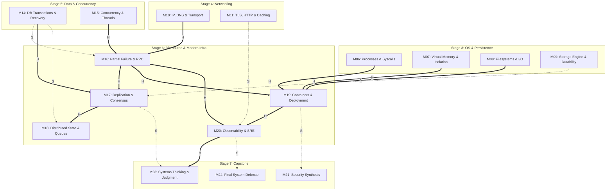

# Distributed Systems & Modern Infrastructure (M16–M20) Research Dossier v0.1

Status: **READY FOR LEAD REVIEW**
Issue: #97 — [Research] M16–M20 Distributed Systems & Modern Infrastructure Research Dossier v0.1
Repository base researched: `main @ 04005e7ed2955542d01770a667f9aa1e0d8db7e7`
Checked date for current specifications, sources, and tools: **2026-09-05**
Role: Research Agent — Distributed Systems, Infrastructure, Observability, Source Provenance, and Feasibility Researcher
Scope: Research phase only; strictly no learner-facing Lesson drafting, no Lab implementation code, no Mini Cloud App feature work, no Concept Registry edits, no new Concept IDs, no silent DAG redesign, and no premature closure of Open Questions.

---

## Evidence-Layer Legend

This dossier strictly adheres to the repository research and source policy (`meta/RESEARCH_AND_SOURCE_POLICY.md`):

- **PRINCIPLE** — Timeless computing invariant, formal theoretical result, mathematical law, or stable system design mechanism independent of specific vendors, platforms, or releases.
- **SPECIFICATION** — Normative, published standard, RFC, language specification, OCI specification, protocol contract, ABI, or formal system interface definition.
- **IMPLEMENTATION** — Concrete behavior observed in a specific operating system, kernel version, database engine, runtime, container engine, or software toolchain under stated conditions.
- **CURRENT PRACTICE** — Modern engineering convention, cloud architecture pattern, widely adopted operational heuristic, or tooling ecosystem consensus as of the checked date (2026-09-05), subject to scheduled evolution.

Confidence and context labels:

- **ESTABLISHED** — Strongly supported by canonical literature, formal specifications, and reproducible systems practice across decades.
- **IMPLEMENTATION-SPECIFIC** — Holds true for the named runtime, kernel version, or environment, but must not be generalized to other platforms.
- **CURRENT-PRACTICE** — Authoritative for current modern production as of 2026-09-05, but recognized as evolving rather than immutable.
- **CONTESTED** — Credible engineers, system architects, or academic sources hold differing positions under comparable trade-offs.
- **UNCERTAIN** — Empirical evidence is incomplete, or the design choice requires experimental implementation testing before commitment.

---

## 1. Executive Recommendation / Readiness

### Recommendation: **READY FOR DESIGN**

This Research Dossier establishes the technical, pedagogical, tooling, environment, Hands-On, Optional-Lab, Source-Expedition, provenance, currentness, and claim-boundary foundation required to design the complete **Stage 6 (S6) Distributed Systems & Modern Infrastructure** slice:

$$\begin{aligned}
\text{M16 (Partial Failure \& RPC)} &\longrightarrow \text{M17 (Replication, Consistency \& Consensus)} \longrightarrow \text{M18 (Distributed State \& Coordination)} \\
&\searrow \\
&\quad \text{M19 (Containers, Virtualization \& Deployment)} \longrightarrow \text{M20 (Observability \& Reliability Engineering)}
\end{aligned}$$

### Key Findings and Governance Alignment

1. **Authoritative DAG Reconstruction & Precedence:**
   - **No Artificial Stage Edges:** S6 consumes two distinct structural inputs: the networking branch (`M10 IP, DNS & Transport` as hard input to `M16`) and the data/concurrency branch (`M15 Concurrency` as hard input to `M16`, and `M14 Transactions` as hard input to `M17`).
   - **Partial Independence Within S6:** While `M16 → M17 → M18` forms the distributed state line, `M19` depends on `M16` and the single-host OS modules (`M06`, `M07`, `M08`), **not** on `M17` or `M18`. `M20` depends on `M19` and `M16`, with soft enrichment from `M11`. This separation prevents turning a sequential Stage narrative into false hard dependencies.
2. **Concept Registry Discipline (Zero New IDs):**
   - **No New Concept IDs:** The 18 canonical concepts in `meta/CONCEPT_REGISTRY.md` remain authoritative.
   - **Consensus Boundary:** The *concept* of consensus is Core at M17 (`L17-02`, per Blueprint disposition R10), but its Registry ID remains deliberately deferred.
   - **No Product or Mechanism IDs:** Terms such as *RPC, Replication, Queue, Container, Observability, Microservices, Kubernetes, Docker, Kafka, Raft, Paxos* are Module-level mechanisms or replaceable Current Cases; none are admitted as Concept IDs.
   - **Revisit Discipline:** M16–M20 revisit existing canonical concepts (`EC-CON-001 State`, `EC-CON-002 Abstraction`, `EC-CON-004 Indirection`, `EC-CON-005 Interface`, `EC-CON-006 Trade-off`, `EC-CON-008 Invariant`, `EC-CON-010 Failure`, `EC-CON-013 Isolation`, `EC-CON-014 Consistency`, `EC-CON-015 Concurrency`, `EC-CON-016 Durability`, `EC-CON-017 Trust Boundary`, `EC-CON-018 Process`). Each revisit applies the concept to the distributed/infrastructure context without duplicating the original definition.
3. **Core Restraint Against Heavy Dependencies:**
   - **No Mandatory Consensus Implementation:** Raft/Paxos is taught at the conceptual, invariant, and worked-trace level; no full Raft implementation or Byzantine fault tolerance is assigned to Core (R11 disposition; reserved for Deep Dive).
   - **No Mandatory Message Broker:** M18 focuses on queue abstractions, delivery semantics, duplicate handling, and idempotent consumer invariants. Neither Kafka, RabbitMQ, nor Redis is a Core prerequisite. A simple course-owned SQLite job-table or in-memory bounded queue demonstrates the mechanisms cleanly.
   - **No Mandatory Cloud Account or Kubernetes Cluster:** M19 teaches Linux namespaces, cgroups, OCI image concepts, and deployment trade-offs. Kubernetes is strictly an optional Current Case, not a Core platform.
   - **No Mandatory Telemetry SaaS Stack:** M20 teaches the signal distinctions (metrics, logs, traces), correlation, SLOs, and clock semantics. Local stdout/structured files and timers are the baseline; OpenTelemetry (`LAB-OPT-04`) is strictly Optional.
4. **Source Expeditions & Rights Discipline:**
   - **EXP-05 (MIT 6.033 Replication, Transactions, Logging Case):** Confirmed as Spring 2018 OCW Lectures 14, 15, and 16. Due to MIT OCW CC BY-NC-SA 4.0 licensing, Essential CS uses link-and-paraphrase only, with zero copied course text or assets.
   - **EXP-04 & LAB-OPT-04 (OpenTelemetry):** OpenTelemetry documentation (CC BY 4.0) and Python SDK (Apache-2.0) verified current (Python SDK v1.44.0 checked). Kept strictly Optional with appropriate notices.
   - **LAB-OPT-02 (Stanford CS144 Checkpoint 2 TCP Receiver):** Remains strictly Optional and rights-gated/link-only. No starter code is vendored.
5. **Open Question OQ-BP-006 Remains OPEN:**
   - Host tool observations are documented as dated evidence (2026-09-05). They do not constitute permanent frozen curriculum pins.

---

## 2. Scope and Canonical Constraints

### 2.1 Scope Chain and Module Definitions

Stage 6 spans exactly 5 Modules (`M16`–`M20`) and 12 preliminary Lessons across Macro Areas `11` (Distributed Systems) and `12` (Modern Infrastructure):

| Module | Canonical Title | Macro Area | Preliminary Lessons | Authoritative DAG Inputs (H/S) | Primary Competency Gain |
|---|---|---|---|---|---|
| **M16** | Distributed Systems Foundations: Partial Failure & RPC | 11 Distributed Systems | L16-01: "What is different about many machines?"<br>L16-02: "How do I call a remote function safely?" | **Hard:** M15, M10<br>**Soft:** M14 | **Trace & Judge** (trace distributed calls, judge timeout/retry/idempotency invariants) |
| **M17** | Replication, Consistency & Consensus | 11 Distributed Systems | L17-01: "How do I keep data safe across machines?"<br>L17-02: "How do machines agree?"<br>L17-03: "How consistent is 'strong enough'?" | **Hard:** M16, M14<br>**Soft:** M09 | **Judge & Explain** (choose consistency models, explain consensus limits, diagnose anomalies) |
| **M18** | Distributed State & Coordination | 11 Distributed Systems | L18-01: "How do services delegate work?"<br>L18-02: "Do I need a distributor?" | **Hard:** M17<br>**Soft:** M14 | **Judge & Diagnose** (delivery-semantics limits, duplicate handling, sync vs async coordination) |
| **M19** | Infrastructure: Containers, Virtualization & Deployment | 12 Modern Infrastructure | L19-01: "What is a container?"<br>L19-02: "What does 'the cloud' actually mean?"<br>L19-03: "How does code get to production?" | **Hard:** M16, M06, M07, M08<br>**Soft:** None | **Explain & Diagnose** (container mechanisms, deployment failures, resource and failure boundaries) |
| **M20** | Observability & Reliability Engineering | 12 Modern Infrastructure | L20-01: "How do I know the system is OK?"<br>L20-02: "How do I debug a production incident?" | **Hard:** M19, M16<br>**Soft:** M11 | **Diagnose & Observe** (signal selection, correlation, SLO reasoning, clock semantics, postmortem) |

### 2.2 Canonical Concept Registry Integrity

In strict conformance with `meta/CONCEPT_REGISTRY.md` and repository governance:

- **Total Concept IDs: Exactly 18.** Zero new concept IDs are added by this Research Dossier.
- **EC-CON-014 Consistency (一致性):** First introduced in M14 (`L14-02`). In M17, M17 **revisits** this concept and extends it from single-node database isolation guarantees to multi-node replicated state visibility guarantees (linearizability, sequential consistency, eventual consistency).
- **EC-CON-015 Concurrency (并发):** First introduced in M15 (`L15-01`). M16–M18 revisit concurrency across independent physical nodes, where concurrency is coupled with non-zero network delay and partial failure.
- **Consensus Boundary:** The consensus *concept* is Core at M17 (`L17-02`), but assigning a stable Registry ID remains deferred per Blueprint reconciliation (§8.5, R10).
- **Application Patterns & Replaceable Cases:**
  - *Schema Evolution / Serialization Compatibility:* Treated in M16 as an application pattern over `EC-CON-003 Representation` and `EC-CON-005 Interface` (wire format evolution, backward/forward compatibility).
  - *At-Least-Once / Idempotent Delivery:* Treated in M18 as an application pattern over `EC-CON-008 Invariant` and `EC-CON-010 Failure`.
  - *Container / Namespace / Cgroup:* Treated in M19 as mechanisms realizing `EC-CON-013 Isolation` and `EC-CON-018 Process`.
  - *Telemetry Signals (Logs, Metrics, Traces):* Treated in M20 as evidence patterns realizing `EC-CON-009 Correctness` and diagnosing `EC-CON-010 Failure`.

### 2.3 Competency Progression Across S6

All outcomes map strictly to the 8 canonical competencies (`meta/COMPETENCY_MATRIX.md`):

```
          [M16] Trace & Judge
         /                   \
        v                     v
   [M17] Judge & Explain   [M19] Explain & Diagnose
        |                     |
        v                     v
   [M18] Judge & Diagnose  [M20] Diagnose & Observe
```

- **Trace:** Trace a distributed request through client, network delay, server execution, timeout, retry, and duplicate handling (M16); trace replicated log entries across leader and follower state machines (M17); trace a message through a queue and consumer offset commitment (M18); trace a container request from host veth through namespace routing to process (M19); trace a distributed request across service boundaries using propagated span context (M20).
- **Judge:** Judge whether an RPC interface requires an idempotency key and how long that key must be retained (M16); evaluate trade-offs between synchronous replication and asynchronous replication lag, or between linearizability and availability under network partitions (M17); choose between synchronous RPC, a durable local job table (outbox pattern), and an external message queue (M18); evaluate rolling vs. blue-green vs. canary deployment strategies for a given stateful workload (M19); judge appropriate SLI/SLO targets and alert burn-rate thresholds (M20).
- **Diagnose:** Distinguish network drop from application server crash or slow processing (M16); diagnose split-brain anomalies and stale reads (M17); diagnose duplicate execution side effects and out-of-order message processing (M18); diagnose container OOMKilled events, cgroup CPU throttling, and image tag mismatch failures (M19); correlate error spikes with latency distributions and logs during a simulated incident (M20).
- **Explain:** Explain why partial failure is qualitatively different from single-machine local failure (M16); explain the consensus safety invariants and why FLP impossibility prevents guaranteed termination in asynchronous networks (M17); explain why end-to-end "exactly-once" delivery cannot be guaranteed by network transport alone (M18); explain how Linux namespaces and cgroups compose to create container isolation on a shared kernel (M19); explain why wall-clock timestamps cannot be used to measure durations or order distributed events (M20).
- **Estimate:** Estimate availability ($99.9\%$ vs $99.99\%$) and error budget in minutes per month (M16, M20); calculate quorum requirements ($W + R > N$) and replication bandwidth overhead (M17); estimate queue depth and backpressure draining times (M18); estimate container memory footprints and cloud resource costs (M19); estimate metric storage cardinality and trace sampling volume overhead (M20).

---

## 3. Authoritative DAG Reconstruction & Narrative Disambiguation

### 3.1 Blueprint DAG Edges for S6

Reconstructing the authoritative DAG from `meta/blueprint/dependency-graph-v0.1.md` (§2) and `meta/blueprint/core-stage-module-lesson-map-v0.1.md`:



### 3.2 Exact Inbound and Outbound Edge Audit

| Edge | Type | Blueprint Rationale | Enforcement in S6 Research / Design |
|---|---|---|---|
| `M10 → M16` | **H** | RPC sits on network transport; partial failure requires packet loss/timeout intuition. | M16 builds on M10 TCP byte streams, timeouts, and connection refusal. |
| `M15 → M16` | **H** | Distributed communication involves concurrent request handlers, background retries, and non-blocking I/O. | M16 uses thread/async execution contexts from M15 to run client/server endpoints. |
| `M14 → M16` | **S** | Single-node transaction semantics help contextualize consistency, but RPC/partial failure can be understood with networking and concurrency alone. | Soft only; M16 must not require M14 transaction tables. |
| `M16 → M17` | **H** | Replication and consensus require the partial-failure and network partition model first. | M17 cannot proceed without M16 failure ambiguity. |
| `M14 → M17` | **H** | Distributed consistency models are a direct generalization of database isolation and atomicity. | M17 builds on M14 transaction invariants and WAL concepts. |
| `M09 → M17` | **S** | Durability model reused for replication (soft). | Optional comparison between local fsync and quorum acknowledgment. |
| `M17 → M18` | **H** | Queues and distributed coordination build on consensus and consistency primitives. | M18 uses M17 ordering and split-brain principles. |
| `M14 → M18` | **S** | Single-node transactions contextualize sagas and outbox patterns. | Soft only; saga is contrasted with local ACID transactions. |
| `M16 → M19` | **H** | Deployment models (rolling, canary) exist to manage failure during state changes. | M19 deployment strategies reference M16 network failure and retry. |
| `M06 → M19` | **H** | Containers are OS processes with execution contexts. | M19 directly inspects process tables, PID namespaces, and syscalls. |
| `M07 → M19` | **H** | Container isolation relies on memory virtualization and cgroups. | M19 inspects memory cgroups and mount isolation. |
| `M08 → M19` | **H** | Container images are layered filesystem trees (OverlayFS). | M19 builds on M08 filesystems, inodes, and mount points. |
| `M19 → M20` | **H** | Observability instruments software running in modern infrastructure environments. | M20 observes containerized processes, resource limits, and deployment states. |
| `M16 → M20` | **H** | Tracing and correlation address distributed failure and latency attribution across nodes. | M20 distributed tracing directly addresses M16 cross-process hops. |
| `M11 → M20` | **S** | HTTP status codes, headers, and navigation timing enrich observability metrics. | Soft only; HTTP metrics serve as familiar examples. |
| `M20 → M23` | **H** | Systems judgment requires measurement discipline and operational observability. | Downstream capstone dependency. |
| `M17 → M23` | **S** | Distributed consistency trade-offs enrich systems thinking synthesis. | Downstream capstone dependency. |

### 3.3 Disambiguation of Narrative vs. Structural Dependency

1. **S4/S5 Partial Independence:**
   - In accordance with Decision D-010 and Blueprint reconciliation, `S4` (Networking & Web) and `S5` (Data & Concurrency) are partially independent after `S3`.
   - The default learner narrative is request-centric (`S4 → S5 → S6`), but the DAG allows a state-centric path (`S5 → S4 → S6`).
   - S6 is the convergence point: **M16 requires both M10 (from S4) and M15 (from S5)**.
2. **No Intrastage Monolith in S6:**
   - While S6 is taught as a thematic unit, **M19 does NOT depend on M17 or M18**.
   - A learner could theoretically study container mechanisms (`M19`) immediately after `M16` and `S3`. Design must respect this modularity: M19 must not introduce hidden prerequisites on Raft consensus or message brokers.

---

## 4. Module-by-Module Technical & Pedagogical Research

### 4.1 M16 — Distributed Systems Foundations: Partial Failure & RPC

#### Core Conceptual Mechanics
- **The Defining Invariant of Distributed Systems:** In a single system, components typically fail together (fail-stop of the host CPU/kernel halts all threads). In a distributed system, components fail **independently and unannounced** (Leslie Lamport: *"A distributed system is one in which the failure of a computer you didn't even know existed can render your own computer unusable"*).
- **The Fundamental Three-State Ambiguity:** When a client sends a message to a remote server and receives no response within duration $T$, the system state is indeterminate:
  1. The request was dropped on the outbound network (server never executed it).
  2. The server crashed before executing the request.
  3. The server received and executed the request, but crashed before sending the response.
  4. The server received and executed the request, but the response was dropped on the inbound network.
  5. The server is still processing the request and the response is delayed in a queue.
- **The Leaky Abstraction of RPC (Birrell & Nelson 1984; Waldo et al. 1994):**
  - Remote Procedure Call attempts to make a remote network request look syntactically like a local function call (`result = remote_service.do_something(arg)`).
  - *Why this abstraction leaks inherently:*
    - **Latency:** Local call is $\sim 10\text{ ns}$ (M04); remote call over LAN is $\sim 0.5\text{ ms}$, over WAN $\sim 50\text{--}150\text{ ms}$ ($10^5\text{--}10^7\times$ slower).
    - **Memory Isolation:** No shared memory, pointers, or pass-by-reference. Arguments must be serialized into bytes (`EC-CON-003 Representation`), copied across the wire, and deserialized.
    - **Partial Failure & Unreachability:** A local call either runs or the entire process crashes; a remote call can hang, time out, or leave the caller uncertain of execution.
    - **Concurrency & Reordering:** Packets can be reordered, duplicated, or delayed by intermediaries.
- **Timeout Mechanics:**
  - A timeout is a client-side decision to stop waiting for an unobserved remote state.
  - *The Trade-off:* A timeout set too low triggers premature retries and false failure declarations under transient network congestion; a timeout set too high holds client resources (threads, sockets, memory) and delays failure detection.
  - A timeout is an *erasure of waiting*, not an erasure of remote execution.
- **Retry Semantics & Retry Amplification:**
  - Retrying without backoff under server overload causes immediate self-inflicted Denial of Service (retry storm).
  - *Retry Amplification in Service Chains:* In a call chain $A \to B \to C \to D$, if each service retries $k=3$ times on timeout, a single request from $A$ can generate $3^3 = 27$ calls to service $D$.
  - Mitigation principles: Limit retries at intermediate hops; enforce end-to-end retry budgets; pass deadlines/cancellation context along the call tree.
- **Backoff and Jitter Boundaries:**
  - *Exponential Backoff:* $t_{\text{wait}} = \min(t_{\text{max}}, t_{\text{base}} \times 2^{\text{attempt}})$. Prevents immediate re-hammering.
  - *The Thundering Herd Problem:* If 1,000 clients fail at time $T_0$, synchronized exponential backoff causes them all to retry at $T_0 + 2\text{s}$, then $T_0 + 4\text{s}$, repeating the overload spike in lockstep.
  - *Full Jitter (Brooker, AWS 2015):* $t_{\text{sleep}} = \text{random}(0, \min(t_{\text{max}}, t_{\text{base}} \times 2^{\text{attempt}}))$. Smooths aggregate retry traffic into a uniform distribution.
- **Idempotency: Principles and Boundaries:**
  - Mathematical definition: $f(f(x)) = f(x)$.
  - System definition: Executing an operation $N \ge 1$ times produces the same system state and returns the same effective result as executing it once ($N=1$).
  - *Naturally Idempotent Operations:* Reading state (`GET`), overwriting state with an absolute value (`SET status = 'INACTIVE'`), deleting by unique ID (`DELETE /items/42`).
  - *Non-Idempotent Operations:* Appending state (`POST /orders`), relative mutations (`UPDATE account SET balance = balance - 100`).
  - *Idempotency Keys:* Client attaches a globally unique identifier (UUIDv4) to the request (`Idempotency-Key: <UUID>`). The server records the key and execution result in an atomic transaction. Upon receiving a duplicate key, the server returns the cached result without re-executing side effects.
  - *Lifecycle & Eviction Risk:* Idempotency caches cannot be retained indefinitely. A key retention window (e.g., 24 hours) defines the boundary: retries beyond this window risk duplicate execution.
- **Network Failure vs. Application Failure:**
  - *Transport-level failures:* `ECONNREFUSED` (no process listening), `ETIMEDOUT` (SYN dropped or ACK dropped), `ECONNRESET` (peer abruptly closed socket).
  - *Application-level failures:* HTTP 4xx (client error, semantic validation failed), HTTP 5xx (server internal crash), gRPC status codes (`DEADLINE_EXCEEDED`, `UNAVAILABLE`, `FAILED_PRECONDITION`).
  - *Critical Invariant:* Receiving an HTTP `200 OK` or TCP ACK confirms that bytes were delivered to the endpoint process; it does not prove that the underlying business operation was durably committed to disk unless explicitly acknowledged by contract.

#### Lesson Alignment in Blueprint
- `L16-01`: "What is different about many machines?"
  - Mental model: Single machine failure vs. independent partial failure; the three-state ambiguity; network latency ladder revisit.
  - Hands-on: Local two-process socket communication with simulated packet delay and loss.
- `L16-02`: "How do I call a remote function safely?"
  - Mental model: RPC boundary; serialization; timeouts; retries; exponential backoff with full jitter; idempotency keys.
  - Hands-on: Client/server RPC with injected delays; observe duplicate side effects on un-idempotent counters; fix with idempotency keys.

---

### 4.2 M17 — Replication, Consistency & Consensus

#### Core Conceptual Mechanics
- **Why Replicate Data?**
  - *High Availability:* If node $A$ crashes, node $B$ can continue serving requests.
  - *Read Scalability:* Distribute read traffic across multiple replicas.
  - *Durability:* Data survives physical hardware destruction of a single machine.
  - *Latency:* Placing replicas geographically closer to users.
- **Replication Topologies:**
  1. *Single-Leader (Primary-Backup):* All writes go to the designated leader. Leader writes to local storage and replicates changes to followers via a change log (WAL/binlog). Reads can go to leader or followers.
  2. *Multi-Leader:* Multiple nodes accept writes. Necessary for multi-region active-active deployments. Introduces write conflicts that require resolution policies (Last-Write-Wins, CRDTs, operational transformation).
  3. *Leaderless (Dynamo-style):* Client or coordinator writes directly to multiple replicas. Uses quorums for read and write operations.
- **Synchronous vs. Asynchronous Replication:**
  - *Synchronous:* Leader waits for confirmation from follower(s) before returning success to client.
    - *Gain:* Strong durability; follower is guaranteed up to date; zero data loss on leader failover.
    - *Cost:* Write latency is bounded by the slowest replica (p99 tail latency explodes); write availability drops to zero if any synchronous follower fails or experiences a network hiccup.
  - *Asynchronous:* Leader acknowledges write to client immediately after writing locally, then replicates to followers in the background.
    - *Gain:* Fast writes (local disk latency only); high availability (writes proceed even if all followers are down).
    - *Cost:* **Replication Lag**; reads from followers can return stale or reverting data; failover after leader crash causes **unrecoverable data loss** of un-replicated commits.
  - *Semi-Synchronous:* Leader waits for exactly one follower, leaving remaining followers asynchronous.
- **Consistency Guarantees Across Replicas:**
  - *Linearizability (Strong Consistency, Herlihy & Wing 1990):*
    - The system behaves as if there is only a single copy of the data, and all operations take effect instantaneously at a serialization point between their invocation and response.
    - If client $A$ reads new value $V_1$ at physical time $T_1$, no client $B$ reading at physical time $T_2 > T_1$ can ever observe an older value $V_0$.
  - *Eventual Consistency:*
    - If no new updates are made, all replicas will eventually converge to the same value.
    - *What it does NOT guarantee:* No guarantee on *when* convergence happens; no guarantee that consecutive reads from the same client observe monotonic progress; potential to read stale data indefinitely while writes continue.
  - *Client-Centric Consistency Guarantees:*
    - *Read-Your-Writes:* A client always observes its own updates.
    - *Monotonic Reads:* If a client reads value $V$, it will never subsequently read an older value.
- **Quorum Mathematics and Failure Boundaries:**
  - In a system of $N$ replicas:
    - Write quorum size: $W$
    - Read quorum size: $R$
    - **Quorum Condition:** $W + R > N$
  - Pigeonhole Principle: The set of nodes written to and the set of nodes read from must overlap by at least one node. That overlapping node carries the latest write (distinguished by version or timestamp).
  - *Common Configurations:*
    - $N=3, W=2, R=2$ (tolerates 1 node failure).
    - $N=5, W=3, R=3$ (tolerates 2 node failures).
  - *Quorum Edge Cases & Limits:*
    - Concurrent writes: Two clients write to overlapping quorums with different values; requires conflict resolution.
    - Failed writes: If a write succeeds on $W-1$ nodes and times out, the value may still be read by subsequent readers even though the client observed failure.
- **CAP Theorem and Partition Trade-offs (Brewer 2000; Gilbert & Lynch 2002):**
  - In an asynchronous network where partitions ($P$, message loss or indefinite delay) are a physical reality, a distributed data store must choose between:
    - **Consistency (C, Linearizability):** Reject writes or block reads on partitioned nodes to prevent split-brain and stale reads.
    - **Availability (A):** Every non-failing node must return a non-error response, even if it cannot communicate with other replicas, risking stale or diverging data.
  - "Pick 2 out of 3" is a flawed framing: **Partition tolerance is not optional**; physical networks can and do partition. The real trade-off is: *When a partition occurs, do you choose Consistency or Availability?*
- **Consensus: Concept, Invariants, and Limits:**
  - *Consensus Problem Definition:* A set of processes propose values; all non-faulty processes must decide on a single common value.
  - *Formal Properties:*
    - **Agreement:** No two correct processes decide different values.
    - **Validity:** The decided value must have been proposed by at least one process.
    - **Termination:** All non-faulty processes eventually reach a decision.
  - *FLP Impossibility (Fischer, Lynch, Paterson 1985):* In an asynchronous network model, no deterministic consensus algorithm can guarantee termination in the presence of even a single unannounced crash failure.
  - *Practical Consensus (Raft / Multi-Paxos):*
    - Circumvents FLP by using **partial synchrony** (randomized election timeouts and heartbeats). Safety is never compromised; progress (liveness) is guaranteed once network delays stabilize.
    - *Raft Key Mechanisms:*
      1. Leader Election: Split into terms; randomized election timeouts avoid split votes; candidate must have log at least as up to date as majority to win (Leader Completeness).
      2. Log Replication: Leader appends entry, sends `AppendEntries` RPC to followers; commits entry once replicated to a majority quorum; applies entry to state machine and responds to client.
      3. Safety Invariants: Election Safety (at most one leader per term), Leader Append-Only, Log Matching Invariant.
  - *Curriculum Boundary:* M17 teaches the *mechanisms, safety invariants, and trade-offs* through bounded worked traces. No student is required to implement a full Raft consensus engine.

#### Lesson Alignment in Blueprint
- `L17-01`: "How do I keep data safe across machines?"
  - Mental model: Replication goals; leader/follower topologies; synchronous vs. asynchronous replication lag; quorum math ($W + R > N$).
  - Hands-on: Bounded message trace of 3-replica quorum; simulate follower lag and network partition.
- `L17-02`: "How do machines agree?"
  - Mental model: The consensus problem; split-brain danger; Raft leader election and log replication invariants (R10 disposition; Registry ID deferred).
  - Hands-on: Step-through worked trace of leader election with partitioned nodes; verify majority quorum safety.
- `L17-03`: "How consistent is 'strong enough'?"
  - Mental model: Consistency spectrum: linearizability vs. eventual consistency; client-centric models (read-your-writes); CAP/PACELC trade-off framing.
  - Hands-on: Scenario evaluation: choose consistency level for banking vs. social media feed; identify anomaly traces.

---

### 4.3 M18 — Distributed State & Coordination

#### Core Conceptual Mechanics
- **Queue and Message Broker Abstraction:**
  - Asynchronous decoupling across three axes:
    1. *Time:* Producer can send when consumer is offline or busy.
    2. *Space:* Producer does not need to know the physical network address of consumers.
    3. *Throughput / Concurrency:* Buffers spikes and enables rate-leveling (backpressure).
  - *Point-to-Point (Work Queue):* Each message is delivered to and processed by exactly one competing consumer.
  - *Publish-Subscribe / Partitioned Event Log:* Messages are broadcast to multiple consumer groups; each group maintains an independent read offset.
- **Delivery Guarantees and Their Physical Limits:**
  1. *At-Most-Once:*
     - Sender transmits message once without retries, or consumer acknowledges message before processing.
     - *Outcome:* Zero duplicate processing, but messages are lost if network drops packet or consumer crashes mid-flight.
  2. *At-Least-Once:*
     - Sender retries until ACK received; consumer acknowledges message only *after* completing processing.
     - *Outcome:* Zero message loss under non-catastrophic failure, but **duplicates are inevitable** whenever an ACK is delayed, lost, or consumer crashes right after processing.
  3. *The Myth and Reality of "Exactly-Once":*
     - True end-to-end exactly-once delivery across an unreliable network is physically impossible without end-to-end deduplication (Two Generals Problem).
     - Systems advertising "Exactly-Once Semantics" (EOS, e.g., Kafka) provide **effectively-once processing** within closed broker/transactional boundaries via:
       - Producer idempotency (sequence numbers per producer ID).
       - Transactional writes across input offsets and output topics.
       - Idempotent consumer processing.
- **Deduplication and Idempotent Consumers:**
  - Because at-least-once delivery produces duplicates, consumers must enforce idempotency.
  - *Deduplication Strategies:*
    - Natural idempotency (state update overwrites with fixed identifier).
    - Deduplication table / processed message store: Store `message_id` within the same local database transaction that executes the business mutation:
      ```sql
      BEGIN TRANSACTION;
      INSERT INTO processed_messages (msg_id, processed_at) VALUES (?, CURRENT_TIMESTAMP);
      -- If insert succeeds (unique constraint), execute business logic:
      UPDATE accounts SET balance = balance + ? WHERE id = ?;
      COMMIT;
      ```
    - If `msg_id` already exists, rollback or ignore; acknowledge message.
- **Ordering Guarantees and Partitions:**
  - Global FIFO ordering across a distributed cluster requires a single bottleneck sequencer.
  - *Partitioned Ordering:* Maintain strict ordering only within a key/partition (e.g., all events for `user_123` route to Partition 2). Independent partitions execute concurrently.
- **Distributed Transactions vs. Sagas:**
  - *Two-Phase Commit (2PC, Gray 1978):*
    - Coordinator sends `PREPARE` to all participants. Participants acquire locks and vote `YES` or `NO`.
    - If all vote `YES`, coordinator writes commit log and sends `COMMIT`; otherwise `ABORT`.
    - *The Blocking Flaw:* If the coordinator crashes after participants vote `YES`, participants are left **blocked and holding locks**, unable to commit or abort independently. Availability and latency suffer catastrophic degradation.
  - *Saga Pattern (Garcia-Molina & Salem 1987):*
    - Replaces a single distributed transaction with a sequence of local transactions.
    - Each step updates local state and emits an event or message triggering the next step.
    - *Compensating Transactions:* If step $K$ fails, the saga executes compensating transactions $C_{K-1}, \dots, C_1$ in reverse order to semantically undo prior actions.
    - *Trade-off:* Lack of isolation ($I \in \text{ACID}$). Intermediate states are visible to external observers; compensation is semantic (e.g., refund) rather than a physical rollback.
- **Distributed Locking and Fencing Tokens:**
  - A distributed lock coordinates mutually exclusive access to shared resources across machines.
  - *The Fatal Flaw of Time-Based Leases (Kleppmann 2016):*
    - Client 1 acquires lock with lease $T=10\text{s}$.
    - Client 1 experiences a Stop-the-World GC pause or network stall for $12\text{s}$.
    - Lock expires; Client 2 acquires lock and begins writing.
    - Client 1 resumes, unaware that its lease expired, and writes concurrently, corrupting shared state.
  - *Mitigation — Fencing Tokens:*
    - Lock service issues a monotonically increasing token (e.g., $1, 2, 3$).
    - Target storage rejects any write presenting a token lower than the highest token observed.
- **Durable Work and the Outbox Pattern:**
  - *The Dual-Write Problem:* A service updates a database and sends a message to a queue. If the database commit succeeds but the queue send fails (or vice versa), state diverges.
  - *Transactional Outbox Pattern:* Service writes business entity and message payload to an `outbox` table in the same local ACID transaction. A background relay process polls or tails the WAL and pushes to the queue, ensuring reliable at-least-once handoff without 2PC.

#### Lesson Alignment in Blueprint
- `L18-01`: "How do services delegate work?"
  - Mental model: Queue abstractions; at-least-once vs. at-most-once delivery; why "exactly-once" requires consumer idempotency; the outbox pattern.
  - Hands-on: Simulate consumer worker with duplicate delivery; demonstrate corrupt state on non-idempotent updates; repair with deduplication table.
- `L18-02`: "Do I need a distributor?"
  - Mental model: Distributed transactions vs. sagas; why 2PC blocks; compensating transactions; distributed locks and fencing token requirements.
  - Hands-on: Step through a 3-step saga with a failure on step 3; verify execution of compensating actions; observe isolation anomaly.

---

### 4.4 M19 — Infrastructure: Containers, Virtualization & Deployment

#### Core Conceptual Mechanics
- **The Process vs. Container vs. Virtual Machine Boundary:**
  - *Process:* Operating system execution context (PCB, virtual address space, file descriptor table).
  - *Container:* A standard Linux process executing with restricted system views (via **namespaces**) and bounded resource consumption (via **cgroups**). Containers share the host kernel.
  - *Virtual Machine:* Hardware virtualization via a Hypervisor (Type 1 bare-metal or Type 2 hosted / KVM). Runs a complete guest operating system with its own guest kernel. Strong isolation boundary at the cost of higher CPU/RAM overhead and multi-second boot times.
- **Linux Namespaces (Isolation of View):**
  - Namespaces partition global kernel resources so that a process sees only its isolated instance:
    1. `pid`: Independent process ID numbering (container PID 1 maps to host PID 14820).
    2. `net`: Independent virtual network interfaces, IP addresses, routing tables, port bindings.
    3. `mnt`: Isolated filesystem mount point hierarchy.
    4. `ipc`: Isolated System V IPC and POSIX message queues.
    5. `uts`: Isolated hostname and NIS domain name.
    6. `user`: Maps container UIDs/GIDs to different host UIDs/GIDs (root inside container can be unprivileged UID 10001 on host).
    7. `cgroup`: Isolated view of `/proc/self/cgroup`.
- **Linux Control Groups (cgroups v2, Resource Accounting & Limits):**
  - While namespaces restrict *what a process can see*, cgroups restrict *what resources a process can use*.
  - Modern Linux uses **cgroups v2** (unified hierarchy under `/sys/fs/cgroup`).
  - *Core Controllers:*
    - `memory.max`: Hard limit. If exceeded and cannot reclaim, kernel invokes Out-Of-Memory (OOM) Killer, terminating processes with `SIGKILL` (`OOMKilled`, exit status 137).
    - `cpu.max`: CPU quota and period (e.g., `50000 100000` allows 0.5 CPU cores). Enforces CPU throttling when exceeded.
    - `pids.max`: Limits total number of processes/threads in cgroup, preventing fork bombs.
    - `io.max`: Read/write bytes-per-second and IOPS limits on block devices.
- **Container Images & OCI Specifications:**
  - *OCI Image Format Specification (v1.1.1, 2025):* An image is a content-addressable archive consisting of:
    1. Content-addressable tarball layers (`diff` layers).
    2. Image Configuration JSON (environment variables, working directory, entrypoint, architecture).
    3. Manifest JSON (maps config descriptor and layer descriptors by SHA-256 digest).
  - *OverlayFS (Union Mount):*
    - Stacks multiple read-only image layers (`lowerdir`) under a single writable layer (`upperdir`) presented via a merged mount (`merged`).
    - Copy-on-Write (CoW): Modifying a file copies it from the lower layer to the upper layer before writing.
- **Deployment Strategies & State Migration:**
  1. *Recreate:* Stop old version, deploy new version. Incurs downtime; simple, avoids version skew.
  2. *Rolling Update:* Progressively replace instances of version $N$ with version $N+1$. Zero downtime, but **version skew is guaranteed**: during deployment, version $N$ and $N+1$ run concurrently and process requests against the same database. Requires backward and forward schema compatibility!
  3. *Blue-Green Deployment:* Spin up complete new environment (Green) alongside current (Blue). Once tested, flip router/load balancer traffic instantaneously. Fast rollback (flip back); requires double infrastructure capacity and careful shared database migration handling.
  4. *Canary Deployment:* Route a small percentage (e.g., 2%) of production traffic to the new version. Monitor error rates, latency, and system signals. Automatically roll forward or roll back.
- **Cloud Infrastructure & Failure Blast Radiuses:**
  - *Failure Domains:*
    $$\text{Process} \subset \text{Host/VM} \subset \text{Rack} \subset \text{Availability Zone (AZ)} \subset \text{Region}$$
  - *Availability Zone:* Physically separated datacenter with independent power, cooling, and networking within a metropolitan region. Low latency ($\sim 1\text{ ms}$).
  - *Region:* Geographically distant location (e.g., Virginia vs. Frankfurt). Independent failure domains; higher latency ($\sim 70\text{--}150\text{ ms}$).
- **Infrastructure as Code (IaC) & Continuous Delivery:**
  - Declarative configuration (desired state) vs. imperative scripts.
  - Reproducibility and drift detection.
  - Supply-chain security: Base image provenance, signed image digests (`@sha256:...`) vs. mutable tags (`:latest`).

#### Lesson Alignment in Blueprint
- `L19-01`: "What is a container?"
  - Mental model: Process vs. container vs. VM; Linux namespaces; cgroups resource limits; OCI image structure and OverlayFS.
  - Hands-on: Inspect `/proc/$$/ns` and `/sys/fs/cgroup`; run unshare or inspect a local container; trigger an intentional cgroup memory limit OOM kill.
- `L19-02`: "What does 'the cloud' actually mean?"
  - Mental model: Hypervisors; cloud failure domains (AZ vs. Region); resource metering and cost models.
  - Hands-on: Calculate napkin-math availability and cost trade-offs for single-AZ vs. multi-AZ architectures.
- `L19-03`: "How does code get to production?"
  - Mental model: CI/CD automation pipeline; deployment strategies (rolling vs. blue-green vs. canary); version skew and backward-compatible state.
  - Hands-on: Simulate a rolling deployment with schema version skew; observe failure when backward compatibility is broken; execute safe multi-step rollout.

---

### 4.5 M20 — Observability & Reliability Engineering

#### Core Conceptual Mechanics
- **The Three Telemetry Signals (M.E.L.T. / Pillars):**
  1. *Metrics:* Numeric measurements aggregated over fixed intervals (Counters, Gauges, Histograms).
     - *Strengths:* Cheap to store, highly efficient for alerting, dashboards, and trend analysis.
     - *Weakness:* High cardinality explosion risk (adding `user_id` as a label causes memory/storage exhaustion); cannot isolate single failing request trace.
  2. *Structured Logs:* Timestamped string or structured JSON records emitted during execution.
     - *Strengths:* Rich context, local causality, stack traces.
     - *Weakness:* High volume, expensive storage, difficult to trace across service boundaries without correlation IDs.
  3. *Distributed Traces:* Directed acyclic graphs (DAGs) of **Spans** tracking a request through multiple network hops.
     - *Strengths:* Exposes cross-service latency bottlenecks and causal execution paths.
     - *Weakness:* High implementation complexity; network overhead; requires sampling.
- **Correlation and Context Propagation:**
  - Telemetry without correlation is noise. Correlating logs, metrics, and traces requires passing a **Trace Context** across all boundaries.
  - *W3C Trace Context Specification (REC 2021/2023):* Standardized HTTP headers:
    - `traceparent`: `version-trace_id-parent_id-trace_flags` (e.g., `00-4bf92f3577b34da6a3ce929d0e0e4736-00f067aa0ba902b7-01`).
    - `tracestate`: Vendor-specific routing state.
  - Injecting `trace_id` into every structured log line links isolated log events directly to distributed trace spans.
- **Latency Distributions & Measurement Discipline (M04 Revisit):**
  - *Why Mean (Average) Latency is Actively Misleading:* In a service where 99 requests take $10\text{ ms}$ and 1 request takes $1,000\text{ ms}$, average is $19.9\text{ ms}$. This hides the fact that $1\%$ of users experience catastrophic delay.
  - *Percentile Reasoning:* $p50$ (median, typical experience), $p95$, $p99$, $p99.9$ (tail latency).
  - In a system with 100 microservices called per user request, if each service has a $p99$ latency of $1\text{s}$, the probability that a user request hits at least one slow service is $1 - (0.99)^{100} \approx 63.4\%$. Tail latency dominates distributed systems!
- **Clock Semantics: Monotonic Clock vs. Wall Clock:**
  - *Resolution of DAG Hidden-Prerequisite Flag:*
  - *Wall Clock (`CLOCK_REALTIME` / Python `time.time()`):*
    - Measures calendar time relative to the epoch (Jan 1, 1970).
    - Can be adjusted backward or forward by NTP synchronization, leap seconds, or system administrators.
    - **Never use wall clock to measure durations or intervals!** An NTP adjustment can cause measured latency to appear negative or absurdly large.
  - *Monotonic Clock (`CLOCK_MONOTONIC` / Python `time.monotonic()` / `perf_counter()`):*
    - Monotonically increasing counter from an arbitrary point in time (e.g., system boot).
    - Guaranteed never to step backward. Strictly required for elapsed time, timers, timeouts, and SLO measurements.
  - *Distributed Clock Skew:* Physical clocks on different machines drift due to temperature and hardware variations. Relying on wall clocks to order events across distributed nodes (without specialized hardware like Google Spanner's TrueTime atomic clocks) leads to data loss and causality violations.
- **Service Level Engineering: SLI, SLO, SLA, and Error Budgets:**
  - *Service Level Indicator (SLI):* A measurable metric indicating performance.
    $$\text{SLI} = \frac{\text{Good Events}}{\text{Total Events}} \times 100\%$$
    Example: Percentage of HTTP requests returning status $< 500$ in $< 250\text{ ms}$ over a 30-day window.
  - *Service Level Objective (SLO):* Internal target reliability level agreed upon by engineering and product (e.g., $99.9\%$).
  - *Service Level Agreement (SLA):* External contract with customers specifying financial or legal penalties for breaches (normally looser than SLO, e.g., $99.5\%$).
  - *Error Budget:* $100\% - \text{SLO}$. For an SLO of $99.9\%$, the error budget is $0.1\%$ (approx. 43 minutes of downtime per month). Error budgets provide a rational, quantitative governor on deployment risk.
- **Incident Response and Blameless Postmortems:**
  - *Incident Lifecycle:* Detection $\to$ Triage $\to$ Mitigation $\to$ Resolution $\to$ Postmortem.
  - *Mitigation First:* Roll back, shed load, or fail over before deep root-cause debugging.
  - *Blameless Culture (Dekker 2006):* Human error is the *symptom* of deeper system failure, never the root cause. Systems must be resilient to normal human slips.
  - Postmortem artifact: Incident summary, timeline, impact, contributing factors, action items with owners.

#### Lesson Alignment in Blueprint
- `L20-01`: "How do I know the system is OK?"
  - Mental model: Logs vs. metrics vs. traces; SLI/SLO concepts; error budgets; clock semantics (monotonic vs. wall clock).
  - Hands-on: Instrument a Python service with structured logs and latency metrics; verify monotonic timing; calculate SLO burn rate under injected errors.
- `L20-02`: "How do I debug a production incident?"
  - Mental model: Distributed trace correlation; context propagation; triage vs. root cause; blameless postmortem methodology.
  - Hands-on: Controlled incident walkthrough: inject downstream latency spike, correlate trace spans to identify bottleneck, apply mitigation, draft postmortem.

---

## 5. Hands-On Mechanism & Lab Candidate Research

In accordance with Blueprint restraint, Essential CS does not burden learners with heavy cloud vendor configurations, paid SaaS accounts, or complete distributed consensus implementations.

### 5.1 Overview of S6 Practical Work

| ID / Activity | Type | Placement | Exact Mechanism | Canonical Environment | Status & Rights |
|---|---|---|---|---|---|
| **LAB-OPT-02** | Optional Lab | M10 / M16 | TCP Receiver sequence wrapping, byte stream reassembly, advertised window | C++, CMake, Linux | **Adapt — rights-gated.** Link-only until cleared; zero vendored code. |
| **EXP-05** | Source Expedition | M17 | Primary-backup replication, transaction logging, distributed recovery | PDF reading / inspection | **Adopt — link/paraphrase.** MIT 6.033 OCW CC BY-NC-SA 4.0. |
| **M16 Candidate Fixture** | Hands-On Activity | M16 | Two-process localhost RPC with injected delay/loss, retries, backoff with jitter, idempotency key table | Python stdlib (`socket`, `http.server`, `sqlite3`) | **Original Build.** Low burden; 100% license-cleared. |
| **M17 Candidate Fixture** | Hands-On Activity | M17 | 3-node in-process state machine trace; quorum write/read ($W=2, R=2, N=3$); simulated network partition | Python stdlib | **Original Build.** Deterministic simulation without heavy networking. |
| **M18 Candidate Fixture** | Hands-On Activity | M18 | Transactional outbox & worker deduplication using SQLite; duplicate injection | Python stdlib + SQLite | **Original Build.** No external broker dependency. |
| **M19 Candidate Fixture** | Hands-On Activity | M19 | Linux namespaces (`unshare`), cgroups v2 (`memory.max`), OverlayFS inspection | Canonical Linux shell | **Original Build.** Native OS path; Docker Optional. |
| **LAB-OPT-04** | Optional Lab | M20 | Local OpenTelemetry tracing vs. structured logs/timers | Python + `opentelemetry-api`/`sdk` | **Adapt.** Pinned versions; ConsoleExporter only. |
| **EXP-04** | Source Expedition | M20 | OpenTelemetry Python API vs. SDK span lifecycle inspection | GitHub source inspection | **Adopt.** Apache-2.0 / CC BY 4.0. |

### 5.2 Deep-Dive Audit: LAB-OPT-02 (Stanford CS144 TCP Receiver)
- **Pedagogical Purpose:** Demystify byte-stream reassembly, sequence-space wrapping ($2^{32}$ boundary), and flow-control advertised windows.
- **Rights & Provenance:** Stanford CS144 Fall 2025 Checkpoint 2 (`check2.pdf`). Rights for starter code/test suite redistribution remain **unestablished**.
- **Disposition:** Strictly **Optional and link-only**. The course provides conceptual guidance and prediction prompts, but vendors zero CS144 code.

### 5.3 Deep-Dive Audit: EXP-05 (MIT 6.033 Replication, Transactions, Logging)
- **Pedagogical Purpose:** Inspect mature, classic systems engineering lecture cases on fault tolerance, primary-backup replication, transaction coordination, and logging.
- **Source Route:** MIT OCW 6.033 Spring 2018:
  1. Lecture 14: *Fault Tolerance: Reliability via Replication*
  2. Lecture 15: *Fault Tolerance: Introduction to Transactions*
  3. Lecture 16: *Atomicity via Logging*
- **License Gate:** CC BY-NC-SA 4.0. Essential CS must **not** adapt or bundle text under its own license without legal review. Strictly link and paraphrase.

### 5.4 M16–M18 Original Core Hands-On Mechanisms
- **M16 RPC & Idempotency Fixture:**
  - *Mechanism:* Simple localhost client and server using Python `http.server` or `socket`. Proxy/decorator injects artificial delay and packet drop.
  - *Evidence:* Client observes timeout, triggers retries with exponential backoff and jitter. Non-idempotent endpoint increments a balance repeatedly; idempotent endpoint with an `Idempotency-Key` header and local SQLite cache returns the identical result without re-executing.
  - *Deterministic:* 100% reproducible on local loopback; no external network.
- **M17 Replicated Quorum Worked Trace:**
  - *Mechanism:* Three local objects representing replicas $A, B, C$. Writes send to $W=2$ nodes; reads query $R=2$ nodes.
  - *Failure Injection:* Partition node $C$. Demonstrate that writes to $\{A, B\}$ succeed ($W=2$). Re-read from $\{B, C\}$ recovers latest write because $W + R > N$.
  - *No Consensus Implementation:* Avoids fragile networking code while demonstrating the mathematical invariant directly.
- **M18 Transactional Outbox & Worker Deduplication:**
  - *Mechanism:* SQLite database with `orders` and `outbox` tables. Producer inserts into both within one atomic transaction (`BEGIN IMMEDIATE`). A simulated worker polls `outbox`, processes order, and writes to `processed_events`.
  - *Evidence:* Artificially deliver duplicate events; worker relies on unique constraint in `processed_events` to ignore duplicate without double-processing.

### 5.5 M19 Container Mechanics (Native Linux vs. Docker)
- **Native Canonical Path:**
  - Uses native Linux utilities: `unshare(1)` for namespaces, writing to `/sys/fs/cgroup` for cgroups v2, and inspecting mounts.
  - Demonstrates that a container is just an unprivileged process with restricted views, not a magical virtual machine.
- **Optional Tooling Path:**
  - If Docker or Podman is available on the learner's host, run a tiny container (e.g., `alpine`) and map host PID to container PID.
  - Preserves OQ-BP-006: Docker is strictly **Optional** and never a hard requirement for completing Core.

### 5.6 LAB-OPT-04 & EXP-04 (OpenTelemetry)
- **LAB-OPT-04:**
  - Instruments a 2-step Python function with `opentelemetry-api` and `opentelemetry-sdk`. Exports spans to `ConsoleSpanExporter`.
  - Contrasts the output with a simple Python structured log (`logging` with extra dictionary) and timer (`time.perf_counter()`).
  - Demonstrates trace context propagation (`trace_id`, `span_id`) without requiring a heavyweight Jaeger or Prometheus daemon.
- **EXP-04:**
  - Source inspection of `opentelemetry/trace/span.py` (API interface) vs. `opentelemetry/sdk/trace/__init__.py` (SDK implementation lifecycle).
  - Explicit stopping point: Observe how an active span manages span context and attributes; identify where start/end timestamps are captured.

### 5.7 Mini Cloud App Integration Hooks (P3, P7, P8)
- **P3 Revisit (M16):** Introduce network delay and bounded retry to the client communicating with the local Mini Cloud App.
- **P7 Deployment Boundary (M19):** Package the Mini Cloud App with a reproducible configuration (native systemd service or optional Containerfile). Compare native process execution with container execution. Container remains an optional comparison.
- **P8 Instrumentation Before Scaling (M20):** Add structured request logging with timing and error counts to the Mini Cloud App. P8 baseline is structured logs and timers; full OpenTelemetry tracing is strictly optional.

---

## 6. Authoritative Primary Sources & Currentness Audit

All sources checked on **2026-09-05** against primary standards and official repositories:

| ID | Short Description | Primary Authority / Source URL | Class | License / Terms | Currentness Status & Date |
|---|---|---|---|---|---|
| **S-M16-01** | End-to-End Arguments in System Design | Saltzer, Reed, Clark (ACM TOCS, 1984) | PRINCIPLE | ACM Copyright (Citation/fair use) | ESTABLISHED classic foundation |
| **S-M16-02** | Implementing Remote Procedure Calls | Birrell & Nelson (ACM TOCS, 1984) | PRINCIPLE | ACM Copyright | ESTABLISHED classic foundation |
| **S-M16-03** | A Note on Distributed Computing | Waldo, Wyant, Wollrath, Kendall (Sun Microsystems, 1994) | PRINCIPLE | Sun/Oracle Technical Report | ESTABLISHED classic foundation |
| **S-M16-04** | HTTP Semantics (Idempotency) | RFC 9110 (IETF, June 2022) §9.2 | SPECIFICATION | IETF Trust Legal Provisions | ESTABLISHED stable standard |
| **S-M16-05** | Idempotency-Key HTTP Header | `draft-ietf-httpapi-idempotency-key-header-07` | CURRENT PRACTICE | IETF Trust | **EXPIRED DRAFT** (Oct 2025). Taught as current API practice, not an RFC! |
| **S-M16-06** | Exponential Backoff and Jitter | Marc Brooker (AWS Architecture Blog, 2015) | CURRENT PRACTICE | AWS / Public Blog | ESTABLISHED current industry practice |
| **S-M17-01** | Linearizability: A Correctness Condition | Herlihy & Wing (ACM TOPLAS, 1990) | PRINCIPLE | ACM Copyright | ESTABLISHED classic foundation |
| **S-M17-02** | Brewer's Conjecture / CAP Theorem Proof | Gilbert & Lynch (ACM SIGACT News, 2002) | PRINCIPLE | ACM Copyright | ESTABLISHED formal proof |
| **S-M17-03** | In Search of an Understandable Consensus (Raft) | Ongaro & Ousterhout (USENIX ATC, 2014) | PRINCIPLE | USENIX Open Access | ESTABLISHED consensus standard |
| **S-M17-04** | MIT 6.033 Spring 2018 Lecture Notes | MIT OCW 6.033 (Saltzer, Kaashoek, Morris) | PRINCIPLE | CC BY-NC-SA 4.0 | ESTABLISHED historical course material |
| **S-M18-01** | Sagas | Garcia-Molina & Salem (ACM SIGMOD, 1987) | PRINCIPLE | ACM Copyright | ESTABLISHED classic foundation |
| **S-M18-02** | Notes on Data Base Operating Systems (2PC) | Jim Gray (IBM Research, 1978) | PRINCIPLE | IBM / Springer | ESTABLISHED classic foundation |
| **S-M18-03** | How to do distributed locking | Martin Kleppmann (Blog, 2016) | CURRENT PRACTICE | Public Blog | ESTABLISHED industry debate / fencing tokens |
| **S-M19-01** | Linux Namespaces Man Pages | `namespaces(7)`, `cgroup_namespaces(7)` (kernel.org) | SPECIFICATION | Linux man-pages project | CURRENT Linux kernel 6.x+ |
| **S-M19-02** | Linux Control Groups v2 Documentation | Linux Kernel Documentation (`cgroup-v2.rst`) | SPECIFICATION | GPL-2.0 documentation | CURRENT Linux kernel 6.x+ |
| **S-M19-03** | OCI Image Specification | `opencontainers/image-spec` (GitHub, v1.1.1) | SPECIFICATION | Apache-2.0 | CURRENT (v1.1.1 released Apr 2025) |
| **S-M19-04** | OCI Runtime Specification | `opencontainers/runtime-spec` (GitHub, v1.3.0) | SPECIFICATION | Apache-2.0 | CURRENT (v1.3.0 released Nov 2025) |
| **S-M20-01** | Google Site Reliability Engineering | Beyer, Jones, Petoff, Murphy (O'Reilly, 2016) | CURRENT PRACTICE | Free online edition | ESTABLISHED industry foundation |
| **S-M20-02** | W3C Trace Context Specification | W3C Recommendation (2021 / maintained 2023) | SPECIFICATION | W3C Software and Document License | CURRENT stable standard |
| **S-M20-03** | OpenTelemetry Python API & SDK | `open-telemetry/opentelemetry-python` (GitHub) | IMPLEMENTATION | Apache-2.0 | CURRENT (v1.44.0 released July 2026) |

---

## 7. Claim-Boundary Hotspots & Universal Truth Traps

Essential CS explicitly forbids teaching implementation heuristics, environment-specific artifacts, or temporary industry constants as universal truths. The following claim boundaries must be strictly enforced in subsequent Design and Lesson authoring:

### 7.1 Distributed Communication & RPC Traps
1. **No Fixed Timeout Constants:** Do NOT teach "a web timeout should be 5 seconds" or "database timeout is 2 seconds" as universal truths. Timeout values depend on workload distribution, network topology, user experience tolerances, and downstream deadline budgets.
2. **No Timeless Retry Formula:** Do NOT teach that retrying 3 times is an industry standard. Unconditional retries under systemic downstream outages cause immediate cascading failure.
3. **Transport Success $\ne$ Application Success:** Do NOT teach that receiving an HTTP `200 OK` or TCP ACK guarantees that the remote business operation succeeded or was committed to durable storage.
4. **Idempotency is Not Free:** Do NOT teach that adding an idempotency key guarantees perpetual safety. Idempotency storage has finite TTL, eviction policies, and race conditions during concurrent execution of the same key.

### 7.2 Replication & Consistency Traps
1. **Replication Lag is Not a Constant:** Do NOT teach that replication lag is "typically a few milliseconds." Lag is dynamic and unbounded under heavy write bursts, large schema migrations, or cross-datacenter WAN link degradation.
2. **CAP is Not "Pick Two":** Do NOT teach that you can choose "CA" (Consistency and Availability) on a physical network. Physical networks partition; you can only choose how the system behaves *when* a partition occurs.
3. **Quorum Timing is Not Symmetrical:** Do NOT teach that quorum reads and writes take identical time. A quorum write requires disk persistence and consensus; a quorum read can be satisfied as soon as a fast majority responds.
4. **Eventual Consistency is Not "Instantaneous":** Do NOT teach that eventual consistency means "consistent almost immediately." In the presence of persistent network partitions or misconfigured gossip protocols, eventual consistency can take minutes, hours, or require manual intervention.

### 7.3 Message Queues & Coordination Traps
1. **"Exactly-Once" Transport Does Not Exist:** Do NOT teach that any message broker magically guarantees that a message crosses the network and executes business logic exactly once without consumer-side deduplication.
2. **Queueing is Not Free Scalability:** Do NOT teach that adding a message queue solves performance problems. Queues decouple throughput spikes, but introduce operational complexity, message serialization overhead, poison pills, and consumer lag.
3. **Distributed Locks Are Never Bulletproof Without Storage Enforcement:** Do NOT teach that a Redis or ZooKeeper lock prevents race conditions without monotonic fencing tokens verified by the underlying storage engine.

### 7.4 Containers & Virtualization Traps
1. **No Fixed Container Startup Overhead:** Do NOT teach that "containers start in 50 milliseconds while VMs take 30 seconds." Lightweight microVMs (e.g., Firecracker) start in $\sim 5\text{ ms}$, while heavy container images can take tens of seconds to pull and unpack.
2. **Containers Are Not Virtual Machines:** Do NOT teach that a container provides hardware-level isolation. A container process shares the host kernel; a kernel panic, dirty COW exploit, or kernel resource leak affects the entire host.
3. **Image Size is Not Static:** Do NOT teach fixed byte sizes for container base images. Base image sizes drift across package updates.

### 7.5 Observability & Reliability Traps
1. **Mean Latency is Actively Deceptive:** Do NOT teach average latency as a meaningful reliability metric. Average latency conceals catastrophic tail latencies experienced by the $p99$ and $p99.9$ cohort.
2. **Never Use Wall Clocks for Duration Measurements:** Do NOT teach `time.time()` as acceptable for measuring elapsed execution time. NTP adjustments cause wall clocks to jump forward or backward non-monotonically.
3. **Telemetry is Not Zero-Cost:** Do NOT teach that detailed instrumentation has negligible overhead. High-cardinality metrics exhaust memory, debug logging degrades I/O throughput by an order of magnitude, and $100\%$ distributed tracing introduces significant CPU and network overhead.

---

## 8. Environment, Tooling & OQ-BP-006 Dispositions

### 8.1 Canonical Environment Classification

| Tool / Capability | Classification | Requirement for Core | Host Availability (2026-09-05) | Truthful Fallback / Disposition |
|---|---|---|---|---|
| **Canonical Linux OS** | Operating System | **Required** for Core mechanisms | Linux (Ubuntu/Debian) or WSL2 | Host is Windows/pwsh; local commands run under native shell, Linux tests via WSL/VM. |
| **Python 3.12+** | Runtime | **Required** for fixtures | Python 3.13.1 observed | Python stdlib (`socket`, `http.server`, `sqlite3`, `time`, `threading`) fully sufficient for Core. |
| **Linux `unshare` / cgroups** | OS Mechanism | **Required** for M19 mechanism | Linux kernel 5.x/6.x | Requires Linux environment; on Windows host, executed in WSL2 or course Linux VM. |
| **Docker / Podman** | Container CLI | **Optional** | Not required for Core | Optional convenience only; no learner is blocked without a container runtime. |
| **OpenTelemetry Python SDK** | Telemetry Library | **Optional** (`LAB-OPT-04`) | PyPI package `opentelemetry-sdk` | If package installation is unavailable, fallback to Python standard `logging` + `perf_counter`. |
| **C++ / CMake / GCC** | Compiler Toolchain | **Optional** (`LAB-OPT-02`) | Optional for Stanford CS144 | Link-only; optional external exercise. |

### 8.2 OQ-BP-006 Disposition: **Remains OPEN**
- Open Question `OQ-BP-006` (What versions define the first stable environment?) remains **OPEN**.
- Host observations (Python 3.13.1, SQLite 3.45.3, Linux kernel 6.x) and current checked releases (OCI image-spec v1.1.1, runtime-spec v1.3.0, OpenTelemetry Python v1.44.0) are recorded as dated evidence, not as locked project-wide immutable constraints.

---

## 9. Licensing, Provenance & Rights Gates

1. **MIT 6.033 Course Materials (`EXP-05`):**
   - *Owner:* Massachusetts Institute of Technology.
   - *License:* CC BY-NC-SA 4.0.
   - *Gate:* Commercial and ShareAlike constraints prevent Essential CS from bundling or adapting text into CC BY-SA project deliverables. Strictly link and paraphrase.
2. **Stanford CS144 Materials (`LAB-OPT-02`):**
   - *Owner:* Stanford University.
   - *License:* Rights unresolved / proprietary course materials.
   - *Gate:* Zero vendored starter code or PDF text. Link-only.
3. **OpenTelemetry Project (`LAB-OPT-04`, `EXP-04`):**
   - *Owner:* Cloud Native Computing Foundation (CNCF).
   - *License:* Documentation is CC BY 4.0; Code is Apache-2.0.
   - *Gate:* License-cleared in principle. Source code inspection requires preserving Apache-2.0 copyright notices and LICENSE files.
4. **Essential CS Original Fixtures (M16, M17, M18):**
   - *Owner:* Essential CS Project.
   - *License:* Original repository license.
   - *Gate:* Clean-room implementations using standard library primitives; zero external course code copied.

---

## 10. Unresolved Factual Uncertainty & Technical Escalations

### Classification Summary

- **SIMPLE RESEARCH FIX:** None remaining for this dossier.
- **COMPLEX REWORK:** None. Technical mechanisms, specifications, and claim boundaries are fully grounded in authoritative sources.
- **ARCHITECTURE / ESCALATION:**
  - `OQ-BP-006` remains OPEN as planned; no architecture action needed at Research stage.
  - `Consensus` concept remains Core at M17 (`L17-02`), with stable Concept ID deferred as decided in Issue #9.
  - No new Concept IDs are introduced.

---

## 11. Final Recommendation & Verification Sign-Off

### Final Recommendation: **READY FOR DESIGN**

This dossier satisfies all entry criteria for Stage 6 Design. It provides:
1. Complete pedagogical and technical coverage of M16, M17, M18, M19, and M20.
2. Strict reconstruction of the authoritative Blueprint DAG (preserving S4/S5 independence and S6 internal modularity).
3. Zero new Concept IDs, preserving `meta/CONCEPT_REGISTRY.md`.
4. Comprehensive universal truth traps forbidding arbitrary constant indoctrination.
5. Exact licensing, provenance, and source-boundary determinations for all candidate activities.

*Note: Acceptance of this Research Dossier does not imply Design acceptance, learner validation, VERIFIED status, or RELEASED status.*
