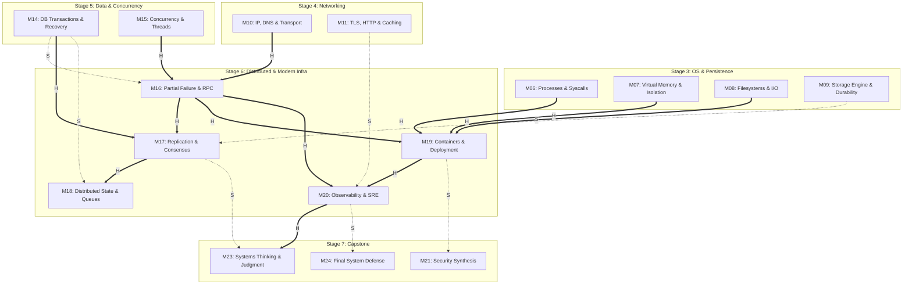

# Distributed Systems & Modern Infrastructure (M16–M20) Research Dossier v0.1

Status: **READY FOR LEAD REVIEW**
Issue: #97 — [Research] M16–M20 Distributed Systems & Modern Infrastructure Research Dossier v0.1
Repository base researched: `main @ 04005e7ed2955542d01770a667f9aa1e0d8db7e7`
Checked date for current specifications, sources, and tools: **2026-09-05**
Role: Research Agent — Distributed Systems, Infrastructure, Observability, Source Provenance, and Feasibility Researcher
Scope: Research phase only; strictly no learner-facing Lesson drafting, no Lab implementation code, no Mini Cloud App feature work, no Concept Registry edits, no new Concept IDs, no silent DAG redesign, and no premature closure of Open Questions.

---

## Evidence-Layer Legend

This dossier strictly adheres to the repository research and source policy (`meta/RESEARCH_AND_SOURCE_POLICY.md`):

- **PRINCIPLE** — Timeless computing invariant, formal theoretical result, mathematical law, or stable system design mechanism independent of specific vendors, platforms, or releases.
- **SPECIFICATION** — Normative, published standard, RFC, language specification, OCI specification, protocol contract, ABI, or formal system interface definition.
- **IMPLEMENTATION** — Concrete behavior observed in a specific operating system, kernel version, database engine, runtime, container engine, or software toolchain under stated conditions.
- **CURRENT PRACTICE** — Modern engineering convention, cloud architecture pattern, widely adopted operational heuristic, or tooling ecosystem consensus as of the checked date (2026-09-05), subject to scheduled evolution.

Confidence and context labels:

- **ESTABLISHED** — Strongly supported by canonical literature, formal specifications, and reproducible systems practice across decades.
- **IMPLEMENTATION-SPECIFIC** — Holds true for the named runtime, kernel version, or environment, but must not be generalized to other platforms.
- **CURRENT-PRACTICE** — Authoritative for current modern production as of 2026-09-05, but recognized as evolving rather than immutable.
- **CONTESTED** — Credible engineers, system architects, or academic sources hold differing positions under comparable trade-offs.
- **UNCERTAIN** — Empirical evidence is incomplete, or the design choice requires experimental implementation testing before commitment.

---

## 1. Executive Recommendation / Readiness

### Recommendation: **READY FOR DESIGN**

This Research Dossier establishes the technical, pedagogical, tooling, environment, Hands-On, Optional-Lab, Source-Expedition, provenance, currentness, and claim-boundary foundation required to design the complete **Stage 6 (S6) Distributed Systems & Modern Infrastructure** slice:

$$\begin{aligned}
\text{M16 (Partial Failure \& RPC)} &\longrightarrow \text{M17 (Replication, Consistency \& Consensus)} \longrightarrow \text{M18 (Distributed State \& Coordination)} \\
&\searrow \\
&\quad \text{M19 (Containers, Virtualization \& Deployment)} \longrightarrow \text{M20 (Observability \& Reliability Engineering)}
\end{aligned}$$

### Key Findings and Governance Alignment

1. **Authoritative DAG Reconstruction & Precedence:**
   - **No Artificial Stage Edges:** S6 consumes two distinct structural inputs: the networking branch (`M10 IP, DNS & Transport` as hard input to `M16`) and the data/concurrency branch (`M15 Concurrency` as hard input to `M16`, and `M14 Transactions` as hard input to `M17`).
   - **Partial Independence Within S6:** While `M16 → M17 → M18` forms the distributed state line, `M19` depends on `M16` and the single-host OS modules (`M06`, `M07`, `M08`), **not** on `M17` or `M18`. `M20` depends on `M19` and `M16`, with soft enrichment from `M11`. This separation prevents turning a sequential Stage narrative into false hard dependencies.
2. **Concept Registry Discipline (Zero New IDs):**
   - **No New Concept IDs:** The 18 canonical concepts in `meta/CONCEPT_REGISTRY.md` remain authoritative.
   - **Consensus Boundary:** The *concept* of consensus is Core at M17 (`L17-02`, per Blueprint disposition R10), but its Registry ID remains deliberately deferred.
   - **No Product or Mechanism IDs:** Terms such as *RPC, Replication, Queue, Container, Observability, Microservices, Kubernetes, Docker, Kafka, Raft, Paxos* are Module-level mechanisms or replaceable Current Cases; none are admitted as Concept IDs.
   - **Revisit Discipline:** M16–M20 revisit existing canonical concepts (`EC-CON-001 State`, `EC-CON-002 Abstraction`, `EC-CON-004 Indirection`, `EC-CON-005 Interface`, `EC-CON-006 Trade-off`, `EC-CON-008 Invariant`, `EC-CON-010 Failure`, `EC-CON-013 Isolation`, `EC-CON-014 Consistency`, `EC-CON-015 Concurrency`, `EC-CON-016 Durability`, `EC-CON-017 Trust Boundary`, `EC-CON-018 Process`). Each revisit applies the concept to the distributed/infrastructure context without duplicating the original definition.
3. **Core Restraint Against Heavy Dependencies:**
   - **No Mandatory Consensus Implementation:** Raft/Paxos is taught at the conceptual, invariant, and worked-trace level; no full Raft implementation or Byzantine fault tolerance is assigned to Core (R11 disposition; reserved for Deep Dive).
   - **No Mandatory Message Broker:** M18 focuses on queue abstractions, delivery semantics, duplicate handling, and idempotent consumer invariants. Neither Kafka, RabbitMQ, nor Redis is a Core prerequisite. A simple course-owned SQLite job-table or in-memory bounded queue demonstrates the mechanisms cleanly.
   - **No Mandatory Cloud Account or Kubernetes Cluster:** M19 teaches Linux namespaces, cgroups, OCI image concepts, and deployment trade-offs. Kubernetes is strictly an optional Current Case, not a Core platform.
   - **No Mandatory Telemetry SaaS Stack:** M20 teaches the signal distinctions (metrics, logs, traces), correlation, SLOs, and clock semantics. Local stdout/structured files and timers are the baseline; OpenTelemetry (`LAB-OPT-04`) is strictly Optional.
4. **Source Expeditions & Rights Discipline:**
   - **EXP-05 (MIT 6.033 Replication, Transactions, Logging Case):** Confirmed as Spring 2018 OCW Lectures 14, 15, and 16. Due to MIT OCW CC BY-NC-SA 4.0 licensing, Essential CS uses link-and-paraphrase only, with zero copied course text or assets.
   - **EXP-04 & LAB-OPT-04 (OpenTelemetry):** OpenTelemetry documentation (CC BY 4.0) and Python SDK (Apache-2.0) verified current (Python SDK v1.44.0 checked). Kept strictly Optional with appropriate notices.
   - **LAB-OPT-02 (Stanford CS144 Checkpoint 2 TCP Receiver):** Remains strictly Optional and rights-gated/link-only. No starter code is vendored.
5. **Open Question OQ-BP-006 Remains OPEN:**
   - Host tool observations are documented as dated evidence (2026-09-05). They do not constitute permanent frozen curriculum pins.

---

## 2. Scope and Canonical Constraints

### 2.1 Scope Chain and Module Definitions

Stage 6 spans exactly 5 Modules (`M16`–`M20`) and 12 preliminary Lessons across Macro Areas `11` (Distributed Systems) and `12` (Modern Infrastructure):

| Module | Canonical Title | Macro Area | Preliminary Lessons | Authoritative DAG Inputs (H/S) | Primary Competency Gain |
|---|---|---|---|---|---|
| **M16** | Distributed Systems Foundations: Partial Failure & RPC | 11 Distributed Systems | L16-01: "What is different about many machines?"<br>L16-02: "How do I call a remote function safely?" | **Hard:** M15, M10<br>**Soft:** M14 | **Trace & Judge** (trace distributed calls, judge timeout/retry/idempotency invariants) |
| **M17** | Replication, Consistency & Consensus | 11 Distributed Systems | L17-01: "How do I keep data safe across machines?"<br>L17-02: "How do machines agree?"<br>L17-03: "How consistent is 'strong enough'?" | **Hard:** M16, M14<br>**Soft:** M09 | **Judge & Explain** (choose consistency models, explain consensus limits, diagnose anomalies) |
| **M18** | Distributed State & Coordination | 11 Distributed Systems | L18-01: "How do services delegate work?"<br>L18-02: "Do I need a distributor?" | **Hard:** M17<br>**Soft:** M14 | **Judge & Diagnose** (delivery-semantics limits, duplicate handling, sync vs async coordination) |
| **M19** | Infrastructure: Containers, Virtualization & Deployment | 12 Modern Infrastructure | L19-01: "What is a container?"<br>L19-02: "What does 'the cloud' actually mean?"<br>L19-03: "How does code get to production?" | **Hard:** M16, M06, M07, M08<br>**Soft:** None | **Explain & Diagnose** (container mechanisms, deployment failures, resource and failure boundaries) |
| **M20** | Observability & Reliability Engineering | 12 Modern Infrastructure | L20-01: "How do I know the system is OK?"<br>L20-02: "How do I debug a production incident?" | **Hard:** M19, M16<br>**Soft:** M11 | **Diagnose & Observe** (signal selection, correlation, SLO reasoning, clock semantics, postmortem) |

### 2.2 Canonical Concept Registry Integrity

In strict conformance with `meta/CONCEPT_REGISTRY.md` and repository governance:

- **Total Concept IDs: Exactly 18.** Zero new concept IDs are added by this Research Dossier.
- **EC-CON-014 Consistency (一致性):** First introduced in M14 (`L14-02`). In M17, M17 **revisits** this concept and extends it from single-node database isolation guarantees to multi-node replicated state visibility guarantees (linearizability, sequential consistency, eventual consistency).
- **EC-CON-015 Concurrency (并发):** First introduced in M15 (`L15-01`). M16–M18 revisit concurrency across independent physical nodes, where concurrency is coupled with non-zero network delay and partial failure.
- **Consensus Boundary:** The consensus *concept* is Core at M17 (`L17-02`), but assigning a stable Registry ID remains deferred per Blueprint reconciliation (§8.5, R10).
- **Application Patterns & Replaceable Cases:**
  - *Schema Evolution / Serialization Compatibility:* Treated in M16 as an application pattern over `EC-CON-003 Representation` and `EC-CON-005 Interface` (wire format evolution, backward/forward compatibility).
  - *At-Least-Once / Idempotent Delivery:* Treated in M18 as an application pattern over `EC-CON-008 Invariant` and `EC-CON-010 Failure`.
  - *Container / Namespace / Cgroup:* Treated in M19 as mechanisms realizing `EC-CON-013 Isolation` and `EC-CON-018 Process`.
  - *Telemetry Signals (Logs, Metrics, Traces):* Treated in M20 as evidence patterns realizing `EC-CON-009 Correctness` and diagnosing `EC-CON-010 Failure`.

### 2.3 Competency Progression Across S6

All outcomes map strictly to the 8 canonical competencies (`meta/COMPETENCY_MATRIX.md`):

```
          [M16] Trace & Judge
         /                   \
        v                     v
   [M17] Judge & Explain   [M19] Explain & Diagnose
        |                     |
        v                     v
   [M18] Judge & Diagnose  [M20] Diagnose & Observe
```

- **Trace:** Trace a distributed request through client, network delay, server execution, timeout, retry, and duplicate handling (M16); trace replicated log entries across leader and follower state machines (M17); trace a message through a queue and consumer offset commitment (M18); trace a container request from host veth through namespace routing to process (M19); trace a distributed request across service boundaries using propagated span context (M20).
- **Judge:** Judge whether an RPC interface requires an idempotency key and how long that key must be retained (M16); evaluate trade-offs between synchronous replication and asynchronous replication lag, or between linearizability and availability under network partitions (M17); choose between synchronous RPC, a durable local job table (outbox pattern), and an external message queue (M18); evaluate rolling vs. blue-green vs. canary deployment strategies for a given stateful workload (M19); judge appropriate SLI/SLO targets and alert burn-rate thresholds (M20).
- **Diagnose:** Distinguish network-path failure from application crash or slow processing (M16); diagnose split-brain anomalies and stale reads (M17); diagnose duplicate execution side effects and out-of-order message processing (M18); diagnose cgroup memory-pressure/OOM evidence, CPU throttling, and image-version mismatch failures in a named Linux/container environment (M19); correlate error spikes with latency distributions and logs during a simulated incident (M20).
- **Explain:** Explain why partial failure is qualitatively different from an in-process call failure (M16); explain consensus safety/liveness boundaries and the FLP asynchronous-model limitation (M17); explain why a transport/broker delivery label alone does not prove exactly-once business effects (M18); explain how Linux namespaces and cgroups contribute to container isolation/resource control on a shared kernel (M19); explain why elapsed durations need a monotonic clock and why wall-clock timestamps alone do not establish distributed causal order (M20).
- **Estimate:** Estimate availability ($99.9\%$ vs $99.99\%$) and error budget in minutes per month (M16, M20); calculate quorum requirements ($W + R > N$) and replication bandwidth overhead (M17); estimate queue depth and backpressure draining times (M18); estimate container memory footprints and cloud resource costs (M19); estimate metric storage cardinality and trace sampling volume overhead (M20).

---

## 3. Authoritative DAG Reconstruction & Narrative Disambiguation

### 3.1 Blueprint DAG Edges for S6

Reconstructing the authoritative DAG from `meta/blueprint/dependency-graph-v0.1.md` (§2) and `meta/blueprint/core-stage-module-lesson-map-v0.1.md`:



### 3.2 Exact Inbound and Outbound Edge Audit

| Edge | Type | Blueprint Rationale | Enforcement in S6 Research / Design |
|---|---|---|---|
| `M10 → M16` | **H** | RPC sits on network transport; partial failure requires packet loss/timeout intuition. | M16 builds on M10 TCP byte streams, timeouts, and connection refusal. |
| `M15 → M16` | **H** | Distributed communication involves concurrent request handlers, background retries, and non-blocking I/O. | M16 uses thread/async execution contexts from M15 to run client/server endpoints. |
| `M14 → M16` | **S** | Single-node transaction semantics help contextualize consistency, but RPC/partial failure can be understood with networking and concurrency alone. | Soft only; M16 must not require M14 transaction tables. |
| `M16 → M17` | **H** | Replication and consensus require the partial-failure and network partition model first. | M17 cannot proceed without M16 failure ambiguity. |
| `M14 → M17` | **H** | Distributed consistency models are a direct generalization of database isolation and atomicity. | M17 builds on M14 transaction invariants and WAL concepts. |
| `M09 → M17` | **S** | Durability model reused for replication (soft). | Optional comparison between local fsync and quorum acknowledgment. |
| `M17 → M18` | **H** | Queues and distributed coordination build on consensus and consistency primitives. | M18 uses M17 ordering and split-brain principles. |
| `M14 → M18` | **S** | Single-node transactions contextualize sagas and outbox patterns. | Soft only; saga is contrasted with local ACID transactions. |
| `M16 → M19` | **H** | Deployment models (rolling, canary) exist to manage failure during state changes. | M19 deployment strategies reference M16 network failure and retry. |
| `M06 → M19` | **H** | Containers are OS processes with execution contexts. | M19 directly inspects process tables, PID namespaces, and syscalls. |
| `M07 → M19` | **H** | Container isolation relies on memory virtualization and cgroups. | M19 inspects memory cgroups and mount isolation. |
| `M08 → M19` | **H** | Container images are layered filesystem trees (OverlayFS). | M19 builds on M08 filesystems, inodes, and mount points. |
| `M19 → M20` | **H** | Observability instruments software running in modern infrastructure environments. | M20 observes containerized processes, resource limits, and deployment states. |
| `M16 → M20` | **H** | Tracing and correlation address distributed failure and latency attribution across nodes. | M20 distributed tracing directly addresses M16 cross-process hops. |
| `M11 → M20` | **S** | HTTP status codes, headers, and navigation timing enrich observability metrics. | Soft only; HTTP metrics serve as familiar examples. |
| `M20 → M23` | **H** | Systems judgment requires measurement discipline and operational observability. | Downstream capstone dependency. |
| `M17 → M23` | **S** | Distributed consistency trade-offs enrich systems thinking synthesis. | Downstream capstone dependency. |

### 3.3 Disambiguation of Narrative vs. Structural Dependency

1. **S4/S5 Partial Independence:**
   - In accordance with Decision D-010 and Blueprint reconciliation, `S4` (Networking & Web) and `S5` (Data & Concurrency) are partially independent after `S3`.
   - The default learner narrative is request-centric (`S4 → S5 → S6`), but the DAG allows a state-centric path (`S5 → S4 → S6`).
   - S6 is the convergence point: **M16 requires both M10 (from S4) and M15 (from S5)**.
2. **No Intrastage Monolith in S6:**
   - While S6 is taught as a thematic unit, **M19 does NOT depend on M17 or M18**.
   - A learner could theoretically study container mechanisms (`M19`) immediately after `M16` and `S3`. Design must respect this modularity: M19 must not introduce hidden prerequisites on Raft consensus or message brokers.

---

## 4. Module-by-Module Technical & Pedagogical Research

### 4.1 M16 — Distributed Systems Foundations: Partial Failure & RPC

#### Core Conceptual Mechanics
- **The Defining Constraint of Distributed Systems:** A remote component can become unreachable, slow, partitioned, or failed while the caller continues running, so the caller may be unable to distinguish several remote states from local observation alone. This partial-failure/observation ambiguity is the teaching boundary; it does **not** imply that all components on one machine always fail together.
- **The Fundamental No-Response Ambiguity:** When a client sends a request and observes no response by its chosen deadline, several materially different states remain possible:
  1. The request was dropped on the outbound network (server never executed it).
  2. The server crashed before executing the request.
  3. The server received and executed the request, but crashed before sending the response.
  4. The server received and executed the request, but the response was dropped on the inbound network.
  5. The server is still processing the request and the response is delayed in a queue.
- **The Leaky Abstraction of RPC (Birrell & Nelson 1984; Waldo et al. 1994):**
  - Remote Procedure Call attempts to make a remote network request look syntactically like a local function call (`result = remote_service.do_something(arg)`).
  - *Why this abstraction leaks inherently:*
    - **Latency:** Remote communication adds serialization, queueing, transport, and remote-processing costs whose magnitude depends on the named environment; no fixed local/LAN/WAN latency ratio is a timeless property.
    - **Address-Space Boundary:** Ordinary RPC between separate processes/machines does not provide direct pointer/pass-by-reference semantics across the boundary; arguments/results are represented on the wire according to a named interface/serialization contract.
    - **Partial Failure & Unreachability:** Local calls can also block or fail, but a remote call adds the distinctive case where the caller remains alive yet cannot know from silence alone whether the remote operation never ran, is still running, completed, or completed without an observable reply.
    - **Concurrency & Delivery Semantics:** Distributed messages can be delayed; datagram transports may expose loss/reordering, while stream transports such as TCP provide an ordered byte stream. Application retries can create duplicate requests/effects even when the transport itself presents ordered bytes.
- **Timeout Mechanics:**
  - A timeout is a client-side decision to stop waiting for an unobserved remote state.
  - *The Trade-off:* A timeout set too low triggers premature retries and false failure declarations under transient network congestion; a timeout set too high holds client resources (threads, sockets, memory) and delays failure detection.
  - A timeout is an *erasure of waiting*, not an erasure of remote execution.
- **Retry Semantics & Retry Amplification:**
  - Unbounded or synchronized retries during downstream overload can amplify load and contribute to a retry storm; whether overload becomes denial of service depends on the workload and capacity.
  - *Retry Amplification in Service Chains (illustrative model):* In a call chain $A \to B \to C \to D$, if each hop independently makes up to $k$ attempts, downstream attempt count can grow multiplicatively (for example, $k^3$ at $D$ in this simplified four-service chain). This is a model, not a recommended retry count.
  - Mitigation principles: Limit retries at intermediate hops; enforce end-to-end retry budgets; pass deadlines/cancellation context along the call tree.
- **Backoff and Jitter Boundaries:**
  - *Exponential Backoff:* $t_{\text{wait}} = \min(t_{\text{max}}, t_{\text{base}} \times 2^{\text{attempt}})$. Prevents immediate re-hammering.
  - *The Thundering Herd Problem:* If many clients fail together and use identical deterministic backoff schedules, their retries can remain synchronized and recreate load spikes. Any concrete client count or delay schedule is only an illustrative model.
  - *Full Jitter (Brooker, AWS 2015 current-practice example):* sample each client's sleep from a bounded interval derived from the backoff cap. This probabilistically decorrelates retry timing; it does not guarantee a particular aggregate traffic distribution or make one formula universally optimal.
- **Idempotency: Principles and Boundaries:**
  - Mathematical definition: $f(f(x)) = f(x)$.
  - Systems/API boundary: idempotency is a property of the operation's intended effect under a named contract. Repeating an idempotent operation should not create additional intended side effects solely because it was repeated; repeated responses need not be byte-for-byte identical.
  - *Common idempotent shapes:* safe reads under the HTTP method contract, overwriting a named resource/state with an absolute target value, or deletion whose intended effect after repetition remains "resource absent." Concurrent external changes and response codes still need a named contract.
  - *Non-Idempotent Operations:* Appending state (`POST /orders`), relative mutations (`UPDATE account SET balance = balance - 100`).
  - *Idempotency Keys:* An application can attach a request-unique opaque key and atomically bind that key to the operation/result (or equivalent deduplication state). The expired IETF `Idempotency-Key` draft is a useful current-practice reference but is not an RFC; exact field syntax and lifecycle policy must be rechecked at Design/Implementation time.
  - *Lifecycle & Eviction Risk:* Deduplication state has a retention/eviction boundary chosen for the operation and retry horizon. Once that state is unavailable, a sufficiently late retry can again create a duplicate effect; no fixed retention duration is universal.
- **Network Failure vs. Application Failure:**
  - *Transport/socket observations:* errors such as connection refusal, timeout, or reset are endpoint/runtime observations whose exact causes are not uniquely determined by one errno. They must not be mapped to a single packet-level story without trace evidence.
  - *Application/protocol observations:* HTTP 4xx/5xx and RPC status codes describe protocol/application outcomes, not unique root causes. A 5xx, for example, does not prove the server process crashed.
  - *Critical Boundary:* A TCP acknowledgment indicates transport receipt into the peer TCP state, not that the application consumed or durably committed the business operation. An HTTP success response carries application/protocol semantics, but durability or downstream side effects are guaranteed only if the named API contract says so.

#### Lesson Alignment in Blueprint
- `L16-01`: "What is different about many machines?"
  - Mental model: Local/in-process failure vs. distributed partial failure; the no-response ambiguity; network-latency evidence as a named-environment revisit.
  - Hands-on: Local two-process socket communication with simulated packet delay and loss.
- `L16-02`: "How do I call a remote function safely?"
  - Mental model: RPC boundary; serialization; timeouts; retries; exponential backoff with full jitter; idempotency keys.
  - Hands-on: Client/server RPC with injected delays; observe duplicate side effects on un-idempotent counters; fix with idempotency keys.

---

### 4.2 M17 — Replication, Consistency & Consensus

#### Core Conceptual Mechanics
- **Why Replicate Data?**
  - *High Availability:* If node $A$ crashes, node $B$ can continue serving requests.
  - *Read Scalability:* Distribute read traffic across multiple replicas.
  - *Durability:* Data survives physical hardware destruction of a single machine.
  - *Latency:* Placing replicas geographically closer to users.
- **Replication Topologies:**
  1. *Single-Leader (Primary-Backup):* All writes go to the designated leader. Leader writes to local storage and replicates changes to followers via a change log (WAL/binlog). Reads can go to leader or followers.
  2. *Multi-Leader:* Multiple nodes accept writes. Necessary for multi-region active-active deployments. Introduces write conflicts that require resolution policies (Last-Write-Wins, CRDTs, operational transformation).
  3. *Leaderless (Dynamo-style):* Client or coordinator writes directly to multiple replicas. Uses quorums for read and write operations.
- **Synchronous vs. Asynchronous Replication:**
  - *Synchronous:* Leader waits for confirmation from follower(s) before returning success to client.
    - *Gain:* Waiting for one or more replica acknowledgments can reduce the set of acknowledged writes that exist only on the leader and can improve failover durability under the stated acknowledgment/failure model; it does not by itself guarantee zero data loss under every failure.
    - *Cost:* Write latency depends on the required acknowledgment set and its slow responders; availability falls when too few required replicas can acknowledge. It is not universally bounded by the single slowest replica unless the policy waits for all of them.
  - *Asynchronous:* Leader acknowledges write to client immediately after writing locally, then replicates to followers in the background.
    - *Gain:* A policy that acknowledges before follower replication can reduce the replication component of client-visible latency and may allow writes while followers are unavailable, subject to the leader's own storage/health and admission policy.
    - *Cost:* **Replication Lag**; follower reads can be stale under the selected guarantee, and failover can lose acknowledged writes that were not present on the promoted durable replica set under the stated failure/recovery model.
  - *Semi-synchronous/hybrid policies:* The leader waits for a configured subset or acknowledgment condition while other replication proceeds asynchronously; exact semantics are product/policy specific.
- **Consistency Guarantees Across Replicas:**
  - *Linearizability (Strong Consistency, Herlihy & Wing 1990):*
    - The system behaves as if there is only a single copy of the data, and all operations take effect instantaneously at a serialization point between their invocation and response.
    - Real-time precedence matters: if one operation completes before another begins, a linearizable history must order them accordingly. This is a relation between invocation/response events, not a requirement to compare unsynchronized machine clock timestamps.
  - *Eventual Consistency:*
    - If no new updates are made, all replicas will eventually converge to the same value.
    - *What it does NOT guarantee:* No guarantee on *when* convergence happens; no guarantee that consecutive reads from the same client observe monotonic progress; potential to read stale data indefinitely while writes continue.
  - *Client-Centric Consistency Guarantees:*
    - *Read-Your-Writes:* A client always observes its own updates.
    - *Monotonic Reads:* If a client reads value $V$, it will never subsequently read an older value.
- **Quorum Mathematics and Failure Boundaries:**
  - In a system of $N$ replicas:
    - Write quorum size: $W$
    - Read quorum size: $R$
    - **Quorum Condition:** $W + R > N$
  - Pigeonhole Principle: $W + R > N$ guarantees that a completed write quorum and a read quorum overlap in at least one replica. **Overlap alone does not prove a linearizable/latest-value read**: the system also needs a defined write-completion rule plus version/order/conflict-resolution semantics, and concurrent/failed writes must be handled.
  - *Common Configurations:*
    - $N=3, W=2, R=2$ (illustrative overlap configuration; a quorum operation can often proceed with one unavailable replica, subject to partition placement and the operation's other rules).
    - $N=5, W=3, R=3$ (illustrative overlap configuration; do not infer full-system failure tolerance from quorum arithmetic alone).
  - *Quorum Edge Cases & Limits:*
    - Concurrent writes: Two clients write to overlapping quorums with different values; requires conflict resolution.
    - Failed writes: If a write succeeds on $W-1$ nodes and times out, the value may still be read by subsequent readers even though the client observed failure.
- **CAP Theorem and Partition Trade-offs (Brewer 2000; Gilbert & Lynch 2002):**
  - In an asynchronous network where partitions ($P$, message loss or indefinite delay) are a physical reality, a distributed data store must choose between:
    - **Consistency (C, Linearizability):** Reject writes or block reads on partitioned nodes to prevent split-brain and stale reads.
    - **Availability (A):** Every non-failing node must return a non-error response, even if it cannot communicate with other replicas, risking stale or diverging data.
  - "Pick 2 out of 3" is a flawed framing: **Partition tolerance is not optional**; physical networks can and do partition. The real trade-off is: *When a partition occurs, do you choose Consistency or Availability?*
- **Consensus: Concept, Invariants, and Limits:**
  - *Consensus Problem Definition:* A set of processes propose values; all non-faulty processes must decide on a single common value.
  - *Formal Properties:*
    - **Agreement:** No two correct processes decide different values.
    - **Validity:** The decided value must have been proposed by at least one process.
    - **Termination:** All non-faulty processes eventually reach a decision.
  - *FLP Impossibility (Fischer, Lynch, Paterson 1985):* In an asynchronous network model, no deterministic consensus algorithm can guarantee termination in the presence of even a single unannounced crash failure.
  - *Practical Consensus (Raft / Multi-Paxos):*
    - These algorithms do not contradict FLP. Safety is designed not to depend on a known fixed message-delay bound, while liveness relies on additional timing/availability assumptions (for example, a sufficiently stable period in which a quorum can communicate and elections can converge). Randomized election timeouts help reduce repeated election collisions but are not a proof that every execution terminates.
    - *Raft Key Mechanisms:*
      1. Leader Election: Split into terms; randomized election timeouts avoid split votes; candidate must have log at least as up to date as majority to win (Leader Completeness).
      2. Log Replication: Leader appends entries and uses `AppendEntries` to replicate them. Under Raft's term/commit rules, an entry can become committed after the required majority replication condition is satisfied; the learner trace should not collapse all commit cases into a generic "majority means committed" rule.
      3. Safety Invariants: Election Safety (at most one leader per term), Leader Append-Only, Log Matching Invariant.
  - *Curriculum Boundary:* M17 teaches the *mechanisms, safety invariants, and trade-offs* through bounded worked traces. No student is required to implement a full Raft consensus engine.

#### Lesson Alignment in Blueprint
- `L17-01`: "How do I keep data safe across machines?"
  - Mental model: Replication goals; leader/follower topologies; synchronous vs. asynchronous replication lag; quorum math ($W + R > N$).
  - Hands-on: Bounded **state/message/failure worked trace** with logical replicas and a partition/lag scenario; no required runnable 3-node service.
- `L17-02`: "How do machines agree?"
  - Mental model: The consensus problem; split-brain danger; Raft leader election and log replication invariants (R10 disposition; Registry ID deferred).
  - Hands-on: Step-through worked trace of leader election with partitioned nodes; verify majority quorum safety.
- `L17-03`: "How consistent is 'strong enough'?"
  - Mental model: Named consistency guarantees (including linearizability vs. eventual consistency), client-centric guarantees such as read-your-writes, and bounded CAP partition trade-off framing.
  - Hands-on: Scenario evaluation: choose consistency level for banking vs. social media feed; identify anomaly traces.

---

### 4.3 M18 — Distributed State & Coordination

#### Core Conceptual Mechanics
- **Queue and Message Broker Abstraction:**
  - Asynchronous decoupling across three axes:
    1. *Time:* Producer can send when consumer is offline or busy.
    2. *Space:* Producer does not need to know the physical network address of consumers.
    3. *Throughput / Concurrency:* Buffers spikes and enables rate-leveling (backpressure).
  - *Point-to-Point (Work Queue):* The abstraction routes each available work item to one competing consumer **per delivery attempt**; retry/failure semantics can still cause redelivery or loss depending on the named guarantee.
  - *Publish-Subscribe / Partitioned Event Log:* Messages are broadcast to multiple consumer groups; each group maintains an independent read offset.
- **Delivery Guarantees and Their Physical Limits:**
  1. *At-Most-Once:*
     - Sender transmits message once without retries, or consumer acknowledges message before processing.
     - *Outcome:* This policy avoids retry-induced duplicate delivery by design, but can lose work when delivery/processing fails. It does not prove that every implementation can never duplicate for any cause.
  2. *At-Least-Once:*
     - Sender retries until ACK received; consumer acknowledges message only *after* completing processing.
     - *Outcome:* Retrying ambiguous deliveries can reduce loss under the stated durability/failure model but makes **duplicate delivery/processing possible and expected** unless the system deduplicates. It is not a zero-loss guarantee under every failure.
  3. *The Myth and Reality of "Exactly-Once":*
     - A broker/transport delivery guarantee alone cannot establish exactly-once **business effects** across arbitrary external side effects. End-to-end claims require a precisely scoped transactional/idempotency/deduplication mechanism and failure model; avoid using the Two Generals Problem as a blanket proof for every exactly-once API claim.
     - Some systems advertise "exactly-once" semantics within a **bounded transactional scope** (for example, broker-managed read/process/write paths). Such a claim must name the scope; it does not automatically include arbitrary external databases, emails, payments, or other side effects.
       - Producer idempotency (sequence numbers per producer ID).
       - Transactional writes across input offsets and output topics.
       - Atomic or idempotent handling at the consumer/output boundary appropriate to the named scope.
- **Deduplication and Idempotent Consumers:**
  - Because at-least-once delivery permits redelivery, the consumer workflow must tolerate duplicate attempts through natural idempotency, deduplication, transactional coupling, or another explicitly justified mechanism.
  - *Deduplication Strategies:*
    - Natural idempotency (state update overwrites with fixed identifier).
    - Deduplication table / processed message store: Store `message_id` within the same local database transaction that executes the business mutation:
      ```sql
      BEGIN TRANSACTION;
      INSERT INTO processed_messages (msg_id, processed_at) VALUES (?, CURRENT_TIMESTAMP);
      -- If insert succeeds (unique constraint), execute business logic:
      UPDATE accounts SET balance = balance + ? WHERE id = ?;
      COMMIT;
      ```
    - If `msg_id` already exists, rollback or ignore; acknowledge message.
- **Ordering Guarantees and Partitions:**
  - A single total order requires a serialization/ordering mechanism; it need not be one physical sequencer, but stronger/global ordering generally adds coordination and can constrain throughput/availability.
  - *Partitioned Ordering:* Many log/broker designs specify ordering only within a key/partition while independent partitions progress concurrently. The exact guarantee (including redelivery and consumer concurrency) is product/protocol specific.
- **Distributed Transactions vs. Sagas:**
  - *Two-Phase Commit (2PC, Gray 1978):*
    - Coordinator sends `PREPARE` to all participants. Participants acquire locks and vote `YES` or `NO`.
    - If all vote `YES`, coordinator writes commit log and sends `COMMIT`; otherwise `ABORT`.
    - *Blocking boundary:* In classic 2PC, a participant that has prepared may be unable to decide commit vs. abort while the coordinator's decision is unavailable. Implementations may retain locks/resources during this uncertainty; the operational impact depends on recovery protocol and workload.
  - *Saga Pattern (Garcia-Molina & Salem 1987):*
    - Replaces a single distributed transaction with a sequence of local transactions.
    - Each step updates local state and emits an event or message triggering the next step.
    - *Compensating Transactions:* A saga defines compensating actions for completed steps when later work fails. Reverse order is a common orchestration pattern, not a universal law, and compensation itself can fail or be only a semantic repair rather than an exact inverse.
    - *Trade-off:* Lack of isolation ($I \in \text{ACID}$). Intermediate states are visible to external observers; compensation is semantic (e.g., refund) rather than a physical rollback.
- **Distributed Locking and Fencing Tokens:**
  - A distributed lock coordinates mutually exclusive access to shared resources across machines.
  - *The Fatal Flaw of Time-Based Leases (Kleppmann 2016):*
    - Client 1 acquires lock with lease $T=10\text{s}$.
    - Client 1 experiences a Stop-the-World GC pause or network stall for $12\text{s}$.
    - Lock expires; Client 2 acquires lock and begins writing.
    - Client 1 resumes, unaware that its lease expired, and writes concurrently, corrupting shared state.
  - *Mitigation — Fencing Tokens:*
    - Lock service issues a monotonically increasing token (e.g., $1, 2, 3$).
    - Target storage rejects any write presenting a token lower than the highest token observed.
- **Durable Work and the Outbox Pattern:**
  - *The Dual-Write Problem:* A service updates a database and sends a message to a queue. If the database commit succeeds but the queue send fails (or vice versa), state diverges.
  - *Transactional Outbox Pattern:* Service writes business state and an outbox record in the same local transaction. A relay later publishes/retries those records. This **supports** durable handoff without 2PC when the local durability, relay retry, broker, and deduplication assumptions hold; it is not an unconditional end-to-end delivery proof.

#### Stream / Event-Log Boundary
- An append-oriented event log records ordered entries within its specified ordering scope and lets consumers track progress independently. **Event sourcing** is a stronger application design choice in which the event history is authoritative state; it must not be presented as synonymous with every message broker or stream.
- Retention, replay, compaction, consumer offsets, and ordering are named-system policies. No Kafka/Redis/RabbitMQ semantics are Core defaults.

#### Lesson Alignment in Blueprint
- `L18-01`: "How do services delegate work?"
  - Mental model: Queue abstractions; at-least-once vs. at-most-once delivery; why "exactly-once" requires consumer idempotency; the outbox pattern.
  - Hands-on: Simulate consumer worker with duplicate delivery; demonstrate corrupt state on non-idempotent updates; repair with deduplication table.
- `L18-02`: "Do I need a distributor?"
  - Mental model: Distributed transactions vs. sagas; why 2PC blocks; compensating transactions; distributed locks and fencing token requirements.
  - Hands-on: Step through a 3-step saga with a failure on step 3; verify execution of compensating actions; observe isolation anomaly.

---

### 4.4 M19 — Infrastructure: Containers, Virtualization & Deployment

#### Core Conceptual Mechanics
- **The Process vs. Container vs. Virtual Machine Boundary:**
  - *Process:* Operating system execution context (PCB, virtual address space, file descriptor table).
  - *Container (canonical Linux case):* One or more ordinary host-kernel processes run with configured namespace/resource/filesystem boundaries. Linux namespaces and cgroups are the Core mechanism case; this wording must not imply that every container platform is Linux or that these controls alone create a VM-equivalent security boundary.
  - *Virtual Machine:* A hypervisor exposes virtual hardware on which a guest kernel/OS runs. Isolation, startup time, and CPU/RAM overhead depend on the hypervisor, guest, workload, and configuration; no fixed "VMs are slow/heavy" constant belongs in Core.
- **Linux Namespaces (Isolation of View):**
  - Namespaces partition global kernel resources so that a process sees only its isolated instance:
    1. `pid`: Provides an isolated process-ID view; the same task can have different PIDs when observed from nested namespace/host contexts.
    2. `net`: Independent virtual network interfaces, IP addresses, routing tables, port bindings.
    3. `mnt`: Isolated filesystem mount point hierarchy.
    4. `ipc`: Isolated System V IPC and POSIX message queues.
    5. `uts`: Isolated hostname and NIS domain name.
    6. `user`: Can map namespace UIDs/GIDs to different host IDs, enabling privilege relationships that differ across the namespace boundary.
    7. `cgroup`: Isolated view of `/proc/self/cgroup`.
- **Linux Control Groups (cgroups v2, Resource Accounting & Limits):**
  - While namespaces restrict *what a process can see*, cgroups restrict *what resources a process can use*.
  - **cgroups v2** provides a unified hierarchy and is the preferred canonical teaching interface when present, but Linux can still expose v1 or mixed arrangements. Hands-on code must detect the actual hierarchy/controllers rather than assume every Linux host has the same writable `/sys/fs/cgroup` layout.
  - *Core Controllers:*
    - `memory.max`: cgroup-v2 hard memory limit. If usage reaches the limit and cannot be reduced, the kernel may invoke the cgroup OOM path and kill one or more tasks. Runtime labels such as `OOMKilled` and shell/container exit-code conventions are **implementation observations**, not kernel-interface guarantees.
    - `cpu.max`: Configures CPU bandwidth quota/period for the cgroup; concrete values and observed throttling belong to the named environment.
    - `pids.max`: Limits total number of processes/threads in cgroup, preventing fork bombs.
    - `io.max`: Read/write bytes-per-second and IOPS limits on block devices.
- **Container Images & OCI Specifications:**
  - *OCI Image Format Specification (v1.1.1, 2025 current check):* An OCI image is described by content-addressed manifests/configuration/layers; do not conflate the image format with a particular runtime storage driver:
    1. Content-addressed layer blobs representing filesystem changes in media types defined by the OCI image specification.
    2. Image Configuration JSON (environment variables, working directory, entrypoint, architecture).
    3. Manifest JSON (maps config descriptor and layer descriptors by SHA-256 digest).
  - *OverlayFS (Linux implementation/current-case, not an OCI requirement):*
    - OverlayFS can present lower layers plus an upper writable layer through a merged mount, and copy-up behavior materializes a lower-layer file in the upper layer before modification.
    - Other runtimes/storage drivers can realize OCI image contents differently; Design must not make OverlayFS internals a universal container property.
- **Deployment Strategies & State Migration:**
  1. *Recreate:* Stop old version, deploy new version. Incurs downtime; simple, avoids version skew.
  2. *Rolling Update:* Progressively replace old instances with new ones. With sufficient capacity/readiness it **can** avoid user-visible downtime, and old/new versions may overlap; when they do, interfaces/state changes must tolerate the actual version-skew window. Neither zero downtime nor a particular skew pattern is guaranteed.
  3. *Blue-Green Deployment:* Maintain old and candidate environments concurrently for a transition, then switch traffic according to a controlled routing plan. It can simplify rollback but usually needs additional temporary capacity and careful shared-state/schema handling; neither the switch nor rollback is literally instantaneous or free.
  4. *Canary Deployment:* Route a bounded subset of traffic/workload to the candidate version, compare named signals against a decision policy, then expand, stop, or roll back. Any percentage, duration, or automation threshold is environment/workload specific.
- **Cloud Infrastructure & Failure Blast Radiuses:**
  - *Failure-domain model:* process, host/VM, rack/facility, provider zone, and region are useful **candidate blast-radius scopes**, but exact nesting and shared dependencies are provider/architecture specific.
  - *Availability Zone / Zone:* A cloud-provider-defined deployment/failure-isolation scope within a region. Physical layout, independence guarantees, and latency are provider specific and must be read from the chosen provider's current documentation if used as a case.
  - *Region:* A provider-defined geographic deployment scope containing one or more zones/services. Regions reduce some correlated-failure risks but are not universally independent of control planes, networks, identities, or other provider systems; no fixed inter-region latency belongs in Core.
- **Infrastructure as Code (IaC) & Continuous Delivery:**
  - Declarative configuration (desired state) vs. imperative scripts.
  - Reproducibility and drift detection.
  - Supply-chain/trust boundary: content digests such as `@sha256:...` identify immutable content; **a digest is not a signature**. Authenticity/provenance requires a separate signing/attestation/trust policy. Mutable tags such as `:latest` are names that can be repointed.

#### Lesson Alignment in Blueprint
- `L19-01`: "What is a container?"
  - Mental model: Process vs. container vs. VM; Linux namespaces; cgroups resource limits; OCI image structure and OverlayFS.
  - Hands-on: Required baseline is read-only inspection of process namespace/cgroup evidence on canonical Linux. `unshare`, delegated cgroup mutation, OverlayFS mounts, or intentional OOM experiments are **capability-gated** and must become ENVIRONMENT-BLOCKED / NOT RUN when permissions/features are absent; Docker/Podman remains Optional.
- `L19-02`: "What does 'the cloud' actually mean?"
  - Mental model: Hypervisors; cloud failure domains (AZ vs. Region); resource metering and cost models.
  - Hands-on: Calculate napkin-math availability and cost trade-offs for single-AZ vs. multi-AZ architectures.
- `L19-03`: "How does code get to production?"
  - Mental model: CI/CD automation pipeline; deployment strategies (rolling vs. blue-green vs. canary); version skew and backward-compatible state.
  - Hands-on: Simulate a rolling deployment with schema version skew; observe failure when backward compatibility is broken; execute safe multi-step rollout.

---

### 4.5 M20 — Observability & Reliability Engineering

#### Core Conceptual Mechanics
- **Three Core Telemetry Signal Families (course model):**
  1. *Metrics:* Numeric measurements aggregated over fixed intervals (Counters, Gauges, Histograms).
     - *Strengths:* Aggregated numeric series can be compact and effective for alerting/trend questions when label cardinality and retention are controlled.
     - *Weakness:* High-cardinality labels can sharply increase memory/storage/query cost; aggregate metrics usually cannot reconstruct one request's full execution path.
  2. *Structured Logs:* Timestamped string or structured JSON records emitted during execution.
     - *Strengths:* Rich local context, event details, and stack/error evidence; sequence/context can support a causal hypothesis but a log line alone does not prove causation.
     - *Weakness:* High volume, expensive storage, difficult to trace across service boundaries without correlation IDs.
  3. *Distributed Traces:* Collections of **spans** related by parent/context and optional links to represent work across process/network boundaries. A simple request is often drawn as a tree; richer link structures need not be forced into one universal DAG shape.
     - *Strengths:* Exposes cross-service latency bottlenecks and causal execution paths.
     - *Weakness:* Instrumentation/export/storage can add complexity and overhead. Sampling is a common control, not a universal requirement for every bounded trace.
- **Correlation and Context Propagation:**
  - Correlation is valuable when a diagnostic question spans boundaries, but uncorrelated aggregate metrics can still answer system-level questions. Distributed request correlation requires a deliberately propagated context/identifier across the relevant boundaries.
  - *W3C Trace Context Level 1 (Recommendation, 23 Nov 2021):* standardized HTTP headers. Trace Context Level 2 is a separate Candidate Recommendation Draft; do not present the draft as a 2023 Recommendation:
    - `traceparent`: `version-trace_id-parent_id-trace_flags` (e.g., `00-4bf92f3577b34da6a3ce929d0e0e4736-00f067aa0ba902b7-01`).
    - `tracestate`: Vendor-specific routing state.
  - Recording a trace/correlation identifier in relevant structured logs can join log events to a request trace, subject to redaction/privacy/cardinality policy; it is not mandatory on every log line.
- **Latency Distributions & Measurement Discipline (M04 Revisit):**
  - *Mean vs. Tail:* A mean can answer aggregate load/cost questions but is insufficient by itself for tail-user experience. A clearly labeled toy distribution can show how a small number of slow requests barely move the mean while strongly affecting upper percentiles.
  - *Percentile Reasoning:* $p50$ (median, typical experience), $p95$, $p99$, $p99.9$ (tail latency).
  - If Design uses a fan-out probability example, it must state independence and identical-distribution assumptions explicitly; real service latencies are often correlated, so a formula such as $1-(1-p)^n$ is an **illustrative model**, not a production prediction.
- **Clock Semantics: Monotonic Clock vs. Wall Clock:**
  - *Resolution of DAG Hidden-Prerequisite Flag:*
  - *Wall Clock (`CLOCK_REALTIME` / Python `time.time()`):*
    - Measures calendar time relative to the epoch (Jan 1, 1970).
    - Can be adjusted backward or forward by NTP synchronization, leap seconds, or system administrators.
    - For elapsed durations/interval timers, prefer a monotonic clock; a wall clock can be adjusted and therefore can produce incorrect elapsed-time subtraction across an adjustment. Wall time remains appropriate for human/calendar timestamps.
  - *Monotonic Clock (`CLOCK_MONOTONIC` / Python `time.monotonic()` / `perf_counter()`):*
    - Monotonically increasing counter from an arbitrary point in time (e.g., system boot).
    - In Python, `time.monotonic()` is defined not to go backward and is unaffected by system-clock updates. Use a monotonic clock for elapsed-duration/timer logic; calendar-aligned SLO windows can still use wall-clock timestamps while per-request duration measurement stays monotonic.
  - *Distributed Clock Skew:* Physical clocks on different machines can differ and be adjusted. Wall-clock timestamps alone therefore do not prove causal/total order; systems that need stronger ordering use protocol, logical/hybrid clocks, consensus, or explicitly bounded clock-uncertainty mechanisms. Avoid a vendor-specific clock system as a hidden Core prerequisite.
- **Service Level Engineering: SLI, SLO, SLA, and Error Budgets:**
  - *Service Level Indicator (SLI):* A quantitative measure of a service behavior relevant to users. A good-events/total-events ratio is one common form, not the definition of every SLI. Any status/latency/window thresholds in examples are explicitly scenario-chosen, not universal.
  - *Service Level Objective (SLO):* Internal target reliability level agreed upon by engineering and product (e.g., $99.9\%$).
  - *Service Level Agreement (SLA):* An externally communicated/contractual service commitment whose consequences and relation to internal SLOs are organization/contract specific; do not assume a universal numeric gap between SLA and SLO.
  - *Error Budget:* For a ratio-style availability objective, the allowed bad-event fraction is derived from the objective (for example, $100\%-\text{SLO}$ under that chosen model). Converting it to minutes requires a named window and outage model; keep any concrete arithmetic explicitly illustrative.
- **Incident Response and Blameless Postmortems:**
  - *Incident Lifecycle:* Detection $\to$ Triage $\to$ Mitigation $\to$ Resolution $\to$ Postmortem.
  - *Mitigation First:* Roll back, shed load, or fail over before deep root-cause debugging.
  - *Blameless incident learning:* Avoid stopping at individual blame. Record proximate actions, system conditions, incentives, safeguards, and contributing factors, then design mitigations. "Human error is never a cause" is too absolute to use as a universal root-cause rule.
  - Postmortem artifact: Incident summary, timeline, impact, contributing factors, action items with owners.

#### Lesson Alignment in Blueprint
- `L20-01`: "How do I know the system is OK?"
  - Mental model: Logs vs. metrics vs. traces; SLI/SLO concepts; error budgets; clock semantics (monotonic vs. wall clock).
  - Hands-on: Instrument a Python service with structured logs and latency metrics; verify monotonic timing; calculate SLO burn rate under injected errors.
- `L20-02`: "How do I debug a production incident?"
  - Mental model: Distributed trace correlation; context propagation; triage vs. root cause; blameless postmortem methodology.
  - Hands-on: Controlled incident walkthrough using course-owned structured logs/timers/correlation IDs as the Core baseline; inject a bounded downstream delay, localize the symptom with available evidence, apply a mitigation, and draft a postmortem. OpenTelemetry spans are an Optional comparison through LAB-OPT-04/EXP-04.

---

## 5. Hands-On Mechanism & Lab Candidate Research

In accordance with Blueprint restraint, Essential CS does not burden learners with heavy cloud vendor configurations, paid SaaS accounts, or complete distributed consensus implementations.

### 5.1 Overview of S6 Practical Work

| ID / Activity | Type | Placement | Exact Mechanism | Canonical Environment | Status & Rights |
|---|---|---|---|---|---|
| **LAB-OPT-02** | Optional Lab | M10 / M16 | TCP Receiver sequence wrapping, byte stream reassembly, advertised window | C++, CMake, Linux | **Adapt — rights-gated.** Link-only until cleared; zero vendored code. |
| **EXP-05** | Source Expedition | M17 | Primary-backup replication, transaction logging, distributed recovery | PDF reading / inspection | **Adopt — link/paraphrase.** MIT 6.033 OCW CC BY-NC-SA 4.0. |
| **M16 Candidate Fixture** | Hands-On Activity | M16 | Two-process localhost request/RPC boundary with a course-owned fault shim that deterministically delays/suppresses a request or response; bounded retries; idempotency/dedup state | Python stdlib candidate; exact runtime floor remains under OQ-BP-006 | **Original Build candidate.** Deterministic script/seed required; no claim that application-level suppression is literal packet loss. |
| **M17 Worked Trace** | Core bounded observation | M17 | State/message/failure worksheet/trace over logical replicas; quorum-overlap and partition scenarios; EXP-05 comparison | No required distributed runtime | **Preserves Blueprint boundary.** No required runnable 3-node service and no Raft/Paxos implementation. |
| **M18 Candidate Fixture** | Hands-On Activity | M18 | Transactional outbox & worker deduplication using SQLite; duplicate injection | Python stdlib + SQLite | **Original Build.** No external broker dependency. |
| **M19 Candidate Fixture** | Hands-On Activity | M19 | Read-only `/proc/.../ns` + cgroup hierarchy/controller inspection; optional/capability-gated `unshare`, delegated cgroup mutation, or OverlayFS case | Canonical Linux shell with capability preflight | **Original Build candidate.** Read-only evidence baseline; privileged/delegated mutations are not silently Required. Docker/Podman Optional. |
| **LAB-OPT-04** | Optional Lab | M20 | Local OpenTelemetry tracing vs. structured logs/timers | Python + `opentelemetry-api`/`sdk` | **Adapt.** Pinned versions; ConsoleExporter only. |
| **EXP-04** | Source Expedition | M20 | OpenTelemetry Python API vs. SDK span lifecycle inspection | GitHub source inspection | **Adopt.** Apache-2.0 / CC BY 4.0. |

### 5.2 Deep-Dive Audit: LAB-OPT-02 (Stanford CS144 TCP Receiver)
- **Pedagogical Purpose:** Demystify byte-stream reassembly, sequence-space wrapping ($2^{32}$ boundary), and flow-control advertised windows.
- **Rights & Provenance:** Stanford CS144 Fall 2025 Checkpoint 2 (`check2.pdf`). Rights for starter code/test suite redistribution remain **unestablished**.
- **Disposition:** Strictly **Optional and link-only**. The course provides conceptual guidance and prediction prompts, but vendors zero CS144 code.

### 5.3 Deep-Dive Audit: EXP-05 (MIT 6.033 Replication, Transactions, Logging)
- **Pedagogical Purpose:** Inspect mature, classic systems engineering lecture cases on fault tolerance, primary-backup replication, transaction coordination, and logging.
- **Source Route:** MIT OCW 6.033 Spring 2018:
  1. Lecture 14: *Fault Tolerance: Reliability via Replication*
  2. Lecture 15: *Fault Tolerance: Introduction to Transactions*
  3. Lecture 16: *Atomicity via Logging*
- **License Gate:** CC BY-NC-SA 4.0. Essential CS must **not** adapt or bundle text under its own license without legal review. Strictly link and paraphrase.

### 5.4 M16–M18 Original Core Hands-On Mechanisms
- **M16 RPC & Idempotency Fixture:**
  - *Mechanism:* Simple localhost client/server boundary with a course-owned shim that deterministically delays or suppresses a selected request/response at the application boundary. Do not call this literal network packet loss unless a packet-level mechanism is actually used and observed.
  - *Evidence:* Client observes a bounded timeout and retry path. A non-idempotent endpoint can repeat a side effect; the protected path atomically records request-key state and returns the stored application result (or another contract-defined duplicate response) without re-executing that protected side effect.
  - *Determinism:* Use a scripted/seeded fault schedule and record runtime/OS. Loopback removes external-network dependence but does not justify a universal "100% reproducible" timing claim.
- **M17 Replication / Quorum Worked Trace:**
  - *Mechanism:* A bounded state/message table with logical replicas $A,B,C$; no required runnable replica service. Record which replicas acknowledge a completed write and which replicas answer a later read.
  - *Quorum Evidence:* Show that $W+R>N$ forces set overlap, then separately specify the version/order/conflict-resolution rule needed to decide which value a read returns. Include a failed/ambiguous write and a concurrent-write counterexample so overlap is not mislabeled as linearizability.
  - *Consensus Boundary:* Keep Raft/Paxos to conceptual/step-through traces plus EXP-05; no consensus implementation.
- **M18 Transactional Outbox & Worker Deduplication:**
  - *Mechanism:* SQLite database with `orders` and `outbox` tables. Producer inserts into both within one atomic transaction (`BEGIN IMMEDIATE`). A simulated worker polls `outbox`, processes order, and writes to `processed_events`.
  - *Evidence:* Artificially deliver duplicate events; worker relies on unique constraint in `processed_events` to ignore duplicate without double-processing.

### 5.5 M19 Container Mechanics (Native Linux vs. Docker)
- **Native Canonical Path:**
  - Required baseline uses read-only Linux evidence such as `/proc/self/ns/*`, mount/cgroup metadata, and the detected hierarchy/controllers. `unshare(1)`, writing controller files, creating mounts, or inducing OOM require explicit capability/delegation checks and become BLOCKED/NOT RUN when unavailable.
  - Demonstrates the Linux container mechanism as processes plus configured isolation/resource/filesystem boundaries; do not reduce every container to "just an unprivileged process" or claim VM-equivalent isolation.
- **Optional Tooling Path:**
  - If Docker or Podman is available, an optional pinned image can compare namespace/process observations. The image digest/version and network-pull assumption must be recorded; no mutable image name is a hidden requirement.
  - Preserves OQ-BP-006: Docker is strictly **Optional** and never a hard requirement for completing Core.

### 5.6 LAB-OPT-04 & EXP-04 (OpenTelemetry)
- **LAB-OPT-04:**
  - Instruments a 2-step Python function with `opentelemetry-api` and `opentelemetry-sdk`. Exports spans to `ConsoleSpanExporter`.
  - Contrasts the output with a simple Python structured log (`logging` with extra dictionary) and timer (`time.perf_counter()`).
  - Demonstrates trace context propagation (`trace_id`, `span_id`) without requiring a heavyweight Jaeger or Prometheus daemon.
- **EXP-04:**
  - Source inspection pinned to OpenTelemetry Python `v1.44.0`: `opentelemetry-api/src/opentelemetry/trace/span.py` (API) vs. `opentelemetry-sdk/src/opentelemetry/sdk/trace/__init__.py` (SDK). Recheck the route when the Optional handout is implemented.
  - Explicit stopping point: Observe how an active span manages span context and attributes; identify where start/end timestamps are captured.

### 5.7 Mini Cloud App Integration Hooks (P3, P7, P8)
- **P3 Revisit (M16):** Introduce network delay and bounded retry to the client communicating with the local Mini Cloud App.
- **P7 Deployment Boundary (M19):** Package the Mini Cloud App with a reproducible configuration (native systemd service or optional Containerfile). Compare native process execution with container execution. Container remains an optional comparison.
- **P8 Instrumentation Before Scaling (M20):** Add structured request logging with timing and error counts to the Mini Cloud App. P8 baseline is structured logs and timers; full OpenTelemetry tracing is strictly optional.

---

## 6. Authoritative Primary Sources & Currentness Audit

All sources checked on **2026-09-05** against primary standards and official repositories:

| ID | Short Description | Primary Authority / Source URL | Class | License / Terms | Currentness Status & Date |
|---|---|---|---|---|---|
| **S-M16-01** | End-to-End Arguments in System Design | Saltzer, Reed, Clark (ACM TOCS, 1984) | PRINCIPLE | ACM Copyright (Citation/fair use) | ESTABLISHED classic foundation |
| **S-M16-02** | Implementing Remote Procedure Calls | Birrell & Nelson (ACM TOCS, 1984) | PRINCIPLE | ACM Copyright | ESTABLISHED classic foundation |
| **S-M16-03** | A Note on Distributed Computing | Waldo, Wyant, Wollrath, Kendall (Sun Microsystems, 1994) | PRINCIPLE | Sun/Oracle Technical Report | ESTABLISHED classic foundation |
| **S-M16-04** | HTTP Semantics (Idempotency) | RFC 9110 (IETF, June 2022) §9.2 | SPECIFICATION | IETF Trust Legal Provisions | ESTABLISHED stable standard |
| **S-M16-05** | Idempotency-Key HTTP Header | IETF `draft-ietf-httpapi-idempotency-key-header-07` | CURRENT PRACTICE / expired draft | IETF Trust | Latest revision 2025-10-15; expired/archived 2026-04-18. Useful practice reference only; **not an RFC**. |
| **S-M16-06** | Exponential Backoff and Jitter | Marc Brooker (AWS Architecture Blog, 2015) | CURRENT PRACTICE | AWS / Public Blog | Authoritative vendor engineering example, not a cross-industry specification; formulas remain workload/policy choices. |
| **S-M17-01** | Linearizability: A Correctness Condition | Herlihy & Wing (ACM TOPLAS, 1990) | PRINCIPLE | ACM Copyright | ESTABLISHED classic foundation |
| **S-M17-02** | Brewer's Conjecture / CAP Theorem Proof | Gilbert & Lynch (ACM SIGACT News, 2002) | PRINCIPLE | ACM Copyright | ESTABLISHED formal proof |
| **S-M17-03** | In Search of an Understandable Consensus (Raft) | Ongaro & Ousterhout (USENIX ATC, 2014) | PRINCIPLE | USENIX Open Access | ESTABLISHED classic consensus algorithm/paper; not a protocol standard. |
| **S-M17-04** | MIT 6.033 Spring 2018 Lecture Notes | MIT OCW 6.033 (Saltzer, Kaashoek, Morris) | PRINCIPLE | CC BY-NC-SA 4.0 | ESTABLISHED historical course material |
| **S-M18-01** | Sagas | Garcia-Molina & Salem (ACM SIGMOD, 1987) | PRINCIPLE | ACM Copyright | ESTABLISHED classic foundation |
| **S-M18-02** | Notes on Data Base Operating Systems (2PC) | Jim Gray (IBM Research, 1978) | PRINCIPLE | IBM / Springer | ESTABLISHED classic foundation |
| **S-M18-03** | How to do distributed locking | Martin Kleppmann (Blog, 2016) | CURRENT PRACTICE | Public Blog | Useful **CONTESTED/current-practice** argument for lease/fencing boundaries; not a normative locking specification. |
| **S-M19-01** | Linux Namespaces Man Pages | Linux `namespaces(7)`, `cgroup_namespaces(7)` / man-pages | IMPLEMENTATION | Linux man-pages project | Current Linux user-space interface documentation rechecked 2026-09-05; probe host capabilities/permissions. |
| **S-M19-02** | Linux Control Groups v2 Documentation | Linux Kernel `admin-guide/cgroup-v2` | IMPLEMENTATION | Linux kernel documentation | Authoritative Linux interface/design documentation rechecked 2026-09-05; delegation and writable controllers are environment dependent. |
| **S-M19-03** | OCI Image Specification | `opencontainers/image-spec` (v1.1.1) | SPECIFICATION | Apache-2.0 | CURRENT checked release v1.1.1, released 2025-03-03. |
| **S-M19-04** | OCI Runtime Specification | `opencontainers/runtime-spec` (v1.3.0) | SPECIFICATION | Apache-2.0 | CURRENT checked release v1.3.0, released 2025-11-04. |
| **S-M20-01** | Google Site Reliability Engineering | Beyer, Jones, Petoff, Murphy (O'Reilly, 2016) | CURRENT PRACTICE | Free online edition | ESTABLISHED industry foundation |
| **S-M20-02** | W3C Trace Context | Level 1 W3C Recommendation (2021); Level 2 separately tracked | SPECIFICATION | W3C Software and Document License | Level 1 Recommendation 2021-11-23 remains stable baseline; Level 2 is Candidate Recommendation Draft, not a 2023 Recommendation. |
| **S-M20-03** | OpenTelemetry Python API & SDK | `open-telemetry/opentelemetry-python` tag `v1.44.0` | IMPLEMENTATION | Apache-2.0 | CURRENT checked release v1.44.0, released 2026-07-16; EXP-04 source paths verified at this tag. |

---

## 7. Claim-Boundary Hotspots & Universal Truth Traps

Essential CS explicitly forbids teaching implementation heuristics, environment-specific artifacts, or temporary industry constants as universal truths. The following claim boundaries must be strictly enforced in subsequent Design and Lesson authoring:

### 7.1 Distributed Communication & RPC Traps
1. **No Fixed Timeout Constants:** Do NOT teach "a web timeout should be 5 seconds" or "database timeout is 2 seconds" as universal truths. Timeout values depend on workload distribution, network topology, user experience tolerances, and downstream deadline budgets.
2. **No Timeless Retry Formula:** Do NOT teach that retrying 3 times is an industry standard. Unconditional retries under systemic downstream outages cause immediate cascading failure.
3. **Transport Success $\ne$ Application Success:** Do NOT teach that receiving an HTTP `200 OK` or TCP ACK guarantees that the remote business operation succeeded or was committed to durable storage.
4. **Idempotency is Not Free:** Do NOT teach that adding an idempotency key guarantees perpetual safety. Idempotency storage has finite TTL, eviction policies, and race conditions during concurrent execution of the same key.

### 7.2 Replication & Consistency Traps
1. **Replication Lag is Not a Constant:** Do NOT teach that replication lag is "typically a few milliseconds." Lag is dynamic and unbounded under heavy write bursts, large schema migrations, or cross-datacenter WAN link degradation.
2. **CAP is Not "Pick Two":** Do NOT teach that you can choose "CA" (Consistency and Availability) on a physical network. Physical networks partition; you can only choose how the system behaves *when* a partition occurs.
3. **Quorum Arithmetic Is Not a Latency/Consistency Proof:** Do NOT infer timing, disk persistence, consensus, or linearizability from $W+R>N$. It proves set overlap only; read/write latency and value choice depend on the protocol, acknowledgment, versioning, conflict, durability, and failure rules.
4. **Eventual Consistency is Not "Instantaneous":** Do NOT teach that eventual consistency means "consistent almost immediately." In the presence of persistent network partitions or misconfigured gossip protocols, eventual consistency can take minutes, hours, or require manual intervention.

### 7.3 Message Queues & Coordination Traps
1. **Scope Every "Exactly-Once" Claim:** Do NOT treat a broker/transport label as proof that arbitrary business side effects occur exactly once. Record the transactional/idempotency/deduplication scope and what external effects lie outside it.
2. **Queueing is Not Free Scalability:** Do NOT teach that adding a message queue solves performance problems. Queues decouple throughput spikes, but introduce operational complexity, message serialization overhead, poison pills, and consumer lag.
3. **Distributed Lock Claims Need a Failure Model:** A lease/lock by itself does not prove stale holders cannot act after expiry or partition. Fencing tokens validated by the protected resource are one important mitigation pattern; do not universalize one product or mechanism as the only correct design.

### 7.4 Containers & Virtualization Traps
1. **No Fixed Container/VM Startup Overhead:** Startup and deployment time depend on image/artifact presence, storage/network, runtime/hypervisor, guest/workload initialization, host pressure, and measurement boundary. Do not replace one forbidden fixed comparison with another product-specific constant.
2. **Containers Are Not Virtual Machines:** Do NOT teach that a container provides hardware-level isolation. A container process shares the host kernel; a kernel panic, dirty COW exploit, or kernel resource leak affects the entire host.
3. **Image Size is Not Static:** Do NOT teach fixed byte sizes for container base images. Base image sizes drift across package updates.

### 7.5 Observability & Reliability Traps
1. **Mean Alone Is Insufficient for Tail Questions:** Mean latency is still meaningful for some aggregate/capacity questions, but it cannot characterize a tail distribution by itself. Select percentiles/distributions only when they answer the stated question and record sample/window limits.
2. **Use Monotonic Time for Elapsed Durations:** Do not subtract an adjustable wall clock for correctness-sensitive elapsed timers when a monotonic clock is available. Wall-clock time remains appropriate for calendar/event timestamps; clock source and semantics must be named.
3. **Telemetry is Not Zero-Cost:** Cardinality, logging volume, trace volume/sampling, export, retention, and query patterns can add CPU, memory, I/O, network, storage, privacy, and cost overhead. Measure the named setup; do not teach a fixed degradation factor or universal sampling percentage.

---

## 8. Environment, Tooling & OQ-BP-006 Dispositions

### 8.1 Canonical Environment Classification

| Tool / Capability | Classification | Requirement for Core | Host Availability (2026-09-05) | Truthful Fallback / Disposition |
|---|---|---|---|---|
| **Canonical Linux OS** | Operating System | **Required** for Core mechanisms | Linux (Ubuntu/Debian) or WSL2 | Host is Windows/pwsh; local commands run under native shell, Linux tests via WSL/VM. |
| **Python 3.x stdlib candidate** | Runtime candidate for course-owned fixtures | Candidate, **exact floor OPEN under OQ-BP-006** | Executor reports CPython 3.13.1 on author host | Stdlib is preferred to keep burden low, but Research does not pin a permanent minimum version. Design/Implementation must preflight the actual selected runtime. |
| **Linux namespace/cgroup evidence** | OS Mechanism | Read-only mechanism evidence is Core; mutation is capability-gated | Canonical Linux required; exact host capabilities vary | `/proc`/cgroup inspection baseline. `unshare`, writable delegated cgroups, mounts, and OOM injection must be preflighted; absent permission/feature = BLOCKED / NOT RUN, not a hidden learner failure. |
| **Docker / Podman** | Container CLI | **Optional** | Not required for Core | Optional convenience only; no learner is blocked without a container runtime. |
| **OpenTelemetry Python SDK** | Telemetry Library | **Optional** (`LAB-OPT-04`) | PyPI package `opentelemetry-sdk` | If package installation is unavailable, fallback to Python standard `logging` + `perf_counter`. |
| **C++ / CMake / GCC** | Compiler Toolchain | **Optional** (`LAB-OPT-02`) | Optional for Stanford CS144 | Link-only; optional external exercise. |

### 8.2 OQ-BP-006 Disposition: **Remains OPEN**
- Open Question `OQ-BP-006` (What versions define the first stable environment?) remains **OPEN**.
- Executor host observations and the checked source releases (OCI image-spec v1.1.1, runtime-spec v1.3.0, OpenTelemetry Python v1.44.0) are dated Research evidence only. Exact learner runtime/tool floors remain unresolved under OQ-BP-006 until the affected Design/Implementation contract pins and verifies them.

---

## 9. Licensing, Provenance & Rights Gates

1. **MIT 6.033 Course Materials (`EXP-05`):**
   - *Owner:* Massachusetts Institute of Technology.
   - *License:* CC BY-NC-SA 4.0.
   - *Gate:* OCW's CC BY-NC-SA 4.0 terms impose attribution, noncommercial, and ShareAlike obligations and may include third-party-rights caveats. Essential CS therefore keeps EXP-05 link-and-paraphrase by default; any redistribution/adaptation under repository terms requires compatibility/legal review.
2. **Stanford CS144 Materials (`LAB-OPT-02`):**
   - *Owner:* Stanford University.
   - *License:* Redistribution/adaptation rights remain unresolved for the selected CS144 materials; do not label them "proprietary" without a source-specific rights determination.
   - *Gate:* Zero vendored starter code or PDF text. Link-only.
3. **OpenTelemetry Project (`LAB-OPT-04`, `EXP-04`):**
   - *Owner:* Cloud Native Computing Foundation (CNCF).
   - *License:* Documentation is CC BY 4.0; Code is Apache-2.0.
   - *Gate:* License-cleared in principle. Source code inspection requires preserving Apache-2.0 copyright notices and LICENSE files.
4. **Essential CS Original Fixtures (M16, M17, M18):**
   - *Owner:* Essential CS Project.
   - *License:* Original repository license.
   - *Gate:* Clean-room implementations using standard library primitives; zero external course code copied.

---

## 10. Unresolved Factual Uncertainty & Technical Escalations

### Classification Summary

- **SIMPLE RESEARCH FIX:** Web Lead Round 1 applied bounded corrections for M17 hands-on scope, quorum semantics, RPC/idempotency boundaries, delivery/2PC claims, Linux capability gating, OCI/container semantics, clock/telemetry claims, and current-source classification.
- **COMPLEX REWORK:** None required after the bounded Lead corrections.
- **ARCHITECTURE / ESCALATION:**
  - `OQ-BP-006` remains OPEN as planned; no architecture action needed at Research stage.
  - `Consensus` concept remains Core at M17 (`L17-02`), with stable Concept ID deferred as decided in Issue #9.
  - No new Concept IDs are introduced.

---

## 11. Final Recommendation & Verification Sign-Off

### Final Recommendation: **READY FOR DESIGN**

This dossier satisfies all entry criteria for Stage 6 Design. It provides:
1. Complete pedagogical and technical coverage of M16, M17, M18, M19, and M20.
2. Strict reconstruction of the authoritative Blueprint DAG (preserving S4/S5 independence and S6 internal modularity).
3. Zero new Concept IDs, preserving `meta/CONCEPT_REGISTRY.md`.
4. Comprehensive universal truth traps forbidding arbitrary constant indoctrination.
5. Exact licensing, provenance, and source-boundary determinations for all candidate activities.

*Note: Acceptance of this Research Dossier does not imply Design acceptance, learner validation, VERIFIED status, or RELEASED status.*
