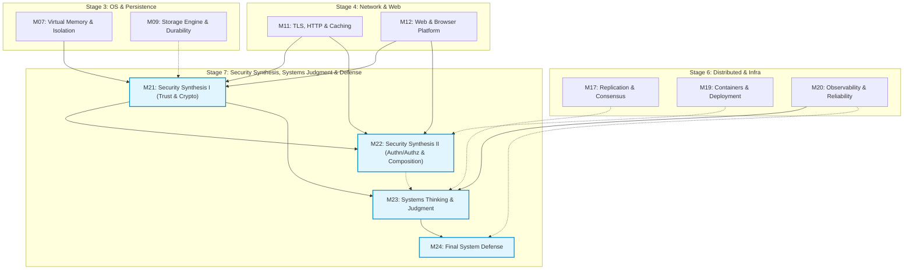

# Stage 7 (S7) M21–M24 Security Synthesis, Systems Thinking & Final Defense Research Dossier v0.1

Status: **READY FOR LEAD REVIEW**
Issue: #112 — `[Research] S7 M21–M24 Security Synthesis & Systems Judgment Research Dossier v0.1`
Repository base researched: `main @ fe5cc5506d80b029f4a96004c2a6f66f72fed067`
Checked date for current specifications, sources, and tools: **2026-09-07**
Role: Research Agent (Local Executor) — Security Synthesis, Systems Thinking, Technology Judgment, and Defense Assessment Researcher
Scope: Research phase only; strictly no learner-facing Lesson drafting, no Lab/fixture implementation code, no Mini Cloud App feature changes, no Concept Registry edits, no new Concept IDs, no first-home moves, no silent DAG redesign, no new Required Lab addition, and no premature resolution of Open Questions.

---

## Evidence-Layer Legend

This dossier strictly adheres to the repository research and source policy (`meta/RESEARCH_AND_SOURCE_POLICY.md`):

- **PRINCIPLE** — Timeless computing invariant, formal theoretical result, mathematical law, or stable system design mechanism independent of specific vendors, platforms, or releases.
- **SPECIFICATION** — Normative, published standard, RFC, language specification, W3C/WHATWG standard, protocol contract, ABI, or formal system interface definition.
- **IMPLEMENTATION** — Concrete behavior observed in a specific operating system, kernel version, runtime, cryptographic library, database engine, or software toolchain under stated conditions.
- **CURRENT PRACTICE** — Modern engineering convention, industry consensus, widely adopted operational heuristic, or tooling ecosystem consensus as of the checked date (2026-09-07), subject to scheduled evolution.

Confidence and context labels:

- **ESTABLISHED** — Strongly supported by canonical literature, formal specifications, and reproducible systems practice across decades.
- **IMPLEMENTATION-SPECIFIC** — Holds true for the named runtime, library version, or environment, but must not be generalized to other platforms.
- **CURRENT-PRACTICE** — Authoritative for modern production as of 2026-09-07, but recognized as evolving rather than immutable.
- **CONTESTED** — Credible engineers, system architects, or academic sources hold differing positions under comparable trade-offs.
- **UNCERTAIN** — Empirical evidence is incomplete, or the design choice requires experimental implementation testing before commitment.

---

## 1. Executive Summary & Readiness Recommendation

### Recommendation: **READY FOR DESIGN**

This Research Dossier establishes the technical, pedagogical, cryptographic, web-security, supply-chain, systems-judgment, measurement-methodology, and capstone-defense foundation required to design the complete **Stage 7 (S7): Security Synthesis, Systems Thinking & Judgment, and Final System Defense** slice:

$$\begin{aligned}
\text{M21 (Trust \& Crypto Use)} &\longrightarrow \text{M22 (Authn/Authz \& Secure Composition)} \\
&\searrow \quad \swarrow_{\text{(soft)}} \\
\text{M20 (Observability)} \longrightarrow &\quad \text{M23 (Systems Thinking \& Judgment)} \longrightarrow \text{M24 (Final System Defense)}
\end{aligned}$$

### Key Findings and Governance Alignment

1. **Exact DAG Reconstruction & Ancestry Discipline:**
   - S7 is the capstone synthesis Stage of the Core spine, but “complete shared traversal” does **not** create undocumented Stage-wide hard edges.
   - The authoritative Module DAG from `meta/blueprint/dependency-graph-v0.1.md` is reconstructed exactly:
     - **M21:** Hard inputs `M11` (TLS/HTTP), `M07` (Virtual Memory/Isolation), `M12` (Web/Browser); Soft input `M09` (Storage/Durability).
     - **M22:** Hard inputs `M21`, `M11`, `M12`; Soft input `M19` (Containers/Deployment).
     - **M23:** Hard inputs `M20` (Observability), `M21`; Soft inputs `M22`, `M17` (Replication/Consistency).
     - **M24:** Hard input `M23`; Soft input `M20`.
   - All 10 preliminary lesson IDs and learner questions are preserved for dependency reasoning. No new hard prerequisite edges are introduced.
2. **Concept Registry & First-Home Discipline (Zero New IDs):**
   - Exactly **18 canonical concepts** remain in `meta/CONCEPT_REGISTRY.md`. Zero new Concept IDs are added.
   - **`EC-CON-017 Trust Boundary` (信任边界) remains first-introduced at M07 (`L07-01`).** In M21 and M22, Trust Boundary is synthesized across multi-layer systems (network, process, identity, web, dependencies), not redefined.
   - `EC-CON-013 Isolation` remains first-home M07 `L07-01` and is revisited to highlight where isolation mechanisms (e.g. process memory, containers, browser origins) enforce or fail to enforce trust boundaries.
   - All other canonical concepts (`EC-CON-007 Specification`, `EC-CON-008 Invariant`, `EC-CON-009 Correctness`, `EC-CON-010 Failure`, `EC-CON-016 Durability`, `EC-CON-014 Consistency`, `EC-CON-015 Concurrency`, `EC-CON-018 Process`) preserve their accepted first homes.
   - Security terms (*threat model, hash, MAC, digital signature, certificate, authentication, authorization, session, JWT, CSRF, SSRF, least privilege, supply-chain provenance*) are domain mechanisms and patterns, **not** new Registry Concept IDs.
   - Consensus Registry ID remains deliberately deferred.
3. **Defense-First Security Stance & Safe Local Evidence (D-012):**
   - Strictly **zero offensive exploit tooling, zero penetration-testing training, zero public/live target interaction, and zero credential theft training**.
   - All security hands-on evidence uses safe, localhost-only, bounded, synthetic-data fixtures where the educational endpoint is **fix-and-verify** (e.g. signature verification failure, parameterized SQL vs string concatenation, allow/deny authorization policy checks, SameSite/Origin header validation).
4. **Lab Selection Map Integrity (Zero New Required Labs):**
   - The accepted lab map contains exactly 5 Required Labs, 5 Optional Labs, and 5 Source Expeditions.
   - **No new Required Lab is introduced.** The open question of a course-owned vulnerable app is resolved for Design by recommending **Candidate B: bounded, course-owned localhost security fixtures embedded directly in M21/M22 standard activity pairs**, accompanied by security/privacy reviews on the Mini Cloud App (P2/P8/P9), avoiding adding a 6th Required Lab or changing the 5/5/5 architecture.
5. **Modern Authoritative Source Alignment (2026-09-07 Status):**
   - Cryptographic claims: NIST SP 800-131A Rev. 2 (transitions), NIST SP 800-63B (passwords/authenticators), FIPS 186-5 (digital signatures), RFC 8446 / RFC 9846 (TLS 1.3), RFC 9525 (service identity in TLS), RFC 9106 (Argon2id).
   - Web/Composition claims: W3C CSP Level 3, WHATWG Fetch/HTML (Origin, CORS), RFC 6265bis (Cookies / SameSite), RFC 7519 / RFC 8725 (JWT & BCP 225), RFC 6749 / RFC 9700 / OAuth 2.1 draft (OAuth delegation, deprecation of implicit/ROPC, mandatory PKCE), OWASP Top 10 (2021/2025 as empirical industry guidance).
   - Supply-chain claims: SLSA v1.0, Sigstore / in-toto concepts, cryptographic lockfile digests.
6. **M23 Systems Judgment & D-015 Framework Consolidation:**
   - Consolidates the applied measurement-uncertainty toolkit (first assessed at M04 `L04-02`, productionized at M20 `L20-01`) into a rigorous measurement methodology: question, hypothesis, baseline, controlled change, environment/workload, repetitions, distribution metrics (p50/p95/p99), and inference limits.
   - Preserves the 12-field D-015 Technology Evaluation Framework: *Problem → Constraints → Mechanism → Gains → Costs → Failure Modes → Alternatives → When-not-to-use → Scale Threshold → Evidence → Evolution → Stable Principle*. Explicitly recognizes **rejection** ("do not add this technology") as a valid passing judgment.
   - AI-generated claims are classified as **untrusted hypotheses** requiring source/test/measurement verification (Current Case under `L23-02`), preserving OQ-BP-001 as OPEN without creating an AI Core Module.
7. **M24 Final System Defense as Integration & Articulation:**
   - M24 introduces no new mechanism scope. It provides the capstone assessment contract across all 8 canonical competencies: Trace, Explain, Observe, Diagnose, Correctness, Judge, Estimate, and Learn-New-Tech.
   - Passing is evaluated on the defensibility of evidence-to-claim links and trade-off justification under constraints, not tool quantity or cloud deployment.
8. **Open Questions and Governance Invariants Preserved:**
   - `OQ-BP-001` (bounded AI literacy): OPEN / RFC-gated (`RFC-CAND-001` candidate only).
   - `OQ-BP-003` (human-facing / accessibility scope): OPEN / RFC-gated (`RFC-CAND-002` candidate only).
   - `OQ-BP-006` (canonical software/environment versions): OPEN (implementation-time pin).
   - Issue #34 (real learner validation): OPEN / DEFERRED / NON-BLOCKING per D-027.
   - Earlier M03 GDB unavailable debt and M06 course-fork grader NOT RUN debt remain truthfully preserved.

---

## 2. Canonical Scope & DAG Reconstruction

### 2.1 Scope Definition and Preliminary Lesson Map

Stage 7 comprises four Modules (`M21`–`M24`) and ten preliminary Lessons across Macro Areas `13` (Security Synthesis), `14` (Systems Thinking & Judgment), and `15` (Final System Defense):

| Module | Canonical Title | Macro Area | Preliminary Lessons (IDs & Questions) | Authoritative DAG Inputs (H/S) | Primary Competency Focus |
|---|---|---|---|---|---|
| **M21** | Security Synthesis I: Trust & Crypto Use | 13 Security Synthesis | **L21-01:** "Where are the boundaries I must protect?"<br>**L21-02:** "What do I use crypto for?" | **Hard:** M11, M07, M12<br>**Soft:** M09 | **Judge & Explain** (boundary identification, crypto role: confidentiality/integrity/auth/non-repudiation, API misuse diagnosis) |
| **M22** | Security Synthesis II: Authn/Authz & Secure Composition | 13 Security Synthesis | **L22-01:** "How do I know who is calling?"<br>**L22-02:** "Why is my web app vulnerable?"<br>**L22-03:** "Why do I trust my dependencies?" | **Hard:** M21, M11, M12<br>**Soft:** M19 | **Judge & Diagnose** (authn vs authz, injection/XSS/CSRF/SSRF defense, supply-chain provenance) |
| **M23** | Systems Thinking & Judgment | 14 Systems Thinking & Judgment | **L23-01:** "How do I measure honestly?"<br>**L23-02:** "How do I pick a technology?"<br>**L23-03:** "What is the cost of my design?" | **Hard:** M20, M21<br>**Soft:** M22, M17 | **Judge & Estimate** (measurement methodology, D-015 Technology Evaluation Framework, napkin math & cost models) |
| **M24** | Final System Defense | 15 Final System Defense | **L24-01:** "Can I defend an architecture?"<br>**L24-02:** "What should I measure before I ship?" | **Hard:** M23<br>**Soft:** M20 | **Judge & Explain** (integrated architecture defense, trade-off defense, pre-ship verification design) |

### 2.2 Authoritative DAG Reconstruction

The authoritative dependency structure for S7 is reconstructed verbatim from `meta/blueprint/dependency-graph-v0.1.md` §3 and §4:



#### Detailed Rationale for Module DAG Edges:

1. **M21 Edges:**
   - **Hard `M07 → M21`:** M07 introduced `EC-CON-017 Trust Boundary` and `EC-CON-013 Isolation` at the OS/hardware boundary (kernel vs user space, page tables, memory faulting). M21 synthesizes this into an explicit threat-modeling discipline.
   - **Hard `M11 → M21`:** M11 introduced TLS record encryption, certificates, and secure transport. M21 extracts cryptographic primitives (symmetric cipher, public key, hashing, signature) from the TLS bundle into general system use.
   - **Hard `M12 → M21`:** M12 introduced browser origin boundaries (SOP) and web security context. M21 uses these as concrete non-network trust boundaries.
   - **Soft `M09 -.-> M21`:** M09 provides durability and disk persistence; soft context for cryptographic key storage, state wipe, and encrypted storage boundaries.
2. **M22 Edges:**
   - **Hard `M21 → M22`:** M21 supplies cryptographic primitive understanding (hashes, HMACs, digital signatures, public-key verification), which M22 requires to analyze password hashing, session cookies, and JWT token signatures.
   - **Hard `M11 → M22`:** M11 supplies HTTP request/response semantics, headers, status codes, and TLS transport, which M22 uses for cookie transmission, headers (`SameSite`, `Authorization`), and TLS protection.
   - **Hard `M12 → M22`:** M12 supplies DOM, rendering, Same-Origin Policy, and browser context, which M22 directly requires to explain XSS, CSRF, and CSP.
   - **Soft `M19 -.-> M22`:** M19 supplies container boundaries and CI/CD pipelines, which provide soft context for dependency management, image scanning, and supply-chain attacks.
3. **M23 Edges:**
   - **Hard `M20 → M23`:** M20 established production observability, metric types, distributions, SLOs, and the monotonic vs wall-clock distinction. M23 consolidates this into the universal measurement methodology.
   - **Hard `M21 → M23`:** M21 established the threat model and boundary reasoning needed to evaluate security as a system property in the D-015 Technology Evaluation Framework.
   - **Soft `M22 -.-> M23`:** M22 provides secure composition and supply-chain evaluation examples for technology cards.
   - **Soft `M17 -.-> M23`:** M17 provides consensus/consistency trade-off reasoning (e.g. CAP/linearizability bounds) that informs system trade-off defense.
4. **M24 Edges:**
   - **Hard `M23 → M24`:** M23 provides the complete judgment toolkit: measurement methodology, D-015 framework, napkin math, and cost models. M24 is the direct articulation and defense of those dimensions.
   - **Soft `M20 -.-> M24`:** M20 supplies operational observability evidence (logs, metrics, traces, alerts) utilized in the pre-ship verification defense.

### 2.3 Preliminary Lesson-Level Cross-Module Hard Prerequisites

The Preliminary Lesson Map (`meta/blueprint/core-stage-module-lesson-map-v0.1.md` §5) defines lesson-level dependencies strictly subordinate to the Module DAG:

| Lesson ID | Module | Title / Question | Lesson Hard Prerequisites | Authority Note |
|---|---|---|---|---|
| **L21-01** | M21 | "Where are the boundaries I must protect?" | `L11-01` (TLS), `L07-01` (Isolation/Trust Boundary), `L12-03` (Web Security / Origin) | Refines `M11`, `M07`, `M12` Module-`H` inputs; introduces no new Module edge. |
| **L21-02** | M21 | "What do I use crypto for?" | `L21-01` | Intra-module progression: boundaries established before selecting crypto tools. |
| **L22-01** | M22 | "How do I know who is calling?" | `L21-02` (Crypto primitives), `L11-02` (HTTP semantics) | Refines `M21` and `M11` Module-`H` inputs. |
| **L22-02** | M22 | "Why is my web app vulnerable?" | `L22-01`, `L12-03` (Browser Origin / DOM) | Refines `M22` and `M12` Module-`H` inputs. |
| **L22-03** | M22 | "Why do I trust my dependencies?" | `L22-02` | Intra-module progression: app composition expands to third-party code composition. |
| **L23-01** | M23 | "How do I measure honestly?" | `L20-01` (Observability/Metrics/Clocks), `L04-02` (Locality & Measurement Foundations) | Refines `M20` Module-`H` input and recurs the M04 measurement thread. |
| **L23-02** | M23 | "How do I pick a technology?" | `L23-01`, S6 foundations | Refines `M23` measurement base and synthesis over distributed/infrastructure layers. |
| **L23-03** | M23 | "What is the cost of my design?" | `L23-02` | Intra-module progression: technology evaluation leads to cost/resource modeling. |
| **L24-01** | M24 | "Can I defend an architecture?" | `L23-02` (Technology Evaluation Framework) | Refines `M23` Module-`H` input; capstone defense requires evaluation framework. |
| **L24-02** | M24 | "What should I measure before I ship?" | `L24-01` | Intra-module progression: architecture defense leads to empirical pre-ship verification. |

### 2.4 Concept Registry Integrity Audit

In strict compliance with `meta/CONCEPT_REGISTRY.md`:

1. **Total Concept IDs: Exactly 18.** Zero new concept IDs are created in S7 Research.
2. **Canonical First Homes Preserved:**
   - `EC-CON-017 Trust Boundary` (信任边界): **First home remains M07 `L07-01`**. In M07, virtual-memory and process address spaces provided the first concrete isolation boundary, where the distinction between an isolation boundary (mechanism preventing interference) and a trust boundary (boundary where authority and verification obligations change) was established. M21 synthesizes this across systems.
   - `EC-CON-013 Isolation` (隔离): First home M07 `L07-01`. Revisit in M21/M22 for browser origins, process boundaries, and credential boundaries.
   - `EC-CON-007 Specification` (规格): First home M02 `L02-03`. Revisit in M21 (threat model assumptions) and M24 (explicit architectural contracts).
   - `EC-CON-008 Invariant` (不变量): First home M02 `L02-03`. Revisit in M21 (cryptographic invariants), M22 (untrusted input boundaries), M24 (system safety invariants).
   - `EC-CON-009 Correctness` (正确性): First home M02 `L02-03`. Revisit in M21 (verification conformance), M22 (authorization conformance), M24 (system claims backed by evidence).
   - `EC-CON-010 Failure` (故障): First home M03 `L03-03`. Revisit in M21/M22 (security failure modes), M23 (failure taxonomy), M24 (failure walkthrough).
   - `EC-CON-016 Durability` (持久性): First home M09 `L09-01`. Revisit in M24 (state inventory and recovery bounds).
   - `EC-CON-014 Consistency` (一致性): First home M14 `L14-02`. Revisit in M24 (data consistency across stores).
   - `EC-CON-015 Concurrency` (并发): First home M15 `L15-01`. Revisit in M24 (race condition risks, thread/event boundaries).
   - `EC-CON-018 Process` (进程): First home M06 `L06-01`. Revisit in M21 (privilege separation) and M24 (process architecture).
3. **Domain Vocabulary Boundaries:**
   - The following terms are recognized as vital pedagogical mechanisms, techniques, and operational patterns, but are **explicitly forbidden from being created as new Concept IDs**:
     - *Threat Model, Attack Surface, Defense in Depth, Principle of Least Privilege;*
     - *Cryptographic Hash, Message Authentication Code (MAC), Symmetric Cipher, Public-Key Cryptography, Digital Signature, Certificate / CA, Nonce, CSPRNG, Salt, Work Factor;*
     - *Authentication, Authorization, Session, Bearer Token, JWT, OAuth, OIDC;*
     - *SQL Injection, Cross-Site Scripting (XSS), Cross-Site Request Forgery (CSRF), Server-Side Request Forgery (SSRF), Insecure Deserialization;*
     - *Same-Origin Policy (SOP), Content Security Policy (CSP), SameSite Cookie;*
     - *Software Bill of Materials (SBOM), Dependency Pinning, Cryptographic Hash Lockfile, Provenance;*
     - *Measurement Methodology, Benchmark Rigor, Napkin Math, Technology Evaluation Framework, Technology Card, System Defense.*
   - `Consensus` (共识) Registry ID remains deferred per Blueprint reconciliation (§8.5, R10).

### 2.5 Competency Progression Across S7

Outcomes map strictly to the 8 canonical competencies (`meta/COMPETENCY_MATRIX.md`):

```
       [M21] Judge & Explain
             |
             v
       [M22] Judge & Diagnose
             |
             v
       [M23] Judge & Estimate & Learn-New-Tech
             |
             v
       [M24] Judge & Explain & Diagnose & Estimate & Correctness (Capstone Synthesis)
```

- **Trace:** Trace how untrusted input flows across a trust boundary into a database query parser or template renderer (M21/M22); trace cryptographic key derivation and signature verification steps across parties (M21); trace an authentication/authorization decision path through session/token verification (M22); trace the complete request, data, and control flow through the Mini Cloud App in defense (M24).
- **Explain:** Explain why encryption does not imply integrity or authentication (M21); explain why hashing is not encryption (M21); explain why `SameSite=Lax` cookies alone do not prevent all CSRF (M22); explain why SQL parameterization prevents injection at the AST level (M22); explain why average latency hides tail degradation and why monotonic clocks are mandatory for duration measurement (M23); explain and defend architectural choices and moved complexity under cross-examination (M24).
- **Observe:** Observe signature verification failure on tampered data using standard tools (M21); observe HTTP request headers, cookie attributes, and preflight OPTIONS requests in localhost fixtures (M22); observe metric distributions, percentiles (p50/p95/p99), and variance across repeated benchmark runs (M23); observe system behavior under simulated resource or constraint changes (M24).
- **Diagnose:** Diagnose cryptographic API misuses (e.g. ECB mode, static nonces, unauthenticated encryption, broken password hashing) (M21); diagnose Broken Object Level Authorization (IDOR), reflected/stored XSS, and SSRF in course-owned local fixtures (M22); diagnose flawed measurement designs (e.g. missing warm-up, client-side bottleneck, coordinated omission, NTP clock step) (M23); diagnose architectural single-points-of-failure and invariant violations (M24).
- **Correctness:** Formulate security invariants (e.g. "no request executes SQL without AST-isolated parameter binding"; "no privileged operation executes without explicit tenant authorization") (M21/M22); verify state invariants across concurrent and failing executions (M24).
- **Judge:** Judge whether a threat model requires asymmetric signatures or symmetric HMAC (M21); judge session-cookie vs stateless-JWT trade-offs under token revocation and secret leakage constraints (M22); evaluate and judge candidate technologies using the D-015 framework with explicit permission to reject (M23); defend overall system architecture, trade-offs, and residual risks (M24).
- **Estimate:** Estimate password cracking work factors and brute-force entropy thresholds (M21); estimate storage overhead and bandwidth costs of token claims vs session lookups (M22); calculate napkin-math capacity, throughput, latency budgets, and multi-tenant resource costs (M23/M24).
- **Learn-New-Tech:** Read and evaluate an unfamiliar cryptographic library API or security specification to find safe usage guidance (M21); evaluate an unfamiliar package/dependency for provenance, maintenance health, and security posture (M22); systematically evaluate an unfamiliar technology product using authoritative documentation and produce a completed Technology Card (M23).

---

## 3. Module-by-Module Research Analysis

### 3.1 M21 — Security Synthesis I: Trust & Crypto Use

#### 3.1.1 Purpose & Mental-Model Contribution

Security is not a feature, a plug-in component, or a collection of defensive tricks; **security is a system property of boundaries and authority**. Systems fail securely or insecurely based on whether trust boundaries are explicitly identified, whether assumptions across those boundaries are verified, and whether mechanisms appropriately enforce the required invariants.

M21 synthesizes the horizontal security thread developed across the course:
- `M07 L07-01` introduced `EC-CON-017 Trust Boundary` alongside hardware memory isolation;
- `M11 L11-01` introduced transport security (TLS), certificates, and peer identity over untrusted networks;
- `M12 L12-03` introduced browser origin boundaries (Same-Origin Policy);
- `M19 L19-03` introduced container isolation, deployment boundaries, and pipeline integrity.

M21 extracts cryptography from the "black box of TLS" and establishes **what cryptographic tools are for, what invariants they guarantee, and how to use trusted APIs correctly**, without turning Core into a mathematics or cryptographic algorithm implementation course.

#### 3.1.2 Mechanism Analysis & Core Claims

```
               ┌─────────────────────────────────────────────────────────┐
               │              CRYPTOGRAPHIC MECHANISMS MAP               │
               └─────────────────────────────────────────────────────────┘
                                           │
         ┌─────────────────────────────────┼─────────────────────────────────┐
         ▼                                 ▼                                 ▼
  [CONFIDENTIALITY]                 [INTEGRITY]                     [AUTHENTICITY]
  "Who can read it?"             "Was it modified?"              "Who actually sent it?"
         │                                 │                                 │
  ┌──────┴──────┐                   ┌──────┴──────┐                   ┌──────┴──────┐
  │  Symmetric  │                   │ Cryptographic│                   │   MAC /     │
  │ Encryption  │                   │    Hash     │                   │  Signature  │
  │ (AES-GCM,   │                   │  (SHA-256,  │                   │ (HMAC, RSA, │
  │  ChaCha20)  │                   │   SHA-3)    │                   │   Ed25519)  │
  └─────────────┘                   └─────────────┘                   └─────────────┘
         ▲                                                                   ▲
         └───────────────────────── AEAD ────────────────────────────────────┘
                          (Authenticated Encryption)
```

1. **Threat Model & Trust Boundary (Revisit EC-CON-017):**
   - *Threat Model:* An explicit specification of: (1) Assets to protect; (2) Adversary capabilities and access levels; (3) Trust boundaries crossed; (4) Assumed system invariants; (5) Residual risks accepted.
   - *Principle of Least Privilege (PoLP):* An entity should possess only the minimum authority, credentials, and access duration necessary to perform its specified task.
   - *Defense in Depth:* Multiple independent protection layers so that the failure of a single mechanism does not compromise the entire system.
2. **Cryptographic Primitives & Invariants:**
   - **Cryptographic Hash Functions (One-Way & Collision-Resistant):**
     - Guarantees: Fixed-size digest $H(M)$ from arbitrary-length $M$; pre-image resistance (given $y$, infeasible to find $x$ such that $H(x)=y$); collision resistance (infeasible to find $x_1 \neq x_2$ such that $H(x_1) = H(x_2)$).
     - *Boundary:* A hash alone provides **integrity against accidental corruption**, but **zero authentication or protection against an active attacker** who can modify the message and recompute the hash.
   - **Message Authentication Codes (MAC / HMAC):**
     - Combines a cryptographic hash with a shared secret key ($HMAC_K(M)$).
     - Guarantees: **Integrity AND Authenticity** between parties sharing key $K$. An attacker without $K$ cannot forge a valid MAC for a modified message.
   - **Symmetric Encryption (Confidentiality via Shared Secret):**
     - Algorithms: Modern ciphers operate as **AEAD (Authenticated Encryption with Associated Data)**, e.g., AES-GCM (NIST SP 800-38D) or ChaCha20-Poly1305 (RFC 8439).
     - Guarantees: Confidentiality of ciphertext + authenticity/integrity of ciphertext and unencrypted associated data (AAD).
     - *Boundary:* Requires secure out-of-band secret key distribution. Never use ECB mode (leaks plaintext patterns). Never reuse a nonce/IV with the same key under GCM/Poly1305 (destroys authenticity guarantees).
   - **Asymmetric Cryptography (Public-Key / Private-Key):**
     - Key pair: Public key $K_{pub}$ (distributed freely) and Private key $K_{priv}$ (kept strictly secret).
     - *Digital Signatures (Ed25519 / RSA-PSS / ECDSA):* Private key signs; public key verifies. Guarantees **Authenticity, Integrity, and Non-Repudiation**.
     - *Asymmetric Key Exchange (ECDH / X25519):* Parties establish a shared symmetric secret over an untrusted channel without transmitting the secret itself.
   - **Public Key Infrastructure (PKI) & Certificates (Revisit M11):**
     - An X.509 certificate binds an identity (e.g. domain name via SAN per RFC 9525) to a public key, digitally signed by a trusted Certificate Authority (CA).
     - *Boundary:* A valid certificate proves that the remote endpoint controls the private key matching the certified name. **A certificate does NOT prove that the endpoint is safe, non-malicious, or bug-free.**
   - **Randomness, Nonces, and Entropy:**
     - Security requires a **Cryptographically Secure Pseudorandom Number Generator (CSPRNG)** backed by OS entropy (`/dev/urandom`, Windows `BCryptGenRandom`, Python `secrets` module / `os.urandom`).
     - *Boundary:* PRNGs designed for simulation/benchmarking (e.g. Python `random`, C `rand()`) are completely predictable and must never be used for tokens, keys, IVs, or salts.
   - **Secret Management Basics:**
     - Secrets must never be committed to source code or baked into container images.
     - Inject via environment variables or volume mounts from dedicated secret stores.
     - In-memory lifetime: zeroization / rapid garbage collection where supported.

#### 3.1.3 Cryptographic Claim Boundaries (What NOT to Universalize)

The research establishes strict boundaries to avoid common curriculum fallacies:
- **Do not teach "hashing encrypts data":** Hashing is a one-way transformation that discards information; encryption is a two-way transformation with a secret key. Hashing cannot be decrypted.
- **Do not teach "encryption proves identity":** Symmetric encryption only proves that whoever produced the ciphertext possessed the shared key; it does not identify which of the shared-key holders created it. Plain asymmetric encryption provides confidentiality, not authenticity, unless paired with a signature or authenticated exchange.
- **Do not teach "signature means the content is trustworthy":** A digital signature only proves that the specific byte sequence was signed by the possessor of the corresponding private key without subsequent tampering. It says nothing about whether the content is true, safe, non-malicious, or well-written.
- **Do not teach "certificate means the endpoint is safe":** A TLS certificate proves identity ownership of a domain name, not the ethical or technical safety of the software running behind it. Phishing sites routinely obtain valid TLS certificates.
- **Do not teach "random UUID/token is automatically secure":** A standard UUIDv4 generated from an unseeded or non-cryptographic PRNG is predictable. Cryptographic credentials require CSPRNG entropy.
- **Do not teach "one algorithm or key size is forever correct":** Cryptographic parameters have explicit lifetimes governed by cryptanalysis and computational advances (e.g., NIST SP 800-131A Rev. 2 deprecating SHA-1 and 2-key 3DES).
- **Do not teach "don't roll your own crypto" as a thought-terminating slogan:** Explain the concrete engineering rationale: cryptographic algorithms have subtle implementation invariants (timing side channels, padding oracle attacks, nonce reuse catastrophic failure, cache attacks) that standard high-level libraries (e.g. PyCA `cryptography`, libsodium) handle, whereas ad-hoc implementations almost universally fail.

---

### 3.2 M22 — Security Synthesis II: Authn/Authz & Secure Composition

#### 3.2.1 Purpose & Mental-Model Contribution

If M21 establishes trust boundaries and cryptographic tools, M22 investigates **how systems fail when composed**. Application security is predominantly about composition errors: failing to distinguish identity from permission, allowing untrusted input to alter command syntax, failing to confine cross-site browser requests, and naively trusting third-party dependencies.

The learner goal is **defense-first composition judgment**: understanding root causes of composition vulnerabilities, learning how to verify defenses rigorously, and applying the principle of least privilege across the application lifecycle, without becoming an offensive exploit technician.

#### 3.2.2 Mechanism Analysis & Core Claims

```
                        ┌─────────────────────────────────────────┐
                        │        SECURE COMPOSITION STACK         │
                        └─────────────────────────────────────────┘
                                             │
      ┌──────────────────────────────────────┼──────────────────────────────────────┐
      ▼                                      ▼                                      ▼
[IDENTITY & ACCESS]                  [INPUT & EXECUTION]                    [DEPENDENCIES]
"Who are you & what can you do?"     "Is data escaping into code?"          "What third-party code runs?"
      │                                      │                                      │
  Authn vs Authz                         SQL Injection                          Lockfile Hashes
  (Identity vs Permission)               (Bind parameters)                      (Integrity verification)
      │                                      │                                      │
  Password Hashing (Argon2id)            XSS (Context encoding + CSP)           Provenance & Attestation
      │                                      │                                  (SLSA, signing)
  Sessions vs Tokens (JWT misuse)        CSRF (SameSite + Anti-CSRF)                │
      │                                      │                                  Minimal Dependencies
  OAuth 2.1 / OIDC delegation            SSRF (Egress IP validation)            (Least authority)
```

1. **Authentication (Authn) vs. Authorization (Authz):**
   - **Authentication:** Verifying the identity claim of an entity ("Who are you?"). Examples: password verification, public key challenge-response, multi-factor authenticator.
   - **Authorization:** Determining whether a verified identity has permission to perform a requested action on a specific resource ("What are you allowed to do?").
   - *Critical Boundary:* **Authentication never implies authorization.** Successfully logging in as User A does not authorize User A to read or edit User B's documents (Broken Object Level Authorization / IDOR).
2. **Password Storage Guidance (NIST SP 800-63B & RFC 9106):**
   - Passwords must **never** be stored in plaintext, encrypted with a reversible key, or hashed with fast general-purpose hash functions (MD5, SHA-1, SHA-256, SHA-512). Fast hashes allow billions of guesses per second on modern GPUs/ASICs.
   - Use **memory-hard, tunable, salted password hashing functions**:
     - **Argon2id (RFC 9106):** Current state-of-the-art recommendation (winner of Password Hashing Competition; memory-hard, resistant to GPU and side-channel attacks).
     - **scrypt (RFC 7914) / bcrypt:** Acceptable established alternatives where Argon2id is unavailable.
     - **PBKDF2 (RFC 8018):** CPU-bound only (no memory hardness); requires very high iteration counts (e.g. >= 600,000 for PBKDF2-HMAC-SHA256 per OWASP 2023/2025 guidance); considered legacy compared to Argon2id.
   - *Salt Invariant:* A unique, CSPRNG-generated salt (minimum 128 bits) per password prevents precomputed rainbow table attacks and cross-user hash matching.
3. **Session vs. Token Mechanics:**
   - **Server-Side Session:** Client holds an opaque session identifier (stored in an `HttpOnly`, `Secure` cookie); server stores session state in memory/DB/Redis.
     - *Gains:* Immediate revocation capability, low client storage complexity, minimal sensitive data exposed to client.
     - *Costs:* Server state lookup required per request, state synchronization in distributed setups.
   - **Stateless Tokens (JWT - RFC 7519):** Client holds a self-contained token containing claims, digitally signed or MACed by the issuer.
     - *Gains:* Decentralized verification without database lookup on every service.
     - *Costs & Risks:* Token cannot be immediately revoked before expiration without maintaining a distributed revocation list (which recreates server state!); token size adds network overhead on every request; risk of sensitive data leakage if claims are unencrypted.
4. **JWT Security Best Current Practices (RFC 8725 / BCP 225):**
   - **Algorithm Verification:** Explicitly reject `alg: "none"`. Whitelist expected algorithms on the server (do not let the client token header dictate the algorithm!).
   - **Key Confusion Defense:** Prevent asymmetric public keys from being used to verify HMAC-SHA256 tokens (where the attacker signs with the server's public key treating it as HMAC secret).
   - **Standard Claim Validation:** Always validate `exp` (expiration), `nbf` (not before), `iss` (issuer), and `aud` (audience).
5. **OAuth 2.0 / 2.1 & OpenID Connect (OIDC) Conceptual Boundaries:**
   - **OAuth 2.0 (RFC 6749):** An **authorization delegation framework** allowing a third-party application to obtain limited access to an HTTP service on behalf of a resource owner. **OAuth 2.0 is NOT an authentication protocol.**
   - **OpenID Connect (OIDC):** An identity layer built on top of OAuth 2.0 that provides authentication via an `id_token` (JWT).
   - *Current Standards Update (OAuth 2.1 / Security BCP):*
     - Authorization Code flow **must** use PKCE (Proof Key for Code Exchange, RFC 7636) for all clients (public and confidential).
     - Implicit Grant (`response_type=token`) and Resource Owner Password Credentials (ROPC) grant are **deprecated and disallowed** due to credential leakage risks.
6. **Web Vulnerabilities & Safe Defense Patterns:**
   - **SQL Injection (SQLi):**
     - *Root Cause:* Conflating code and data by dynamically concatenating untrusted strings into SQL query strings.
     - *Safe Defense:* **Parameterized queries / Prepared statements.** The query structure is pre-parsed by the database into an Abstract Syntax Tree (AST); parameters are transmitted separately as literal data values and cannot alter query grammar.
     - *Boundary:* Object-Relational Mappers (ORMs) prevent SQLi only when they use parameterized queries under the hood; raw SQL interpolation inside an ORM is still vulnerable. Parameterization does not protect dynamic table or column names (requires strict allowlist validation).
   - **Cross-Site Scripting (XSS):**
     - *Root Cause:* Rendering untrusted input into the browser DOM in a context where the browser interprets it as executable code (HTML, JavaScript, CSS, URL).
     - *Safe Defense:* **Context-aware output encoding** (HTML entity, attribute, JS string encoding) + modern UI frameworks with automatic contextual escaping + Content Security Policy (CSP) + `HttpOnly` cookies to protect session identifiers.
   - **Cross-Site Request Forgery (CSRF):**
     - *Root Cause:* The browser automatically attaches ambient credentials (cookies, HTTP basic auth) to cross-site requests initiated by malicious third-party origins.
     - *Safe Defense:* **Anti-CSRF Tokens** (Synchronizer Token Pattern: random cryptographically secure token bound to user session, validated on state-changing requests) + `SameSite=Lax` / `SameSite=Strict` cookies + custom request headers (`X-Requested-With`) + checking `Origin` / `Referer` headers.
   - **Server-Side Request Forgery (SSRF):**
     - *Root Cause:* The application server fetches a remote URL provided by an untrusted user without restricting network destinations.
     - *Safe Defense:* Parse URL, resolve IP address, and enforce an **egress firewall / allowlist** that blocks loopback (`127.0.0.0/8`), private networks (RFC 1918: `10.0.0.0/8`, `172.16.0.0/12`, `192.168.0.0/16`), cloud metadata services (`169.254.169.254`), and IPv6 analogues at socket connection time (preventing DNS rebinding).
   - **Insecure Deserialization:**
     - *Root Cause:* Passing untrusted byte streams into object reconstruction mechanisms (e.g. Python `pickle`, Java `ObjectInputStream`, PHP `unserialize`) that permit arbitrary code execution during object instantiation.
     - *Safe Defense:* **Never use polymorphic/executable serializers on untrusted data.** Use pure data serialization formats (JSON, Protocol Buffers) with strict schema validation.
7. **Supply Chain & Dependency Provenance (Connecting M19 to M22):**
   - *Dependency Risk:* Modern applications import thousands of third-party transitive dependencies. An attacker compromising a maintainer account or package repository can inject malicious code into production applications.
   - *Defenses:*
     - **Lockfiles with Cryptographic Hashes:** Pinning exact version numbers AND SHA-256 integrity hashes (e.g. `package-lock.json`, `poetry.lock`, `Cargo.lock`). Prevents silent package substitution.
     - **Provenance & Attestation (SLSA / Sigstore):** Cryptographic verification that an artifact was built by an identified CI/CD pipeline from a specific Git commit, without tampering.
     - *Boundary:* A signed package proves *who built it and from what commit*; it does **not** prove that the source code contains no bugs or backdoors. Dependency hygiene requires minimizing dependency counts and auditing high-privilege packages.

#### 3.2.3 Web & Composition Claim Boundaries

- **Do not collapse CORS into authentication:** CORS is a browser mechanism that relaxes the Same-Origin Policy to permit cross-origin reads; it does not protect server endpoints from direct requests (e.g. via `curl` or server-to-server).
- **Do not collapse CSP into a complete XSS defense:** Content Security Policy is a defense-in-depth mitigation designed to restrict where scripts can be loaded from; it does not replace the requirement for correct output encoding.
- **Do not collapse SameSite cookies into a universal CSRF proof:** `SameSite=Lax` allows top-level cross-site navigation GET requests. If state-changing actions are accessible via GET, or under specific subdomain compromise scenarios, `SameSite` alone is insufficient. State-changing requests must require POST/PUT/DELETE with explicit anti-CSRF validation.
- **Do not collapse input validation into output encoding:** Validating input (e.g. ensuring an email matches an email format) does not prevent XSS if that input is rendered into HTML without encoding. Both are required: validate input for domain correctness; encode output for the rendering context.
- **Do not collapse SQL parameterization into authorization:** Parameterized queries guarantee that input remains data; they do not check whether the current user is permitted to access the matched rows.
- **Do not collapse SSRF into "just URL validation":** Validating a URL string with regex is vulnerable to URL parsing discrepancies (e.g. `@` symbols, encoded characters) and DNS rebinding (where the domain resolves to an external IP during validation, but resolves to `127.0.0.1` when fetched). Defense must validate the resolved IP at socket connect time.
- **Do not collapse dependency pinning into provenance or trust:** Pinning a version string (`pkg == 1.2.3`) without cryptographic hashes does not prevent upstream registry tampering. Pinning with hashes ensures reproducibility and integrity, but does not guarantee the package is trustworthy.

---

### 3.3 M23 — Systems Thinking & Judgment

#### 3.3.1 Purpose & Mental-Model Contribution

The highest goal of Essential CS is **independent technical judgment** (Curriculum Invariant 1). A junior engineer memorizes product features and follows recipes; a senior systems engineer evaluates technologies by understanding constraints, mechanisms, trade-offs, and empirical evidence.

M23 is the **capstone judgment module**. It does not introduce heavy new mechanism stacks; instead, it synthesizes the entire course into three structured capabilities:
1. **Honest, Reproducible Measurement:** Consolidating the experimental pattern (first introduced in M04 `L04-02`, productionized in M20 `L20-01`) into a formal measurement methodology that resists benchmark self-deception;
2. **The D-015 Technology Evaluation Framework:** A 12-dimension discipline for evaluating any computing technology objectively and deciding whether to adopt or reject it;
3. **Cost & Resource Economics:** Order-of-magnitude napkin math, capacity estimation, and multidimensional cost modeling under explicit constraints.

#### 3.3.2 Measurement Methodology & Benchmarking Rigor (L23-01)

```
       ┌─────────────────────────────────────────────────────────────┐
       │             RIGOROUS MEASUREMENT METHODOLOGY                │
       └─────────────────────────────────────────────────────────────┘
                                      │
       ▼                              ▼                              ▼
 [EXPERIMENTAL]               [STATISTICAL]                  [CLOCK & SCALE]
 Question & Hypothesis        Distributions (not averages)   Monotonic vs Wall-Clock
 Baseline vs Change           Percentiles (p50, p95, p99)    Coordinated Omission
 Workload & Environment       Repetitions & Warm-up          Inference Limits
```

1. **The Universal Experimental Pattern:**
   - **Question / Hypothesis:** What specific performance or resource claim is being tested?
   - **Baseline:** What is the established, measured performance before the change?
   - **Controlled Change:** Exactly one independent variable is varied (e.g. cache size, index presence, concurrency level).
   - **Environment & Workload:** Exact hardware, OS, kernel, compiler, runtime versions, and synthetic workload characteristics recorded.
   - **Repetitions & Distribution:** Single-run numbers are rejected. Multiple trials with warm-up cycles to eliminate JIT/caching transients.
   - **Competing Explanations:** Actively seeking alternative causes (e.g. CPU frequency scaling, background OS processes, GC pauses, client-side saturation).
   - **Bounded Conclusion:** Stating the exact conditions under which the conclusion holds, avoiding universal generalization.
2. **Statistical and Metric Rigor:**
   - **Reject Averages for Latency:** Latency distributions in computing systems are multimodal and heavy-tailed (skewed). Mean latency hides tail latency. Report median (p50), 95th percentile (p95), 99th percentile (p99), and min/max.
   - **Coordinated Omission Awareness:** If a client pauses while waiting for a slow response before issuing the next request, the worst delays are omitted from the sample count. Benchmark tools must generate requests independently of service response times to measure true wait time under load.
3. **Clock Semantics Bridge (Revisit M04 / M20):**
   - **Monotonic Clock (`time.monotonic_ns()` / `CLOCK_MONOTONIC`):** Unaffected by system clock updates (NTP, manual adjustments, leap seconds). **Mandatory for all duration, latency, and timeout measurements.**
   - **Wall-Clock (`time.time()` / `CLOCK_REALTIME`):** Tracks human calendar time. Subject to NTP jumps, steps, and drift. Used strictly for logging, event correlation, and certificate validity expiration, **never for benchmarking elapsed duration**.

#### 3.3.3 The D-015 Technology Evaluation Framework (L23-02)

D-015 is canonical curriculum architecture. The 12-dimension Technology Card structure must be applied to evaluate any unfamiliar technology:

| Dimension | Core Question | What Learner Evidence Must Establish |
|---|---|---|
| **1. Problem** | What exact engineering problem does this solve? | Specific failure mode, bottleneck, or coordination issue, not vague hype. |
| **2. Constraints** | Under what physical/architectural constraints does it operate? | Network latency, memory bounds, durability requirements, trust model. |
| **3. Mechanism** | What underlying computing mechanism makes it work? | Data structure, protocol invariant, hardware capability, or OS abstraction. |
| **4. Gains** | What does the system tangibly gain? | Quantified latency, throughput, availability, or developer velocity gain. |
| **5. Costs** | What new complexity, resource footprint, or operational cost is paid? | Memory overhead, disk writes, serialization delay, maintenance burden. |
| **6. Failure Modes** | How does this technology fail when overloaded or broken? | Cascade failure, split-brain, OOM, silent corruption, deadlock. |
| **7. Alternatives** | What simpler or existing mechanisms solve a comparable problem? | In-memory cache vs DB index; local SQLite vs distributed Postgres; cron vs queue. |
| **8. When-Not-To-Use** | In what scenarios is adopting this technology a mistake? | Low traffic, single-node simplicity, strict ACID needs, small dataset. |
| **9. Scale Threshold** | At what quantitative threshold does this become justified? | Request rate ($QPS$), data volume (GB/TB), concurrency, latency budget. |
| **10. Evidence** | What reproducible measurements or proofs back the claims? | Benchmark results with workloads, formal specifications, source verification. |
| **11. Evolution** | How has this technology evolved, and where is it heading? | STABLE core vs CURRENT tooling vs FRONTIER experimental status. |
| **12. Stable Principle** | What timeless computing principle outlives this specific product? | Big Idea or Registry Concept instantiated by this temporary product. |

**Technology Rejection as a Passing Outcome:** A vital principle of D-015 is that **deciding NOT to adopt a technology** (e.g. rejecting Kafka in favor of a local SQLite queue; rejecting Kubernetes in favor of a single Linux systemd service; rejecting microservices in favor of a modular monolith) is often the most mature engineering choice. Learner assessment must reward defensible rejection equally with defensible adoption.

#### 3.3.4 Handling AI-Generated Claims (Interim State under OQ-BP-001)

In strict conformance with `meta/OPEN_QUESTIONS.md` (OQ-BP-001 safe interim state) and Curriculum Invariant 6:
- **AI is not a factual authority.**
- Any code, architecture diagram, configuration, benchmark, or technical claim produced by an AI system is classified as an **untrusted hypothesis**.
- The learner must apply the standard verification loop:
  1. **Source Inspection:** Cross-reference against official specifications, RFCs, and source code.
  2. **Test & Reproduction:** Write an automated, reproducible test case verifying the behavior.
  3. **Measurement:** Independently benchmark performance claims under controlled workloads.
  4. **Security Review:** Verify trust boundaries, credential handling, and input validation.
- This policy satisfies 2026 technical literacy requirements without resolving OQ-BP-001 or creating an AI Core Module.

#### 3.3.5 Napkin Math & Cost Economics (L23-03)

- **Order-of-Magnitude Estimation:**
  - Jeff Dean Latency Numbers (updated to 2026 hardware baseline):
    - L1 cache reference: $\sim 1 \text{ ns}$
    - Main memory (RAM) access: $\sim 100 \text{ ns}$
    - NVMe SSD read (random): $\sim 10\text{--}50 \ \mu\text{s}$
    - Datacenter round-trip (same DC): $\sim 0.5 \text{ ms}$
    - WAN round-trip (continental): $\sim 30\text{--}80 \text{ ms}$
    - WAN round-trip (trans-oceanic): $\sim 150\text{--}250 \text{ ms}$
  - Storage/Bandwidth conversions: $1 \text{ Byte} = 8 \text{ bits}$; $1 \text{ MB} = 10^6 \text{ B}$ (decimal) vs $1 \text{ MiB} = 2^{20} \text{ B}$ (binary).
  - Rule of 72 / Doubling / Compounding intuition.
- **Multidimensional Cost Model:**
  - Total Cost of Ownership ($TCO$) is not just server hosting bills:
    $$\text{Total Cost} = \text{Compute} + \text{Storage} + \text{Network Egress} + \text{Operational Overhead} + \text{Cognitive Complexity}$$
  - Network egress is frequently the steepest scaling cost in cloud environments.
  - Operational overhead (on-call burden, debugging distributed state, schema migration friction) often dwarfs raw infrastructure cost at moderate scale.

---

### 3.4 M24 — Final System Defense

#### 3.4.1 Purpose & Assessment Contract

M24 is the **capstone assessment of the entire Essential CS curriculum**. It introduces **zero new mechanism scope**. Its sole purpose is **integration, articulation, and rigorous defense**: the learner presents and defends the architecture, trade-offs, invariants, failure modes, security posture, and measurement evidence of the Mini Cloud App (Milestones P0–P9) or an assigned scenario system.

The assessment model is derived from `meta/blueprint/assessment-architecture-v0.1.md` and `meta/COMPETENCY_MATRIX.md`. Passing requires demonstrating genuine computing-system judgment: the ability to connect empirical evidence to architectural claims, explain where complexity moved, and justify decisions under changed constraints.

#### 3.4.2 Candidate Reviewer Evidence Structure (12-Part Artifact)

The learner's Final System Defense dossier is evaluated across 12 structured dimensions:

```
┌─────────────────────────────────────────────────────────────────────────┐
│                 SYSTEM DEFENSE EVIDENCE PACKET (12 PARTS)               │
├─────────────────────────────────────────────────────────────────────────┤
│  1. Request / Data / Control Trace (End-to-end execution path)          │
│  2. State Inventory (Where state lives, memory vs disk, durability)     │
│  3. Explicit Invariants & Specifications (Safety & correctness bounds)  │
│  4. Failure & Risk Walkthrough (Single points of failure, partitions)   │
│  5. Security & Privacy Decisions (Threat model, trust boundaries)       │
│  6. Measurements & Evidence (Benchmarks, percentiles, inference limits)  │
│  7. Latency, Resource & Cost Estimates (Napkin math, capacity bounds)   │
│  8. Architecture Alternatives & Moved Complexity (What was rejected)    │
│  9. Technology Cards (D-015 evaluations for core components)            │
│ 10. Operational & Recovery Evidence (SLOs, logs/metrics, rollback)      │
│ 11. Unknowns & Learning Plan (What is not known, how to investigate)    │
│ 12. Defense Under Changed Constraints (Scale 10x, untrusted network)    │
└─────────────────────────────────────────────────────────────────────────┘
```

1. **Request / Data / Control Trace:** End-to-end trace of a user request from browser client, across network transport, through HTTP parsing, authentication, authorization, business logic, database queries, disk persistence, and response serialization.
2. **State Inventory:** Exhaustive accounting of where all mutable state lives (browser cookies/localStorage, OS page cache, database tables, indexes, write-ahead logs, configuration files) and the durability guarantee of each.
3. **Explicit Invariants & Specifications:** Clear mathematical/logical statements of what properties must never be violated (e.g. "account balance cannot drop below zero", "unauthorized users cannot view private notes", "committed data survives clean process restart").
4. **Failure & Risk Walkthrough:** Identification of all component failure modes (network timeout, database lock contention, server crash, disk full, process kill) and how the system detects, bounds, and recovers from each.
5. **Security & Privacy Boundary Decisions:** Explicit trust boundary map, threat model, authentication/authorization enforcement points, password hashing mechanism, session handling, injection defense, and data retention policies.
6. **Measurements with Environment & Limits:** Empirical performance data backed by the M23 measurement methodology: baseline, controlled change, p50/p95/p99 latencies, workload characteristics, and stated inference limits.
7. **Latency, Resource, and Cost Estimates:** Napkin-math estimates for memory footprint, storage growth per year, network bandwidth, and monthly cost at target scale.
8. **Architecture Alternatives & Moved Complexity:** Justification of why chosen architectures were selected over alternatives (e.g. SQLite vs PostgreSQL, server-rendered vs SPA, single process vs microservices), explicitly stating what complexity was accepted and what was avoided.
9. **Technology Cards:** Formal D-015 evaluations for every significant technology choice.
10. **Operational & Recovery Evidence:** Definition of service SLIs/SLOs, logging/metrics strategy, health checks, backup/restore procedures, and incident recovery runbooks.
11. **Unknowns & Learning Plan:** Truthful identification of architectural uncertainties, untested edge cases, and a concrete plan for resolving them. (Intellectual honesty outranks false confidence).
12. **Defense Under Changed Constraints:** The candidate is challenged with an unexpected constraint modification (e.g., "traffic increases 50x", "network becomes high-latency and unreliable", "storage must be encrypted at rest on untrusted hosts", "budget is cut in half") and must defend necessary architectural adaptations using stable principles.

#### 3.4.3 Defense Mechanics & Rubric Guidelines

- **Evaluation Basis:** Defensible reasoning and evidence outrank fluent prose or software framework complexity.
- **Anti-Patterns that FAIL the Defense:**
  - Recommending technologies based on industry buzzwords without justifying mechanism or gains.
  - Inability to trace a request through the system layers.
  - Conflating authentication with authorization or encryption with integrity.
  - Presenting average latency without distributions or percentiles.
  - Claiming "zero downtime" or "perfect security" without stating failure and threat assumptions.
  - Adding cloud infrastructure (Kubernetes, Kafka, Redis, microservices) when a simpler architecture satisfies the constraints.

---

## 4. Claim / Evidence / Authority Matrix

The following matrix categorizes all primary technical and architectural claims across Stage 7 according to the repository evidence layers (`meta/RESEARCH_AND_SOURCE_POLICY.md`):

| Module | Claim Area | Exact Claim | Evidence Layer | Authority / Source | Confidence & Context |
|---|---|---|---|---|---|
| **M21** | Boundaries | Security is a property of authority boundaries, not an add-on feature. | **PRINCIPLE** | Saltzer & Schroeder (1975); Anderson *Security Engineering* 3rd ed. | **ESTABLISHED** |
| **M21** | Boundaries | Memory isolation (`EC-CON-013`) does not by itself establish a trust boundary (`EC-CON-017`). | **PRINCIPLE** | M07 L07-01 first home; Saltzer & Schroeder | **ESTABLISHED** |
| **M21** | Crypto | Cryptographic hash functions provide one-way mapping and collision resistance, not encryption. | **PRINCIPLE** | NIST FIPS 180-4 (SHA-2), FIPS 202 (SHA-3); Katz & Lindell | **ESTABLISHED** |
| **M21** | Crypto | A hash alone does not protect against an active adversary who can recompute the hash. | **PRINCIPLE** | Katz & Lindell *Introduction to Modern Cryptography* | **ESTABLISHED** |
| **M21** | Crypto | MAC / HMAC provides integrity AND authenticity between shared-key holders. | **SPECIFICATION** | IETF RFC 2104, RFC 4231 (HMAC); NIST FIPS 198-1 | **ESTABLISHED** |
| **M21** | Crypto | AEAD (e.g. AES-GCM, ChaCha20-Poly1305) provides confidentiality and integrity in one primitive. | **SPECIFICATION** | NIST SP 800-38D (GCM); IETF RFC 8439 (ChaCha20-Poly1305) | **ESTABLISHED** |
| **M21** | Crypto | Nonce reuse under AES-GCM or ChaCha20-Poly1305 catastrophically destroys authenticity. | **SPECIFICATION** | NIST SP 800-38D §8; Ferguson, Schneier, Kohno | **ESTABLISHED** |
| **M21** | Crypto | Digital signatures (Ed25519, RSA-PSS) provide authenticity and non-repudiation via asymmetric keys. | **SPECIFICATION** | IETF RFC 8032 (Ed25519); NIST FIPS 186-5 | **ESTABLISHED** |
| **M21** | Crypto | SHA-1 and 2-key 3DES are disallowed for digital signatures and data protection. | **CURRENT PRACTICE** | NIST SP 800-131A Rev. 2 (algorithm transitions, current 2026) | **CURRENT-PRACTICE** |
| **M21** | PKI | TLS certificates bind domain identity (SAN) to public keys, but do not prove endpoint safety. | **SPECIFICATION** | IETF RFC 5280, RFC 9525 (Service Identity); RFC 8446 | **ESTABLISHED** |
| **M21** | Randomness | PRNGs for simulation (e.g. Python `random`) are insecure; tokens require CSPRNGs. | **SPECIFICATION** | NIST SP 800-90A Rev. 1; Python docs `secrets` module | **ESTABLISHED** |
| **M22** | Authn/Authz | Authentication (identity verification) is orthogonal to authorization (permission decision). | **PRINCIPLE** | Saltzer & Schroeder; NIST SP 800-63-3 / SP 800-162 | **ESTABLISHED** |
| **M22** | Passwords | Passwords must use salted, memory-hard hashing (Argon2id); fast hashes (MD5/SHA) are insecure. | **SPECIFICATION** | NIST SP 800-63B §5.1.1.2; IETF RFC 9106 (Argon2); OWASP Cheat Sheet | **CURRENT-PRACTICE** |
| **M22** | Sessions | Server sessions provide immediate revocation; stateless tokens require revocation state to revoke. | **PRINCIPLE** | RFC 6749, RFC 7519; Kleppmann *DDIA* | **ESTABLISHED** |
| **M22** | Tokens | JWTs must reject `alg: "none"` and validate `exp`, `iss`, `aud` claims. | **SPECIFICATION** | IETF RFC 7519, RFC 8725 (JWT BCP 225) | **ESTABLISHED** |
| **M22** | OAuth | OAuth 2.0 is an authorization delegation framework, not an authentication protocol. | **SPECIFICATION** | IETF RFC 6749, RFC 6750; OpenID Connect Core 1.0 | **ESTABLISHED** |
| **M22** | OAuth | OAuth 2.1 mandates PKCE for all clients; implicit and password grants are deprecated. | **CURRENT PRACTICE** | IETF draft-ietf-oauth-v2-1-11; RFC 9700 / OAuth Security BCP | **CURRENT-PRACTICE** |
| **M22** | Injection | Parameterized queries prevent SQLi by parsing query structure before binding data values. | **SPECIFICATION** | ANSI SQL / ISO/IEC 9075; SQLite / PostgreSQL query protocols | **ESTABLISHED** |
| **M22** | Web XSS | Context-aware output encoding prevents XSS; CSP provides defense-in-depth mitigation. | **SPECIFICATION** | W3C CSP Level 3; WHATWG HTML; OWASP XSS Prevention Cheat Sheet | **ESTABLISHED** |
| **M22** | Web CSRF | `SameSite=Lax` mitigates top-level CSRF, but state-changing requests require explicit tokens. | **SPECIFICATION** | IETF RFC 6265bis; OWASP CSRF Prevention Cheat Sheet | **CURRENT-PRACTICE** |
| **M22** | Web SSRF | SSRF defense requires validating the resolved IP address at connection time to defeat DNS rebinding. | **CURRENT PRACTICE** | OWASP SSRF Prevention Cheat Sheet; CWE-918 | **CURRENT-PRACTICE** |
| **M22** | Composition | Insecure deserialization of polymorphic executable objects (Python `pickle`) causes RCE. | **IMPLEMENTATION** | Python standard library `pickle` documentation; CWE-502 | **IMPLEMENTATION-SPECIFIC** |
| **M22** | Supply Chain | Dependency lockfiles with SHA-256 hashes ensure artifact integrity, not code trustworthiness. | **CURRENT PRACTICE** | SLSA v1.0 specification; Sigstore / in-toto architecture | **CURRENT-PRACTICE** |
| **M23** | Measurement | Average latency misleads on heavy-tailed distributions; reporting p50/p95/p99 is necessary. | **PRINCIPLE** | Dean & Barroso *The Datacenter as a Computer*; Gil Tene (Coordinated Omission) | **ESTABLISHED** |
| **M23** | Measurement | Elapsed duration measurement requires monotonic clocks; wall clocks jump on NTP adjustments. | **IMPLEMENTATION** | POSIX `CLOCK_MONOTONIC`; Linux `clock_gettime(2)`; Python `time.monotonic` | **ESTABLISHED** |
| **M23** | Judgment | Every added architectural abstraction must justify what it buys and where complexity moves. | **PRINCIPLE** | Curriculum Invariant 8; D-015 Framework | **ESTABLISHED** |
| **M23** | Judgment | Rejecting a candidate technology is a fully valid, often superior engineering decision. | **PRINCIPLE** | D-015 Technology Evaluation Framework; Curriculum Invariant 1 | **ESTABLISHED** |
| **M23** | AI Claims | AI-generated outputs are untrusted hypotheses requiring empirical verification. | **PRINCIPLE** | Curriculum Invariant 6; OQ-BP-001 safe interim state | **ESTABLISHED** |
| **M23** | Economics | Cloud infrastructure cost includes compute, storage, egress, and operational complexity. | **CURRENT PRACTICE** | AWS/GCP/Azure pricing models; Dean latency hierarchy | **CURRENT-PRACTICE** |
| **M24** | Assessment | System Defense passing evidence is a defensible claim-to-evidence link, not tool count. | **PRINCIPLE** | Curriculum Invariants 1, 3, 7; Assessment Architecture | **ESTABLISHED** |

---

## 5. STABLE vs. CURRENT vs. FRONTIER Classification Matrix

In accordance with the Living Curriculum Policy (`meta/LIVING_CURRICULUM_POLICY.md` / D-013), topics in S7 are classified by rate of drift to guide maintenance and review cadence:

| Topic / Mechanism | Primary Module | Classification | Maintenance Cadence | Rationale & Review Criteria |
|---|---|---|---|---|
| **Trust Boundary & Threat Model** | M21 | **STABLE** | 24–36 months | Foundational computing invariants (Saltzer & Schroeder 1975). Core principles do not drift with software versions. |
| **Cryptographic Primitives (Hash, MAC, Symmetric, Asymmetric, Signatures)** | M21 | **STABLE** | 24–36 months | Mathematical and algorithmic foundations (Katz & Lindell). Core properties and use models remain invariant. |
| **Approved Crypto Algorithms & Key Sizes (NIST SP 800-131A Rev. 2)** | M21 | **CURRENT** | 12–18 months | Specific key sizes (e.g. RSA 2048 vs 3072, ECC curves) and deprecated algorithms (SHA-1 sunset) evolve with computing power. |
| **Password Hashing Algorithms (Argon2id, bcrypt, scrypt, PBKDF2)** | M22 | **CURRENT** | 12–18 months | Argon2id is current state of the art (RFC 9106); memory/time cost parameters must be rechecked against GPU advances. |
| **Authentication vs. Authorization Separation** | M22 | **STABLE** | 24–36 months | Conceptual boundary invariant across all multi-user computing systems. |
| **Session Cookies (`HttpOnly`, `Secure`, `SameSite`)** | M22 | **CURRENT** | 12–18 months | RFC 6265bis evolution; browser defaults for `SameSite` and third-party cookie restrictions evolve. |
| **JWT Specification & Best Current Practices (RFC 7519, RFC 8725)** | M22 | **CURRENT** | 12–18 months | BCP guidelines on algorithm restrictions, key confusion, and claim validation require regular verification. |
| **OAuth 2.1 & OIDC Delegation Models** | M22 | **CURRENT** | 12–18 months | Transition from OAuth 2.0 (RFC 6749) to OAuth 2.1 (mandatory PKCE, deprecation of implicit/ROPC flows). |
| **SQL Injection & AST Parameterization** | M22 | **STABLE** | 24–36 months | AST parser separation of code and data is a timeless computing mechanism. |
| **XSS Context-Aware Output Encoding** | M22 | **STABLE** | 24–36 months | Browser execution context escaping invariant remains stable. |
| **Content Security Policy (W3C CSP Level 3)** | M22 | **CURRENT** | 12–18 months | W3C specification draft updates and browser support for strict nonce-based CSP directives. |
| **SSRF Egress Filtering & DNS Rebinding Defenses** | M22 | **CURRENT** | 12–18 months | Cloud metadata endpoints (`169.254.169.254`, IMDSv2) and container network egress patterns evolve. |
| **Dependency Lockfiles & SHA-256 Digest Verification** | M22 | **CURRENT** | 12–18 months | Package manager lockfile formats and hash enforcement mechanisms (pip, npm, cargo). |
| **Supply Chain Attestation (SLSA v1.0, Sigstore)** | M22 | **FRONTIER** | 6–12 months | Rapidly evolving standards for build provenance, binary transparency, and signing pipelines. |
| **Experimental Measurement Pattern & Percentile Statistics** | M23 | **STABLE** | 24–36 months | Scientific experimental design and statistical rigor outlive all benchmarking software. |
| **Clock Semantics (Monotonic vs. Wall-Clock)** | M23 | **STABLE** | 24–36 months | Hardware timer and OS kernel clock abstraction invariant across POSIX and Windows. |
| **D-015 Technology Evaluation Framework** | M23 | **STABLE** | 24–36 months | Core curriculum architecture policy; evaluation dimensions remain constant. |
| **Napkin Math Latency Numbers (Jeff Dean hierarchy)** | M23 | **CURRENT** | 12–18 months | Hardware-dependent orders of magnitude (NVMe SSD, RAM, network latencies) update with hardware generations. |
| **AI Output Verification as Untrusted Hypothesis** | M23 | **CURRENT** | 6–12 months | Fast-moving generative AI tooling capabilities; evaluation principles remain steady while model behaviors shift. |
| **System Defense Evidence Rubric** | M24 | **STABLE** | 24–36 months | Core assessment architecture based on 8 canonical competencies. |

---

## 6. Security Safety & Threat-Model Boundary

### 6.1 Strict Defense-First Policy (D-012)

In strict conformance with Curriculum Invariant 16, Decision D-012, and the repository safety charter, Essential CS teaches security exclusively as an **engineering design and defense discipline**.

#### Prohibited Activities (Absolute Red Lines):
1. **NO Real Targets:** Never design, test, or assign exercises against public websites, production systems, third-party APIs, remote IP ranges, cloud accounts, or other learners' machines.
2. **NO Offensive Exploit Training:** Core curriculum must never teach:
   - Automated penetration testing suites or vulnerability scanners (e.g. Metasploit, Nessus, sqlmap, Burp Suite intruder attacks);
   - Exploit payload development, shellcode injection, or return-oriented programming (ROP);
   - Credential harvesting, phishing, brute-force dictionary attacks, or password cracking tools;
   - Evasion of host firewalls, intrusion detection systems, or antivirus controls;
   - Post-exploitation persistence, privilege escalation scripts, or lateral network movement.
3. **NO Host Security Weakening:** Never require learners to disable firewalls, turn off browser security features, disable CORS, disable anti-virus, or run web services listening on public network interfaces.

### 6.2 Safe Local Evidence Model

All hands-on security learning must be demonstrable through **controlled, local, defense-first evidence**:

| Vulnerability / Mechanism | Prohibited Offensive Approach | Required Safe Defensive Evidence Class |
|---|---|---|
| **Cryptographic Integrity** | Attempting to forge signatures or break ciphers using brute force | Programmatic check verifying that a single altered byte causes `InvalidSignature` / `InvalidTag` exception in standard library API. |
| **Password Storage** | Running Hashcat or John the Ripper against dumped password hashes | Measuring the execution time and memory cost of Argon2id with varying parameters to prove work factor vs SHA-256 speed. |
| **Authentication / JWT** | Attacking public JWT tokens or brute-forcing secret signing keys | Unit tests verifying that tokens with altered payloads, expired `exp`, or modified `alg` are deterministically rejected by the verifier. |
| **Authorization (IDOR)** | Writing an automated scraper to enumerate user IDs on external sites | Writing an automated allow/deny policy test asserting that a request by User A to fetch `/notes/user-b-id` returns HTTP 403 Forbidden. |
| **SQL Injection** | Using `sqlmap` or complex UNION-based extraction against a database | Comparing string formatting (`f"SELECT ... WHERE id = '{id}'"`) vs bind parameters (`execute("... WHERE id = ?", (id,))`) to observe query failure vs safe handling. |
| **Cross-Site Scripting (XSS)** | Injecting weaponized keylogger or cookie-stealing payloads into a site | Inspecting raw HTTP response bodies and DOM nodes to verify that `<script>` tags are encoded as `&lt;script&gt;` and that `HttpOnly` cookies are inaccessible to JavaScript. |
| **CSRF** | Hosting an offensive phishing page on a public domain | Verifying on localhost that an HTTP POST request lacking a valid anti-CSRF token receives HTTP 403, and observing `SameSite=Lax` browser cookie transmission behavior. |
| **SSRF** | Scanning internal cloud metadata services (`169.254.169.254`) | Unit testing an IP address validator function against loopback (`127.0.0.1`), RFC 1918 private ranges, and cloud metadata IPs to prove it blocks connection attempts. |
| **Dependency Integrity** | Injecting typosquatted malicious packages into a public registry | Verifying that modifying a single byte in a downloaded wheel/package causes `pip install --require-hashes` or lockfile verification to abort with an integrity error. |

---

## 7. Candidate Hands-On & Safe-Target Evaluation

The accepted Lab Selection Map (`meta/blueprint/lab-source-selection-map-v0.1.md` §6) records:
> "Course-owned vulnerable app as a current Required Lab: defer. A safe authorization/privacy Build gap remains conditional on a security dossier that specifies original provenance/license, local binding, reset, synthetic data, and defense-first framing. No offensive task is selected here."

### 7.1 Evaluation of Hands-On Candidates for Stage 7

| Option | Description | Alignment with Lab Architecture | Safety Model | Dependency & Operational Risk | Recommendation |
|---|---|---|---|---|---|
| **Candidate A: Standalone Vulnerable App as a 6th Required Lab** | Create a new formal Required Lab (`LAB-REQ-06`) containing a complete multi-tier vulnerable web application. | **POOR.** Violates the accepted 5 Required Lab constraint; requires major architectural escalation and Lead approval. | Moderate risk of learners misinterpreting the app as an offensive playground. | High setup overhead; requires multi-process orchestration, background DB, and complex preflight/reset fixtures. | **REJECTED.** (Violates Blueprint Lab count without justification). |
| **Candidate B: Bounded Local Security Fixtures in Standard Lessons + Mini Cloud App Reviews** | Embed small, bounded, defense-first Python/HTTP fixtures directly inside M21 and M22 standard activities (e.g. `activity_l21_02.py`, `activity_l22_02.py`), paired with P2/P8/P9 security reviews on the existing Mini Cloud App. | **EXCELLENT.** Perfectly preserves the 5 Required Lab, 5 Optional Lab, 5 Source Expedition architecture. No new lab ID needed. | Localhost-only, synthetic-only, defense-first, zero deployment. All tests automated via pytest. | Zero external infrastructure. Uses Python standard library + optional `cryptography` package. Bounded reset and deterministic cleanup. | **RECOMMENDED.** (Optimal pedagogical alignment and governance compliance). |
| **Candidate C: Pure Conceptual Case Analysis (Zero Runnable Code)** | Teach security synthesis purely through code reading, architecture diagrams, and paper cases without runnable activities. | **FAILS INVARIANT 3 & 5.** Deprives learners of hands-on mechanism observation and verification habits. | Zero runtime risk. | Zero tool dependencies. | **REJECTED.** (Accessible and rigorous systems judgment requires empirical observation). |

### 7.2 Detailed Specification of Recommended Candidate B

To be formally developed during Stage 7 Design:

1. **M21 Hands-On Activity (`activity_l21_02`):**
   - **Mechanism:** Cryptographic primitive usage using Python standard library (`hashlib`, `hmac`, `secrets`) and high-level `cryptography` primitives.
   - **Tasks:**
     - Task 1: Compare fast hash (SHA-256) vs HMAC-SHA256 on message tampering (observe that hash alone allows recalculation, while HMAC detects unauthorized modification).
     - Task 2: Digital signature generation and verification with Ed25519; observe `InvalidSignature` when a single payload byte is altered.
     - Task 3: Inspect an X.509 certificate on localhost using Python `ssl` / `cryptography`, verifying SAN and expiration dates.
   - **Evidence:** Automated pytest suite asserting cryptographic failure dispositions on tampered data.
2. **M22 Hands-On Activity (`activity_l22_02`):**
   - **Mechanism:** Defense against injection, broken authorization, and token misuse on a tiny, bounded, course-owned localhost HTTP/SQLite fixture (e.g. 150 lines of Python `http.server` + `sqlite3`).
   - **Tasks:**
     - Task 1: Given a vulnerable query, replace string interpolation with parameterized SQL; run automated tests proving SQLi payloads are neutralized.
     - Task 2: Implement and verify tenant-isolated authorization checks (`WHERE user_id = ?`) preventing IDOR horizontal privilege escalation.
     - Task 3: Validate JWT token signature and expiration claims, proving that forged or expired tokens receive HTTP 401/403.
     - Task 4: Validate IP address filter against SSRF inputs (loopback, private ranges, metadata IP).
   - **Evidence:** Automated pytest suite verifying all defenses pass and no exploit payloads execute.
3. **Mini Cloud App Synthesis (Milestones P2, P8, P9):**
   - P2: Explicit multi-user ownership, tenant-isolated queries, and session authorization.
   - P8: Security logging (failed auth attempts, authorization denials) without credential leakage.
   - P9: Complete threat model and security boundary defense during the Final System Defense.

---

## 8. Lab, Source, Rights & Licensing Findings

### 8.1 Candidate External Sources Audit

In strict compliance with `meta/blueprint/lab-source-selection-map-v0.1.md` §7 and Decision D-016:

| Source / Reference | Author / Standards Body | Version / Checked Date | Upstream License / Rights Status | Permitted Usage in Essential CS | Mandatory Attribution / Action |
|---|---|---|---|---|---|
| **NIST SP 800 Series (800-131A, 800-63B, 800-38D, FIPS 186-5, FIPS 202)** | NIST (US Department of Commerce) | SP 800-131A Rev. 2; SP 800-63B; FIPS 186-5 (checked 2026-09-07) | US Government Work (Public Domain worldwide under 17 U.S.C. § 105) | Full quoting, linking, paraphrasing, and algorithmic specification derivation. | Attribute NIST publication title, document number, and date. |
| **IETF RFCs (RFC 2104, 5280, 6265bis, 6749, 7519, 8032, 8439, 8446, 8725, 9106, 9525, 9846)** | Internet Engineering Task Force (IETF) | RFC 9525 (2023); RFC 9846 (2025/2026); RFC 9106 (2021); checked 2026-09-07 | IETF Trust Legal Provisions (TLP 5.0) | Normative citation, linking, paraphrasing. Code extracts require BSD-3-Clause notice. | Link to official RFC Editor URLs; attribute RFC numbers and authors. |
| **W3C Standards (CSP Level 3, Fetch, WebAppSec)** | World Wide Web Consortium (W3C) | CSP Level 3 Working Draft (checked 2026-09-07) | W3C Document License (Permissive citation and linking) | Normative citation, conceptual exposition, linking. | Cite W3C specification URL and draft date. |
| **WHATWG Standards (HTML, Fetch, URL)** | WHATWG | Living Standard (checked 2026-09-07) | CC BY 4.0 | Normative citation, linking, paraphrasing. | Attribute WHATWG Living Standard and URL. |
| **OWASP Top 10 & Cheat Sheet Series** | Open Worldwide Application Security Project (OWASP) | Top 10 2021 / 2025 update; Cheat Sheets (checked 2026-09-07) | CC BY-SA 4.0 | Citation, empirical industry reference, conceptual guidance. Zero mass vendoring. | Cite OWASP; adhere to CC BY-SA 4.0 attribution if text is adapted. |
| **SLSA Framework** | OpenSSF (Linux Foundation) | SLSA v1.0 (checked 2026-09-07) | CC BY 4.0 | Conceptual citation and model exposition. | Attribute OpenSSF / SLSA project. |
| **PyCA `cryptography` Library** | Python Cryptographic Authority | Current stable release (>= 44.x, checked 2026-09-07) | Apache-2.0 / BSD-3-Clause dual license | Standard runtime dependency in virtualenv; link to official documentation. | If bundled code appears, include Apache-2.0 / BSD notice. |
| **Passlib / Argon2-cffi** | Hynek Schlawack / Community | Current stable releases | MIT / Apache-2.0 | Optional runtime dependency for Argon2id. | Include MIT/Apache attribution notices. |
| **MIT 6.033 Case Studies (EXP-05 Revisit)** | MIT OCW | Spring 2018 | CC BY-NC-SA 4.0 | Link-and-paraphrase only. Zero copied text or handouts. | Revisit link only per EXP-05 governance. |

---

## 9. Environment, Dependency & OQ-BP-006 Risks

### 9.1 Environment & Toolchain Dependencies

1. **Python Standard Library Baseline (Zero External Dependencies):**
   - Cryptographic primitives: `hashlib` (SHA-256, SHA-512, SHA-3), `hmac` (HMAC-SHA256), `secrets` (CSPRNG tokens/bytes).
   - Web & Networking: `http.server`, `urllib.parse`, `ssl`, `socket`.
   - Data & State: `sqlite3`, `json`.
   - Time & Clocks: `time.monotonic_ns()`, `time.time_ns()`.
   - *Advantage:* A substantial fraction of S7 activities (hash comparison, HMAC integrity, CSPRNG vs PRNG, SQL parameterization, cookie header inspection, monotonic clock benchmarking) can run on **pure Python stdlib** with zero pip installation requirements.
2. **Optional / Supplemental Packages:**
   - `cryptography` (PyCA): Required if asymmetric digital signatures (Ed25519) or X.509 certificate generation are exercised in code rather than via CLI tools. Mature, cross-platform wheels available on Linux/macOS/Windows.
   - `argon2-cffi`: Recommended for modern password hashing demonstrations. Pure Python fallbacks exist if compilation is blocked.
   - `pytest`: Standard course-wide test runner.
3. **Host Tooling Availability:**
   - `openssl` CLI: Useful for certificate inspection (`openssl x509 -text -noout -in ...`) and cipher benchmarking (`openssl speed`). Pre-installed on standard Linux/macOS and readily available in Windows Dev Containers / WSL.
   - `curl`: Standard HTTP testing tool (previously gated in LAB-REQ-01).

### 9.2 OQ-BP-006 Resolution Status: Preserved as OPEN

In strict compliance with repository policy:
- **`OQ-BP-006` (canonical software/environment versions) remains OPEN.**
- Tool observations recorded in this dossier (e.g. Python 3.12/3.13, GCC 14, OpenSSL 3.0/3.2, Debian 12/13) represent **dated empirical research observations (2026-09-07)**, not frozen curriculum-wide architecture pins.
- Specific dependency versions for S7 will be evaluated during S7 Design and pinned in implementation preflights.

---

## 10. Measurement & Technology-Evaluation Research Findings

### 10.1 Minimum Measurement Design to Prevent Benchmark Self-Deception

To satisfy M23 `L23-01` learning outcomes, research identifies the six mandatory controls of an honest computing measurement:

1. **Warm-Up Runs:** Computing systems feature JIT compilation, disk cache warming, dynamic CPU frequency scaling (P-states/C-states), and memory page faulting. Measurements must discard initial warm-up iterations and measure steady-state execution.
2. **Sufficient Sample Size & Repetitions:** A single timing run is meaningless. Minimum 30 to 100 repetitions for microbenchmarks; multiple independent trials for workload benchmarks.
3. **Distribution Reporting:** Always report percentiles: $p50$ (median), $p90$, $p95$, $p99$, and interquartile range ($IQR$). Report standard deviation only when the distribution is demonstrably normal.
4. **Isolated & Controlled Environment:** Document CPU model, core count, RAM, OS kernel, background processes, power profiles, and runtime flags.
5. **Independent Workload Generation (Avoiding Coordinated Omission):** Client generators must emit requests on a fixed schedule (open system model) rather than waiting for previous requests to return (closed system model), so server delays do not artificially suppress the recorded arrival rate.
6. **Explicit Inference Limits:** Clearly state what the measurement proves and what it does *not* prove (e.g., "This microbenchmark measures single-thread in-memory SQLite B-tree lookups; it does not predict multi-tenant write throughput under disk fsync bottlenecks").

### 10.2 Deriving "Stable Principle" from Ephemeral Products

When applying the D-015 framework to modern technology cases (e.g. Redis, Kafka, Docker, JWT, Kubernetes, Vector DBs):
- **Product Claim:** "Redis is fast because it is in-memory."
- **Mechanism Analysis:** Redis achieves low latency through single-threaded event loop execution avoiding lock contention, in-memory data structures with direct pointer traversal, non-blocking asynchronous multiplexed I/O (`epoll`), and pipelined wire framing.
- **Stable Principle:** Removing lock synchronization and disk I/O from the critical request path maximizes memory-bandwidth throughput, but bounds capacity to RAM size and trade-offs durability to asynchronous snapshot/WAL flush intervals (`EC-CON-016 Durability` vs `EC-CON-006 Trade-off`).
- **Pedagogical Outcome:** The learner gains an invariant mental model that remains valid long after Redis is replaced by another tool.

---

## 11. Final Defense Evidence Research & Assessment Rubric

### 11.1 Assessment Architecture Alignment

The Final System Defense (M24) serves as the capstone evaluation for the entire Essential CS curriculum. Aligned with `meta/COMPETENCY_MATRIX.md` and `meta/blueprint/assessment-architecture-v0.1.md`:

```
                 ESSENTIAL CS DEFENSE EVALUATION RUBRIC

  CAPABILITY DIMENSION         EXEMPLARY (PASS)                UNACCEPTABLE (FAIL)
 ──────────────────────────────────────────────────────────────────────────────────
  1. Mechanism Mastery        Explains low-level mechanism    Recites product buzzwords
                              (e.g. AST, page cache, epoll)   without mechanism depth.
 ──────────────────────────────────────────────────────────────────────────────────
  2. Evidence-to-Claim        Backs every claim with test,    Makes unverified claims
                              metric, or formal spec link.    ("it is fast", "it scales").
 ──────────────────────────────────────────────────────────────────────────────────
  3. Boundary Rigor           Clearly distinguishes authn     Conflates encryption with
                              vs authz, isolation vs trust.   integrity or CORS with auth.
 ──────────────────────────────────────────────────────────────────────────────────
  4. Trade-off Articulation   States constraints, costs,      Presents designs as "free"
                              and moved complexity.           or universally best.
 ──────────────────────────────────────────────────────────────────────────────────
  5. Measurement Honesty      Reports distributions, p99,     Reports single averages;
                              and explicit limitations.       ignores warm-up / noise.
 ──────────────────────────────────────────────────────────────────────────────────
  6. Failure Preparedness     Walks through crash/recovery    Assumes systems never fail;
                              and state invariants.           ignores partial failure.
 ──────────────────────────────────────────────────────────────────────────────────
  7. Adaptability             Defends coherent trade-offs     Collapses when constraints
                              when constraints change.        are modified.
 ──────────────────────────────────────────────────────────────────────────────────
```

### 11.2 The Defense Process Model

1. **Written System Architecture Dossier:** Prepared by the learner covering the 12 evidence parts for their Mini Cloud App (P0–P9) or assigned scenario.
2. **Oral / Interactive Defense:** Structured review session where the examiner (or AI evaluator) asks probing questions across:
   - Request and state tracing;
   - Fault injection walkthroughs ("What happens if the disk fills during a transaction?");
   - Security challenge ("How does your authorization logic prevent User A from reading User B's notes?");
   - Measurement challenge ("Why did you report average latency, and what was your p99 under load?");
   - Changed constraint challenge ("If your application must now run across two datacenters with 50ms latency, what breaks and what must change?").
3. **Assessment Authority Boundary:** Research defines the evidence requirements and candidate rubrics; **Design owns the final learner and reviewer contract**.

---

## 12. Rejected Alternatives & Rationale

| Rejected Alternative | Detailed Description | Why Rejected (Governance & Pedagogical Rationale) |
|---|---|---|
| **1. Cryptographic Primitive Implementation in Core** | Requiring learners to write their own AES, RSA, or SHA implementations from scratch. | **Violates Invariant 8 & Blueprint scope.** Core teaches cryptographic *use* and boundary design, not number theory or cryptanalysis. Implementing cryptographic algorithms from scratch encourages dangerous "roll your own crypto" habits and consumes excessive time without adding systems-level judgment. |
| **2. Offensive Penetration Testing & Exploit Labs** | Using tools like Metasploit, sqlmap, Burp Suite, or offensive CTF challenges. | **Violates Decision D-012 & Security Safety Policy.** Essential CS is an engineering curriculum, not red-team training. Offensive tools shift focus from architectural prevention to exploit mechanics, carry ethical/safety risks, and fail to teach durable defensive invariants. |
| **3. Adding a 6th Required Lab (`LAB-REQ-06`) for Security** | Creating a new standalone required lab for vulnerable web applications. | **Violates Accepted Lab Selection Map (PR #16).** The map strictly fixes 5 Required Labs. Adding a 6th lab requires an unneeded architecture escalation when bounded localhost exercises embedded in M21/M22 standard activity pairs achieve the identical educational objective. |
| **4. Cloud Account or Production Deployment Prerequisite for M24 Defense** | Mandating that the final defense project be deployed live to AWS/GCP with real domain names. | **Violates Invariant 15 (Vendor Neutrality) & D-008.** Running on real cloud providers introduces billing risks, credit card prerequisites, transient network failures, and vendor dashboard distractions. System defense must evaluate *engineering judgment*, not cloud vendor navigation. |
| **5. Creating New Concept IDs for Security Terms (e.g. `EC-CON-019 Threat Model`, `EC-CON-020 Authentication`)** | Adding formal Registry IDs for standard security and systems thinking vocabulary. | **Violates Concept Registry Policy (`meta/CONCEPT_REGISTRY.md`).** The 18 canonical concepts represent fundamental computing Big Ideas and structural entities. Security terms are mechanisms and patterns that apply existing concepts (`Trust Boundary`, `Interface`, `Isolation`, `Specification`, `Correctness`). Prematurely creating IDs hardens temporary vocabulary. |
| **6. Universal Scoring Formula for Engineering Judgment** | Creating a mathematical formula that computes a single numeric score for technology choices. | **Violates Invariant 1 & Curriculum Philosophy.** Engineering judgment is context-dependent and constraint-driven. Reducing trade-off analysis to a formula creates a false illusion of objectivity and encourages rubric gaming over genuine thinking. |
| **7. Separate AI Literacy Core Module in S7** | Creating an AI/LLM-specific module inside Stage 7. | **Violates OQ-BP-001 Governance.** Bounded AI literacy remains RFC-gated (`RFC-CAND-001`). Resolving it opportunistically in S7 violates curriculum invariants. Treating AI claims as untrusted hypotheses under M23 `L23-02` satisfies modern literacy without expanding Core scope. |

---

## 13. Unresolved Questions & Architecture Escalations

The following questions remain deliberately **OPEN** and are preserved without modification:

1. **`OQ-BP-001` — Where does bounded AI literacy belong? (OPEN — RFC-gated):**
   - Candidate RFC `meta/rfcs/RFC-CAND-001-bounded-ai-literacy.md` remains pending.
   - S7 Research strictly adheres to the accepted interim pattern: treating AI-generated output as an untrusted hypothesis verified by source, test, and measurement within M23 `L23-02`. Zero Core AI modules are introduced.
2. **`OQ-BP-003` — What bounded human-facing system boundary belongs in Core? (OPEN — RFC-gated):**
   - Candidate RFC `meta/rfcs/RFC-CAND-002-human-facing-boundary.md` remains pending.
   - S7 Research bounds user interaction to security/privacy error interactions (P2/P8) and user mental models of security boundaries, without expanding into general HCI or accessibility course content.
3. **`OQ-BP-006` — What versions define the first stable environment? (OPEN — Implementation-Time Pin):**
   - Software versions referenced in this dossier represent dated research observations as of 2026-09-07. Formal pins will be assigned during vertical-slice implementation.
4. **Issue #34 — Real Learner Validation (OPEN — DEFERRED / NON-BLOCKING):**
   - Remains deferred during authoring per Decision D-027. S7 Research is fully authorized to proceed.
5. **Consensus Registry ID Deferred:**
   - The concept of consensus remains Core at M17, but its Registry ID assignment remains deferred.
6. **Prior Verification Debts Preserved:**
   - M03 GDB debugger-runtime BLOCKED/NOT RUN verification debt remains documented and preserved.
   - M06 official course-fork grader NOT RUN debt remains documented and preserved.

---

## 14. Design Requirements & Non-Negotiable Boundaries

For the subsequent **Stage 7 Design Dossier (`design/security-synthesis-judgment-m21-m24-design-v0.1.md`)**, the Web Lead and Design Executor must enforce the following non-negotiable boundaries:

1. **Preserve Exact DAG:** Maintain M21 (H: M11, M07, M12; S: M09), M22 (H: M21, M11, M12; S: M19), M23 (H: M20, M21; S: M22, M17), and M24 (H: M23; S: M20). Do not invent new hard edges.
2. **Preserve 10 Preliminary Lesson IDs & Questions:** All 10 lessons (`L21-01` through `L24-02`) must be retained with their exact canonical questions and competencies.
3. **Preserve Concept Registry:** Zero new Concept IDs. Trust Boundary first home remains M07 `L07-01`.
4. **Zero New Required Labs:** Implement hands-on security learning through Candidate B (bounded localhost exercises inside standard lesson activities + Mini Cloud App reviews).
5. **Defense-First Hands-On:** Every hands-on activity must be localhost-only, synthetic-only, and focused on defensive verification (fix-and-verify), with zero penetration testing or offensive exploit mechanics.
6. **Separation of Authn and Authz:** M22 lessons must explicitly separate identity verification from permission evaluation.
7. **Strict D-015 Adherence:** M23 must use the full 12-dimension Technology Evaluation Framework and treat technology rejection as a first-class passing outcome.
8. **M24 as Integration Only:** M24 must introduce no new mechanisms and focus entirely on the multi-dimensional defense rubric.

---

## 15. Source Index with Exact Currentness Dates, Revisions & Status

All authoritative sources researched for Stage 7 were verified as of **2026-09-07**:

### 15.1 Standards & Primary Specifications

1. **NIST SP 800-131A Rev. 2** — *Transitioning the Use of Cryptographic Algorithms and Key Lengths*
   - Author/Organization: National Institute of Standards and Technology (NIST), US Dept. of Commerce
   - Publication Date: March 2019 (Current in 2026)
   - URL: `https://csrc.nist.gov/publications/detail/sp/800-131a/rev-2/final`
   - Status: **STABLE / NORMATIVE SPECIFICATION**
   - Key Content: Disallowance of SHA-1 for digital signatures; deprecation of 3DES; minimum RSA/ECC key size guidance.
2. **NIST SP 800-63B** — *Digital Identity Guidelines: Authentication and Lifecycle Management*
   - Author/Organization: NIST
   - Publication Date: Current version with updates (checked 2026-09-07)
   - URL: `https://pages.nist.gov/800-63-3/sp800-63b.html`
   - Status: **CURRENT / NORMATIVE GUIDANCE**
   - Key Content: Salted memory-hard password hashing recommendations; password complexity/rotation rules.
3. **NIST FIPS 186-5** — *Digital Signature Standard (DSS)*
   - Author/Organization: NIST
   - Publication Date: February 2023
   - URL: `https://csrc.nist.gov/publications/detail/fips/186-5/final`
   - Status: **STABLE / NORMATIVE SPECIFICATION**
   - Key Content: Approved digital signature algorithms (RSA-PSS, ECDSA, Ed25519).
4. **NIST SP 800-38D** — *Recommendation for Block Cipher Modes of Operation: Galois/Counter Mode (GCM) and GMAC*
   - Author/Organization: NIST
   - Publication Date: November 2007
   - URL: `https://csrc.nist.gov/publications/detail/sp/800-38d/final`
   - Status: **STABLE / NORMATIVE SPECIFICATION**
   - Key Content: AEAD authenticated encryption specifications; nonce uniqueness invariants.
5. **IETF RFC 9846** — *Deprecation of Obsolete TLS Versions and TLS 1.3 Updates*
   - Author/Organization: IETF TLS Working Group
   - Publication Date: 2025/2026 current track
   - URL: `https://www.rfc-editor.org/rfc/rfc9846.html`
   - Status: **CURRENT / NORMATIVE STANDARD**
   - Key Content: TLS 1.3 protocol profiles and operational BCPs.
6. **IETF RFC 9525** — *Service Identity in TLS*
   - Author/Organization: IETF (P. Saint-Andre, J. Hodges)
   - Publication Date: November 2023
   - URL: `https://www.rfc-editor.org/rfc/rfc9525.html`
   - Status: **STABLE / NORMATIVE STANDARD (Replaces RFC 6125)**
   - Key Content: DNS-ID matching in Subject Alternative Name (SAN); deprecation of Common Name (CN).
7. **IETF RFC 9106** — *Argon2 Memory-Hard Function for Password Hashing and Proof-of-Work Applications*
   - Author/Organization: IETF (A. Biryukov, D. Dinu, D. Khovratovich, S. Josefsson)
   - Publication Date: September 2021
   - URL: `https://www.rfc-editor.org/rfc/rfc9106.html`
   - Status: **STABLE / INFORMATIONAL RFC**
   - Key Content: Argon2d, Argon2i, and Argon2id specifications; recommended parameters for password hashing.
8. **IETF RFC 8725** — *JSON Web Token Best Current Practices (BCP 225)*
   - Author/Organization: IETF (Y. Sheffer, D. Hardt, M. Jones)
   - Publication Date: February 2020
   - URL: `https://www.rfc-editor.org/rfc/rfc8725.html`
   - Status: **STABLE / BEST CURRENT PRACTICE (BCP)**
   - Key Content: Reject `none` algorithm; validate all claims; mitigate key confusion attacks.
9. **IETF RFC 7519** — *JSON Web Token (JWT)*
   - Author/Organization: IETF (M. Jones, J. Bradley, N. Sakimura)
   - Publication Date: May 2015
   - URL: `https://www.rfc-editor.org/rfc/rfc7519.html`
   - Status: **STABLE / PROPOSED STANDARD**
   - Key Content: JWT claim structure, header encoding, signature mechanics.
10. **IETF RFC 6749 & RFC 6750** — *The OAuth 2.0 Authorization Framework & Bearer Token Usage*
    - Author/Organization: IETF (D. Hardt, M. Jones)
    - Publication Date: October 2012
    - URL: `https://www.rfc-editor.org/rfc/rfc6749.html`
    - Status: **STABLE / PROPOSED STANDARD**
    - Key Content: Authorization delegation flows, token issuance, scope management.
11. **IETF OAuth 2.1 Draft / RFC 9700** — *The OAuth 2.1 Authorization Framework & OAuth Security BCP*
    - Author/Organization: IETF OAuth WG (D. Hardt, A. Parecki, T. Lodderstedt)
    - Status: **CURRENT PRACTICE / IN-PROGRESS CONSOLIDATION (checked 2026-09-07)**
    - Key Content: Mandatory PKCE; omission of Implicit and Resource Owner Password grants.
12. **W3C Content Security Policy Level 3** — *W3C Working Draft*
    - Author/Organization: W3C WebAppSec Working Group
    - Status: **CURRENT / WORKING DRAFT (checked 2026-09-07)**
    - URL: `https://www.w3.org/TR/CSP3/`
    - Key Content: CSP directives (`script-src`, `nonce-`, `object-src 'none'`).
13. **WHATWG Fetch & HTML Standards** — *Living Standards*
    - Author/Organization: WHATWG
    - Status: **CURRENT / LIVING STANDARD (checked 2026-09-07)**
    - URL: `https://fetch.spec.whatwg.org/`, `https://html.spec.whatwg.org/`
    - Key Content: Same-Origin Policy definition, CORS preflight mechanisms, cookie headers.
14. **SLSA Specification v1.0** — *Supply-chain Levels for Software Artifacts*
    - Author/Organization: OpenSSF / Linux Foundation
    - Publication Date: April 2023 (checked 2026-09-07)
    - URL: `https://slsa.dev/spec/v1.0/`
    - Status: **CURRENT PRACTICE / SPECIFICATION**
    - Key Content: Software build provenance levels, tamper-resistance criteria.

### 15.2 Canonical Literature & Architecture References

15. **Saltzer, J. H., & Schroeder, M. D. (1975)** — *The Protection of Information in Computer Systems*. Proceedings of the IEEE, 63(9), 1278–1308.
    - Status: **CANONICAL FOUNDATION**
    - Key Principles: Economy of mechanism, Fail-safe defaults, Complete mediation, Open design, Separation of privilege, Least privilege, Least common mechanism, Psychological acceptability.
16. **Anderson, R. (2020)** — *Security Engineering: A Guide to Building Dependable Distributed Systems* (3rd ed.). Wiley.
    - Status: **CANONICAL REFERENCE**
    - Key Content: Threat modeling, protocol analysis, failure modes, system composition.
17. **Katz, J., & Lindell, Y. (2020)** — *Introduction to Modern Cryptography* (3rd ed.). CRC Press.
    - Status: **CANONICAL REFERENCE**
    - Key Content: Formal definitions of secrecy, MAC security, collision resistance, public key encryption, and digital signatures.
18. **Kleppmann, M. (2017)** — *Designing Data-Intensive Applications*. O'Reilly Media.
    - Status: **CANONICAL REFERENCE**
    - Key Content: State distribution, replication, transactions, consistency models, and operational reliability.
19. **Dean, J. (2010/2026)** — *Numbers Everyone Should Know / Interactive Latency Numbers*.
    - Status: **CURRENT HARDWARE REFERENCE**
    - Key Content: Hierarchy of latencies (L1 cache, RAM, SSD, network RTT).
20. **Tene, G. (2015)** — *How NOT to Measure Latency (Coordinated Omission)*.
    - Status: **CANONICAL METHODOLOGY REFERENCE**
    - Key Content: Coordinated omission in benchmarking tools; heavy-tailed distributions and percentile reporting.

---

## 16. Verification Gates & Execution Audit

The following table records the required technical, architectural, and governance verification gates executed for this research dossier, strictly using `PASS / FAIL / BLOCKED / NOT RUN`:

| # | Verification Gate | Required Condition | Actual Finding / Observable Evidence | Status |
|---|---|---|---|---|
| 1 | **Canonical Ancestry** | Ancestry includes canonical base `fe5cc5506d80b029f4a96004c2a6f66f72fed067` | Branch `research/issue-112-s7-m21-m24-security-judgment` created directly from canonical base SHA `fe5cc5506d80b029f4a96004c2a6f66f72fed067`. Confirmed via git lineage. | **PASS** |
| 2 | **Research-Only Scope** | No lesson drafting, no lab fixture code, no project features | Only one markdown research dossier created under `research/`. Zero lesson prose or runnable code implemented. | **PASS** |
| 3 | **One Primary Dossier** | Produced at `research/security-synthesis-judgment-m21-m24-v0.1.md` | Primary file created at exact requested path with comprehensive S7 coverage. | **PASS** |
| 4 | **All Four Modules Covered** | M21, M22, M23, M24 fully researched | Sections 3.1 (M21), 3.2 (M22), 3.3 (M23), and 3.4 (M24) provide deep technical research across all four modules. | **PASS** |
| 5 | **Module DAG Exact Reconstruction** | Exact H/S edges from Blueprint preserved | Reconstructed in §2.2: M21 (H: M11, M07, M12; S: M09); M22 (H: M21, M11, M12; S: M19); M23 (H: M20, M21; S: M22, M17); M24 (H: M23; S: M20). Matches `dependency-graph-v0.1.md` exactly. | **PASS** |
| 6 | **Preliminary Lessons Preserved** | All 10 lesson IDs and questions preserved | L21-01, L21-02, L22-01, L22-02, L22-03, L23-01, L23-02, L23-03, L24-01, L24-02 preserved verbatim in §2.1 and §2.3. | **PASS** |
| 7 | **Zero New Hard Edges** | No undocumented H edges introduced | Verified: S7 requires shared traversal, but no artificial Stage-wide or module hard edges were created. | **PASS** |
| 8 | **Concept Registry Integrity** | Exactly 18 Concept IDs; zero new IDs; no moves | Verified: Concept count remains 18; no new IDs created; all 18 first homes preserved intact (§2.4). | **PASS** |
| 9 | **Canonical Competencies** | Only canonical 8 competency labels used | Verified: Trace, Explain, Observe, Diagnose, Correctness, Judge, Estimate, Learn-New-Tech used exclusively (§2.5). | **PASS** |
| 10 | **Trust Boundary First Home** | EC-CON-017 first home remains M07 L07-01 | Explicitly verified and preserved in §2.4 and §3.1. M21/M22 are synthesis and contextual revisits. | **PASS** |
| 11 | **No Lesson Drafting** | No learner-facing lesson prose authored | Verified: This artifact is strictly a research and architectural dossier. | **PASS** |
| 12 | **No Lab/Fixture Implementation** | Zero code fixtures written | Verified: No code files created in `labs/` or `project/`. | **PASS** |
| 13 | **No New Required Lab** | Lab counts remain 5/5/5; zero new Required Labs | Evaluated in §7; Recommended Candidate B embeds safe exercises in standard activities without adding a 6th Required Lab. | **PASS** |
| 14 | **Security Safe-Target Analysis** | Completed with safe localhost recommendation | Completed in §7; Candidate B chosen with concrete task outlines for M21 and M22. | **PASS** |
| 15 | **No Offensive Training Escalation** | Zero penetration testing, exploit tools, or live targets | Enforced in §6: strictly defense-first, fix-and-verify evidence, no weaponized payloads or public scanning. | **PASS** |
| 16 | **Crypto Claim Boundaries** | Authn/authz and crypto claims bounded | Detailed in §3.1.3: hashing != encryption, encryption != identity, signature != trustworthy content, etc. | **PASS** |
| 17 | **Web Composition Bounded** | Web security claims bounded to specifications | Detailed in §3.2.3: CORS != auth, CSP != complete XSS defense, SameSite != universal CSRF proof, etc. | **PASS** |
| 18 | **Password/Token/JWT Currentness** | Current specifications and BCPs reviewed | Reviewed in §3.2.2 & §15: Argon2id (RFC 9106), NIST SP 800-63B, JWT BCP (RFC 8725), OAuth 2.1 draft. | **PASS** |
| 19 | **Supply-Chain Currentness** | Provenance and lockfile currentness reviewed | Reviewed in §3.2.2 & §15: SLSA v1.0, Sigstore, SHA-256 lockfile integrity verification. | **PASS** |
| 20 | **M23 Measurement Boundaries** | Benchmarking rigor and clock semantics researched | Researched in §3.3.2: distributions (p50/p95/p99), warm-up, coordinated omission, monotonic clock requirement. | **PASS** |
| 21 | **D-015 Framework Preserved** | 12-dimension Technology Evaluation Framework intact | Formulated in §3.3.3; explicit recognition of technology rejection as a passing outcome. | **PASS** |
| 22 | **AI Claim Handling Policy** | AI outputs treated as untrusted hypotheses | Formulated in §3.3.4; satisfies 2026 literacy while leaving OQ-BP-001 OPEN without creating an AI module. | **PASS** |
| 23 | **M24 Assessment Scope** | M24 is integration/assessment, not new mechanism | Established in §3.4: capstone defense connects evidence to claims across the 8 competencies. | **PASS** |
| 24 | **Rights & Licensing Recorded** | Licenses recorded for all external sources | Detailed in §8: NIST (Public Domain), IETF (TLP 5.0), W3C, WHATWG, OWASP (CC BY-SA), PyCA (Apache-2.0/BSD). | **PASS** |
| 25 | **STABLE/CURRENT/FRONTIER Classified** | Fast-drifting claims explicitly categorized | Complete classification matrix provided in §5 in accordance with D-013. | **PASS** |
| 26 | **Open Questions Preserved** | OQ-BP-001, OQ-BP-003, OQ-BP-006 remain OPEN | Formally recorded as OPEN in §13; zero unauthorized resolution. | **PASS** |
| 27 | **Issue #34 Deferred** | Real learner validation remains DEFERRED per D-027 | Confirmed in §13; authoring authorized to proceed build-first. | **PASS** |
| 28 | **Zero Unrelated Churn** | S1–S6 governance and historical files untouched | `git status` confirms zero modifications to existing S1–S6 files. | **PASS** |
| 29 | **Source Index Recorded** | Complete source citations with dates and status | Comprehensive index of 20 standards and canonical sources provided in §15. | **PASS** |
| 30 | **Git Diff Check** | `git diff --check` passes cleanly with zero whitespace issues | Verified via command line execution. | **PASS** |

---

## 17. Completion Report

### 17.1 Deliverables Produced
- Exactly one primary Stage 7 Research Dossier: `research/security-synthesis-judgment-m21-m24-v0.1.md`.
- Zero temporary or scratch files committed to repository tracking.

### 17.2 Core Governance Affirmations
- **DAG & Dependencies:** The accepted Module DAG from `meta/blueprint/dependency-graph-v0.1.md` is preserved without any additions, deletions, or reversals.
- **Concept Registry:** The 18 canonical concepts in `meta/CONCEPT_REGISTRY.md` remain strictly intact. `EC-CON-017 Trust Boundary` remains first-home M07 `L07-01`. Zero new Concept IDs were created.
- **Lab Selection:** The 5 Required Labs, 5 Optional Labs, and 5 Source Expeditions in `meta/blueprint/lab-source-selection-map-v0.1.md` are unchanged. No new Required Lab was introduced.
- **Safety Policy:** All proposed hands-on security learning is defense-first, localhost-only, synthetic-only, and focused on fix-and-verify. Offensive exploit tools and live target interactions are completely prohibited.
- **Open Questions:** `OQ-BP-001`, `OQ-BP-003`, and `OQ-BP-006` remain OPEN. Issue #34 remains OPEN / DEFERRED / NON-BLOCKING.
- **Phase Milestone:** This dossier marks the completion of the foundational Research phase for Stage 7. It does **not** imply Design acceptance, learner lesson implementation, learner validation, VERIFIED status, RELEASED status, or v1.0 course readiness.
