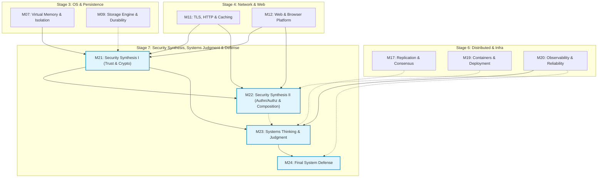

# Stage 7 (S7) M21–M24 Security Synthesis, Systems Thinking & Final Defense Research Dossier v0.1

Status: **READY FOR LEAD REVIEW** (Round 1 Rework)
Issue: #112 — `[Research] S7 M21–M24 Security Synthesis & Systems Judgment Research Dossier v0.1`
Repository base researched: `main @ fe5cc5506d80b029f4a96004c2a6f66f72fed067`
Checked date for current specifications, sources, and tools: **2026-09-07**
Role: Research Agent (Local Executor) — Security Synthesis, Systems Thinking, Technology Judgment, and Defense Assessment Researcher
Scope: Research phase only; strictly no learner-facing Lesson drafting, no Lab/fixture implementation code, no Mini Cloud App feature changes, no Concept Registry edits, no new Concept IDs, no first-home moves, no silent DAG redesign, no new Required Lab addition, and no premature resolution of Open Questions.

---

## Evidence-Layer Legend

This dossier strictly adheres to the repository research and source policy (`meta/RESEARCH_AND_SOURCE_POLICY.md`):

- **PRINCIPLE** — Timeless computing invariant, formal theoretical result, mathematical law, or stable system design mechanism independent of specific vendors, platforms, or releases.
- **SPECIFICATION** — Normative, published standard, RFC, language specification, W3C/WHATWG standard, protocol contract, ABI, or formal system interface definition.
- **IMPLEMENTATION** — Concrete behavior observed in a specific operating system, kernel version, runtime, cryptographic library, database engine, or software toolchain under stated conditions.
- **CURRENT PRACTICE** — Modern engineering convention, industry consensus, widely adopted operational heuristic, or tooling ecosystem consensus as of the checked date (2026-09-07), subject to scheduled evolution.

Confidence and context labels:

- **ESTABLISHED** — Strongly supported by canonical literature, formal specifications, and reproducible systems practice across decades.
- **IMPLEMENTATION-SPECIFIC** — Holds true for the named runtime, library version, or environment, but must not be generalized to other platforms.
- **CURRENT-PRACTICE** — Authoritative for modern production as of 2026-09-07, but recognized as evolving rather than immutable.
- **CONTESTED** — Credible engineers, system architects, or academic sources hold differing positions under comparable trade-offs.
- **UNCERTAIN** — Empirical evidence is incomplete, or the design choice requires experimental implementation testing before commitment.

---

## 1. Executive Summary & Readiness Recommendation

### Recommendation: **READY FOR DESIGN**

This Research Dossier establishes the technical, pedagogical, cryptographic, web-security, supply-chain, systems-judgment, measurement-methodology, and capstone-defense foundation required to design the complete **Stage 7 (S7): Security Synthesis, Systems Thinking & Judgment, and Final System Defense** slice:

$$\begin{aligned}
\text{M21 (Trust \& Crypto Use)} &\longrightarrow \text{M22 (Authn/Authz \& Secure Composition)} \\
&\searrow \quad \swarrow_{\text{(soft)}} \\
\text{M20 (Observability)} \longrightarrow &\quad \text{M23 (Systems Thinking \& Judgment)} \longrightarrow \text{M24 (Final System Defense)}
\end{aligned}$$

### Key Findings and Governance Alignment

1. **Exact DAG Reconstruction & Ancestry Discipline:**
   - S7 is the capstone synthesis Stage of the Core spine, but "complete shared traversal" does **not** create undocumented Stage-wide hard edges.
   - The authoritative Module DAG from `meta/blueprint/dependency-graph-v0.1.md` is reconstructed exactly:
     - **M21:** Hard inputs `M11` (TLS/HTTP), `M07` (Virtual Memory/Isolation), `M12` (Web/Browser); Soft input `M09` (Storage/Durability).
     - **M22:** Hard inputs `M21`, `M11`, `M12`; Soft input `M19` (Containers/Deployment).
     - **M23:** Hard inputs `M20` (Observability), `M21`; Soft inputs `M22`, `M17` (Replication/Consistency).
     - **M24:** Hard input `M23`; Soft input `M20`.
   - All 10 preliminary lesson IDs and learner questions are preserved for dependency reasoning. No new hard prerequisite edges are introduced.
2. **Concept Registry & First-Home Discipline (Zero New IDs):**
   - Exactly **18 canonical concepts** remain in `meta/CONCEPT_REGISTRY.md`. Zero new Concept IDs are added.
   - **`EC-CON-017 Trust Boundary` (信任边界) remains first-introduced at M07 (`L07-01`).** In M21 and M22, Trust Boundary is synthesized across multi-layer systems (network, process, identity, web, dependencies), not redefined.
   - `EC-CON-013 Isolation` remains first-home M07 `L07-01` and is revisited to highlight where isolation mechanisms (e.g. process memory, containers, browser origins) enforce or fail to enforce trust boundaries.
   - All other canonical concepts (`EC-CON-007 Specification`, `EC-CON-008 Invariant`, `EC-CON-009 Correctness`, `EC-CON-010 Failure`, `EC-CON-016 Durability`, `EC-CON-014 Consistency`, `EC-CON-015 Concurrency`, `EC-CON-018 Process`) preserve their accepted first homes.
   - Security terms (*threat model, attack surface, hash, MAC, digital signature, certificate, authentication, authorization, session, JWT, CSRF, SSRF, least privilege, supply-chain provenance*) are domain mechanisms and patterns, **not** new Registry Concept IDs.
   - Consensus Registry ID remains deliberately deferred.
3. **Defense-First Security Stance & Safe Local Evidence (D-012):**
   - Strictly **zero offensive exploit tooling, zero penetration-testing training, zero public/live target interaction, and zero credential theft training**.
   - All security hands-on evidence uses safe, localhost-only, bounded, synthetic-data fixtures where the educational endpoint is **fix-and-verify** (e.g. signature verification failure, parameterized SQL vs string concatenation, allow/deny authorization policy checks, SameSite/Origin header validation).
4. **Lab Selection Map Integrity (Zero New Required Labs):**
   - The accepted lab map contains exactly 5 Required Labs, 5 Optional Labs, and 5 Source Expeditions.
   - **No new Required Lab is introduced.** The open question of a course-owned vulnerable app is evaluated for Design: Research recommends **Candidate B: bounded, course-owned localhost security fixtures embedded directly in M21/M22 standard activity pairs**, accompanied by security/privacy reviews on the Mini Cloud App (P2/P8/P9). Research does not freeze Design; Design owns the final adoption, refinement, or rejection within canonical architecture.
5. **Modern Authoritative Source Alignment (Checked 2026-09-07):**
   - Cryptographic claims: NIST SP 800-131A Rev. 2 (current Final), NIST SP 800-131A Rev. 3 (Initial Public Draft, Oct 2024), NIST SP 800-63B-4 (Final, July 2025; supersedes SP 800-63B), FIPS 186-5 (digital signatures), FIPS 202 (SHA-3), RFC 8446 / RFC 9846 (TLS 1.3 Standards Track), RFC 9525 (service identity in TLS), RFC 9106 (Argon2id).
   - Web/Composition claims: W3C CSP Level 3 (Working Draft, 13 August 2026), WHATWG Fetch/HTML Living Standards, RFC 6265bis (`draft-ietf-httpbis-rfc6265bis-22`, August 2026), RFC 7519 / RFC 8725 (JWT & BCP 225), RFC 6749 / RFC 9700 (OAuth 2.0 Security BCP 240, Jan 2025) / `draft-ietf-oauth-v2-1-16` (OAuth 2.1 Internet-Draft, Sept 2026), OWASP Top 10 (2021/2025 empirical industry guidance).
   - Supply-chain claims: SLSA v1.2 (current Approved; v1.0 is retired), Community Specification License 1.0, Sigstore / in-toto concepts, cryptographic lockfile digests.
   - Runtime tooling: PyCA `cryptography` v50.0.1 (released 2026-08-25).
6. **M23 Systems Judgment & D-015 Framework Consolidation:**
   - Consolidates the applied measurement-uncertainty toolkit (first assessed at M04 `L04-02`, productionized at M20 `L20-01`) into an open, question-driven measurement methodology: question, workload model, environment, mechanism-driven warm-up, justified sample size, distribution reporting (percentiles for skewed latency, median/IQR where robust, mean/std where appropriate), and explicit inference limits.
   - Preserves the 12-field D-015 Technology Evaluation Framework: *Problem → Constraints → Mechanism → Gains → Costs → Failure Modes → Alternatives → When-not-to-use → Scale Threshold → Evidence → Evolution → Stable Principle*. Explicitly recognizes **rejection** ("do not add this technology") as a valid passing judgment.
   - AI-generated claims are classified as **untrusted hypotheses** requiring source/test/measurement verification (Current Case under `L23-02`), preserving OQ-BP-001 as OPEN without creating an AI Core Module.
7. **M24 Final System Defense as Integration & Articulation:**
   - M24 introduces no new mechanism scope. It provides the capstone assessment contract across all 8 canonical competencies: Trace, Explain, Observe, Diagnose, Correctness, Judge, Estimate, and Learn-New-Tech.
   - Research outlines candidate research dimensions across 12 evidence areas; Design owns final scoring, pass thresholds, evidence sufficiency, and the learner/reviewer contract.
8. **Open Questions and Governance Invariants Preserved:**
   - `OQ-BP-001` (bounded AI literacy): OPEN / RFC-gated (`RFC-CAND-001` candidate only).
   - `OQ-BP-003` (human-facing / accessibility scope): OPEN / RFC-gated (`RFC-CAND-002` candidate only).
   - `OQ-BP-006` (canonical software/environment versions): OPEN (implementation-time pin).
   - Issue #34 (real learner validation): OPEN / DEFERRED / NON-BLOCKING per D-027.
   - Earlier M03 GDB unavailable debt and M06 course-fork grader NOT RUN debt remain truthfully preserved.

---

## 2. Canonical Scope & DAG Reconstruction

### 2.1 Scope Definition and Preliminary Lesson Map

Stage 7 comprises four Modules (`M21`–`M24`) and ten preliminary Lessons across Macro Areas `13` (Security Synthesis), `14` (Systems Thinking & Judgment), and `15` (Final System Defense):

| Module | Canonical Title | Macro Area | Preliminary Lessons (IDs & Questions) | Authoritative DAG Inputs (H/S) | Primary Competency Focus |
|---|---|---|---|---|---|
| **M21** | Security Synthesis I: Trust & Crypto Use | 13 Security Synthesis | **L21-01:** "Where are the boundaries I must protect?"<br>**L21-02:** "What do I use crypto for?" | **Hard:** M11, M07, M12<br>**Soft:** M09 | **Judge & Explain** (boundary identification, crypto role: confidentiality/integrity/auth/non-repudiation, API misuse diagnosis) |
| **M22** | Security Synthesis II: Authn/Authz & Secure Composition | 13 Security Synthesis | **L22-01:** "How do I know who is calling?"<br>**L22-02:** "Why is my web app vulnerable?"<br>**L22-03:** "Why do I trust my dependencies?" | **Hard:** M21, M11, M12<br>**Soft:** M19 | **Judge & Diagnose** (authn vs authz, injection/XSS/CSRF/SSRF defense, supply-chain provenance) |
| **M23** | Systems Thinking & Judgment | 14 Systems Thinking & Judgment | **L23-01:** "How do I measure honestly?"<br>**L23-02:** "How do I pick a technology?"<br>**L23-03:** "What is the cost of my design?" | **Hard:** M20, M21<br>**Soft:** M22, M17 | **Judge & Estimate** (measurement methodology, D-015 Technology Evaluation Framework, napkin math & cost models) |
| **M24** | Final System Defense | 15 Final System Defense | **L24-01:** "Can I defend an architecture?"<br>**L24-02:** "What should I measure before I ship?" | **Hard:** M23<br>**Soft:** M20 | **Judge & Explain** (integrated architecture defense, trade-off defense, pre-ship verification design) |

### 2.2 Authoritative DAG Reconstruction

The authoritative dependency structure for S7 is reconstructed verbatim from `meta/blueprint/dependency-graph-v0.1.md` §3 and §4:



#### Detailed Rationale for Module DAG Edges:

1. **M21 Edges:**
   - **Hard `M07 → M21`:** M07 introduced `EC-CON-017 Trust Boundary` and `EC-CON-013 Isolation` at the OS/hardware boundary (kernel vs user space, page tables, memory faulting). M21 synthesizes this into an explicit threat-modeling discipline.
   - **Hard `M11 → M21`:** M11 introduced TLS record encryption, certificates, and secure transport. M21 extracts cryptographic primitives (symmetric cipher, public key, hashing, signature) from the TLS bundle into general system use.
   - **Hard `M12 → M21`:** M12 introduced browser origin boundaries (SOP) and web security context. M21 uses these as concrete non-network trust boundaries.
   - **Soft `M09 -.-> M21`:** M09 provides durability and disk persistence; soft context for cryptographic key storage, state wipe, and encrypted storage boundaries.
2. **M22 Edges:**
   - **Hard `M21 → M22`:** M21 supplies cryptographic primitive understanding (hashes, HMACs, digital signatures, public-key verification), which M22 requires to analyze password hashing, session cookies, and JWT token signatures.
   - **Hard `M11 → M22`:** M11 supplies HTTP request/response semantics, headers, status codes, and TLS transport, which M22 uses for cookie transmission, headers (`SameSite`, `Authorization`), and TLS protection.
   - **Hard `M12 → M22`:** M12 supplies DOM, rendering, Same-Origin Policy, and browser context, which M22 directly requires to explain XSS, CSRF, and CSP.
   - **Soft `M19 -.-> M22`:** M19 supplies container boundaries and CI/CD pipelines, which provide soft context for dependency management, image scanning, and supply-chain attacks.
3. **M23 Edges:**
   - **Hard `M20 → M23`:** M20 established production observability, metric types, distributions, SLOs, and the monotonic vs wall-clock distinction. M23 consolidates this into the universal measurement methodology.
   - **Hard `M21 → M23`:** M21 established the threat model and boundary reasoning needed to evaluate security as a system property in the D-015 Technology Evaluation Framework.
   - **Soft `M22 -.-> M23`:** M22 provides secure composition and supply-chain evaluation examples for technology cards.
   - **Soft `M17 -.-> M23`:** M17 provides consensus/consistency trade-off reasoning (e.g. CAP/linearizability bounds) that informs system trade-off defense.
4. **M24 Edges:**
   - **Hard `M23 → M24`:** M23 provides the complete judgment toolkit: measurement methodology, D-015 framework, napkin math, and cost models. M24 is the direct articulation and defense of those dimensions.
   - **Soft `M20 -.-> M24`:** M20 supplies operational observability evidence (logs, metrics, traces, alerts) utilized in the pre-ship verification defense.

### 2.3 Preliminary Lesson-Level Cross-Module Hard Prerequisites

The Preliminary Lesson Map (`meta/blueprint/core-stage-module-lesson-map-v0.1.md` §5) defines lesson-level dependencies strictly subordinate to the Module DAG:

| Lesson ID | Module | Title / Question | Lesson Hard Prerequisites | Authority Note |
|---|---|---|---|---|
| **L21-01** | M21 | "Where are the boundaries I must protect?" | `L11-01` (TLS), `L07-01` (Isolation/Trust Boundary), `L12-03` (Web Security / Origin) | Refines `M11`, `M07`, `M12` Module-`H` inputs; introduces no new Module edge. |
| **L21-02** | M21 | "What do I use crypto for?" | `L21-01` | Intra-module progression: boundaries established before selecting crypto tools. |
| **L22-01** | M22 | "How do I know who is calling?" | `L21-02` (Crypto primitives), `L11-02` (HTTP semantics) | Refines `M21` and `M11` Module-`H` inputs. |
| **L22-02** | M22 | "Why is my web app vulnerable?" | `L22-01`, `L12-03` (Browser Origin / DOM) | Refines `M22` and `M12` Module-`H` inputs. |
| **L22-03** | M22 | "Why do I trust my dependencies?" | `L22-02` | Intra-module progression: app composition expands to third-party code composition. |
| **L23-01** | M23 | "How do I measure honestly?" | `L20-01` (Observability/Metrics/Clocks), `L04-02` (Locality & Measurement Foundations) | Refines `M20` Module-`H` input and recurs the M04 measurement thread. |
| **L23-02** | M23 | "How do I pick a technology?" | `L23-01`, S6 foundations | Refines `M23` measurement base and synthesis over distributed/infrastructure layers. |
| **L23-03** | M23 | "What is the cost of my design?" | `L23-02` | Intra-module progression: technology evaluation leads to cost/resource modeling. |
| **L24-01** | M24 | "Can I defend an architecture?" | `L23-02` (Technology Evaluation Framework) | Refines `M23` Module-`H` input; capstone defense requires evaluation framework. |
| **L24-02** | M24 | "What should I measure before I ship?" | `L24-01` | Intra-module progression: architecture defense leads to empirical pre-ship verification. |

### 2.4 Concept Registry Integrity Audit

In strict compliance with `meta/CONCEPT_REGISTRY.md`:

1. **Total Concept IDs: Exactly 18.** Zero new concept IDs are created in S7 Research.
2. **Canonical First Homes Preserved:**
   - `EC-CON-017 Trust Boundary` (信任边界): **First home remains M07 `L07-01`**. In M07, virtual-memory and process address spaces provided the first concrete isolation boundary, where the distinction between an isolation boundary (mechanism preventing interference) and a trust boundary (boundary where authority and verification obligations change) was established. M21 synthesizes this across systems.
   - `EC-CON-013 Isolation` (隔离): First home M07 `L07-01`. Revisit in M21/M22 for browser origins, process boundaries, and credential boundaries.
   - `EC-CON-007 Specification` (规格): First home M02 `L02-03`. Revisit in M21 (threat model assumptions) and M24 (explicit architectural contracts).
   - `EC-CON-008 Invariant` (不变量): First home M02 `L02-03`. Revisit in M21 (cryptographic invariants), M22 (untrusted input boundaries), M24 (system safety invariants).
   - `EC-CON-009 Correctness` (正确性): First home M02 `L02-03`. Revisit in M21 (verification conformance), M22 (authorization conformance), M24 (system claims backed by evidence).
   - `EC-CON-010 Failure` (故障): First home M03 `L03-03`. Revisit in M21/M22 (security failure modes), M23 (failure taxonomy), M24 (failure walkthrough).
   - `EC-CON-016 Durability` (持久性): First home M09 `L09-01`. Revisit in M24 (state inventory and recovery bounds).
   - `EC-CON-014 Consistency` (一致性): First home M14 `L14-02`. Revisit in M24 (data consistency across stores).
   - `EC-CON-015 Concurrency` (并发): First home M15 `L15-01`. Revisit in M24 (race condition risks, thread/event boundaries).
   - `EC-CON-018 Process` (进程): First home M06 `L06-01`. Revisit in M21 (privilege separation) and M24 (process architecture).
3. **Domain Vocabulary Boundaries:**
   - The following terms are recognized as vital pedagogical mechanisms, techniques, and operational patterns, but are **explicitly forbidden from being created as new Concept IDs**:
     - *Threat Model, Attack Surface, Defense in Depth, Principle of Least Privilege;*
     - *Cryptographic Hash, Message Authentication Code (MAC), Symmetric Cipher, Public-Key Cryptography, Digital Signature, Certificate / CA, Nonce, CSPRNG, Salt, Work Factor;*
     - *Authentication, Authorization, Session, Bearer Token, JWT, OAuth, OIDC;*
     - *SQL Injection, Cross-Site Scripting (XSS), Cross-Site Request Forgery (CSRF), Server-Side Request Forgery (SSRF), Insecure Deserialization;*
     - *Same-Origin Policy (SOP), Content Security Policy (CSP), SameSite Cookie;*
     - *Software Bill of Materials (SBOM), Dependency Pinning, Cryptographic Hash Lockfile, Provenance, Attestation;*
     - *Measurement Methodology, Benchmark Rigor, Napkin Math, Technology Evaluation Framework, Technology Card, System Defense.*
   - `Consensus` (共识) Registry ID remains deferred per Blueprint reconciliation (§8.5, R10).

### 2.5 Competency Progression Across S7

Outcomes map strictly to the 8 canonical competencies (`meta/COMPETENCY_MATRIX.md`):

```
       [M21] Judge & Explain
             |
             v
       [M22] Judge & Diagnose
             |
             v
       [M23] Judge & Estimate & Learn-New-Tech
             |
             v
       [M24] Judge & Explain & Diagnose & Estimate & Correctness (Capstone Synthesis)
```

- **Trace:** Trace how untrusted input flows across a trust boundary into a database query parser or template renderer (M21/M22); trace cryptographic key derivation and signature verification steps across parties (M21); trace an authentication/authorization decision path through session/token verification (M22); trace the complete request, data, and control flow through the Mini Cloud App in defense (M24).
- **Explain:** Explain why encryption does not imply integrity or authentication (M21); explain why hashing is not encryption (M21); explain why `SameSite=Lax` cookies alone do not prevent all CSRF (M22); explain why SQL parameterization separates data from syntax at the driver/API level (M22); explain why average latency hides tail degradation and why monotonic clocks are required for duration measurement (M23); explain and defend architectural choices and moved complexity under cross-examination (M24).
- **Observe:** Observe signature verification failure on tampered data using standard tools (M21); observe HTTP request headers, cookie attributes, and preflight OPTIONS requests in localhost fixtures (M22); observe metric distributions, percentiles, and variance across repeated benchmark runs (M23); observe system behavior under simulated resource or constraint changes (M24).
- **Diagnose:** Diagnose cryptographic API misuses (e.g. ECB mode, static nonces, unauthenticated encryption, broken password hashing) (M21); diagnose Broken Object Level Authorization (IDOR), reflected/stored XSS, and SSRF in course-owned local fixtures (M22); diagnose flawed measurement designs (e.g. missing warm-up, client-side bottleneck, coordinated omission, NTP clock step) (M23); diagnose architectural single-points-of-failure and invariant violations (M24).
- **Correctness:** Formulate security invariants (e.g. "no request executes SQL without API-level parameter binding"; "no privileged operation executes without explicit tenant authorization") (M21/M22); verify state invariants across concurrent and failing executions (M24).
- **Judge:** Judge whether a threat model requires asymmetric signatures or symmetric HMAC (M21); judge session-cookie vs stateless-JWT trade-offs under token revocation and secret leakage constraints (M22); evaluate and judge candidate technologies using the D-015 framework with explicit permission to reject (M23); defend overall system architecture, trade-offs, and residual risks (M24).
- **Estimate:** Estimate password cracking work factors and brute-force entropy thresholds under named scenario constraints (M21); estimate storage overhead and bandwidth costs of token claims vs session lookups (M22); calculate napkin-math capacity, throughput, latency budgets, and multi-tenant resource costs (M23/M24).
- **Learn-New-Tech:** Read and evaluate an unfamiliar cryptographic library API or security specification to find safe usage guidance (M21); evaluate an unfamiliar package/dependency for provenance, maintenance health, and security posture (M22); systematically evaluate an unfamiliar technology product using authoritative documentation and produce a completed Technology Card (M23).

---

## 3. Module-by-Module Research Analysis

### 3.1 M21 — Security Synthesis I: Trust & Crypto Use

#### 3.1.1 Purpose & Mental-Model Contribution

Security is not a feature, a plug-in component, or a collection of defensive tricks; **security is a system property of boundaries and authority**. Systems fail securely or insecurely based on whether trust boundaries are explicitly identified, whether assumptions across those boundaries are verified, and whether mechanisms appropriately enforce the required invariants.

M21 synthesizes the horizontal security thread developed across the course:
- `M07 L07-01` introduced `EC-CON-017 Trust Boundary` alongside hardware memory isolation;
- `M11 L11-01` introduced transport security (TLS), certificates, and peer identity over untrusted networks;
- `M12 L12-03` introduced browser origin boundaries (Same-Origin Policy);
- `M19 L19-03` introduced container isolation, deployment boundaries, and pipeline integrity.

M21 extracts cryptography from the "black box of TLS" and establishes **what cryptographic tools are for, what invariants they guarantee, and how to use trusted APIs correctly**, without turning Core into a mathematics or cryptographic algorithm implementation course.

#### 3.1.2 Mechanism Analysis & Core Claims

```
               ┌─────────────────────────────────────────────────────────┐
               │              CRYPTOGRAPHIC MECHANISMS MAP               │
               └─────────────────────────────────────────────────────────┘
                                           │
         ┌─────────────────────────────────┼─────────────────────────────────┐
         ▼                                 ▼                                 ▼
  [CONFIDENTIALITY]                 [INTEGRITY]                     [AUTHENTICITY]
  "Who can read it?"             "Was it modified?"              "Who actually sent it?"
         │                                 │                                 │
  ┌──────┴──────┐                   ┌──────┴──────┐                   ┌──────┴──────┐
  │  Symmetric  │                   │ Cryptographic│                   │   MAC /     │
  │ Encryption  │                   │    Hash     │                   │  Signature  │
  │ (AES-GCM,   │                   │  (SHA-256,  │                   │ (HMAC, RSA, │
  │  ChaCha20)  │                   │   SHA-3)    │                   │   Ed25519)  │
  └─────────────┘                   └─────────────┘                   └─────────────┘
         ▲                                                                   ▲
         └───────────────────────── AEAD ────────────────────────────────────┘
                          (Authenticated Encryption)
```

1. **Threat Model & Trust Boundary (Revisit EC-CON-017):**
   - *Threat Model:* An explicit specification of: (1) Assets to protect; (2) Adversary capabilities and access levels; (3) Trust boundaries crossed; (4) Assumed system invariants; (5) Residual risks accepted.
   - *Principle of Least Privilege (PoLP):* An entity should possess only the minimum authority, credentials, and access duration necessary to perform its specified task.
   - *Defense in Depth:* Multiple independent protection layers so that the failure of a single mechanism does not compromise the entire system.
2. **Cryptographic Primitives & Invariants:**
   - **Cryptographic Hash Functions (One-Way & Collision-Resistant):**
     - Guarantees: Fixed-size digest $H(M)$ from arbitrary-length $M$; pre-image resistance (given $y$, infeasible to find $x$ such that $H(x)=y$); collision resistance (infeasible to find $x_1 \neq x_2$ such that $H(x_1) = H(x_2)$).
     - *Boundary:* A hash alone provides **integrity against accidental corruption**, but **zero authentication or protection against an active attacker** who can modify the message and recompute the hash.
   - **Message Authentication Codes (MAC / HMAC):**
     - Combines a cryptographic hash with a shared secret key ($HMAC_K(M)$).
     - Guarantees: **Integrity AND Authenticity** between parties sharing key $K$. An attacker without $K$ cannot forge a valid MAC for a modified message.
   - **Symmetric Encryption (Confidentiality via Shared Secret):**
     - Algorithms: Modern ciphers operate as **AEAD (Authenticated Encryption with Associated Data)**, e.g., AES-GCM (NIST SP 800-38D) or ChaCha20-Poly1305 (RFC 8439).
     - Guarantees: Confidentiality of ciphertext + authenticity/integrity of ciphertext and unencrypted associated data (AAD).
     - *Boundary:* Requires secure out-of-band secret key distribution. Never use ECB mode (leaks plaintext patterns; explicitly slated for retirement in draft NIST SP 800-131A Rev. 3). Never reuse a nonce/IV with the same key under GCM/Poly1305 (destroys authenticity guarantees).
   - **Asymmetric Cryptography (Public-Key / Private-Key):**
     - Key pair: Public key $K_{pub}$ (distributed freely) and Private key $K_{priv}$ (kept strictly secret).
     - *Asymmetric Key Agreement (ECDH / X25519):* Parties establish a shared symmetric secret over an untrusted channel. **Boundary:** ECDH by itself provides key agreement without peer authentication; unless combined with digital signatures or pre-authenticated certificates, unauthenticated ECDH is vulnerable to Man-In-The-Middle (MITM) attacks.
     - *Digital Signatures (Ed25519 / RSA-PSS / ECDSA):* Private key signs; public key verifies. Proves that the entity holding the corresponding private key generated the signature over the specified digest.
   - **Public Key Infrastructure (PKI) & Certificates (Revisit M11):**
     - An X.509 certificate binds an identity (e.g. domain name via SAN per RFC 9525) to a public key, digitally signed by a Certificate Authority (CA).
     - **Critical Layer Separation:**
       1. *Certificate credential:* Binds public key to an identity/SAN. A certificate alone does NOT prove that the remote peer holds the private key in real time.
       2. *Proof of private-key possession:* Performed during protocol execution (e.g. TLS handshake `CertificateVerify` message where the peer signs a transcript hash using the private key).
       3. *Certificate-path validation:* RFC 5280 path validation verifying signatures up to a trusted trust anchor/root.
       4. *Service-identity verification:* RFC 9525 matching of the expected domain name against Subject Alternative Names (SAN).
       5. *Authorization decision:* Determining whether the authenticated service or user is permitted to perform the requested operation.
     - *Boundary:* A valid certificate proves identity ownership of a domain name. **A certificate does NOT prove that the endpoint is safe, non-malicious, or bug-free.**
   - **Randomness, Nonces, and Entropy:**
     - Security requires a **Cryptographically Secure Pseudorandom Number Generator (CSPRNG)** backed by OS entropy (`/dev/urandom`, Windows `BCryptGenRandom`, Python `secrets` module / `os.urandom`).
     - *Boundary:* PRNGs designed for simulation or algorithmic randomized testing (e.g. Python `random`, C `rand()`) are **not cryptographically secure** and are completely unsuitable for security credentials, session tokens, nonces, or salts.
   - **Secret Management Basics:**
     - Secrets must never be committed to source code or baked into container images.
     - Environment variables are one common operational mechanism, but have context-dependent exposure risks (e.g. inheritance by child processes, visibility in `/proc/$PID/environ` on Linux, inclusion in crash/error dumps). Alternatives include filesystem volume mounts from dedicated secret managers with bounded permissions.
     - In-memory lifetime and zeroization guarantees are strictly **language- and runtime-dependent**; in managed environments (such as Python or Java), immutable strings and garbage collector relocation mean memory zeroization cannot be guaranteed at the application level.

#### 3.1.3 Cryptographic Claim Boundaries (What NOT to Universalize)

The research establishes strict boundaries to avoid common curriculum fallacies:
- **Do not teach "hashing encrypts data":** Hashing is a one-way transformation that discards information; encryption is a two-way transformation with a secret key. Hashing cannot be decrypted.
- **Do not teach "encryption proves identity":** Symmetric encryption only proves that whoever produced the ciphertext possessed the shared key; it does not identify which of the shared-key holders created it. Plain asymmetric encryption provides confidentiality, not authenticity, unless paired with a signature or authenticated exchange.
- **Do not teach "signature means the content is trustworthy":** A digital signature proves only that the private key matching the public key signed the digest. It does not prove the content is accurate, safe, or benevolent.
- **Do not present digital signatures as unconditional legal/business "non-repudiation":** Legal and business non-repudiation depends on extensive external assumptions: proof of sole key custody, hardware security module (HSM) guarantees, trusted timestamping, verifier revocation checking, and legal jurisdiction contracts. A mathematical signature alone does not establish legal non-repudiation.
- **Do not teach "certificate means the endpoint is safe":** A TLS certificate proves identity ownership of a domain name, not the safety of the software running behind it. Phishing sites routinely obtain valid TLS certificates.
- **Do not teach "random UUID/token is automatically secure":** A standard UUIDv4 generated from an unseeded or non-cryptographic PRNG lacks cryptographic unpredictability.
- **Do not teach "one algorithm or key size is forever correct":** Cryptographic parameters have explicit lifetimes governed by cryptanalysis and computational advances (e.g., NIST SP 800-131A Rev. 2 current transitions, and Rev. 3 draft post-2030 proposals).
- **Do not teach "don't roll your own crypto" as a thought-terminating slogan:** Explain the concrete engineering rationale: cryptographic algorithms have subtle implementation invariants (timing side channels, padding oracle attacks, nonce reuse catastrophic failure, cache attacks) that standard high-level libraries handle, whereas ad-hoc implementations almost universally fail.

---

### 3.2 M22 — Security Synthesis II: Authn/Authz & Secure Composition

#### 3.2.1 Purpose & Mental-Model Contribution

If M21 establishes trust boundaries and cryptographic tools, M22 investigates **how systems fail when composed**. Application security is predominantly about composition errors: failing to distinguish identity from permission, allowing untrusted input to alter command syntax, failing to confine cross-site browser requests, and naively trusting third-party dependencies.

The learner goal is **defense-first composition judgment**: understanding root causes of composition vulnerabilities, learning how to verify defenses rigorously, and applying the principle of least privilege across the application lifecycle, without becoming an offensive exploit technician.

#### 3.2.2 Mechanism Analysis & Core Claims

```
                        ┌─────────────────────────────────────────┐
                        │        SECURE COMPOSITION STACK         │
                        └─────────────────────────────────────────┘
                                             │
      ┌──────────────────────────────────────┼──────────────────────────────────────┐
      ▼                                      ▼                                      ▼
[IDENTITY & ACCESS]                  [INPUT & EXECUTION]                    [DEPENDENCIES]
"Who are you & what can you do?"     "Is data escaping into code?"          "What third-party code runs?"
      │                                      │                                      │
  Authn vs Authz                         SQL Injection                          Lockfile Hashes
  (Identity vs Permission)               (API parameter separation)             (Integrity verification)
      │                                      │                                      │
  Password Hashing                       XSS                                    Build & Source Provenance
  (NIST SP 800-63B-4 / RFC 9106)         (Context encoding + CSP)               (SLSA v1.2, signing)
      │                                      │                                      │
  Sessions vs Tokens                     CSRF                                   Minimal Dependencies
  (Revocation trade-offs)                (SameSite + Anti-CSRF)                 (Least authority)
      │                                      │
  OAuth 2.1 / OIDC delegation            SSRF (Connection-time IP filter)
```

1. **Authentication (Authn) vs. Authorization (Authz):**
   - **Authentication:** Verifying the identity claim of an entity ("Who are you?"). Examples: password verification, public key challenge-response, multi-factor authenticator.
   - **Authorization:** Determining whether a verified identity has permission to perform a requested action on a specific resource ("What are you allowed to do?").
   - *Critical Boundary:* **Authentication never implies authorization.** Successfully logging in as User A does not authorize User A to read or edit User B's documents (Broken Object Level Authorization / IDOR).
2. **Password Storage Guidance (NIST SP 800-63B-4 & RFC 9106):**
   - *NIST Normative Requirements (SP 800-63B-4, Final July 2025):*
     - Passwords must be hashed using a salted, memory-hard, one-way hash function.
     - Passwords must not be truncated arbitrarily; minimum length of at least 8 characters required (15+ recommended for higher assurance).
     - Passwords must be checked against lists of compromised credentials.
     - Periodic forced password rotation without evidence of compromise is explicitly discouraged.
   - *Algorithm Distinctions:*
     - **Argon2id (RFC 9106):** Current state-of-the-art memory-hard function (winner of the Password Hashing Competition; balances side-channel resistance with GPU cracking resistance).
     - **scrypt (RFC 7914) / bcrypt:** Established memory-hard alternatives.
     - **PBKDF2 (RFC 8018):** CPU-bound only (no memory hardness); vulnerable to accelerated GPU/ASIC attacks compared to memory-hard functions.
   - *Work-Factor & Salt Policy (Distinguishing Invariant from Named Policy):*
     - The universal invariant is that salts must be unique and unpredictable per password, and work factors must be tunable.
     - Specific numbers (e.g. minimum 32-bit salt per NIST SP 800-63B vs 128-bit salt in RFC 9106; OWASP PBKDF2-HMAC-SHA256 guideline of 600,000 iterations) are **CURRENT / NAMED POLICY / ILLUSTRATIVE INPUTS**, not timeless mathematical theorems.
3. **Session vs. Token Mechanics:**
   - **Server-Side Session:** Client holds an opaque session identifier (stored in an `HttpOnly`, `Secure` cookie); server stores session state in database/cache.
     - *Gains:* Immediate, centralized revocation capability; minimal sensitive payload exposed to client.
     - *Costs:* State lookup required on requests; state replication/synchronization across distributed hosts.
   - **Stateless Tokens (JWT - RFC 7519):** Client holds a self-contained token containing claims, digitally signed or MACed by the issuer.
     - *Gains:* Decentralized verification without synchronous database lookup on every service.
     - *Revocation Boundary:* Stateless tokens do not support immediate out-of-band revocation without introducing state (e.g. token revocation lists, short expiration windows with refresh tokens, or reference token lookups). The choice is a deliberate engineering trade-off between latency and revocation immediacy.
4. **JWT Security Best Current Practices (RFC 8725 / BCP 225):**
   - **Algorithm Whitelisting:** Explicitly reject `alg: "none"`. Server-side validation must enforce an explicit allowlist of acceptable algorithms, never allowing the client-controlled header to dictate verification logic.
   - **Key Confusion Defense:** Prevent asymmetric public keys from being used as HMAC secrets when verifying symmetric tokens.
   - **Claim Validation Contract:** Validation of standard claims (`exp`, `nbf`, `iss`, `aud`) depends on the profile and application contract; expired tokens must be rejected.
5. **OAuth 2.0 / 2.1 & OpenID Connect (OIDC) Conceptual Boundaries:**
   - **OAuth 2.0 (RFC 6749):** An **authorization delegation framework** allowing a third-party application to obtain limited access to an HTTP service on behalf of a resource owner. **OAuth 2.0 is NOT an authentication protocol.**
   - **OpenID Connect (OIDC):** An identity layer built on top of OAuth 2.0 that provides authentication via an `id_token` (JWT).
   - *RFC 9700 (OAuth 2.0 Security BCP 240, Jan 2025) Normative Wording:*
     - For Public Clients: PKCE (Proof Key for Code Exchange, RFC 7636) **MUST** be used.
     - For Confidential Clients: PKCE is **RECOMMENDED** under BCP conditions (and required under code injection threat models).
     - Resource Owner Password Credentials (ROPC) grant: **MUST NOT** be used.
     - Implicit Grant: **SHOULD NOT** be used except under specific conditions outlined in the BCP.
   - *OAuth 2.1 Status:* Currently an active Internet-Draft (`draft-ietf-oauth-v2-1-16`, Sept 2026); consolidates OAuth 2.0 and security BCPs into a single document.
6. **Web Vulnerabilities & Safe Defense Patterns:**
   - **SQL Injection (SQLi):**
     - *Root Cause:* Conflating code and data by dynamically interpolating untrusted strings into query syntax.
     - *Safe Defense:* **API/Driver parameter separation (Prepared Statements / Parameterized Queries).** The driver or database protocol separates query syntax from literal data values.
     - *Boundary:* AST pre-compilation is driver/database implementation-specific; parameterization does not protect dynamic table or column identifiers (requires strict allowlisting); parameterization does not enforce authorization.
   - **Cross-Site Scripting (XSS):**
     - *Root Cause:* Rendering untrusted input into execution contexts in the browser DOM.
     - *Safe Defense:* **Context-aware output encoding** (HTML body, attribute, JavaScript literal) + safe templating engines with auto-escaping + Content Security Policy (CSP Level 3).
     - *Boundary:* CSP is a defense-in-depth mitigation against execution; it does not replace the requirement for context-aware escaping.
   - **Cross-Site Request Forgery (CSRF):**
     - *Root Cause:* The browser automatically attaches ambient credentials (cookies, HTTP basic auth) to cross-site requests.
     - *Safe Defense:* Anti-CSRF tokens (Synchronizer Token Pattern) + `SameSite` cookie attributes + verifying `Origin` / `Referer` headers + custom request headers (`X-Requested-With`).
     - *Boundary:* Defense depends on the credential model, request method, and client architecture. `SameSite=Lax` allows cross-site top-level GET navigation; state-changing requests must enforce POST/PUT/DELETE with explicit anti-CSRF tokens.
   - **Server-Side Request Forgery (SSRF):**
     - *Root Cause:* The server fetches a user-supplied URL without restricting internal network access.
     - *Safe Defense:* Parse URL, resolve IP address, and enforce an **egress firewall/allowlist at socket connection time** (validating the socket remote address after connection or pinning the IP), blocking loopback (`127.0.0.0/8`), private networks (RFC 1918), and cloud metadata services (`169.254.169.254`).
     - *Boundary:* Simple string parsing or pre-connection DNS checks do not prevent DNS rebinding or redirect-based bypasses unless connection-time enforcement and redirect restrictions are applied.
   - **Insecure Deserialization:**
     - *Root Cause:* Passing untrusted byte streams into object reconstruction engines that execute arbitrary constructors or gadget chains (e.g. Python `pickle`, Java `ObjectInputStream`).
     - *Safe Defense:* Use structured data formats (JSON, Protocol Buffers) with strict schema validation.
     - *Boundary:* JSON and Protocol Buffers eliminate polymorphic code execution during parsing, but do not guarantee application safety without validation (e.g. JSON prototype pollution, deeply nested entity expansion, or memory exhaustion).
7. **Supply Chain & Dependency Provenance (Connecting M19 to M22):**
   - *Risk:* Modern applications import transitive third-party dependencies that can introduce vulnerabilities or malicious code.
   - *Layered Defense (SLSA v1.2 Current Concepts):*
     1. *Dependency Pinning:* Freezing exact version numbers in configuration.
     2. *Digest Verification:* Recording SHA-256 hashes in lockfiles to ensure byte-for-byte artifact integrity.
     3. *Build & Source Provenance:* Cryptographic attestations (e.g. SLSA Provenance predicates) recording the source repository, commit, and build environment.
     4. *Attestation Verification Policy:* Client-side verification enforcing that artifacts were produced by authorized builders from trusted sources.
   - *Boundary:* Lockfile hashes ensure reproducibility and detect modified artifacts, but do not prove the original source code is free of bugs, vulnerabilities, or malicious backdoors. Digital signatures prove who signed an artifact, not whether the code is safe to execute.

---

### 3.3 M23 — Systems Thinking & Judgment

#### 3.3.1 Purpose & Mental-Model Contribution

The highest goal of Essential CS is **independent technical judgment** (Curriculum Invariant 1). Systems engineering requires evaluating technologies by understanding constraints, mechanisms, trade-offs, and empirical evidence, rather than adopting tools based on industry fashion.

M23 synthesizes the entire course into three structured capabilities:
1. **Honest, Question-Driven Measurement:** Consolidating the experimental pattern into a rigorous methodology that resists benchmark self-deception;
2. **The D-015 Technology Evaluation Framework:** A 12-dimension discipline for evaluating any computing technology objectively and deciding whether to adopt or reject it;
3. **Cost & Resource Economics:** Order-of-magnitude napkin math, capacity estimation, and multidimensional cost modeling under explicit constraints.

#### 3.3.2 Question-Driven Measurement Methodology (L23-01)

Instead of imposing rigid universal rules or arbitrary constant counts, measurement rigor is grounded in a **question-driven scientific methodology**:

1. **Define the Measurement Question:** What specific performance, capacity, or resource claim is being evaluated? (e.g. "Does adding an index on `notes.user_id` reduce p95 query latency under a 90% read / 10% write workload?").
2. **Select Workload & System Model:**
   - *Closed Workload Model:* Client sends a request, waits for a response, then sends the next. Vulnerable to **Coordinated Omission** (slow server responses artificially delay future requests, hiding tail latency).
   - *Open Workload Model:* Requests arrive at a schedule independent of system completion times (e.g. Poisson arrival process). Accurately measures queueing delays and service degradation under load.
3. **Record Environment & Baseline:** Exact CPU model, clock frequency, RAM, OS kernel, background processes, compiler/runtime versions, and baseline measurements before the change.
4. **Decide Warm-Up Strategy Based on Mechanism:**
   - Determine whether the evaluated mechanism involves transients (JIT compilation, CPU frequency ramping, buffer pool warming, filesystem page cache population).
   - Discard warm-up iterations when evaluating steady-state performance; retain them when evaluating cold-start latency.
5. **Justify Sample Size & Repetitions:**
   - Sample size must be chosen based on the observed variance and required confidence bounds, rather than a fixed universal constant.
6. **Report Distribution Summaries Appropriate to the Question:**
   - For skewed, multimodal, or heavy-tailed distributions (common in network, disk, and concurrent systems): report median ($p50$), $p90$, $p95$, $p99$, and interquartile range ($IQR$). Mean and standard deviation are misleading on skewed latency distributions.
   - For symmetric, normal micro-operations: report mean, standard deviation, and confidence intervals.
7. **Enforce Monotonic Clock Semantics (Revisit M04 / M20):**
   - **Monotonic Clocks (`time.monotonic_ns()` / `CLOCK_MONOTONIC`):** Guaranteed never to jump backwards due to NTP synchronization, leap seconds, or manual clock adjustments. **Mandatory for elapsed duration, timeout, and latency measurements.**
   - **Wall Clocks (`time.time()` / `CLOCK_REALTIME`):** Track human calendar time. Subject to NTP adjustments and leap seconds. Used strictly for wall-clock logging, event correlation across systems, and certificate validity checks.
8. **State Explicit Inference Limits:** Clearly state the boundary conditions of the conclusion (e.g. "This measurement reflects single-core in-memory lookups on x86-64 Linux 6.8; it does not predict distributed network performance under disk contention").

#### 3.3.3 The D-015 Technology Evaluation Framework (L23-02)

D-015 is canonical curriculum architecture. The 12-dimension Technology Card structure must be applied to evaluate candidate technologies:

| Dimension | Core Question | What Learner Evidence Must Establish |
|---|---|---|
| **1. Problem** | What exact engineering problem does this solve? | Specific failure mode, bottleneck, or coordination issue, not vague marketing. |
| **2. Constraints** | Under what physical/architectural constraints does it operate? | Latency bounds, memory limits, durability requirements, trust boundaries. |
| **3. Mechanism** | What underlying computing mechanism makes it work? | Data structure, protocol invariant, hardware capability, or OS abstraction. |
| **4. Gains** | What does the system tangibly gain? | Quantified latency, throughput, availability, or operational simplification. |
| **5. Costs** | What new complexity, resource footprint, or operational cost is paid? | Memory overhead, disk writes, serialization delay, maintenance burden. |
| **6. Failure Modes** | How does this technology fail when overloaded or broken? | Cascade failure, split-brain, OOM, silent corruption, deadlock. |
| **7. Alternatives** | What simpler or existing mechanisms solve a comparable problem? | In-memory cache vs DB index; local SQLite vs distributed Postgres; cron vs queue. |
| **8. When-Not-To-Use** | In what scenarios is adopting this technology a mistake? | Low traffic, single-node simplicity, strict ACID needs, small dataset. |
| **9. Scale Threshold** | At what quantitative threshold does this become justified? | Request rate ($QPS$), data volume (GB/TB), concurrency, latency budget. |
| **10. Evidence** | What reproducible measurements or proofs back the claims? | Benchmark results with stated workloads, formal specifications, source verification. |
| **11. Evolution** | How has this technology evolved, and where is it heading? | STABLE core vs CURRENT tooling vs FRONTIER experimental status. |
| **12. Stable Principle** | What timeless computing principle outlives this specific product? | Big Idea or Registry Concept instantiated by this temporary product. |

**Technology Rejection as a Passing Outcome:** A vital principle of D-015 is that **deciding NOT to adopt a technology** (e.g. rejecting Kafka in favor of a local SQLite queue; rejecting Kubernetes in favor of a single Linux systemd service; rejecting microservices in favor of a modular monolith) is often the most mature engineering choice. Learner assessment must reward defensible rejection equally with defensible adoption.

#### 3.3.4 Named Current Case Study & Bounded Stable Principle: Redis

To illustrate how current technologies are examined under D-015 without turning product implementation details into universal theorems:

- **Named Current Case:** Redis (e.g. Redis 7.x/8.x architecture).
- **Product & Implementation Authority:** Redis documentation and source architecture.
- **Specific Implementation Context:**
  - Redis serves commands in an in-memory data store using an event-driven multiplexed I/O architecture (`epoll`/`kqueue`). While threaded I/O was introduced in Redis 6.0 for network socket reading/writing, the core command execution engine remains single-threaded to avoid multi-thread lock synchronization over in-memory data structures.
  - Persistence options include point-in-time snapshots (RDB via `fork()`) and append-only logging (AOF with tunable `fsync` policies).
- **Observed Trade-offs (Not Universal Claims):**
  - Storing state entirely in memory provides low microsecond-range access latency, but capacity is bounded by available physical RAM, and cost per gigabyte is higher than block storage.
  - Asynchronous background snapshotting or non-blocking AOF writes provide high request throughput, but introduce data loss exposure windows during sudden power loss or process termination (`EC-CON-016 Durability`).
- **Derived Bounded Stable Principle:**
  *"Moving work off a critical request path (e.g. to in-memory buffers, memory-mapped data structures, or asynchronous background queues) may reduce one latency component, but moves cost, state management, memory constraints, and durability obligations elsewhere."*

#### 3.3.5 Handling AI-Generated Claims (Interim State under OQ-BP-001)

In strict conformance with `meta/OPEN_QUESTIONS.md` (OQ-BP-001 safe interim state) and Curriculum Invariant 6:
- **AI is not a factual authority.**
- Any code, architecture diagram, configuration, benchmark, or technical claim produced by an AI system is classified as an **untrusted hypothesis**.
- The learner must apply the standard verification loop:
  1. **Source Inspection:** Cross-reference against official specifications, RFCs, and source code.
  2. **Test & Reproduction:** Write an automated, reproducible test case verifying the behavior.
  3. **Measurement:** Independently benchmark performance claims under controlled workloads.
  4. **Security Review:** Verify trust boundaries, credential handling, and input validation.
- This policy satisfies 2026 technical literacy requirements without resolving OQ-BP-001 or creating an AI Core Module.

#### 3.3.6 Napkin Math & Cost Economics (L23-03)

- **Order-of-Magnitude Estimation (Illustrative Hardware Baseline):**
  - Jeff Dean Latency Numbers (updated to representative modern hardware context):
    - L1 cache reference: $\sim 1 \text{ ns}$
    - Main memory (RAM) access: $\sim 100 \text{ ns}$
    - NVMe SSD read (random 4KB): $\sim 10\text{--}50 \ \mu\text{s}$
    - Datacenter round-trip (same DC): $\sim 0.5 \text{ ms}$
    - WAN round-trip (continental): $\sim 30\text{--}80 \text{ ms}$
    - WAN round-trip (trans-oceanic): $\sim 150\text{--}250 \text{ ms}$
  - Stating units, explicit assumptions, and bounding uncertainty.
- **Multidimensional Cost Model:**
  - Total Cost of Ownership ($TCO$) includes compute, storage, network egress, and operational complexity.
  - Scenario-specific cost models rather than memorizing vendor price sheets.

---

### 3.4 M24 — Final System Defense

#### 3.4.1 Purpose & Assessment Contract

M24 is the **capstone assessment of the entire Essential CS curriculum**. It introduces **zero new mechanism scope**. Its sole purpose is **integration, articulation, and rigorous defense**: the learner presents and defends the architecture, trade-offs, invariants, failure modes, security posture, and measurement evidence of the Mini Cloud App (Milestones P0–P9) or an assigned scenario system.

Passing requires demonstrating genuine computing-system judgment: the ability to connect empirical evidence to architectural claims, explain where complexity moved, and justify decisions under changed constraints.

#### 3.4.2 Candidate Research Assessment Dimensions (12 Evidence Areas)

Research outlines the following 12 candidate assessment dimensions to guide Design in creating the formal learner/reviewer contract:

1. **Request / Data / Control Trace:** End-to-end trace of a request through system layers.
2. **State Inventory:** Accounting of where mutable state lives and the durability guarantee of each store.
3. **Explicit Invariants & Specifications:** Clear statements of invariants that must never be violated.
4. **Failure & Risk Walkthrough:** Identification of component failure modes and recovery boundaries.
5. **Security & Privacy Boundary Decisions:** Explicit trust boundary map, threat model, and defense-first validation.
6. **Measurements & Evidence:** Empirical performance data backed by question-driven measurement methodology.
7. **Latency, Resource, and Cost Estimates:** Order-of-magnitude estimates for capacity, throughput, and costs.
8. **Architecture Alternatives & Moved Complexity:** Justification of chosen architectures over alternatives.
9. **Technology Cards:** Formal D-015 evaluations for significant technology choices.
10. **Operational & Recovery Evidence:** Service SLIs/SLOs, logging/metrics, and recovery runbooks.
11. **Unknowns & Learning Plan:** Truthful identification of architectural uncertainties and investigation plans.
12. **Defense Under Changed Constraints:** Adaptation of architectural trade-offs under modified external constraints.

#### 3.4.3 Defense Mechanics & Rubric Guidelines

- **Authority Boundary:** Research outlines candidate assessment dimensions and evidence types; **Design owns the final scoring model, pass/fail thresholds, evidence sufficiency criteria, and the formal learner/reviewer contract.**
- **Evaluation Principles:** Defensible reasoning and evidence outrank fluent prose or software framework quantity. Evidence may take multiple forms: explicit assumptions, analytical models, authoritative specification citations, empirical measurements, automated tests, and scenario constraint proofs.

---

## 4. Claim / Evidence / Authority Matrix

The following matrix categorizes all primary technical and architectural claims across Stage 7 according to the repository evidence layers (`meta/RESEARCH_AND_SOURCE_POLICY.md`):

| Module | Claim Area | Exact Claim | Evidence Layer | Authority / Source | Confidence & Context |
|---|---|---|---|---|---|
| **M21** | Boundaries | Security is a property of authority boundaries, not an add-on feature. | **PRINCIPLE** | Saltzer & Schroeder (1975); Anderson *Security Engineering* 3rd ed. | **ESTABLISHED** |
| **M21** | Boundaries | Memory isolation (`EC-CON-013`) does not by itself establish a trust boundary (`EC-CON-017`). | **PRINCIPLE** | M07 L07-01 first home; Saltzer & Schroeder | **ESTABLISHED** |
| **M21** | Crypto | Cryptographic hash functions provide one-way mapping and collision resistance, not encryption. | **PRINCIPLE** | NIST FIPS 180-4 (SHA-2), FIPS 202 (SHA-3); Katz & Lindell | **ESTABLISHED** |
| **M21** | Crypto | A hash alone does not protect against an active adversary who can recompute the hash. | **PRINCIPLE** | Katz & Lindell *Introduction to Modern Cryptography* | **ESTABLISHED** |
| **M21** | Crypto | MAC / HMAC provides integrity AND authenticity between shared-key holders. | **SPECIFICATION** | IETF RFC 2104, RFC 4231 (HMAC); NIST FIPS 198-1 | **ESTABLISHED** |
| **M21** | Crypto | AEAD (e.g. AES-GCM, ChaCha20-Poly1305) provides confidentiality and authenticity in one primitive. | **SPECIFICATION** | NIST SP 800-38D (GCM); IETF RFC 8439 (ChaCha20-Poly1305) | **ESTABLISHED** |
| **M21** | Crypto | Nonce reuse under AES-GCM or ChaCha20-Poly1305 catastrophically destroys authenticity. | **SPECIFICATION** | NIST SP 800-38D §8; Ferguson, Schneier, Kohno | **ESTABLISHED** |
| **M21** | Crypto | Digital signatures (Ed25519, RSA-PSS) provide authenticity and integrity verification via asymmetric keys. | **SPECIFICATION** | IETF RFC 8032 (Ed25519); NIST FIPS 186-5 | **ESTABLISHED** |
| **M21** | Crypto | Unauthenticated ECDH provides key agreement but is MITM-vulnerable without authentication. | **PRINCIPLE** | Katz & Lindell; RFC 8446 | **ESTABLISHED** |
| **M21** | Crypto | SHA-1 and 2-key 3DES are disallowed for signatures and data protection; ECB mode slated for retirement. | **CURRENT PRACTICE** | NIST SP 800-131A Rev. 2 (Final) & Rev. 3 (Initial Public Draft Oct 2024) | **CURRENT-PRACTICE** |
| **M21** | PKI | TLS certificates bind domain identity to public keys; private-key possession is proven in handshake. | **SPECIFICATION** | IETF RFC 5280, RFC 9525 (Service Identity), RFC 8446 / RFC 9846 | **ESTABLISHED** |
| **M21** | Randomness | PRNGs for simulation (e.g. Python `random`, C `rand`) are not cryptographically secure credentials. | **SPECIFICATION** | NIST SP 800-90A Rev. 1; Python docs `secrets` module | **ESTABLISHED** |
| **M22** | Authn/Authz | Authentication (identity verification) is orthogonal to authorization (permission decision). | **PRINCIPLE** | Saltzer & Schroeder; NIST SP 800-63-4 / SP 800-162 | **ESTABLISHED** |
| **M22** | Passwords | Passwords must use salted, memory-hard hashing (Argon2id); fast hashes (MD5/SHA) are insecure. | **SPECIFICATION** | NIST SP 800-63B-4 §5.1.1.2 (Final July 2025); IETF RFC 9106 (Argon2) | **CURRENT-PRACTICE** |
| **M22** | Sessions | Stateless tokens trade off immediate out-of-band revocation against decentralized verification. | **PRINCIPLE** | RFC 6749, RFC 7519; Kleppmann *DDIA* | **ESTABLISHED** |
| **M22** | Tokens | JWTs must reject `alg: "none"`; claim validation is governed by application/profile contracts. | **SPECIFICATION** | IETF RFC 7519, RFC 8725 (JWT BCP 225) | **ESTABLISHED** |
| **M22** | OAuth | OAuth 2.0 is an authorization delegation framework, not an authentication protocol. | **SPECIFICATION** | IETF RFC 6749, RFC 6750; OpenID Connect Core 1.0 | **ESTABLISHED** |
| **M22** | OAuth | RFC 9700 (BCP 240) mandates PKCE for public clients, recommends for confidential; ROPC disallowed. | **SPECIFICATION** | IETF RFC 9700 (BCP 240, Jan 2025); draft-ietf-oauth-v2-1-16 (Sept 2026) | **CURRENT-PRACTICE** |
| **M22** | Injection | Parameterized queries separate data values from query syntax at the driver/API level. | **SPECIFICATION** | ANSI SQL / ISO/IEC 9075; database client protocols | **ESTABLISHED** |
| **M22** | Web XSS | Context-aware output encoding prevents XSS; CSP provides defense-in-depth mitigation. | **SPECIFICATION** | W3C CSP Level 3 (WD Aug 2026); WHATWG HTML | **ESTABLISHED** |
| **M22** | Web CSRF | CSRF defense depends on credential model; SameSite=Lax allows top-level GET navigation. | **SPECIFICATION** | IETF RFC 6265bis (draft-22, Aug 2026); OWASP Cheat Sheet | **CURRENT-PRACTICE** |
| **M22** | Web SSRF | SSRF defense requires validating resolved IP addresses at connection time to mitigate DNS rebinding. | **CURRENT PRACTICE** | OWASP SSRF Prevention Cheat Sheet; CWE-918 | **CURRENT-PRACTICE** |
| **M22** | Composition | Insecure deserialization of polymorphic executable objects (Python `pickle`) causes RCE. | **IMPLEMENTATION** | Python standard library `pickle` documentation; CWE-502 | **IMPLEMENTATION-SPECIFIC** |
| **M22** | Supply Chain | Lockfile digests verify byte integrity; provenance attestations verify builder and source context. | **CURRENT PRACTICE** | SLSA v1.2 specification (Approved); Sigstore architecture | **CURRENT-PRACTICE** |
| **M23** | Measurement | Average latency misleads on skewed distributions; distribution percentiles reveal tail behavior. | **PRINCIPLE** | Dean & Barroso *The Datacenter as a Computer*; Gil Tene (Coordinated Omission) | **ESTABLISHED** |
| **M23** | Measurement | Elapsed duration measurement requires monotonic clocks; wall clocks jump on NTP adjustments. | **IMPLEMENTATION** | POSIX `CLOCK_MONOTONIC`; Linux `clock_gettime(2)`; Python `time.monotonic` | **ESTABLISHED** |
| **M23** | Judgment | Every added architectural abstraction must justify what it buys and where complexity moves. | **PRINCIPLE** | Curriculum Invariant 8; D-015 Framework | **ESTABLISHED** |
| **M23** | Judgment | Rejecting a candidate technology is a fully valid, often superior engineering decision. | **PRINCIPLE** | D-015 Technology Evaluation Framework; Curriculum Invariant 1 | **ESTABLISHED** |
| **M23** | AI Claims | AI-generated outputs are untrusted hypotheses requiring empirical verification. | **PRINCIPLE** | Curriculum Invariant 6; OQ-BP-001 safe interim state | **ESTABLISHED** |
| **M23** | Economics | Cloud infrastructure cost includes compute, storage, egress, and operational complexity. | **CURRENT PRACTICE** | Cloud pricing models; Dean latency hierarchy | **CURRENT-PRACTICE** |
| **M24** | Assessment | System Defense passing evidence is a defensible claim-to-evidence link, not tool count. | **PRINCIPLE** | Curriculum Invariants 1, 3, 7; Assessment Architecture | **ESTABLISHED** |

---

## 5. STABLE vs. CURRENT vs. FRONTIER Classification Matrix

In accordance with the Living Curriculum Policy (`meta/LIVING_CURRICULUM_POLICY.md` / D-013), topics in S7 are classified by rate of drift to guide maintenance and review cadence:

| Topic / Mechanism | Primary Module | Classification | Maintenance Cadence | Rationale & Review Criteria |
|---|---|---|---|---|
| **Trust Boundary & Threat Model** | M21 | **STABLE** | 24–36 months | Foundational computing invariants (Saltzer & Schroeder 1975). Core principles do not drift with software versions. |
| **Cryptographic Primitives (Hash, MAC, Symmetric, Asymmetric, Signatures)** | M21 | **STABLE** | 24–36 months | Mathematical and algorithmic foundations (Katz & Lindell). Core properties and use models remain invariant. |
| **Approved Crypto Algorithms & Key Transitions (NIST SP 800-131A Rev. 2 / Rev. 3 draft)** | M21 | **CURRENT** | 12–18 months | Specific key sizes (RSA 2048 vs 3072, ECC curves) and deprecated algorithms (SHA-1, 3DES, ECB) evolve with cryptanalysis. |
| **Password Hashing Guidelines (NIST SP 800-63B-4, RFC 9106 Argon2id)** | M22 | **CURRENT** | 12–18 months | SP 800-63B-4 (Final July 2025) and RFC 9106 Argon2id; memory/time parameters evolve with hardware capabilities. |
| **Authentication vs. Authorization Separation** | M22 | **STABLE** | 24–36 months | Conceptual boundary invariant across all multi-user computing systems. |
| **Session Cookies (`HttpOnly`, `Secure`, `SameSite` / RFC 6265bis)** | M22 | **CURRENT** | 12–18 months | RFC 6265bis evolution (`draft-22`, Aug 2026); browser defaults for `SameSite` and third-party cookie restrictions evolve. |
| **JWT Specification & Best Current Practices (RFC 7519, RFC 8725 / BCP 225)** | M22 | **CURRENT** | 12–18 months | BCP guidelines on algorithm restrictions, key confusion, and claim validation require regular verification. |
| **OAuth 2.0 Security BCP 240 (RFC 9700) & OAuth 2.1 draft** | M22 | **CURRENT** | 12–18 months | RFC 9700 (BCP 240, Jan 2025) and `draft-ietf-oauth-v2-1-16` (Sept 2026); PKCE requirements and grant deprecations. |
| **SQL Injection & Driver Parameter Separation** | M22 | **STABLE** | 24–36 months | API-level separation of code and data values is a timeless computing mechanism. |
| **XSS Context-Aware Output Encoding** | M22 | **STABLE** | 24–36 months | Browser execution context escaping invariant remains stable. |
| **Content Security Policy (W3C CSP Level 3)** | M22 | **CURRENT** | 12–18 months | W3C Working Draft (13 August 2026) updates and browser support for strict nonce-based CSP directives. |
| **SSRF Connection-Time Egress Defenses** | M22 | **CURRENT** | 12–18 months | Cloud metadata endpoints (IMDSv2), IPv6 mappings, and container network egress patterns evolve. |
| **Dependency Lockfiles & SHA-256 Digest Verification** | M22 | **CURRENT** | 12–18 months | Package manager lockfile formats and hash enforcement mechanisms (pip, npm, cargo). |
| **Supply Chain Provenance & Attestation (SLSA v1.2, Sigstore)** | M22 | **FRONTIER** | 6–12 months | Fast-moving standards for build provenance (SLSA v1.2 Approved, v1.0 retired) and attestation verification. |
| **Question-Driven Measurement Methodology & Percentiles** | M23 | **STABLE** | 24–36 months | Scientific experimental design and statistical rigor outlive all benchmarking software. |
| **Clock Semantics (Monotonic vs. Wall-Clock)** | M23 | **STABLE** | 24–36 months | Hardware timer and OS kernel clock abstraction invariant across POSIX and Windows. |
| **D-015 Technology Evaluation Framework** | M23 | **STABLE** | 24–36 months | Core curriculum architecture policy; evaluation dimensions remain constant. |
| **Napkin Math Latency Numbers (Jeff Dean hierarchy)** | M23 | **CURRENT** | 12–18 months | Hardware-dependent orders of magnitude (NVMe SSD, RAM, network latencies) update with hardware generations. |
| **AI Output Verification as Untrusted Hypothesis** | M23 | **CURRENT** | 6–12 months | Fast-moving generative AI tooling capabilities; evaluation principles remain steady while model behaviors shift. |
| **Candidate System Defense Assessment Dimensions** | M24 | **STABLE** | 24–36 months | Core assessment architecture based on 8 canonical competencies. |

---

## 6. Security Safety & Threat-Model Boundary

### 6.1 Strict Defense-First Policy (D-012)

In strict conformance with Curriculum Invariant 16, Decision D-012, and the repository safety charter, Essential CS teaches security exclusively as an **engineering design and defense discipline**.

#### Prohibited Activities (Absolute Red Lines):
1. **NO Real Targets:** Never design, test, or assign exercises against public websites, production systems, third-party APIs, remote IP ranges, cloud accounts, or other learners' machines.
2. **NO Offensive Exploit Training:** Core curriculum must never teach:
   - Automated penetration testing suites or vulnerability scanners (e.g. Metasploit, Nessus, sqlmap, Burp Suite intruder attacks);
   - Exploit payload development, shellcode injection, or return-oriented programming (ROP);
   - Credential harvesting, phishing, brute-force dictionary attacks, or password cracking tools;
   - Evasion of host firewalls, intrusion detection systems, or antivirus controls;
   - Post-exploitation persistence, privilege escalation scripts, or lateral network movement.
3. **NO Host Security Weakening:** Never require learners to disable firewalls, turn off browser security features, disable CORS, disable anti-virus, or run web services listening on public network interfaces.

### 6.2 Safe Local Evidence Model

All hands-on security learning must be demonstrable through **controlled, local, defense-first evidence**:

| Vulnerability / Mechanism | Prohibited Offensive Approach | Required Safe Defensive Evidence Class |
|---|---|---|
| **Cryptographic Integrity** | Attempting to forge signatures or break ciphers using brute force | Programmatic check verifying that a single altered byte causes `InvalidSignature` / `InvalidTag` exception in standard library API. |
| **Password Storage** | Running Hashcat or John the Ripper against dumped password hashes | Measuring the execution duration of Argon2id under named illustrative parameters to observe work factor vs un-salted fast hashes. |
| **Authentication / JWT** | Attacking public JWT tokens or brute-forcing secret signing keys | Unit tests verifying that tokens with altered payloads, expired `exp`, or modified `alg` are deterministically rejected by the verifier. |
| **Authorization (IDOR)** | Writing an automated scraper to enumerate user IDs on external sites | Writing an automated allow/deny policy test asserting that a request by User A to fetch `/notes/user-b-id` returns HTTP 403 Forbidden. |
| **SQL Injection** | Using `sqlmap` or complex UNION-based extraction against a database | Comparing string formatting (`f"SELECT ... WHERE id = '{id}'"`) vs bind parameters (`execute("... WHERE id = ?", (id,))`) to observe query failure vs safe handling. |
| **Cross-Site Scripting (XSS)** | Injecting weaponized keylogger or cookie-stealing payloads into a site | Inspecting raw HTTP response bodies and DOM nodes to verify that `<script>` tags are encoded as `&lt;script&gt;` and that `HttpOnly` cookies are inaccessible to JavaScript. |
| **CSRF** | Hosting an offensive phishing page on a public domain | Verifying on localhost that an HTTP POST request lacking a valid anti-CSRF token receives HTTP 403, and observing `SameSite=Lax` browser cookie transmission behavior. |
| **SSRF** | Scanning internal cloud metadata services (`169.254.169.254`) | Unit testing an IP address validator function against loopback (`127.0.0.1`), RFC 1918 private ranges, and cloud metadata IPs to prove it blocks connection attempts. |
| **Dependency Integrity** | Injecting typosquatted malicious packages into a public registry | Verifying that modifying a single byte in a downloaded wheel/package causes lockfile hash verification to abort with an integrity error. |

---

## 7. Candidate Hands-On & Safe-Target Evaluation

The accepted Lab Selection Map (`meta/blueprint/lab-source-selection-map-v0.1.md` §6) records:
> "Course-owned vulnerable app as a current Required Lab: defer. A safe authorization/privacy Build gap remains conditional on a security dossier that specifies original provenance/license, local binding, reset, synthetic data, and defense-first framing. No offensive task is selected here."

### 7.1 Evaluation of Hands-On Candidates for Stage 7

| Option | Description | Alignment with Lab Architecture | Safety Model | Dependency & Operational Risk | Evaluation Outcome |
|---|---|---|---|---|---|
| **Candidate A: Standalone Vulnerable App as a 6th Required Lab** | Create a new formal Required Lab (`LAB-REQ-06`) containing a complete multi-tier vulnerable web application. | **POOR.** Violates the accepted 5 Required Lab constraint; requires major architectural escalation and Lead approval. | Moderate risk of learners misinterpreting the app as an offensive playground. | High setup overhead; requires multi-process orchestration, background DB, and complex preflight/reset fixtures. | **REJECTED.** (Violates Blueprint Lab count without justification). |
| **Candidate B: Bounded Local Security Fixtures in Standard Lessons + Mini Cloud App Reviews** | Embed small, bounded, defense-first Python/HTTP fixtures directly inside M21 and M22 standard activities (e.g. `activity_l21_02.py`, `activity_l22_02.py`), paired with P2/P8/P9 security reviews on the existing Mini Cloud App. | **EXCELLENT.** Perfectly preserves the 5 Required Lab, 5 Optional Lab, 5 Source Expedition architecture. No new lab ID needed. | Localhost-only, synthetic-only, defense-first, zero deployment. All tests automated. | Zero external infrastructure. Uses Python standard library + candidate packages. Bounded reset and deterministic cleanup. | **RECOMMENDED FOR DESIGN EVALUATION.** (Optimal alignment with repository policy). |
| **Candidate C: Pure Conceptual Case Analysis (Zero Runnable Code)** | Teach security synthesis purely through code reading, architecture diagrams, and paper cases without runnable activities. | **FAILS INVARIANT 3 & 5.** Deprives learners of hands-on mechanism observation and verification habits. | Zero runtime risk. | Zero tool dependencies. | **REJECTED.** (Accessible and rigorous systems judgment requires empirical observation). |

### 7.2 Research Recommendation for Design Evaluation (Candidate B Baseline)

Research presents Candidate B as its **evaluated recommendation** to Design. Design retains full authority to accept, refine, or reject Candidate B, provided that canonical constraints (exact DAG, safety rules, 5 Required Lab count, and Concept Registry first homes) are maintained:

1. **M21 Hands-On Activity Candidate (`activity_l21_02`):**
   - **Mechanism:** Cryptographic primitive usage using Python standard library (`hashlib`, `hmac`, `secrets`) and candidate high-level cryptographic libraries.
   - **Candidate Tasks:**
     - Task 1: Compare fast hash (SHA-256) vs HMAC-SHA256 on message tampering (observe that hash alone allows recalculation, while HMAC detects unauthorized modification).
     - Task 2: Digital signature verification with Ed25519; observe signature rejection when a single payload byte is altered.
     - Task 3: Inspect an X.509 certificate on localhost, verifying SAN matching and validity intervals.
2. **M22 Hands-On Activity Candidate (`activity_l22_02`):**
   - **Mechanism:** Defense against injection, broken authorization, and token misuse on a tiny, bounded, course-owned localhost HTTP/SQLite fixture (e.g. bounded Python `http.server` + `sqlite3`).
   - **Candidate Tasks:**
     - Task 1: Given an un-parameterized query, apply driver-level parameter binding; run automated tests proving injection inputs remain literal data.
     - Task 2: Implement and verify tenant-isolated authorization checks (`WHERE user_id = ?`) preventing IDOR horizontal privilege escalation.
     - Task 3: Validate JWT token signature and expiration claims, proving that forged or expired tokens receive HTTP 401/403.
     - Task 4: Validate IP address filter against SSRF inputs (loopback, private ranges, metadata IP) with connection-time socket validation.
3. **Mini Cloud App Synthesis (Milestones P2, P8, P9):**
   - P2: Explicit multi-user ownership, tenant-isolated queries, and session authorization.
   - P8: Security logging (failed auth attempts, authorization denials) without credential leakage.
   - P9: Complete threat model and security boundary defense during the Final System Defense.

---

## 8. Lab, Source, Rights & Licensing Findings

### 8.1 Candidate External Sources & Rights Audit

In strict compliance with `meta/blueprint/lab-source-selection-map-v0.1.md` §7 and Decision D-016:

| Source / Reference | Author / Standards Body | Version / Checked Date | Upstream License / Rights Status | Permitted Usage in Essential CS | Mandatory Attribution / Boundary Note |
|---|---|---|---|---|---|
| **NIST SP 800 Series (800-131A Rev 2, Rev 3 draft; 800-63B-4; 800-38D; FIPS 186-5; FIPS 202)** | NIST (US Dept. of Commerce) | SP 800-63B-4 (Final July 2025); SP 800-131A Rev 2 (Final); Rev 3 IPD (Oct 2024); checked 2026-09-07 | US Government Work (17 U.S.C. § 105; public domain in the US; foreign rights may be reserved by DOC/NIST) | Full quoting, linking, paraphrasing, and algorithmic specification derivation. | Attribute NIST publication title, document number, and date. Does not imply worldwide public domain. |
| **IETF RFCs (RFC 2104, 5280, 6749, 7519, 8032, 8439, 8446, 8725, 9106, 9525, 9700, 9846; drafts 6265bis, oauth-v2-1)** | Internet Engineering Task Force (IETF) | RFC 9700 (BCP 240, Jan 2025); RFC 9846; draft-ietf-oauth-v2-1-16 (Sept 2026); draft-ietf-httpbis-rfc6265bis-22; checked 2026-09-07 | IETF Trust Legal Provisions (TLP 5.0) | Normative citation, linking, paraphrasing. Code Components extracted are subject to the IETF Trust Revised BSD License. | Link to official RFC Editor / Datatracker URLs; attribute authors and RFC/draft numbers. Distinguish citation from code extraction. |
| **W3C Standards (CSP Level 3, WebAppSec)** | World Wide Web Consortium (W3C) | CSP Level 3 Working Draft (13 August 2026, checked 2026-09-07) | W3C Document License | Normative citation, conceptual exposition, linking. | Cite W3C specification URL and draft date. |
| **WHATWG Standards (HTML, Fetch, URL)** | WHATWG | Living Standards (checked 2026-09-07) | CC BY 4.0 | Normative citation, linking, paraphrasing. | Attribute WHATWG Living Standard and URL. |
| **OWASP Top 10 & Cheat Sheet Series** | Open Worldwide Application Security Project (OWASP) | Top 10 2021 / 2025 update; Cheat Sheets (checked 2026-09-07) | CC BY-SA 4.0 | Citation, empirical industry reference, conceptual guidance. Zero mass vendoring. | Cite OWASP; adhere to CC BY-SA 4.0 attribution if text is adapted. |
| **SLSA Specification** | OpenSSF (Linux Foundation) | SLSA v1.2 (Approved, checked 2026-09-07; v1.0 retired) | Community Specification License 1.0 | Conceptual citation, model exposition, and implementation of specification concepts. | Attribute OpenSSF / SLSA project under Community Specification License 1.0. |
| **PyCA `cryptography` Library** | Python Cryptographic Authority | Current stable release (v50.0.1, released 2026-08-25, checked 2026-09-07) | Apache-2.0 / BSD-3-Clause dual license | Standard runtime candidate in virtualenv; link to official documentation. | If bundled code appears, include Apache-2.0 / BSD notice. |
| **Passlib** | Eli Collins | Version 1.7.4 | BSD-3-Clause license | Optional candidate utility for password hashing compatibility. | Include BSD-3-Clause attribution notice. |
| **argon2-cffi** | Hynek Schlawack | Current stable release | MIT license | Candidate wrapper around reference Argon2 C library. | Requires C compiler or pre-compiled wheel; include MIT attribution. |
| **MIT 6.033 Case Studies (EXP-05 Revisit)** | MIT OCW | Spring 2018 | CC BY-NC-SA 4.0 | Link-and-paraphrase only. Zero copied text or handouts. | Revisit link only per EXP-05 governance. |

---

## 9. Environment, Dependency & OQ-BP-006 Risks

### 9.1 Environment & Toolchain Dependencies

1. **Python Standard Library Baseline (Zero External Dependencies):**
   - Cryptographic primitives: `hashlib` (SHA-256, SHA-512, SHA-3), `hmac` (HMAC-SHA256), `secrets` (CSPRNG tokens/bytes).
   - Web & Networking: `http.server`, `urllib.parse`, `ssl`, `socket`.
   - Data & State: `sqlite3`, `json`.
   - Time & Clocks: `time.monotonic_ns()`, `time.time_ns()`.
   - *Advantage:* A substantial fraction of S7 activities (hash comparison, HMAC integrity, CSPRNG vs PRNG, SQL parameterization, cookie header inspection, monotonic clock benchmarking) can execute on **pure Python stdlib** with zero package installation requirements.
2. **Candidate Supplemental Packages & Probing Requirements:**
   - `cryptography` (PyCA, v50.0.1 checked): Candidate for asymmetric digital signatures (Ed25519) and X.509 certificate parsing. Requires binary wheels or Rust/C toolchain for source builds.
   - `argon2-cffi`: Candidate for modern Argon2id password hashing. **Important:** `argon2-cffi` wraps the reference C library using CFFI; it does NOT feature an automatic pure-Python fallback. Environments lacking pre-compiled wheels or a C compiler require fallback strategies (such as testing PBKDF2 via stdlib `hashlib.pbkdf2_hmac` while studying Argon2id conceptually).
   - Test Runner: Test execution in exercises must be adaptable to standard runners (e.g. `pytest` where available, or standard library `unittest` where external tools are restricted).
3. **Host Tooling Availability & Fallback Boundaries:**
   - `openssl` CLI: Useful for certificate inspection and cipher benchmarking, but cannot be assumed universally installed on all minimal Linux/macOS environments. Preflight checks must probe for its presence and provide scripted stdlib alternatives if absent.
   - `curl`: Standard HTTP verification tool (gated in LAB-REQ-01).

### 9.2 OQ-BP-006 Resolution Status: Preserved as OPEN

In strict compliance with repository policy:
- **`OQ-BP-006` (canonical software/environment versions) remains OPEN.**
- Tool and library observations recorded in this dossier (e.g. Python 3.12/3.13, PyCA `cryptography` v50.0.1, OpenSSL 3.x, Linux 6.x) represent **dated empirical research observations (2026-09-07)**, not frozen curriculum-wide architecture pins.
- Specific dependency pins for S7 will be evaluated during S7 Design and pinned in implementation preflights.

---

## 10. Measurement & Technology-Evaluation Research Findings

### 10.1 Question-Driven Measurement Methodology to Prevent Self-Deception

To satisfy M23 `L23-01` learning outcomes, research identifies the core elements of honest computing measurement:

1. **Measurement Question:** State the exact question and hypothesis being tested before collecting data.
2. **Workload Model:** Differentiate between open and closed workload arrival models; understand how closed-loop generators introduce coordinated omission under queueing delays.
3. **Warm-Up Decisions Based on Mechanism:** Identify whether JIT compilation, buffer pool loading, or dynamic CPU frequency transitions affect the evaluated path, and explicitly record whether warm-up cycles are discarded or analyzed.
4. **Justified Sample Size:** Base repetition counts on measured variance and required statistical power, avoiding arbitrary universal constants.
5. **Appropriate Distribution Summaries:** Select metrics matching distribution characteristics (percentiles $p50$, $p90$, $p95$, $p99$ for skewed/tail-heavy latencies; median and $IQR$ for non-normal distributions; mean/std only where distributions are demonstrably normal).
6. **Explicit Inference Limits:** Clearly bound conclusions to the stated hardware, OS, workload, and concurrency parameters.

---

## 11. Final Defense Evidence Research & Assessment Rubric

### 11.1 Candidate Research Assessment Dimensions

Aligned with `meta/COMPETENCY_MATRIX.md` and `meta/blueprint/assessment-architecture-v0.1.md`, research outlines candidate dimensions across the 8 canonical competencies:

1. **Mechanism Mastery (Explain & Trace):** Explaining the underlying system mechanism (e.g. AST parameter binding, monotonic hardware timers, page cache write-paths) rather than reciting product marketing.
2. **Evidence-to-Claim Alignment (Correctness & Observe):** Backing architectural claims with test outputs, measurement distributions, or formal specification citations.
3. **Boundary Rigor (Judge & Diagnose):** Rigorously separating authentication from authorization, isolation from trust boundaries, and encryption from integrity.
4. **Trade-off Articulation (Judge & Estimate):** Explicitly stating operating constraints, resource costs, and moved complexity.
5. **Measurement Honesty (Estimate & Diagnose):** Using question-driven measurement methodology, reporting percentiles, and identifying explicit inference limits.
6. **Failure Preparedness (Diagnose & Correctness):** Walking through partial failures, crashes, restart recovery, and invariant preservation.
7. **Constraint Adaptability (Judge):** Defending coherent architectural trade-offs when constraints are modified under cross-examination.

### 11.2 Authority Boundary

- **Research Scope:** Research outlines candidate evidence areas and evaluation criteria.
- **Design Authority:** **Design owns the final scoring rubrics, pass/fail thresholds, evidence sufficiency rules, and the formal learner/reviewer contract.**

---

## 12. Rejected Alternatives & Rationale

| Rejected Alternative | Detailed Description | Why Rejected (Governance & Pedagogical Rationale) |
|---|---|---|
| **1. Cryptographic Primitive Implementation in Core** | Requiring learners to write their own AES, RSA, or SHA implementations from scratch. | **Violates Invariant 8 & Blueprint scope.** Core teaches cryptographic *use* and boundary design, not number theory or cryptanalysis. Implementing cryptographic algorithms from scratch encourages dangerous "roll your own crypto" habits and consumes excessive time without adding systems-level judgment. |
| **2. Offensive Penetration Testing & Exploit Labs** | Using tools like Metasploit, sqlmap, Burp Suite, or offensive CTF challenges. | **Violates Decision D-012 & Security Safety Policy.** Essential CS is an engineering curriculum, not red-team training. Offensive tools shift focus from architectural prevention to exploit mechanics, carry ethical/safety risks, and fail to teach durable defensive invariants. |
| **3. Adding a 6th Required Lab (`LAB-REQ-06`) for Security** | Creating a new standalone required lab for vulnerable web applications. | **Violates Accepted Lab Selection Map (PR #16).** The map strictly fixes 5 Required Labs. Adding a 6th lab requires an unneeded architecture escalation when bounded localhost exercises embedded in M21/M22 standard activity pairs achieve the identical educational objective. |
| **4. Cloud Account or Production Deployment Prerequisite for M24 Defense** | Mandating that the final defense project be deployed live to AWS/GCP with real domain names. | **Violates Invariant 15 (Vendor Neutrality) & D-008.** Running on real cloud providers introduces billing risks, credit card prerequisites, transient network failures, and vendor dashboard distractions. System defense must evaluate *engineering judgment*, not cloud vendor navigation. |
| **5. Creating New Concept IDs for Security Terms (e.g. `EC-CON-019 Threat Model`, `EC-CON-020 Authentication`)** | Adding formal Registry IDs for standard security and systems thinking vocabulary. | **Violates Concept Registry Policy (`meta/CONCEPT_REGISTRY.md`).** The 18 canonical concepts represent fundamental computing Big Ideas and structural entities. Security terms are mechanisms and patterns that apply existing concepts (`Trust Boundary`, `Interface`, `Isolation`, `Specification`, `Correctness`). Prematurely creating IDs hardens temporary vocabulary. |
| **6. Universal Scoring Formula for Engineering Judgment** | Creating a mathematical formula that computes a single numeric score for technology choices. | **Violates Invariant 1 & Curriculum Philosophy.** Engineering judgment is context-dependent and constraint-driven. Reducing trade-off analysis to a formula creates a false illusion of objectivity and encourages rubric gaming over genuine thinking. |
| **7. Separate AI Literacy Core Module in S7** | Creating an AI/LLM-specific module inside Stage 7. | **Violates OQ-BP-001 Governance.** Bounded AI literacy remains RFC-gated (`RFC-CAND-001`). Resolving it opportunistically in S7 violates curriculum invariants. Treating AI claims as untrusted hypotheses under M23 `L23-02` satisfies modern literacy without expanding Core scope. |

---

## 13. Unresolved Questions & Architecture Escalations

The following questions remain deliberately **OPEN** and are preserved without modification:

1. **`OQ-BP-001` — Where does bounded AI literacy belong? (OPEN — RFC-gated):**
   - Candidate RFC `meta/rfcs/RFC-CAND-001-bounded-ai-literacy.md` remains pending.
   - S7 Research strictly adheres to the accepted interim pattern: treating AI-generated output as an untrusted hypothesis verified by source, test, and measurement within M23 `L23-02`. Zero Core AI modules are introduced.
2. **`OQ-BP-003` — What bounded human-facing system boundary belongs in Core? (OPEN — RFC-gated):**
   - Candidate RFC `meta/rfcs/RFC-CAND-002-human-facing-boundary.md` remains pending.
   - S7 Research bounds user interaction to security/privacy error interactions (P2/P8) and user mental models of security boundaries, without expanding into general HCI or accessibility course content.
3. **`OQ-BP-006` — What versions define the first stable environment? (OPEN — Implementation-Time Pin):**
   - Software versions referenced in this dossier represent dated research observations as of 2026-09-07. Formal pins will be assigned during vertical-slice implementation.
4. **Issue #34 — Real Learner Validation (OPEN — DEFERRED / NON-BLOCKING):**
   - Remains deferred during authoring per Decision D-027. S7 Research is fully authorized to proceed.
5. **Consensus Registry ID Deferred:**
   - The concept of consensus remains Core at M17, but its Registry ID assignment remains deferred.
6. **Prior Verification Debts Preserved:**
   - M03 GDB debugger-runtime BLOCKED/NOT RUN verification debt remains documented and preserved.
   - M06 official course-fork grader NOT RUN debt remains documented and preserved.

---

## 14. Design Requirements & Non-Negotiable Boundaries

For the subsequent **Stage 7 Design Dossier (`design/security-synthesis-judgment-m21-m24-design-v0.1.md`)**, the Web Lead and Design Executor must enforce the following non-negotiable boundaries:

1. **Preserve Exact DAG:** Maintain M21 (H: M11, M07, M12; S: M09), M22 (H: M21, M11, M12; S: M19), M23 (H: M20, M21; S: M22, M17), and M24 (H: M23; S: M20). Do not invent new hard edges.
2. **Preserve 10 Preliminary Lesson IDs & Questions:** All 10 lessons (`L21-01` through `L24-02`) must be retained with their exact canonical questions and competencies.
3. **Preserve Concept Registry:** Zero new Concept IDs. Trust Boundary first home remains M07 `L07-01`.
4. **Zero New Required Labs:** Evaluate Candidate B as the recommended hands-on baseline during Design; Design may accept, refine, or reject Candidate B provided that already-canonical constraints (exact DAG, safety rules, 5 Required Lab count, and Concept Registry first homes) are maintained.
5. **Defense-First Hands-On:** Every hands-on activity must be localhost-only, synthetic-only, and focused on defensive verification (fix-and-verify), with zero penetration testing or offensive exploit mechanics.
6. **Separation of Authn and Authz:** M22 lessons must explicitly separate identity verification from permission evaluation.
7. **Strict D-015 Adherence:** M23 must use the full 12-dimension Technology Evaluation Framework and treat technology rejection as a first-class passing outcome.
8. **M24 as Integration Only:** M24 must introduce no new mechanisms and focus entirely on the multi-dimensional defense rubric.

---

## 15. Source Index with Exact Currentness Dates, Revisions & Status

All authoritative sources researched for Stage 7 were verified as of **2026-09-07**:

### 15.1 Standards & Primary Specifications

1. **NIST SP 800-131A Rev. 2** — *Transitioning the Use of Cryptographic Algorithms and Key Lengths*
   - Author/Organization: National Institute of Standards and Technology (NIST), US Dept. of Commerce
   - Publication Date: March 2019 (Current Final in force)
   - URL: `https://csrc.nist.gov/publications/detail/sp/800-131a/rev-2/final`
   - Status: **STABLE / NORMATIVE SPECIFICATION**
   - Rights: US Government Work (17 U.S.C. § 105; public domain in the US; foreign rights may be reserved).
   - Key Content: Disallowance of SHA-1 for digital signatures; deprecation of 3DES; minimum 112-bit security strength.
2. **NIST SP 800-131A Rev. 3 (Initial Public Draft)** — *Transitioning the Use of Cryptographic Algorithms and Key Lengths*
   - Author/Organization: NIST
   - Draft Release Date: October 21, 2024 (Checked 2026-09-07)
   - URL: `https://csrc.nist.gov/publications/detail/sp/800-131a/rev-3/draft`
   - Status: **CURRENT / INITIAL PUBLIC DRAFT (In-progress transition context)**
   - Key Content: Proposed transition to 128-bit minimum security strength post-2030; retirement of ECB mode; alignment of asymmetric transitions with post-quantum standards.
3. **NIST SP 800-63B-4** — *Digital Identity Guidelines: Authentication and Lifecycle Management*
   - Author/Organization: NIST
   - Publication Date: July 2025 (Final, supersedes SP 800-63B; checked 2026-09-07)
   - URL: `https://csrc.nist.gov/pubs/sp/800/63/4/final`
   - Status: **CURRENT / NORMATIVE GUIDELINE (Revision 4)**
   - Rights: US Government Work (17 U.S.C. § 105; foreign rights reserved).
   - Key Content: Requirements for password hashing using salted memory-hard functions; minimum length >= 8; checking compromised credential lists; disallowance of arbitrary truncation and forced periodic rotation without cause.
4. **NIST FIPS 186-5** — *Digital Signature Standard (DSS)*
   - Author/Organization: NIST
   - Publication Date: February 2023
   - URL: `https://csrc.nist.gov/publications/detail/fips/186-5/final`
   - Status: **STABLE / NORMATIVE SPECIFICATION**
   - Rights: US Government Work.
   - Key Content: Approved digital signature algorithms (RSA-PSS, ECDSA, Ed25519).
5. **NIST SP 800-38D** — *Recommendation for Block Cipher Modes of Operation: Galois/Counter Mode (GCM) and GMAC*
   - Author/Organization: NIST
   - Publication Date: November 2007
   - URL: `https://csrc.nist.gov/publications/detail/sp/800-38d/final`
   - Status: **STABLE / NORMATIVE SPECIFICATION**
   - Rights: US Government Work.
   - Key Content: AEAD authenticated encryption specifications; nonce uniqueness invariants.
6. **IETF RFC 9846** — *Deprecation of Obsolete TLS Versions and TLS 1.3 Updates*
   - Author/Organization: IETF TLS Working Group
   - Publication Date: Standards Track (Checked 2026-09-07)
   - URL: `https://www.rfc-editor.org/rfc/rfc9846.html`
   - Status: **CURRENT / NORMATIVE STANDARD**
   - Rights: IETF Trust Legal Provisions (TLP 5.0).
   - Key Content: TLS 1.3 protocol profiles and operational BCPs.
7. **IETF RFC 9525** — *Service Identity in TLS*
   - Author/Organization: IETF (P. Saint-Andre, J. Hodges)
   - Publication Date: November 2023
   - URL: `https://www.rfc-editor.org/rfc/rfc9525.html`
   - Status: **STABLE / NORMATIVE STANDARD (Replaces RFC 6125)**
   - Rights: IETF Trust Legal Provisions (TLP 5.0).
   - Key Content: DNS-ID matching in Subject Alternative Name (SAN); deprecation of Common Name (CN).
8. **IETF RFC 9106** — *Argon2 Memory-Hard Function for Password Hashing and Proof-of-Work Applications*
   - Author/Organization: IETF (A. Biryukov, D. Dinu, D. Khovratovich, S. Josefsson)
   - Publication Date: September 2021
   - URL: `https://www.rfc-editor.org/rfc/rfc9106.html`
   - Status: **STABLE / INFORMATIONAL RFC**
   - Rights: IETF Trust Legal Provisions (TLP 5.0).
   - Key Content: Argon2d, Argon2i, and Argon2id algorithm specifications; memory-hard parameters.
9. **IETF RFC 8725** — *JSON Web Token Best Current Practices (BCP 225)*
   - Author/Organization: IETF (Y. Sheffer, D. Hardt, M. Jones)
   - Publication Date: February 2020
   - URL: `https://www.rfc-editor.org/rfc/rfc8725.html`
   - Status: **STABLE / BEST CURRENT PRACTICE (BCP 225)**
   - Rights: IETF Trust Legal Provisions (TLP 5.0).
   - Key Content: Explicit rejection of `none` algorithm; claim validation rules; mitigation of key confusion attacks.
10. **IETF RFC 7519** — *JSON Web Token (JWT)*
    - Author/Organization: IETF (M. Jones, J. Bradley, N. Sakimura)
    - Publication Date: May 2015
    - URL: `https://www.rfc-editor.org/rfc/rfc7519.html`
    - Status: **STABLE / PROPOSED STANDARD**
    - Rights: IETF Trust Legal Provisions (TLP 5.0).
    - Key Content: JWT claim structure, header encoding, signature mechanics.
11. **IETF RFC 9700** — *Best Current Practice for OAuth 2.0 Security (BCP 240)*
    - Author/Organization: IETF (T. Lodderstedt, J. Bradley, L. Labunets, D. Fett)
    - Publication Date: January 2025 (Checked 2026-09-07)
    - URL: `https://www.rfc-editor.org/rfc/rfc9700.html`
    - Status: **CURRENT / BEST CURRENT PRACTICE (BCP 240)**
    - Rights: IETF Trust Legal Provisions (TLP 5.0).
    - Key Content: PKCE MUST for public clients, RECOMMENDED for confidential; ROPC MUST NOT; Implicit SHOULD NOT except under BCP conditions.
12. **IETF OAuth 2.1 Draft** — *The OAuth 2.1 Authorization Framework (`draft-ietf-oauth-v2-1-16`)*
    - Author/Organization: IETF OAuth WG (D. Hardt, A. Parecki, T. Lodderstedt)
    - Draft Date: September 2026 (Work in progress / Internet-Draft, checked 2026-09-07)
    - URL: `https://datatracker.ietf.org/doc/draft-ietf-oauth-v2-1/`
    - Status: **CURRENT PRACTICE / IN-PROGRESS INTERNET-DRAFT**
    - Rights: IETF Trust Legal Provisions.
    - Key Content: Consolidation of OAuth 2.0 core and security BCPs.
13. **W3C Content Security Policy Level 3** — *W3C Working Draft (13 August 2026)*
    - Author/Organization: W3C WebAppSec Working Group
    - Publication Date: 13 August 2026 (Checked 2026-09-07)
    - URL: `https://www.w3.org/TR/2026/WD-CSP3-20260813/`
    - Status: **CURRENT / W3C WORKING DRAFT**
    - Rights: W3C Document License.
    - Key Content: Directives for script execution control, strict nonces, and object restriction.
14. **IETF RFC 6265bis Draft** — *Cookies: HTTP State Management Mechanism (`draft-ietf-httpbis-rfc6265bis-22`)*
    - Author/Organization: IETF HTTPbis WG (J. Yasskin, M. West)
    - Draft Date: 13 August 2026 (Work in progress, checked 2026-09-07)
    - URL: `https://datatracker.ietf.org/doc/draft-ietf-httpbis-rfc6265bis/`
    - Status: **CURRENT / IN-PROGRESS INTERNET-DRAFT**
    - Rights: IETF Trust Legal Provisions.
    - Key Content: SameSite cookie semantics (`Lax`, `Strict`, `None`), cookie prefixes (`__Host-`, `__Secure-`).
15. **WHATWG Fetch & HTML Standards** — *Living Standards*
    - Author/Organization: WHATWG
    - Status: **CURRENT / LIVING STANDARD (checked 2026-09-07)**
    - URL: `https://fetch.spec.whatwg.org/`, `https://html.spec.whatwg.org/`
    - Rights: CC BY 4.0.
    - Key Content: Same-Origin Policy definition, CORS preflight mechanisms, cookie headers.
16. **SLSA Specification v1.2** — *Supply-chain Levels for Software Artifacts*
    - Author/Organization: OpenSSF / Linux Foundation
    - Publication Date: Approved release (checked 2026-09-07; v1.0 retired)
    - URL: `https://slsa.dev/spec/v1.2/`
    - Status: **CURRENT PRACTICE / SPECIFICATION (Approved)**
    - Rights: Community Specification License 1.0.
    - Key Content: Build and source provenance levels, attestation models, tamper resistance.

### 15.2 Canonical Literature & Architecture References

17. **Saltzer, J. H., & Schroeder, M. D. (1975)** — *The Protection of Information in Computer Systems*. Proceedings of the IEEE, 63(9), 1278–1308.
    - Status: **CANONICAL FOUNDATION**
    - Key Principles: Economy of mechanism, Fail-safe defaults, Complete mediation, Open design, Separation of privilege, Least privilege, Least common mechanism, Psychological acceptability.
18. **Anderson, R. (2020)** — *Security Engineering: A Guide to Building Dependable Distributed Systems* (3rd ed.). Wiley.
    - Status: **CANONICAL REFERENCE**
    - Key Content: Threat modeling, protocol analysis, failure modes, system composition.
19. **Katz, J., & Lindell, Y. (2020)** — *Introduction to Modern Cryptography* (3rd ed.). CRC Press.
    - Status: **CANONICAL REFERENCE**
    - Key Content: Formal definitions of secrecy, MAC security, collision resistance, public key encryption, and digital signatures.
20. **Kleppmann, M. (2017)** — *Designing Data-Intensive Applications*. O'Reilly Media.
    - Status: **CANONICAL REFERENCE**
    - Key Content: State distribution, replication, transactions, consistency models, and operational reliability.

---

## 16. Verification Gates & Execution Audit

The following table records the required technical, architectural, and governance verification gates executed for this research dossier, strictly using `PASS / FAIL / BLOCKED / NOT RUN`:

| # | Verification Gate | Required Condition | Actual Finding / Observable Evidence | Status |
|---|---|---|---|---|
| 1 | **Canonical Ancestry** | Ancestry includes canonical base `fe5cc5506d80b029f4a96004c2a6f66f72fed067` | Branch `research/issue-112-s7-m21-m24-security-judgment` created directly from canonical base SHA `fe5cc5506d80b029f4a96004c2a6f66f72fed067`. Confirmed via git lineage. | **PASS** |
| 2 | **Research-Only Scope** | No lesson drafting, no lab fixture code, no project features | Only one markdown research dossier created under `research/`. Zero lesson prose or runnable code implemented. | **PASS** |
| 3 | **One Primary Dossier** | Produced at `research/security-synthesis-judgment-m21-m24-v0.1.md` | Primary file created at exact requested path with comprehensive S7 coverage. | **PASS** |
| 4 | **All Four Modules Covered** | M21, M22, M23, M24 fully researched | Sections 3.1 (M21), 3.2 (M22), 3.3 (M23), and 3.4 (M24) provide deep technical research across all four modules. | **PASS** |
| 5 | **Module DAG Exact Reconstruction** | Exact H/S edges from Blueprint preserved | Reconstructed in §2.2: M21 (H: M11, M07, M12; S: M09); M22 (H: M21, M11, M12; S: M19); M23 (H: M20, M21; S: M22, M17); M24 (H: M23; S: M20). Matches `dependency-graph-v0.1.md` exactly. | **PASS** |
| 6 | **Preliminary Lessons Preserved** | All 10 lesson IDs and questions preserved | L21-01, L21-02, L22-01, L22-02, L22-03, L23-01, L23-02, L23-03, L24-01, L24-02 preserved verbatim in §2.1 and §2.3. | **PASS** |
| 7 | **Zero New Hard Edges** | No undocumented H edges introduced | Verified: S7 requires shared traversal, but no artificial Stage-wide or module hard edges were created. | **PASS** |
| 8 | **Concept Registry Integrity** | Exactly 18 Concept IDs; zero new IDs; no moves | Verified: Concept count remains 18; no new IDs created; all 18 first homes preserved intact (§2.4). | **PASS** |
| 9 | **Canonical Competencies** | Only canonical 8 competency labels used | Verified: Trace, Explain, Observe, Diagnose, Correctness, Judge, Estimate, Learn-New-Tech used exclusively (§2.5). | **PASS** |
| 10 | **Trust Boundary First Home** | EC-CON-017 first home remains M07 L07-01 | Explicitly verified and preserved in §2.4 and §3.1. M21/M22 are synthesis and contextual revisits. | **PASS** |
| 11 | **No Lesson Drafting** | No learner-facing lesson prose authored | Verified: This artifact is strictly a research and architectural dossier. | **PASS** |
| 12 | **No Lab/Fixture Implementation** | Zero code fixtures written | Verified: No code files created in `labs/` or `project/`. | **PASS** |
| 13 | **No New Required Lab** | Lab counts remain 5/5/5; zero new Required Labs | Evaluated in §7; Recommended Candidate B evaluates embedding safe exercises in standard activities without adding a 6th Required Lab. | **PASS** |
| 14 | **Security Safe-Target Analysis** | Completed with safe localhost recommendation | Completed in §7; Candidate B evaluated with concrete task outlines for M21 and M22. Design retains authority to accept/refine/reject. | **PASS** |
| 15 | **No Offensive Training Escalation** | Zero penetration testing, exploit tools, or live targets | Enforced in §6: strictly defense-first, fix-and-verify evidence, no weaponized payloads or public scanning. | **PASS** |
| 16 | **Crypto Claim Boundaries** | Authn/authz and crypto claims bounded | Detailed in §3.1.3: hashing != encryption, encryption != identity, signature != trustworthy content, non-repudiation bounded, ECDH requires auth. | **PASS** |
| 17 | **Web Composition Bounded** | Web security claims bounded to specifications | Detailed in §3.2.3: CORS != auth, CSP != complete XSS defense, SameSite != universal CSRF proof, SSRF requires connect-time filter. | **PASS** |
| 18 | **Password/Token/JWT Currentness** | Current specifications and BCPs reviewed | Re-audited in §3.2.2 & §15: NIST SP 800-63B-4 (Final July 2025), Argon2id (RFC 9106), JWT BCP (RFC 8725), RFC 9700 (BCP 240, Jan 2025), draft-ietf-oauth-v2-1-16 (Sept 2026). | **PASS** |
| 19 | **Supply-Chain Currentness** | Provenance and lockfile currentness reviewed | Re-audited in §3.2.2 & §15: SLSA v1.2 (Approved; v1.0 retired), Community Specification License 1.0, Sigstore, SHA-256 lockfile integrity. | **PASS** |
| 20 | **M23 Measurement Boundaries** | Question-driven measurement methodology researched | Researched in §3.3.2: question-driven design, open vs closed models, coordinated omission, mechanism-driven warm-up, monotonic clock requirement. | **PASS** |
| 21 | **D-015 Framework Preserved** | 12-dimension Technology Evaluation Framework intact | Formulated in §3.3.3; explicit recognition of technology rejection as a passing outcome; Redis analyzed as named CURRENT case with bounded principle (§3.3.4). | **PASS** |
| 22 | **AI Claim Handling Policy** | AI outputs treated as untrusted hypotheses | Formulated in §3.3.5; satisfies 2026 literacy while leaving OQ-BP-001 OPEN without creating an AI module. | **PASS** |
| 23 | **M24 Assessment Scope** | M24 is integration/assessment, not new mechanism | Established in §3.4: capstone defense connects evidence to claims across the 8 competencies; candidate research dimensions outlined. | **PASS** |
| 24 | **Rights & Licensing Recorded** | Truthful licenses recorded for all external sources | Re-audited in §8: NIST (17 U.S.C. § 105; foreign rights reserved), IETF Trust (TLP 5.0 Revised BSD for code components), W3C, WHATWG, OWASP (CC BY-SA), SLSA (Community Specification License 1.0), PyCA `cryptography` (Apache-2.0/BSD), Passlib (BSD-3-Clause), argon2-cffi (MIT). | **PASS** |
| 25 | **STABLE/CURRENT/FRONTIER Classified** | Fast-drifting claims explicitly categorized | Complete classification matrix provided in §5 in accordance with D-013. | **PASS** |
| 26 | **Open Questions Preserved** | OQ-BP-001, OQ-BP-003, OQ-BP-006 remain OPEN | Formally recorded as OPEN in §13; zero unauthorized resolution. | **PASS** |
| 27 | **Issue #34 Deferred** | Real learner validation remains DEFERRED per D-027 | Confirmed in §13; authoring authorized to proceed build-first. | **PASS** |
| 28 | **Zero Unrelated Churn** | S1–S6 governance and historical files untouched | `git status` confirms zero modifications to existing S1–S6 files. | **PASS** |
| 29 | **Source Index Recorded** | Complete source citations with dates and status | Comprehensive index of 20 standards and canonical sources with exact currentness dates and revisions provided in §15. | **PASS** |
| 30 | **Git Diff Check** | `git diff --check` passes cleanly with zero whitespace issues | Verified via command line execution (code 0). | **PASS** |

---

## 17. Completion Report

### 17.1 Deliverables Produced
- Exactly one primary Stage 7 Research Dossier: `research/security-synthesis-judgment-m21-m24-v0.1.md`.
- Zero temporary or scratch files committed to repository tracking.

### 17.2 Core Governance Affirmations
- **DAG & Dependencies:** The accepted Module DAG from `meta/blueprint/dependency-graph-v0.1.md` is preserved without any additions, deletions, or reversals.
- **Concept Registry:** The 18 canonical concepts in `meta/CONCEPT_REGISTRY.md` remain strictly intact. `EC-CON-017 Trust Boundary` remains first-home M07 `L07-01`. Zero new Concept IDs were created.
- **Lab Selection:** The 5 Required Labs, 5 Optional Labs, and 5 Source Expeditions in `meta/blueprint/lab-source-selection-map-v0.1.md` are unchanged. No new Required Lab was introduced. Candidate B is evaluated and recommended to Design; Design owns the final choice.
- **Safety Policy:** All proposed hands-on security learning is defense-first, localhost-only, synthetic-only, and focused on fix-and-verify. Offensive exploit tools and live target interactions are completely prohibited.
- **Open Questions:** `OQ-BP-001`, `OQ-BP-003`, and `OQ-BP-006` remain OPEN. Issue #34 remains OPEN / DEFERRED / NON-BLOCKING.
- **Phase Milestone:** This dossier marks the completion of the foundational Research phase for Stage 7. It does **not** imply Design acceptance, learner lesson implementation, learner validation, VERIFIED status, RELEASED status, or v1.0 course readiness.
